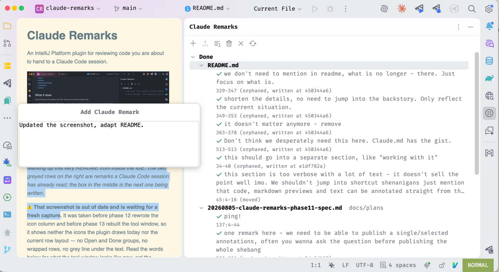
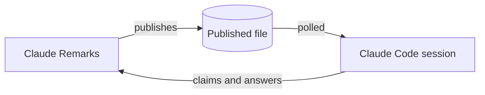
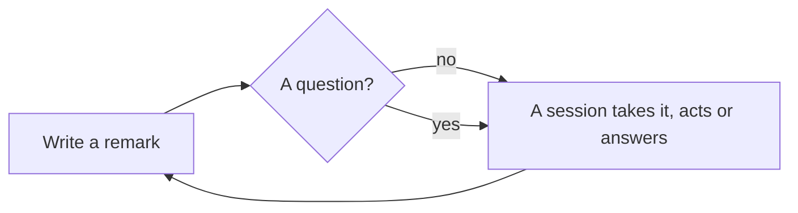
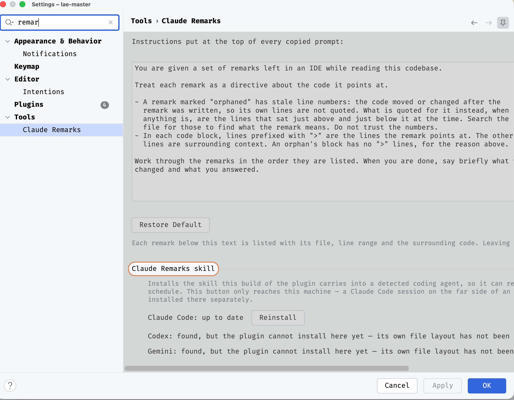

# Claude Remarks

An IntelliJ Platform plugin for reviewing code you are about to hand to a Claude Code session.

If you have used [plannotator](https://github.com/backnotprop/plannotator) or
[revdiff](https://github.com/umputun/revdiff), the shape is familiar: read a change, leave notes on
the lines that need them, hand the notes to an agent. This one does it from inside the IDE, and
three things follow from that.

- **The review surface is the IDE, not a browser page or a terminal overlay.** You read where you
  already read code — go to definition, find usages, the real diff viewer, the rendered markdown
  preview, your own keymap and theme. Nothing is exported somewhere else to be looked at, and a
  remark's gutter icon follows the line as you keep editing around it.
- **The review is continuous. It has no start and no end.** There is no session to open, no page
  waiting for you to press Done. You mark things as you read, for as long as you like, and publish
  when you have something worth sending. A Claude Code session can sit listening the whole time: it
  picks up each batch as it lands, acts on it, and goes back to waiting.
- **A question goes back to the session that already has the context.** Ask Claude publishes that
  question on the spot, and the session answering it is the one that has been reading along with
  you — no re-explaining what the change is. The answer comes back into the IDE, onto the line you
  asked about, instead of into a chat log you then have to map onto code yourself.

The whole thing in four steps:

1. **Install the bundled Claude Code skill** — one button in **Settings → Tools → Claude Remarks**.
2. **Tell a session** `listen for my remarks in this project`.
3. **Read, annotate, ask questions.** Press **Publish Unread** when you have a batch worth sending.
4. **Profit.**



*Marking up this very README from inside the IDE. On the left it is the rendered markdown preview,
not the source: the two tinted paragraphs are the ones remarks already point at, and the box over
them is the next remark being written. On the right the tool window groups what a Claude Code
session has read under Done, one file group per file, each row wrapping over as many lines as it
needs with its position on the grey line underneath.*

**The parts, and what passes between them.** Remarks live in IDE state, never in your files. A
publish writes one file per project under `~/.claude-remarks/`. The session's copy of
`watch-remarks.sh` polls that file, and the session talks back over an HTTP endpoint that listens on
localhost only and wants a token.



**What that looks like from your side.** The loop closes: an answer comes back to the line you asked
about, and you carry on reading.



The plugin holds every remark next to the code without writing a single byte into it, and renders
them into one markdown prompt: your note, the lines it points at, the code itself. That goes to the
clipboard and to a file at the same time, so you can paste it yourself or let the bundled skill pick
it up.

The alternative is typing "in `Foo.kt`, the thing around line 140, could you..." three times in a
row and hoping the model finds it. This is that, but the model gets the exact lines.

**This is early software.** The main path has been run by hand and works; most of the rest has never
been watched running. See [Status](#status) before you decide to rely on it.

---

## Contents

- [What it does](#what-it-does)
- [Where remarks work](#where-remarks-work)
- [Installing](#installing)
- [Working with it](#working-with-it)
- [Asking instead of telling](#asking-instead-of-telling)
- [The Claude Code skill](#the-claude-code-skill)
- [When the IDE is on another machine](#when-the-ide-is-on-another-machine)
- [Status](#status)
- [IdeaVim](#ideavim)
- [Building and testing](#building-and-testing)
- [Licence](#licence)

## What it does

Mark up what you are reading, in the IDE, and hand the marks to Claude Code.

- **Annotate anything the editor shows** — source code, a rendered markdown preview, plain text. A
  remark can cover whole lines, or just a phrase inside one.
- **Nothing is written into your files.** Remarks live in IDE state only, and stay out of version
  control.
- **A remark remembers the code it points at**, and follows it as you keep editing.
- **One press turns every remark into one markdown prompt** — your note, the lines, the code — on the
  clipboard and in a file.
- **Ask a question instead, and read the answer on the line.** `Ctrl+Alt+Shift+A` writes a remark
  that asks, publishes it on the spot, and the answer comes back as its own row in the tool window
  and its own gutter icon on the code.
- **A bundled Claude Code skill reads that file**, so the prompt does not have to be pasted by hand.
  Tell a session `listen for my remarks in this project` and it waits in the background while you
  read, then picks up each batch you publish. See
  [The Claude Code skill](#the-claude-code-skill).

## Where remarks work

- **Source editors** — any file the editor shows, whole lines or a phrase inside one.
- **The rendered markdown preview** — select text in the preview and right-click for either
  `Add Claude Remark` or `Ask Claude`. Annotated elements are highlighted in the preview itself, and
  the highlight follows you as you type.
- **Diff views** — write remarks on the working-copy side, the "after" of a change. ⚠️ The revision
  side is refused rather than stored: its line numbers describe the revision, not the file on disk,
  and the working copy is one click away.
- **No file at all** — a general remark about the project, written from the tool window.

## Installing

Build the plugin zip, then install it from disk:

```bash
./gradlew buildPlugin      # writes build/distributions/claude-remarks-<version>.zip
```

In the IDE: **Settings → Plugins → the gear icon → Install Plugin from Disk…**, pick that zip, and
restart when asked.

⚠️ **Installing the plugin is not the whole job. Install the skill too.** The plugin carries the
Claude Code skill inside it, but a session cannot use it until it is copied out. Open
**Settings → Tools → Claude Remarks** and look for the **Claude Remarks skill** row:



*The row names every coding agent found on the machine. The button beside Claude Code reads
**Install** when the skill is not there and **Reinstall** once it is, as above. Codex and Gemini are
listed without a button, because their own file layouts have not been read yet and a guessed path
writes a file nobody loads.*

Without that press, everything else still works — you write remarks and Publish Unread puts them on
the clipboard — but no session picks them up on its own, and telling one to `listen for my remarks in
this project` does nothing. The IDE also offers the install once in a balloon when a project opens
and the skill is missing, so if you dismissed a balloon, this page is where it went. See
[The Claude Code skill](#the-claude-code-skill).

It needs a 2025.2 or newer build (`sinceBuild = 252`, no upper bound), and an IDE that ships the VCS
module — every JetBrains IDE does, but if the plugin ever fails to load and the tool window simply
is not there, that hard `<depends>com.intellij.modules.vcs</depends>` is the first thing to check.
Building for the first time needs a JDK (17 through 25) and network access; see
[Building and testing](#building-and-testing).

## Working with it

The loop is: read, mark, publish.

1. Read the code. When something is worth saying, select the lines and press `Ctrl+Alt+Shift+R`.
   Type the note.
2. Keep going. The tool window fills up on its own — no refresh needed. Everything you write lands
   under **Open**, and moves to **Done** once an agent has read it or answered it.
3. Press **Publish Unread**. Every remark that has not been read becomes one markdown prompt on the
   clipboard: general remarks first under their own heading, then a section per remark carrying its
   line range, the short sha of the commit it was written against, and the code it points at.
   A balloon says how many remarks across how many files.
4. Paste it into a Claude Code session.

There is a shorter loop for a question. Select the lines, press `Ctrl+Alt+Shift+A`, type the
question, press Enter — that one remark is published immediately, and a session that is listening
answers it back into the IDE. See [Asking instead of telling](#asking-instead-of-telling).

The rows do not disappear when you publish. They stay listed and stay full-strength, because the
next Publish Unread carries them again — that is what makes Publish Selected useful when a paste
went to the wrong window. They go grey only once an agent confirms it read them, and they leave the
list only when you clear them.

**Writing a remark.** Select some lines, press `Ctrl+Alt+Shift+R`, type a note, press Enter. The
same box opens from `Alt+Enter` ("Add Claude Remark") and from the editor's right-click menu,
including inside a diff. `Cmd+Ctrl+Shift+Space`
(`Ctrl+Alt+Shift+Space` off macOS) inserts a class name from the project at the caret; it is
deliberately not `Ctrl+Space`, because the IDE offers Basic Completion even inside a popup and macOS
takes that combination for switching input source.

The box asks for nothing but the text. It used to offer a tag chip row and every remark carried a
severity level, and both are gone: in real use the severity was never changed from its default and a
tag was never picked, so every remark ever published went out as an untagged `should` while the
prompt spent a paragraph teaching a scale it then used one value of.

**Remarks follow the code.** A gutter icon appears on the marked lines. As you keep editing, the
plugin re-finds the marked block by hashing it and by matching the lines around it — so text that
moved is followed, and text that cannot be found is shown as orphaned with its stale line numbers
rather than being quietly relocated onto the wrong code. Nothing is ever moved silently. Click the
icon for that remark's own menu: edit, delete, Ask for an Answer, or Publish. That
Publish takes exactly the one remark under the icon, which is the short way to hand over a single
note without opening the tool window at all.

**A remark can point at part of a line.** Select a phrase rather than whole lines and the remark
stores the exact words as well as the columns, so it can find them again after the paragraph
reflows. The published prompt draws `⟦`/`⟧` markers around those words inside the quoted code, and
the tree row and gutter tooltip show the column range next to the line number.

**A remark can also be written on rendered markdown.** Select words in IntelliJ's markdown preview,
right-click, and pick **Add Claude Remark** or **Ask Claude** — the same pair the editor offers, doing
the same two things. The remark points at the same characters in the `.md` source behind the selection.

The preview also shows you what is already marked up. The element a remark points at — the paragraph,
the list item, the heading — gets a faint background, and a question still waiting for an answer gets a
different colour from a plain remark. It is the whole element rather than the exact words, on purpose:
the position the preview publishes is an offset into the source, and rendered text is not source text,
so there is no honest way to light up four rendered characters from a source range that covers eight.
The highlight appears as soon as you open a preview on an annotated file, and it survives you typing in
the source beside it.

All of this needs the Markdown plugin, which every JetBrains IDE bundles. With it disabled, those two
entry points and the highlighting are simply absent and everything else is unchanged.

**A remark about nothing in particular.** Press Add General Remark in the tool window for a note
about the whole change rather than one file. It is rendered first in the prompt, under its own
`## General` heading with no code block, and sits at the very top of the tree.

**The tool window is a tree, split into Open and Done.** Open holds what is still the work. Done
holds what an agent has read, or answered. Inside each of the two, remarks are grouped by file, with
a General group above the files for remarks about no file in particular. An answer sits under the
question it answers, as a child row — so an answered question moves to Done and takes its answer with
it. Done starts collapsed, and stays open across a refresh once you open it. A group called **Answers
with no question** appears above Open when some answer's question has been cleared.

Inside a file, Open is oldest first, so a remark you just wrote lands at the bottom and nothing above
it jumps. Done is newest-processed first, so whatever an agent just picked up is the top row of its
file group. The file groups themselves stay in path order on both sides, so Done is a list of files,
each newest-first inside itself, rather than one newest-first list. Everything inside Done is expanded
already, so opening Done is one click to whatever arrived. Resizing the tool window re-wraps the rows
a moment after you let go of the edge.

Right-click a row for the same menu the gutter icon offers. Delete removes the rows you picked out
without asking, and takes a question's answer with it; on a group node it stands for everything
underneath and asks first. Nothing in the tree can be dragged.

**A row is as tall as it needs to be**, up to three lines of wrapped text, with a fourth line elided
rather than cropped. Line breaks you typed with Shift+Enter are kept. Under the text sits one grey
line with the line range, a `(moved)` or `(orphaned…)` note when there is one, and — for an answer
whose question is gone — the file name. A remark about no file has no grey line at all.

**Six toolbar buttons.**

| Button | What it takes |
| --- | --- |
| Add General Remark | Nothing. Opens the input box for a remark about no file |
| Publish Unread | Every remark that is not yet **read** — pending and published alike |
| Publish Selected | Exactly the selected rows, already-published and already-read ones included |
| Clear Handed Over | Every remark that has been published or read. Answers are kept. Asks first, archives first |
| Clear All | Everything, including work you never published, and the answers too. Asks first, archives first |
| Refresh | Nothing. Re-resolves every remark against the files as they are now |

Each button's tooltip carries that second line, so hovering says what the button *takes* rather than
repeating its own name.

Selecting a file group, or Open itself, and pressing Publish Selected publishes everything under it.
**Tools → Publish Unread Claude Remarks** does the same
thing as Publish Unread without the tool window open, and can be given a shortcut in the keymap.

**Three states, and only an agent can grant the third.**

| State | Meaning | Text | Icon, plain remark | Icon, question |
| --- | --- | --- | --- | --- |
| `PENDING` | Written, handed nowhere | Full strength | Note | Neutral question mark |
| `PUBLISHED` | Handed to a channel that cannot confirm a read | Full strength | Neutral tick | Yellow question mark |
| `READ` | An agent said it actually read this one | Grey | Green tick | Yellow question mark |
| | An answer has come back | Full strength | — | Green question mark |

Colour and icon answer two different questions, and that is deliberate. **The colour says whether
this is still the work**, which has two answers: Publish Unread carries a published remark again, so
a published remark is not finished and must not look finished. **The icon says how far this one got,
and whether it is a question at all.** A plain remark walks a note, then a neutral tick, then a green
tick. A question walks three colours of the same question mark. A question that has been read but not
answered stays yellow, because green is earned by an answer arriving and by nothing else.
`ui/RemarkStatusLook.kt` is the single place that decides all of this, read by the gutter icon and
the tree alike.

Publishing can never produce `READ`, however many times it runs. Only an agent's own
acknowledgement can, naming the nonce of the batch it read. Publishing a read remark again
hands it over as `PUBLISHED`, because nothing has confirmed that second handover.

The same line decides Open against Done: a row is Done once it is `READ`, or once an answer has come
back for it, and Open until then. The row itself no longer spells the state out in words at the end —
the icon, the colour and the group it sits in all say it, and three copies of one fact is two too
many.

**Where all this lives.** Remarks and answers are both stored in `.idea/workspace.xml`, which the IDE's own generated
`.idea/.gitignore` excludes — so they stay out of version control with no extra work. A repository
that deliberately tracks `workspace.xml` is the exception, and there they would be committed like
any other change to that file. Clearing archives the remarks to a markdown file in the IDE's
configuration directory, under `claude-remarks/`, before removing anything, and removes nothing if
that write fails. That file is outside every project, so it cannot be committed by accident either.
A single Delete on one row is the exception and does not archive: picking out one row and deleting
it means "this one was a mistake", and archiving every typo would make the history useless to read.

**The prompt header is yours.** Edit it in **Settings → Tools → Claude Remarks**.

Everything above works with nothing installed on the other end and nothing listening. The rest of
this file is about the other end.

## Asking instead of telling

An ordinary remark is work to do, or a topic to raise. It travels with the next publish and nothing
comes back. A question is different, and the gesture says which one you meant, so nothing has to
guess from your wording.

Select the lines, press `Ctrl+Alt+Shift+A`, type the question, press Enter. The same box opens from
`Alt+Enter` ("Ask Claude about these lines") and from the editor's right-click menu. That remark is
stored marked as asking for an answer **and published immediately** — asking is one motion, not five
steps through the tool window. One thing follows from it being an ordinary publish: it writes the
clipboard too, the same as any other.

The batch it publishes is every question still waiting for an answer, not only the one you just
typed. Usually that is the same thing, because there is only one. It matters when you ask twice in a
row: each publish rewrites the published file, and a session looks at that file every couple of
seconds, so a second question sent too quickly would otherwise replace the first one before anybody
read it. Carrying the earlier question again makes that harmless. A question that already has an
answer is left out, so nothing is asked twice.

You can also mark a remark you already wrote: right-click it, or click its gutter icon, and turn
**Ask for an Answer** on. That only sets the flag — it publishes nothing. A marked row draws a
question mark in place of the note, and the mark turns green when the answer arrives.

**The answer comes back into the IDE.** A session that reads the batch sees which remarks are marked,
answers each one, and posts the answer back. In the IDE it becomes:

- a row in the tool window directly under the question it answers, showing the answer's first line;
- a gutter icon on the code the question was about, which follows that code as you keep editing;
- a popup rendering the whole answer — headings, lists, tables, code fences — opened by clicking the
  gutter icon or double-clicking the row.

An answer is its own thing, not a property of the question. It keeps its own anchor, so it follows
the code by itself, and it survives its question being cleared: Clear Handed Over takes the remarks
and leaves the answers, so a reading pass can be cleared while what you learned stays. An answer with
no question left to sit under moves to a group called **Answers with no question** at the top of the
tree, which is the only thing that group holds. Clear All
takes both, says so before it does, and archives both to the history file first. Asking the same
question twice replaces the answer rather than adding a second one.

This needs a Claude Code session that is actually listening, below. With nothing listening, an Ask
Claude remark is just a published remark with a marker in the prompt, and pasting the prompt by hand
works as it always did.

## The Claude Code skill

The skill that reads remarks out of the IDE is a normal Claude Code skill, and since phase 15 its
three files live inside the plugin's own resources, under
`src/main/resources/dev/sasha/clauderemarks/skill/`. The ordinary way to install it is the Install
button on the plugin's settings page (Settings → Tools → Claude Remarks), which copies the three
files out of the running plugin. The fallback, for a checkout with no plugin build to hand, is to
symlink or copy the directory into `~/.claude/skills/` by hand:

```sh
ln -s "$(pwd)/src/main/resources/dev/sasha/clauderemarks/skill" ~/.claude/skills/claude-remarks
# or
cp -r src/main/resources/dev/sasha/clauderemarks/skill ~/.claude/skills/claude-remarks
```

⚠️ The directory was `docs/skill/claude-remarks/` until phase 15 moved it into the plugin's own
resources, and `claude-remarks-review` before that, until review mode was retired. An install made
before either move is a dangling symlink and has to be recreated with one of the commands above.

It is kept in this repository rather than only under `~/.claude/skills` because the skill and the
IDE endpoint it talks to are one protocol, with five pairs of halves that have to agree — the request
shape and answers of each of the four endpoint actions, plus the five fixed header lines and their
three readers. Keeping both halves of each in one place is what stops them drifting.
`docs/skill/README.md` spells all five out.

The skill has three modes.

### Put files in front of me

You ask Claude Code to show you something — a diff, a commit, a named set of files. It posts one
request to the IDE and returns. The files that have a local change open as one diff window with
next-file navigation, and the rest open as plain editors. Nothing is started, nothing is waited for,
and no remark is involved yet. Then you read and mark up as usual.

### Listen mode — the convenient one

You ask Claude Code, in words, to watch for your remarks. It starts a background watcher on the
published file and then leaves you alone. You read code, mark it up, and press Publish when you have
something worth handing over; the watcher picks the batch up and Claude Code reports what arrived.
Nothing appears in the IDE and nothing interrupts you while you read.

**It never starts on its own.** Noticing that a file has been published is not the same as being
asked. This is a design decision, not an oversight: a skill that begins watching because it saw
something interesting would be watching a person who did not ask to be watched. You have to say it.

One thing it will not do unasked: when a batch arrives, it summarises what came in and waits for you
to say go, rather than acting on it. A listener runs unattended for hours, and nobody chose that
exact moment for the work to start. Answering a question marked with Ask Claude is the exception, and
a deliberate one — you already asked.

**It picks up whatever is already waiting.** If you published first and asked afterwards, that batch
is the first thing it reads.

**It keeps listening after every batch**, so publish as often as you like without asking again.
Several sessions can listen to one repository at once; the first to claim a batch acts on it, and the
others tell you who got it and carry on waiting.

It waits up to twelve hours, and every batch resets that clock. To stop it sooner, tell the session
to stop listening.

### Read what is already published

You published, and you want it acted on now. The skill computes the published file's path from the
repository root, reads it, acknowledges the batch by its nonce — which is what turns the rows grey —
and gets to work. Nothing is waited for.

This is the mode to reach for when you published first and asked afterwards.

### Why the skill waits with a script

A foreground `Bash` call is capped at ten minutes. A launched background command is not, and
`watch-remarks.sh` is what lets listen mode wait out a real twelve hours instead of pretending to.
It is the only mode that waits. The one-shot read reads the file inline, and putting files in front of
you is one request and an answer.

## When the IDE is on another machine

Both the handshake file and the published file are local paths on the machine the IDE runs on, so a
Claude Code session on that same machine just reads them. That is the normal case and needs nothing
beyond installing the skill.

Reaching a session on another machine needs an SSH tunnel you set up by hand with `ssh -R`, and four
values handed to the skill: the tunnel's local port on the agent machine, the token from the IDE
machine's handshake file, the repository path as the IDE machine sees it, and the host if it is not
`127.0.0.1`. The skill stores those four after the first time, keyed to the repository, so they are
not retyped every run. The endpoint's `fetch` action is what makes this work at all: it returns the
file's content in the response body rather than a path, since a path on the IDE machine means
nothing to an agent on a different one.

Nothing about a missing tunnel is silent. The built-in server binds `127.0.0.1` only, so a request
with no tunnel gets connection refused, and the skill says so and stops rather than retrying or
guessing. That same binding, plus a per-run token and the refusal of any request carrying `Origin`
or `Referer`, is the whole security model.

The two commands that read the port and the token, and the `ssh -R` line that starts the tunnel, are
in the "Over SSH: the IDE on another machine" section of
`src/main/resources/dev/sasha/clauderemarks/skill/SKILL.md`. They are not repeated here, so there is
one copy to keep right.

## Status

Early, and honestly so.

The automated suite is green, and it is a real suite — anchoring, storage, the renderer, the
resolver, the tree, the endpoint, the answer round trip. But there are no UI-rendering and no
end-to-end tests, and `./gradlew test` runs no shell, so it never touches the two scripts the skill
ships. Everything that is drawn, clicked or written in shell is checked by a person or not at all.

**The path you will walk first has been walked.** On `0.12.0` these were run by hand in a real IDE
and worked: installing the skill from Settings → Tools → Claude Remarks on a machine that had no
copy; writing a remark, publishing it, and having a Claude Code session read the batch; the tool
window's Open and Done groups, a row whose text wraps, and an answer sitting under its question; and
the notification on project open when the skill is missing. The screenshot at the top of this page
is the other half of that — it is a real IDE, and the tinted paragraphs in it are the preview
highlighting doing its job.

Before that, exactly one gating run had happened, on version `0.6.0`, and it exercised the review
mode that no longer exists. What it still proves is the part that survived: the plugin loads, the
handshake is found, a publish renders correctly with its sub-line markers, an acknowledgement really
does mark remarks read, and the endpoint works across an SSH tunnel to another machine.

**What is still unproven is most of the rest.** ⚠️ That includes **the whole Ask Claude round
trip** — the gesture, the answer coming back over the endpoint, the answer's gutter icon and the
markdown popup — **and all three question-mark icons**, whose colours nothing automated can tell
apart. It also includes the watcher script's streaming shape, the skill's remaining modes, the
acknowledgement by nonce, and the preview's two right-click actions. `docs/claude/hand-checks.md`
is the live list of what is owed, and it points at the per-phase lists in `docs/plans/`.

If you try it, expect to find things. It has had very little real use outside its own test suite.

## IdeaVim

IdeaVim can run any registered action by id with `:action <id>`, so the plugin works from a
`.ideavimrc` mapping with no extra code. These four ids are a public interface and will not be
renamed:

| Id | What it does |
| --- | --- |
| `ClaudeRemarks.AddRemark` | Open the remark box on the selection, or on the caret line |
| `ClaudeRemarks.AskClaude` | Ask a question about the selection and publish it on the spot |
| `ClaudeRemarks.CopyAll` | Publish every unread remark into one prompt on the clipboard |
| `ActivateClaudeRemarksToolWindow` | Open and focus the Claude Remarks tool window |

`ClaudeRemarks.CopyAll` keeps the word CopyAll on purpose. The button it drives has been called
Publish Unread since phase 10, but the id is the part promised above, and renaming it would break
every mapping to it with no error anywhere — IdeaVim fails an unknown id inside IdeaVim, not here.

There are two more ids, `ClaudeRemarks.AddPreviewRemark` and `ClaudeRemarks.AskClaudePreview`, for the
two markdown preview entry points. They are deliberately not in that table: they are registered only
where the markdown preview exists, so they are absent when the Markdown plugin is off, and a mapping to
either would then do nothing.

```vim
nnoremap <leader>r :action ClaudeRemarks.AddRemark<CR>
vnoremap <leader>r :action ClaudeRemarks.AddRemark<CR>
vnoremap <leader>a :action ClaudeRemarks.AskClaude<CR>
nnoremap <leader>c :action ClaudeRemarks.CopyAll<CR>
nnoremap <leader>R :action ActivateClaudeRemarksToolWindow<CR>
```

Two things to check the first time rather than assume:

- **Visual mode.** Select with `V`, then `<leader>r`. `:action` invoked from visual mode has
  historically been awkward about whether the selection still exists when the action runs. The
  action reads `editor.selectionModel`, so if the selection is gone you get a one-line remark
  instead of the block you chose. That fix is on the mapping side, not in the plugin.
- **Typing in the box.** It is a plain Swing text area, which IdeaVim does not touch, so typing,
  Enter and Escape all behave normally.

## Building and testing

You need a JDK (17 through 25) and network access on the first build. Gradle comes with the project
as a wrapper. The first run downloads its own JDK 21 through the foojay resolver and the IDEA 2025.2
distribution, which took about 3m30s on a cold cache.

```bash
./gradlew build            # compile, test, assemble
./gradlew test             # the suite on its own
./gradlew buildPlugin      # build/distributions/claude-remarks-<version>.zip
./gradlew runIde           # a sandbox IDE with the plugin loaded
```

Roughly two thirds of the suite is plain JUnit with no fixture and runs in milliseconds: anchoring
and the sub-line phrase functions, the stored state's XML round trip, the resolver helpers, the
tree's node-building, the markdown renderer, the settings round trip, the commit reader against real
`.git` directories built on disk, the history file's rendering, the published file's header, and the
pure halves of the endpoint. The rest start a light IDE fixture and are slower, because each
goes through a real project service, a real `Document` or a real markup model. No test count is
given here on purpose: it goes stale on the next commit, and `./gradlew test` prints the real one.

`./gradlew runIde` starts an interactive sandbox IDE that never exits on its own — fine for a person,
not for an agent session.

**Two files that ship with the plugin have no automated check at all.** The suite is Kotlin and runs
no shell, so it never touches
`src/main/resources/dev/sasha/clauderemarks/skill/watch-remarks.sh` or `remote-config.sh` —
everything the skill's waiting and its stored remote configuration are built on. Both are checked by
hand instead, each check its own run; `CLAUDE.md`'s Testing section lists what those cover. A green
suite says nothing about either.

There are also no UI-rendering or end-to-end tests. The popup appearing at the caret, the gutter
icon painting, the tree colours, the balloon and the settings page layout are all hand checks.

## Licence

MIT. See [`LICENSE`](LICENSE).
