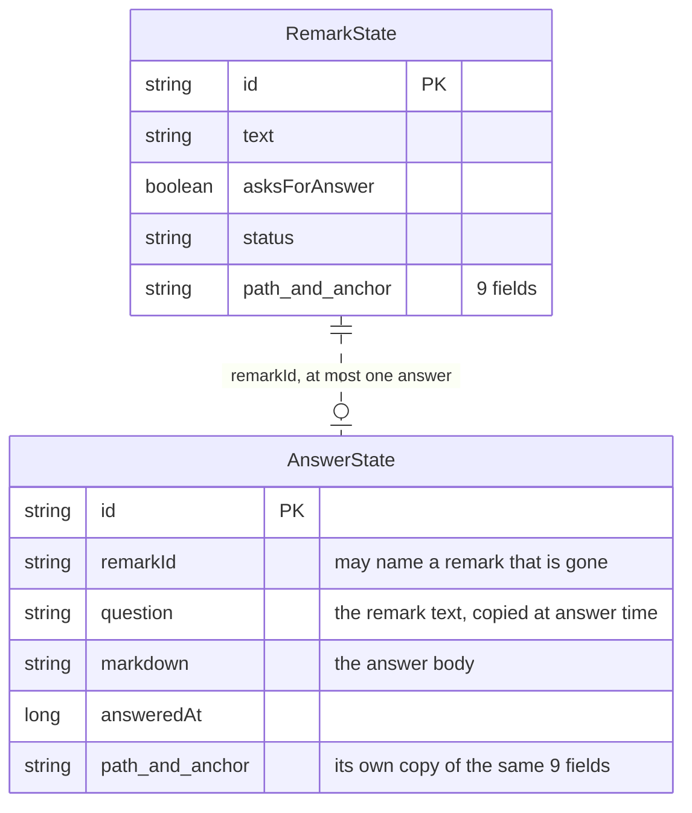

# Claude Remarks — Design Document

## Contents

1. [Overview](#overview)
2. [The Data Model](#the-data-model)
3. [The Anchoring Design](#the-anchoring-design)
4. [From Stored Remarks to Tool Window Rows](#from-stored-remarks-to-tool-window-rows)
5. [The ProjectUtil Trap](#the-projectutil-trap)
6. [Why the Bookmarks API Was Rejected](#why-the-bookmarks-api-was-rejected)
7. [What Phases 3-4 Built](#what-phases-3-4-built)
8. [What Phase 5 Built](#what-phase-5-built)
9. [Adding a Remark While Reading a Diff](#adding-a-remark-while-reading-a-diff)
10. [The Editor Side](#the-editor-side)
11. [The Change Notification](#the-change-notification)
12. [The Publish Pipeline](#the-publish-pipeline)
13. [A Remark About No File](#a-remark-about-no-file)
14. [One Pass Over The Tree](#one-pass-over-the-tree)
15. [Open, Done, and Rows That Wrap](#open-done-and-rows-that-wrap)
16. [A Remark on the Rendered Preview](#a-remark-on-the-rendered-preview)
17. [The Endpoint the Skill Talks To](#the-endpoint-the-skill-talks-to)
18. [The Ask Claude Gesture](#the-ask-claude-gesture)
19. [What an Answer Is](#what-an-answer-is)
20. [Two Positions On Screen, And When They Differ](#two-positions-on-screen-and-when-they-differ)
21. [Build Choices Worth Remembering](#build-choices-worth-remembering)
22. [Performance Tuning Knobs](#performance-tuning-knobs)
23. [Known Issues](#known-issues)

## Overview

A remark is a short note you attach to a line range in a file without modifying the file itself. The plugin stores all remarks persistently so they survive IDE restarts. If the file changes, the plugin checks whether the remark still points at the right lines.

This document describes how remarks are stored and kept pointed at the correct lines. Future sessions should be able to read this and understand the system without re-reading the source code.

## The Data Model

### What a Remark Contains

A remark has these fields:

- `id`: A unique identifier (generated UUID).
- `path`: The file path, relative to the project root. Produced by `VfsUtilCore.getRelativePath(file, projectRoot)`. This is what gets shown in the tool window and written into dispatch prompts.
- `startLine`, `endLine`: The 0-based, inclusive line numbers of the anchored range.
- `text`: The user's note (what they wrote in the remark).
- `asksForAnswer`: A boolean, false by default. True means this remark is a question the agent is
  meant to answer, not work to do. Set by the Ask Claude gesture (`action/AskClaudeAction.kt`) or by
  the Ask for an Answer toggle in the shared menu, and read by the prompt renderer, which marks such
  a remark's heading, and by the tree row. Defaults to false, so `BaseState` omits it from the XML
  and nothing migrates. See "The Ask Claude Gesture" below.
- `status`: One of `RemarkStatus.PENDING`, `PUBLISHED` or `READ`. Defaults to `PENDING`. Set to
  `PUBLISHED` by `markRemarksPublished` once a publish reaches the clipboard or the published file,
  and to `READ` by `markRemarksRead` once a review acknowledgement says an agent read it. See "The
  three states, and why published is not read" below. Published and read remarks both stay in the
  list, drawn gray, until Clear Handed Over.
- `createdAt`: Timestamp when the remark was created.
- `readAt`: Timestamp of the moment an agent's acknowledgement marked this remark `READ`, and 0 when
  nothing ever did — which includes every remark stored before phase 13 added the field. Stamped in
  `RemarkStore.markRead`, and only there, so a second acknowledgement of the same remark leaves the
  first stamp alone. Guard 6 in `CLAUDE.md` allows exactly two files to reach `markRemarksRead`,
  which is what makes this a single-writer field by construction. Done orders by it; see "Open and
  Done" below.
- `textHash`: The first 16 hex characters of a SHA-256 hash of the lines at creation time.
- `contextBefore`, `contextAfter`: A few lines of context from above and below the remark, joined with newlines in a single string. Stored this way instead of as a list because the serializer handles single strings more predictably.
- `commit`: The repository HEAD read straight out of `.git` when the remark was written, or null
  when there was no readable git repository. Never refreshed. See "The commit stamp" below.

All fields are stored flat on a single `<RemarkState>` element, with no nesting. `BaseState` writes
each property as an `<option name="…" value="…"/>` child element, **not** as an XML attribute on the
element itself, and it omits a property still sitting at its default. So a stored remark looks like
this:

```xml
<RemarkState>
  <option name="id" value="r-1" />
  <option name="path" value="src/Foo.kt" />
  <option name="text" value="why is this synchronized" />
</RemarkState>
```

**Two fields were deleted in phase 11: `tag` and `severity`.** Neither was ever used. Severity was
never changed from its default and a tag was never picked, so every remark ever published shipped as
an untagged `should`, while the prompt spent a paragraph teaching a four-level scale it then used one
value of and the input popup carried a chip row with five key bindings for a field nobody set. The
enums `RemarkTag` and `RemarkSeverity` and both `label` extensions went with them. An element written
before that, carrying `<option name="severity" value="MUST"/>` and `<option name="tag" value="BUG"/>`,
still loads: the deserializer skips an `<option>` it has no property for, and the two options are
dropped on the next save. `RemarkStoreStateTest` pins that, and it is the reason nothing had to
migrate.

**A third field went the same way in phase 13: `bucket`.** The tree level it fed is gone, and so is
the whole drag and drop that existed to fill it. See "Buckets" below for what it was and why it went.
The migration story is the one above, word for word: an element carrying
`<option name="bucket" value="auth refactor"/>` still loads and drops that option on the next save,
and `RemarkStoreStateTest` pins it in `<option>` form for the reason the warning below gives.

⚠️ **A migration test has to be written in that `<option>` form.** Attribute form —
`<RemarkState id="r-1" severity="MUST"/>` — is not a shape any `workspace.xml` has ever held, and it
parses into a `RemarkState` with every property still at its default. A test written that way passes
against any `RemarkState` at all, including one that dropped every field the test claims to check.
Four of the tests in `RemarkStoreStateTest` were written that way and were vacuous until phase 11's
review rewrote them; the warning on the first of them says so.

There is a second stored record beside this one since phase 11, `model/AnswerState.kt`. See "What an
Answer Is" below.

### Where Remarks are Stored

Remarks are stored in `.idea/workspace.xml` using the IntelliJ Platform's persistence API, under
`@State(name = "ClaudeRemarks")`. That name is the element to look for when checking the file by
hand: `<component name="ClaudeRemarks">`.

Why this location:

- The IDE's generated `.idea/.gitignore` excludes `/workspace.xml`. No extra work is needed to keep remarks out of version control.
- This is where the IDE keeps other local-only data like breakpoints and bookmarks.

Why not a custom file like `.idea/claudeRemarks.xml`:

- The IDE's `.gitignore` does not cover custom files. They would be committed in any repository that tracks `.idea/`.

Why not `CACHE_FILE`:

- It stores outside the project, which would work, but "Invalidate Caches" would silently wipe all remarks. We never silently delete anything.

Storage is configured with `RoamingType.DISABLED` so remarks do not travel through JetBrains Settings Sync to other machines, where file paths would not resolve.

### How Remarks are Persisted

The `RemarkStore` class implements `PersistentStateComponentWithModificationTracker<RemarksState>` itself, rather than extending `SimplePersistentStateComponent`. Why is in "Why the serializer is handed a copy" below. The nested `RemarksState` class extends `BaseState` and holds a list of `RemarkState` objects.

The list property uses this annotation:

```kotlin
@get:XCollection(style = XCollection.Style.v2)
val remarks by list<RemarkState>()
```

**This annotation is critical.** Without `@get:XCollection(style = XCollection.Style.v2)`, the entire list serializes to an empty element and every remark is silently lost on IDE restart, with no error logged. See `RemarkStoreStateTest` in the test suite — it is the regression guard for this exact trap.

`RemarksState` holds a second list since phase 11, on exactly the same terms:

```kotlin
@get:XCollection(style = XCollection.Style.v2)
val answers by list<AnswerState>()
```

⚠️ The annotation is not optional there either, and this trap had already cost this project once. So
the guard was written *before* the list existed — `AnswerStateTest` and the two new tests in
`RemarkStoreStateTest` were confirmed failing for the right reason first, which is what makes them
worth anything. A guard that was green before the feature existed guards nothing.

The mutators (`addRemark`, `removeRemark`) live on the state class, not on the store, because
`incrementModificationCount()` is protected: it is only reachable from inside a `BaseState`
subclass.

A note on that call, because an earlier version of this document had the reason wrong. The list
property does track structural changes on its own: `ListStoredProperty.getModificationCount()`
compares the list's own `modCount` against the last one it saw, and `BaseState` sums the property
counts on top of its own. So adding or removing a remark already marks the state dirty, and
removing the `incrementModificationCount()` calls does not lose data. They are kept because they
are one cheap line that makes every mutation mark the state changed without having to reason about
what the property tracker sees. `RemarkStoreStateTest` asserts the modification count goes
up after an add and after a real remove, and stays put when `removeRemark` is given an unknown id.

Every method on the state class (`addRemark`, `removeRemark`, `editRemark`, `markPublished`,
`markRead`, `removeHandedOver`, `clear`, `snapshot`, `modCount`) is `@Synchronized` on the state
object, so they all
lock the same monitor. The tool window resolves remarks from a pooled
thread while the editor action adds them on the EDT, and the backing collection is
`ModCountableList`, a plain `ArrayList` subclass with no thread safety. A read action does not
help: it guards platform data, not ours. `RemarkStore.all()` returns `liveState.snapshot()`, a copy
taken under that same lock, `RemarkStore.getState()` takes its copy through the same `snapshot()`
call, and `RemarkStore.getStateModificationCount()` reads the count through `modCount()` instead of
touching the live `modificationCount` property directly. That last one was a real gap, not just
belt-and-suspenders: `BaseState.getModificationCount()` sums each stored property's own
modification count, and for the `remarks` list that means `ListStoredProperty.getModificationCount()`
iterating the live list with a for-each, without a lock of its own. Before `modCount()` existed, the
platform's save pass (which calls `getStateModificationCount()` off the EDT) could iterate the list
while the editor action mutated it on the EDT, throwing `ConcurrentModificationException`. See
"Why the Serializer Is Handed a Copy" below for how that surfaces and how it was fixed.

### Why the Serializer Is Handed a Copy

The platform's state serializer is a third reader of that list, and it never takes the lock.
Workspace saving runs off the EDT. So whatever object `getState()` returns must be an object no
other thread can change while the serializer walks it.

`getStateModificationCount()` is a fourth reader, and it used to bypass the lock entirely: the
override read `liveState.modificationCount` straight off the live state object, and
`BaseState.getModificationCount()` walks the `remarks` list (through
`ListStoredProperty.getModificationCount()`) with no synchronization of its own. The platform calls
`getStateModificationCount()` on every save pass, off the EDT, right before deciding whether to
call `getState()` at all — so a save landing while the editor action was adding a remark on the EDT
could throw `ConcurrentModificationException` from that count read alone, without ever reaching
`getState()`. The fix is `RemarksState.modCount()`, a fourth `@Synchronized` method that reads
`modificationCount` under the same lock `addRemark`, `removeRemark`, and `snapshot` already hold;
`getStateModificationCount()` now calls it instead of touching the live property directly.
`RemarkStoreStateTest` has a concurrency probe for this: one thread adding remarks in a loop while
another reads `stateModificationCount`, asserting nothing escapes.

That is the whole reason `RemarkStore` does not extend `SimplePersistentStateComponent`. That base
class hands out the live state object and does not let a subclass change it — `javap` against the
2025.2 jars:

```
public abstract class SimplePersistentStateComponent<T extends BaseState>
        implements PersistentStateComponentWithModificationTracker<T> {
  public final T getState();                        // final
  public final long getStateModificationCount();    // final
  public void loadState(T);
}
```

The interface underneath has no such restriction:

```
public interface PersistentStateComponent<T> {
  public abstract T getState();
  public abstract void loadState(T);
  public default void noStateLoaded();
  public default void initializeComponent();
}
```

So `RemarkStore` implements `PersistentStateComponentWithModificationTracker<RemarksState>`
directly:

- The live state sits in a private `@Volatile` field. That matches what the base class did with its
  own `private volatile T state`.
- `getState()` builds a new `RemarksState` and fills its list from `snapshot()`. The copy is taken
  under the same lock the mutators hold, and it copies the remarks as well as the list, so the
  serializer walks objects nothing else can reach.
- `loadState(state)` swaps the field.
- `getStateModificationCount()` returns the live state's count, read through `modCount()` so that
  read also takes the lock. It is kept because dropping it would change when the platform saves:
  with a modification tracker the platform compares this number against the one it last saw and
  skips the component when nothing changed, so on an idle save `getState()` is not called at all.

The `@State(name = "ClaudeRemarks", ...)` annotation, the storage, and the `@get:XCollection` on the
list are all untouched, so what lands in `workspace.xml` is byte-for-byte the same shape as before.

**The copy goes all the way down: `snapshot()` copies each `RemarkState` too, so no reader shares
an object with the live state.** It did not always. It used to be `remarks.toList()`, which copies
the list and shares its elements, and there are two different readers to answer for. Both matter,
and for a long time only the first was written down here.

*The serializer, saving `workspace.xml` off the EDT.* `editRemark` writes `text`; `markPublished`
writes `status`. With the shallow copy a save could land between one of those writes and the
modification count going up, and record the value from before it. That could never become permanent,
and the reason is the ORDER inside each mutator: `incrementModificationCount()` runs after the write,
so a save landing in between recorded the lower count it read on the way in, and the next save saw a
higher count and wrote the field again. One save stale, the one after it right, no path to permanent
loss. (Until phase 11 `editRemark` wrote two fields, `text` and then `tag`, and the argument was
about a save landing between the two of them. The tag is gone; the ordering argument is the same.)

*The prompt and the tool window, reading on a pooled thread.* `resolveAll` and `collectForPrompt`
run inside a non-blocking read action, off the EDT, and walk the same objects `editRemark` and
`markPublished` change on the EDT. They read the fields long after leaving the store's lock — for as
long as resolving every remark and slicing every file takes. The ordering argument above says
nothing about this reader: it is about what ends up on disk, and a prompt that already reached the
clipboard has no later pass to fix it. So the shallow copy handed the reader the live object: the
same field read twice came back with two answers, and a prompt could be rendered from a remark that
was never in one piece — or a remark whose edit had landed a moment earlier was published and then
marked published, so the edit looked delivered when it was not. Narrow — the window is one publish —
but real, and invisible when it happens.

Making `snapshot()` deep closes the second reader without weakening the first. `BaseState.copyFrom`
walks the property list every `BaseState` registers for itself, so a field added to `RemarkState`
later is copied with no edit to `snapshot()`. That was the one recorded argument against a deep
copy: cloning field by field, and a forgotten field then dropping out of `workspace.xml` with
nothing logged. `copyFrom` has no such failure mode, and `RemarkStoreStateTest` pins it by comparing
the serialized XML of a fully-populated remark against its copy, so the guard covers fields that do
not exist yet. It also holds a deterministic test (a snapshot taken before an edit does not see it)
and a bounded race probe (a reader looping on `snapshot()` while a writer flips `text` never sees the
text change under the object it is already holding); the probe fails within milliseconds if
`snapshot()` goes back to `remarks.toList()`. The probe used to pair `text` against `tag` and look
for a mixed pair. Phase 11 took the tag off a remark, so there is no second field left to catch half
written, and the probe was rewritten to check the thing the deep copy actually buys.

The cost: one small object per remark per call, and `snapshot()` runs on every resolve, which is
every remark change and every editor open. A `RemarkState` is sixteen stored properties, so a hundred
remarks is tens of microseconds against a resolve that SHA-256s candidate positions and splits whole
documents into lines. If a project ever holds enough remarks for that to be felt, the next step is
not a shallower copy but an immutable value type for the read path, so the copy happens once at the
store boundary and nothing downstream holds a `BaseState` at all.

One thing the copy does not fix, because nothing can: an edit that lands *after* the snapshot is not
in it. A copy in flight sends what the remarks said when it started. That is ordering, not a data
race, and it is what "snapshot then act" means.

Two things about the platform side, both read out of the bytecode before making the change:

- The platform keeps the last modification count it saw in its own
  `ComponentWithStateModificationTrackerInfo.lastModificationCount` field, not on the state object.
  So returning a fresh object from `getState()` does not confuse its dirty tracking. The only
  `resetModificationCount()` call anywhere near this is in `XmlSerializer.deserializeAndLoadState`,
  and that runs on the way in, on the object about to be passed to `loadState`.
- The platform finds the state class by reflecting over the component's generic signature. It used
  to read it off the `SimplePersistentStateComponent` superclass and now has to read it off an
  implemented interface. `RemarkStoreStateTest` asserts that
  `ComponentSerializationUtil.getStateClass(RemarkStore::class.java)` still answers `RemarksState`,
  because if that ever stopped working every stored remark would vanish on restart with nothing
  logged.

`RemarkStoreStateTest` also holds the two guards for the copy itself: the state a previous
`getState()` handed out does not change when a remark is added afterwards, and two calls to
`getState()` never return the same list instance. Both were checked by mutation — making
`getState()` return the live state makes both fail.

## The Anchoring Design

Anchoring solves this problem: you mark lines 10-12 in a file. Then someone edits the file — adds lines above, changes the marked lines themselves, deletes their context. Your remark needs to say "these lines moved" or "I could not find them" rather than silently staying at the wrong place.

### The Anchor and AnchorResult Types

An `Anchor` holds:

- `startLine`, `endLine`: The original 0-based line numbers (0-based, inclusive).
- `textHash`: First 16 hex chars of SHA-256 over the trimmed lines. Trimming means reformatting that only changes indentation still resolves.
- `contextBefore`, `contextAfter`: Lists of the 3 lines above and below (by default, configurable).

`resolveAnchor` takes an `Anchor` and the current file contents and returns an `AnchorResult`:

- `Exact(startLine, endLine)`: The lines at the stored numbers still hash to the same text.
- `Relocated(startLine, endLine)`: The text moved elsewhere, or it changed but the surrounding lines stayed the same.
- `Orphaned(startLine, endLine)`: Could not find the text or its context nearby. The numbers are the stored ones, so you can see what is stale.

All three carry `startLine` and `endLine`, declared on the `AnchorResult` interface itself. That is what lets `describe()` read a position off any result without a `when` over the three types.

### The Two-Pass Search

Before either pass, `resolveAnchor` hashes the block sitting at the stored line numbers right now.
If that matches, nothing moved and the answer is `Exact`. This is the only place `Exact` comes
from, and it is also the fast path for the common case where the file did not change at all.

When it does not match, `resolveAnchor` works in two passes, nearest-first outward from the stored
line:

1. **Hash match (first pass)**: Scan up to 200 lines in each direction from the stored start position. Look for any block of the same length that hashes to the same value. If found, the text is unchanged but moved — return `Relocated`.

2. **Context match (second pass)**: Scan the same 200-line radius. For each candidate position, check whether the lines immediately above and below match the stored context (trimmed, so indentation is ignored). If at least one context line is non-blank and all context lines match, return `Relocated`.

Why two passes?

- Pass one catches the common case: lines added or removed above the marked block, but the block itself is unchanged.
- Pass two catches the other case: the block itself was edited, but what surrounds it stayed in place.

**The second pass only finds a block that kept its line count, and this is a deliberate limit.**
`contextBefore` must end at the candidate start and `contextAfter` must begin at exactly
`start + span + 1`, where `span` is the stored length. So a line added or removed inside the marked
block orphans the remark. The block did not move, but its trailing context is now one line off, and
nothing matches.

That is a real cost, and it was paid on purpose. A pass that instead searched for `contextAfter` at
other lengths was written once and reverted, because it relocated remarks onto unrelated code:

- Context lines are compared trimmed, so every closing brace is the same line. In an ordinary test
  class, the trailing context of a remark inside `testA` is `}` / blank / `@Test` — the same three
  lines that sit below `testA`'s neighbour. Deleting the remarked line made the search skip past the
  end of `testA` and answer a range that started at `testA`'s closing brace and ran into the body of
  `testB`.
- A block whose trailing context is `}` / blank / `}` has that triple inside itself, so the search
  could also land in the middle of the block and report 3 of its 12 lines.

The rule the plugin follows is that a remark is never silently moved to the wrong place. An orphan
is visible: the row says `(orphaned)` and keeps the stale line numbers, and a person can see what
happened. A range covering the wrong method is not visible at all. So the orphan is the answer we
keep, and `AnchoringTest` pins it with three tests for the edit shapes (line added inside, line
removed inside, block that grew while it also moved) plus
`a repeating trailing context never relocates onto the code after it`, which is the guard against
bringing the variable-length search back.

Why require at least one non-blank context line to match?

- A run of empty lines should not match everywhere in the file. Requiring substance prevents false positives.

The order of the two passes matters and is tested: a block that moved is followed to where it went,
even when its old context is still sitting untouched at the original position. Nearest-first
matters too, and is tested with two identical copies of a block, one above the stored line and one
below.

If neither pass finds a match within 200 lines, the remark is orphaned. It is kept (not deleted) but shown with its stale line numbers.

A resolved position is never written back into the stored `RemarkState`. Every refresh searches
again from the original line numbers. That follows the rule that nothing is relocated silently,
but it also means many small moves add up until they pass the search radius and the remark
orphans, even though it was found on every refresh along the way. Writing the new position back is
a phase 3 decision, not a bug to fix quietly: it changes what "stale line numbers" means.

### Why Trimmed Hashing

Lines are trimmed before hashing so that reformatting that only changes indentation still resolves. The hash is SHA-256 truncated to 16 hex characters to keep `workspace.xml` small. A hash collision would relocate a remark to the wrong place, which is visible and correctable, not silent data loss.

### Why Context Lines

The plain hash alone can miss edits. If you mark lines 5-7 and someone edits them, the hash no longer matches. The second pass then looks at what is above and below. If the surrounding lines stayed the same, the remark likely still points at the right block, just with different content. Context matching finds it.

### The phrase a remark points at

A remark can point at part of one line, or at a range across a few lines, not only at whole lines.
`RemarkState.startColumn` and `endColumn` hold that sub-line range. Phase 9 added a third field next
to them, `phrase`: the exact text between the two columns, joined with newlines when the range spans
more than one line. Null for a whole-line remark, and null for every remark stored before this field
existed, because `BaseState` omits a property still at its default.

**Why the text is stored, not a hash of it.** A hash can only confirm a guess: given a candidate
position, it says whether that position is right. It cannot produce the candidate in the first
place. Finding a phrase that moved needs something to search *for*, and for a sub-line range the
candidates are every substring of every line near where the remark used to be. With the phrase
stored as real text, finding it again is one `indexOf` per candidate line. The cost is a slightly
bigger `workspace.xml`. That cost was already being paid: `contextBefore` and `contextAfter` store
six lines of real source per remark. A phrase is short by definition, since a long selection is
rare, so it adds little next to that.

**Two pure functions in `anchor/Anchoring.kt`, next to `hashLines` and `captureAnchor`, and neither
one touches them.**

- `phraseAt(lines, startLine, endLine, startColumn, endColumn)` reads the phrase out of the file at
  write time. Inside one line it is the plain substring. Across lines it is the tail of the first
  line, the whole lines between, and the head of the last, joined with newlines. This is the same shape
  `withSelectionMarkers` in `render/PromptRenderer.kt` already assumes when it draws the two
  `⟦`/`⟧` markers on separate quoted lines. Returns null for anything that is not a real sub-line
  range, so a whole-line remark never gets a phrase. What counts as a real sub-line range is not
  decided here. It is `hasSubLineRange` in `anchor/SubLineRange.kt`, described below.
- `findPhrase(lines, phrase, origin, radius)` is the reverse: given a phrase, find where it sits now.
  Nearest-first outward from `origin`, the same search order `resolveAnchor` already uses, because a
  short phrase often repeats in a file and the occurrence the remark meant is the one closest to
  where it used to be.

**`resolveWithPhrase` composes `resolveAnchor` and `findPhrase`, and changes neither.** It is the one
new function in `store/RemarkResolver.kt`'s call path, and it answers one of four ways:

- No stored phrase: `resolveAnchor`'s own answer, with the stored columns. Every remark written
  before this field existed, and every whole-line remark, takes this path and it must be identical
  to the line-only resolve, not merely close to it.
- A phrase, and the lines were found (`Exact` or `Relocated`): look for the phrase on the resolved
  line. Found: the same line result, with the columns where the phrase actually sits now. This is
  what keeps the tree row and the prompt markers on the right words after the line was reindented.
  Not found: the same result, with the stored columns, and `markersValid` in the renderer then
  decides on its own whether those stale columns are still in bounds.
- A phrase, and the lines orphaned: search for the phrase near the stored line, inside the same
  search radius the line search uses. Found: `Relocated` onto it. This is the one case the anchor
  could not resolve on its own before this field existed. A paragraph that reflowed has no line left
  that hashes or context-matches, but the words themselves are still in the file, findable by text.
  Not found: orphaned, exactly as before.

**Where the phrase shows up.** `ui/RemarksTree.kt`'s tree row and `store/RemarkHistory.kt`'s archive
heading both print the resolved position in the same shape: `9-9` for a whole-line remark, `9:12-38`
for a sub-line remark inside one line, `9:12-11:5` for one that crosses lines, columns shown 1-based.
The phrase text itself is shown only in the gutter tooltip and, since this task, on its own indented
line in the history file. It is never shown in the tree row, which already crops on the right and has no room.

**One rule, one place: `anchor/SubLineRange.kt`.** Four callers ask the same two questions — is there
a sub-line range here, and what is it called. `phraseAt` asks it when the remark is written,
`markersValid` in `render/PromptRenderer.kt` asks it when the prompt is drawn, and the tree row and
the history heading ask it when a person reads the position. The rule is not a plain comparison of
the two columns, and that is why it is worth a file of its own:

- Inside one line the two columns bound the same line, so a real range means `endColumn >
  startColumn`.
- Across lines they are two independent offsets, each measured from the start of *its own* line, by
  `selectedColumns` in `action/AddRemarkAction.kt`. A long first line and a short last line then make
  `endColumn < startColumn` for a perfectly ordinary selection — drag from column 25 of one line down
  to column 8 of another. Ordering the two columns against each other throws that selection away, so
  across lines the check is `endColumn > 0`, which asks only whether this is the `0 to 0` sentinel a
  whole-line remark carries.

Two of the four callers used the ordered check on both shapes until this was shared. The cost was
real and silent: about half of all partial multi-line selections were stored with no phrase, so they
never got the reflow rescue above, and their published prompt carried no `⟦`/`⟧` markers at all —
while the tree row and the history file went on printing the exact columns. The shape itself,
`positionLabel`, lives in the same file for the same reason, with the tree passing the `0 to 0`
sentinel for an orphaned row rather than keeping a second copy of the rule.

## From Stored Remarks to Tool Window Rows

`RemarkResolver.kt` is the bridge between the store and the screen. `resolveAll(project)` is the
one entry point. It must run inside a read action and off the EDT, because it reads `Document`s.

- It reads every remark through `RemarkStore.all()`, so it always sees a snapshot, never the live
  list.
- Each row comes back as `ResolvedRemark(remark, result)`: the stored record plus the
  `AnchorResult` for where it is now.
- **A remark is never dropped.** If the project root cannot be resolved, if `path` is null, if the
  file is gone, or if the file has no `Document`, the row still comes back — as `Orphaned` carrying
  the stored line numbers. An early version returned an empty list when the project root was null,
  which made every remark vanish from the tool window with no explanation.
- A stored path is resolved with `VfsUtil.findRelativeFile(root, *path.split('/'))`, then checked
  with `VfsUtilCore.isAncestor(root, file, false)`. Without that check a hand-edited
  `workspace.xml` holding `..` segments could point a remark at any file on the machine.
- `ProgressManager.checkCanceled()` runs once per remark, so a pending write does not have to wait
  for the whole sweep. Each remark can cost a SHA-256 over every candidate position in the radius.

Context lines are stored as one newline-joined string, with **one extra newline written in front of
the first line**, and `joinContext` / `splitContext` are the pair that converts. They live in
`store/ContextFormat.kt`, not in the resolver: the editor action writes with one of them and the
resolver reads with the other, so neither side owns the format. Null means "no context at all";
anything else is a marker plus the lines.

That leading newline looks pointless and is not. `RemarkState.contextBefore` and `contextAfter` are
declared with `BaseState.string()`, which resolves to `NormalizedStringStoredProperty`, and its
setter is `newValue = value.isNullOrEmpty() ? null : value`. Assigning `""` stores `null`
immediately — not after an XML round trip, on assignment. So a plain join would turn one blank line
of context into "no context at all" the moment the action wrote it. The marker keeps the string
non-empty for every non-empty list.

`splitContext` strips that marker with `removePrefix("\n")`, not with `drop(1)`. Everything else read
back out of `workspace.xml` is treated as untrusted here — a negative span, a path climbing out of
the project, a null path — and a context string is no different. A string stored without the marker
(an older format, or a file someone edited by hand) must not lose its first line, and a one-line
context must not come back as `emptyList()`, which would switch that side of the context search off
without saying so.

This matters in a very ordinary case, not a corner one: `document.text.split("\n")` on a file that
ends with a newline produces a trailing empty line, so a remark on the last real line of such a file
captures `contextAfter == [""]`. Losing that side weakens the context search, and when both sides
end up empty the second pass can never fire at all.

`RemarkResolverTest` covers the two functions on their own, and it also assigns through a real
`RemarkState` and reads back — the pure round trip alone would not have caught this.

**Line numbers are 0-based everywhere they are stored, resolved, or hashed** — that matches
IntelliJ's `Document`. They are converted to 1-based in exactly one place, `describe()` in
`ui/RemarksToolWindowFactory.kt`, because that is how an editor shows them to a person.

`describe()` also decides the `(moved)` label, by comparing **both ends** of the resolved range
against the stored one. A `Relocated` result that came back at exactly the stored range is not
labelled: that is the case where the block was edited where it stands and the context pass found it
again. Comparing the start line alone would call a range that kept its start but not its end
unmoved.

## The ProjectUtil Trap

`Project.getBaseDir()` is deprecated. Its deprecation note points at `com.intellij.openapi.project.ProjectUtil.guessProjectDir`. However, that class lives in the platform's internal API — it is on the compile classpath but marked as Kotlin-internal, so the Kotlin compiler rejects it with "Unresolved reference 'ProjectUtil'" even though Java code can use it.

The replacement is `project.basePath` (a String) resolved through `LocalFileSystem.getInstance().findFileByPath(it)` to get the `VirtualFile`. This is wrapped in one helper function, `projectRoot`, in `store/RemarkResolver.kt`.

## Why the Bookmarks API Was Rejected

The IntelliJ Platform's Bookmarks API is close:

- `LineBookmark` anchors to a file plus a line.
- `LineBookmarkImpl` stores `expectedText` (the line's text at creation time), used to detect and repair drift. That is the same trick we use, just unhashed.
- `BookmarkState` has a `description` field, so free-text notes already persist.

**But it does not fit for one concrete reason.** `LineBookmark.line` is a single `Int`. There is no range bookmark in the provider hierarchy. Remarks need line ranges. Building that would mean writing a custom `BookmarkProvider` against an API designed around one line. The only gain would be reusing `BookmarkState` for storage — a handful of lines. So we built a custom persistent state component.

## What Phases 3-4 Built

Phase 3 is the editor side: creating and viewing remarks without leaving the editor.

- **The input popup.** `Ctrl+Alt+Shift+R`, the "Add Claude Remark" intention (Alt+Enter), or the
  editor popup menu opens `RemarkInputPanel` at the caret through `JBPopup.showInBestPositionFor`.
  Enter submits, Shift+Enter inserts a newline, Esc cancels through the popup's own
  `setCancelKeyEnabled`. An inlay was considered and rejected: `EditorCustomElementRenderer` only
  paints and hit-tests (`calcWidthInPixels`, `paint`, ...), so it cannot host a focusable text
  field. A popup is the only option that can.
- **The Add Remark action stays visible when it cannot fire.** `AddRemarkAction` replaces the
  debug action. `RemarkTarget.remarkTargetProblem` returns a reason string instead of a boolean,
  and the action goes disabled with that reason in its description instead of vanishing from the
  menu. The old `isEnabledAndVisible = false` made the whole item disappear, which read as "the
  plugin is broken" rather than "this file is out of scope" — worst on macOS, where `/tmp` and
  `/var` are symlinks into `/private`, so any project reached through one of them hid the action
  for every file in it.
- **A gutter icon that follows the code.** Covered in "The Editor Side" below.
- **The tool window is a tree, not a flat list.** `RemarksPanel` (in
  `ui/RemarksToolWindowFactory.kt`) builds a `Tree` grouped by file, refreshes itself on
  `REMARKS_CHANGED`, and navigates on double click through `EditSourceOnDoubleClickHandler`.
  `describe()` and the old `JBList<String>` are gone.

  Delete on rows the user picked out asks nothing — selecting a row and then pressing Delete on it
  is the confirmation. Delete on a *file* node asks, because that node stands for every remark
  under it and a shut node hides how many. The panel tells the two apart by counting rows covered
  against rows picked out, which only works if a refresh puts back the same kind of selection it
  found. So the rebuild captures and restores by key — a remark row is its id, a file group is its
  path — rather than capturing ids and restoring rows. Capturing ids turned a file-node selection
  into N picked-out rows on the first refresh, and refreshes are frequent, so the question stopped
  being asked. The rebuild remembers which file groups were shut for the same reason: `expandAll`
  runs on every refresh, so without putting them back, a group you closed sprang open again as soon
  as you opened any file holding a remark.

Phase 4 is the output side: turning pending remarks into one prompt.

- **Settings hold one editable string**, the prompt header. `RemarkSettings` is an app-level
  `SimplePersistentStateComponent` with the default `RoamingType`, so the header travels through
  JetBrains Settings Sync — right for a template written once and wanted on every machine, unlike
  the project data, which is `RoamingType.DISABLED` because file paths do not travel.
- **The markdown renderer** (`render/PromptRenderer.kt`) and **the publish pipeline**
  (`render/PromptPayload.kt`, `action/PublishRemarks.kt`, renamed from `CopyRemarks.kt` in phase 9)
  are covered in "The Publish Pipeline" below.
- **The toolbar** has six buttons today, in this order: Add General Remark, Publish Unread, Publish
  Selected, Clear Handed Over, Clear All, Refresh. Phases 3-4 built five of them, called Copy All
  Pending, Copy Selected, Clear Sent, Clear All and Refresh. Phase 9 renamed the first three to
  Publish All Pending, Publish Selected and Clear Handed Over, and its group three added Add General
  Remark as the sixth. Phase 10 renamed Publish All Pending to Publish Unread, when its filter
  changed from "still `PENDING`" to "not yet `READ`". Both Clear buttons ask first and name their
  count. Publish Selected and Clear Handed Over grey out when
  there is nothing to act on, because a live button that does nothing when pressed is its own kind
  of silent failure. This is the same reasoning that keeps `AddRemarkAction` visible above.

### What is still not built

**Writing a resolved position back into the stored `RemarkState`.** Every refresh still searches
again from the original stored line numbers. A remark whose code drifts more than 200 lines from
where it was first stored orphans, even though every refresh along the way found it.

It stays unbuilt because the win is small against the risk. What it would cost: a new persistence
write path, a hook to decide when to run it, and a guard so that deleting the marked lines does
not write a collapsed range back over a good anchor. Getting that guard wrong destroys the anchor,
which is the one failure this plugin promises not to have. What happens without it: remarks are
written and copied within about an hour in ordinary use, which is what the 200-line search radius
was sized for, and an orphaned remark is still listed, still shows its text, and the prompt header
tells the reader to find it by content rather than by the stale line numbers.

Add it when someone reports remarks orphaning during ordinary use. The trigger is
`editorReleased` for the last editor of a document; the guard is that the lines under the live
highlighter must still hash to the remark's stored `textHash`.

**Following a file that is renamed or moved.** A remark stores a project-relative path and nothing
ever updates it. Rename a file through Refactor > Rename, drag it in the project view, or move it
with `git mv`, and every remark in it is orphaned for good: `fileForStoredPath` finds nothing, the
resolver refuses with "no file under the project root at that path", the gutter drops the icons
because it matches on the path, and the published prompt ships those remarks with their text and the
lines that surrounded them when they were written, but with no code from the file itself. There is
no way to re-point a remark from the UI, so they become dead records.

The fix is a `BulkFileListener` on `VFS_CHANGES` reading `VFileMoveEvent` and the rename form of
`VFilePropertyChangeEvent`, rewriting `RemarkState.path` for every remark under the old path —
including the remarks in every file under a renamed *directory*. It needs one more mutation
function in `store/RemarkEdits.kt`, past the thirteen public functions already there today, because
that file holds the only route that changes a remark, and it needs its own tests. That is a task in
its own right rather than a review fix, which is why it is written down here instead of being
half-built.

## What Phase 5 Built

Phase 5 added three scalar fields to a remark — `severity`, `bucket`, `commit` — and everything that
read and wrote them. Nothing about how a remark is stored changed: they were plain `BaseState`
properties, and the function-count rule in "The Change Notification" above covered the new mutators
the same way it covered the older ones.

⚠️ **All three fields are gone again, and this section is kept as history.** Phase 11 deleted
`severity` together with the whole tag mechanism, because neither was ever used: see "What a Remark
Contains" above for the argument and for why nothing had to migrate. Phase 13 deleted `bucket`, for a
different reason — see the subsection right below. What phase 5 built that is still live is the
commit stamp, the history file and the class-name keystroke. The subsections describing severity and
the tag chips were deleted with the code rather than left describing something that no longer exists;
the paragraph that argued severity belonged in the renderer rather than in the editable header is not
lost, because the same argument now carries `PROMPT_NOTES`, described under "The Ask Claude Gesture"
below.

### Buckets

⚠️ **Buckets were deleted whole in phase 13.** The `bucket` field, `setRemarkBucket`,
`RemarkStore.setBucket`, the bucket level in the tree, the `Move to Bucket…` menu entry and all of
the drag and drop went in one pass. This subsection says what they were and why they went, so nobody
rebuilds them by accident.

**What they were.** `RemarkState.bucket` was a nullable string, a name the person picked, like "auth
refactor". A whole reading pass was moved into one at once, by selecting several rows and choosing
Move to Bucket…, so there was no default and no current bucket. The tree grew a third level above the
files, but only once some remark actually carried a name, with the unbucketed remarks under a
`(no bucket)` label first. Dragging rows onto a bucket row was the second way to set one.

**Why they went.** Two reasons, and the second is the one that decided it. Buckets sorted a reading
pass by *subject*, which nothing ever asked of the tree in real use — the same fate `tag` and
`severity` met in phase 11. And the split people did want is by *state*: what is still the work
against what has been dealt with. Phase 13 built that as Open and Done, and the tree only has room
for one top-level split before a person has to expand two levels to reach a row. So the level went to
the split that earns it. See "Open and Done" below.

**What the deletion cost, stated rather than smoothed over.** There is no way to group remarks by
subject at all now. Nothing replaces it, and if a large reading pass ever needs it again, the honest
place to start is a filter rather than a fourth tree level.

**Two things buckets left behind that are still load-bearing.** A group row is
`GroupNode(key, label, detail)`, not a bare string: two files can share a name in different
directories, and `RemarksPanel` puts a selection back after every rebuild by matching keys, so two
groups sharing one key would restore the wrong one. Phase 13 needed that argument again immediately —
one file can hold an open remark and a processed one, so it gets a group on each side, and every
group inside a side is keyed with its side's prefix. And `remarkNodesUnder` walks the whole subtree
under a selected node rather than one level down. That was written so Publish Selected on a bucket
node meant "publish this bucket"; it is now what makes Publish Selected on a file group, or on Open
itself, mean everything under it.

### Inserting a class name from the keyboard

This subsection described the tag chip row first and the class-name chooser second. **The chip row
is gone since phase 11** — the row itself, `TAG_CHOICES`, `tagLabel`, `tagFromLabel`, the `Alt+0`
through `Alt+4` bindings, and the `RemarkInput` result type, which collapsed back to a plain
`String`. The input popup is a text area and nothing else again. One thing worth keeping from what
was deleted: the chip row existed because the drop-down before it made Enter ambiguous, and the
plugin's own Enter-submits binding won that fight and saved the remark with the wrong tag. Both
mechanisms are gone now, so Enter means one thing.

The chip row was also the only reason `build.gradle.kts` subtracted `INTERNAL_API_USAGES` from
`verifyPlugin`'s failure level, for `SegmentedButton.component`. That subtraction went with it, and
the verifier now reports no internal API usage at all — so a new one fails the build rather than
passing unnoticed.

`Cmd+Ctrl+Shift+Space` in the text area (`Ctrl+Alt+Shift+Space` off macOS) opens a chooser
(`ui/ClassNameInsert.kt`) listing every class name the project knows about — the same source,
`ChooseByNameContributor.CLASS_EP_NAME`, that backs Ctrl+N. No extra platform dependency was needed
for it: that extension point is declared in the same descriptor that declares
`com.intellij.modules.platform`, so it is present wherever this plugin can load at all — a
`runCatching` still guards the call, for an IDE that ships its own descriptor instead of IDEA CORE.
Picking a name inserts it at the caret, or replaces the current selection if there is one. An empty
list says so in a message rather than doing nothing.

`projectClassNames` tolerates a broken contributor and never a cancellation. `getNames` walks stub
indexes, which call `ProgressManager.checkCanceled()` constantly, and this whole function runs inside
`ReadAction.nonBlocking` — so when a write action asks for the lock, `ProcessCanceledException` is how
the read action is told to unwind and give it back. A `catch` on `Throwable` turned that into an empty
list and carried on to the next contributor, which swallowed its own cancellation in turn: the lock
stayed held for the length of the whole walk plus `distinct().sorted()` over tens of thousands of
strings, which is the EDT stall a non-blocking read action exists to prevent. Both catches now rethrow
`ProcessCanceledException` ahead of the `Throwable` case that covers a missing extension point.

**Why not `Ctrl+Space`.** The keystroke was `Ctrl+Space` at first, on the reasoning that made the Alt
keys safe: the platform does not dispatch a modal-context-disabled action while a modal-context popup
is focused. Basic Completion is not one of those — `BaseCodeCompletionAction` calls
`setEnabledInModalContext(true)` — so `Ctrl+Space` really is offered to it inside this popup. On macOS
the OS takes that combination as well, for switching input source, so the IDE never sees it. The
binding is a hardcoded Swing input map, not a keymap shortcut, so it has to name a modifier per
platform itself: `Cmd` is `META_DOWN_MASK`, which off macOS is the Super or Windows key and is usually
taken by the window manager, so `Alt` stands in for it there. `ui/RemarkInputPanel.kt`'s
`CLASS_NAME_STROKE` is the one place that decides, and the placeholder text reads it.

This is deliberately the cheap version of an idea in `docs/ideas.md`: no completion popup living
inside the text area, no swap of the plain `JBTextArea` for an `EditorTextField`. That swap was
scoped and rejected before being built. It would have cost the Enter and Shift+Enter bindings, a
fight over which of two popups owns Escape, and an IdeaVim interaction nobody had tested — for a
feature the platform's own Copy Reference (`Ctrl+Alt+Shift+C`) already covers for naming code
elsewhere, since the remark box already accepts a paste.

**The cheap version does nest one popup inside another, and that had to be handled.** An earlier note
claimed it did not. It does: the chooser is a `JBPopup` opened while the remark popup is up. Two
things follow. The remark popup sets `setCancelOnWindowDeactivation(false)`, so a half-typed remark is
not thrown away when the chooser takes the window's focus. And `chooseClassName` checks
`target.isShowing` twice — the read action that fetches the names is asynchronous and
`expireWith(project)` only fires when the project is disposed, not when the remark popup closes, so
without the first check pressing the key and then Escape reached `showInCenterOf` on a component that
is no longer on screen (`IllegalComponentStateException`), and without the second the chosen name went
into a dead text area and the typed remark was lost with nothing said. `cancelOnClickOutside` is left
at its default `true`, so clicking elsewhere in the IDE still abandons a remark:
`StackingPopupDispatcherImpl` only ever cancels the top of the popup stack, which while the chooser is
up is the chooser.

### One menu, two places

`ui/RemarkActions.kt`'s `remarkChangeActions(project, ids)` builds one `ActionGroup`, used from two
places: the gutter icon's click menu, which acts on the one remark under the icon, and the tree's
right-click menu, which acts on whatever is selected.

It had two children until phase 11 — a Severity submenu and "Move to Bucket…" — three after it, and
two since phase 13: **Ask for an Answer**, then **Publish**, in that order. The Severity submenu went
with the field in phase 11 and Move to Bucket… went with buckets in phase 13; that entry was the only
way to create a bucket by name, so deleting it is what actually ended them. Publish is the addition
that mattered: publishing one remark used to exist only
as a toolbar button, so asking one question took five steps, and every toolbar tooltip repeated the
button's own name, which is why a selected-only publish looked as if it did not exist. From the
gutter, Publish now takes exactly the remark under the icon; from the tree, exactly the rows picked.
The Publish item returns early on an empty list rather than calling through, because `publishRemarks`
reads a null id collection as "every unread remark" and an empty selection must not be confused with
that.

Ask for an Answer is a `ToggleAction`. Its `isSelected` is true when every remark in `ids()` carries
`asksForAnswer` — and false for an empty selection, which the literal reading would have got wrong,
since `all {}` over an empty list is true and would have drawn a checked item beside nothing. Its
`setSelected` writes the flag across every id at once, the shape Move to Bucket… used before it,
because a reading pass is triaged in groups. It declares `ActionUpdateThread.EDT`, not BGT: `isSelected`
calls `ids()`, which in the tool window is `selectedIds()`, and that reads the `JTree` selection.

On the tree side, "whatever is selected" needs one thing the platform does not give for free.
`PopupHandler.installPopupMenu` only shows the menu, and `BasicTreeUI` moves the tree selection on
button 1 only — so right-clicking a row that was not selected opened the menu against the previous
selection, and with nothing selected every item was a silent no-op. `RemarksPanel`'s own
`PopupHandler` subclass therefore calls `selectRowForPopup` before it shows the menu. It ADDS the
clicked path rather than replacing the selection, so a right-click inside a selection of several rows
does not collapse it to one — publishing a whole reading pass at once is exactly what that selection
is for.
`ids` is a lambda, not a list, because the tree rebuilds itself on every remark change, so a list
captured at the moment the menu was built would be stale by the time anything in it is pressed.

### The commit stamp

`store/GitHead.kt`'s `headCommit(startDir)` reads the repository HEAD straight out of `.git`, with
no platform import and no dependency on Git4Idea — git integration lives in that separate plugin,
and depending on it would mean requiring it to be installed. Reading `.git` directly is enough, and
keeps this plugin loading in any JetBrains IDE.

It walks up from the given directory to find the nearest `.git` (a project can be opened at a module
below the repository root). `.git` is a file rather than a directory in a worktree or a submodule,
holding one line, `gitdir: <path>`, which may be relative to the file's own directory. `HEAD` either
holds a sha directly (a detached HEAD) or a line like `ref: refs/heads/main`; the ref is then read
relative to the worktree's own directory joined with its `commondir` file — a plain repository has
no `commondir`, and then the two are the same directory, so one lookup covers both shapes. If there
is no loose ref file left — `git gc` or `git pack-refs` removes it — the sha is read out of
`packed-refs` instead. Everything in this file answers null rather than throwing: a missing commit
stamp is a missing field on the remark, never a reason for the remark not to be added.

`addRemark` (`store/RemarkEdits.kt`) calls `headCommit` once, when the remark is written, and never
again — the point is to record what the author was looking at, not to track the current branch. No
result is cached: two small file reads on the EDT, once per remark, at human typing speed, cost less
than the code a cache would add.

One thing `headCommit` deliberately does not do is stop at the project root. A project that is not
itself a repository but sits inside one — a scratch directory under a `$HOME` dotfiles repo is the
real case — gets that repository's HEAD. This matches what `git` itself would answer from the same
directory, and the walk up is required for the case it exists for: a project opened at a module below
the repository root. It is written down in the known limits because it can mislead, not because it is
wrong: `PROMPT_NOTES`, the text the prompt appends under the editable header, tells the model to diff
an orphan against the recorded revision. (It was called `SEVERITY_SCALE_NOTE` until phase 11 deleted
the scale it also used to teach.)

Two things it does guard. The ref path out of `HEAD` is required to stay under the git directory
(`refInside`), so a hand-written `ref: ../../../../etc/shadow` is refused rather than opened — only 40
lowercase hex survives `SHA.matches`, so at most one bit would leak, but there is no reason to read
the file. What that cannot cover: `readString` follows symlinks, so a symlinked `refs/heads/main`
still resolves wherever it points. The `gitdir:` path is deliberately NOT constrained the same way,
because pointing outside is what `gitdir` is for — a worktree's `.git` names
`<main repo>/.git/worktrees/<name>`, which is not under the worktree at all. And `readTrimmed` catches
`IOException` and `RuntimeException` rather than `Throwable`: it reads a whole file into a `String`
before anything looks at it, so a `packed-refs` big enough to exhaust the heap used to be reported as
"no commit" with the `OutOfMemoryError` swallowed and relabelled.

The read stays on the EDT, and the comment in `addRemark` now names the real ceiling rather than "two
small file reads": for a loose ref it is two, but after `git gc` the third read is all of `packed-refs`,
which on a large repository is megabytes read into a `String` and split. Still once per remark at
typing speed, so it stays where it is, with the ceiling written down.

The commit is shown in three places, each treating it differently because of how crowded the row
already is. The gutter tooltip always has it, cut to eight characters
(`editor/RemarkGutterIcon.kt`'s `tooltipFor`, fed from `RemarkPlacement.commit`). The
published prompt's heading always has it (`— commit <sha, first 8 chars>` in
`render/PromptRenderer.kt`). The tree row shows it only when the remark is orphaned (`", written at
<sha>"`, in `ui/RemarksTree.kt`'s `remarkNode`), because everywhere else it would be one more thing
on a row that already carries a position, a text and a status — and it matters most exactly
when a remark has gone missing and someone needs to know which revision to diff the file against.

### The history file, and archiving before delete

Clearing used to delete outright. Now `clearHandedOverRemarks` and `clearAllRemarks`
(`store/RemarkEdits.kt`) write the remarks about to go to a history file first, and only call
`removeHandedOver()` or `clear()` if that write succeeds: the private `archive(...)` helper returns
false and shows a red balloon on `IOException`, and nothing is removed when it does. Phase 9 renamed
this pair from `clearSentRemarks`/`removeSent()`, once "sent" stopped being the only word for
"handed over". See "The three states, and why published is not read" below. A single Delete on
one row does not archive anything. Picking out one row and deleting it is an explicit "this one was
a mistake," and archiving every typo along with every real remark would make the history file
useless to read later.

The archive is a markdown file, not a second persisted collection. `store/RemarkHistory.kt`'s
`historyFile(project)` names it `<IDE configuration directory>/claude-remarks/<project
name>-<location hash>.md`, one file per project. This was a deliberate choice against a structured
XML archive: the active remarks list must not grow, because every remark in it is resolved against
its file on every change, and a markdown file satisfies that completely — nothing ever resolves it.
The alternative, a second `PersistentStateComponentWithModificationTracker`, would copy
`RemarkStore`'s whole thread-safety shape (the deep `snapshot()`, the `@Synchronized` mutators,
`modCount()`), add a second `@get:XCollection` and its silent-data-loss trap, and still need a browse
window before anyone could read a single archived remark — which this plan does not build either
way. The markdown file is about fifteen lines of code, and can be opened, grepped and pasted from
today. What is given up: there is no button that restores an archived remark.

Two details of the write are less obvious than they look. The history file is a **nullable** parameter
on `clearHandedOverRemarks` and `clearAllRemarks`, not one defaulted to `historyFile(project)`:
Kotlin evaluates a default argument in the synthetic bridge, before the body runs, so a default
would resolve the path OUTSIDE `archive`'s try. Anything it threw would then leave the function as
an unhandled exception out of the toolbar action rather than as the balloon written for that case.
Null means "the real one", resolved inside the try. And Clear Handed Over shows its success balloon
only when something was actually removed: `clearHandedOverRemarks` returns 0 both for "nothing was
handed over" and "the archive failed", the handed-over count is already known non-zero by then, so 0
can only mean failure. "Removed 0 handed-over remarks." beside a red error balloon was therefore the
wrong half of the truth.

`appendToHistory` writes what was STORED about each remark — its stored line numbers, text and
commit — not a fresh resolve against the file as it stands now: by the time
anyone reads the archive the code has likely moved on, and the file it once lived in may not even
exist any more. Each entry is indented under its heading, the same defence the prompt renderer uses
against backtick fences and stray headings in a remark's own text, so a remark whose text happens to
contain a markdown heading cannot restructure the archive around it.

⚠️ **The heading carried a fourth part, `— bucket <name>`, until phase 13, and every entry archived
before then still has it on disk.** The file is append-only, so the old text stays exactly as it was
written; only new entries drop the bucket. `RemarkHistory.kt`'s own KDoc says the same thing, because
somebody reading an old archive needs to know the word describes a feature that no longer exists
rather than one they have not found yet.

**Answers are archived too, since phase 11.** `appendToHistory` takes a second, defaulted list, and
`renderHistory` gives it an `### answers` subsection under the same `## cleared <time>` heading. An
entry is the answer's position, then the question indented, then a flat `answered:` label line, then
the markdown indented. The label line is the only flat text in an entry, so the question and the body
can be told apart while neither can escape its indent — which matters more for an answer than for a
remark, because an answer is written by a model and routinely contains headings and fenced code.
`clearAllRemarks` collects both lists, archives both in one write, and clears both only if that write
succeeded. `clearHandedOverRemarks` was deliberately left alone: an answer was never handed anywhere,
so "handed over" says nothing about it, and an answer therefore survives its own question being
cleared.

### What is proven and what is not

Everything above is covered by a plain JUnit test, a fixture-backed test, or both, except for the
keystrokes, which are flagged here rather than claimed as working:

- **The `Alt+1` through `Alt+4` question is closed, because the keys are gone.** They picked a tag
  chip, and phase 11 deleted the chip row. The open question used to be whether such a binding on a
  `JBTextArea` inside a `JBPopup` beats the IDE's default keymap, which binds the same combinations
  to the four numbered tool windows. The reasoning worked out during phase 5 was that it does: the
  popup is a heavyweight, modal-context popup, and the platform does not dispatch a
  modal-context-disabled action (`ActivateToolWindowAction`, behind the default Alt+1..4 bindings, is
  one) while such a popup is focused. It was never observed in a live IDE, so it stays a hypothesis
  rather than a fact — recorded here because the class-name keystroke below rests on the same
  reasoning.
- **Whether `Cmd+Ctrl+Shift+Space` reaches the popup, and how it behaves on macOS.** The same shape
  of gap the Alt keys had, and the same kind of reasoning behind the choice — see "Why not `Ctrl+Space`"
  above. `RemarkInputPanelTest` proves the binding exists on the right keystroke and that `Ctrl+Space`
  is no longer bound; it cannot prove the key event arrives, and it says nothing about how the chooser
  and the remark popup behave next to each other on screen. Hand check 10 in the phase 5 plan is the
  authority.

The commit capture inside `addRemark` used to be listed here as unprovable. It is not: the light
fixture project has a real base directory, and `RemarkEditsTest` now writes the same three files
`GitHeadTest` builds — `.git/HEAD` and the loose ref it names — into it, then asserts the stored
`commit`. `GitHeadTest` still covers `headCommit` itself against a plain repository, a worktree, a
detached HEAD and packed refs. Hand check 6 remains worth doing, because only a real repository proves
the stamp equals `git rev-parse HEAD`.

## Adding a Remark While Reading a Diff

A diff pane is an editor, so `Ctrl+Alt+Shift+R` and the right-click item reach it. The file behind
it is the problem. For the side that shows a VCS revision, the document is not the project's file:
`DiffContentFactoryImpl` builds a `LightVirtualFile` from the revision's bytes, and that file
carries the right NAME but no path under the project. `FileDocumentManager.getFile(document)`
returns it, `VfsUtilCore.getRelativePath` returns null for it, and the plugin used to refuse with
"X is outside the project directory" for a file the user could plainly see in the project tree.

**The route back to the real file.** `DocumentContent.getHighlightFile()`. For a VCS revision the
chain is `ChangeDiffRequestProducer.createContent` → `DiffContentFactoryEx.createFromBytes(project,
bytes, filePath)` → the content builder's `Context.ByFilePath`, whose `getHighlightFile()` is
`filePath.getVirtualFile()` — the working tree's file. The content itself is reached through
`DiffDataKeys.CURRENT_CONTENT` (note the package: `com.intellij.diff.tools.util`), which
`TwosideDiffViewer.uiDataSnapshot` fills with `getCurrentSide().select(request.contents)`, and
`getCurrentSide()` is the focus tracker's side. So the content in the data context is the pane the
user is reading, which is the pane they meant.

**Why it needs a `DataContext`.** There is no route from an `Editor` alone. `DiffUtil.createEditor`
builds the diff editors with no file at all, and `DiffUtil.configureEditor` then sets
`editor.setFile(FileDocumentManager.getInstance().getFile(content.getDocument()))` — the same
LightVirtualFile that already failed. `editor.virtualFile` is therefore a dead end, checked against
the 2025.2 jars and against the platform source. So `relativePathOf` and `remarkTargetProblem` in
`store/RemarkTarget.kt` take an optional `DataContext`. The action passes `e.dataContext`. The
intention builds one with `DataManager.getInstance().getDataContext(editor.contentComponent)` in
`invoke`, and only there: that call asserts it is on the EDT, while the daemon computes
`isAvailable` on a background thread. That is why `isAvailable` offers the intention in any
`EditorKind.DIFF` editor without deciding, and lets `invoke` either open the input or show the
reason at the caret.

**Such a remark is refused, since phase 7.** The route above finds the working tree's file, and the
anchor would still be captured from `editor.document`, which is the *revision's* text. Phase 6 shipped
that combination as a stored remark; phase 7 refuses it. `remarkTargetProblem` answers with a sentence
naming the working copy, and the reasoning for the reversal is in "Opening the diff the skill asked
for" below — opening a diff by default made this pane common rather than rare, and a remark whose line
numbers describe a different revision either lands by luck or orphans with no warning.

**The anchor-is-a-fingerprint reasoning still holds, for the working-copy side.** An anchor is a
fingerprint, never a pointer: `textHash` plus a few context lines, resolved against the working tree
by the two-pass search in `anchor/Anchoring.kt`. That is why the working-copy pane of a diff needs no
special case at all — its document *is* the file the remark is stored against — and it is also why the
revision side is not merely imprecise but describes text that is not there.

**The path-escape guard is not bypassed.** Both candidate files — the document's own file first,
the highlight file second — go through the same `VfsUtilCore.getRelativePath(file, root)`, which
returns null unless `root` really is an ancestor. There is no second route around the check, which
is the whole reason the fallback is a second entry in one list rather than a branch of its own.

**Since the refusal, the second candidate is not a storage route at all.** It is what lets
`remarkTargetProblem` tell a revision pane apart from a file genuinely outside the project, so each
gets its own sentence. `relativePathOf` still reads the same list, but in production only its first
candidate can ever answer: its one caller, `openNewRemarkInput`, returns before it whenever
`remarkTargetProblem` is non-null. `DiffRemarkTargetTest` asserts the second candidate resolves, and
that assertion pins the two functions reading one candidate list — not a path a remark can take.

**What is checked and what is not.** `DiffRemarkTargetTest` builds the exact content shape a
revision produces, from the platform's own `DiffContentFactory`, and drives the real action through
a `TestActionEvent`. It does not build a `SimpleDiffViewer`, which a light fixture cannot do, so
nothing in the suite proves the platform really publishes `CURRENT_CONTENT` for the focused pane —
that came from reading `TwosideDiffViewer` and still needs one hand check in a sandbox IDE.

## The Editor Side

The single fact that shapes this whole side: `RangeHighlighter extends RangeMarker`. One object
carries both the gutter icon and the live position. There is no separate `RangeMarker` to keep in
step — an earlier draft of this document assumed there would be one, and that assumption is gone.

`RemarkGutter` (`editor/RemarkGutter.kt`) is a project service, started by the
`postStartupActivity` `RemarkGutterStartup`. It listens with `EditorFactoryListener`, not
`FileEditorManagerListener`: the factory listener fires once per raw editor, including a diff
viewer's editors and a split's second view of the same file, and the gutter icon has to appear in
all of them. `DocumentMarkupModel.forDocument` is keyed on the `Document`, not the editor, so two
splits of the same file share one set of highlighters without the service doing anything extra for
the second one.

The service tracks every open document in `tracked`, not only the ones that currently carry a
remark: that is what makes the *first* remark added to an open file show its icon at once, rather
than only after the next unrelated refresh. Rebuilding highlighters runs on `REMARKS_CHANGED`, on
an editor opening, and on an editor closing — not on every keystroke, because resolving one remark
can cost a SHA-256 over every candidate position inside the 200-line search radius.

`RemarkGutterIconRenderer.equals` and `hashCode` are keyed on the remark's id plus everything that
changes what gets painted — the tooltip text and the sent flag. They must not fall back to
instance identity. The platform compares the old and new renderer on every highlighting pass to
decide whether to repaint, so identity equality would make the icon flicker on every pass.

One more rule the service holds by hand: when a fresh resolve for a remark that already has a
live, valid highlighter comes back `Orphaned`, the service keeps the highlighter where the
platform moved it, and only repaints what is drawn on it. Rebuilding the highlighter from the
(stale) orphaned line numbers would throw away a position the platform has been keeping exact.

That rule has one exception, and it is the reason the service also listens to
`FileDocumentManagerListener.fileContentReloaded`. A git checkout, a branch switch, a VCS revert or
an external edit replaces an open document's whole text in one write action. The position the
platform kept through that means nothing, so keeping the live highlighter would leave the icon on
whatever code now sits at those offsets, with nothing saying it moved — the wrong relocation that
this plugin's anchoring rules exist to avoid. On a reload the service therefore drops the document
and tracks it again, which resolves its remarks against the new content exactly as opening the file
would. The Refresh button in the tool window publishes `REMARKS_CHANGED` for the same reason: it is
the manual escape for the gutter as well as for the tree.

## The Change Notification

`REMARKS_CHANGED` (a `Topic<RemarksListener>`, project-level, `BroadcastDirection.NONE`) lives in
`store/RemarkEdits.kt`, beside the eleven functions that publish it, not inside `RemarkStore`. Two
things need to hear about a change: the gutter service and the tool window tree. Keeping the topic
out of the store is about cost, not purity: adding a `Project` constructor parameter to
`RemarkStore` would touch fourteen call sites that build it directly, and keeping the store free
of the message bus is what lets `RemarkStoreStateTest` stay a plain JUnit test with no IDE fixture.

`store/RemarkEdits.kt` holds the only eleven functions production code uses to change stored data:
`addRemark`, `addGeneralRemark`, `editRemark`, `deleteRemark`, `markRemarksPublished`,
`markRemarksRead`, `setRemarkAsksForAnswer`, `recordAnswer`, `deleteAnswer`,
`clearHandedOverRemarks` and `clearAllRemarks`. Phase 9 grew this list from eight in two steps: group
one split `markRemarksSent` into `markRemarksPublished` and the new `markRemarksRead`, and renamed
`clearSentRemarks` to `clearHandedOverRemarks`. See "The three states, and why published is not
read" below. Group three added `addGeneralRemark`, the one entry point for a remark about no file.
See "A Remark About No File" below. Phase 11 deleted `setRemarkSeverity` and added the last three:
`setRemarkAsksForAnswer`, and `recordAnswer`/`deleteAnswer`, which are the only route to the answers
list. Phase 13 deleted `setRemarkBucket` along with the field it set, taking the count from twelve
back to eleven. The file's twelfth public function, `notifyRemarksChanged`, is
what every one of the eleven calls to publish the topic; it counts too, because `CLAUDE.md` rule 3
checks the file by counting every public function it finds there, not by naming the mutators by
hand. Each one mutates through `RemarkStore` and then
publishes. That pairing is the whole mechanism. There is no separate listener list or observer
class. `RemarkStore`'s own `add`/`remove`/`edit`/`markRead`/`putAnswer`/... stay public, and
nothing in the language stops a caller from reaching past the eleven functions and calling them
directly, so the rule is checked rather than assumed. The check used to list the mutator names by
hand, which is exactly what let phase 5 add `setSeverity`/`setBucket` to `RemarkStore` without the
old grep noticing: a hand-picked list has to be edited every time a mutator is added, and forgetting
is silent — the guard keeps passing while it stops covering the new function. The grep in
`CLAUDE.md` allows through the read-only methods by name instead — `all()` since phase 9's group one,
and `allAnswers()` since phase 11, which is how the tree, the gutter and the resolver read the
answers list:

```bash
grep -rn "RemarkStore\.getInstance([^)]*)\." src/main/kotlin --include='*.kt' \
  | grep -v RemarkEdits.kt | grep -v "\.all()" | grep -v "\.allAnswers()"   # must be empty
```

The glob has to be quoted. Unquoted, zsh expands `*.kt` itself before `grep` ever runs, and if
nothing in the current directory matches it, zsh fails the whole line with "no matches found"
before the pipeline starts. That prints nothing, exactly what an empty, passing result also looks
like. Checked directly: `zsh -c` with the bare form fails that way; the quoted form runs. See
`CLAUDE.md`, rule 3, for the same fix.

Test code is outside that check on purpose: fixture-backed test classes call
`RemarkStore.getInstance(project).clear()` in `setUp` to clear the shared light-fixture project
between test classes, and that call has nothing to publish to.

## The Publish Pipeline

This section used to be called "The Copy Pipeline". Phase 9 renamed the action from Copy to
Publish and added a second destination, the published file, described below in "The published
file".

Publish Unread and Publish Selected both end up in `publishRemarks(project, ids)`
(`action/PublishRemarks.kt`). `ids == null` means every remark that is not yet `READ` — every
`PENDING` or `PUBLISHED` one, renamed from Publish All Pending and widened from "still `PENDING`" in
phase 10 — and a non-null list is used as given, published or even already-read remarks included,
which is what makes publishing again after a paste went to the wrong place work.

### The three states, and why published is not read

`RemarkStatus` (`model/RemarkState.kt`) has three values: `PENDING`, `PUBLISHED`, `READ`. A remark
starts `PENDING`. Publishing it, through either the clipboard or the published file described below,
moves it to `PUBLISHED`. Exactly one thing moves it to `READ`, and it is an answer to something the
IDE itself minted rather than a side effect of a handover: an agent telling the IDE it read a
published batch, in `reportPublishedRead` in `review/PublishedAck.kt`, over
`POST /api/claude-remarks/published-read`, keyed to the nonce that batch's own header carries. There
were two such routes between phase 10 and phase 12 — the other was `ack`, keyed to a waiting review's
session id — and phase 12 deleted that one with the rest of review mode. Writing the file in the
first place changes no state at all: the file is written, but the remarks stay whatever they already
were until the acknowledgement arrives, or forever if it never does. `CLAUDE.md` rule 6 keeps this
true by grep: only `store/RemarkEdits.kt` and `review/PublishedAck.kt` may call `markRemarksRead`.

The reason for two separate words, `PUBLISHED` and `READ`, rather than one, is that a status only
earns `READ` once something actually confirms a read happened. The clipboard is one-way and stays
that way forever: the plugin hands the text over and has no way to learn whether anyone pasted it.
The published file used to be one-way too, in phase 9, but phase 10 gave every write to it a nonce
and an acknowledgement route, so a publish can be confirmed — it just often isn't, because nothing is
watching for it. `PUBLISHED` means "handed to a channel that has not yet been confirmed read," not
"handed to a channel that never can be." `READ` is what a confirmation is worth once it arrives.
Treating the two as the same state would let a publish claim a confirmation nobody gave.

Publishing a remark that is already `READ` moves it back to `PUBLISHED`, never the other way round.
Handing a remark over again is a new handover, and nothing has confirmed that second one yet, so
claiming `READ` for it would be a lie. `markPublished` (`store/RemarkStore.kt`) counts a remark as
changed whenever its status is not already `PUBLISHED`, which is what makes that move happen.
`removeHandedOver` removes everything that is not `PENDING`, so Clear Handed Over takes `PUBLISHED`
and `READ` remarks together, archiving them to the history file first exactly as before.

**The tree row and the gutter icon carry two channels, because the three states do not collapse onto
one axis.** Colour answers "is this still the work", which has two answers: Publish Unread takes
everything that is not `READ`, so `PUBLISHED` goes in the next publish exactly like `PENDING`, and
only `READ` is done. So `PENDING` and `PUBLISHED` share `REGULAR_ATTRIBUTES` and `READ` alone is
`GRAYED_ATTRIBUTES`. That line sits between `READ` and the other two, not between `PENDING` and the
other two the way it used to, which greyed a published remark as though it were finished when the
next publish would carry it again.

The icon answers more than colour does, and since phase 12 it answers two questions at once: is this
row a question, and how far did it get. That is its own subsection, "The icon column carries two
facts", below. Making the icon follow colour's two-way split instead was tried first and undone: it
left `PENDING` and `PUBLISHED` indistinguishable at the start of a row, which is the whole reason a
row carries an icon. No opacity is used any more, so `IconLoader.getTransparentIcon` is gone from this
path.

The row used to end with the word "published" or "read", marking the same distinction a second way,
in text. ⚠️ **Phase 13 deleted both words.** The icon already says how far a row got, and once the
tree split into Open and Done the word "read" was the third copy of one fact — the row's grey text,
its green icon, and the Done group it now sits in all say it. That is the same argument phase 12 used
to delete the grey `asks` and `answered` words. The gutter tooltip keeps its words, because there is
no icon legend on hover and nothing else there carries the state.
`ui/RemarkStatusLook.kt` is the one place that
decides the icon and the text attributes for a status; `editor/RemarkGutterIcon.kt`'s
`RemarkGutterIconRenderer.getIcon` and `ui/RemarksTree.kt`'s `RemarkTreeRenderer` both read it,
instead of each carrying its own copy of the rule the way they did before. The tree row also now
carries the status icon itself — `RemarkTreeRenderer` used to set no icon on a remark row at all.

`RemarkStatus` used to be a two-value enum, `PENDING` and `SENT`, and its own KDoc said `SENT` meant
"a copy reached the clipboard" while the review path wrote the same value for "an agent read it":
one stored value doing two different jobs. Nothing outside Kotlin ever reads the persisted string
(only `workspace.xml` does, through the platform's own `BaseState` serializer), so the rename costs
exactly one thing: a remark a pre-phase-9 build stored as `SENT` does not parse against the new enum
and loads as `PENDING`. That is accepted. Those remarks had already been handed over once, under the
old, single meaning, and nothing about them is lost but a colour. See `RemarkStoreStateTest`'s
`a remark stored as SENT by an older build loads as pending`, which pins the reset as a decision.

Everything expensive runs inside one `ReadAction.nonBlocking` block, off the EDT: resolving
(`resolveAll`), reading each file's `Document` once and slicing the anchored lines plus
`PROMPT_CONTEXT_LINES` (3) either side (`render/PromptPayload.kt`'s `collectForPrompt`), and
rendering the markdown (`render/PromptRenderer.kt`'s `renderPrompt`, zero platform imports, the
same shape as `anchor/Anchoring.kt`). The EDT step that follows builds the clipboard payload, copies
it, writes the published file (see "The published file" below), runs `markRemarksPublished` and
shows one balloon.

The balloon's file count leaves general remarks out. A remark about the whole change carries no
path — an empty string by the time `collectForPrompt` has run — so counting distinct paths without
filtering counted "no file" as a file, and one general remark on its own made the balloon say
"across 1 file" with no file involved at all.

**`clipboardPayload` is one function with a size check, not two implementations.** Under
`INLINE_LIMIT_BYTES` (100 KB, measured in UTF-8 bytes, not characters) the markdown goes on the
clipboard as text. At or above that, it is written to a file under `java.io.tmpdir` and the file's
path is copied instead — `Clipboard(text = path, file = path)`. The caller does not branch on
which mode ran; it reads `Clipboard.file` only to word the balloon differently. There is no
`Dispatcher` interface, because there is one implementation.

**`clipboardPayload` runs in the `finishOnUiThread` block, so the file write is on the EDT.** An
earlier design put it inside the read action, to keep every slow thing off the EDT. That is wrong
for this particular write: `ReadAction.nonBlocking` cancels and re-runs its block whenever a write
action asks for the lock, so a file write in there runs again on each retry and leaves a temp file
behind every time. The third option — a second executor hop after the read action and then back to
the EDT — was weighed and dropped: it is more machinery than the case is worth. Below the 100 KB
inline limit nothing is written at all, and above it one `Files.writeString` of a few hundred
kilobytes into the system temp directory is a millisecond or two. If a payload ever grows large
enough for that to be felt, the extra hop is the fix.

The publish has a failure path, and it now has two destinations that can each fail on their own.
An `IOException` from the temp-file write or an `IllegalStateException` from the clipboard is
reported through a red balloon, and `markRemarksPublished` is skipped entirely. Nothing was handed
over, so nothing is marked as handed over. A failure in the published-file write is different: it
runs after the clipboard already succeeded, so the remarks **are** still marked published, and the
balloon names the file failure in the same sentence rather than staying silent about it. See "The
published file" below for why that asymmetry is the honest answer. The read action has a failure
path too: `onError` on the promise reports anything thrown inside `prepare` the same way. Without it
a failure there skipped `finishOnUiThread` entirely, so the whole action put nothing on the
clipboard, marked nothing published and said nothing at all, with the reason only in the platform
log. A run dropped by `coalesceBy` or expired with the project lands in `onError` too and stays
quiet, which is why the cancellation types are checked there.

**The temp file is why nothing remark-related can enter version control by this route.** A file
under `java.io.tmpdir` is outside the project directory, so no `.gitignore` question ever arises.
An earlier brief's plan of a pluggable `Dispatcher` interface — one implementation writing a file
into `.idea/claude-remarks/` and driving a tmux pane with `send-keys` — was dropped for the same
reason, before it was built: the IDE's generated `.idea/.gitignore` does not cover a custom
subdirectory there, so that path would have been committed in any repository that tracks
`.idea/`. A system temp file cannot enter version control at all, so "nothing remark-related
enters VCS" holds by construction rather than by a gitignore rule someone has to remember to add.
Dropping the `Dispatcher` interface also removed the tmux pane discovery and the `send-keys`
fragmenting problem — Claude Code's TUI submits on newline, so sending a multi-line payload through
`send-keys` fires fragments — and shrank settings to the one editable thing that is left: the
prompt header.

**Correction.** This section used to end by saying an automated dispatch step beyond the clipboard
was never built, full stop. That specific idea — the `Dispatcher` interface, the tmux pane, a file
inside `.idea/` — stays dropped for the reasons above. Phase 6 built a different automated path
instead, over a different transport: see "The Shared Review Session" below. Phase 10 then merged
that path's own file into this one — a publish, a review's answer and a rejection all now write
through `writePublished` in `review/PublishedRemarks.kt`, described below in "The published file" —
so the two sections now describe one shared destination, even though starting and answering a review
is still driven from `review/`, not from here. Publish All Pending and Publish Selected still end at
`publishRemarks`, unchanged in shape. They were renamed from Copy All Pending and Copy Selected in
phase 9, which also gave them a second destination, the published file. Publish All Pending was
renamed again, to Publish Unread, in phase 10, when its filter changed from "still `PENDING`" to
"not yet `READ`" — described below in "The published file".

`resolveAll` and `collectForPrompt` never drop a remark. A file that cannot be read, or a remark
that resolves as `Orphaned`, still gets a row in the prompt rather than silently disappearing from
the publish. Neither quotes code at the stale line numbers: whatever drifted into that position is
not the remark's code, and the header tells the reader to trust the quoted lines over the numbers,
so quoting unrelated code under a `>` marker would be an instruction to edit the wrong lines.

What an orphan does quote is the context stored with it — the lines that sat just above and just
below it when it was written, with `... the lines this remark points at were here ...` between the
two halves and no line numbers or `>` markers, because neither would be true. That block is the
only thing left to search the file for, and it costs nothing: the context is already persisted for
the anchor search. Without it a renamed file, which orphans every remark in it at once, would ship
a whole file's remarks with a path, numbers the header says to ignore, and nothing to look for.

Two things go into the markdown that the plugin does not control. The quoted code can hold a fence
of its own (a `.md` file, a doc comment with an example), so the fence is sized one backtick past
the longest backtick run inside the block. The remark text is prose outside every fence, and
Shift+Enter makes a pasted snippet ordinary, so each of its lines that would open a fence, forge a
heading or turn the line above into one is escaped with a backslash. Either one, left alone, breaks
every remark listed after it. "Turn the line above into one" means a SETEXT underline, and it takes
only ONE character: a line of `=` under a paragraph is an H1, a line of `-` is an H2. `STRUCTURE_LINE`
therefore matches `[-=]+`, not three-or-more dashes — the earlier pattern caught a thematic break and
missed both setext forms, in the class written to stop exactly this. A bullet like `- item` still
passes through, because the whole line after the optional indent has to be dashes. The prompt header
itself is the user's own text and is written out as given: it is deliberate markdown, at the top,
where its author can see what it did.

The header follows revdiff's model: a remark that asks a question gets answered rather than turned
into an edit.

### The icon column carries two facts

Phase 12 gave the icon a second job. Before it, the icon said only which of the three states a remark
was in, and a separate grey word at the end of the row said whether the remark asked for an answer.
Three things now said the same thing — the nesting put an answer under its question, the row already
carried the status, and the word repeated it — so the word went and the icon took the second fact
instead. `RemarkStatusLook.icon(status, asksForAnswer, hasAnswer)` is the whole rule, and both the
tree row and the gutter renderer call it.

**Two tracks, three icons each.** `asksForAnswer` picks the track; `hasAnswer` or `status` then picks
the icon inside it.

| track | state | icon |
|---|---|---|
| plain | `PENDING` | `AllIcons.General.Note` |
| plain | `PUBLISHED` | `AllIcons.Actions.Checked` — a neutral tick |
| plain | `READ` | `AllIcons.General.InspectionsOK` — a green tick |
| question | has an answer | `RemarkIcons.QuestionAnswered` — a green question mark |
| question | no answer, `PENDING` | `RemarkIcons.QuestionPending` — a neutral question mark |
| question | no answer, `PUBLISHED` or `READ` | `RemarkIcons.QuestionPublished` — a yellow question mark |

The plain track's old middle icon was `AllIcons.Actions.Upload`, a picture of the button that put the
remark there. A neutral tick and a green tick differing only in colour say "sent" and "confirmed" as
one progression, which is what a two-step track after `PENDING` needs, and a progression reads better
on a row than a button's own icon repeated down the column.

**The three question marks are the plugin's own icons**, not platform ones, because the platform ships
no coloured question mark. They live in
`src/main/resources/dev/sasha/clauderemarks/icons/question{Pending,Published,Answered}.svg`, each with
a `_dark` sibling, and `ui/RemarkIcons.kt` loads them with
`IconLoader.getIcon("/dev/sasha/clauderemarks/icons/<name>.svg", RemarkIcons::class.java)`. The shape
is copied from the platform's own `expui/general/questionMark.svg` — a ring, a stem and a dot, 16×16 in
a `0 0 16 16` viewBox — recoloured. Its own colours are deliberately not reused: that file's dark
variant is darker than its light one, because it is drawn on a chip rather than on a tree row. The
colours are the platform's: `#6C707E`/`#CED0D6` for the neutral pair, `#55A76A`/`#57965C` for the
green, and `#FFAF0F`/`#F2C55C` for the yellow, taken from `expui/status/warning.svg`. ⚠️ A wrong
resource path fails only at runtime, as a missing icon, so `RemarkIconsTest` asserts all six resources
resolve and `RemarkIconsFixtureTest` asserts each of the three reports a width of 16, which is what
catches an SVG that does not parse.

⚠️ **A question that is `READ` with no answer stays yellow, and must not be "fixed" to green.** Green
is earned by an answer arriving, never by `READ` alone. On the question track `READ` means the same
thing `PUBLISHED` does — handed over, nothing back yet — so letting `READ` alone turn the mark green
would make an unanswered question look finished, which is the one thing the colour exists to say.
`RemarkStatusLookTest` has a test of its own for exactly this case, separate from the six-row table,
because it is the decision most likely to be quietly reversed later.

⚠️ **The neutral colour sits at a different step in the two tracks — `PUBLISHED` on the plain track,
`PENDING` on the question track — and that asymmetry is intended.** The plain track's middle state is
not something a person waits on, so it needs no colour of its own beyond "not yet". A question's
middle state is exactly what a person waits on, so it earns yellow, and neutral falls back to the only
step left, the one before it. Each track is ordered within itself; the two are not aligned step for
step against each other, and making them align would cost the yellow.

`textAttributes` is untouched by any of this: `PENDING` and `PUBLISHED` draw in regular text, `READ` in
grey, on both tracks. An answered question is deliberately not greyed — from the person's side an
answer arriving is work to do, not work finished.

⚠️ **The gutter renderer has to carry both new facts in `equals` and `hashCode`, and that is the one
real trap here.** `RemarkGutter.apply()` keeps a live highlighter and assigns
`gutterIconRenderer = entry.renderer`, and the platform decides whether to repaint by comparing
renderers. A `RemarkGutterIconRenderer` that ignored `asksForAnswer` and `hasAnswer` would compare
equal to the one already painted, so the gutter icon would never change when an answer arrived — and it
would look like it worked, because the tree updates through a different path entirely.
`AnswerGutterIconRenderer` already made this argument about including the markdown. The renderers'
constructors take the two facts with no default value, unlike `RemarkPlacement.hasAnswer`, which
defaults to `false` so hand-built test placements keep compiling: a default on the renderer could only
ever produce one that silently draws the wrong icon.

`RemarkGutter.placementsFor` derives the set of answered remark ids from the **unfiltered** answers
list, before the per-path filter that keeps only this document's remarks. An answer's own anchor can
sit in a different file from its question's — it is captured fresh at answer time — so filtering first
would lose exactly those, and the question would keep drawing as unanswered. A test stores an answer
against `Bar.kt` naming a question in `Foo.kt` and asserts the question still draws the green mark.

The one filter it does apply first is `id != null`, and `ui/RemarksTree.kt` applies the same one at the
top of `buildTreeRoot`. An answer with no id draws no row and no gutter icon, so it must not turn its
question green in either view: a green question mark with nothing to click is worse than the yellow one
it replaces. The two views have to agree here — sharing `RemarkStatusLook` is the whole point — and only
a hand-edited `workspace.xml` can produce such an answer, since `AnswerReceipt` always mints a uuid.

### The published file

Publishing writes to a second destination besides the clipboard: one file a Claude Code skill can
read whenever it likes. `review/PublishedRemarks.kt` holds it: `publishedName(realPath)` names it,
`PublishedHeader.render()`/`publishedHeaderOf()` build and parse what sits above the prompt, and
`writePublished(root, body, dir)` writes it. The header has been rebuilt twice. Phase 9 wrote three
fixed fields through a plain `publishedHeader(now, commit, count)` function. Phase 10 replaced that
with an eight-line `PublishedHeader` data class, once the header also had to say which review a batch
answered and whether it was a rejection. Phase 12 took those three fields back out, since neither a
review nor a rejection exists any more, leaving five lines.

**The name and the location.** `~/.claude-remarks/<first 16 hex of sha256 of the project's
identity>.md`. That is the same 16 characters `handshakeName` (`review/ReviewHandshake.kt`) computes
for the handshake file, with `.md` in place of `.json`. `projectHash` was pulled out of
`handshakeName` so both callers share one function rather than two copies of the same hash, and what
goes into it is always `projectIdentity` — the git top level, or the base path outside a repository.
See "What 'the project's identity' is" under the handshake section below. A skill running inside
the repository computes the same name with the one-line `shasum` it already runs for the handshake.
Permissions are `rw-------`, in a directory already `rwx------`, because the file holds remark text
and slices of real source.

**One file, overwritten, not a file per publish or per batch.** Publishing again replaces what was
there. Publish three
remarks, write a fourth, publish again, and the file then holds the fourth batch alone. The first
three batches are not lost from the remarks' own point of view: the remarks are still in the store,
still shown in the tree as published, and Publish Selected can hand any of them over again. What is
lost is the ability to acknowledge that specific old batch by reading the file — but not by nonce:
`review/PublishedAck.kt`'s `PublishedBatchService` remembers the last sixteen nonces regardless of
what the file currently holds, so an agent that already has an old nonce cached (from a fetch, or
from watching the file earlier) can still acknowledge it and get `ok`, even though a later publish
has since overwritten the file's own copy of it. The alternative, keeping every publish as its own
timestamped file, would need the skill to list a directory, pick the newest by name or by mtime, and
something to delete the old ones. The old ones would also stay readable, so an agent could be pointed
at yesterday's file and act on it with full confidence. One truth wins here because the store in
`workspace.xml` is already the durable tier: see "The store stays the durable tier" below, which
makes the same argument for the review's own answer.

**The header, so a reader can tell how old the file is and which batch it is.** `PublishedHeader` is
five fixed lines, every field always written and `none` when there is nothing to say, because the
header is read by line number, not by grep — a remark's own text could start a line with `commit:`, so
matching by content would be unsafe. In order: the marker `PUBLISHED_MARKER`
(`<!-- claude-remarks: published -->`); `nonce:`, a fresh `UUID` minted on every write, which is what
an acknowledgement names to say exactly which batch it read; `published:`; `commit:`, cut to eight
characters, the same way the prompt heading and the tree already cut it, with a missing commit saying
`none` rather than leaving the field blank; and `remarks:`, the count. Then a blank line, then the
same markdown the clipboard gets. The clipboard never gets this header. A paste is never read later,
but a file found on disk might be read hours afterward, or twice, and nothing on this path confirms a
read by itself, so the reader needs to be able to see how stale it might be, and which batch it is
looking at. `publishedHeaderOf` is strict: a text of fewer than five lines, a missing prefix on any of
lines 2 to 5, or a `remarks:` value that is not an integer all return null rather than guessing, and
the fetch and the published-read handler both turn that into a `failed` answer with a detail rather
than serving a header that might be lying.

Phase 10's header had three more lines — `review:`, `label:` and `rejected:` — and phase 12 deleted
them along with review mode. Both sanitizers went with them. `sanitizeLabel` cut the label to 120
characters and replaced every character below U+0020 with a space, because the label arrived over HTTP
from the skill and a stray newline in it would have split the header and moved every line after it.
`sanitizeControls` did the replacement half, and phase 12 first pointed it at `commit` instead — then
took it out again, because on this field it turns the right answer into the wrong one. **Nothing here is
sanitised now.** A newline inside a commit pushes `remarks:` off line 5, `publishedHeaderOf` reads back
null, and the fetch answers `failed` with a detail: the loud failure this file's whole policy asks for.
Replacing that newline with a space instead produced a header that parsed cleanly and reported a commit
nobody has — a silent wrong value where an error belongs. It is also a shape that needs a corrupt or
hand-edited ref file to arise at all: `headCommit` only ever returns a string that matched its 40-hex
pattern.

⚠️ **A file written by `0.8.0` still reads correctly, and phase 12's own plan predicted the opposite.**
Lines 1 to 5 are byte for byte the same in both versions, and `publishedHeaderOf` checks nothing at
line 6, so all three readers get the right values out of an eight-line header and its three extra
lines are simply read as body. What actually breaks across the upgrade is the acknowledgement: that
nonce belongs to an IDE run that has ended, so `published-read` answers `unknown-batch`. Publishing
again is the whole fix, and the skill's troubleshooting section says so.

**A failed file write still marks the remarks published.** The order inside the publish's UI
callback is clipboard, then file, then mark, then one balloon. If the clipboard write fails, nothing
is marked and nothing is written. Nothing was handed over, so nothing says it was. If the file write
fails after the clipboard already succeeded, the remarks are still marked `PUBLISHED`, because that
state means "handed to a channel that cannot confirm a read," and the clipboard handover really did
happen. Refusing to mark them would be a lie in the other direction. The balloon says the file was
not updated in the same sentence, through `publishMessage`, and says why: the exception's own
message for a failed write, and "the project root did not resolve" when the write was skipped
because the identity did not resolve. The whole exception goes to the platform log beside it. A
permissions failure, a full disk and a name the filesystem refuses all reach that one branch, and a
sentence carrying none of them leaves nothing to act on. This is also the entry in Known Issues
below, "a failed published-file write leaves the previous file in place": the file still on disk
after a failed write looks exactly like a current one to a skill reading it, and only the header's
`published:` timestamp gives it away.

**Never an empty published file.** Publishing with nothing pending keeps the early return that skips
the whole write. An agent reading an empty published file could not tell "nothing to say" from
"something went wrong," so the file is left exactly as the last successful publish wrote it, and its
header still tells the true story.

**A publish is the only thing that writes this file, since phase 12.** Phase 9 left a waiting review
untouched by a publish, on the reasoning that the review was a different contract — a session id and an
acknowledgement that moves remarks to `READ` — and satisfying it from a publish would hand the same
remarks to two channels at once. Phase 10 folded the two into one instead: a publish answered whichever
review was current, stamped its phase right after the file write succeeded, and filled the header's
`reviewSession` and `reviewLabel` fields from that same review so the two could never disagree about
what a batch answered. It also had to carry two failure sentences in the balloon, for a review that
ended between the check and the write and for a review an earlier publish had already answered. Phase
12 removed the other side of the fold. `publishRemarks` no longer looks for a review, no longer stamps
anything, and `publishMessage` lost the parameter that carried those sentences;
`PublishedBatchService.record` takes only the ids. One writer, one acknowledgement route, and a header
that no longer has to say which of three things produced a batch.

**How the skill reads it.** `docs/skill/claude-remarks/SKILL.md` has three modes, and two of them read
this file. They share the repository root, the project hash and the "act on the markdown" step so
neither duplicates that shell: a one-shot read of whatever is published right now, and an opt-in listen
mode that waits for the next batch, started only when asked for in words. Both find the repository
root, compute the hash, build the path, and stop with a plain sentence if the file is missing or its
first line is not the marker. Both post to `published-read` once they have read a batch, naming its
nonce, which moves the remarks to `READ` — before phase 10 the published mode posted nothing and could
not confirm a read at all, which was the whole reason `PUBLISHED` stayed a separate state from `READ`;
phase 10 gave it a route to `READ` without changing what the states mean. The third mode reads this
file not at all: it posts one `open` request to put files in front of the person, and returns.

Waiting, in listen mode, is a launched background script, `watch-remarks.sh` (see "Why a file, not a
socket" and "The watcher script, and why it has to exit" under "The Endpoint the Skill Talks To"
below), not a foreground poll loop: a foreground `Bash` call is capped at ten minutes and listen mode
waits twelve hours. Review mode was a fourth mode, written out step by step under `## Steps`, and
phase 12 deleted all 531 lines of it; it acknowledged through `ack`, keyed to its session rather than
to a nonce.

**Both reading modes carry an answering step, added in phase 11**, written once and referenced from
each: find
every remark whose heading carries the asks marker, answer each one in this turn from the conversation
and from the batch payload, and POST each answer to `/api/claude-remarks/answer` with the batch's
nonce and the remark's own id. A subagent is the escalation and not the default — it starts with an
empty context, so making it the default pays to re-derive what the session already knows. Two rules
come with it: answering a question is not licence to do the work the question implies, and a failed
POST is reported rather than retried more than once. ⚠️ A third comes from several sessions listening
at once: a session answered `already-read` for a batch does not answer that batch's marked remarks
either. The session answered `ok` is the one that answers them. The loser names the winner, answers
nothing, and goes back to listening.

**Listen mode also stopped needing to be babysat.** It claims the batch already sitting in the file
when it starts — reading the nonce out of line 2 **on every run**, never from a value remembered from
an earlier one, then posting `published-read` for it — so publishing first and asking afterwards now
works. And it re-arms its watcher after each batch, in this exact order: the batch arrives,
acknowledge it, **re-arm immediately, before summarising**, then summarise and wait for go. Re-arming
sits third because summarising and answering both take a turn, and a batch published during those
turns would otherwise be missed. A session that stops listening always says so and why, in one line —
the deadline passing, a refusal, or the person asking it to stop — and never goes quiet. The incident
that produced that rule began with a session that stopped silently while the person kept publishing.

## A Remark About No File

Phase 9's group three lets a remark be about the whole change instead of one file: a thought worth
writing down before it is forgotten, that does not belong on any single line. The one way to write
one is the toolbar button in the tool window, called Add General Remark. There is no `plugin.xml`
action, no Tools menu entry, and no keystroke for it, on purpose. The tool window is the one place a
person is looking at remarks rather than at code, which is where a thought about the whole change
gets written. A second entry point can be added later if the first one turns out to be missed.

**`RemarkEdits.kt`'s `addGeneralRemark(project, text, asksForAnswer = false)`.** It stores a remark
with a null path, both lines and both columns at zero, no `textHash`, no context, and the commit
stamp, then publishes `REMARKS_CHANGED` like every other mutator in the file. It is the second of the
twelve mutation functions, and the count in the file's own KDoc and in `CLAUDE.md` rule 3 moves with
every one added or deleted. (It took a tag when phase 9 wrote it, and was the tenth function then;
phase 11 deleted the tag and the severity setter and added three answer functions.) `action/AddRemarkAction.kt`'s
`openGeneralRemarkInput` opens the popup for it, reusing `RemarkInputPanel` the same way the ordinary
entry points do, through a small shared `buildInputPopup` helper the two now call. It cannot use
`showInBestPositionFor(editor)`, since there is no editor to be near, so it shows the popup centred
over the tool window's tree instead.

**`render/PromptRenderer.kt`'s General section.** `RenderedRemark.path` stays a plain, non-null
`String`; `""` is what "about no file" means, the same expressiveness a nullable `path` would give
without touching every construction site and every existing test that builds one. `renderPrompt`
splits the general remarks out by `path.isEmpty()` and renders them first, under one `## General`
heading, before any file section. Each keeps its number, its commit and its text — and its "asks for
an answer" marker when it carries one — and none of them gets a code block. That last point matters more than it looks: a general
remark has no `startLine`, no `textHash` and no context, which is exactly the shape the renderer
already used for an orphan, the remark whose code could not be found. Routed through the ordinary
path a general remark would read as broken instead of deliberate, so it is split out before that
branch is ever reached.

**`store/RemarkResolver.kt`'s `isAboutNoFile`.** `resolveOne` used to refuse any remark with no path
and mark it orphaned, which was the one wrong answer in the whole resolver: a general remark is not
a remark whose file disappeared. `isAboutNoFile(remark)` is `remark.path.isNullOrEmpty()`, checked
before that refusal, and a remark it is true for resolves as `Exact(0, 0)`, the same "no sub-line
range" pair a whole-line remark already carries. No new case was added to the `AnchorResult` sealed
interface for this. A fourth case would have touched every `when` that reads one, in the tree, the
payload collector and the gutter, to express something those readers already have to ask about on
their own. `isAboutNoFile` is the one question they ask instead, and it is public for exactly that
reason. The gutter needed no change at all: `RemarkGutter.placementsFor` already filters
`it.path == path` against a real document's relative path, which is never empty, so a general remark
was already skipped there before this task, and a test now pins that it stays skipped.

**`ui/RemarksTree.kt`'s General group.** Inside each side of the tree, `addSide` partitions the rows
on `isAboutNoFile` and puts every general remark under one group first, above the file groups,
labelled "General". The key is a bare word, `GENERAL_KEY` ("general"): a file key always starts with
`file:`, so `"general"` cannot collide with one, and `RemarksPanel`'s selection restore, which matches
groups by key, keeps working.

⚠️ Since phase 13 that key is prefixed with the side it sits in — `open/general`, `done/general` —
because a general remark can be open while another is done, and then there are two General groups in
one tree. The bare word is still what makes the prefixed key safe. The original argument for the bare
word also named bucket keys, which started with `bucket:`; buckets are gone, and the argument holds
on file keys alone.

Before phase 13 this partition also had to run ahead of the bucket grouping, and a general remark's
own bucket was deliberately ignored, so a general remark stayed at the top of the tree rather than
being gathered into a bucket. Both are moot now.

**`store/RemarkHistory.kt`'s heading.** A general remark's archived heading reads `**(general)**`
and prints no `lines` part at all, since `positionLabel` has nothing to describe for a remark with no
line range. This reuses the same word the renderer's `## General` heading and the tree's
`GENERAL_KEY` group use for the same kind of remark.

## One Pass Over The Tree

Phase 9's group four was two changes, both in `ui/RemarksTree.kt` and `ui/RemarksToolWindowFactory.kt`
and nowhere else: a file row shows its file name first, and rows could be dragged onto a bucket row to
move them there. The first is still how a file row draws. ⚠️ The second was deleted whole in phase 13,
and the subsection about it is kept only as the record of why.

### The file row shows the file name first

A file group used to draw the whole path as its label. On a deep path the row cropped from the
right, and what got cut off first was the file name itself, the one piece of the row a person
actually needs to read. Now the row draws the file name in bold, with the directory after it in
grey. A cropped row now loses a half-visible directory, which is fine to lose. It no longer loses
the file name.

`GroupNode` gained a second field, `detail: String?`, next to the `key` and `label` it already had.
`addFileGroups` fills `label` with the file name (`path.substringAfterLast('/')`) and `detail` with
the shortened directory, through a new pure function, `shortDirectory(path)`. A file sitting in the
project root has no directory to show, so `shortDirectory` returns null for it, and the renderer
prints nothing after the name for that row. A deep directory is shortened to its last two segments
with a leading ellipsis, so `a/b/c/d/e` reads as `…/d/e`.

**The group's key does not change.** It is still the whole path, `"${keyPrefix}file:$path"`, exactly
as before. Only the label and the new detail field changed. This is what keeps
`RemarksPanel`'s selection restore working across a tree rebuild: the panel matches a group by its
key, not by its label, and a rebuild after this change still finds the same key it found before.

**The alternative rejected: a node per directory segment.** Turning
`src/main/kotlin/dev/sasha/clauderemarks/ui/Foo.kt` into one node per path segment reads well on
paper, but a chain of nodes with one child each is not useful to look at on its own. Making it
useful needs single-child chain compression, folding a run of one-child nodes back into a single
row, and that is real logic with its own tests, not a one-line change to what a row draws. It is
worth trying only if the file-name-first row, once seen in a real IDE, still reads badly on a
project with deep paths.

### Dragging a remark onto a bucket, and why it is gone

Phase 9 let a remark, several selected remarks, or a whole file or bucket group be dragged onto a
bucket row to move them there, or onto the `(no bucket)` row to clear their bucket. `ui/RemarksTreeDnd.kt`
held the drag wiring and a private drag bean; `bucketDropTarget` in `ui/RemarksTree.kt` was the pure
function that decided what a drop on a given node meant, and it returned a `BucketDrop` wrapper rather
than a bare `String?` so that "not a target" and "target: clear the bucket" could not both be null.

⚠️ **Phase 13 deleted all of it, and the file with it.** Dragging onto a bucket was the only drag
anywhere in the plugin, so removing buckets removed the whole subject: the drag bean, the drop target
decision, `installDragToBucket`, and the tree's `DnDAwareTree` superclass, which reverted to plain
`com.intellij.ui.treeStructure.Tree`. Nothing drags in the tool window now, and nothing is meant to
look as though it might.

**One thing worth keeping from that design.** A drop target that *creates* something needs an
on-screen tip explaining it, and phase 9 cut its own "New bucket…" target partly for that reason. The
same rule applies to anything a future phase adds to this tree: a gesture nobody can guess is a
gesture nobody will use.

## Open, Done, and Rows That Wrap

Phase 13 rebuilt the tool window around two ideas. The tree splits by state instead of by subject,
and a row is a stack of lines instead of one cropped line.

### Open and Done

Two top-level groups carry every remark. **Open** holds the rows still waiting. **Done** holds the
rows already processed. A side with no rows is not drawn at all, so a project where nothing has been
handed over yet has an Open group and no Done group.

**Processed means `READ`, or carrying an answer.** Either one alone is enough. So an answered question
leaves Open the moment its answer lands, even when nothing ever acknowledged the batch. That was
decided knowing the cost: the question moves out of the list a person is working through while its
answer is still worth reading. Two things make it acceptable. The answer stays nested under its
question wherever that question sits, so nothing is hidden. And Done is ordered newest-processed
first, so whatever just arrived is the top row of Done rather than buried in it. ⚠️ Do not soften this
to "`READ` only" because it reads as friendlier. It was decided against.

**Rows inside a file are ordered by the time they last changed hands**, not by the line they point
at:

- Open sorts by `createdAt`, oldest first. A newly written remark lands at the bottom of its file
  group and nothing above it moves, so the tree does not jump under the person's hand while they read.
- Done sorts by `processedAt`, newest first. `processedAt` is `readAt` when that is set, and
  `createdAt` when it is 0.

**That fallback is what keeps old data readable.** Every remark read before phase 13 added `readAt`
carries 0, so without the fallback the whole backlog would sort as one lump at the epoch, in whatever
order the store happened to hand it over. A question that was answered but never acknowledged falls
back the same way. That is rare — a session acknowledges a batch before it answers anything in it, so
the stamp is already there when the answer arrives — and the plain two-field rule is worth more than a
third case almost nothing would exercise.

Both comparators keep the file path as the first key, so file groups stay in path order and only the
rows inside a file are time-ordered. The resolved line is the last tie-break, which is what keeps a
store full of `createdAt == 0` rows in a steady order.

**"Answers with no question" stays above Open, and is not folded into Done.** An answer whose
question is gone is a loose end, not finished work. It keeps the top-level group phase 12 gave it,
with its own key and its own newest-first order.

⚠️ **Every group inside a side carries its side's key as a prefix** — `open/general`,
`done/file:src/Foo.kt`. One file can hold an open remark and a processed one at the same time, and
then it gets a group on each side. `RemarksPanel` matches groups by key alone, both to put a selection
back after a rebuild and to shut again what was shut, so two groups sharing one key would collapse
together and select together — and a selected group is what Delete acts on, after one dialog, for
every row under it. The keys are never persisted, so changing them cost no migration. `ANSWERS_KEY`
keeps its bare value, because that group sits outside both sides.

**Done starts collapsed, and opening it survives a refresh.** That needed more than skipping Done in
`expandAll`. `collapsedGroups` records which groups are *shut*, and "not in that set" also covers "no
such group in the tree at all", which is exactly what the first build looks like — so the collapse
restore alone cannot tell "the person opened Done" from "Done is new". `expandAll` therefore takes a
`keepDoneOpen` flag, read from `groupIsExpanded(DONE_KEY)` **before** `setRoot` throws the old rows
away.

The other shape was rejected: expand everything, then collapse Done at the end. `Tree.collapsePath`
collapses the whole visible subtree when `ide.tree.collapse.recursively` is on, which is the default,
so every rebuild would throw away whatever the person had open inside Done.

### A row is a stack of lines

`ColoredTreeCellRenderer`, what the tree used until phase 13, is a `SimpleColoredComponent`, and one
of those paints a single line by construction. A long remark was cropped on the right, which is the
one part of the row worth reading. So the renderer is now a `JPanel` on a `GridBagLayout` holding
pre-built `SimpleColoredComponent` rows, each with `weightx = 1` and `fill = HORIZONTAL`.

**Variable-height tree rows are one call: `tree.setRowHeight(0)`.** That is the whole mechanism. JTree
then asks each rendered component for its preferred height instead of using one fixed number. The
platform's own TODO tool window does exactly this and nothing else —
`platform/todo/src/com/intellij/ide/todo/TodoPanel.java:251`, `myTree.setRowHeight(0); // enable
variable-height rows`. `platform/dvcs-impl/.../PushLog.java` is the second user. Nobody should go
looking for a layout manager or a preferred-size override; there is not one.

**The stacked-line structure is copied from `MultiLineTodoRenderer`**
(`platform/todo/src/com/intellij/ide/todo/MultiLineTodoRenderer.java`), including the detail that a
line this row does not need is hidden with `isVisible = false` rather than removed. `GridBagLayout`
skips a hidden child when it measures, so a one-line row really is one line tall, and the components
survive to be reused by the next row.

Two deliberate differences from the platform's version:

- It stacks `HighlightableCellRenderer`, which takes highlights as `TextAttributes`. This plugin
  stacks `SimpleColoredComponent`, which takes `append(text, SimpleTextAttributes)` — the exact call
  the old renderer already made. So the three existing styles carry over untouched and cannot drift.
- ⚠️ **It never wraps.** It receives lines that are already split, because a TODO comment is
  multi-line in the source. There is no platform word-break to fall back on. The line breaking here is
  this plugin's own.

**Each line is set `isOpaque = false`.** `SimpleColoredComponent`'s own constructor makes itself
opaque, and left that way every line would paint the plain tree background over the selection band the
panel draws.

**Selection is painted by hand, and that is the one thing `ColoredTreeCellRenderer` gave for free.** A
plain `JPanel` paints nothing, so a selected row would look unselected while still being selected —
and the selection is what Publish Selected, Delete and the whole right-click menu act on. The panel
takes `UIUtil.getTreeSelectionBackground(focused)` and each line takes
`UIUtil.getTreeForeground(selected, focused)`. ⚠️ That method's argument is whether the **tree** has
focus, not whether the row is selected, so the call is
`if (selected) UIUtil.getTreeSelectionBackground(tree.hasFocus()) else UIUtil.getTreeBackground()`.
Verified with `javap` and against the checkout, not recalled.

**The wrap width is worked out from the node's own depth**, times
`UIUtil.getTreeLeftChildIndent() + getTreeRightChildIndent()`, taken off the tree's visible width. It
is deliberately **not** read back from `tree.getRowBounds(row)`: those bounds are produced by JTree
asking this very renderer for its preferred size, so reading them inside the renderer would be a
question only the renderer can answer. A floor, `MIN_WRAP_WIDTH`, covers a tree that has not been laid
out yet and reports a width of 0 — without it every row would come back as three one-character lines.

⚠️ **Widening the tool window does not re-wrap rows already on screen.** The width is read once per
render, and `setRowHeight(0)` makes JTree cache each row's height, so nothing asks the renderer again
until the tree is rebuilt. Pressing Refresh, or writing any remark, rebuilds it. The fix, if this ever
reads badly, is a resize listener calling `TreeUtil.invalidateCacheAndRepaint(tree.ui)` — left out on
purpose, because that method is `@ApiStatus.Experimental` and adding a third reason for
`build.gradle.kts` to subtract `EXPERIMENTAL_API_USAGES` is not a decision to take on the way past.

### `wrapToLines` is pure, and that is the point

`ui/WrapText.kt` holds one public function:

```kotlin
fun wrapToLines(text: String, maxWidth: Int, maxLines: Int, widthOf: (String) -> Int): List<String>
```

**It takes a `widthOf` measurer rather than a `FontMetrics`.** That is what keeps the file free of
`java.awt` and of `com.intellij` — it has no `import` statement at all — which is the same argument
`anchor/` and `render/PromptRenderer.kt` make, for the same reason: no fixture, tests in
milliseconds. The renderer passes `metrics::stringWidth`. Every test passes a fixed width per
character instead, so the arithmetic in the test is exact and readable.

The rules it follows:

- A `\n` in the text always starts a new line, because a remark can be written with Shift+Enter and
  the tree no longer flattens those breaks away.
- Words break on runs of whitespace, which collapse to nothing at a wrap point rather than opening the
  next line with a leading space.
- A single word wider than `maxWidth` is broken mid-word rather than left to overflow.
- Past `maxLines`, only the first `maxLines` are kept and the last of those is trimmed until it plus
  an ellipsis fits, so the row shows that more text follows.
- Empty text gives one empty line, never an empty list, so a caller building one renderer row per line
  always has a row to build.

### The metadata line sits below the text

The position, its `(moved)` / `(orphaned…)` suffix, and an orphan-group answer's file name used to sit
in grey **in front of** the remark text, on the first line. They are now one grey line **below** the
text, on a fourth `GridBagLayout` row in `SimpleTextAttributes.GRAYED_ATTRIBUTES`.

Three things follow, and each is worth knowing before touching that renderer:

- **The three-line cap counts lines of text, not lines of row.** A row with metadata draws up to
  four lines. `MAX_TEXT_LINES` caps the wrapped body only.
- **The text got wider.** While the position sat in front, its width had to come off all three wrapped
  lines, whether or not a given line drew it, because `wrapToLines` takes one width for the whole row.
  With the position on its own row, the body wraps to the row's full width.
- **The row is hidden outright when there is nothing to put in it.** A general remark has no position,
  and a nested answer usually has no move or orphan to report. `GridBagLayout` skips a hidden child, so
  such a row is exactly as tall as its text and not one blank line taller. ⚠️ This needed a fix in
  `remarkNode()` as well: a real general remark's stored line numbers are both 0, which used to resolve
  through `rowPosition` to the string "1-1" — a line nobody selected, pointing at nothing. It now asks
  `isAboutNoFile` and returns an empty position, the way `answerNode()` already did.

⚠️ **The metadata line is appended as one fragment and never run through `wrapToLines`.** A position
combining a sub-line range, an "(orphaned, written at …)" suffix and a long file name could in
principle be wide enough to overflow the row rather than wrap or elide. Nothing has hit it yet.

### What tests can and cannot say about all this

`WrapTextTest` is plain JUnit with no fixture and covers the breaking rules exhaustively.
`RemarkTreeRendererTest` is fixture-backed — a real `SimpleColoredComponent`, a real `Tree`, real
theme colours — and asks what a row actually drew: how many line components came back visible, what
text and attributes each carries, and whether the metadata row was drawn at all.

Nothing automated can say whether a wrapped row *looks* right. Whether the fourth line is elided
rather than clipped, whether the grey line reads as subordinate to the text above it, whether
selection paints across all the lines of a tall row, and whether the icon sitting inside the first
line reads as a hanging indent or as ragged, are all hand checks. The platform's own
`MultiLineTodoRenderer` puts the icon in a separate `gridx = 0` component instead, which aligns every
line; that is the change to make if the ragged left edge reads badly.

## A Remark on the Rendered Preview

Phase 9's group five lets a remark be written from IntelliJ's rendered markdown preview, not only
from the source file. Select words in the preview, right-click, and pick Claude Remarks, and the
remark points at the exact characters in the `.md` file behind the selection, not at the whole line.
Section 9 of `docs/plans/completed/20260803-claude-remarks-phase9.md` holds every platform fact this design
rests on, with the file in the IntelliJ checkout each fact came from. This section is the shorter,
durable record: what a later session needs, without re-reading the checkout to find it again.

**The five pieces.** `src/main/resources/dev/sasha/clauderemarks/preview/claude-remarks-preview.js`
is the script injected into the preview page. It listens for `selectionchange` and posts one message
on every change. `preview/PreviewRemarkExtension.kt` is the `MarkdownBrowserPreviewExtension` that
receives it: a provider handed the preview panel, which takes the panel's pipe, subscribes to that
one message type, and serves the script's bytes from its own `ResourceProvider`.
`preview/PreviewSelection.kt` is the pure arithmetic, `parseSelectionMessage` and `narrowToSelection`,
that turns a browser message into a character range in the `.md` source.
`preview/PreviewSelectionService.kt` is the project service that keeps the one most recent range,
with the file url beside it. `action/AddPreviewRemarkAction.kt` is the entry point in the preview's
right-click menu, which reads only what the service already holds and never asks the page anything.

**The page pushes the selection. The IDE never asks for it.** A request-and-response design was
considered and rejected. An action cannot grey itself out while it waits for an answer that has not
arrived yet, so a request-based version would have had to stay always enabled or always guess. And
the code that opens the remark box would then have to run on whatever thread a pipe handler answers
on, instead of on the EDT, where every other entry point in this plugin already lives. Pushing avoids
both problems: by the time the right-click menu opens, the answer is already sitting in
`PreviewSelectionService`.

**The pipe handler does not run on the EDT.** This is the fact a future session is least likely to
guess, and the platform's own source never states it in words. `JBCefJSQuery.addHandler` wraps the
handler in a `CefMessageRouterHandlerAdapter` and calls it straight from `onQuery`. `onQuery` itself
is reached from native code, with no Java-side dispatch loop between the native call and the handler.
So `PreviewRemarkExtension.receive` may only parse the string it was handed. Reading a `Document`,
calling a project service, touching Swing: all of that has to hop to the EDT itself, with
`invokeLater`, which is exactly what `receive` does after the parse. Every other extension built on
this same pipe agrees: `CodeFenceCopyButtonBrowserExtension` and `CommandRunnerExtension` both wrap
their own work in `invokeLater` too, and nothing in the platform contradicts it.

**`md-src-pos` is written on every tag the markdown generator opens, not only on the ones worth
selecting.** `ParagraphGeneratingProvider.kt` wraps each source line of a paragraph in its own
`<span>` carrying this attribute, which is what usually lets a selection narrow down to one line. But
the same attribute sits on a Mermaid fence too, and a Mermaid diagram is drawn as one block, with no
span per line inside it the way a paragraph has. So the nearest ancestor carrying a position, walked
up from a selection made inside a drawn diagram, is the whole fence: every line of the diagram's own
source, not one node's label. `narrowToSelection` then runs its one `indexOf` search for the
highlighted text inside that whole-fence source. If the diagram's own source really contains the
selected label, which it usually does, since a Mermaid label is written as plain text, the search
finds it and the remark lands on the label exactly. If it does not, the remark falls back to the
whole fence, every line of the diagram at once, not to one line the way ordinary prose falls back.
That difference is why this gets its own entry in Known Issues below, separate from the ordinary
crossing-markup case.

**The offsets are into the same `Document` the editor half of the split shows, not into the file on
disk.** `HtmlSourceTextPreprocessor.kt` calls `generateMarkdownHtml(file, document.text, project)`,
and nothing rewrites the text before it is parsed. So an offset the page reports describes the
unsaved buffer. `PreviewRemarkExtension.receive` reads the `Document` for exactly this reason, not
the file's bytes.

**A selection is narrowed by searching the source, not by mapping the parse tree.** A browser
selection names two DOM containers, not one range. The design finds the nearest ancestor of each end
that carries `md-src-pos`, takes the whole span between them as a coarse range, then searches inside
that slice for the text the person actually highlighted. The alternative, walking the markdown
parser's own tree and mapping rendered offsets back to source offsets, would buy precision on
emphasised text inside a paragraph. It would also cost a parser-shaped subsystem with its own tests,
for a case where a whole-line remark is already an honest answer. `preview/PreviewSelection.kt`'s own
KDoc lays out the same trade.

**The markdown plugin is an optional dependency, so the plugin still loads without it.** `plugin.xml`
declares `org.intellij.plugins.markdown` with `optional="true"` and its own config file,
`claude-remarks-markdown.xml`. Every class and action group id this group needs comes from the
markdown plugin. Naming one of them directly in `plugin.xml` would stop the whole plugin from loading
the moment the markdown plugin is disabled, with no dialog and no visible error: the only symptom
would be the Claude Remarks tool window simply not being there. Keeping every markdown reference
inside the optional config file is what prevents that.

`build.gradle.kts` also has to subtract `EXPERIMENTAL_API_USAGES`, not only `INTERNAL_API_USAGES` as
before, from what `verifyPlugin` treats as a build failure. `MarkdownHtmlPanel.getBrowserPipe()`,
`.getProject()` and `.getVirtualFile()` all carry `@ApiStatus.Experimental`, and the pipe is the only
published route to what a person selected in the preview: the alternative, the panel's
`PREVIEW_BROWSER` user-data key, sits on a class marked `@ApiStatus.Internal`, which is worse. The
comment beside that line in `build.gradle.kts` explains the trade and what subtracting the whole
category costs: a future experimental-API use in this plugin would also go unreported.

**JCEF is the renderer this design needs, and the Compose one gives nothing to select.**
`MarkdownHtmlPanel.getBrowserPipe()` defaults to null, and only the JCEF preview panel returns one.
The Compose renderer is off by default in this IDE version, but if it were ever turned on, the
extension in this group would simply never be created for it, and the right-click action would find
nothing stored. That is a documented limit, not a crash: see Known Issues below.

### A stored selection must not outlive what it describes

Two ways a stored selection can outlive the thing it describes, and what closes each.

**The preview is closed.** Closing a page fires no `selectionchange`, so the script never gets to say
the selection is gone, and the stored entry would sit there until some other preview replaced it. The
right-click action treats a data context that names no file as "act on the stored url", which is a
deliberate choice — the stored url is then the only thing naming a file — so a selection left over
from a closed preview could answer a right click in a different preview and write the remark against
the wrong file, with no warning. `PreviewRemarkExtension.dispose` now calls
`PreviewSelectionService.forgetSelectionIn(file.url)`. The url check is what makes it safe to call
during disposal: a plain `forget` would take a live selection a second, still open preview had just
stored, which is exactly the case the url comparison exists to protect.

**The source is edited between the page reporting a selection and the person right-clicking.** The
offsets are plain numbers. An edit that leaves the file the same length or longer moves the words
under them while they still fit, and the length check the action makes would let that through. So
`StoredSelection` carries a third field, `sourceStamp`: the `Document.getModificationStamp()` read on
the EDT in the same pass that narrowed the range against that text. `previewStampProblem` in
`action/AddPreviewRemarkAction.kt` compares it again before anything is written and refuses with the
sentence the action already had for a file that moved on. It is pure, like `previewRemarkProblem`
beside it, and for the same reason: it is the part of this entry point a test can reach.

The stamp is checked in `actionPerformed`, never in `update`. Reading a `Document` needs a read
action, and `update` declares `ActionUpdateThread.BGT`; the menu item stays enabled and refuses with
a dialog, which is what every other refusal on this action already does.

## The Endpoint the Skill Talks To

Phase 6 let a Claude Code skill reach into a running IDE through the HTTP server the platform already
runs, with no server the plugin manages of its own and no state that survives an IDE restart. Phase 12
retired half of what that grew into and kept the rest.

**What stands today.** One endpoint, `POST /api/claude-remarks/<action>`, with four actions: `fetch`
returns the published file's content across a tunnel, `published-read` acknowledges a batch by its
nonce, `answer` posts an answer to a question, and `open` puts a set of files in front of the person.
One handshake file per open project tells a skill which port and which token to use. One published
file per project carries the remarks. The pieces live in `review/`: `ReviewHandshake.kt`,
`AtomicWrite.kt`, `ReviewRestService.kt`, `PublishedRemarks.kt`, `PublishedAck.kt`, `AnswerReceipt.kt`
and `OpenReviewFiles.kt`. The skill side is `docs/skill/claude-remarks/SKILL.md`, outside the plugin
proper.

**What review mode was, and why phase 12 removed it.** A skill posted `start` with a session id, a
label, a deadline and a list of files. The IDE opened those files, put a banner reading
"Claude Code is waiting: *label*" above the tree, and waited. Pressing Publish answered the review by
writing the published file; the skill then posted `ack read`, which was what moved those remarks to
`READ`. Rejecting wrote a rejection batch into the same file. A review nobody answered went stale on
its own at the deadline the skill had declared. All of that is gone: `WaitingReview.kt` and
`ReviewLifecycle.kt` are deleted, along with the `start` and `ack` actions, the banner, the deadline
clamp, the review phases and the acknowledgement keyed to a session id.

It went because it was a second protocol for something that already had one. A review needed a session
id, a deadline, a phase machine, a scheduled expiry, a banner and its own acknowledgement route, and
every one of those was a place the two sides could disagree about a single handover — most of the
Known Issues below that phase 12 struck out were exactly that. The published file's nonce already
answers "which batch is this" without any of it. So the person publishes when they are ready, and a
session either reads the file once or listens for the next batch. What is genuinely lost is the label
— who is waiting, and what for — and the file opening, which was worth keeping and is now its own
action rather than a side effect of starting something.

**The package keeps the name `review/`.** Nothing in it holds a review any more. It is where the
endpoint, the handshake and the published file live, and renaming a package costs every import in the
project for one word. `ReviewRestService`, `ReviewHandshake` and `OpenReviewFiles` keep their names
for the same reason. `no-review`, one of `fetch`'s status values, keeps its name too, and there the
name is now slightly wrong on purpose: it means "nothing has been published for this project", and it
was called that when a review was the only thing that ever published. The handler says so in a comment
at the line that writes it, because the alternative — renaming a wire value — breaks every skill
already installed.

### Why a file, not a socket

The skill polls a file for a nonce it has not seen before, at the one predictable path
`handshakeDir().resolve(publishedName(identity))`. The IDE writes it once, atomically, when the person
presses Publish, and never deletes it. A socket would deliver the remarks the instant the button is
pressed, but both sides would then have to handle the other going away — an IDE that quits, a skill
process that was interrupted. A file needs none of that: failure looks like a file that never
appeared, or a nonce that never changed, which is legible on its own. The cost is a poll interval
instead of an instant wake-up, and that is cheap against a task that takes minutes of reading.

### Why the atomic rename means the reader never has to ask "is this done yet"

`AtomicWrite.kt`'s `atomicWriteString` writes the whole content to a temp file in the *same
directory* as the target, then renames the temp file onto the target with `ATOMIC_MOVE`. A rename
inside one filesystem is atomic on POSIX, so a reader watching the target path sees either nothing
or the complete content, never a half-written file. That is the entire reason the skill's wait can be
"while the nonce has not changed, sleep" — there is no partial state it needs to rule out separately.
`ReviewHandshake.kt`'s own write goes through the same function, for the same reason, on the file the
skill reads to find the IDE in the first place.

### The watcher script, and why it has to exit

`docs/skill/claude-remarks/watch-remarks.sh` is the skill side's whole wait. It is not part of the
plugin, but the plugin's design depends on it, so it is written down here.

**The cap that forced it.** A foreground `Bash` call in a Claude Code session is capped at ten
minutes. Listen mode waits up to twelve hours, so a poll loop written inline in a foreground call gets
cut off long before the deadline it is meant to keep.

**A background command has no such cap, and it re-invokes the session when it exits.** That one
sentence decides the whole shape. The session is woken by the *exit*, not by anything the command
prints while it runs. So a watcher that looped forever would never notify anybody: the session would
sit waiting for a signal that cannot arrive, and the deadline would pass unnoticed. Every path out of
the script is therefore an explicit exit, and none of them loops back — a new batch exits 0 with the
whole file on stdout, the deadline exits 1 with one sentence, anything wrong exits 2 with a reason, an
owner that is gone exits 3 with one sentence of its own, and a killed watcher exits 143 (128 plus
`SIGTERM`). The skill reads the exit code and the output once, in a fresh foreground call, and decides
what to do from those two things alone. Nothing is left behind for it to go and read.

⚠️ **Exit 3 is the one exit code no session ever sees.** It means the process named by `--owner` is
gone, and that process is the session itself, so by the time the watcher exits that way there is
nobody left to be woken. It exists to stop an orphan, not to report anything, and `SKILL.md` says
plainly that nothing should be written to handle it. The subsection below says why the watcher can be
orphaned at all.

⚠️ **143 used to mean "another watcher took over", and since phase 11 it means nothing of the kind.**
Nothing takes over any more, so 143 is just a kill: a harness restart, a machine going to sleep, a
stray `kill`, or the person stopping it. The session says in one line that the watcher was killed and
starts a new one. An earlier draft of that rule had the session check the pid file before deciding, and
it is deleted rather than kept: there are no takeovers left for it to detect, and a check that can only
ever answer one way is a rule nobody can reason about. This mattered in practice — the first version
read 143 as a takeover and stopped the listener, so a stray signal made a session go quiet while the
person kept publishing.

**Two modes, one per transport.** `--file <path>` polls the published file directly, every 2 seconds
by default; this is the same-machine case, and it is what the one-shot read and a same-machine listener
use. `--fetch <base_url>`, with `--project` beside it, posts to the fetch action instead, every 5
seconds by default, for an IDE on the other end of a tunnel — 5 rather than 2 because the built-in
server allows 30 requests a minute from one address and every tunnelled request shares `127.0.0.1`.

**One way of deciding a batch is new.** `--seen <nonce>` is the batch already known: report the first
batch whose nonce differs from it. Phase 12 deleted the second way, `--require-review <session>`,
which reported the first batch whose `review:` header field named a given session — that header field
does not exist any more. Both flags it removed, `--require-review` and `--session`, are refused with
exit 2 rather than ignored, so a launch line written for `0.8.0` fails loudly instead of quietly
watching for something else.

**Why it polls a copy of the file rather than the file.** In file mode the watcher copies the
published file with `cp` and reads the header and the body out of the copy. `cp` opens an inode, and
the plugin's atomic rename replaces the directory entry without truncating the inode behind it, so
the copy is always one whole batch — the old one or the new one, never a mix. Reading the header in
one call and the body in another, straight off the target path, could straddle a rename. The copy is
skipped entirely when line 2 of the header — the nonce — is unchanged since the last poll, which is
most polls: at the 2-second default over listen mode's twelve hours the loop runs about 21,600
times, and all but a handful of them now read two lines instead of copying the whole file.

**Why the skip reads the nonce and not the file's modification time and size.** Those two were what
the skip was first written with, and they share a blind spot. A modification time is whole seconds,
and two batches carrying the same remarks differ by no bytes at all — the header's nonce and
timestamp are both fixed-width — so a batch replacing one of the same length inside the same second
read as unchanged. Worse, the stamp was then recorded as the one already seen, so that batch was
never looked at again and the watcher ran its whole deadline out on remarks that had arrived. The
nonce is a fresh UUID on every write, so it moves whenever the file does. It also decides nothing on
its own: once it says the file moved, the copy is taken and every field is read again out of the
copy, that line included.

**A pid file that names one specific watcher, so it can be stopped by pid.** On start the watcher
writes two lines to `~/.claude-remarks/<16 hex characters>.watch` — its own pid, then the path it was
launched on (`--file`'s file, or `--fetch`'s project) — creating that directory `rwx------` first if
the plugin has never run here. The 16 characters are the same `projectHash` computes for the
handshake and published files, so the pid file sits beside them: in file mode they are taken straight
off the published file's own name when that name really is 16 hex characters, and hashed from the
given path when it is not. On exit the watcher removes the pid file only if the first line is still
its own pid, so a watcher whose file has since been overwritten by a newer one cannot delete the live
one's — and it traps `INT`, `TERM` and `HUP` as well as `EXIT`, because a shell killed by a signal
never runs an `EXIT` trap.

⚠️ **Phase 11 deleted the one-watcher-per-project rule, and the takeover with it.** The script used
to read the pid file on start, kill whichever watcher was already there, and wait five seconds for it
to die. The argument was that two sessions listening on one repository would both wake on the same
batch and both acknowledge it, and the loser would be told `already-read` for a batch it thought was
its own. That is now the *designed* behaviour rather than the problem: the batch claim in the IDE is
what decides who acts, several sessions may listen to one repository at once, and losing a claim is an
ordinary outcome — the loser names the winner, acts on nothing, and keeps listening. Nothing kills a
watcher any more.

⚠️ **A watcher is stopped only by the pid on the first line of its own repository's `.watch` file,
after checking that the pid is alive and that its command line names the same watched path.** Never
by `pkill`, `killall` or a `ps | grep | kill` match on `watch-remarks.sh`. This is not a preference.
It happened on 2026-08-05: a session stopped a watcher by matching on the program name, every
repository's watcher on the machine runs a program with that name, and watchers for unrelated
repositories died with it while those sessions went quiet. Identifying one specific watcher is what
the pid file is *for* now, and that is exactly what makes a blunt match unnecessary.

**The pid write is atomic, and it takes no lock.** The two lines go to a temp name beside the pid
file and are then renamed onto it. A rename within one directory is atomic on every POSIX
filesystem, so two watchers starting for the same project in the same moment cannot interleave their
lines and leave a file whose pid and path belong to different processes — a reader sees one whole
file or the other. This replaced a `mkdir` lock that guarded exactly this write and could wait ten
seconds before breaking a stale one. The rename needs no waiting, no stale-lock rule, and nothing
released afterwards, so no `.watch.lock` directory exists any more.

### The watcher runs in its own session, and `--owner` is what pays for it

**The incident.** On 2026-08-06 four watchers died in one evening with `Terminated: 15`, a plain
`SIGTERM` from outside. Watchers belonging to a different session on a *different* repository died in
the same moment, which is what says the signal was aimed at a process group and swept them all up. A
session launches its watcher as an ordinary background shell task, so the watcher sits in the launching
shell's own process group and any group-wide signal reaches it.

**The fix is `setsid`, and only `setsid`.** Every launch line in `SKILL.md` now reads
`perl -e 'use POSIX qw(setsid); setsid(); exec @ARGV' -- <the script> …`. ⚠️ macOS ships no `setsid`
binary, so the obvious one-word form is not available; `POSIX::setsid` is in core Perl, which is on
every Mac. `exec` replaces perl with the watcher, so the watcher keeps perl's pid and the pid file
still names the pid to stop it by.

⚠️ **A `( nohup … & )` double fork looks like it does the same thing and does not.** Measured, all
three forms:

| launch | PPID | PGID | in the launching shell's process group? |
|---|---|---|---|
| plain background task | the shell | the shell's | yes |
| `( nohup … & )` double fork | 1 | **still the shell's** | yes |
| `perl … setsid(); exec @ARGV` | 1 once the launching shell exits | **its own** | no |

The double fork reparents to `init`, so `ps` shows PPID 1 and it reads as detached, but a process
group is not left behind that way and `kill -- -<pgid>` still reaches it. Checked directly: with all
three started inside one process group and `kill -TERM -<that group>` sent, the plain form died, the
double fork died, and the `setsid` form survived.

**What detaching costs, and what `--owner` buys back.** A watcher in its own session is not stopped
when the session that started it ends. It reparents to `init` and runs to its deadline — twelve hours
in listen mode. That orphan is not dangerous the way it first looks: it catches a batch, writes it to
a file nobody reads and exits, and nothing is marked read, because the *session* claims a batch
through `published-read` and the watcher never does. What it does cost is the pid file. The orphan
holds it, so a person stopping "the watcher" for that repository stops the orphan and leaves the live
one running, and something looks like it is listening when nothing is. So the script gained
`--owner <pid>`: the poll loop tests it with `kill -0` once per iteration, beside the deadline check,
in both the file loop and the fetch loop, and exits 3 when it is gone. The flag is optional and the
script is byte-for-byte its old self without it; it is validated exactly the way `--deadline` is, and
zero is refused because `kill -0 0` asks about the caller's whole process group and would answer
"alive" forever.

**The owner is `$PPID`, not `$$`.** Inside a Claude Code Bash call, `$$` is that call's own shell,
which exits as soon as the block printing the launch line finishes — a watcher owning it would exit
on its first poll. `$PPID` is the `claude` process the session runs as. Measured across two Bash
calls of one session: `$$` was 70289 then 71025 while `$PPID` was 75461 both times, and 75461 was the
`claude` process. It is the same number in every Bash call of a session and it is gone exactly when
the session is gone, which is the whole definition of the owner.

**The token for `--fetch` never appears in an argument.** It is read from `CLAUDE_REMARKS_TOKEN` in
the environment, and it reaches `curl` through a config file on stdin rather than through a `-H`
argument, so it is in neither the watcher's own argv nor `curl`'s. Every process on the machine can
read an argument out of `ps`, and the token is the only gate on the endpoint — see "The security
rule" below for why that gate is the whole of it. The request body carries no secret, so it stays on
the command line, which is what leaves stdin free for the config.

### Why the published file's path is predictable, and that is safe here

Before phase 10, a review owned a fresh `Files.createTempDirectory("claude-remarks-review-")` with the
handoff file named inside it. The reason the path was unpredictable, `docs/ideas.md`'s own argument at
the time: the system temp directory is shared and world-writable, so a fixed, predictable name there
can be pre-created as a symlink by another local user, and the plugin's write then lands wherever that
symlink points — the same reason `render/PromptPayload.kt`'s own overflow file stays unpredictable
today.

The published file lands at a predictable path instead — `handshakeDir().resolve(publishedName(identity))`
— and that is a different case from the one the symlink argument was made against. It sits inside
`~/.claude-remarks/`, a directory the plugin creates `rwx------` on first use, not inside the shared,
world-writable system temp directory the symlink attack needs. A symlink placed by another local user
inside a directory only this account can read, write or list is not reachable by that user in the
first place. What the predictable path buys is that every reader computes it rather than being handed
it back in a response: a fetch, a `published-read` and the watcher all resolve the same name from the
project's identity, so there is no path to lose and nothing to keep in memory across requests.

### The security rule: three independent conditions, and why the platform's own check is not enough

`ReviewRestService.isHostTrusted` (`requestIsAllowed` is the pure form, tested on its own) accepts a
request only if it is a POST, carries no `Origin` and no `Referer` header, and carries the right
secret in `X-Claude-Remarks-Token`. All three are needed, and each closes a different hole:

- **POST only.** `isMethodSupported` overrides the platform's GET-only default. A page can only
  issue a cross-origin `` GET with no `Origin` and a suppressed `Referer`; refusing every method
  but POST removes that whole class of request. A form submit or `fetch` can send a cross-origin
  POST, but both always attach `Origin`, which the next rule rejects.
- **Refusing `Origin` and `Referer` outright**, rather than only checking they name a local host.
  A command-line client never sends either header. A browser almost always sends at least one. This
  inverts the platform's own default, which is to trust a request that carries neither.
- **This is not redundant with the platform's own local-origin check, and the reason is specific to
  an IDE.** The built-in web server serves files out of every open project at `127.0.0.1:63342`.
  A malicious `.html` file sitting in a repository the person opens is therefore served from a
  *local* origin, so the platform's own `isLocalOrigin()` check passes it straight through to
  `process`. Only the "refuse any `Origin`" rule stops that request. Deleting this rule as
  duplicate of the platform's own check would reopen exactly that hole.
- **The token**, minted once per IDE run (`ReviewToken.value`) and delivered through the handshake
  file with owner-only permissions. The two rules above stop a web page; they do nothing against
  another local process. A process that cannot read the handshake file cannot learn the token, and
  cannot drive the endpoint.

`isHostTrusted` does not call `super`. The default implementation would show a modal Yes/No dialog
for the null-host case a command-line client always produces, and it would pop on every request
because a null host is never cached — worse than no feature at all.

### The handshake: found by repository path, never by scanning ports

`ReviewHandshakeService.start()` writes one JSON file per open project under `~/.claude-remarks/`,
named `handshakeName(realPath)` — the first 16 hex characters of `sha256(the project's identity)`. A
skill computes the same name with one line of shell (`shasum -a 256`) from
`git rev-parse --show-toplevel`. The alternative — the skill scanning ports
upward and asking each one whether it has this project open — was rejected because every one of
those probe requests would need a token the skill does not have yet, so token delivery would still
need solving on top. One file write answers port discovery, token delivery, and project matching
together.

**What "the project's identity" is, and why it is not the base path.** `projectIdentity`
(`review/ReviewHandshake.kt`) answers it, and it is the only function allowed to: the git top level
when the project sits inside a git repository, and the project base path when it does not, real path
in both cases. It reuses `gitTopLevel` in `store/GitHead.kt`, which is the same walk up the tree
`headCommit` already made to find `.git`, so there is one walk rather than two that can drift.

Three places hash or compare a root, and each of them used to read `project.basePath` on its own:
the handshake file's name, the published file's name (`review/PublishedRemarks.kt`) and the
endpoint's project matching (`matchProject` in `review/ReviewRestService.kt`). The skill has always
sent and hashed `git rev-parse --show-toplevel`. Those are the same string only for a project opened
exactly at the repository root. Open the project on a module below it and both halves broke, with no
way back: the skill found no handshake file, so it never learned the port or the token and told the
person no IDE had the repository open, and the published file was written under one name while the
skill looked for another and told the person to press Publish, which they just had. Routing all three
through one function is what makes those three names impossible to disagree again.

The real path matters for the same reason it always did: `git rev-parse --show-toplevel` prints the
physical path, so a symlinked checkout only matches if the plugin side resolves symlinks too.

### The endpoint stays off the VFS and Swing, and every consequence lives in another file

`ReviewRestService.execute` runs on a netty IO thread, which holds no IntelliJ lock and is not the
EDT. Each handler parses the body, checks a size cap where there is one, calls `matchProject`, calls
one function in another file, and writes the status fields. The plain `java.nio` filesystem calls —
`Path.toRealPath()`, and `readPublished`'s own read — are what a netty thread may do; the VFS is not.
Rule 5 in `CLAUDE.md`'s "Rules that must not break" is the guard that keeps this true after every
future change; see that file for the exact grep.

So each action's consequences sit in their own file: `review/PublishedAck.kt` for `published-read`,
`review/AnswerReceipt.kt` for `answer`, and `review/OpenReviewFiles.kt` for `open` — that last one is
the only file in the package that touches the VFS or the editor, and it calls `invokeLater`, never
`invokeAndWait`, because the HTTP response must not wait for editors to appear on screen.

`execute`'s own KDoc does not name any of the five forbidden symbols. That is deliberate, not an
oversight to fix: the grep rule 5 runs is line-based text matching and cannot tell a comment from
code, so writing "this must never call invokeAndWait" as an explanatory comment would itself trip
the guard it is explaining. If that comment is ever added back, the grep starts failing on a file
that has not actually broken the rule, and somebody will "fix" it by weakening the pattern instead of
removing the comment.

**The endpoint dispatches on a sub-path, and an unrecognized one refuses.** `execute` splits the
request path the same way the platform's own `UploadLogsService` does —
`urlDecoder.path().split(getServiceName()).last().trimStart('/')` — so every action reaches the same
handler under one `isHostTrusted` check and one rate limit. Before phase 7 `execute` never looked at
the path at all, so any sub-path, including a typo, silently started a review. Phase 7 recognized two
actions; there were five by phase 11 and there are four now. Anything else answers `bad-request` and
does nothing.

### `projectForPath` is generic on purpose

`projectForPath<T>(wanted, open: List<Pair<Path, T>>)` takes the project's normalized real path
and returns whichever second element in the list matches. It is generic so the same function serves
two different tests: the pure `ReviewRequestTest` passes `(Path, String)` pairs to check the matching
logic with no platform involved, while `execute` passes `(Path, Project)` pairs and gets back the
actual `Project` it needs. Two call sites needing two different second elements is exactly the case a
type parameter is for, rather than writing a name-lookup function and a second, nearly identical scan.

### The store stays the durable tier — no second write on handover

Nothing writes to `RemarkHistory.kt`'s archive when remarks are handed over. Moving them to `READ`
(`markRemarksRead`, once an agent acknowledges reading them) is the only state change: remarks stay in
the active list, drawn grey and carrying the green tick, and are only archived later when Clear Handed
Over or Clear All runs. `docs/ideas.md`'s notes on revdiff recommended a second durable copy of the
payload alongside the handoff file, matching revdiff's own two-tier design. That was declined:
revdiff needs the second tier because its handoff file is deleted by the calling script's `trap` the
moment its own process is about to exit. Neither is true here — the plugin never deletes the published
file, and the store already keeps every published remark until somebody clears it. Writing a second
copy would also double-count against the history file, which archives on *clear*: a remark handed over
and later cleared would then appear in the history twice.

Before phase 10 a review also left one `$TMPDIR/claude-remarks-review-*/remarks.md` behind per review
for the operating system to clean up. Since phase 10 there is no separate handoff file or directory to
leak in the first place: everything lands in the one file `~/.claude-remarks/<hash>.md`, `rw-------` in
a directory `rwx------`.

### Opening the files the skill named

`POST /api/claude-remarks/open` takes a project and a list of paths relative to the repository root,
and opens them. This was the useful half of the old `start` action, and phase 12 kept it as an action
of its own: putting files in front of a person is worth doing on its own, and it was the only part of
starting a review that had nothing to do with waiting. `OpenReviewFiles.kt` needed no change at all
for the split — it already filtered absolute paths and `..` segments, capped at twenty paths, and
decided diff-or-editor per file.

**It always answers HTTP 200 with a `status`.** `ok` with an `opened` count, `unknown-project` with
the list of projects that are open, or `bad-request` with a `detail`. ⚠️ `opened` counts the paths
that survived `filterReviewPaths`, **not** editors that appeared: the opening hops to the EDT through
`invokeLater` and the response is written before any of it happens. An absent or empty `files` list is
`ok` with `opened: 0`, not a refusal — a caller that wants to check the project matches without
opening anything is doing something reasonable.

**The IDE decides diff-or-editor per file; the skill is never asked.** Whether a file has a local
change is a fact the IDE already holds and the skill would only be guessing at, so there is no request
field for it and no mode flag. `ChangeListManager.getInstance(project).getChange(file)` answers `null`
for a file with no local change — that file opens as a plain editor, which is also the right answer
for a file the person should read but has not touched. A non-null `Change` is collected instead of
opened immediately, and after the loop `ShowDiffAction.showDiffForChange(project, changes)` opens a
single window over every collected change, with next-file and previous-file navigation built in. A
window per file would put the person back in the tab-shuffling this exists to remove.

**This is why the plugin declares a second `plugin.xml` dependency, `com.intellij.modules.vcs`.**
`ShowDiffAction` lives in `lib/modules/intellij.platform.vcs.impl.jar`, not in `app.jar` — confirmed
by `javap` against the 2025.2 jars — while `ChangeListManager` and `Change` are both in `app.jar` and
would have resolved either way. Whether that module jar was already on the compile classpath was
settled by compiling, not by reading: the bare import did not resolve, so
`bundledModule("intellij.platform.vcs.impl")` was added to the `intellijPlatform` dependencies block
in `build.gradle.kts`, the only entry there. The dependency is a hard `<depends>`, not an optional
one — every JetBrains IDE ships VCS, so the optional form would need a second descriptor file and a
code path that could never be tested; the cost of being wrong this way is the plugin refusing to load,
loud rather than half-working.

**A set of committed revisions degrades to plain editors, silently.** `ChangeListManager` only knows
about uncommitted work, so `main..HEAD` gets `null` back for every file and every one opens as a plain
editor — indistinguishable, from the IDE's side, from a file with no local change at all. Building
`Change` objects out of two committed revisions needs the Git plugin rather than the platform's VCS
API, and is real work left for later. Local changes were the case worth building first: that is when
the work is unfinished, which is when a remark is worth writing.

**A remark on the revision side of a diff is refused, not mapped.** Opening a diff makes that pane
common rather than rare, so it had to be answered as part of this work rather than after it.
`remarkTargetProblem` (`store/RemarkTarget.kt`) refuses a remark whose only resolving candidate is the
revision's highlight file, with a sentence naming the working copy as the other side, one click away.
Before that such a remark was stored, sometimes landing correctly through the content hashing in
`anchor/` when the region happened to be unchanged between the two revisions — which is exactly the
case where the remark mattered least — and orphaning with no warning when the region had actually
changed, which is the case a review is usually about. Mapping the line through the diff's own line
mapping onto the working copy is real work and stays a later phase; refusing costs one branch and a
sentence the person can act on immediately.

### Reaching an agent on another machine

Phase 8 lets the skill run on a machine other than the one the IDE is on, connected through an SSH
tunnel the person sets up by hand.

**The transport fact.** An HTTP response body crosses a tunnel. A filesystem path does not. Phase 6
handed back a path because both sides shared one filesystem. Two machines do not share a filesystem,
so the handover has to put the bytes inside the response instead. This is the whole reason a fetch
action exists. `POST /api/claude-remarks/fetch` reads the one published file and returns its content,
in the same JSON body shape the other actions use.

**Fetch carries the project and nothing else.** Phase 8's fetch was keyed to a review session; phase
11 made that field optional, and phase 12 deleted it. So a fetch answers with whatever batch the file
holds, which is what lets a remote session read a published batch or listen for the next one exactly
the way a local one does. Its answers are `ready` with the content, the nonce and a byte count;
`no-review`, meaning nothing has been published for this project; `too-large`; `unknown-project`;
`bad-request`; and `failed` when the file is there but its header does not parse.

**Why the security model needs no change.** The built-in server only binds `127.0.0.1`
(`platform/built-in-server/src/org/jetbrains/io/BuiltInServer.kt`, the `bind` call). So the only way
into it from another machine is a tunnel. `isHostTrusted` in `ReviewRestService.kt` does not call
`super`. That skips the platform's own Host-header check completely: `RestService.process` calls
only this override, and nothing above it, not `BuiltInServer`, not `PortUnificationServerHandler`,
checks the Host header again. So the platform's local-host requirement never runs at all, and it is
not what protects this endpoint. The only gate is `requestIsAllowed`: the token, plus the absence of
`Origin` and `Referer`. That is why the token matters here. On the agent machine, the near end of the
tunnel is a loopback port that every process on that machine can reach. Without the token, any
process there could drive the IDE and read someone else's remarks.

**Fetching is not reading.** A fetch changes nothing: not the store, not a status. Two reasons decide
this. A fetch is a poll, so it runs many times, and anything it changed would have to be idempotent.
And a fetch response can be lost in the tunnel. If the fetch itself marked remarks read, a lost
response would leave the IDE believing the remarks were delivered when they never arrived. Keeping the
two separate means the skill can fetch as often as it likes, and the IDE only believes delivery once
the agent says so, over `published-read`, in a request that can only be sent after the bytes arrived.

**The size cap, and why it refuses instead of truncating.** A response over 1 MiB is refused with
`status: "too-large"`, and no content field at all. Truncating was the alternative, and it is worse:
a markdown prompt cut in the middle looks complete to a model reading it. The check runs on the
file's size, before any of it is read, so an oversized file never becomes an oversized allocation
either.

**The rate limit as a design input.** The built-in server allows 30 requests a minute from one
address, and every tunnelled request shares one address, `127.0.0.1`. So the remote poll interval is
5 seconds, not the local case's 2, and a `429` answer means "wait longer," never "stop." The skill
sleeps 20 seconds and keeps polling; its own deadline is still the only thing that gives up.

**Four connection values, not three.** `docs/ideas.md`'s original plan named host, port and token.
It missed a fourth: the repository path as the IDE machine sees it. The request's `project` field is
matched against the IDE machine's own open project paths, and two machines can have the same
repository checked out at two different paths. The fourth value defaults to the agent's own
`git rev-parse --show-toplevel`, so the common case, where both machines agree, needs nothing extra.

**The four values are stored on the agent machine, by
`docs/skill/claude-remarks/remote-config.sh`.** Phase 10 added it. Before it, all four had to be
pasted into the session again on every run, and the token is a UUID nobody retypes correctly. `save`
writes `~/.claude-remarks/remote-<16 hex>.env`, four `key=value` lines: `ide_host`, `ide_port`,
`ide_project` and `ide_token`. `show` prints back the first three; `forget` deletes the file. The
skill reads it automatically, and with no file stored the same-machine case runs exactly as it did
before.

**Two different repository paths, one file, and that is deliberate.** The file's name is the first 16
hex characters of the sha256 of the **agent** machine's own repository root — the same hash shape the
plugin uses, computed here over a path the plugin has never seen. `ide_project` *inside* the file is
the repository path as the **IDE** machine sees it, which is the value the request bodies carry. The
two are usually different strings, and nothing tries to make them agree. The name answers "which
checkout on this machine is this configuration for", so two repositories here can never share one
stored configuration. The content answers "what does the IDE call the project", which is the only
thing the endpoint will match against.

**The token never travels as an argument, and never comes back out.** `save` reads it from
`CLAUDE_REMARKS_TOKEN` in the environment and refuses to run without it. An argument would be
readable by every process on the machine through `ps`, for as long as the command ran, and the token
is the only gate on the endpoint — see "Why the security model needs no change" above. For the same
reason `save`'s own confirmation line prints the host, the port and the project and nothing else, and
`show` prints only those three. A person who needs the token again reads it off the handshake file on
the IDE machine, where it lives in the first place.

**The write is held to the same standard as the handshake file's.** If `~/.claude-remarks` already
exists and is not owner-only, `save` refuses rather than writing a file holding a token into a
directory other accounts can read — `writeHandshake` (`review/ReviewHandshake.kt`) makes the same
demand for the same token. If the directory does not exist, it is created `700`. The file itself is
written to a temp file beside the target, `chmod 600`, then renamed: the same temp-then-rename shape
`AtomicWrite.kt` uses, with the permission set *before* the rename so the file never exists briefly
world-readable under its final name. Each of those four steps is checked and each failure is its own
sentence, because the alternative is worse than a shell error: `save` used to print "saved" and exit
0 whatever happened, so an unwritable directory or a full disk left a person believing four values
were stored and finding out on the next run, far from the command that lied. The four lines are
written by one `printf` rather than four in a row, so one status covers the whole write instead of
only the last line's.

**The skill parses the file with a whitelist loop, never `.` (source).** Sourcing runs the file as
shell. A value holding a space, a quote or a backtick would then change what a later line means, and
this file is written by one script and read by another with nothing checking it in between. The
reader instead splits each line on the first `=` and assigns only the four names it knows, ignoring
everything else. That costs six lines and takes the whole class of "a stored value became a command"
off the table. The writer holds up the other end of the same contract: `save` refuses a `--host` or
a `--project` carrying a line break, because a line break either truncates what the reader sees after
it or adds a key of its own, and `ide_token` is the key worth adding. `--port` is already digits
only, so those two are the whole check.

**The honest cost: the token is now on a second machine's disk.** Before this, the token existed in
the IDE machine's handshake file and in whatever the person pasted into the session. Now it also sits
in a file on the agent machine, at rest, until `forget` runs. An IDE restart mints a new token, which
makes the stored one useless but does not remove it. The mitigations are the permission checks above
and the fact that the token is worth nothing without the tunnel. The alternative — retyping a UUID
every run — is what people work around by writing the token somewhere less careful than this.

**The handshake file did not change for any of this.** `renderHandshake` writes three fields: the
project path, the port and the token. The path only feeds the filename hash that names the file; the
person reads the port and the token off it by hand. Host is not one of the three fields. It never
lived in the handshake, because the file already tells the person which machine wrote it. Host is a
skill argument instead, with a default the person can override. Nothing that could be added to the
handshake would help the agent on a different machine. The agent cannot read this file at all, no
matter what is in it, and a field describing a tunnel would be state the plugin does not manage,
does not detect and does not report on.

## The Ask Claude Gesture

Until phase 11 every remark wore one shape and meant two different things. Most were work to do or a
topic to raise, carried along by the next publish. Some were questions, and a question is only useful
if somebody answers it — but nothing in the record said which was which, so the prompt header asked
the model to work it out for itself from the wording. That guess is the thing this section removes.

**The gesture carries the intent, so nothing has to guess.** `Ctrl+Alt+Shift+R` writes an ordinary
remark. `Ctrl+Alt+Shift+A` writes a question. Both open the same input box, and the difference is one
stored bit and what happens after the box closes.

⚠️ **Those two strokes are what `plugin.xml` declares, not what a Mac actually binds.** Both are
registered against the `$default` keymap, and the macOS keymap rewrites `control` to `meta`, so on a
Mac they are really `Cmd+Alt+Shift+R` and `Cmd+Alt+Shift+A`. This was found by pinning the exact
stroke in `ActionIdsTest`, which came back as "shift meta alt pressed A". The README and `CLAUDE.md`
both name the declared form. Nothing is broken by it — the keys work, they are just spelled
differently on the two platforms — but a hand check looking for Ctrl on a Mac will find nothing.

`action/AskClaudeAction.kt` holds three things: the action, the `AskClaudeIntention` beside it, and
`openAskClaudeInput`. That last one is a sibling of `openNewRemarkInput` rather than a flag on it —
the two differ in the popup's title and in what happens once the remark is stored, and threading a
boolean through would put "and then publish" inside the function every other entry point calls.
Everything genuinely shared is shared code already: `remarkTargetProblem`, `selectedLines`,
`selectedColumns` and `showRemarkInput`. The gesture has the same three entry points an ordinary
remark has — the shortcut, the `Alt+Enter` intention, and the editor's right-click menu.

The stroke is free. Checked against `platform/platform-resources/src/keymaps` in the IntelliJ
Community checkout: `control alt shift A` is bound in neither `$default.xml` nor the Mac OS X,
Mac OS X 10.5+, GNOME, KDE or XWin keymaps. `ClaudeRemarks.AskClaude` is pinned by `ActionIdsTest`
alongside the two ids that were already public, because `README.md` promises those ids will not be
renamed and this one joined the promise. That test also pins the shortcut itself, since an action
registered without its `keyboard-shortcut` element still works from the menu and from `Alt+Enter`
and would fail nowhere.

### It publishes on the spot, and that is the point

Asking is one motion. So `AskClaudeAction` stores the remark and immediately publishes. Asking a
question used to mean writing the remark, opening the tool window, finding the row, selecting it, and
pressing Publish Selected.

**What it publishes is every question still open, not only the one just typed.** `openQuestionIds` in
`action/AskClaudeAction.kt` takes every remark that asks for an answer, is not yet `READ`, and has no
answer stored against it. That is wider than the gesture sounds, and the width is the point:

- `writePublished` rewrites the whole published file, and a watcher only looks every two seconds in
  file mode, five in fetch mode. A second question asked inside that window used to overwrite the
  first question's file. The first question was already `PUBLISHED`, so no later ask carried it, and
  its row said "asks" forever while no session had ever seen it. Asking twice in a row is the
  ordinary way this gesture is used, so the batch heals itself instead: the second ask republishes
  the first question. It costs nothing when there is only one open question, which is the usual case.
- An answered question is left out because having an answer is the closest thing the store holds to
  "this one is finished". Answering does not move a remark to `READ` — only an acknowledgement does —
  so without that filter every question ever asked would ride along with every later ask and be
  answered again each time, replacing an answer the person may already have read. Deliberately
  re-asking is still Publish Selected on that row.
- The ordering of two publishes is a different problem and this does not fix it. Two gestures still
  run two independent read actions, and whichever finishes last writes the file, which can be the
  earlier one. It stops losing a question outright, because the id sets now nest: the worst case is
  the larger batch being replaced by the smaller one inside it, and the next ask carries the leftover
  again. It also needs both publishes in flight at the same instant rather than merely inside one
  watcher poll.

Plain Publish Selected is untouched by all of this. It still publishes exactly the rows that were
picked. `AskClaudeActionTest` pins the wider batch, the answered filter and the `READ` filter.

Two side effects come with that, because this is the ordinary publish and not a second kind of one.
It writes the clipboard, as every publish does, so asking one question replaces whatever was on it —
arguably wanted, since the person may well paste the question somewhere. And it answers a waiting
review if one is waiting, which consumes that review's single answer. See Known Issues for that
second one: it is accepted rather than guarded, because phase 10 deliberately made a publish the one
way a review is answered and splitting that in two is a bigger change than this gesture justifies.

### How the prompt carries a question

`render/PromptRenderer.kt` marks a remark that asks, in its own heading:

```
### 3. lines 41-47 — asks for an answer — commit a1b2c3d4
id: 7f3a1c94-...
```

Every remark now prints its `id:` on its own line under the heading, marked or not, because the
answer endpoint is keyed to that id and a session with no id has nothing to send back. `id` is a
required constructor parameter on `RenderedRemark` with no default: every construction site uses
named arguments, so the ordering is safe, and a default of `""` would let a caller silently print an
empty `id:` line that the endpoint could never match.

The marker's meaning is written into `PROMPT_NOTES`, not into `DEFAULT_PROMPT_HEADER`. That constant
was called `SEVERITY_SCALE_NOTE` until phase 11 and it is the same argument as before, applied to a
different fact: the header is the one thing this plugin lets a person rewrite, and an explanation
living only inside it vanishes the moment somebody replaces it with their own words, while the
marker keeps printing with nothing left to say what it means. The notes end the phase with three
paragraphs — what the marker and the `id:` line mean, the commit paragraph, and the `⟦`/`⟧`
paragraph. The new one is placed first, because it changes what a reader *does* with a remark, where
the other two are provenance and notation.

The two QUESTION-versus-INSTRUCTION bullets in `DEFAULT_PROMPT_HEADER` were deleted at the same time.
They told the model to work out for itself which remarks were questions, which is exactly the job the
marker now does.

### The flag can also be set afterwards

`asksForAnswer` is a plain boolean on `RemarkState`, false by default, so `BaseState` omits it from
the XML and nothing migrates. Besides the gesture, the Ask for an Answer toggle in
`remarkChangeActions` sets it — see "One menu, two places" above. That second writer is why there is
no one-writer guard on this field, unlike `markRemarksRead` and `recordAnswer`: a person saying "I
want an answer to this" is not a claim about what an agent did.

## What an Answer Is

**An answer is its own stored record with its own anchor, not a field on `RemarkState`.** Both halves
of that are load-bearing:

- **It re-resolves as the code moves**, reusing `anchor/` with no new machinery. An answer about lines
  40 to 45 still points at that code after the file is edited.
- **It survives its question being cleared.** A reading pass can be cleared while what was learned
  stays. That is only possible because the answer does not hang off the remark record.



`model/AnswerState.kt` declares those nine anchor fields again rather than pulling them up into a
shared `AnchoredState : BaseState()`. Inheritance would work — `BaseState` builds its property list
in the constructors, so a subclass registers the parent's properties too — but it would change the
serialization shape of `RemarkState`, and that is the record every remark already on disk lives in.
Silent data loss on a `BaseState` list is the one failure mode this project has already paid for
once. Nine duplicated declarations is a cheap price for not touching the shape of data that exists.

The *logic* is shared even though the fields are not. `store/RemarkResolver.kt` holds a pure
`StoredAnchor` value type and one `resolveStored(root, stored, label)`, and both `resolveOne` and
`resolveAnswers` go through it, so the `isAncestor` check, the `Document` lookup, the no-file case
and the five refusals are written once. `resolveStored` returns the existing `ResolvedAnchor` from
`anchor/Anchoring.kt` rather than a new type: that record is already exactly (result, start column,
end column). The `label` parameter is only for the debug line that names what was refused — a
`StoredAnchor` is a position with no id of its own, so callers pass `"remark <id>"` or
`"answer <id>"`. The "about no file" rule lives in one private `namesNoFile(path)` that
`isAboutNoFile(RemarkState)`, `isAboutNoFile(AnswerState)` and `resolveStored` all ask, so three
copies of `path.isNullOrEmpty()` cannot drift.

### The anchor is captured fresh, not copied

When an answer is stored, the plugin resolves the remark first and captures a new anchor **at the
position it resolves to now**. Copying the remark's stored fields verbatim was the other option and
is simpler, but an answer usually outlives its remark, so it needs the longer runway: a fresh capture
starts with the full 200-line search radius ahead of it rather than whatever the remark has already
spent. A replacement captures its own fresh anchor too, so an answer re-sent after the code moved
points at where the code is now. The cost is one `resolveWithPhrase` plus one `captureAnchor` per
answer, off the EDT inside a read action — the same work the tool window already does for every
remark on every refresh.

The columns come from the resolve, not from the remark's stored pair, and the phrase is re-read out
of the file at those columns with `phraseAt`. A sub-line remark whose line was reindented keeps its
phrase and moves its columns, so copying the stored pair would anchor the answer to text it does not
actually cover.

Three cases fall back to the remark's stored fields as they are, and one falls back further:

- A remark that **orphans** has no resolved position worth capturing.
- A **general remark** has no file at all, so its answer gets an empty path and resolves as itself,
  the way `isAboutNoFile` already handles the remark. Such an answer has no gutter icon and its tree
  row shows no position.
- The three plumbing refusals — no project root, no file at the path, no `Document` — are the same
  fallback. `freshAnchorFor` returns null for all five, and the caller falls back once.
- The remark is **gone** by the time the answer is stored. Then the answer is stored with an empty
  path, an empty question and no anchor, rather than being dropped. The answer is the thing worth
  keeping; losing it because the person deleted the question in the seconds in between would be the
  silent loss this plugin refuses everywhere else. The resulting row has no position and no file,
  which looks broken until you know why.

### At most one answer per remark

`RemarksState.putAnswer` is an upsert keyed on `remarkId`, not a plain add: it removes any existing
answer for that remark, then appends. A second answer for the same question replaces the first and
captures its own fresh anchor.

This is enforced in the store rather than avoided in the skill, because the duplicate is ordinary
rather than rare. Every publish mints a fresh nonce through `PublishedBatchService.record`, and a
watcher's `--seen` guard compares nonces and not content, so pressing Publish twice with nothing
changed sends the same remarks to a listening session twice under two different nonces, and the
session cannot tell that from new work. That was observed live: two presses, the same two remarks,
nonces `3c926fc7` and `8893a879`. What it costs after replacement is one duplicated answering turn,
not a duplicated row.

**Replacement is ordered by when the request arrived, not by when its answer finished building.**
`reportAnswer` accepts the POST and answers the caller straight away, then does the work of building
the answer asynchronously, so two `answer` requests for the same remark can be two pipelines in
flight at once and can finish in either order. Left alone, the upsert above would keep whichever
finished last — an older body could overwrite a newer one silently, and the person would read the
wrong answer with nothing to show it had happened. That is precisely the promise re-asking rests on,
broken in the direction that looks like nothing went wrong.

The fix is one number, taken at the one moment that carries the request's real order:

- `reportAnswer` calls `nextReceivedAt()` **before it schedules anything**, and passes the value into
  `buildAnswer` as the answer's `answeredAt`. The field already existed — the top-level
  "Answers with no question" group sorts newest first on it — so nothing new is serialized, nothing
  needs migrating, and the stamp still
  means what it used to mean to within a few milliseconds.
- `putAnswer` refuses a write whose `answeredAt` is older than the stamp already stored for that
  remark. The comparison sits inside the same `@Synchronized` method as the removal, because reading
  the stored stamp outside the lock would be the same race one level up.
- `nextReceivedAt()` is strictly increasing, not just non-decreasing: when the clock has not moved it
  hands out the previous value plus one. Without that, two requests inside the same millisecond would
  carry the same number, and the tie would fall back to whichever pipeline finished first — the exact
  thing being removed. It also keeps ordering sane when the system clock steps backwards.
- Equal stamps still replace. That cannot happen through the endpoint, and refusing it would make two
  records written by hand with the same stamp quietly do nothing.

`AnswerReceiptTest` pins all three parts: the stamp comes from the caller and not from a clock read
inside the read action, an answer landing after a newer one does not overwrite it, and a thousand
stamps taken in a row are distinct and ascending.

**The other asynchronous paths do not have this shape.** `RemarksToolWindowFactory.refresh` and
`RemarkGutter.scheduleSync` both use `coalesceBy`, so the platform drops the older submission before
it can land, and the gutter additionally throws away a result whose document modification stamp has
moved. `AnswerPopup.showAnswerPopup` and `ClassNameInsert.chooseClassName` write no shared state at
all; each completion belongs to the one gesture that started it. An answer is the one case that must
*not* coalesce — every request carries different data that has to be stored — which is why it needs an
ordering stamp instead.

`removeAnswer` takes the **answer's own id**, not the `remarkId` `putAnswer` keys on. Deleting an
answer row names the answer it is looking at, and mirroring `removeRemark(id)` keeps the two delete
paths the same shape.

`RemarksState.clear()` returns `remarks.size + answers.size`, not the remark count alone.
`clearAllRemarks` returns that number straight to its caller and skips `notifyRemarksChanged` when it
is zero, so a project holding only answers would otherwise have them cleared while the tree kept
drawing rows that were gone.

### The endpoint that receives one

`POST /api/claude-remarks/answer` is the fifth action on the same `RestService`. The body carries the
session, the project path as the IDE sees it, the published batch's `nonce`, the `remarkId`, and the
answer as markdown. Every reply is HTTP 200 with a `status` field: `ok`, `unknown-batch`,
`unknown-remark`, `too-large` (over 16 KiB), `unknown-project` or `bad-request`.

`handleAnswer` does four things and nothing else, because rule 5 in `CLAUDE.md` governs that file: it
parses the body, checks the size cap, calls `matchProject`, calls `reportAnswer`, and writes the
status fields. The size cap is checked *before* `matchProject`, so an oversized body is refused
without walking every open project. A blank `session` is refused even though nothing reads it,
matching `handlePublishedRead`: the request shape lists the field, and a caller that omits it is told
so rather than silently accepted.

**The lookup is `batchCarries`, not `acknowledge`.** `review/PublishedAck.kt` gained a `BatchLookup`
enum with three values and a `@Synchronized batchCarries` that reads and returns and never stamps
`readBy`. Answering must not consume the batch: the batch still has to be acknowledgeable afterwards,
and several marked remarks in one batch each get their own answer. `BatchLookup` is its own enum
rather than a reuse of `PublishedAckOutcome` because an acknowledgement can answer `ALREADY_READ`,
which a lookup never can, and a lookup can answer `UNKNOWN_REMARK`, which an acknowledgement never
can.

**The endpoint deliberately does not check `asksForAnswer`.** An answer to an unmarked remark is
accepted. A session that decides a remark is worth answering is not wrong just because the person did
not press the gesture, and a refusal there would be a rule the skill would have to model. There is a
test pinning that decision, so it cannot be quietly reversed.

`review/AnswerReceipt.kt` holds every consequence, the way `review/ReviewLifecycle.kt` holds the
`ack` action's and `review/PublishedAck.kt` holds `published-read`'s. `reportAnswer` returns its
outcome synchronously — that is what the response body carries — and queues the rest as a
`ReadAction.nonBlocking` finishing on the EDT. Not a plain `invokeLater`: `buildAnswer` resolves the
remark against its file, and `FileDocumentManager.getDocument` on a file with no editor open loads it
from disk, which on the EDT is a stall a person can feel. The ordering race `reportPublishedRead`
queues on the EDT to avoid does not apply here — an answer touches no `status` field and no review
phase, and writes only to a list nothing else writes. The `submit` carries an `onError`, for the same
reason `action/PublishRemarks.kt`'s identical pipeline does: the outcome already went back as `ok`,
and without it a throw inside the read action would discard the answer with the reason only in the
platform log, after the caller was told it was stored.

The balloon is one sentence, because the answer itself is paragraphs and a balloon is a line. It is
also **one balloon per burst, not per answer**. A batch carrying several marked remarks is answered
request by request, seconds apart at most, and one balloon each stacks a column of identical
sentences over the editor. `announceAnswer` counts the answers in a one-second window and shows a
single counted sentence for them — the same shape `reportPublishedRead` already aggregates its own
acknowledgement into, across requests rather than inside one. The counter lives in the project's user
data and is only ever incremented from the EDT, which is what makes creating it safe without a lock.

**The action is keyed to a batch's nonce, exactly the way `published-read` is.** It never asked
anything about a review, back when reviews existed, and that was the point: a question asked through
the gesture is published with nothing waiting, so an answer had to work with no review ever started.
Phase 12 deleted the service this handler was careful not to touch, and the handler needed no change
for it.

### Reading an answer: three places

**Nested under the question it answers**, inside the same file group the question already sits in, and
added expanded. That is phase 12's shape. Before it, every answer sat in a flat Answers group at the
very top of the tree, above General, above the buckets, above the files — so an answer and its question
were as far apart on screen as two rows can be, and the row had to carry a file name to say where it
belonged. Nesting says it by position instead. A row draws the answer's first line, wrapped, with the
resolved position in grey below it since phase 13; the first line inline is what makes the answer
readable without opening anything.

**The flat group survives, narrowed to hold only what nesting cannot, and relabelled
"Answers with no question".** `ANSWERS_LABEL` is that string. `ANSWERS_KEY` is still the bare word
`answers`, deliberately unchanged, so a group collapsed before the upgrade still matches itself
afterwards; the key also cannot collide with a `file:` key, the same argument `GENERAL_KEY`
already makes. ⚠️ It is also the one group key phase 13 left unprefixed, because this group sits
outside Open and Done rather than inside either. The label avoids the word "orphaned" on purpose: this tree already uses that word for a
remark whose *code* could not be found, and an answer whose *question* is gone is a different thing —
the code may be sitting right there. The group appears only when at least one such answer exists, sits
above General, and is still sorted **newest first**, a different order from every other group in the
tree and deliberately so: the answer that just arrived is the one you want to read.

**What lands in it.** `buildTreeRoot` splits the answers that carry a `remarkId` by whether that id
names a remark in the *same filtered list the nodes are built from* —
`remarkRows.mapNotNull { it.remark.id }`, where `remarkRows` is the rows that have an id at all.
⚠️ Building that id set from the unfiltered rows instead is the subtle way to break this: an answer
naming a remark that never became a node would then match, attach to nothing, and vanish from the tree
with nothing failing. A test pins it, with a remark whose id is null and an answer whose `remarkId` is
the empty string.

**An answer nests as a list of children, not as one optional child.** `questionTreeNode` takes a
`Map<String, List<AnswerNode>>`. `recordAnswer` upserts on `remarkId`, so the store cannot hold two
answers to one question — but if two ever do appear, both are drawn rather than one silently dropped.

**A nested row carries no file name; a top-level one does.** `answerNode(row, nested = true)` leaves
`fileName` empty, because the row already sits inside its question's file group and repeating the name
there says nothing. ⚠️ The *position* is deliberately not dropped the same way. An answer's anchor is
captured fresh when the answer arrives and drifts on its own afterwards, so it can resolve to a
different line from its question's, and that is exactly the case where the number is worth showing.

⚠️ **The row shows the answer's first line and not the question, and that is a decision.** The row
carries the question — `AnswerNode.question`, which the popup needs — but never draws it. The row is
read to see what came back, and nesting already answers "to what": the question is the row directly
above it. It is also in the answer's gutter tooltip, which puts the question first, and in the popup. A
row already carrying a position and a preview would have to give up the preview to fit the question,
which trades away the one thing only this row shows for another copy of something shown elsewhere.
Showing both was rejected for the same reason the tooltip does not show the phrase on a tree row: a row
crops on the right, so a second string means neither is readable.

⚠️ An answer row is an `AnswerNode` and not a `RemarkNode`, and four places notice.
`remarkNodesUnder` returns remark rows only, so selecting the Answers group gives `selectedIds()` an
empty list — Publish Selected and the Ask for an Answer toggle then correctly do nothing, because an
answer is never published and never asks. `deleteSelected` handles answer rows, or Delete on one
would silently do nothing. `navigateToSelected`, which runs on double click, navigates to the
code the answer points at **and then** shows the popup. And `leavesOf`, since phase 12, returns a
`RemarkNode` **and** its children's leaves rather than stopping at it, which is what makes
`answerNodesUnder` find a selected question's nested answer — so deleting a question takes its answer
with it, in one action, and with no dialog as long as that answer is on screen (see the rule below).
Its `RemarkNode` branch and its group branch share one private `childLeavesOf` helper rather than each
walking the children itself.

**Delete asks when the selection stands for a row that is not on screen.** It used to compare two
counts — the rows picked out against the leaves sitting under the selection — and ask whenever the
second was larger. That was a proxy for the rule above, and it was exact for every selection that was
possible before nesting. Nesting broke the proxy: a selected question now has a leaf under it too, so
the arithmetic started asking before deleting a single remark row. `selectionHidesRows` asks the
question the count always stood for, and two node shapes answer yes:

- a `GroupNode`, always. It stands for every row beneath it, and on a shut group that is an unknown
  number of rows nobody has looked at.
- a `RemarkNode` **with a child and itself collapsed**. A question with an answer draws its own expand
  handle, so a person can shut it by hand, and then that answer is hidden exactly the way a group's
  rows are.

⚠️ The second bullet is not decoration, and "ask when the selection holds a group" — the first version
of this rule, and what phase 12's own spec said — is wrong without it. `deleteAnswer` writes nothing to
the history file, unlike Clear All and Clear Handed Over, so Delete on a collapsed question would take
an answer the person cannot see and cannot get back. `collapsedGroups` records group keys only, so a
question shut by hand springs open again on the next refresh; that makes the window narrow, not the
loss recoverable.

`JTree.isExpanded` also answers false for a node inside a collapsed ancestor, and that needs no special
case: it is the same answer for the same reason, the row is not on screen.

The double click was one-sided at first: it only opened the popup and left
the editor wherever it was. The first real IDE session found it at once — an answer is about a piece
of code, and reading it without seeing the code is half an answer. So an answer row now behaves like a
remark row and does the extra thing on top. Order matters: navigate first, popup second, because the
popup cancels itself when its window is deactivated, and opening an editor under it would shut it.

The row carries the two fields that navigation needs, `path` and `startLine`, and `startLine` comes
from what the rebuild resolved (`row.result.startLine`), not from the stored field — the same source
the position label beside it is built from, so the row cannot say one line and jump to another.
⚠️ Both fields were deleted once by a simplification review as write-only, correctly at the time, and
both now carry a comment on the field saying who reads them. So does `question`, deleted by the same
review and restored for the popup — three of that review's four removals have since turned out to be
wanted, so "nothing reads it" on this record is a claim to check against the callers rather than a
fact. Two cases are decided rather than
stumbled into. An answer with no file — one to a general remark, or one whose remark was deleted
before the answer arrived — carries an empty path, so it shows the popup and navigates nowhere. An
orphaned answer navigates to its stale line anyway: the row already says `(orphaned…)`, the file is
still the right file, the stale line is the best starting point anyone has, and it is exactly what a
remark row has always done for its own orphans.

**The remark row says nothing in words about asking any more.** It used to carry a grey word beside
`published` and `read` — `asks` while marked with no answer yet, `answered` once one had come back —
decided by a pure `asksLabel(node)` in `ui/RemarksTree.kt` rather than inline in the cell renderer, so
the literal words were pinned by a plain JUnit test rather than needing a painted
`SimpleColoredComponent`. Phase 12 deleted the function and the `append` that drew it, and the comment
beside that call arguing text was right *because* the icon axis only carried status. The icon axis
carries asking now, and the nesting carries answered, so three things were saying it. `RemarkNode.hasAnswer`
stays, because the icon needs it, and it is still looked up from the answers the *same* rebuild
resolved rather than from the store again, so a row and its own nested child can never disagree. It is
read off the keys of `nestedByQuestion`, the very map that attaches the child rows, rather than from a
second set of answered ids built beside it: a question shows the green mark exactly when an answer
nested under it, and two collections that must agree are a place they can stop agreeing. The
gutter keeps its words: `answerTooltipFor` and the `(asks for an answer)` line in
`editor/RemarkGutterIcon.kt` are untouched, because the gutter has no nesting and no colour legend on
hover, so there the words are the only thing carrying it.

**A gutter icon of its own**, `AllIcons.General.Balloon`, on the lines the answer's own anchor
resolves to. The alternative was to hang the answer off the remark's existing icon and give it one of
its own only once the remark was gone; that was rejected because it makes the gutter's behaviour
conditional on something invisible, and because an answer outliving its remark is the ordinary case.
⚠️ What it costs is two icons on the same lines while both exist. That is honest but busy, and it is
listed in Known Issues rather than treated as solved. `AnswerGutterIconRenderer`'s `equals` and
`hashCode` include the markdown, not just the id and the tooltip: the markdown is not painted, but it
is what the click opens, and an answer replaced in place must open the second body.

⚠️ The gutter resolves an answer with `resolveWithPhrase`, the same phrase-aware resolve
`resolveStored` runs for the tool window — not with the line-only `resolveAnchor`. The two views have
to land one answer on one position. A sub-line answer whose stored line no longer matches, but whose
phrase is still a few lines away, is where they came apart: the phrase-aware resolve relocates the
row while the line-only one orphans the icon on the stale line, so the tree moved and the icon stayed
behind, and clicking that icon opened the right answer from the wrong source line. It calls
`resolveWithPhrase` directly rather than going through `resolveStored`, for the same reason
`AnswerReceipt.freshAnchorFor` does: the file, the `Document` and its split lines are already in hand,
and the no-file case is already decided by the path filter above it.

The gutter's *remark* placements deliberately still run the line-only `resolveAnchor`, so a remark
whose phrase moved can still be drawn where the tree does not point. That is older than the answers
and it was left alone when the answer path was fixed, because moving it too would trade away rule 3
in `apply()` — an orphaned remark keeps the live highlighter the platform has been moving exactly
while you type — and that trade has never been argued anywhere. "Two Positions On Screen, And When
They Differ" below is the section to extend if it ever is.

`RemarkGutter.apply()` runs one loop over a private `GutterEntry` (key, start line, end line,
orphaned, renderer) rather than carrying a second copy of itself for answers. The two rules that loop
enforces — keep a live highlighter when the fresh resolve orphans, repaint rather than rebuild when
the offsets already match — are identical for both records. The `byDocument` map is keyed
`remark:<id>` / `answer:<id>` so the two kinds cannot collide.

**A popup rendering the markdown**, opened by the gutter icon or by double-clicking the row.
`ui/AnswerPopup.kt`'s `showAnswerPopup(project, question, markdown)` converts with
`DocMarkdownToHtmlConverter` — the platform's own converter for this exact case, named in its KDoc
for the Quick Doc popup — and shows the result in a `JBHtmlPane` inside a `JBScrollPane`, resizable
and movable, with `setCancelKeyEnabled(true)`. The converter does three things a raw parser would
not: it colours code fences, it swaps tags the Swing HTML renderer handles badly, and it turns a
markdown table into a real table.

**The question is drawn above the answer**, by `answerBodyHtml(question, answerHtml)`. Until it was,
the popup showed the answer alone, and the first real IDE session found that at once: the place a
person actually reads an answer was the one place with no sign of what had been asked. The order is
the gutter tooltip's order — question first, answer under it — so the hover and the popup cannot
disagree about which is which. The shape is a labelled quote block and then a rule:
`<blockquote><b>You asked</b><br/>…</blockquote><hr/>`. Both tags are styled by `JBHtmlPane`'s own
stylesheet, a grey rule down the left and a line across, so the separation costs no CSS of ours. Two
plain paragraphs were rejected: an answer is markdown a model wrote and may itself open with a
heading or with a blockquote, so the two would blur. The label is what settles the case where the
answer really does begin with a quote.

⚠️ **The question is escaped, never converted.** It is the person's own typing, so "<" is a character
and "**" is a character. It goes through this file's own `asHtml` — escape, then newlines to `<br/>` —
which is a second copy of `RemarkGutterIcon`'s private helper of the same name rather than a shared
one, because each belongs to the surface it draws and each is three lines. Handing the question to
`DocMarkdownToHtmlConverter` instead would let typed text restructure the popup.

A blank question produces the answer alone: no label, no empty quote block, no rule. That is what an
answer whose remark was already gone when it arrived carries. Blank rather than empty, matching
`answerTooltipFor`, which skips a whitespace-only question the same way. `answerBodyHtml` is built
inside the same `ReadAction.nonBlocking` that converts, so the EDT is left with nothing but the popup,
and it is `internal` for the reason `answerPane` is: the popup needs a window, and what it is made of
does not.

⚠️ **The conversion runs off the EDT.** `convert` is `@RequiresReadLock` and builds an intermediate
`PsiFile` for every fence it highlights, so on a long answer it is a stall a person can feel. It runs
inside `ReadAction.nonBlocking(...).expireWith(project).finishOnUiThread(...)`, the same shape the
publish pipeline, the gutter sync and the tool window refresh all use. The build of the popup itself
lives in a private `showRenderedAnswer(project, html)`, so no single function is half background
thread and half EDT.

⚠️ **`Disposer.register(popup, pane)` is not optional.** `JBHtmlPane` implements `Disposable`,
nothing else in this plugin creates a `Disposable` Swing component, and forgetting it leaks quietly.
The pane is also built with `isEditable = false`: `JEditorPane` is editable by default, so without it
a caret blinks in the answer and invites typing into what is not a text field.

Both classes live in `lib/app-client.jar`, already on the compile classpath, so this needed no change
to the `dependencies` block. `JBHtmlPane` is `@ApiStatus.Experimental`, which the build file already
tolerated for the markdown preview — see the Toolchain notes in `CLAUDE.md` for why that subtraction
now has two reasons and both have to go before the line can.

### A fetch carries the project and nothing else

`handleFetch` used to take a session id, and used it in three places: a short-circuit that answered
`waiting` while a live review had not been answered yet, a comparison against the header's
`reviewSession` field that answered `no-review` on a mismatch, and the live-review lookup those two
needed. The third is what stopped a listener using the action at all — a plain publish wrote
`review: none`, so the comparison could never pass for one. Phase 11 made the field optional, which was
purely additive: a caller that still sent one got the previous behaviour byte for byte. Phase 12 deleted
the field outright, along with the header line it compared against and the review the lookup asked for.
`FetchRequest` is one field now, `project`, and a readable published file is always `ready`.

## Two Positions On Screen, And When They Differ

The gutter shows the live highlighter position. The platform moves it as you type, for free and
exactly, because it is a `RangeMarker`. The tree shows the position `resolveAll` last computed,
and that only happens on a remark change or an editor opening or closing — not on every keystroke,
for the same SHA-256 cost reason as the gutter's own rebuild.

So while you are typing, the gutter is right and the tree can be a few lines stale. They agree
again the moment anything triggers a refresh, and there is a Refresh button in the toolbar as the
manual escape.

The one case where they say genuinely different things, and keep disagreeing, is a block edited
inside the marked lines: a line added or removed there changes the block's length, and the search
keeps the block pinned to its stored length, so the resolve for that remark comes back `Orphaned`.
The gutter icon stays exactly where the platform moved the highlighter; the tree row says orphaned
at the stale stored numbers. Both are honest about what they know. Neither is silently wrong.

## Build Choices Worth Remembering

- `sinceBuild = "252"` is set and `untilBuild` is left unset on purpose. The platform plugin would
  otherwise pin an upper bound at the current branch, and the plugin would refuse to load in the
  next IDE release for no reason. Nothing here uses API that is expected to break.
- `kotlin.stdlib.default.dependency = false` in `gradle.properties`: the IDE ships its own Kotlin
  stdlib. Bundling a second copy inside the plugin zip is a known source of conflicts.
- `testFramework(TestFrameworkType.Platform)` is needed for `BasePlatformTestCase`. Without it the
  service test does not compile.

## Performance Tuning Knobs

The search radius is 200 lines. It is the distance the search is willing to look. Raise it if
remarks orphan more often than expected in real use — a bigger radius finds blocks that moved
further. Lower it if the sweep feels slow, and accept more orphans in exchange.

The context lines count is 3. If context matching finds false positives, raise it. If it misses real matches, lower it.

Both are in `Anchoring.kt` as `SEARCH_RADIUS` and `CONTEXT_LINES`. There is no knob for how much the
block's own length may have changed: the answer is zero, for the reason above.

## Known Issues

Real defects found by review, deliberately not fixed. Each was judged remote enough that the fix was
not worth the churn at the time. They are written down rather than dropped so a later session finds
them here instead of rediscovering them, and so nobody treats this design as flawless.

⚠️ **Phase 12 struck out thirteen of these, and not one of them was fixed** — every one was a defect in
review mode, and review mode is gone. That is worth seeing as a pattern rather than as bookkeeping:
almost every race this document ever recorded lived in the machinery that made an agent wait, and none
of them lived in the file that carries the remarks. Anyone tempted to build waiting back should read
those entries first.

**Each entry starts with two labels: how likely it is to happen, then how bad it is if it does.**
Severity on its own describes the worst case, so it makes a defect needing two coincidences in the
same second read as urgently as one firing every other day. Both labels together are what let you
decide which of these is worth opening.

Likelihood is one of four words. **Certain** means it happens every time. **Likely** means it happens
in ordinary use. **Occasional** means it needs a specific sequence that does come up. **Rare** means it
needs a coincidence, a hostile input, or a machine misbehaving.

Severity is one of three. **Critical** means data loss or a security hole. **Major** means wrong
behaviour a person would act on. **Minor** means a missing signal, a repaint, or a logged exception,
with nothing lost.

Nothing here is critical.

**Struck out in phase 12, with review mode: eight entries.** Not one of them was fixed; the code each
lived in was deleted. They are named rather than dropped, so nobody re-finds them by reading an older
copy of this file. A same-session `start` retry after a publish being handed the previous batch. A
backwards clock step consuming the one scheduled deadline task. The disposal guard on that task
narrowing its race rather than closing it. A concurrent `current()` read seeing no review at all during
a stale replacement. A superseded review's balloon never firing, because `start()` discarded what
`endReview()` returned. And, already marked resolved in phase 10: the EDT blocking behind a netty
thread's `createTempDirectory`, a short window letting a fetch miss a real unread review, and the fetch
inheriting the same-session retry defect. Every one lived in `WaitingReview.kt`,
`review/ReviewLifecycle.kt`, or the part of `handleFetch` that asked about a live review.

⚠️ Two of them shared a trap worth keeping even with the code gone: `isStale` read the wall clock while
the scheduler counted monotonic time, so a laptop that slept for an hour woke with reviews that were
stale and expiry tasks that had not run. Anything in this plugin that ever schedules work against a
deadline again has that problem back on the first suspend.

**RARE, MAJOR: a file path is written into the prompt as a Markdown heading, unescaped.** `render/PromptRenderer.kt`
emits `## <path>` per group. The prompt is instructions a model then acts on, so a path containing a
newline or heading characters can forge structure outside the code fence — a fake heading, or text
that reads as a new instruction. `escapeMarkdown` exists in that file and is applied to remark text
and to the selection phrase, but not to the path. Git permits newlines in filenames, so this is
reachable in principle; it needs a hostile file in a repository you then annotate, which is why it was
left. It is the cheapest entry here to fix. It is also the only one that is a trust-boundary issue
rather than a race, which is why it is the one to fix first if any of these are ever fixed.

**RARE, MAJOR: a failed published-file write leaves the previous file in place.** `publishRemarks`
(`action/PublishRemarks.kt`) still marks the remarks `PUBLISHED` when the clipboard succeeded but the
published-file write failed, and the balloon says the file was not updated. See "The published
file" above for why that is the honest answer rather than a bug. What that leaves unsaid is what is
still on disk: the file from the last successful publish, untouched, sitting at the same path a skill
would compute for right now. It looks exactly like a current answer to that skill. The only thing
that gives it away is the header's `published:` timestamp, which nothing forces a reader to check. It
needs a real filesystem failure on the second of two writes in the same callback: a full disk, or a
permissions change on `~/.claude-remarks/` mid-session. That is why it is judged rare rather than
occasional. Two behaviours in this publish pipeline have no automated test at all, and this is one of
them: `publishMessage`'s `count` comes from `prepared.ids.size`, computed before `markRemarksPublished`
runs, so a unit test that skips that call and checks the balloon text alone cannot tell the difference.
This was confirmed by mutating the code this way and watching the whole suite stay green. The other
untested behaviour is a null project root reaching the same failed-write branch. Both are catchable
only by the hand check in section 12 of the phase 9 plan: publish with a filesystem failure forced on
the published-file write, and confirm the balloon says so while the store still shows the remarks
handed over.

**OCCASIONAL, MAJOR: a project opened below the repository root writes remark paths the agent
resolves against the wrong directory.** The project's identity — what names the handshake file and
the published file, and what the endpoint matches a request against — is the git top level
(`projectIdentity`, `review/ReviewHandshake.kt`). The paths inside the prompt are something else:
`store/RemarkTarget.kt`'s `relativePathOf` makes them relative to the project base path, and that
was deliberately left alone, because every stored remark already holds one and the tree, the gutter
and the resolver all read them that way. So a project opened on `modules/api` inside a repository
writes `Service.kt` for `modules/api/Service.kt`, while the agent reading it is almost certainly
sitting at the repository root, where that path is either missing or a different file. The two
halves of the same prompt now answer to two different directories. It shows up only for a project
opened below its repository root, which is why it is occasional rather than certain, and the agent
notices — a path that does not exist is visible, unlike a path that quietly names another file.
Not fixed here: making the prompt's paths repository-relative means changing what every stored
remark's `path` field means, plus a migration for the ones already stored, which is a phase of its
own and not a side effect of naming files correctly.

**OCCASIONAL, MINOR: a remark written on the preview can point at whole lines rather than at the
words that were selected.** `narrowToSelection` (`preview/PreviewSelection.kt`) searches for the
highlighted text inside the coarse range with one `indexOf`. The source says `some **bold** words`,
the render says `some bold words`, the search fails, and the coarse range stands, usually one whole
line. This is the same fallback the renderer's own `markersValid` already uses for a phrase that no
longer matches, not a new kind of defect. See "A Remark on the Rendered Preview" above.

**OCCASIONAL, MINOR: inside a drawn Mermaid diagram, whether a remark lands on one label or on the
whole diagram depends only on whether the search finds the label's text.** `md-src-pos` is written on
the whole fence, not per line inside a diagram the way it is per line inside a paragraph, so there is
no line-sized fallback to land on when the search fails. A remark can then point at the entire
diagram's source instead of at one node. See "A Remark on the Rendered Preview" above for why.

Six more were recorded in phase 10's own plan rather than found by review, because each is a limit
that phase's design accepts rather than a defect in it. Three of the six went with review mode in phase
12. All of them are in `review/` or in the skill.

**CERTAIN, MINOR: publishes grow until something acknowledges them.** Publish Unread carries every
remark that is not `READ`. A person who never lets any session acknowledge — neither a one-shot read
nor a listener — gets a bigger published file every time, until Clear Handed Over runs. Nothing is
lost; the relief valves are Clear Handed Over and a narrower Publish Selected batch.

**LIKELY, MINOR: a second publish overwrites a batch nobody has read yet.** The remarks it carried are
still in the store, and the next Publish Unread carries them again. The one case that does not
recover by itself is two Publish Selected batches with different rows: the first batch's rows come
back only through a later Publish Unread or by selecting them again.

⚠️ **Phase 11 review revisited this entry, because the Ask Claude gesture turned that excluded case
into the ordinary way the feature is used.** The gesture is a one-keystroke Publish Selected, so
asking a second question before the watcher looked overwrote the first question's file, and the first
question — already `PUBLISHED` — was never carried again by anything. It was answered by widening
what the gesture publishes rather than by changing how the file is written: `openQuestionIds` carries
every question that is still open, so the second ask republishes the first. See "It publishes on the
spot, and that is the point" above. The entry above still stands as written for Publish Selected
itself, which deliberately publishes exactly the rows that were picked, and for the ordering of two
publishes, which the wider batch narrows but does not remove.

**Struck out in phase 12: two publishes inside one watcher poll interval marking the wrong batch read,
and a rejection erasing the last published batch from the file.** The first needed a review that
recorded the ids of the batch which answered it; the second needed a Reject link. Neither exists.
Publishing twice quickly is now just two batches, the second overwriting the first in the file, which
the entry above already covers.

**OCCASIONAL, MINOR: the batch memory does not survive an IDE restart.** `PublishedBatchService`
holds its batches in memory only, and nothing persists them. An acknowledgement after a
restart is answered `unknown-batch`, the remarks stay `PUBLISHED`, and publishing again gives the
skill a nonce the restarted service actually remembers.

**Struck out in phase 12: a killed agent session leaving the banner up until the IDE's own deadline.**
There is no banner and no deadline, so a session that stops answering costs nothing on screen at all.
Nothing is lost either, which was already the reason this was minor: the remarks were never marked read,
so they stay exactly where they were.

**RESOLVED IN PHASE 11: the published file used to be unreadable from a session on another machine.**
A fetch was keyed to a session and the header gate — `header.reviewSession == session` — meant only a
batch answering the caller's own review could come back, so a plain publish, which writes
`review: none`, never crossed the tunnel. There was no remote equivalent of the one-shot read or of
listen mode. Phase 11 made `session` optional on `handleFetch` rather than adding a sixth action: an
absent session skipped the live-review short-circuit and skipped the header gate, so a session-less
fetch took whatever batch the file held. Phase 12 then deleted the field, the short-circuit and the
header line it compared against, so there is nothing left to skip. The push service this entry used to
point at is not needed for this case and stays deferred; see `docs/ideas.md`, "Sending remarks to a
remote agent session".

Four more since phase 11, recorded in its own plan rather than found by review, because each is a
limit that phase's design accepts rather than a defect in it. Two of the four went with review mode in
phase 12.

**Struck out in phase 12: Ask Claude answering a waiting review, and a session-less fetch handing back
somebody else's review answer.** The first was the sharpest of the four. The gesture is an ordinary
publish, and a publish answered whichever review was waiting, so asking one question used up the review
the person's whole reading pass was meant to answer, and the banner then said a further publish would
not reach it. Nothing answers a review now. The second needed a batch in the file that answered a
review belonging to somebody else; every batch is a plain publish.

**RARE, MINOR: a local and a remote watcher on one repository write two pid files and cannot see each
other.** The pid file's name comes from the local file's basename in file mode and from the
IDE-machine project path in fetch mode, and those differ whenever the two machines mount the
repository at different paths. Both watchers report the same batch, and the batch claim in the IDE is
what decides which session acts on it, so nothing is done twice. What it costs is that stopping one
of them means knowing which of the two files names it. Accepted rather than fixed: a shared name
would have to be agreed across two machines, which is more coordination than a stop command is worth.
The same shape, one machine only, is that the file names whichever watcher for a repository started
last — several sessions may listen to one repository now, and the file is a handle for stopping one
specific watcher, not a register of all of them.

**RARE, MAJOR: `workspace.xml` grows and nothing prunes it.** Only Clear All removes an answer.
Twenty answers at the 16 KiB endpoint cap is over 300 KB in a file the platform saves on every remark
change and the tool window resolves against. The cap and the one-answer-per-remark rule together are
what keep this rare. Written down rather than solved.

Four more found by the phase 11 review and left as they are, for the reasons each gives.

**RARE, MAJOR: an answer's markdown is rendered to HTML without being sanitised.** `ui/AnswerPopup.kt`
hands the answer body to `DocMarkdownToHtmlConverter` and puts the result in a `JBHtmlPane`, and that
converter passes raw HTML through rather than escaping it. So an answer carrying an `img` tag becomes
a request the IDE makes the moment the popup opens, and the body arrived over HTTP from a caller. The
realistic route is not somebody attacking the endpoint — the token gates that — but prompt injection:
repository content steering the answering session into writing such a tag. Every other place this
plugin shows caller-supplied text escapes it (`RemarkGutterIcon.asHtml`, `RemarksPanel.updateBanner`),
and this one deliberately does not, because rendering headings, fences and tables is the whole point
of the popup. Recorded rather than fixed: the fix is either a tag allow-list of our own or giving up
the platform's converter, and both are larger than this phase.

**OCCASIONAL, MINOR: the Ask for an Answer toggle deep-copies the whole store on every menu update.**
`ui/RemarkActions.kt`'s `AskForAnAnswerToggle.isSelected` calls `RemarkStore.getInstance(project).all()`,
which is a deep copy of every stored remark, and `isSelected` runs on every update tick while the
menu is open rather than once when it is pressed. `RemarksPanel.remarksCache` exists to avoid exactly
this cost for the toolbar. Not fixed here because the contained fix does not exist: a cheaper
"read one remark by id" accessor would have to be added to the store, and guard 3 in `CLAUDE.md`
exempts `all()` and `allAnswers()` by name, so a third reader means editing the guard as well. The
cost is bounded by how long a context menu stays open, which is why it is recorded rather than paid
for with a guard change.

**RARE, MINOR: `buildAnswer` copies the nine anchor fields by hand.** `review/AnswerReceipt.kt` lifts
`StoredAnchor` into `AnswerState` field by field, so a tenth field added to `StoredAnchor` compiles
fine there and is silently dropped from every stored answer. It cannot be fixed by sharing a type:
`AnswerState` is a `BaseState` with its own persisted properties and deliberately does not share a
superclass with `RemarkState` — its own KDoc argues why — so the two lists have to be written out
somewhere. Recorded so that whoever adds the tenth field knows there is a second place to edit.

**OCCASIONAL, MINOR: the tree still shows an answer with no file the same way for two different
reasons — narrowed by phase 12, not closed.** The history archive tells them apart — a general remark's
answer says "(general)", and an answer whose remark was deleted between the publish and the answer says
so — but `answerNode` in `ui/RemarksTree.kt` still asks only `isAboutNoFile`, so both draw with no
position and no file name. What changed is *where* they draw. An answer to a general remark nests under
that remark inside the General group, while an answer whose question is gone is the one thing left in
"Answers with no question", so the two now sit in different places in the tree even though the rows
themselves still look alike. That is most of what this entry asked for. The archive is still where the
distinction matters most, because that is the record read months later.
