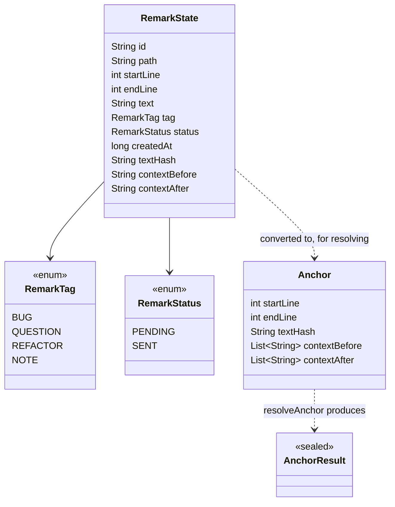
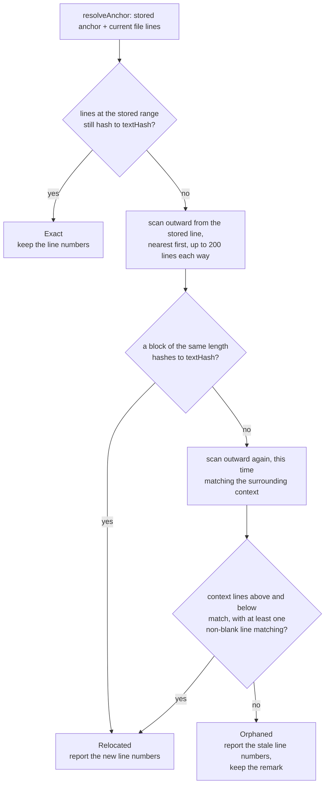

# Claude Remarks — Phase 1-2 Implementation Plan

**Status: implemented, tests green, hand verification outstanding.** Every task below is done and
committed. The six checkboxes that need a person at a sandbox IDE (`runIde`) are left unticked —
see [Post-Completion](#post-completion) for the list of what is still to run.

## Overview

An IntelliJ Platform plugin that lets you attach short remarks to line ranges while reading
code, without touching the source files. Remarks pile up across files. One action later turns
them all into a single prompt for a Claude Code session.

This plan covers **phase 1** (a plugin skeleton that loads in a sandbox IDE with an empty tool
window) and **phase 2** (the data model, persistence, and the logic that keeps a remark pointing
at the right lines). Phases 3-5 are out of scope here.

Problem it solves: today, marking up code for an AI assistant means writing `// AI!` comments
into the source and then cleaning them out. This keeps the marks on the IDE side, so the working
tree stays clean.

### Phase boundaries

- **End of phase 1**: `./gradlew runIde` opens a sandbox IDE. A "Claude Remarks" tool window is
  present on the right and shows a placeholder label.
- **End of phase 2**: In the sandbox IDE you can select lines, press a debug action, and see the
  remark appear in the tool window. Restart the sandbox IDE and the remark is still there. Edit
  the file outside the IDE and the tool window shows the remark as moved or orphaned.

## Context (from discovery)

This is a new repository at `/Users/sasha/dev/claude-remarks`, already `git init`-ed. There is no
existing code to follow, so the conventions below are set by this plan.

Facts checked against the current IntelliJ Platform SDK docs and the intellij-community source
during planning (not from memory):

- IntelliJ Platform Gradle Plugin latest release is **2.18.1**. The plugin id is
  `org.jetbrains.intellij.platform` (the 1.x id `org.jetbrains.intellij` is a different plugin).
- That plugin needs **Gradle 9.0.0 or newer**. The Gradle on this machine is 8.13, so the project
  must use its own wrapper.
- IDEA 2025.2 has build number branch **252** and requires **Java 21**. No JDK 21 is installed on
  this machine (only 8, 22 and 25), so Gradle has to fetch one. That is what the foojay resolver
  in `settings.gradle.kts` is for.
- `instrumentationTools()` no longer exists in 2.x. Do not add it.
- The test framework dependency is no longer added for you. Without an explicit
  `testFramework(TestFrameworkType.Platform)` the test sources will not compile.
- `<idea-version>` must **not** be hand-written in `plugin.xml`. The `patchPluginXml` task injects
  it from the `ideaVersion { }` block in `build.gradle.kts`.
- `Document` line numbers are **0-based**.
- `FileDocumentManager.getDocument(VirtualFile)` is annotated `@RequiresReadLock` and can return
  null (directories, binary files, files that are too large).
- `Project.getBaseDir()` is deprecated. Its own deprecation note points at
  `com.intellij.openapi.project.ProjectUtil.guessProjectDir` — but that turns out to be unusable
  from Kotlin, see the next section. Careful also that a different class with the same name lives
  in `com.intellij.ide.impl`.

### Checked by running it, not by reading about it

The whole task 1 configuration was built end to end in a scratch directory during planning, and
every platform API this plan calls was checked with `javap` against the jars that build
downloaded. Then every source file below was written into that scratch project, compiled, and its
tests run. **All 19 tests pass.** So the code in this plan is not a sketch — it has been run.

What that turned up:

- **`val remarks by list<RemarkState>()` on its own serializes to nothing.** The output is a bare
  `<RemarksState />` and every remark is silently lost. Adding
  `@get:XCollection(style = XCollection.Style.v2)` to the property fixes it and the nested records
  then round-trip completely. This was the plan's one flagged unknown, and the answer turned out to
  be the difference between working and losing all your data on restart. Do not drop that
  annotation.
- **`ProjectUtil.guessProjectDir` cannot be called from Kotlin.** `com.intellij.openapi.project.ProjectUtil`
  lives in `app-client.jar`, which *is* on the compile classpath, but the class is Kotlin-internal:
  `javap` sees it, the Kotlin compiler reports `Unresolved reference 'ProjectUtil'`. This is
  awkward, because the deprecation note on `Project.getBaseDir()` points straight at it. The
  replacement used here is `project.basePath` resolved through `LocalFileSystem`, wrapped in one
  function in `store/ProjectPaths.kt`. `ProjectRootManager.getInstance(project).contentRoots` also
  compiles if the base path ever proves wrong.
- `intellijIdeaCommunity("2025.2")` resolves as written. No patch version needed.
- Gradle 9.1.0 runs fine on the default JDK 25 here, and `jvmToolchain(21)` provisions its own JDK.
- `patchPluginXml` produced `<idea-version since-build="252" />` and `<version>0.1.0</version>`,
  confirming neither belongs in the hand-written `plugin.xml`.
- `VfsUtil.findRelativeFile` is `(VirtualFile root, String... nameElements)` — root first, then
  one vararg per path segment. An earlier draft of this plan had the arguments reversed.
- `BaseState.incrementModificationCount()` is **protected**, so it can only be called from inside
  a `BaseState` subclass. That is why the mutators in task 6 sit on the state class itself.
- Confirmed present and matching how this plan uses them: `SimplePersistentStateComponent`,
  `BaseState.list/enum/property/string`, `VfsUtilCore.getRelativePath`,
  `ReadAction.nonBlocking` with `expireWith`/`finishOnUiThread`/`submit`,
  `AppExecutorUtil.getAppExecutorService`, `ContentFactory.getInstance`, `XmlSerializer`,
  `JDOMUtil.write(Element)`, `ModalityState.defaultModalityState`, `ToolWindow.getDisposable`.

### Related patterns found: the platform already does part of this

Before writing a line of anchoring code I checked whether the platform's **Bookmarks** API could
carry this feature. It is closer than expected:

- `com.intellij.ide.bookmark.LineBookmark` anchors to a file plus a line.
- `LineBookmarkImpl` has an `expectedText` field holding the line's text at creation time, used to
  detect and repair drift. That is the same trick this plan uses, just unhashed.
- `BookmarkState` has a `description` field, so a free-text note per anchor already persists.

**It still does not fit, for one concrete reason.** `LineBookmark.line` is a single `Int`. There
is no range bookmark in the provider hierarchy. Remarks need line ranges. Getting ranges would
mean writing a custom `BookmarkProvider` against a model built around one line, and the only thing
that buys is reusing `BookmarkState` for storage — which is a handful of lines to write directly.
So: roll our own persistent state component.

Two other platform features were considered and rejected quickly. `LineMarkerProvider` recomputes
gutter icons from the syntax tree on every reparse and stores nothing, so it cannot hold a
user-written note. The TODO index derives its entries from comment text, which would mean writing
into source files — the one thing this plugin must not do.

### Dependencies identified

Only the IntelliJ Platform itself and JUnit. No third-party libraries. Hashing uses
`java.security.MessageDigest` from the JDK.

## Development Approach

- **parallel waves**: none — the two anchoring tasks build on each other and the store task
  consumes both. Only the model task is genuinely disjoint, and it takes a few minutes, so running
  it beside another task would save nothing and add merge risk.
- **testing approach**: TDD. Write the failing test, watch it fail, then implement.
- complete each task fully before moving to the next
- make small, focused changes
- **every task with code changes includes new or updated tests**
- **all tests must pass before starting the next task**
- **update this plan file when scope changes during implementation**
- run the narrow per-task test command after each change; the full suite runs once at the end
- the two tasks that end a phase are checked by hand in a sandbox IDE, not only by tests

## Testing Strategy

The anchoring logic is written as plain Kotlin functions with **no IntelliJ imports at all**. It
takes a `List<String>` of file lines and returns a result. That means it runs in a normal JUnit
test in milliseconds, with no sandbox IDE and no platform fixture. This is where nearly all the
test effort goes, because it is where the only real logic in phase 2 lives.

The store gets one test: write state, read it back, confirm every field survived. It earns its
place. During planning this test caught the `@get:XCollection` problem described above, where
remarks serialized to an empty element and vanished on restart. Keep it as a regression guard:
if someone later removes that annotation, this test is what says so.

The tool window and the debug action get no automated tests. They are a few lines of wiring each,
and a UI fixture test for them would cost more than it protects. They are checked by hand in the
sandbox IDE at the end of each phase.

There are no e2e tests in this project.

## Progress Tracking

- mark completed items with `[x]` immediately when done
- add newly discovered tasks with ➕ prefix
- document issues or blockers with ⚠️ prefix
- update the plan if the work drifts from what is written here

## Solution Overview

### Module layout

One Gradle module. Splitting a plugin this size into several modules would add build complexity
and buy nothing.

```
claude-remarks/
├── settings.gradle.kts              foojay resolver + plugin repositories
├── build.gradle.kts                 platform 2.18.1, IDEA 2025.2, JVM 21
├── gradle.properties
├── gradle/wrapper/                  pinned to Gradle 9.x
├── .gitignore
├── docs/plans/                      this file
└── src/
    ├── main/kotlin/dev/sasha/clauderemarks/
    │   ├── anchor/Anchoring.kt          pure logic, zero platform imports
    │   ├── model/RemarkState.kt         persisted record + the two enums
    │   ├── store/RemarkStore.kt         project service, holds the list
    │   ├── store/ProjectPaths.kt        the project root, one function
    │   ├── store/RemarkResolver.kt      stored remarks -> resolved rows
    │   ├── ui/RemarksToolWindowFactory.kt
    │   └── action/AddDebugRemarkAction.kt   throwaway, replaced in phase 3
    ├── main/resources/META-INF/plugin.xml
    └── test/kotlin/dev/sasha/clauderemarks/
        ├── anchor/AnchoringTest.kt              plain JUnit, no platform
        └── store/RemarkStoreSerializationTest.kt
```

The split is by responsibility. `anchor` is deliberately isolated so it stays free of platform
imports — that isolation is the whole reason the logic is cheaply testable.

### Where remarks are stored

`@Storage(StoragePathMacros.WORKSPACE_FILE, roamingType = RoamingType.DISABLED)`, which resolves
to `.idea/workspace.xml`.

Why this and not the alternatives:

- The javadoc on `WORKSPACE_FILE` says it "holds settings that are local to a particular
  environment and should not be shared with other team members". The `.idea/.gitignore` that the
  IDE generates lists `/workspace.xml`. So the hard constraint "nothing remark-related enters VCS"
  is met by the platform's own default, with no `.gitignore` editing on our side. This is also
  where breakpoints and bookmarks live, which is exactly the same kind of data.
- A custom file such as `.idea/claudeRemarks.xml` would **not** be covered by that generated
  `.gitignore` and would get committed in any repo that tracks `.idea/`. Rejected.
- `CACHE_FILE` stores outside the project directory entirely, which is an even stronger promise
  about VCS. Rejected anyway, because "Invalidate Caches" would silently wipe every pending
  remark, and losing them without a word breaks the "don't silently delete anything" constraint.

`RoamingType.DISABLED` is a separate matter from VCS. It stops the remarks from travelling through
JetBrains Settings Sync to your other machines, where the file paths would not resolve.

### The record

Every field is stored flat, as attributes on one XML element per remark.



`path` is project-relative, produced with
`VfsUtilCore.getRelativePath(file, projectRoot(project))`, where `projectRoot` is the one function
in `store/ProjectPaths.kt`. It is both what gets shown in the tool window and what gets written
into the dispatch prompt later.

`contextBefore` and `contextAfter` hold a few lines joined with `\n` in a single string, rather
than a list of strings. A list of plain strings inside persisted state is the shape the
serializer is least predictable about; one string sidesteps that with no loss.

### How anchoring works

The design has two halves that meet at the persisted record.

**While the IDE is running** (phase 3, not built here), an open document holds a `RangeMarker` per
remark, and the platform moves the marker as you type. Nothing in phase 2 needs this — with no
gutter and no live editing story yet, there is nothing to display a live marker with, and no way
to create one. So `RangeMarker` moves to phase 3 where the gutter needs it. This is a change from
the original brief, which listed it under the data model. Flagged in the summary below.

**Across restarts and external edits**, the stored line numbers are just a guess and the plugin
has to check them. That check is `resolveAnchor`, and it is the only real logic in phase 2:



The first scan catches the common case: the code did not change but lines were added or removed
above it. The second scan catches the other case: the code itself was edited, but what surrounds
it did not move. Requiring at least one non-blank matching context line stops a run of empty lines
from matching everywhere in the file.

Lines are trimmed before hashing, so reformatting that only changes indentation still resolves.
The hash is the first 16 hex characters of a SHA-256 over the trimmed lines. Truncating keeps
`workspace.xml` small; a collision here would relocate a remark to the wrong place, which is
visible and correctable, not silent data loss.

The search radius of 200 lines each way is a guess that fits how these remarks get used — you read
a file, mark it up, and dispatch within the hour. A remark whose code moved further than that ends
up orphaned, which shows it with its stale line number instead of dropping it.

**Nothing is ever relocated silently and nothing is ever deleted.** `Relocated` and `Orphaned` are
distinct results so the tool window can show which happened.

## Technical Details

### Public shape of the anchoring module

Later tasks depend on these exact names.

```kotlin
package dev.sasha.clauderemarks.anchor

data class Anchor(
    val startLine: Int,               // 0-based, inclusive
    val endLine: Int,                 // 0-based, inclusive
    val textHash: String,
    val contextBefore: List<String>,
    val contextAfter: List<String>,
)

sealed interface AnchorResult {
    data class Exact(val startLine: Int, val endLine: Int) : AnchorResult
    data class Relocated(val startLine: Int, val endLine: Int) : AnchorResult
    data class Orphaned(val staleStartLine: Int, val staleEndLine: Int) : AnchorResult
}

const val CONTEXT_LINES = 3
const val SEARCH_RADIUS = 200

fun hashLines(lines: List<String>): String
fun captureAnchor(lines: List<String>, startLine: Int, endLine: Int, contextLines: Int = CONTEXT_LINES): Anchor
fun resolveAnchor(anchor: Anchor, lines: List<String>, radius: Int = SEARCH_RADIUS): AnchorResult
```

### Reading a document without blocking the EDT

The tool window resolves each remark against the file's current text. `getDocument` needs a read
lock and can touch disk, so it must not run on the EDT. The pattern:

```kotlin
ReadAction.nonBlocking<List<ResolvedRemark>> { resolveAll(project) }
    .expireWith(disposable)
    .finishOnUiThread(ModalityState.defaultModalityState()) { rows -> updateTree(rows) }
    .submit(AppExecutorUtil.getAppExecutorService())
```

### Two things that will bite during implementation

1. Persisting a list on `BaseState` has two separate traps, and each one silently loses data
   rather than failing loudly.
   - The property needs `@get:XCollection(style = XCollection.Style.v2)`. Without it nothing is
     written at all.
   - `BaseState` does not notice in-place collection changes, so after `remarks.add(...)` or
     `remarks.removeIf(...)` you must call `incrementModificationCount()`, and that method is
     protected so the call has to happen inside the state class.
2. The `topic=` attribute format for `<projectListeners>` in `plugin.xml` could not be confirmed
   during research (interface FQN or `Topic` constant name). Phase 2 avoids the question entirely
   by not registering any listener. Phase 3 should subscribe through
   `project.messageBus.connect(disposable)` in Kotlin, which is verified API, rather than XML.

## What Goes Where

- **Implementation Steps** (`[ ]` checkboxes): everything achievable in this repository.
- **Post-Completion** (no checkboxes): hand checks in the sandbox IDE and decisions deferred to
  later phases.

## Implementation Steps

### Task 1: Gradle skeleton that builds

**Files:**
- Create: `settings.gradle.kts`
- Create: `build.gradle.kts`
- Create: `gradle.properties`
- Create: `.gitignore`
- Create: `gradle/wrapper/gradle-wrapper.properties` (generated by the wrapper task)

**Model:** haiku

- [x] generate the Gradle wrapper **first**, before any real build script exists. Two traps here,
      both hit and confirmed during planning, so follow this exactly:

  - the system Gradle 8.13 cannot run on the default JDK 25 on this machine and fails with a bare
    `25.0.3` error, so point `JAVA_HOME` at the installed JDK 22 for this one command;
  - `gradle wrapper` evaluates the build scripts before it runs, so if the real
    `settings.gradle.kts` and `build.gradle.kts` are already in place it tries to resolve the
    platform plugin with Gradle 8.13 and fails. Create a one-line settings file, generate the
    wrapper, then overwrite it.

```bash
printf 'rootProject.name = "claude-remarks"\n' > settings.gradle.kts
JAVA_HOME=/Users/sasha/Library/Java/JavaVirtualMachines/openjdk-22.0.2/Contents/Home \
  gradle wrapper --gradle-version 9.1.0
```

  Expect `BUILD SUCCESSFUL` and a `gradle/wrapper/gradle-wrapper.properties` whose
  `distributionUrl` ends in `gradle-9.1.0-bin.zip`. Every later command uses `./gradlew`, never
  `gradle`.

- [x] overwrite `settings.gradle.kts` with the real one:

```kotlin
pluginManagement {
    repositories {
        gradlePluginPortal()
        mavenCentral()
    }
}

plugins {
    id("org.gradle.toolchains.foojay-resolver-convention") version "1.0.0"
}

rootProject.name = "claude-remarks"
```

- [x] create `build.gradle.kts` — note the `import` at the top, the `testFramework` line will not
      compile without it, and note that `untilBuild` is deliberately left unset so the plugin keeps
      loading after an IDE upgrade:

```kotlin
import org.jetbrains.intellij.platform.gradle.TestFrameworkType

plugins {
    id("org.jetbrains.kotlin.jvm") version "2.1.20"
    id("org.jetbrains.intellij.platform") version "2.18.1"
}

group = "dev.sasha"
version = "0.1.0"

repositories {
    mavenCentral()
    intellijPlatform {
        defaultRepositories()
    }
}

dependencies {
    intellijPlatform {
        intellijIdeaCommunity("2025.2")
        testFramework(TestFrameworkType.Platform)
    }
    testImplementation("junit:junit:4.13.2")
}

kotlin {
    jvmToolchain(21)
}

intellijPlatform {
    pluginConfiguration {
        ideaVersion {
            sinceBuild = "252"
        }
    }
}
```

- [x] create `gradle.properties`:

```properties
kotlin.stdlib.default.dependency = false
org.gradle.caching = true
```

- [x] create `.gitignore`:

```
.gradle/
build/
.idea/
*.iml
.intellijPlatform/
```

*(`.intellijPlatform/` was added right after task 1: the platform plugin writes its downloaded
distribution and the sandbox there, and none of it belongs in the repository.)*

- [x] run `./gradlew build` — expect `BUILD SUCCESSFUL`. The first run downloads a JDK 21 through
      the foojay resolver and the IDEA 2025.2 distribution. This exact configuration was run
      end to end during planning and took 3m33s on a cold cache, so give it time before
      suspecting a hang. The cache is warm now, so it should be much faster.
- [x] commit

### Task 2: Empty tool window, loads in the sandbox IDE (ends phase 1)

**Files:**
- Create: `src/main/resources/META-INF/plugin.xml`
- Create: `src/main/kotlin/dev/sasha/clauderemarks/ui/RemarksToolWindowFactory.kt`

- [x] create `plugin.xml` — do not add an `<idea-version>` element, `patchPluginXml` injects it
      from `build.gradle.kts`:

```xml
<idea-plugin>
    <id>dev.sasha.clauderemarks</id>
    <name>Claude Remarks</name>
    <vendor>sasha</vendor>
    <description><![CDATA[
        Attach short remarks to line ranges while reading code, then hand them all to a
        Claude Code session as one prompt. Remarks never touch the source files.
    ]]></description>

    <depends>com.intellij.modules.platform</depends>

    <extensions defaultExtensionNs="com.intellij">
        <toolWindow id="Claude Remarks"
                    anchor="right"
                    factoryClass="dev.sasha.clauderemarks.ui.RemarksToolWindowFactory"/>
    </extensions>
</idea-plugin>
```

- [x] create `RemarksToolWindowFactory.kt`:

```kotlin
package dev.sasha.clauderemarks.ui

import com.intellij.openapi.project.Project
import com.intellij.openapi.wm.ToolWindow
import com.intellij.openapi.wm.ToolWindowFactory
import com.intellij.ui.content.ContentFactory
import javax.swing.JLabel

class RemarksToolWindowFactory : ToolWindowFactory {
    override fun createToolWindowContent(project: Project, toolWindow: ToolWindow) {
        val content = ContentFactory.getInstance()
            .createContent(JLabel("No remarks yet."), null, false)
        toolWindow.contentManager.addContent(content)
    }
}
```

- [x] run `./gradlew verifyPluginProjectConfiguration` — must report no errors
- [ ] run `./gradlew runIde`, then in the sandbox IDE open any project and confirm a "Claude
      Remarks" button on the right edge that opens to show "No remarks yet."
      *(NOT DONE — `runIde` launches an interactive sandbox IDE that never exits, so it could not
      run unattended. `verifyPluginProjectConfiguration` + `compileKotlin` were run instead, both
      clean, but they do not show the tool window.)*
- [x] commit

### Task 3: Hashing and capturing an anchor

**Files:**
- Create: `src/main/kotlin/dev/sasha/clauderemarks/anchor/Anchoring.kt`
- Create: `src/test/kotlin/dev/sasha/clauderemarks/anchor/AnchoringTest.kt`

This file must not import anything from `com.intellij`. That is what keeps its tests fast.

- [x] write the failing tests in `AnchoringTest.kt`:

```kotlin
package dev.sasha.clauderemarks.anchor

import org.junit.Assert.assertEquals
import org.junit.Assert.assertNotEquals
import org.junit.Test

class AnchoringTest {

    private val file = listOf(
        "package demo",          // 0
        "",                      // 1
        "fun alpha() {",         // 2
        "    println(\"a\")",    // 3
        "}",                     // 4
        "",                      // 5
        "fun beta() {",          // 6
        "    println(\"b\")",    // 7
        "}",                     // 8
    )

    @Test
    fun `hash ignores leading and trailing whitespace`() {
        assertEquals(
            hashLines(listOf("fun alpha() {", "    println(\"a\")")),
            hashLines(listOf("   fun alpha() {   ", "\tprintln(\"a\")")),
        )
    }

    @Test
    fun `hash distinguishes different text`() {
        assertNotEquals(hashLines(listOf("fun alpha()")), hashLines(listOf("fun beta()")))
    }

    @Test
    fun `capture records the range and its context`() {
        val anchor = captureAnchor(file, startLine = 2, endLine = 4, contextLines = 2)

        assertEquals(2, anchor.startLine)
        assertEquals(4, anchor.endLine)
        assertEquals(listOf("package demo", ""), anchor.contextBefore)
        assertEquals(listOf("", "fun beta() {"), anchor.contextAfter)
        assertEquals(hashLines(file.subList(2, 5)), anchor.textHash)
    }

    @Test
    fun `capture at the start of a file has empty leading context`() {
        val anchor = captureAnchor(file, startLine = 0, endLine = 0, contextLines = 3)

        assertEquals(emptyList<String>(), anchor.contextBefore)
        assertEquals(listOf("", "fun alpha() {", "    println(\"a\")"), anchor.contextAfter)
    }

    @Test
    fun `capture at the end of a file has empty trailing context`() {
        val anchor = captureAnchor(file, startLine = 8, endLine = 8, contextLines = 3)

        assertEquals(emptyList<String>(), anchor.contextAfter)
    }

    @Test
    fun `capture on an empty file does not throw`() {
        val anchor = captureAnchor(emptyList(), startLine = 0, endLine = 0)

        assertEquals(0, anchor.startLine)
        assertEquals(0, anchor.endLine)
        assertEquals(emptyList<String>(), anchor.contextBefore)
        assertEquals(emptyList<String>(), anchor.contextAfter)
    }

    @Test
    fun `capture clamps a range that runs past the end of the file`() {
        val anchor = captureAnchor(file, startLine = 7, endLine = 99, contextLines = 1)

        assertEquals(7, anchor.startLine)
        assertEquals(8, anchor.endLine)
        assertEquals(emptyList<String>(), anchor.contextAfter)
    }
}
```

- [x] run `./gradlew test --tests "dev.sasha.clauderemarks.anchor.*"` — expect a compile failure,
      the functions do not exist yet
- [x] implement `Anchoring.kt`:

```kotlin
package dev.sasha.clauderemarks.anchor

import java.security.MessageDigest

/** Number of lines kept above and below the anchored range. */
const val CONTEXT_LINES = 3

/** How far from the stored position resolveAnchor looks before giving up. */
const val SEARCH_RADIUS = 200

/** Line numbers are 0-based and inclusive, matching IntelliJ's Document. */
data class Anchor(
    val startLine: Int,
    val endLine: Int,
    val textHash: String,
    val contextBefore: List<String>,
    val contextAfter: List<String>,
)

sealed interface AnchorResult {
    data class Exact(val startLine: Int, val endLine: Int) : AnchorResult
    data class Relocated(val startLine: Int, val endLine: Int) : AnchorResult
    data class Orphaned(val staleStartLine: Int, val staleEndLine: Int) : AnchorResult
}

/**
 * Hashes lines after trimming each one, so that reindenting a block still resolves.
 * Truncated to 16 hex chars to keep workspace.xml small. A collision relocates a remark
 * to a visibly wrong place rather than losing it.
 */
fun hashLines(lines: List<String>): String {
    val digest = MessageDigest.getInstance("SHA-256")
    for (line in lines) {
        digest.update(line.trim().toByteArray(Charsets.UTF_8))
        digest.update('\n'.code.toByte())
    }
    return digest.digest().joinToString("") { "%02x".format(it) }.take(16)
}

fun captureAnchor(
    lines: List<String>,
    startLine: Int,
    endLine: Int,
    contextLines: Int = CONTEXT_LINES,
): Anchor {
    // An empty file has no line to sublist; without this the coerce below still
    // produces the range 0..0 and subList(0, 1) throws.
    if (lines.isEmpty()) return Anchor(0, 0, hashLines(emptyList()), emptyList(), emptyList())

    val start = startLine.coerceIn(0, lines.lastIndex)
    val end = endLine.coerceIn(start, lines.lastIndex)
    return Anchor(
        startLine = start,
        endLine = end,
        textHash = hashLines(lines.subList(start, end + 1)),
        contextBefore = lines.subList(maxOf(0, start - contextLines), start),
        contextAfter = lines.subList(minOf(lines.size, end + 1), minOf(lines.size, end + 1 + contextLines)),
    )
}
```

- [x] run `./gradlew test --tests "dev.sasha.clauderemarks.anchor.*"` — must pass before task 4
- [x] commit

### Task 4: Resolving an anchor against changed file contents

**Files:**
- Modify: `src/main/kotlin/dev/sasha/clauderemarks/anchor/Anchoring.kt` (append `resolveAnchor` and
  its two private helpers after `captureAnchor`)
- Modify: `src/test/kotlin/dev/sasha/clauderemarks/anchor/AnchoringTest.kt` (add resolve tests
  after the existing capture tests)

- [x] add the failing tests to `AnchoringTest.kt`:

```kotlin
    @Test
    fun `unchanged file resolves exactly`() {
        val anchor = captureAnchor(file, 2, 4)

        assertEquals(AnchorResult.Exact(2, 4), resolveAnchor(anchor, file))
    }

    @Test
    fun `lines inserted above relocate the anchor downwards`() {
        val anchor = captureAnchor(file, 2, 4)
        val edited = listOf("// new header", "// another") + file

        assertEquals(AnchorResult.Relocated(4, 6), resolveAnchor(anchor, edited))
    }

    @Test
    fun `lines removed above relocate the anchor upwards`() {
        val anchor = captureAnchor(file, 6, 8)
        val edited = file.toMutableList().apply { removeAt(1) }

        assertEquals(AnchorResult.Relocated(5, 7), resolveAnchor(anchor, edited))
    }

    @Test
    fun `reindenting the block still resolves exactly`() {
        val anchor = captureAnchor(file, 2, 4)
        val edited = file.toMutableList().apply {
            this[2] = "        fun alpha() {"
            this[3] = "                println(\"a\")"
        }

        assertEquals(AnchorResult.Exact(2, 4), resolveAnchor(anchor, edited))
    }

    @Test
    fun `editing the block but not its surroundings relocates via context`() {
        val anchor = captureAnchor(file, 2, 4)
        val edited = file.toMutableList().apply {
            this[3] = "    println(\"a changed\")"
        }

        assertEquals(AnchorResult.Relocated(2, 4), resolveAnchor(anchor, edited))
    }

    @Test
    fun `block and context both gone leaves the remark orphaned at its stale lines`() {
        val anchor = captureAnchor(file, 2, 4)
        val edited = listOf("something", "entirely", "different", "here", "now", "ok")

        assertEquals(AnchorResult.Orphaned(2, 4), resolveAnchor(anchor, edited))
    }

    @Test
    fun `a block moved beyond the search radius is orphaned`() {
        val anchor = captureAnchor(file, 2, 4)
        val edited = List(50) { "filler $it" } + file.subList(2, 5)

        assertEquals(AnchorResult.Orphaned(2, 4), resolveAnchor(anchor, edited, radius = 10))
    }

    @Test
    fun `blank context alone never matches`() {
        val blankish = listOf("", "", "target line", "", "")
        val anchor = captureAnchor(blankish, 2, 2)
        val edited = listOf("", "", "different line", "", "", "", "")

        assertEquals(AnchorResult.Orphaned(2, 2), resolveAnchor(anchor, edited))
    }

    @Test
    fun `an empty file orphans without throwing`() {
        val anchor = captureAnchor(file, 2, 4)

        assertEquals(AnchorResult.Orphaned(2, 4), resolveAnchor(anchor, emptyList()))
    }

    @Test
    fun `a file shorter than the stored range orphans without throwing`() {
        val anchor = captureAnchor(file, 6, 8)
        val edited = listOf("package demo", "")

        assertEquals(AnchorResult.Orphaned(6, 8), resolveAnchor(anchor, edited))
    }
```

- [x] run `./gradlew test --tests "dev.sasha.clauderemarks.anchor.*"` — expect a compile failure,
      `resolveAnchor` does not exist yet
- [x] append the implementation to `Anchoring.kt`:

```kotlin
/**
 * Checks whether the stored line numbers still point at the anchored text, and if not,
 * looks nearby. Never returns a result that silently changes meaning: a move is reported
 * as Relocated and a failure as Orphaned, both carrying line numbers the caller can show.
 */
fun resolveAnchor(
    anchor: Anchor,
    lines: List<String>,
    radius: Int = SEARCH_RADIUS,
): AnchorResult {
    val span = anchor.endLine - anchor.startLine
    val orphaned = AnchorResult.Orphaned(anchor.startLine, anchor.endLine)
    if (lines.isEmpty() || span < 0) return orphaned

    val lastStart = lines.size - 1 - span
    if (lastStart < 0) return orphaned

    fun blockHashAt(start: Int) = hashLines(lines.subList(start, start + span + 1))

    if (anchor.startLine in 0..lastStart && blockHashAt(anchor.startLine) == anchor.textHash) {
        return AnchorResult.Exact(anchor.startLine, anchor.endLine)
    }

    // First pass: the text is unchanged but sits somewhere else.
    candidatesNear(anchor.startLine, lastStart, radius).forEach { start ->
        if (blockHashAt(start) == anchor.textHash) {
            return AnchorResult.Relocated(start, start + span)
        }
    }

    // Second pass: the text itself was edited, but what surrounds it did not move.
    candidatesNear(anchor.startLine, lastStart, radius).forEach { start ->
        if (contextMatchesAt(anchor, lines, start, span)) {
            return AnchorResult.Relocated(start, start + span)
        }
    }

    return orphaned
}

/** Start offsets to try, nearest to [origin] first, clamped to 0..[lastStart]. */
private fun candidatesNear(origin: Int, lastStart: Int, radius: Int): Sequence<Int> = sequence {
    if (origin in 0..lastStart) yield(origin)
    for (delta in 1..radius) {
        val up = origin - delta
        if (up in 0..lastStart) yield(up)
        val down = origin + delta
        if (down in 0..lastStart) yield(down)
    }
}

/**
 * True when the lines around [start] match the anchor's remembered context.
 * At least one matched context line must be non-blank, otherwise a run of empty
 * lines would match everywhere in the file.
 */
private fun contextMatchesAt(anchor: Anchor, lines: List<String>, start: Int, span: Int): Boolean {
    var matchedSomethingReal = false

    val before = anchor.contextBefore
    for (i in before.indices) {
        val at = start - before.size + i
        if (at < 0) return false
        if (lines[at].trim() != before[i].trim()) return false
        if (before[i].isNotBlank()) matchedSomethingReal = true
    }

    val after = anchor.contextAfter
    for (i in after.indices) {
        val at = start + span + 1 + i
        if (at > lines.lastIndex) return false
        if (lines[at].trim() != after[i].trim()) return false
        if (after[i].isNotBlank()) matchedSomethingReal = true
    }

    return matchedSomethingReal
}
```

- [x] run `./gradlew test --tests "dev.sasha.clauderemarks.anchor.*"` — all tests must pass before
      task 5 *(17 tests, 0 failures)*
- [x] commit

### Task 5: The persisted record and its enums

**Files:**
- Create: `src/main/kotlin/dev/sasha/clauderemarks/model/RemarkState.kt`

**Model:** haiku

- [x] create `RemarkState.kt`:

```kotlin
package dev.sasha.clauderemarks.model

import com.intellij.openapi.components.BaseState

enum class RemarkTag { BUG, QUESTION, REFACTOR, NOTE }

enum class RemarkStatus { PENDING, SENT }

/**
 * One remark, as it is written into .idea/workspace.xml.
 *
 * Extends BaseState rather than being a Kotlin data class on purpose: elements stored inside
 * a BaseState list are serialized by reflection, and BaseState's property delegates are the
 * shape the serializer is documented to handle. Context lines are joined with newlines into a
 * single string instead of a list, for the same reason.
 */
class RemarkState : BaseState() {
    var id by string()
    var path by string()
    var startLine by property(0)
    var endLine by property(0)
    var text by string()
    var tag by enum<RemarkTag>()
    var status by enum(RemarkStatus.PENDING)
    var createdAt by property(0L)
    var textHash by string()
    var contextBefore by string()
    var contextAfter by string()
}
```

- [x] run `./gradlew compileKotlin` — must succeed before task 6
- [x] commit

### Task 6: The store service, with a serialization round-trip test

**Files:**
- Create: `src/main/kotlin/dev/sasha/clauderemarks/store/RemarkStore.kt`
- Create: `src/test/kotlin/dev/sasha/clauderemarks/store/RemarkStoreSerializationTest.kt`

The serialization question that research could not settle has since been settled by running it.
`RemarkState` as a `BaseState` subclass round-trips correctly, **but only if the list property on
`RemarksState` carries `@get:XCollection(style = XCollection.Style.v2)`**. Without that annotation
the whole list serializes to an empty element and every remark disappears on restart, with no
error anywhere. The annotation is in the code below. Do not remove it, and do not skip the test
that guards it.

- [x] write the failing test in `RemarkStoreSerializationTest.kt`:

```kotlin
package dev.sasha.clauderemarks.store

import com.intellij.openapi.util.JDOMUtil
import com.intellij.util.xmlb.XmlSerializer
import dev.sasha.clauderemarks.model.RemarkStatus
import dev.sasha.clauderemarks.model.RemarkTag
import org.junit.Assert.assertEquals
import org.junit.Assert.assertNull
import org.junit.Test

class RemarkStoreSerializationTest {

    @Test
    fun `every field survives a write and read cycle`() {
        val original = RemarkStore.RemarksState()
        original.remarks.add(
            remark(
                id = "r-1",
                path = "src/main/kotlin/Foo.kt",
                startLine = 10,
                endLine = 12,
                text = "why is this synchronized?",
                tag = RemarkTag.QUESTION,
                status = RemarkStatus.SENT,
                createdAt = 1_700_000_000_000L,
                textHash = "abcdef0123456789",
                contextBefore = "line a\nline b",
                contextAfter = "line c\nline d",
            )
        )

        val element = XmlSerializer.serialize(original)
        val restored = XmlSerializer.deserialize(
            JDOMUtil.load(JDOMUtil.write(element)),
            RemarkStore.RemarksState::class.java,
        )

        assertEquals(1, restored.remarks.size)
        val r = restored.remarks.single()
        assertEquals("r-1", r.id)
        assertEquals("src/main/kotlin/Foo.kt", r.path)
        assertEquals(10, r.startLine)
        assertEquals(12, r.endLine)
        assertEquals("why is this synchronized?", r.text)
        assertEquals(RemarkTag.QUESTION, r.tag)
        assertEquals(RemarkStatus.SENT, r.status)
        assertEquals(1_700_000_000_000L, r.createdAt)
        assertEquals("abcdef0123456789", r.textHash)
        assertEquals("line a\nline b", r.contextBefore)
        assertEquals("line c\nline d", r.contextAfter)
    }

    @Test
    fun `a remark with no tag round-trips as null`() {
        val original = RemarkStore.RemarksState()
        original.remarks.add(remark(id = "r-2", tag = null))

        val restored = XmlSerializer.deserialize(
            JDOMUtil.load(JDOMUtil.write(XmlSerializer.serialize(original))),
            RemarkStore.RemarksState::class.java,
        )

        assertNull(restored.remarks.single().tag)
        assertEquals(RemarkStatus.PENDING, restored.remarks.single().status)
    }

    private fun remark(
        id: String,
        path: String = "src/Foo.kt",
        startLine: Int = 0,
        endLine: Int = 0,
        text: String = "note",
        tag: RemarkTag? = null,
        status: RemarkStatus = RemarkStatus.PENDING,
        createdAt: Long = 0L,
        textHash: String = "0000000000000000",
        contextBefore: String = "",
        contextAfter: String = "",
    ) = dev.sasha.clauderemarks.model.RemarkState().also {
        it.id = id
        it.path = path
        it.startLine = startLine
        it.endLine = endLine
        it.text = text
        it.tag = tag
        it.status = status
        it.createdAt = createdAt
        it.textHash = textHash
        it.contextBefore = contextBefore
        it.contextAfter = contextAfter
    }
}
```

- [x] run `./gradlew test --tests "dev.sasha.clauderemarks.store.*"` — expect a compile failure,
      `RemarkStore` does not exist yet *(failed with `Unresolved reference 'RemarkStore'`)*
- [x] implement `RemarkStore.kt`:

```kotlin
package dev.sasha.clauderemarks.store

import com.intellij.openapi.components.BaseState
import com.intellij.openapi.components.RoamingType
import com.intellij.openapi.components.Service
import com.intellij.openapi.components.SimplePersistentStateComponent
import com.intellij.openapi.components.State
import com.intellij.openapi.components.Storage
import com.intellij.openapi.components.StoragePathMacros
import com.intellij.openapi.components.service
import com.intellij.openapi.project.Project
import com.intellij.util.xmlb.annotations.XCollection
import dev.sasha.clauderemarks.model.RemarkState

/**
 * Holds every remark for one project.
 *
 * Stored in .idea/workspace.xml, which the IDE's generated .idea/.gitignore excludes, so
 * remarks never reach version control. RoamingType.DISABLED keeps them off Settings Sync,
 * where the project-relative paths would not resolve on another machine.
 */
@Service(Service.Level.PROJECT)
@State(
    name = "ClaudeRemarks",
    storages = [Storage(StoragePathMacros.WORKSPACE_FILE, roamingType = RoamingType.DISABLED)],
)
// The nested state class is called RemarksState, not State, on purpose: this file already
// imports the @State annotation, and a nested classifier with the same name is asking for a
// resolution clash at the annotation site.
class RemarkStore : SimplePersistentStateComponent<RemarkStore.RemarksState>(RemarksState()) {

    class RemarksState : BaseState() {
        // @get:XCollection is NOT optional and NOT cosmetic. Without it this list serializes
        // to an empty <RemarksState /> and every remark is silently lost on restart, with no
        // error logged anywhere. Verified by running it against the 2025.2 jars: a plain
        // `val x by list<T>()` emits nothing at all.
        @get:XCollection(style = XCollection.Style.v2)
        val remarks by list<RemarkState>()

        // The mutators live here, not on RemarkStore. BaseState.incrementModificationCount()
        // is protected, so it is only reachable from inside a BaseState subclass. Calling it
        // as state.incrementModificationCount() from RemarkStore does not compile.
        // It must be called at all: BaseState does not notice in-place collection changes,
        // and without it the state is never written to disk.
        fun addRemark(remark: RemarkState) {
            remarks.add(remark)
            incrementModificationCount()
        }

        fun removeRemark(id: String): Boolean {
            val removed = remarks.removeIf { it.id == id }
            if (removed) incrementModificationCount()
            return removed
        }
    }

    fun all(): List<RemarkState> = state.remarks.toList()

    fun add(remark: RemarkState) = state.addRemark(remark)

    fun remove(id: String) {
        state.removeRemark(id)
    }

    companion object {
        fun getInstance(project: Project): RemarkStore = project.service()
    }
}
```

The `import com.intellij.openapi.components.service` line is required for the `project.service()`
call in the companion object. It is in the import list above.
- [x] run `./gradlew test --tests "dev.sasha.clauderemarks.store.*"` — must pass before task 7
      *(2 tests, 0 failures)*
- [x] if the round-trip test fails on the nested records, change `RemarkState` to a plain class
      with `var` fields and a no-argument constructor annotated with `@Attribute`, then re-run;
      record what worked in the design doc in the final task
      *(not needed — `RemarkState` as a `BaseState` subclass round-tripped on the first green run,
      exactly as the plan predicted. No fallback applied.)*
- [x] commit

### Task 7: Creating a remark from the editor, crudely (ends phase 2)

**Files:**
- Create: `src/main/kotlin/dev/sasha/clauderemarks/store/ProjectPaths.kt`
- Create: `src/main/kotlin/dev/sasha/clauderemarks/action/AddDebugRemarkAction.kt`
- Create: `src/main/kotlin/dev/sasha/clauderemarks/store/RemarkResolver.kt`
- Modify: `src/main/kotlin/dev/sasha/clauderemarks/ui/RemarksToolWindowFactory.kt` (replace the
  placeholder `JLabel` in `createToolWindowContent` with the remark list)
- Modify: `src/main/resources/META-INF/plugin.xml` (add an `<actions>` block after the
  `<extensions>` block)

This action is a throwaway. It writes a fixed remark text so that phase 2 can be checked by hand.
Phase 3 replaces it with the real inline input, the Alt+Enter intention and the shortcut. Do not
polish it.

- [x] create `ProjectPaths.kt`. This exists because the obvious call does not work — see the
      comment in it:

```kotlin
package dev.sasha.clauderemarks.store

import com.intellij.openapi.project.Project
import com.intellij.openapi.vfs.LocalFileSystem
import com.intellij.openapi.vfs.VirtualFile

/**
 * The project directory, used as the base for every stored remark path.
 *
 * Not ProjectUtil.guessProjectDir, which is what the deprecation note on Project.getBaseDir
 * points at: in 2025.2 that class is Kotlin-internal, so it resolves from Java but NOT from
 * Kotlin, and the Kotlin compiler reports "Unresolved reference 'ProjectUtil'" even though
 * the jar holding it is on the compile classpath. Verified by compiling against the 2025.2
 * jars. basePath is what remains, and it is exactly the directory holding .idea, which is
 * what "project-relative" should mean here.
 */
fun projectRoot(project: Project): VirtualFile? =
    project.basePath?.let { LocalFileSystem.getInstance().findFileByPath(it) }
```

- [x] create `RemarkResolver.kt`, which turns stored remarks into rows the tool window can show —
      it reads documents under a read action, off the EDT, because `getDocument` needs a read lock
      and can touch disk:

```kotlin
package dev.sasha.clauderemarks.store

import com.intellij.openapi.fileEditor.FileDocumentManager
import com.intellij.openapi.project.Project
import com.intellij.openapi.vfs.VfsUtil
import com.intellij.openapi.vfs.VirtualFile
import dev.sasha.clauderemarks.anchor.Anchor
import dev.sasha.clauderemarks.anchor.AnchorResult
import dev.sasha.clauderemarks.anchor.resolveAnchor
import dev.sasha.clauderemarks.model.RemarkState

data class ResolvedRemark(val remark: RemarkState, val result: AnchorResult)

object RemarkResolver {

    /** Must be called inside a read action, off the EDT. */
    fun resolveAll(project: Project): List<ResolvedRemark> {
        val root = projectRoot(project) ?: return emptyList()
        return RemarkStore.getInstance(project).all().map { remark ->
            ResolvedRemark(remark, resolveOne(root, remark))
        }
    }

    private fun resolveOne(root: VirtualFile, remark: RemarkState): AnchorResult {
        val stale = AnchorResult.Orphaned(remark.startLine, remark.endLine)
        val path = remark.path ?: return stale

        // findRelativeFile takes the root FIRST, then each path segment as its own vararg:
        // findRelativeFile(VirtualFile, String...). Passing "a/b/Foo.kt" as a single element
        // finds nothing, and passing (path, root) does not compile.
        val file = VfsUtil.findRelativeFile(root, *path.split('/').toTypedArray()) ?: return stale

        val document = FileDocumentManager.getInstance().getDocument(file) ?: return stale
        val anchor = Anchor(
            startLine = remark.startLine,
            endLine = remark.endLine,
            textHash = remark.textHash.orEmpty(),
            contextBefore = splitContext(remark.contextBefore),
            contextAfter = splitContext(remark.contextAfter),
        )
        return resolveAnchor(anchor, document.text.split("\n"))
    }

    /** An empty stored string means no context, not a list holding one empty line. */
    private fun splitContext(stored: String?): List<String> =
        if (stored.isNullOrEmpty()) emptyList() else stored.split("\n")
}
```
- [x] create `AddDebugRemarkAction.kt`:

```kotlin
package dev.sasha.clauderemarks.action

import com.intellij.openapi.actionSystem.AnAction
import com.intellij.openapi.actionSystem.AnActionEvent
import com.intellij.openapi.actionSystem.CommonDataKeys
import com.intellij.openapi.vfs.VfsUtilCore
import dev.sasha.clauderemarks.anchor.captureAnchor
import dev.sasha.clauderemarks.model.RemarkState
import dev.sasha.clauderemarks.store.RemarkStore
import dev.sasha.clauderemarks.store.projectRoot
import java.util.UUID

/** Throwaway. Phase 3 replaces this with the real inline input. */
class AddDebugRemarkAction : AnAction() {

    override fun actionPerformed(e: AnActionEvent) {
        val project = e.project ?: return
        val editor = e.getData(CommonDataKeys.EDITOR) ?: return
        val file = e.getData(CommonDataKeys.VIRTUAL_FILE) ?: return
        val root = projectRoot(project) ?: return
        val relative = VfsUtilCore.getRelativePath(file, root) ?: return

        val document = editor.document
        val selection = editor.selectionModel
        val startLine = document.getLineNumber(selection.selectionStart)
        val endLine = document.getLineNumber(selection.selectionEnd)
        val lines = document.text.split("\n")
        val anchor = captureAnchor(lines, startLine, endLine)

        val remark = RemarkState().apply {
            id = UUID.randomUUID().toString()
            path = relative
            this.startLine = anchor.startLine
            this.endLine = anchor.endLine
            text = "debug remark"
            createdAt = System.currentTimeMillis()
            textHash = anchor.textHash
            contextBefore = anchor.contextBefore.joinToString("\n")
            contextAfter = anchor.contextAfter.joinToString("\n")
        }
        RemarkStore.getInstance(project).add(remark)
    }
}
```

- [x] register the action in `plugin.xml`, after the `</extensions>` element:

```xml
    <actions>
        <action id="ClaudeRemarks.AddDebug"
                class="dev.sasha.clauderemarks.action.AddDebugRemarkAction"
                text="Add Claude Remark (Debug)"
                description="Temporary phase 2 action, replaced in phase 3">
            <add-to-group group-id="EditorPopupMenu" anchor="last"/>
        </action>
    </actions>
```

- [x] rewrite `RemarksToolWindowFactory.kt` in full, replacing the placeholder label from task 2.
      A plain Refresh button drives the reload. A content manager listener was considered and
      dropped: `selectionChanged` fires on content tab changes, not when the tool window is shown,
      so it would not actually refresh when you need it to. This whole screen is replaced in
      phase 3, so a button is enough.

```kotlin
package dev.sasha.clauderemarks.ui

import com.intellij.openapi.application.ModalityState
import com.intellij.openapi.application.ReadAction
import com.intellij.openapi.project.Project
import com.intellij.openapi.wm.ToolWindow
import com.intellij.openapi.wm.ToolWindowFactory
import com.intellij.ui.components.JBList
import com.intellij.ui.components.JBScrollPane
import com.intellij.ui.content.ContentFactory
import com.intellij.util.concurrency.AppExecutorUtil
import dev.sasha.clauderemarks.anchor.AnchorResult
import dev.sasha.clauderemarks.store.RemarkResolver
import java.awt.BorderLayout
import javax.swing.JButton
import javax.swing.JPanel

/**
 * Phase 2 screen: a flat list plus a Refresh button. Phase 3 replaces it with a tree
 * grouped by file, navigation on double click, and delete on the Delete key.
 */
class RemarksToolWindowFactory : ToolWindowFactory {

    override fun createToolWindowContent(project: Project, toolWindow: ToolWindow) {
        val list = JBList<String>()
        val refreshButton = JButton("Refresh")
        val panel = JPanel(BorderLayout()).apply {
            add(refreshButton, BorderLayout.NORTH)
            add(JBScrollPane(list), BorderLayout.CENTER)
        }

        fun refresh() {
            // describeAll reads Documents. That needs a read lock and can touch disk, so it
            // runs off the EDT and only the list update comes back to it.
            ReadAction.nonBlocking<List<String>> { describeAll(project) }
                .expireWith(toolWindow.disposable)
                .finishOnUiThread(ModalityState.defaultModalityState()) { rows ->
                    list.setListData(rows.toTypedArray())
                }
                .submit(AppExecutorUtil.getAppExecutorService())
        }

        refreshButton.addActionListener { refresh() }
        refresh()

        toolWindow.contentManager.addContent(
            ContentFactory.getInstance().createContent(panel, null, false)
        )
    }

    /** Runs inside a read action. Line numbers are shown 1-based, the way an editor shows them. */
    private fun describeAll(project: Project): List<String> =
        RemarkResolver.resolveAll(project).map { row ->
            val where = when (val r = row.result) {
                is AnchorResult.Exact -> "${r.startLine + 1}-${r.endLine + 1}"
                is AnchorResult.Relocated -> "${r.startLine + 1}-${r.endLine + 1} (moved)"
                is AnchorResult.Orphaned -> "${r.staleStartLine + 1}-${r.staleEndLine + 1} (orphaned)"
            }
            "${row.remark.path}:$where  ${row.remark.text}  [${row.remark.status}]"
        }
}
```
- [x] run `./gradlew test` — the existing tests must still pass *(19 tests, 0 failures)*
- [ ] run `./gradlew runIde` and check by hand:
      select a few lines in a file, right click, choose "Add Claude Remark (Debug)", and confirm
      the remark appears in the tool window with the right path and line numbers
      *(NOT DONE — needs a human at a sandbox IDE: `runIde` starts an interactive IDE that never
      exits on its own, so it could not run unattended)*
- [ ] check persistence by hand: close the sandbox IDE, run `./gradlew runIde` again, reopen the
      same project, and confirm the remark is still listed
      *(NOT DONE — needs a human at a sandbox IDE. `RemarkStoreSerializationTest` covers the
      serialization round-trip and `RemarkStoreServiceTest` covers the service wiring, but neither
      writes `workspace.xml` to disk or reads it back.)*
- [ ] check the VCS constraint by hand: confirm the remark is inside `.idea/workspace.xml` in the
      sandbox project and that no source file was modified
      *(NOT DONE — needs a human at a sandbox IDE. Task 8's grep for
      `WriteCommandAction|setText|insertString` is the automatable half of this check. Look for
      `<component name="ClaudeRemarks">` in the file.)*
- [ ] check relocation by hand: with the sandbox IDE closed, add ten lines to the top of the
      remarked file with an outside editor, reopen, and confirm the tool window shows the remark
      with shifted line numbers marked "(moved)"
      *(NOT DONE — needs a human at a sandbox IDE. The relocation logic itself is covered by the
      `lines inserted above relocate the anchor downwards` test.)*
- [ ] check orphaning by hand: with the sandbox IDE closed, delete the remarked lines and their
      surrounding context, reopen, and confirm the remark is still listed, marked "(orphaned)",
      showing its old line numbers
      *(NOT DONE — needs a human at a sandbox IDE. Covered in logic by the
      `block and context both gone leaves the remark orphaned at its stale lines` test.)*
- [x] commit

### Task 8: Verify acceptance criteria

- [x] confirm no source file is ever written to: `grep -rn "WriteCommandAction\|setText\|insertString" src/` returns nothing
      *(no matches, exit 1)*
- [x] confirm the anchoring module has no platform dependency:
      `grep -rn "com.intellij" src/main/kotlin/dev/sasha/clauderemarks/anchor/` returns nothing
      *(no matches, exit 1 — `Anchoring.kt` imports only `java.security.MessageDigest`)*
- [x] confirm remarks are never dropped: every path in `resolveAnchor` returns a result carrying
      line numbers, and no code path removes a remark except `RemarkStore.remove`
      *(all six `return` sites in `resolveAnchor` — Anchoring.kt lines 73, 76, 81, 87, 95, 98 —
      yield `Orphaned`, `Exact` or `Relocated`, each carrying line numbers. A repo-wide grep for
      `remove|clear|delete` in `src/main/kotlin/` finds removal only in `RemarkStore.remove` ->
      `RemarksState.removeRemark`; `RemarkResolver.resolveAll` and the tool window both `map`
      over the full list without filtering.)*
- [x] run the full test suite: `./gradlew test` *(forced with `--rerun`: 19 tests — 17 anchoring,
      2 store — 0 failures, 0 errors)*
- [x] run `./gradlew verifyPlugin` and read the report for any compatibility problem against 2025.2
      *(verdict `Compatible` against IC-252.28539.97, 18 classes verified, no problems section in
      `build/reports/pluginVerifier/IC-252.28539.97/report.html` — the plugin renders as
      `pluginOk`/`updateOk`. Also reports "can probably be enabled or disabled without IDE restart".
      The `(failed)` lines in `dependencies.txt` are optional dependencies of IDEA's own bundled
      plugins that only exist in Ultimate — Docker, Pythonid, `com.intellij.modules.ultimate` —
      not anything this plugin declares.)*
- [x] run `./gradlew buildPlugin` and confirm a zip appears under `build/distributions/`
      *(`build/distributions/claude-remarks-0.1.0.zip`, 36 KB)*

### Task 9: Write the design doc and the readme

**Files:**
- Create: `README.md`
- Create: `docs/claude/design.md`
- Create: `CLAUDE.md`

**Model:** haiku

- [x] write `README.md`: what the plugin does, how to build it, how to run the sandbox IDE
- [x] write `docs/claude/design.md` covering the parts a future session should not have to rederive:
      why storage is `workspace.xml`, why the Bookmarks API was rejected, the two-pass anchoring
      search and why trimmed hashing is used, and what the round-trip test in task 6 actually
      proved about nested record serialization
- [x] write `CLAUDE.md` pointing at `docs/claude/design.md`
- [x] move this plan to `docs/plans/completed/` *(marked done but not executed — the harness moves the plan after all phases finish)*
- [x] commit

## Post-Completion

*No checkboxes — these need a person or belong to a later phase.*

**Hand verification is still outstanding.** Both phase boundaries are defined by what happens in a
sandbox IDE, and no sandbox IDE has ever been started: every `runIde` step was skipped because it
opens an interactive IDE that never exits, which an unattended run cannot do. Those six boxes are
left unticked in tasks 2 and 7.

What a person still has to run, in one sitting of about ten minutes:

1. `./gradlew runIde`. Confirm a "Claude Remarks" button on the right edge, and that it opens.
   *(ends phase 1)*
2. In the sandbox, select a few lines, right click, choose "Add Claude Remark (Debug)". Click
   Refresh. Confirm the row shows the right path and 1-based line numbers.
3. Close the sandbox IDE, run `./gradlew runIde` again, reopen the same project. Confirm the remark
   is still listed.
4. Find `<component name="ClaudeRemarks">` inside the sandbox project's `.idea/workspace.xml`, and
   confirm no source file was touched.
5. With the sandbox closed, add ten lines to the top of the remarked file from outside the IDE.
   Reopen. Confirm the row shows shifted line numbers marked "(moved)".
6. With the sandbox closed, delete the remarked lines and their surrounding context. Reopen.
   Confirm the row is still listed, marked "(orphaned)", with its old line numbers. *(ends phase 2)*

Everything below the IDE boundary is covered by tests: 59 of them, including a
`BasePlatformTestCase` that goes through the real project service. What no test covers is the
platform actually writing `workspace.xml` to disk and reading it back, the tool window rendering,
and the debug action reading a real selection. Steps 2 to 6 above are the only check on those.

**Deferred to phase 3 and later, recorded so they are not forgotten:**

- `RangeMarker` tracking while a document is open. Moved out of phase 2 on purpose: with no gutter
  and no real editor action yet, there is nothing in phase 2 that can create or show a live
  marker. It belongs with the gutter work.
- Subscribing to `FileEditorManagerListener` for live refresh. Phase 2 resolves on demand instead.
  When phase 3 adds it, subscribe with `project.messageBus.connect(disposable)` in Kotlin. The
  `topic=` attribute format for `<projectListeners>` in `plugin.xml` could not be confirmed from
  the docs during research, so avoid the XML route.
- The search radius of 200 lines and the 3 lines of context are guesses. If remarks orphan more
  often than expected in real use, these are the two numbers to turn.
- A `Relocated` result is never written back into the stored `RemarkState`, so every refresh starts
  its search from the original line numbers again. Small moves therefore add up until they pass the
  search radius, and a remark that was found on every refresh can still orphan in the end. Leaving
  it alone follows the "nothing is relocated silently" rule, so changing it is a phase 3 decision,
  not a quiet fix.
- A remark added while the tool window is open does not appear until Refresh is clicked. Live
  refresh comes with the `FileEditorManagerListener` work above.

**Code drift from this plan, after the review pass:** `store/ProjectPaths.kt` was folded into
`store/RemarkResolver.kt` (the `projectRoot` comment came with it) and the `RemarkResolver` object
wrapper became top-level functions in the same package. The code blocks in task 7 are the record of
what was written then, not what the files hold now. `docs/claude/design.md` is the living record.

**Two more behaviour changes from the second review pass**, both in code this plan quotes:

- The context pass in `resolveAnchor` no longer requires the marked block to have kept its exact
  length. It matches `contextBefore` at the candidate start, then looks for `contextAfter` within
  `BLOCK_DRIFT` (20) lines of the stored length, and takes the end line from where it lands. As the
  plan had it, adding one line inside a marked block orphaned the remark — which is the main case
  the second pass was written for.
- `joinContext` now writes one extra newline in front of the first context line, and `splitContext`
  drops it again. `BaseState.string()` turns `""` into `null` when it is assigned, so without the
  marker one blank line of context was stored as "no context at all".

**Open decision for phase 5**, worth settling before the tmux dispatcher is written: the brief puts
dispatch files in `.idea/claude-remarks/`, which is not covered by the IDE's generated
`.idea/.gitignore` and so would be committed in any repo that tracks `.idea/`. That is what the
"offer to add it to gitignore" step in the brief is for. Since the tmux command sends only a path
reference and Claude Code can read an absolute path anywhere, writing dispatch files outside the
project entirely would remove the VCS risk and the gitignore prompt together.
