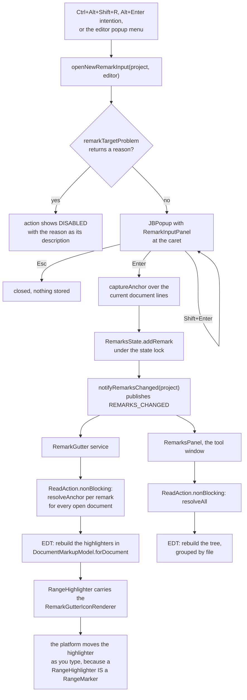
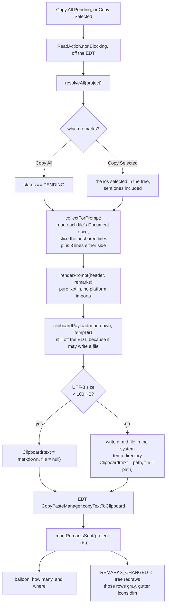

# Claude Remarks — Phase 3-4 Implementation Plan

**Status: implemented, tests green, hand verification outstanding.** All 13 tasks are done and
committed on branch `claude-remarks-phase1-2`. The sandbox-IDE hand checks that end task 6 and task
11, and the "Post-Completion" list at the bottom of this file, have not been run: every autonomous
session that built this skipped `runIde`.

## Overview

Phase 1-2 built the parts you cannot see: the persisted record, the two-pass anchoring search,
and a throwaway right-click action that writes the fixed text `"debug remark"`. Nothing about it
is usable yet.

This plan covers the two phases that make it usable.

**Phase 3 is the editor side.** You press a shortcut or use Alt+Enter, type your note into a small
box at the caret, optionally pick a tag, and press Enter. A gutter icon appears on the marked
lines and follows your edits while the file is open. The tool window becomes a tree grouped by
file, with navigation on double click and delete on the Delete key, and it refreshes itself.

**Phase 4 is the output side.** One action turns every pending remark into one markdown prompt,
puts it on the clipboard, shows a balloon, and marks those remarks sent. Sent remarks stay
listed in gray until you clear them, so you can copy again if the paste went to the wrong place.
The instruction header at the top of the prompt is editable in settings.

Phase 5 no longer exists. Dispatch was simplified on 2026-08-02, before it was built: there is no
`Dispatcher` interface, no tmux pane, and no file inside `.idea/`. See
`docs/claude/design.md`, section "What Is Not Yet Built", for the full reasoning.

### Phase boundaries

- **End of phase 3**: in a sandbox IDE you select lines, press `Ctrl+Alt+Shift+R`, type a note, pick
  `bug`, press Enter. A gutter icon appears on those lines. Hovering shows the note. Clicking it
  offers Edit and Delete. Typing ten lines above moves the icon with the code. The tool window
  shows the note under its file, without pressing anything.
- **End of phase 4**: with a few remarks pending, you press Copy All in the tool window. A balloon
  says how many were copied. Pasting into a Claude Code session gives one markdown document with
  an instruction header and the numbered remarks, each with its code. Those remarks are now gray
  in the tool window. Clear Sent removes them.

## Context (what is true today)

Read from the source on this branch, not assumed.

**The debug action is the only way to create a remark.**
`src/main/kotlin/dev/sasha/clauderemarks/action/AddDebugRemarkAction.kt:45` writes
`text = "debug remark"`. It never sets `tag`. `model/RemarkState.kt:26` declares `tag` and
`model/RemarkState.kt:27` declares `status`, both persisted and round-trip tested, both never
assigned by any production code.

**The action hides itself instead of greying out.**
`action/AddDebugRemarkAction.kt:27` sets `e.presentation.isEnabledAndVisible = relativePathOf(e) != null`.
Three tests pin this behaviour in `src/test/kotlin/dev/sasha/clauderemarks/action/AddDebugRemarkActionTest.kt`
— the in-memory fixture file case at line 59 and the macOS symlink case at line 77 both assert
`assertFalse(event.presentation.isEnabledAndVisible)`. The symlink case is not exotic: on macOS
`/tmp` and `/var` are symlinks into `/private`, so any project reached through one of them makes
the menu item vanish. A user reads that as "the plugin is broken".

**The tool window is a flat list with a Refresh button.**
`ui/RemarksToolWindowFactory.kt:28-54` builds a `JBList<String>` and a `JButton("Refresh")`.
`refresh()` runs only when the button is clicked or when the window is first created. Line 32
sets the empty text to "No remarks yet. Press Refresh after adding one." — that string exists
because the missing auto-refresh confused the author during hand testing.
`ui/RemarksToolWindowFactory.kt:71` holds `describe(row)`, the one place line numbers turn 1-based.

**Deleting a remark has no caller.** `store/RemarkStore.kt:97` says so in its own comment:
`/** No production caller yet: phase 3 is where deleting a remark from the tool window lands. */`

**Every mutation of the remark list goes through `RemarksState`.**
`store/RemarkStore.kt:60-88` holds four `@Synchronized` methods on the nested state class:
`addRemark`, `removeRemark`, `snapshot`, `modCount`. They all lock the same monitor. Phase 3-4
adds four more in exactly the same shape.

**Resolving is already a single entry point.** `store/RemarkResolver.kt:39` is `resolveAll(project)`
and `store/RemarkResolver.kt:91` is `anchorOf(remark)`. Both are reused unchanged by the gutter
and by the prompt collector.

**No listener of any kind is registered.** `src/main/resources/META-INF/plugin.xml` has one
`<toolWindow>` extension and one `<action>`. Nothing subscribes to the message bus.

### API facts, verified against the real 2025.2 jars in this session

Every platform call in this plan was checked with `javap` against
`/Users/sasha/.gradle/caches/9.1.0/transforms/c3bd2a49efd270bc2558f65097ad6f39/transformed/ideaIC-2025.2-aarch64/lib`.
Two items that earlier notes had flagged as unverified are now settled:

- **`applicationConfigurable` really does use the attribute `instance`.** The platform declares
  `<extensionPoint name="applicationConfigurable" beanClass="com.intellij.openapi.options.ConfigurableEP">`
  with `<with attribute="instance" implements="com.intellij.openapi.options.Configurable"/>`, and
  `ConfigurableEP.instanceClass` carries `@Attribute("instance")` in its bytecode. The sibling
  field `implementationClass` (attribute `implementation`) is marked `Deprecated`. Use `instance`.
- **`OpenFileDescriptor` takes a 0-based line.** Its `navigateIn` bytecode builds
  `new LogicalPosition(getLine(), Math.max(getColumn(), 0))` with no adjustment, and
  `LogicalPosition.line` shares its base with `Document.getLineNumber`. So the line argument is
  0-based, the same base everything in this plugin already stores. A test still pins it, because
  a silent off-by-one in navigation is easy to miss.

Also confirmed in this session, because the plan writes code against them:
`postStartupActivity` declares `interface="com.intellij.openapi.startup.ProjectActivity"`;
`intentionAction` declares `beanClass="...IntentionActionBean"` where `className` is a required
child element and `language` is optional; `notificationGroup` declares
`beanClass="...NotificationGroupEP"` whose `DisplayType` enum is `NONE|BALLOON|STICKY_BALLOON|TOOL_WINDOW`;
`Row.textArea(): Cell<JBTextArea>`; `TextFieldKt.bindText` is generic over `<T : JTextComponent>`
and has a getter/setter lambda overload; `AlignX.FILL` is a nested object, not a companion field;
`IconLoader.getTransparentIcon(Icon, float)`; `AllIcons.General.Note`; `AllIcons.Actions.Copy`,
`InSelection`, `GC`, `Cancel`, `Refresh`; `SimpleColoredComponent` has both `getIcon` and
`setIcon`, so Kotlin's `icon = ...` works on the tree renderer.

### This plan was compiled and run before publication

Like the phase 1-2 plan, every task below was written into a scratch copy of the project, compiled
and run before the plan was published. That pass produced **134 tests green** and a
`verifyPlugin` report of **Compatible** against 2025.2. Everything it turned up is already folded
into the text: the store has to be cleared in `setUp` and not only in `tearDown`, the
double-click handler lives in `com.intellij.util`, a file written twice in one test run needs an
explicit `refresh`, and `control alt R` was already taken.

A second, independent review of the plan then found real defects in the code the compile pass had
happily compiled — the gutter service in particular. Those fixes are in the text too, but they
were reasoned about rather than run, so the gutter service is the part to watch during
implementation.

What still cannot be checked here is anything that needs a real IDE window: the popup at the
caret, the icon painted in the gutter, the settings page laying out. Those are the hand checks at
the end of tasks 6 and 11.

## Development Approach

- **parallel waves: none.** Almost every task consumes the one before it. The mutation functions
  and the change notification are the foundation for the input popup, the gutter and the tree. The
  renderer needs the tag that the input popup assigns. The toolbar needs the copy function and the
  tree together. The only genuinely disjoint pair is the pure markdown renderer and the settings
  service, and each is under an hour, so running them side by side would save nothing and add a
  merge to a file both touch (`plugin.xml`).
- **testing approach: TDD.** Write the failing test, run it, watch it fail for the right reason,
  then implement.
- complete each task fully before moving to the next.
- **every task with code changes includes new or updated tests**, except task 4, which is a nine
  line intention plus a registration in `plugin.xml` and is checked by
  `verifyPluginProjectConfiguration` and by hand.
- **all tests must pass before starting the next task.**
- run the narrow per-task test command after each change; the full suite runs once at the end.
- update this plan file when scope changes during implementation.
- the two tasks that end a phase are checked by hand in a sandbox IDE, not only by tests.

### Rules carried over from phase 1-2, because breaking them cost real time

1. **A `BaseState` list property serializes to nothing without `@get:XCollection(style = XCollection.Style.v2)`.**
   Every remark is silently lost on restart, with nothing logged. Phase 3-4 adds no new persisted
   collection, so this trap should not fire again. If a later change adds one, it needs that
   annotation and a round-trip test proving it.
2. **Every new persisted field needs a serialization round-trip test.** Phase 4 adds exactly one
   new persisted field, the prompt header in the application settings. It gets its own round-trip
   test in the same shape as `RemarkStoreStateTest`.
3. **Prove a test is a real guard by mutation.** Break the production code the test covers,
   confirm the test fails, restore. A test that passes either way is not a guard. Phase 1-2
   shipped four "fixes" whose tests passed with the fix reverted, and a reviewer caught them by
   doing this. Every task below names which mutation to try.
4. **A wrong relocation is worse than an orphan.** The context search must keep the anchored block
   pinned to its stored length. An earlier attempt allowed the length to vary and silently moved
   remarks onto unrelated code, because trimmed context lines like `}` / blank / `@Test` repeat a
   few lines down. It was reverted. Nothing in phase 3-4 touches `anchor/Anchoring.kt`. Do not
   touch it.
5. **`isEnabledAndVisible = false` makes a menu item vanish, not grey out.** Phase 3 replaces that
   with visible-but-disabled plus a reason in the description.

## Testing Strategy

The split from phase 1-2 holds: put the test effort where the logic is, and check the wiring by
hand in a sandbox IDE.

**Plain JUnit, no fixture, milliseconds.** The markdown renderer is the biggest new piece of real
logic in these two phases, and it is written with no IntelliJ imports at all, exactly like
`anchor/Anchoring.kt`. It takes data classes and returns a string. The same applies to the small
pure helpers: how a tag maps to its label, what an empty input does, how the tree nodes are
grouped, and where the clipboard payload goes when it is large.

**Light IDE fixture (`BasePlatformTestCase`), seconds.** Four classes already need one. Phase 3-4
adds these: the mutation functions plus the change notification, the rewritten Add Remark action,
the gutter icon renderer, the gutter service, the collector that reads documents for the prompt,
and the filter that decides which remarks a copy takes. Each of these goes through a real project
service, a real `Document` or a real markup model, which is the whole point of testing them.

**Every fixture-backed test class that asserts on the whole store clears it in `setUp`.** The
light fixture project is reused between test methods *and* between test classes, so remarks left
behind by an earlier class are still there when the next one starts. Clearing in `tearDown` only
is not enough: one class that forgets it breaks the next one. So each such class starts with

```kotlin
    override fun setUp() {
        super.setUp()
        // The light fixture project is shared across test classes, so the store is cleared here.
        RemarkStore.getInstance(project).clear()
    }
```

This was found by running the suite: without it three tests in `RemarkEditsTest` fail on leftovers.

**Not tested automatically, checked by hand:** the popup appearing at the caret, the gutter icon
painting, the tree colours, the balloon, and the settings page rendering. A UI fixture test for
any of those costs more than it protects. Each phase ends with a written hand-check list.

There are no e2e tests in this project.

## Solution Overview

### From a keystroke to a gutter icon



The single fact that shapes the whole editor side is that
`RangeHighlighter extends com.intellij.openapi.editor.RangeMarker`. One object carries both the
gutter icon and the live position. There is no separate `RangeMarker` to keep in step, which is
what the phase 1-2 notes assumed there would be.

### From pending remarks to the clipboard



**One code path with a size check, not two implementations.** `clipboardPayload` is a single
function that returns a single type. The caller does not branch on which mode ran; it reads
`Clipboard.file` only to word the balloon. There is no `Dispatcher` interface, because there is
one implementation.

**The whole payload is built off the EDT, including the file write.** `clipboardPayload` runs
inside `prepare()`, not in the `finishOnUiThread` block. It writes a file only for payloads over
100 KB, which is exactly when the write is slowest, so putting it on the EDT would freeze the UI
in the one case that matters. The EDT step does three cheap things: copy to the clipboard, mark
the remarks sent, show the balloon.

**The temp file is why nothing remark-related can enter version control.** A file under
`java.io.tmpdir` is outside the project directory, so no `.gitignore` question arises at all. The
original brief put dispatch files in `.idea/claude-remarks/`, which the IDE's generated
`.idea/.gitignore` does not cover, so they would have been committed in any repository that
tracks `.idea/`.

### Sent remarks are not deleted

`status` flips from `PENDING` to `SENT`. The remark stays in the store and stays in the tree, drawn
gray. Copy Selected can copy it again. Only Clear Sent removes it, and only Clear All removes
pending ones.

**Both Clear buttons ask first, and each names its count.** Clear All is obvious: it throws away
work you have not handed over yet. Clear Sent asks for two reasons. "Sent" only means the text
went into one clipboard buffer, and the next copy overwrites that buffer. And keeping sent
remarks is the whole point of not deleting them: if the paste went to the wrong place, Copy
Selected is how you get them back. The two buttons also sit next to each other in the toolbar, so
a misclick is easy. The Delete key on a selected row does not ask: it acts on rows you selected
and then pressed Delete on, which is not silent.

### New files

```
src/main/kotlin/dev/sasha/clauderemarks/
  store/RemarkEdits.kt           the six mutation functions, the REMARKS_CHANGED topic
  store/RemarkTarget.kt          relativePathOf, remarkTargetProblem
  ui/RemarkInputPanel.kt         the popup's panel, the Enter/Shift+Enter keys, tag labels
  action/AddRemarkAction.kt      replaces AddDebugRemarkAction; keeps selectedLines unchanged
  action/AddRemarkIntention.kt   the Alt+Enter entry, three lines of real work
  editor/RemarkGutterIcon.kt     the placement record, the tooltip, the gutter icon renderer
  editor/RemarkGutter.kt         the project service and its EditorFactoryListener
  editor/RemarkGutterStartup.kt  the ProjectActivity that starts the service
  ui/RemarksTree.kt              node building and the tree cell renderer
  settings/RemarkSettings.kt     the app-level service and the default prompt header
  settings/RemarkSettingsConfigurable.kt
  render/PromptRenderer.kt       pure Kotlin, zero platform imports
  render/PromptPayload.kt        collectForPrompt and clipboardPayload
  action/CopyRemarks.kt          copyRemarks(project, ids)
src/main/resources/
  intentionDescriptions/AddRemarkIntention/description.html
```

`ui/RemarksToolWindowFactory.kt` is rewritten, and `describe()` goes with the flat list it
belonged to, so `src/test/kotlin/dev/sasha/clauderemarks/ui/RemarkRowTest.kt` is deleted too — the
tree's `remarkNode()` builds the same position string and `RemarksTreeTest` covers it.
`model/RemarkState.kt` gains one extension, `RemarkTag.label`, because four places need a tag's
lowercase name and four copies of `name.lowercase()` would drift.

`action/AddDebugRemarkAction.kt` is deleted, but its `selectedLines` function moves to
`action/AddRemarkAction.kt` unchanged — same package, same name, so
`src/test/kotlin/dev/sasha/clauderemarks/action/SelectedLinesTest.kt` needs no edit at all.

The dependency direction is `editor -> action -> ui -> store -> anchor`, plus `render -> store`.
No cycles.

## Technical Details

### The change notification

Two things need to know when the remark list changed: the tool window tree and the gutter service.
The notification lives beside the mutations, not inside the store.

It is worth being honest about why. It is **not** that a project-level service cannot hold a
`Project`: it can, and this same plan does it in `RemarkGutter(private val project: Project)`. The
two real reasons are smaller and both about cost. Adding a constructor parameter to `RemarkStore`
means touching fourteen existing call sites that build `RemarkStore()` directly. And keeping the
store free of the message bus is what lets `RemarkStoreStateTest` stay a plain JUnit test with no
fixture, which is where most of the storage coverage lives.

```kotlin
fun interface RemarksListener {
    fun remarksChanged()
}

/**
 * Project level, and not broadcast. NONE, because the default is TO_CHILDREN: a project's message
 * bus has module-level children, and nothing here should hear about another bus's remarks.
 */
@Topic.ProjectLevel
val REMARKS_CHANGED: Topic<RemarksListener> =
    Topic.create("Claude remarks changed", RemarksListener::class.java, Topic.BroadcastDirection.NONE)
```

Every production mutation goes through one of six top-level functions in `store/RemarkEdits.kt`,
and each one publishes after it mutates. That is the whole mechanism: no listener list, no observer
class, and the notification and the mutation are the same function call.

Nothing in the language stops a caller from reaching past those six functions —
`RemarkStore.add` and its siblings are still public and `RemarkEdits.kt` sits in the same package.
So the rule is checked instead of assumed: task 12 greps for any direct call to a store mutator
outside `RemarkEdits.kt`, and the grep must come back empty.

### Two positions on screen, and when they can differ

The gutter shows the live highlighter position. The platform moves it as you type, for free and
exactly. The tree shows the position `resolveAll` computes, and it recomputes on remark changes and
on editors opening or closing — not on every keystroke, because each remark can cost a SHA-256 over
every candidate position within the 200-line radius.

So while you are typing, the gutter is right and the tree can be a few lines stale. They agree
again the moment anything triggers a refresh. There is also a Refresh button in the toolbar, kept
on purpose as the manual escape.

The one case where they say genuinely different things is a block you deleted: the highlighter
collapses where the text was, while the tree says orphaned with the stale stored line numbers.
Both are honest about what they know. Neither is silently wrong.

### What is deliberately NOT built: writing the resolved position back

`docs/claude/design.md` records that a `Relocated` result is never written back into the stored
`RemarkState`, so every refresh searches again from the original numbers, and calls this "a phase 3
decision". The decision here is **do not build it**.

What it would buy: a remark whose code drifts more than 200 lines from where it was first stored
currently orphans, even though every single refresh along the way found it. Writing the position
back would keep it anchored forever.

What it would cost: a new persistence write path, a hook to decide when to run it, and a guard so
that deleting the marked lines does not write a collapsed range back over a good anchor. Get the
guard wrong and you have destroyed the anchor, which is the exact failure mode this plugin
promises not to have.

What actually happens without it: a remark drifts past 200 lines only after a lot of editing spread
over days. Remarks are written and copied within about an hour, which is what the search radius was
sized for. And when a remark does orphan, it is still listed, still shows its text, and phase 4's
prompt header tells the reader to find it by content. So the failure is visible and recoverable.

**Add it when** someone reports remarks orphaning during ordinary use. The trigger to write back
is `editorReleased` for the last editor of a document, and the guard is that the lines under the
live highlighter must still hash to the remark's stored `textHash`.

### Threading, restated per component because it is easy to get wrong

- The input popup, the gutter markup model updates, the tree model updates, the clipboard write
  and the balloon all run on the EDT.
- `resolveAll`, `resolveAnchor` and any `Document.getText()` read run inside
  `ReadAction.nonBlocking { }` on a pooled thread, with `.finishOnUiThread(...)` bringing the
  result back. This is the pattern `ui/RemarksToolWindowFactory.kt:44` already uses.
- `.expireWith(disposable)` and `.coalesceBy(...)` are not optional. Without `coalesceBy`, a slow
  earlier result can land after a newer one and paint stale rows.
- `RemarkGutter.byDocument` is touched on the EDT only. The `REMARKS_CHANGED` subscriber hops
  through `invokeLater` before touching it, because a publisher could in principle run off the EDT.

### The gutter renderer's equals and hashCode

`GutterIconRenderer` declares only `equals` and `hashCode` as abstract on the class itself;
`getIcon` is abstract but inherited from `GutterMark`. Everything else — `getTooltipText`,
`getClickAction`, `getPopupMenuActions`, `getAlignment` — is concrete, so override only what you
need.

Both `equals` and `hashCode` must be keyed on the remark's stable id plus everything that changes
what gets painted, which here is the text (the tooltip) and the sent flag (the icon). They must
**not** fall back to instance identity: the platform compares the old and new renderer on each
highlighting pass to decide whether to repaint, so identity equality makes the icon flicker on
every pass.

### The prompt format

The header comes from settings, so it is not fixed here. Everything below it is:

`````text
<header>

---

## src/main/kotlin/dev/sasha/clauderemarks/store/RemarkStore.kt

### 1. lines 60-64 — bug

why is this synchronized on the state and not on the store?

```text
  58 |     // The mutators live here, not on RemarkStore.
  59 |     @Synchronized
> 60 |     fun addRemark(remark: RemarkState) {
> 61 |         remarks.add(remark)
> 62 |         incrementModificationCount()
> 63 |     }
> 64 |
  65 |     @Synchronized
```

### 2. lines 97-97 — question — orphaned, the line numbers are stale

what happens if this is called twice with the same id?

```text
  ...
```
`````

Remarks are grouped by file and numbered from 1 straight through, so a reply can say "remark 3"
without ambiguity. Within a file they are ordered by line. The `>` marker on the left picks out
the lines the remark points at; unmarked lines are context. The fenced block is tagged `text`
rather than a real language, because the line-number gutter would break any syntax highlighting
anyway.

### The default instruction header

Modelled on revdiff: each remark is a directive, and a remark that asks something gets answered
rather than turned into an edit.

```text
You are given a set of remarks left in an IDE while reading this codebase.

Treat each remark as a directive about the code it points at.

- A remark that asks something ("why is this...", "explain...", "is this...") is a QUESTION.
  Answer it in your reply. Do not change the code for it.
- Any other remark is an INSTRUCTION. Carry it out.
- A remark marked "orphaned" has stale line numbers: the code moved or changed after the remark
  was written. Find the code it means by reading the quoted lines, not by trusting the numbers.
- In each code block, lines prefixed with ">" are the lines the remark points at. The other
  lines are surrounding context.

Work through the remarks in the order they are listed. When you are done, say briefly what you
changed and what you answered.
```

### Where the settings live

`@Service(Service.Level.APP)` with `@State(name = "ClaudeRemarksSettings", storages = [Storage("remarksPluginSettings.xml")])`.
No `roamingType`, which means `RoamingType.DEFAULT`, which means it roams through JetBrains
Settings Sync. That is right for a prompt template you write once and want on every machine, and
it is deliberately the opposite of the project data, which uses `StoragePathMacros.WORKSPACE_FILE`
with `RoamingType.DISABLED` because file paths do not travel.

This one may extend `SimplePersistentStateComponent`. The reason `RemarkStore` does not is that
its state holds a list that three threads reach, and the platform's serializer must be handed a
copy. A single string read on the EDT has no such problem.

## What Goes Where

- **Implementation Steps** (`[ ]` checkboxes): everything achievable in this repository.
- **Post-Completion** (no checkboxes): hand checks in a sandbox IDE, and decisions deferred.

## Implementation Steps

### Task 1: Mutation functions, and the change notification

**Model:** sonnet

**Files:**
- Modify: `src/main/kotlin/dev/sasha/clauderemarks/store/RemarkStore.kt` — add four
  `@Synchronized` methods to the nested `RemarksState` class, right after the existing
  `removeRemark`
- Create: `src/main/kotlin/dev/sasha/clauderemarks/store/RemarkEdits.kt`
- Modify: `src/test/kotlin/dev/sasha/clauderemarks/store/RemarkStoreStateTest.kt` — add the new
  mutator tests after `removing an id takes out every remark carrying it`
- Create: `src/test/kotlin/dev/sasha/clauderemarks/store/RemarkEditsTest.kt`

This is the foundation for everything after it. No UI.

- [x] add the failing tests to `RemarkStoreStateTest.kt`:

```kotlin
    @Test
    fun `editing a remark changes its text and tag and marks the state as changed`() {
        val state = RemarkStore.RemarksState()
        state.addRemark(remark(id = "r-1", text = "old", tag = null))
        val before = state.modificationCount

        assertTrue(state.editRemark("r-1", "new", RemarkTag.BUG))

        assertEquals("new", state.snapshot().single().text)
        assertEquals(RemarkTag.BUG, state.snapshot().single().tag)
        assertTrue(state.modificationCount > before)
    }

    @Test
    fun `editing an id that is not there changes nothing`() {
        val state = RemarkStore.RemarksState()
        state.addRemark(remark(id = "r-1", text = "old"))
        val before = state.modificationCount

        assertFalse(state.editRemark("no-such-id", "new", null))

        assertEquals("old", state.snapshot().single().text)
        assertEquals(before, state.modificationCount)
    }

    @Test
    fun `marking sent only touches the ids given`() {
        val state = RemarkStore.RemarksState()
        state.addRemark(remark(id = "r-1"))
        state.addRemark(remark(id = "r-2"))
        val before = state.modificationCount

        assertEquals(1, state.markSent(setOf("r-1")))

        assertEquals(RemarkStatus.SENT, state.snapshot().first { it.id == "r-1" }.status)
        assertEquals(RemarkStatus.PENDING, state.snapshot().first { it.id == "r-2" }.status)
        // markSent writes a FIELD on a remark that is already in the list, which is not the same
        // as adding or removing a list element. Whether that alone would reach the outer state's
        // modification count is not settled, and if it does not, the SENT flag is lost on restart
        // with nothing logged. So the count is pinned here.
        assertTrue(state.modificationCount > before)
    }

    @Test
    fun `marking a remark sent twice does not change it a second time`() {
        val state = RemarkStore.RemarksState()
        state.addRemark(remark(id = "r-1"))
        state.markSent(setOf("r-1"))
        val before = state.modificationCount

        assertEquals(0, state.markSent(setOf("r-1")))

        assertEquals(before, state.modificationCount)
    }

    @Test
    fun `removing sent keeps the pending ones`() {
        val state = RemarkStore.RemarksState()
        state.addRemark(remark(id = "r-1", status = RemarkStatus.SENT))
        state.addRemark(remark(id = "r-2", status = RemarkStatus.PENDING))
        val before = state.modificationCount

        assertEquals(1, state.removeSent())

        assertEquals(listOf("r-2"), state.snapshot().map { it.id })
        assertTrue(state.modificationCount > before)
    }

    @Test
    fun `removing sent when there are none changes nothing`() {
        val state = RemarkStore.RemarksState()
        state.addRemark(remark(id = "r-1"))
        val before = state.modificationCount

        assertEquals(0, state.removeSent())

        assertEquals(before, state.modificationCount)
    }

    @Test
    fun `clear removes everything`() {
        val state = RemarkStore.RemarksState()
        state.addRemark(remark(id = "r-1"))
        state.addRemark(remark(id = "r-2", status = RemarkStatus.SENT))
        val before = state.modificationCount

        assertEquals(2, state.clear())

        assertEquals(0, state.snapshot().size)
        assertTrue(state.modificationCount > before)
    }

    @Test
    fun `an edited remark survives the round trip through xml`() {
        val state = RemarkStore.RemarksState()
        state.addRemark(remark(id = "r-1", text = "old", tag = null))
        state.editRemark("r-1", "new", RemarkTag.REFACTOR)
        state.markSent(setOf("r-1"))

        val restored = roundTrip(state).remarks.single()

        assertEquals("new", restored.text)
        assertEquals(RemarkTag.REFACTOR, restored.tag)
        assertEquals(RemarkStatus.SENT, restored.status)
    }
```

`RemarkStatus` is already imported in that file. Add `import dev.sasha.clauderemarks.model.RemarkStatus`
only if the compiler says it is missing.

- [x] run `./gradlew test --tests "dev.sasha.clauderemarks.store.RemarkStoreStateTest"` — expect a
      compile failure, the four methods do not exist yet
- [x] add the four methods to `RemarksState` in `RemarkStore.kt`, after `removeRemark`:

```kotlin
        /**
         * Changes a remark's text and tag in place, under the same lock every other mutator holds.
         *
         * In place, not replace-with-a-copy. The list copy getState() hands the serializer is
         * shallow, so it shares these objects: a save landing between the two field writes below
         * would see the new text with the old tag.
         *
         * That torn write cannot become permanent, and the reason is the ORDER below.
         * incrementModificationCount() runs after both fields are written, so a save that lands
         * between them records the lower count it read on the way in. The next save sees a higher
         * count and serializes both fields again. One save is stale, the one after it is right,
         * and there is no path to permanent loss.
         *
         * (A copy would also be possible: BaseState.copyFrom(BaseState) exists and copies every
         * stored property by reflection, so nothing would have to be cloned by hand. It is simply
         * not needed once the ordering above holds.)
         */
        @Synchronized
        fun editRemark(id: String, text: String, tag: RemarkTag?): Boolean {
            val target = remarks.firstOrNull { it.id == id } ?: return false
            target.text = text
            target.tag = tag
            incrementModificationCount()
            return true
        }

        /** Returns how many actually changed, so marking an already-sent remark is a no-op. */
        @Synchronized
        fun markSent(ids: Set<String>): Int {
            val changed = remarks.filter { it.id in ids && it.status != RemarkStatus.SENT }
            changed.forEach { it.status = RemarkStatus.SENT }
            if (changed.isNotEmpty()) incrementModificationCount()
            return changed.size
        }

        /** Returns how many were removed. */
        @Synchronized
        fun removeSent(): Int {
            val before = remarks.size
            remarks.removeIf { it.status == RemarkStatus.SENT }
            val removed = before - remarks.size
            if (removed > 0) incrementModificationCount()
            return removed
        }

        /** Returns how many were removed. */
        @Synchronized
        fun clear(): Int {
            val removed = remarks.size
            if (removed > 0) {
                remarks.clear()
                incrementModificationCount()
            }
            return removed
        }
```

Add these imports to `RemarkStore.kt`:

```kotlin
import dev.sasha.clauderemarks.model.RemarkStatus
import dev.sasha.clauderemarks.model.RemarkTag
```

- [x] run `./gradlew test --tests "dev.sasha.clauderemarks.store.RemarkStoreStateTest"` — must pass
- [x] **mutation check**: delete the `incrementModificationCount()` call inside `markSent`.
      `marking sent only touches the ids given` must fail on its count assertion. Restore it, then
      do the same for `removeSent` (`removing sent keeps the pending ones` must fail), for `clear`
      (`clear removes everything` must fail) and for `editRemark`
      (`editing a remark changes its text and tag and marks the state as changed` must fail).
      All four mutators are covered, and each one has exactly one test that fails without its call.

      This is worth doing for all four, not one. `editRemark` and `markSent` are the first
      mutations that write a field on a `RemarkState` already inside the list, rather than adding
      or removing a list element. `an edited remark survives the round trip through xml` does not
      catch a missing increment, because `XmlSerializer` never consults the count — the edit or the
      SENT flag would just be missing after a restart, with nothing logged.
- [x] write the failing test in `RemarkEditsTest.kt`. This one needs a project, so it extends
      `BasePlatformTestCase`:

```kotlin
package dev.sasha.clauderemarks.store

import com.intellij.testFramework.fixtures.BasePlatformTestCase
import dev.sasha.clauderemarks.model.RemarkStatus
import dev.sasha.clauderemarks.model.RemarkTag

/**
 * The six functions that are the only way production code changes a remark. Each one must both
 * mutate and publish, so a caller cannot mutate without the tool window and the gutter hearing
 * about it.
 */
class RemarkEditsTest : BasePlatformTestCase() {

    private var heard = 0

    override fun setUp() {
        super.setUp()
        // The light fixture project is shared across test classes, so the store is cleared here.
        // Without this line three of the tests below fail on remarks left by an earlier method.
        RemarkStore.getInstance(project).clear()
        heard = 0
        project.messageBus.connect(testRootDisposable)
            .subscribe(REMARKS_CHANGED, RemarksListener { heard++ })
    }

    fun testAddingARemarkStoresItAndPublishes() {
        val stored = addRemark(
            project,
            path = "src/Foo.kt",
            lines = listOf("alpha", "beta", "gamma", "delta"),
            range = 1..2,
            text = "why beta?",
            tag = RemarkTag.QUESTION,
        )

        assertEquals(1, heard)
        assertEquals("src/Foo.kt", stored.path)
        assertEquals(1, stored.startLine)
        assertEquals(2, stored.endLine)
        assertEquals("why beta?", stored.text)
        assertEquals(RemarkTag.QUESTION, stored.tag)
        assertEquals(RemarkStatus.PENDING, stored.status)
        assertNotNull(stored.id)
        assertNotNull(stored.textHash)
        assertEquals(listOf(stored.id), RemarkStore.getInstance(project).all().map { it.id })
    }

    fun testAddingARemarkCapturesTheContextAroundIt() {
        val stored = addRemark(
            project,
            path = "src/Foo.kt",
            lines = listOf("a", "b", "c", "d", "e", "f", "g"),
            range = 3..3,
            text = "note",
            tag = null,
        )

        assertEquals(listOf("a", "b", "c"), splitContext(stored.contextBefore))
        assertEquals(listOf("e", "f", "g"), splitContext(stored.contextAfter))
    }

    fun testEditingARemarkPublishes() {
        val stored = addOne()

        editRemark(project, stored.id!!, "changed", RemarkTag.BUG)

        assertEquals(2, heard)
        assertEquals("changed", RemarkStore.getInstance(project).all().single().text)
    }

    fun testEditingAnUnknownIdDoesNotPublish() {
        addOne()

        editRemark(project, "no-such-id", "changed", null)

        assertEquals(1, heard)
    }

    fun testDeletingARemarkPublishes() {
        val stored = addOne()

        deleteRemark(project, stored.id!!)

        assertEquals(2, heard)
        assertEquals(0, RemarkStore.getInstance(project).all().size)
    }

    fun testMarkingSentPublishesAndKeepsTheRemark() {
        val stored = addOne()

        markRemarksSent(project, listOf(stored.id!!))

        assertEquals(2, heard)
        assertEquals(RemarkStatus.SENT, RemarkStore.getInstance(project).all().single().status)
    }

    fun testClearSentPublishesOnlyWhenSomethingWentAway() {
        addOne()

        clearSentRemarks(project)
        assertEquals(1, heard)

        markRemarksSent(project, RemarkStore.getInstance(project).all().map { it.id!! })
        clearSentRemarks(project)

        assertEquals(3, heard)
        assertEquals(0, RemarkStore.getInstance(project).all().size)
    }

    fun testClearAllRemovesPendingOnesToo() {
        addOne()
        addOne()

        clearAllRemarks(project)

        assertEquals(3, heard)
        assertEquals(0, RemarkStore.getInstance(project).all().size)
    }

    private fun addOne() = addRemark(
        project,
        path = "src/Foo.kt",
        lines = listOf("alpha", "beta"),
        range = 0..0,
        text = "note",
        tag = null,
    )
}
```

- [x] run `./gradlew test --tests "dev.sasha.clauderemarks.store.RemarkEditsTest"` — expect a
      compile failure, nothing in `RemarkEdits.kt` exists yet
- [x] create `RemarkEdits.kt`:

```kotlin
package dev.sasha.clauderemarks.store

import com.intellij.openapi.project.Project
import com.intellij.util.messages.Topic
import dev.sasha.clauderemarks.anchor.captureAnchor
import dev.sasha.clauderemarks.model.RemarkState
import dev.sasha.clauderemarks.model.RemarkTag
import java.util.UUID

/**
 * Told when the remark list changed, or when something changed that makes the current view of it
 * out of date.
 */
fun interface RemarksListener {
    fun remarksChanged()
}

/**
 * Project level, and not broadcast. The default direction is TO_CHILDREN; NONE says plainly that
 * this event belongs to one project's bus and goes nowhere else.
 */
@Topic.ProjectLevel
val REMARKS_CHANGED: Topic<RemarksListener> =
    Topic.create("Claude remarks changed", RemarksListener::class.java, Topic.BroadcastDirection.NONE)

/**
 * These six functions are the only way production code changes a remark. Nothing calls
 * RemarkStore.add / RemarkStore.remove directly any more, and task 12 greps to keep that true.
 *
 * The reason is not tidiness. The tool window and the gutter both have to redraw after any change,
 * and pairing the mutation with the notification in one function is what stops a caller doing one
 * without the other. The store itself stays out of it so that RemarkStoreStateTest can keep
 * building RemarkStore() directly, with no fixture, in fourteen places.
 */

/** Captures the anchor for [range] out of [lines] and stores a new remark. Returns what was stored. */
fun addRemark(
    project: Project,
    path: String,
    lines: List<String>,
    range: IntRange,
    text: String,
    tag: RemarkTag?,
): RemarkState {
    val anchor = captureAnchor(lines, range.first, range.last)
    val remark = RemarkState().apply {
        this.id = UUID.randomUUID().toString()
        this.path = path
        this.startLine = anchor.startLine
        this.endLine = anchor.endLine
        this.text = text
        this.tag = tag
        this.createdAt = System.currentTimeMillis()
        this.textHash = anchor.textHash
        this.contextBefore = joinContext(anchor.contextBefore)
        this.contextAfter = joinContext(anchor.contextAfter)
    }
    RemarkStore.getInstance(project).add(remark)
    notifyRemarksChanged(project)
    return remark
}

fun editRemark(project: Project, id: String, text: String, tag: RemarkTag?) {
    if (RemarkStore.getInstance(project).edit(id, text, tag)) notifyRemarksChanged(project)
}

fun deleteRemark(project: Project, id: String) {
    if (RemarkStore.getInstance(project).remove(id)) notifyRemarksChanged(project)
}

fun markRemarksSent(project: Project, ids: Collection<String>) {
    if (RemarkStore.getInstance(project).markSent(ids.toSet()) > 0) notifyRemarksChanged(project)
}

fun clearSentRemarks(project: Project): Int {
    val removed = RemarkStore.getInstance(project).removeSent()
    if (removed > 0) notifyRemarksChanged(project)
    return removed
}

fun clearAllRemarks(project: Project): Int {
    val removed = RemarkStore.getInstance(project).clear()
    if (removed > 0) notifyRemarksChanged(project)
    return removed
}

/**
 * Also published when an editor opens or closes, because that changes which remarks can be
 * resolved at all, not only when the list itself changed.
 */
fun notifyRemarksChanged(project: Project) {
    if (!project.isDisposed) project.messageBus.syncPublisher(REMARKS_CHANGED).remarksChanged()
}
```

- [x] add the four forwarding methods to `RemarkStore`, next to the existing `add` and `remove`.
      Drop the stale comment on `remove` while you are there — phase 3 is now the caller:

```kotlin
    fun edit(id: String, text: String, tag: RemarkTag?): Boolean = liveState.editRemark(id, text, tag)

    fun markSent(ids: Set<String>): Int = liveState.markSent(ids)

    fun removeSent(): Int = liveState.removeSent()

    fun clear(): Int = liveState.clear()
```

- [x] run `./gradlew test --tests "dev.sasha.clauderemarks.store.*"` — all must pass
- [x] **mutation check**: delete the `notifyRemarksChanged(project)` line from `deleteRemark`.
      `testDeletingARemarkPublishes` must fail on `assertEquals(2, heard)`. Restore it.
- [x] commit

### Task 2: The input panel, its keys, and its tag labels

**Model:** sonnet

**Files:**
- Modify: `src/main/kotlin/dev/sasha/clauderemarks/model/RemarkState.kt` — add the `RemarkTag.label`
  extension
- Create: `src/main/kotlin/dev/sasha/clauderemarks/ui/RemarkInputPanel.kt`
- Create: `src/test/kotlin/dev/sasha/clauderemarks/ui/RemarkInputPanelTest.kt`

Four places need a tag's lowercase name: this panel, the gutter tooltip, the tree row and the
copied prompt. Four copies of `tag.name.lowercase()` would drift, so it becomes one extension next
to the enum itself:

```kotlin
/** Lowercase, because this exact string is printed into the tree, the tooltip and the prompt. */
val RemarkTag.label: String get() = name.lowercase()
```

Two separable things live in this file. The rules about what a submission means are pure functions
with a plain JUnit test. The key bindings need a real component, so they get a fixture test that
looks the bindings up in the input map rather than dispatching key events, which needs no window.

An inlay was considered and rejected: `EditorCustomElementRenderer` is paint-and-hit-test only
(`calcWidthInPixels`, `calcHeightInPixels`, `paint`, `getContextMenuGroup`, `calcGutterIconRenderer`),
so an inlay cannot host a focusable component at all. A popup is the only option, and
`JBPopup.showInBestPositionFor(editor)` puts it at the caret in one call.

- [x] write the failing tests in `RemarkInputPanelTest.kt`:

```kotlin
package dev.sasha.clauderemarks.ui

import com.intellij.testFramework.fixtures.BasePlatformTestCase
import dev.sasha.clauderemarks.model.RemarkTag
import java.awt.event.InputEvent
import java.awt.event.KeyEvent
import javax.swing.JComponent
import javax.swing.KeyStroke
import org.junit.Assert.assertEquals
import org.junit.Assert.assertNotNull
import org.junit.Assert.assertNull
import org.junit.Test

/** The rules, without building a component. */
class RemarkInputRulesTest {

    @Test
    fun `whitespace around the text is trimmed off`() {
        assertEquals("why?", remarkInputResult("  why?\n ", null)?.text)
    }

    @Test
    fun `text that is only whitespace is not a submission`() {
        assertNull(remarkInputResult("   \n\t ", RemarkTag.BUG))
    }

    @Test
    fun `the tag comes through untouched`() {
        assertEquals(RemarkTag.BUG, remarkInputResult("x", RemarkTag.BUG)?.tag)
        assertNull(remarkInputResult("x", null)?.tag)
    }

    @Test
    fun `a newline inside the text is kept`() {
        assertEquals("one\ntwo", remarkInputResult("one\ntwo", null)?.text)
    }

    @Test
    fun `every tag has a label and every label maps back`() {
        for (tag in RemarkTag.entries) {
            assertEquals(tag, tagFromLabel(tagLabel(tag)))
        }
        assertEquals(NO_TAG_LABEL, tagLabel(null))
        assertNull(tagFromLabel(NO_TAG_LABEL))
        assertNull(tagFromLabel(null))
    }

    @Test
    fun `labels are lowercase, because they are printed straight into the prompt`() {
        assertEquals("bug", tagLabel(RemarkTag.BUG))
        assertEquals("refactor", tagLabel(RemarkTag.REFACTOR))
    }
}

/** The bindings, on a real component. Looked up, not dispatched: no window is needed. */
class RemarkInputPanelTest : BasePlatformTestCase() {

    fun testEnterIsBoundToSubmitAndShiftEnterToANewline() {
        val panel = RemarkInputPanel("", null)
        val map = panel.textArea.getInputMap(JComponent.WHEN_FOCUSED)

        assertEquals(SUBMIT_KEY, map.get(KeyStroke.getKeyStroke(KeyEvent.VK_ENTER, 0)))
        assertEquals(
            NEWLINE_KEY,
            map.get(KeyStroke.getKeyStroke(KeyEvent.VK_ENTER, InputEvent.SHIFT_DOWN_MASK)),
        )
        assertNotNull(panel.textArea.actionMap.get(SUBMIT_KEY))
        assertNotNull(panel.textArea.actionMap.get(NEWLINE_KEY))
    }

    fun testSubmitHandsBackTheTypedTextAndTheChosenTag() {
        val panel = RemarkInputPanel("", null)
        panel.textArea.text = "  why is this locked?  "
        panel.tagBox.selectedItem = tagLabel(RemarkTag.QUESTION)
        var got: RemarkInput? = null
        panel.onSubmit = { got = it }

        panel.submit()

        assertEquals("why is this locked?", got?.text)
        assertEquals(RemarkTag.QUESTION, got?.tag)
    }

    fun testSubmittingEmptyTextDoesNothing() {
        val panel = RemarkInputPanel("   ", null)
        var fired = false
        panel.onSubmit = { fired = true }

        panel.submit()

        assertFalse(fired)
    }

    fun testAnExistingRemarkOpensPreFilled() {
        val panel = RemarkInputPanel("old note", RemarkTag.REFACTOR)

        assertEquals("old note", panel.textArea.text)
        assertEquals(tagLabel(RemarkTag.REFACTOR), panel.tagBox.selectedItem)
    }
}
```

- [x] run `./gradlew test --tests "dev.sasha.clauderemarks.ui.RemarkInput*"` — expect a compile
      failure
- [x] create `RemarkInputPanel.kt`:

```kotlin
package dev.sasha.clauderemarks.ui

import com.intellij.openapi.ui.ComboBox
import com.intellij.ui.components.JBScrollPane
import com.intellij.ui.components.JBTextArea
import dev.sasha.clauderemarks.model.RemarkTag
import dev.sasha.clauderemarks.model.label
import java.awt.BorderLayout
import java.awt.Dimension
import java.awt.FlowLayout
import java.awt.event.ActionEvent
import java.awt.event.InputEvent
import java.awt.event.KeyEvent
import javax.swing.AbstractAction
import javax.swing.JComponent
import javax.swing.JLabel
import javax.swing.JPanel
import javax.swing.KeyStroke

/** What the user typed, once it has passed the rules below. */
data class RemarkInput(val text: String, val tag: RemarkTag?)

const val NO_TAG_LABEL = "(no tag)"

/** Action map keys. Public so the test can look them up instead of dispatching key events. */
const val SUBMIT_KEY = "claudeRemarks.submit"
const val NEWLINE_KEY = "claudeRemarks.newline"

/** The chooser's label for a tag, or the "no tag" entry. RemarkTag.label is the lowercase name. */
fun tagLabel(tag: RemarkTag?): String = tag?.label ?: NO_TAG_LABEL

fun tagFromLabel(label: String?): RemarkTag? =
    RemarkTag.entries.firstOrNull { it.name.equals(label, ignoreCase = true) }

/**
 * A remark with no text is not a remark. Returning null rather than storing an empty one keeps
 * "nothing is silently created" true alongside "nothing is silently deleted".
 */
fun remarkInputResult(rawText: String, tag: RemarkTag?): RemarkInput? {
    val text = rawText.trim()
    return if (text.isEmpty()) null else RemarkInput(text, tag)
}

/**
 * The box that opens at the caret. Enter submits, Shift+Enter inserts a newline, Esc is handled by
 * the popup itself through setCancelKeyEnabled(true).
 *
 * The Enter override is required, not a nicety: a plain JTextArea maps bare Enter to
 * insert-newline by default, so without replacing that binding Enter would never submit.
 */
class RemarkInputPanel(initialText: String, initialTag: RemarkTag?) : JPanel(BorderLayout(0, 4)) {

    val textArea = JBTextArea(initialText, 3, 48).apply {
        lineWrap = true
        wrapStyleWord = true
        emptyText.text = "Your remark. Enter to save, Shift+Enter for a new line, Esc to cancel."
    }

    val tagBox = ComboBox(
        arrayOf(NO_TAG_LABEL) + RemarkTag.entries.map { tagLabel(it) }.toTypedArray()
    ).apply { selectedItem = tagLabel(initialTag) }

    var onSubmit: ((RemarkInput) -> Unit)? = null

    init {
        val map = textArea.getInputMap(JComponent.WHEN_FOCUSED)
        map.put(KeyStroke.getKeyStroke(KeyEvent.VK_ENTER, 0), SUBMIT_KEY)
        map.put(KeyStroke.getKeyStroke(KeyEvent.VK_ENTER, InputEvent.SHIFT_DOWN_MASK), NEWLINE_KEY)
        textArea.actionMap.put(SUBMIT_KEY, object : AbstractAction() {
            override fun actionPerformed(e: ActionEvent) = submit()
        })
        textArea.actionMap.put(NEWLINE_KEY, object : AbstractAction() {
            // replaceSelection, not insert(text, caretPosition): insert ignores a selection, so
            // Shift+Enter over selected text would keep the text and add a newline beside it.
            override fun actionPerformed(e: ActionEvent) = textArea.replaceSelection("\n")
        })

        // Enter from the tag chooser submits too, so tabbing to it is not a dead end.
        tagBox.getInputMap(JComponent.WHEN_FOCUSED)
            .put(KeyStroke.getKeyStroke(KeyEvent.VK_ENTER, 0), SUBMIT_KEY)
        tagBox.actionMap.put(SUBMIT_KEY, object : AbstractAction() {
            override fun actionPerformed(e: ActionEvent) = submit()
        })

        add(JBScrollPane(textArea).apply { preferredSize = Dimension(520, 84) }, BorderLayout.CENTER)
        add(
            JPanel(FlowLayout(FlowLayout.LEFT, 6, 0)).apply {
                add(JLabel("Tag:"))
                add(tagBox)
            },
            BorderLayout.SOUTH,
        )
    }

    fun submit() {
        val result = remarkInputResult(textArea.text, tagFromLabel(tagBox.selectedItem as? String))
            ?: return
        onSubmit?.invoke(result)
    }
}
```

- [x] run `./gradlew test --tests "dev.sasha.clauderemarks.ui.RemarkInput*"` — must pass. All four
      `RemarkInputPanelTest` methods pass: `JBTextArea` and `ComboBox` construct fine under a
      headless `BasePlatformTestCase`, checked by running them.
- [x] **mutation check**: delete the `map.put(KeyStroke.getKeyStroke(KeyEvent.VK_ENTER, 0), SUBMIT_KEY)`
      line. `testEnterIsBoundToSubmitAndShiftEnterToANewline` must fail. Restore it.
- [x] commit

### Task 3: The Add Remark action, replacing the debug action

**Model:** sonnet

**Files:**
- Create: `src/main/kotlin/dev/sasha/clauderemarks/store/RemarkTarget.kt`
- Create: `src/main/kotlin/dev/sasha/clauderemarks/action/AddRemarkAction.kt` — carries
  `selectedLines` over unchanged from the deleted file, plus `openNewRemarkInput`,
  `openRemarkEdit` and the private `showRemarkInput`
- Delete: `src/main/kotlin/dev/sasha/clauderemarks/action/AddDebugRemarkAction.kt`
- Delete: `src/test/kotlin/dev/sasha/clauderemarks/action/AddDebugRemarkActionTest.kt`
- Create: `src/test/kotlin/dev/sasha/clauderemarks/action/AddRemarkActionTest.kt`
- Modify: `src/main/resources/META-INF/plugin.xml` — replace the whole `<action>` element inside
  `<actions>`

`src/test/kotlin/dev/sasha/clauderemarks/action/SelectedLinesTest.kt` is untouched: `selectedLines`
keeps its package and its name, so its import still resolves.

The behaviour change that matters: the menu item stops disappearing. Today
`AddDebugRemarkAction.kt:27` sets `isEnabledAndVisible`, so any file with no project-relative path
removes the item from the menu entirely — an in-memory file, or on macOS any file reached through
a symlink, because `/tmp` and `/var` are symlinks into `/private`. The new action stays visible,
goes disabled, and puts the reason in its description so the status bar can show it.

- [x] write the failing test in `AddRemarkActionTest.kt`. It is the old test file with the three
      setups kept and the assertions changed:

```kotlin
package dev.sasha.clauderemarks.action

import com.intellij.openapi.actionSystem.CommonDataKeys
import com.intellij.openapi.actionSystem.DataContext
import com.intellij.openapi.actionSystem.impl.SimpleDataContext
import com.intellij.openapi.editor.Editor
import com.intellij.openapi.fileEditor.FileDocumentManager
import com.intellij.openapi.vfs.LocalFileSystem
import com.intellij.openapi.vfs.VfsUtilCore
import com.intellij.openapi.vfs.VirtualFile
import com.intellij.openapi.vfs.newvfs.impl.VfsRootAccess
import com.intellij.testFramework.TestActionEvent
import com.intellij.testFramework.fixtures.BasePlatformTestCase
import dev.sasha.clauderemarks.model.RemarkTag
import dev.sasha.clauderemarks.store.RemarkStore
import dev.sasha.clauderemarks.store.addRemark
import dev.sasha.clauderemarks.store.projectRoot
import dev.sasha.clauderemarks.store.remarkTargetProblem
import dev.sasha.clauderemarks.store.resolveAll
import dev.sasha.clauderemarks.ui.describe
import java.io.File
import java.nio.file.Files
import java.nio.file.Path

/**
 * The real action driven the way the editor popup drives it.
 *
 * The three setups are carried over from the debug action's tests, because the question they ask
 * has not changed: is the edited file under project.basePath. What HAS changed is the answer when
 * it is not. The old action removed itself from the menu, which reads as "the plugin is broken".
 * This one stays visible, greys out, and says why.
 */
class AddRemarkActionTest : BasePlatformTestCase() {

    override fun setUp() {
        super.setUp()
        // The light fixture project is shared across test classes, not only across the methods of
        // one class, so a remark left by RemarkEditsTest would still be here. Clear in setUp.
        RemarkStore.getInstance(project).clear()
    }

    fun testARealFileUnderTheProjectRootEnablesTheAction() {
        val event = TestActionEvent.createTestEvent(action, contextFor(editorFor(fileUnderProjectRoot())))

        action.update(event)

        assertTrue(event.presentation.isVisible)
        assertTrue(event.presentation.isEnabled)
    }

    fun testAnInMemoryFixtureFileLeavesTheItemVisibleButDisabled() {
        myFixture.configureByText("Foo.kt", CONTENT)
        val documentFile = FileDocumentManager.getInstance().getFile(myFixture.editor.document)!!

        assertEquals("temp", documentFile.fileSystem.protocol)
        assertNull(VfsUtilCore.getRelativePath(documentFile, projectRoot(project)!!))

        val event = TestActionEvent.createTestEvent(action, contextFor(myFixture.editor))
        action.update(event)

        assertTrue("the item must not vanish", event.presentation.isVisible)
        assertFalse(event.presentation.isEnabled)
        assertNotNull(event.presentation.description)
    }

    /**
     * The same file through a symlink to the project directory. VFS keeps the symlink as its own
     * node, so the root is not an ancestor and getRelativePath returns null. On macOS this is
     * ordinary: /tmp and /var are symlinks into /private.
     */
    fun testAFileReachedThroughASymlinkLeavesTheItemVisibleButDisabled() {
        val real = fileUnderProjectRoot()
        val root = Path.of(project.basePath!!)
        val link = root.resolveSibling(root.fileName.toString() + "_link")
        Files.createSymbolicLink(link, root)
        try {
            VfsRootAccess.allowRootAccess(testRootDisposable, link.toString())
            val throughLink = LocalFileSystem.getInstance()
                .refreshAndFindFileByPath(link.resolve(real.name).toString())!!

            val event = TestActionEvent.createTestEvent(action, contextFor(editorFor(throughLink)))
            action.update(event)

            assertTrue("the item must not vanish", event.presentation.isVisible)
            assertFalse(event.presentation.isEnabled)
        } finally {
            Files.deleteIfExists(link)
        }
    }

    fun testTheReasonNamesTheProblemInPlainWords() {
        myFixture.configureByText("Foo.kt", CONTENT)

        val problem = remarkTargetProblem(project, myFixture.editor)

        assertNotNull(problem)
        assertTrue(problem!!.contains("project"))
    }

    /**
     * The whole path from a submitted input to a tool window row, without opening a popup:
     * the popup's only job is to produce the text and the tag.
     */
    fun testASubmittedRemarkLandsOnTheRightLinesWithItsTag() {
        val editor = editorFor(fileUnderProjectRoot())

        val lines = selectedLines(
            editor.document,
            editor.selectionModel.selectionStart,
            editor.selectionModel.selectionEnd,
        )
        addRemark(project, "Foo.kt", editor.document.text.split("\n"), lines, "why beta?", RemarkTag.BUG)

        val stored = RemarkStore.getInstance(project).all().single()
        assertEquals(1, stored.startLine)
        assertEquals(2, stored.endLine)
        assertEquals(RemarkTag.BUG, stored.tag)
        // describe() is the phase 2 flat-list row. Task 6 deletes it, and updates this one line to
        // remarkNode(resolveAll(project).single()).position instead.
        assertEquals("Foo.kt:2-3  why beta?  [PENDING]", describe(resolveAll(project).single()))
    }

    private val action = AddRemarkAction()

    private fun fileUnderProjectRoot(): VirtualFile {
        val onDisk = File(project.basePath!!, "Foo.kt")
        onDisk.parentFile.mkdirs()
        onDisk.writeText(CONTENT)
        return LocalFileSystem.getInstance().refreshAndFindFileByIoFile(onDisk)!!
    }

    /** "beta" and "gamma" selected as whole lines, the way a gutter drag leaves a selection. */
    private fun editorFor(file: VirtualFile): Editor {
        myFixture.openFileInEditor(file)
        return myFixture.editor.also {
            it.selectionModel.setSelection(
                it.document.getLineStartOffset(1),
                it.document.getLineStartOffset(3),
            )
        }
    }

    private fun contextFor(editor: Editor): DataContext =
        SimpleDataContext.builder()
            .add(CommonDataKeys.PROJECT, project)
            .add(CommonDataKeys.EDITOR, editor)
            .add(CommonDataKeys.VIRTUAL_FILE, FileDocumentManager.getInstance().getFile(editor.document))
            .build()

    private companion object {
        const val CONTENT = "alpha\nbeta\ngamma\ndelta\n"
    }
}
```

- [x] run `./gradlew test --tests "dev.sasha.clauderemarks.action.AddRemarkActionTest"` — expect a
      compile failure
- [x] create `store/RemarkTarget.kt`:

```kotlin
package dev.sasha.clauderemarks.store

import com.intellij.openapi.editor.Editor
import com.intellij.openapi.fileEditor.FileDocumentManager
import com.intellij.openapi.project.Project
import com.intellij.openapi.vfs.VfsUtilCore

/**
 * Where a remark on this editor would be stored, or null when it cannot be stored at all.
 *
 * The file comes from the editor's document, not from CommonDataKeys.VIRTUAL_FILE: in a diff
 * viewer or an injected fragment those are different files, and the anchor comes from the
 * document, so the path has to come from the same place.
 */
fun relativePathOf(project: Project, editor: Editor): String? {
    val file = FileDocumentManager.getInstance().getFile(editor.document) ?: return null
    val root = projectRoot(project) ?: return null
    return VfsUtilCore.getRelativePath(file, root)
}

/**
 * Why a remark cannot be added here, in words a person can read, or null when it can.
 *
 * A sentence rather than a boolean, because the action shows this in the menu item's description.
 * The old debug action hid itself in these cases, which looked to the user like the plugin was
 * broken rather than like the file was out of scope.
 */
fun remarkTargetProblem(project: Project, editor: Editor): String? {
    val file = FileDocumentManager.getInstance().getFile(editor.document)
        ?: return "This editor has no file on disk, so a remark could not be pointed back at it."
    val root = projectRoot(project)
        ?: return "The project directory could not be resolved, so remarks cannot be stored."
    return if (VfsUtilCore.getRelativePath(file, root) != null) null
    else "${file.name} is outside the project directory, so a remark on it could not be found again."
}
```

- [x] create `action/AddRemarkAction.kt`:

```kotlin
package dev.sasha.clauderemarks.action

import com.intellij.openapi.actionSystem.ActionUpdateThread
import com.intellij.openapi.actionSystem.AnAction
import com.intellij.openapi.actionSystem.AnActionEvent
import com.intellij.openapi.actionSystem.CommonDataKeys
import com.intellij.openapi.editor.Document
import com.intellij.openapi.editor.Editor
import com.intellij.openapi.project.Project
import com.intellij.openapi.ui.Messages
import com.intellij.openapi.ui.popup.JBPopupFactory
import dev.sasha.clauderemarks.model.RemarkTag
import dev.sasha.clauderemarks.store.addRemark
import dev.sasha.clauderemarks.store.editRemark
import dev.sasha.clauderemarks.store.relativePathOf
import dev.sasha.clauderemarks.store.remarkTargetProblem
import dev.sasha.clauderemarks.ui.RemarkInput
import dev.sasha.clauderemarks.ui.RemarkInputPanel

private const val ADD_HINT = "Attach a remark to the selected lines"

class AddRemarkAction : AnAction() {

    override fun getActionUpdateThread() = ActionUpdateThread.BGT

    /**
     * Visible always, enabled only where a remark can actually be stored, and the reason goes in
     * the description. isEnabledAndVisible would REMOVE the item from the menu instead of greying
     * it out, which is what the debug action did and what users read as a broken plugin.
     */
    override fun update(e: AnActionEvent) {
        val editor = e.getData(CommonDataKeys.EDITOR)
        val project = e.project
        val problem = when {
            project == null -> "No project is open."
            editor == null -> "No editor is focused."
            else -> remarkTargetProblem(project, editor)
        }
        e.presentation.isVisible = true
        e.presentation.isEnabled = problem == null
        e.presentation.description = problem ?: ADD_HINT
    }

    override fun actionPerformed(e: AnActionEvent) {
        val project = e.project ?: return
        val editor = e.getData(CommonDataKeys.EDITOR) ?: return
        openNewRemarkInput(project, editor)
    }
}

/** Opens the input at the caret for a new remark on the current selection. EDT only. */
fun openNewRemarkInput(project: Project, editor: Editor) {
    if (remarkTargetProblem(project, editor) != null) return
    val path = relativePathOf(project, editor) ?: return
    val document = editor.document
    val selection = editor.selectionModel
    val range = selectedLines(document, selection.selectionStart, selection.selectionEnd)
    val stampWhenOpened = document.modificationStamp

    showRemarkInput(editor, "Add Claude Remark", "", null) { input ->
        // The line range was taken when the box opened; the text is read now, seconds later. If
        // the document changed in between, those line numbers point at code the user never chose,
        // and the anchor would be captured from it. Refuse rather than anchor to the wrong lines.
        if (document.modificationStamp != stampWhenOpened) {
            Messages.showWarningDialog(
                project,
                "The file changed while the remark box was open, so the remark was not added. " +
                    "Select the lines again.",
                "Claude Remark Not Added",
            )
            return@showRemarkInput
        }
        addRemark(project, path, document.text.split("\n"), range, input.text, input.tag)
    }
}

/** Opens the input on a remark that already exists. EDT only. */
fun openRemarkEdit(project: Project, editor: Editor, id: String, text: String, tag: RemarkTag?) {
    showRemarkInput(editor, "Edit Claude Remark", text, tag) { input ->
        editRemark(project, id, input.text, input.tag)
    }
}

/**
 * setCancelKeyEnabled(true) is what gives Esc for free. showInBestPositionFor(editor) puts the
 * popup at the caret in one call, without guessBestPopupLocation.
 */
private fun showRemarkInput(
    editor: Editor,
    title: String,
    text: String,
    tag: RemarkTag?,
    onSubmit: (RemarkInput) -> Unit,
) {
    val panel = RemarkInputPanel(text, tag)
    val popup = JBPopupFactory.getInstance()
        .createComponentPopupBuilder(panel, panel.textArea)
        .setTitle(title)
        .setRequestFocus(true)
        .setFocusable(true)
        .setCancelKeyEnabled(true)
        .setMovable(true)
        .setResizable(true)
        .createPopup()
    panel.onSubmit = { input ->
        popup.cancel()
        onSubmit(input)
    }
    popup.showInBestPositionFor(editor)
}

/**
 * The 0-based, inclusive line range a selection covers.
 *
 * Carried over unchanged from the deleted AddDebugRemarkAction, same package and same name, so
 * SelectedLinesTest needs no edit.
 *
 * selectionEnd is exclusive. Selecting whole lines (gutter drag, shift+down, Ctrl+A) leaves it at
 * the first offset of the following line, which would anchor one line more than the user selected.
 * With no selection at all both offsets are the caret, which gives the caret's line.
 */
fun selectedLines(document: Document, selectionStart: Int, selectionEnd: Int): IntRange {
    val startLine = document.getLineNumber(selectionStart)
    val endLine = document.getLineNumber(selectionEnd)
    val endsOnAFreshLine =
        endLine > startLine && document.getLineStartOffset(endLine) == selectionEnd
    return startLine..(if (endsOnAFreshLine) endLine - 1 else endLine)
}
```

- [x] delete `action/AddDebugRemarkAction.kt` and `action/AddDebugRemarkActionTest.kt`
- [x] replace the `<action>` element in `plugin.xml`:

```xml
    <actions>
        <action id="ClaudeRemarks.AddRemark"
                class="dev.sasha.clauderemarks.action.AddRemarkAction"
                text="Add Claude Remark"
                description="Attach a remark to the selected lines">
            <add-to-group group-id="EditorPopupMenu" anchor="last"/>
            <keyboard-shortcut keymap="$default" first-keystroke="control alt shift R"/>
        </action>
    </actions>
```

**`control alt R` was tried first and it clashes.** A search of all 710 jars in the 2025.2
distribution found it already bound three times: in `$default` as `Diff.ApplyLeftSide`, which is
the very keymap this element writes into; in `Mac OS X 10.5+` as `ChooseRunConfiguration`, which
is the default keymap on this machine; and in the Visual Studio keymap as `Refresh`.
`control alt shift R` is bound nowhere in the distribution, so that is what the plugin uses. The
same combination is written as `Ctrl+Alt+Shift+R` everywhere a person reads it: the tree's empty
text in task 6, the hand-check steps, and the README in task 13.

- [x] run `./gradlew test --tests "dev.sasha.clauderemarks.action.*"` — all must pass, including
      the untouched `SelectedLinesTest`
- [x] run `./gradlew verifyPluginProjectConfiguration` — must report no errors
- [x] the modification-stamp guard in `openNewRemarkInput` has no automated test: driving it means
      opening a real popup, which a headless fixture cannot do. It is one comparison and one early
      return. Check it by hand in the sandbox instead — open the box, edit the file behind it in a
      second editor tab, then press Enter, and confirm the warning appears and nothing is stored.
      manual test (skipped - not automatable, needs a sandbox IDE run)
- [x] **mutation check**: in `update()`, change `e.presentation.isVisible = true` to
      `e.presentation.isVisible = problem == null`. Both
      `testAnInMemoryFixtureFileLeavesTheItemVisibleButDisabled` and
      `testAFileReachedThroughASymlinkLeavesTheItemVisibleButDisabled` must fail on the "must not
      vanish" assertion. Restore it.
- [x] commit

### Task 4: The Alt+Enter intention

**Model:** haiku

**Files:**
- Create: `src/main/kotlin/dev/sasha/clauderemarks/action/AddRemarkIntention.kt`
- Create: `src/main/resources/intentionDescriptions/AddRemarkIntention/description.html`
- Modify: `src/main/resources/META-INF/plugin.xml` — add an `<intentionAction>` element inside the
  existing `<extensions>` block

Three lines of real work: the intention reuses `remarkTargetProblem` and `openNewRemarkInput`. It
gets no test of its own, because it has no logic of its own — the parts it calls are already
covered. What it does need is registration that actually loads, which
`verifyPluginProjectConfiguration` and the sandbox IDE check.

`IntentionAction` extends `CommonIntentionAction`, which is where `getFamilyName()` comes from, and
`FileModifier`, which supplies `getElementToMakeWritable` and `getFileModifierForPreview` as
defaults. So only five members need writing. The `Editor` and `PsiFile` parameters carry no
nullability annotation in the bytecode, so they arrive in Kotlin as platform types; declaring them
nullable is the safe choice.

- [x] create `AddRemarkIntention.kt`:

```kotlin
package dev.sasha.clauderemarks.action

import com.intellij.codeInsight.intention.IntentionAction
import com.intellij.openapi.editor.Editor
import com.intellij.openapi.project.Project
import com.intellij.psi.PsiFile
import dev.sasha.clauderemarks.store.remarkTargetProblem

/**
 * The Alt+Enter way in. Same destination as the Ctrl+Alt+Shift+R action and the editor popup menu.
 *
 * startInWriteAction() is false: this opens a popup and stores nothing itself. Returning true
 * would hold a write lock open across a modal popup.
 */
class AddRemarkIntention : IntentionAction {

    override fun getText() = "Add Claude remark"

    override fun getFamilyName() = "Claude remarks"

    override fun isAvailable(project: Project, editor: Editor?, file: PsiFile?): Boolean =
        editor != null && remarkTargetProblem(project, editor) == null

    override fun invoke(project: Project, editor: Editor?, file: PsiFile?) {
        if (editor != null) openNewRemarkInput(project, editor)
    }

    override fun startInWriteAction() = false
}
```

- [x] create `src/main/resources/intentionDescriptions/AddRemarkIntention/description.html`. The
      directory name defaults to the class's simple name. Without this file the intention still
      works, but its entry in Settings | Editor | Intentions has no description:

```html
<html>
<body>
Attaches a short remark to the selected lines, or to the line the caret is on.
The remark is stored in the IDE only. Your source files are never changed.
</body>
</html>
```

- [x] add to `plugin.xml`, inside `<extensions defaultExtensionNs="com.intellij">`:

```xml
        <intentionAction>
            <className>dev.sasha.clauderemarks.action.AddRemarkIntention</className>
            <category>Claude Remarks</category>
        </intentionAction>
```

`className` is the required child element on `IntentionActionBean`; `category` and `language` are
optional. Leaving `language` out means the intention offers itself in every language, which is
what this one wants.

- [x] run `./gradlew verifyPluginProjectConfiguration` — must report no errors
- [x] run `./gradlew test` — nothing should have changed
- [x] commit

### Task 5a: The gutter icon and its tooltip

**Model:** sonnet

**Files:**
- Create: `src/main/kotlin/dev/sasha/clauderemarks/editor/RemarkGutterIcon.kt`
- Create: `src/test/kotlin/dev/sasha/clauderemarks/editor/RemarkGutterIconTest.kt`

**Why this used to be one task and is now two.** The single task was about 250 lines, and its tests
covered `placementRange` (which is `result.startLine..result.endLine` and cannot be wrong) and the
renderer's equality. Nothing in it failed if `apply`, `drop`, `scheduleSync` or `editorReleased`
were broken — and that is exactly where the defects were. So the small pure parts are task 5a, and
the service, which needs a real markup model to test, is task 5b.

`RemarkPlacementTest` is gone with the split. Three tests for a one-line range expression proved
nothing. The intent behind them — that an orphan keeps an icon rather than losing it — moves to
task 5b, where `placementsFor` can actually drop one.

- [x] write the failing tests in `RemarkGutterIconTest.kt`:

```kotlin
package dev.sasha.clauderemarks.editor

import com.intellij.testFramework.fixtures.BasePlatformTestCase
import dev.sasha.clauderemarks.model.RemarkTag
import org.junit.Assert.assertFalse
import org.junit.Assert.assertTrue
import org.junit.Test

/**
 * The platform renders a gutter tooltip as HTML. That decides two things at once. A plain "\n"
 * would not break a line, so the orphaned and sent notes would run into the remark text. And the
 * remark text is whatever the user typed, so a remark reading "why is List<String> here?" would
 * show as "why is  here?" — the browser eats <String> as a tag.
 */
class RemarkTooltipTest {

    @Test
    fun `angle brackets in a remark survive instead of being eaten as a tag`() {
        val html = tooltipFor(placement(text = "why is List<String> here?"))

        assertTrue(html.contains("List&lt;String&gt;"))
        assertFalse(html.contains("<String>"))
    }

    @Test
    fun `a newline in a remark becomes a line break`() {
        assertTrue(tooltipFor(placement(text = "one\ntwo")).contains("one<br/>two"))
    }

    @Test
    fun `the tag is shown lowercase`() {
        assertTrue(tooltipFor(placement(tag = RemarkTag.BUG)).contains("[bug]"))
    }

    @Test
    fun `an orphan and a sent remark each say so on their own line`() {
        val html = tooltipFor(placement(orphaned = true, sent = true))

        assertTrue(html.contains("<br/>(orphaned"))
        assertTrue(html.contains("<br/>(sent)"))
    }

    @Test
    fun `the tooltip is wrapped in html, or the breaks would be printed literally`() {
        assertTrue(tooltipFor(placement()).startsWith("<html>"))
    }

    private fun placement(
        text: String = "why?",
        tag: RemarkTag? = null,
        sent: Boolean = false,
        orphaned: Boolean = false,
    ) = RemarkPlacement(
        id = "r-1",
        text = text,
        tag = tag,
        sent = sent,
        startLine = 4,
        endLine = 6,
        orphaned = orphaned,
    )
}

/**
 * equals and hashCode carry a real job: the platform compares the old and the new renderer on
 * every highlighting pass to decide whether to repaint. Identity equality would make the icon
 * flicker on every pass, so equality is keyed on the remark id plus everything that changes what
 * is painted.
 *
 * A fixture, because the renderer holds a real Project. An earlier draft made that field nullable
 * only so this test could skip the fixture, which is the tail wagging the dog.
 */
class RemarkGutterRendererTest : BasePlatformTestCase() {

    fun testTwoRenderersForTheSameUnchangedRemarkAreEqual() {
        assertEquals(renderer(), renderer())
        assertEquals(renderer().hashCode(), renderer().hashCode())
    }

    fun testADifferentRemarkIdIsADifferentRenderer() {
        assertFalse(renderer() == renderer(id = "r-2"))
    }

    fun testChangedTextIsADifferentRendererSoTheTooltipIsRepainted() {
        assertFalse(renderer() == renderer(text = "something else"))
    }

    fun testARemarkThatBecameSentIsADifferentRendererSoTheIconDims() {
        assertFalse(renderer() == renderer(sent = true))
    }

    private fun renderer(id: String = "r-1", text: String = "why?", sent: Boolean = false) =
        RemarkGutterIconRenderer(project, id, text, sent)
}
```

`assertFalse(a == b)` rather than `assertNotEquals`: `BasePlatformTestCase` inherits the JUnit 3
assertions, which have no `assertNotEquals`, and mixing in the JUnit 4 one next to the inherited
`assertEquals` is more confusing than the plain comparison.

- [x] run `./gradlew test --tests "dev.sasha.clauderemarks.editor.*"` — expect a compile failure
- [x] create `RemarkGutterIcon.kt`:

```kotlin
package dev.sasha.clauderemarks.editor

import com.intellij.icons.AllIcons
import com.intellij.openapi.actionSystem.ActionGroup
import com.intellij.openapi.actionSystem.AnAction
import com.intellij.openapi.actionSystem.CommonDataKeys
import com.intellij.openapi.actionSystem.DefaultActionGroup
import com.intellij.openapi.editor.Editor
import com.intellij.openapi.editor.markup.GutterIconRenderer
import com.intellij.openapi.project.DumbAwareAction
import com.intellij.openapi.project.Project
import com.intellij.openapi.ui.popup.JBPopupFactory
import com.intellij.openapi.util.IconLoader
import com.intellij.openapi.util.text.StringUtil
import dev.sasha.clauderemarks.action.openRemarkEdit
import dev.sasha.clauderemarks.anchor.AnchorResult
import dev.sasha.clauderemarks.model.RemarkTag
import dev.sasha.clauderemarks.model.label
import dev.sasha.clauderemarks.store.RemarkStore
import dev.sasha.clauderemarks.store.deleteRemark
import java.util.Objects
import javax.swing.Icon

private val PENDING_ICON: Icon = AllIcons.General.Note

/** Half transparent, so a remark you have already handed over reads as done without disappearing. */
private val SENT_ICON: Icon = IconLoader.getTransparentIcon(AllIcons.General.Note, 0.45f)

/** Everything the gutter needs about one remark, computed off the EDT. */
data class RemarkPlacement(
    val id: String,
    val text: String,
    val tag: RemarkTag?,
    val sent: Boolean,
    val startLine: Int,
    val endLine: Int,
    val orphaned: Boolean,
)

/** Where the icon goes. An orphan keeps its stale numbers rather than losing its icon. */
fun placementRange(result: AnchorResult): IntRange = result.startLine..result.endLine

/**
 * The gutter tooltip, as HTML, because that is how the platform renders it.
 *
 * The remark text is escaped: it is user input, and an unescaped "<" swallows everything up to the
 * next ">". The newlines become <br/>, because a raw "\n" is whitespace in HTML and the orphaned
 * and sent notes would end up on the same line as the remark.
 */
fun tooltipFor(placement: RemarkPlacement): String = buildString {
    append("<html>")
    append(StringUtil.escapeXmlEntities(placement.text).replace("\n", "<br/>"))
    placement.tag?.let { append("  [").append(it.label).append("]") }
    if (placement.orphaned) append("<br/>(orphaned — these line numbers are stale)")
    if (placement.sent) append("<br/>(sent)")
    append("</html>")
}

/**
 * equals and hashCode are keyed on the remark id plus everything that changes what is painted.
 * The platform compares the old and the new renderer on every highlighting pass to decide whether
 * to repaint, so falling back to instance identity makes the icon flicker on every pass.
 *
 * getIcon is abstract, but inherited from GutterMark rather than declared here. getTooltipText and
 * getClickAction are concrete on GutterIconRenderer, so only what is needed is overridden.
 */
class RemarkGutterIconRenderer(
    private val project: Project,
    private val id: String,
    private val text: String,
    private val sent: Boolean,
) : GutterIconRenderer() {

    override fun getIcon(): Icon = if (sent) SENT_ICON else PENDING_ICON

    override fun getTooltipText(): String = text

    override fun getClickAction(): AnAction = DumbAwareAction.create { e ->
        val editor = e.getData(CommonDataKeys.EDITOR) ?: return@create
        JBPopupFactory.getInstance()
            .createActionGroupPopup(
                "Claude Remark",
                menuFor(project, editor, id),
                e.dataContext,
                JBPopupFactory.ActionSelectionAid.SPEEDSEARCH,
                true,
            )
            .showInBestPositionFor(e.dataContext)
    }

    override fun equals(other: Any?): Boolean =
        other is RemarkGutterIconRenderer &&
            other.id == id && other.text == text && other.sent == sent

    override fun hashCode(): Int = Objects.hash(id, text, sent)
}

private fun menuFor(project: Project, editor: Editor, id: String): ActionGroup = DefaultActionGroup(
    DumbAwareAction.create("Edit Remark") {
        val stored = RemarkStore.getInstance(project).all().firstOrNull { it.id == id } ?: return@create
        openRemarkEdit(project, editor, id, stored.text.orEmpty(), stored.tag)
    },
    DumbAwareAction.create("Delete Remark") { deleteRemark(project, id) },
)
```

`menuFor` has no `tooltip` parameter. An earlier draft carried one for a popup title it never used,
with a note to "drop it if the compiler warns" — Kotlin never warns about an unused parameter, so
that note would have fired never. It is simply gone.

- [x] run `./gradlew test --tests "dev.sasha.clauderemarks.editor.*"` — must pass
- [x] **mutation check**: change `equals` to `other === this`.
      `testTwoRenderersForTheSameUnchangedRemarkAreEqual` must fail. Restore it.
- [x] **mutation check**: drop the `StringUtil.escapeXmlEntities(...)` call and append
      `placement.text` directly. `angle brackets in a remark survive instead of being eaten as a tag`
      must fail. Restore it.
- [x] commit

### Task 5b: The gutter service that keeps the icons in step

**Model:** opus

**Files:**
- Create: `src/main/kotlin/dev/sasha/clauderemarks/editor/RemarkGutter.kt`
- Create: `src/main/kotlin/dev/sasha/clauderemarks/editor/RemarkGutterStartup.kt`
- Create: `src/test/kotlin/dev/sasha/clauderemarks/editor/RemarkGutterTest.kt`
- Modify: `src/main/resources/META-INF/plugin.xml` — add a `<postStartupActivity>` element inside
  `<extensions>`

The one fact this task is built on: **`RangeHighlighter extends com.intellij.openapi.editor.RangeMarker`**.
One object carries the gutter icon and the live position. There is no separate `RangeMarker` to
keep in step, which is what the phase 1-2 notes assumed there would be.

`EditorFactoryListener`, not `FileEditorManagerListener`: it fires per raw `Editor`, which is what
a split editor and a secondary editor each are, and the two-argument
`addEditorFactoryListener(listener, disposable)` needs no manual removal.

The markup model is `DocumentMarkupModel.forDocument(document, project, true)`, which is per
document rather than per editor, so one set of highlighters serves every split showing that file.

**Four rules the service has to keep.** Each one is a bug an earlier draft had:

1. **A document is tracked from the moment an editor opens it, whether or not it has remarks.**
   The earlier draft kept only documents that currently had placements, and drove its refresh loop
   off that map. So the FIRST remark added to an open file painted nothing until the file was
   closed and reopened, and so did the next remark after the last one in a file was deleted. The
   tracked set is therefore separate from the painted highlighters.
2. **Editors already open when `start()` runs are seeded.** A `postStartupActivity` has no
   guaranteed order against the editors the IDE restores, so registering listeners alone can mean
   no icons at all after a restart.
3. **A valid live highlighter is never replaced by an orphaned resolve.** Say a remark covers lines
   10-12 and you add a line inside the block. The platform stretches the highlighter to 10-13,
   which is correct and is the whole reason live tracking exists. Then any unrelated remark change
   re-resolves the file: the hash no longer matches, and the context pass cannot match either,
   because the search deliberately keeps the block pinned to its stored length. The resolve says
   Orphaned(10,12). Repainting there moves a correct icon onto stale lines, silently, in a file
   being edited. So when there is a live highlighter and the fresh answer is Orphaned, the live one
   wins.
4. **Line numbers computed off the EDT are only used if the document has not moved since.**
   `placementsFor` runs on a pooled thread against a snapshot; `apply` runs later on the EDT. So
   `placementsFor` records the document's `modificationStamp` and `apply` checks it.

- [x] write the failing tests in `RemarkGutterTest.kt`:

```kotlin
package dev.sasha.clauderemarks.editor

import com.intellij.openapi.editor.impl.DocumentMarkupModel
import com.intellij.openapi.util.Disposer
import com.intellij.openapi.vfs.LocalFileSystem
import com.intellij.testFramework.fixtures.BasePlatformTestCase
import com.intellij.util.ui.UIUtil
import dev.sasha.clauderemarks.model.RemarkTag
import dev.sasha.clauderemarks.store.RemarkStore
import dev.sasha.clauderemarks.store.addRemark
import dev.sasha.clauderemarks.store.deleteRemark
import dev.sasha.clauderemarks.store.markRemarksSent
import dev.sasha.clauderemarks.store.notifyRemarksChanged
import java.io.File

/**
 * The service, driven against a real markup model. The renderer already has its own tests in
 * RemarkGutterIconTest; everything here is about the four rules the service has to keep, because
 * that is where every defect in the earlier draft lived.
 *
 * The service under test is built by hand rather than taken from project.service(), so each test
 * gets its own listeners and its own tracked set. The light fixture project is shared for the
 * whole run, so the project-level instance would carry state from the previous test method.
 */
class RemarkGutterTest : BasePlatformTestCase() {

    private lateinit var gutter: RemarkGutter

    override fun setUp() {
        super.setUp()
        // The light fixture project is shared across test classes, so the store is cleared here.
        RemarkStore.getInstance(project).clear()
        gutter = RemarkGutter(project)
        Disposer.register(testRootDisposable, gutter)
    }

    fun testAddingTheFirstRemarkToAnOpenFilePutsAnIconInTheGutter() {
        openFoo()
        gutter.start()
        settle()

        addRemark(project, "Foo.kt", LINES, 1..1, "why?", RemarkTag.BUG)
        settle()

        assertEquals(1, iconCount())
    }

    fun testDeletingTheLastRemarkTakesItsIconAway() {
        openFoo()
        gutter.start()
        val stored = addRemark(project, "Foo.kt", LINES, 1..1, "why?", null)
        settle()

        deleteRemark(project, stored.id!!)
        settle()

        assertEquals(0, iconCount())
    }

    /**
     * What reopening the IDE looks like: the editor exists before the service starts.
     *
     * This one counts raw highlighters before and after start(), not distinct renderers. The
     * project-level RemarkGutter that the postStartupActivity creates is running in this same
     * fixture, and it paints a renderer equal to ours on the same markup model — so iconCount()
     * would read 1 whether or not the gutter under test painted anything, and the seeding block
     * could be deleted with this test still green.
     */
    fun testAnEditorAlreadyOpenWhenTheServiceStartsIsSeeded() {
        openFoo()
        addRemark(project, "Foo.kt", LINES, 1..1, "why?", null)
        settle()
        val paintedByAnyoneElse = rawIconCount()

        gutter.start()
        settle()

        assertEquals(paintedByAnyoneElse + 1, rawIconCount())
    }

    fun testOpeningAFileAfterTheServiceStartedAlsoGetsIcons() {
        addRemark(project, "Foo.kt", LINES, 1..1, "why?", null)
        gutter.start()
        settle()

        openFoo()
        settle()

        assertEquals(1, iconCount())
    }

    /** An orphan keeps an icon at its stale lines. Losing it would lose the remark on screen. */
    fun testARemarkWhoseCodeIsGoneStillHasAnIcon() {
        openFoo()
        addRemark(project, "Foo.kt", listOf("nothing", "like", "this", "file"), 1..1, "why?", null)
        gutter.start()
        settle()

        assertEquals(1, iconCount())
    }

    fun testASentRemarkKeepsItsIcon() {
        openFoo()
        val stored = addRemark(project, "Foo.kt", LINES, 1..1, "why?", null)
        gutter.start()
        settle()

        markRemarksSent(project, listOf(stored.id!!))
        settle()

        assertEquals(1, iconCount())
    }

    /**
     * Rule 3, the one that matters most. A line typed inside the marked block stretches the
     * highlighter, which is right. A fresh resolve can only orphan, because the search keeps the
     * block pinned to its stored length. The icon must stay where the platform put it.
     *
     * myFixture.type is how the document is changed here. A write action would be the direct way,
     * but the write-action helpers are banned across src/ by the grep in CLAUDE.md — and that
     * grep is a plain text search, so it would match one of those names even inside this comment.
     */
    fun testALineTypedInsideTheBlockDoesNotMoveTheIconBack() {
        openFoo()
        addRemark(project, "Foo.kt", LINES, 1..2, "why?", null)
        gutter.start()
        settle()
        val beforeTyping = iconLines()

        myFixture.editor.caretModel.moveToOffset(myFixture.editor.document.getLineStartOffset(2))
        myFixture.type("new\n")
        val afterTyping = iconLines()
        assertTrue("the platform should have stretched the highlighter", afterTyping.last > beforeTyping.last)

        // Any unrelated remark change re-resolves every tracked document.
        notifyRemarksChanged(project)
        settle()

        assertEquals(afterTyping, iconLines())
    }

    private fun openFoo() {
        val onDisk = File(project.basePath!!, "Foo.kt")
        onDisk.parentFile.mkdirs()
        onDisk.writeText(LINES.joinToString("\n"))
        val file = LocalFileSystem.getInstance().refreshAndFindFileByIoFile(onDisk)!!
        // Every test here writes the same path, and refreshAndFindFileByIoFile does not re-read a
        // file VFS already knows about.
        file.refresh(false, false)
        myFixture.openFileInEditor(file)
    }

    /**
     * The sync hops to a pooled thread and back to the EDT, so both queues have to drain. If a
     * test proves flaky, raise the repeat count — do not drop the assertion.
     */
    private fun settle() {
        repeat(10) {
            UIUtil.dispatchAllInvocationEvents()
            Thread.sleep(10)
        }
        UIUtil.dispatchAllInvocationEvents()
    }

    /**
     * How many distinct remarks have an icon. Distinct, and not a raw highlighter count, because
     * two renderers for the same remark are equal by design — so if the real project-level service
     * happens to be running as well, it paints the same thing and this still reads 1.
     */
    private fun iconCount(): Int =
        highlighters().mapNotNull { it.gutterIconRenderer as? RemarkGutterIconRenderer }.distinct().size

    /** Every remark icon on the document, counting one per highlighter rather than per remark. */
    private fun rawIconCount(): Int =
        highlighters().count { it.gutterIconRenderer is RemarkGutterIconRenderer }

    /** The line range the icons in this file cover, again collapsed to the distinct answer. */
    private fun iconLines(): IntRange {
        val document = myFixture.editor.document
        return highlighters()
            .filter { it.gutterIconRenderer is RemarkGutterIconRenderer }
            .map { document.getLineNumber(it.startOffset)..document.getLineNumber(it.endOffset) }
            .distinct()
            .single()
    }

    private fun highlighters() =
        DocumentMarkupModel.forDocument(myFixture.editor.document, project, false)
            ?.allHighlighters?.toList() ?: emptyList()

    private companion object {
        val LINES = listOf("alpha", "beta", "gamma", "delta")
    }
}
```

- [x] run `./gradlew test --tests "dev.sasha.clauderemarks.editor.RemarkGutterTest"` — expect a
      compile failure
- [x] create `RemarkGutter.kt`:

```kotlin
package dev.sasha.clauderemarks.editor

import com.intellij.openapi.Disposable
import com.intellij.openapi.application.ApplicationManager
import com.intellij.openapi.application.ModalityState
import com.intellij.openapi.application.ReadAction
import com.intellij.openapi.components.Service
import com.intellij.openapi.components.service
import com.intellij.openapi.editor.Document
import com.intellij.openapi.editor.EditorFactory
import com.intellij.openapi.editor.event.EditorFactoryEvent
import com.intellij.openapi.editor.event.EditorFactoryListener
import com.intellij.openapi.editor.impl.DocumentMarkupModel
import com.intellij.openapi.editor.markup.HighlighterLayer
import com.intellij.openapi.editor.markup.HighlighterTargetArea
import com.intellij.openapi.editor.markup.RangeHighlighter
import com.intellij.openapi.fileEditor.FileDocumentManager
import com.intellij.openapi.project.Project
import com.intellij.openapi.vfs.VfsUtilCore
import com.intellij.util.concurrency.AppExecutorUtil
import dev.sasha.clauderemarks.anchor.AnchorResult
import dev.sasha.clauderemarks.anchor.resolveAnchor
import dev.sasha.clauderemarks.model.RemarkStatus
import dev.sasha.clauderemarks.store.REMARKS_CHANGED
import dev.sasha.clauderemarks.store.RemarkStore
import dev.sasha.clauderemarks.store.RemarksListener
import dev.sasha.clauderemarks.store.anchorOf
import dev.sasha.clauderemarks.store.notifyRemarksChanged
import dev.sasha.clauderemarks.store.projectRoot

/**
 * One document's placements, plus the modification stamp they were computed against. The line
 * numbers inside them mean nothing for any other stamp, which is why the stamp travels with them.
 */
data class DocumentPlacements(val stamp: Long, val placements: List<RemarkPlacement>)

/**
 * Keeps one RangeHighlighter per remark on every open document.
 *
 * A RangeHighlighter IS a RangeMarker, so the platform moves it as you type and there is nothing
 * to keep in step. The highlighters are rebuilt only when a remark changes or an editor opens, not
 * on every keystroke: resolving a remark can cost a SHA-256 over every candidate position inside
 * the 200-line search radius.
 *
 * Both maps below are touched on the EDT only.
 */
@Service(Service.Level.PROJECT)
class RemarkGutter(private val project: Project) : Disposable {

    /**
     * Every document this project has an editor for, whether or not it currently has any remarks.
     * This is what makes the FIRST remark added to an open file appear at once: an earlier draft
     * kept only documents that had placements, so a file with none was invisible to the refresh.
     */
    private val tracked = mutableSetOf<Document>()

    /** The highlighter painted for each remark id, per document. */
    private val byDocument = mutableMapOf<Document, MutableMap<String, RangeHighlighter>>()

    fun start() {
        EditorFactory.getInstance().addEditorFactoryListener(
            object : EditorFactoryListener {
                override fun editorCreated(event: EditorFactoryEvent) {
                    val editor = event.editor
                    // NOT editor.virtualFile: it is still null while editorCreated runs, because
                    // the platform attaches the file to the editor after firing this event. Asking
                    // FileDocumentManager for the document's file works at this moment, and it is
                    // the same question placementsFor asks anyway.
                    if (editor.project != project ||
                        FileDocumentManager.getInstance().getFile(editor.document) == null
                    ) {
                        return
                    }
                    track(editor.document)
                    // The tool window resolves against open documents, so opening one can change
                    // what it should show, not only what the gutter should show.
                    notifyRemarksChanged(project)
                }

                override fun editorReleased(event: EditorFactoryEvent) {
                    val editor = event.editor
                    if (editor.project != project) return
                    val document = editor.document
                    val stillOpen = EditorFactory.getInstance()
                        .getEditors(document, project)
                        .any { it !== editor }
                    if (!stillOpen) drop(document)
                    notifyRemarksChanged(project)
                }
            },
            this,
        )

        project.messageBus.connect(this).subscribe(
            REMARKS_CHANGED,
            RemarksListener {
                ApplicationManager.getApplication().invokeLater {
                    if (!project.isDisposed) syncAll()
                }
            },
        )

        // Editors restored with the project are already open by the time a postStartupActivity
        // runs, and nothing orders the two. Without this, reopening the IDE shows no icons at all
        // until every file is closed and opened again. invokeLater because start() runs off the
        // EDT and `tracked` is EDT-only.
        ApplicationManager.getApplication().invokeLater {
            if (project.isDisposed) return@invokeLater
            EditorFactory.getInstance().allEditors
                .filter { it.project == project && it.virtualFile != null }
                .map { it.document }
                .distinct()
                .forEach { track(it) }
        }
    }

    /** EDT. */
    private fun track(document: Document) {
        tracked.add(document)
        scheduleSync(document)
    }

    /** EDT. */
    private fun syncAll() {
        tracked.toList().forEach { scheduleSync(it) }
    }

    private fun scheduleSync(document: Document) {
        ReadAction.nonBlocking<DocumentPlacements> { placementsFor(document) }
            .expireWith(this)
            .coalesceBy(this, document)
            .finishOnUiThread(ModalityState.defaultModalityState()) { computed ->
                apply(document, computed)
            }
            .submit(AppExecutorUtil.getAppExecutorService())
    }

    /** Runs inside a read action, off the EDT. */
    private fun placementsFor(document: Document): DocumentPlacements {
        val stamp = document.modificationStamp
        val nothing = DocumentPlacements(stamp, emptyList())
        val file = FileDocumentManager.getInstance().getFile(document) ?: return nothing
        val root = projectRoot(project) ?: return nothing
        val path = VfsUtilCore.getRelativePath(file, root) ?: return nothing
        val lines = document.text.split("\n")

        val placements = RemarkStore.getInstance(project).all()
            .filter { it.path == path && it.id != null }
            .map { remark ->
                val result = resolveAnchor(anchorOf(remark), lines)
                val range = placementRange(result)
                RemarkPlacement(
                    id = remark.id!!,
                    text = remark.text.orEmpty(),
                    tag = remark.tag,
                    sent = remark.status == RemarkStatus.SENT,
                    startLine = range.first,
                    endLine = range.last,
                    orphaned = result is AnchorResult.Orphaned,
                )
            }
        return DocumentPlacements(stamp, placements)
    }

    /**
     * EDT. Adds an icon for a remark that appeared, removes one that went away, and repaints the
     * rest. It does not clear and rebuild the whole document, because a live highlighter carries
     * a position the platform has been keeping exact and a rebuild would throw that away.
     */
    private fun apply(document: Document, computed: DocumentPlacements) {
        if (project.isDisposed || document !in tracked) return

        // Rule 4. The line numbers were computed against a snapshot on a pooled thread. If the
        // document has moved on since, they point at the wrong lines: drop them and ask again.
        if (document.modificationStamp != computed.stamp) {
            scheduleSync(document)
            return
        }

        val model = DocumentMarkupModel.forDocument(document, project, true)
        val painted = byDocument.getOrPut(document) { mutableMapOf() }
        val wanted = computed.placements.associateBy { it.id }

        // Deleted from the store, or no longer in this file.
        painted.keys.toList()
            .filter { it !in wanted }
            .forEach { id -> painted.remove(id)?.let { model.removeHighlighter(it) } }

        val lastLine = (document.lineCount - 1).coerceAtLeast(0)
        for (placement in computed.placements) {
            val existing = painted[placement.id]

            // Rule 3. A live highlighter is exact, because the platform moved it with the text.
            // An Orphaned answer here means the resolve could not find the block, which is what
            // happens as soon as a line is added inside it. Keep the live position, and repaint
            // only what is drawn on it.
            if (existing != null && existing.isValid && placement.orphaned) {
                existing.gutterIconRenderer = rendererFor(placement)
                continue
            }

            existing?.let {
                painted.remove(placement.id)
                model.removeHighlighter(it)
            }
            val start = document.getLineStartOffset(placement.startLine.coerceIn(0, lastLine))
            val end = document.getLineEndOffset(placement.endLine.coerceIn(0, lastLine))
            painted[placement.id] = model.addRangeHighlighter(
                start,
                end,
                HighlighterLayer.ADDITIONAL_SYNTAX,
                null,
                HighlighterTargetArea.LINES_IN_RANGE,
            ).also { it.gutterIconRenderer = rendererFor(placement) }
        }
    }

    private fun rendererFor(placement: RemarkPlacement) = RemarkGutterIconRenderer(
        project = project,
        id = placement.id,
        text = tooltipFor(placement),
        sent = placement.sent,
    )

    /** EDT. */
    private fun drop(document: Document) {
        tracked.remove(document)
        val painted = byDocument.remove(document) ?: return
        val model = DocumentMarkupModel.forDocument(document, project, false) ?: return
        painted.values.forEach { model.removeHighlighter(it) }
    }

    override fun dispose() {
        tracked.toList().forEach { drop(it) }
        tracked.clear()
        byDocument.clear()
    }

    companion object {
        fun getInstance(project: Project): RemarkGutter = project.service()
    }
}
```

- [x] create `RemarkGutterStartup.kt`:

```kotlin
package dev.sasha.clauderemarks.editor

import com.intellij.openapi.project.Project
import com.intellij.openapi.startup.ProjectActivity

/**
 * Touching the service is what creates it; start() is what registers its listeners and seeds the
 * editors that are already open. The gutter has to work whether or not the tool window was ever
 * opened, so it cannot be started from there.
 */
class RemarkGutterStartup : ProjectActivity {
    override suspend fun execute(project: Project) {
        RemarkGutter.getInstance(project).start()
    }
}
```

- [x] add to `plugin.xml`, inside `<extensions defaultExtensionNs="com.intellij">`:

```xml
        <postStartupActivity implementation="dev.sasha.clauderemarks.editor.RemarkGutterStartup"/>
```

The platform declares this point as
`<extensionPoint name="postStartupActivity" interface="com.intellij.openapi.startup.ProjectActivity" dynamic="true"/>`,
checked in the 2025.2 jars.

- [x] run `./gradlew test --tests "dev.sasha.clauderemarks.editor.*"` — must pass
- [x] run `./gradlew verifyPluginProjectConfiguration` — must report no errors
- [x] **mutation check for rule 1**: make `syncAll()` iterate `byDocument.keys` instead of
      `tracked`, and put back the old early return at the top of `apply`
      (`if (computed.placements.isEmpty()) { byDocument.remove(document); return }`). Together
      those two are the original bug, and
      `testAddingTheFirstRemarkToAnOpenFilePutsAnIconInTheGutter` must fail. Restore both.
- [x] **mutation check for rule 2**: delete the seeding block at the end of `start()`.
      `testAnEditorAlreadyOpenWhenTheServiceStartsIsSeeded` must fail. Restore it.
- [x] **mutation check for rule 3**: delete the `placement.orphaned` guard in `apply`, so an
      existing highlighter is always removed and re-added.
      `testALineTypedInsideTheBlockDoesNotMoveTheIconBack` must fail. Restore it.
- [x] commit

### Task 6: The tree tool window (ends phase 3)

**Model:** sonnet

**Files:**
- Create: `src/main/kotlin/dev/sasha/clauderemarks/ui/RemarksTree.kt`
- Modify: `src/main/kotlin/dev/sasha/clauderemarks/ui/RemarksToolWindowFactory.kt` — rewritten in
  full, and `describe(row)` goes with the flat list it belonged to
- Delete: `src/test/kotlin/dev/sasha/clauderemarks/ui/RemarkRowTest.kt`
- Modify: `src/test/kotlin/dev/sasha/clauderemarks/action/AddRemarkActionTest.kt` — the one line
  that called `describe`
- Create: `src/test/kotlin/dev/sasha/clauderemarks/ui/RemarksTreeTest.kt`

**`describe()` is deleted, not kept.** After this task nothing in production calls it: the tree
builds its own row through `remarkNode()`, and `RemarksTreeTest` covers both the moved and the
orphaned label. Keeping it would mean two copies of the same `movedFromStored` rule, in two files,
that nothing forces to agree — and the second copy is exactly the kind that drifts. Its only other
caller is one assertion in `AddRemarkActionTest`, which becomes:

```kotlin
        assertEquals("2-3", remarkNode(resolveAll(project).single()).position)
```

with the import changed from `dev.sasha.clauderemarks.ui.describe` to
`dev.sasha.clauderemarks.ui.remarkNode`.

A plain `com.intellij.ui.treeStructure.Tree` with a `DefaultTreeModel`, rebuilt whole on every
refresh. `StructureTreeModel` and `SimpleTree`/`SimpleNode` exist for lazy and incremental trees,
which is more machinery than a list of at most a few hundred rows needs.

The renderer is `com.intellij.ui.ColoredTreeCellRenderer`, not `NodeRenderer`: `NodeRenderer` is
wired to `ItemPresentation` and `NodeDescriptor`, not to plain user objects.

The tests cover node building and row text. The colours are checked by eye in the sandbox, because
asserting on `SimpleColoredComponent` internals costs more than it protects.

- [x] write the failing tests in `RemarksTreeTest.kt`:

```kotlin
package dev.sasha.clauderemarks.ui

import dev.sasha.clauderemarks.anchor.AnchorResult
import dev.sasha.clauderemarks.model.RemarkState
import dev.sasha.clauderemarks.model.RemarkStatus
import dev.sasha.clauderemarks.model.RemarkTag
import dev.sasha.clauderemarks.store.ResolvedRemark
import javax.swing.tree.DefaultMutableTreeNode
import org.junit.Assert.assertEquals
import org.junit.Assert.assertFalse
import org.junit.Assert.assertTrue
import org.junit.Test

class RemarksTreeTest {

    @Test
    fun `rows are grouped under their file, in path order`() {
        val root = buildTreeRoot(
            listOf(
                row(path = "src/Zed.kt", id = "r-1"),
                row(path = "src/Alpha.kt", id = "r-2"),
                row(path = "src/Zed.kt", id = "r-3"),
            )
        )

        assertEquals(listOf("src/Alpha.kt", "src/Zed.kt"), fileNames(root))
        assertEquals(listOf("r-2"), idsUnder(root, 0))
        assertEquals(listOf("r-1", "r-3"), idsUnder(root, 1))
    }

    /**
     * The ids are named so that alphabetical order DISAGREES with line order. With ids "later" and
     * "earlier" the two orders happen to agree, and sorting by id would pass this test.
     */
    @Test
    fun `rows inside a file are ordered by the line they resolved to`() {
        val root = buildTreeRoot(
            listOf(
                row(id = "a-later", result = AnchorResult.Exact(20, 20)),
                row(id = "b-earlier", result = AnchorResult.Exact(3, 3)),
            )
        )

        assertEquals(listOf("b-earlier", "a-later"), idsUnder(root, 0))
    }

    @Test
    fun `a leaf carries what the row needs to draw and to navigate`() {
        val node = remarkNode(
            row(id = "r-1", text = "why?", tag = RemarkTag.BUG, result = AnchorResult.Exact(4, 6))
        )

        assertEquals("r-1", node.id)
        assertEquals("src/Foo.kt", node.path)
        assertEquals("5-7", node.position)
        assertEquals("why?", node.text)
        assertEquals("bug", node.tag)
        assertEquals(4, node.startLine)
        assertFalse(node.sent)
    }

    @Test
    fun `a moved row says so, the same way the flat list did`() {
        assertEquals("11-13 (moved)", remarkNode(row(result = AnchorResult.Relocated(10, 12))).position)
    }

    @Test
    fun `an orphaned row says so and keeps its stale line numbers`() {
        assertEquals("5-7 (orphaned)", remarkNode(row(result = AnchorResult.Orphaned(4, 6))).position)
    }

    @Test
    fun `a sent row is flagged, not dropped`() {
        assertTrue(remarkNode(row(status = RemarkStatus.SENT)).sent)
    }

    @Test
    fun `a remark with no tag has no tag on its node`() {
        assertEquals(null, remarkNode(row(tag = null)).tag)
    }

    @Test
    fun `an empty list gives a root with no children`() {
        assertEquals(0, buildTreeRoot(emptyList()).childCount)
    }

    /**
     * Selecting a file and pressing Delete used to do nothing at all — no dialog, no message,
     * nothing in the log — because only leaves carried a RemarkNode.
     */
    @Test
    fun `selecting a file node counts as selecting every row under it`() {
        val root = buildTreeRoot(
            listOf(
                row(id = "a-later", result = AnchorResult.Exact(20, 20)),
                row(id = "b-earlier", result = AnchorResult.Exact(3, 3)),
            )
        )

        val ids = remarkNodesUnder(listOf(root.getChildAt(0) as DefaultMutableTreeNode)).map { it.id }

        assertEquals(listOf("b-earlier", "a-later"), ids)
    }

    @Test
    fun `a file and one of its own rows selected together do not count that row twice`() {
        val root = buildTreeRoot(listOf(row(id = "r-1"), row(id = "r-2")))
        val file = root.getChildAt(0) as DefaultMutableTreeNode
        val firstRow = file.getChildAt(0) as DefaultMutableTreeNode

        assertEquals(2, remarkNodesUnder(listOf(file, firstRow)).size)
    }

    private fun fileNames(root: DefaultMutableTreeNode) =
        (0 until root.childCount).map { (root.getChildAt(it) as DefaultMutableTreeNode).userObject }

    private fun idsUnder(root: DefaultMutableTreeNode, index: Int): List<String> {
        val file = root.getChildAt(index) as DefaultMutableTreeNode
        return (0 until file.childCount).map {
            ((file.getChildAt(it) as DefaultMutableTreeNode).userObject as RemarkNode).id
        }
    }

    private fun row(
        path: String = "src/Foo.kt",
        id: String = "r-1",
        text: String = "why?",
        tag: RemarkTag? = null,
        status: RemarkStatus = RemarkStatus.PENDING,
        result: AnchorResult = AnchorResult.Exact(4, 6),
    ) = ResolvedRemark(
        RemarkState().also {
            it.id = id
            it.path = path
            it.startLine = 4
            it.endLine = 6
            it.text = text
            it.tag = tag
            it.status = status
        },
        result,
    )
}
```

- [x] run `./gradlew test --tests "dev.sasha.clauderemarks.ui.RemarksTreeTest"` — expect a compile
      failure
- [x] create `RemarksTree.kt`:

```kotlin
package dev.sasha.clauderemarks.ui

import com.intellij.ui.ColoredTreeCellRenderer
import com.intellij.ui.SimpleTextAttributes
import dev.sasha.clauderemarks.anchor.AnchorResult
import dev.sasha.clauderemarks.model.RemarkStatus
import dev.sasha.clauderemarks.model.label
import dev.sasha.clauderemarks.store.ResolvedRemark
import javax.swing.JTree
import javax.swing.tree.DefaultMutableTreeNode

/** One leaf. Everything a row needs to draw itself and to navigate. */
data class RemarkNode(
    val id: String,
    val path: String,
    val position: String,
    val text: String,
    val tag: String?,
    val sent: Boolean,
    val startLine: Int,
)

/**
 * The 1-based position with its label, the same string the old flat list showed. A Relocated
 * result that came back at exactly the stored range is not called moved, because that is the case
 * where the block was edited where it stands.
 *
 * This is now the only place that rule lives; describe() held a second copy and is gone.
 */
fun remarkNode(row: ResolvedRemark): RemarkNode {
    val result = row.result
    val movedFromStored =
        result.startLine != row.remark.startLine || result.endLine != row.remark.endLine
    val label = when {
        result is AnchorResult.Orphaned -> " (orphaned)"
        result is AnchorResult.Relocated && movedFromStored -> " (moved)"
        else -> ""
    }
    return RemarkNode(
        id = row.remark.id.orEmpty(),
        path = row.remark.path.orEmpty(),
        position = "${result.startLine + 1}-${result.endLine + 1}$label",
        text = row.remark.text.orEmpty(),
        tag = row.remark.tag?.label,
        sent = row.remark.status == RemarkStatus.SENT,
        startLine = result.startLine,
    )
}

/**
 * The remark rows a set of selected tree nodes covers. A file node counts as every row under it,
 * so selecting a file and pressing Delete, or Copy Selected, does what it looks like it should.
 * Distinct, because selecting a file together with one of its own rows would otherwise count that
 * row twice.
 */
fun remarkNodesUnder(selected: List<DefaultMutableTreeNode>): List<RemarkNode> =
    selected.flatMap { node ->
        when (val user = node.userObject) {
            is RemarkNode -> listOf(user)
            else -> (0 until node.childCount).mapNotNull {
                (node.getChildAt(it) as? DefaultMutableTreeNode)?.userObject as? RemarkNode
            }
        }
    }.distinct()

/**
 * The whole tree, rebuilt from scratch. Files in path order, rows inside a file in resolved line
 * order, so the tree reads the way the code does.
 */
fun buildTreeRoot(rows: List<ResolvedRemark>): DefaultMutableTreeNode {
    val root = DefaultMutableTreeNode("remarks")
    rows.map(::remarkNode)
        .sortedWith(compareBy({ it.path }, { it.startLine }))
        .groupBy { it.path }
        .forEach { (path, nodes) ->
            val fileNode = DefaultMutableTreeNode(path)
            nodes.forEach { fileNode.add(DefaultMutableTreeNode(it)) }
            root.add(fileNode)
        }
    return root
}

/**
 * ColoredTreeCellRenderer, not NodeRenderer: NodeRenderer is wired to ItemPresentation and
 * NodeDescriptor, and these nodes carry plain user objects.
 *
 * Two colours in one row means two append calls; there is no way to colour part of one string.
 */
class RemarkTreeRenderer : ColoredTreeCellRenderer() {
    override fun customizeCellRenderer(
        tree: JTree,
        value: Any?,
        selected: Boolean,
        expanded: Boolean,
        leaf: Boolean,
        row: Int,
        hasFocus: Boolean,
    ) {
        when (val user = (value as? DefaultMutableTreeNode)?.userObject) {
            is RemarkNode -> {
                val body =
                    if (user.sent) SimpleTextAttributes.GRAYED_ATTRIBUTES
                    else SimpleTextAttributes.REGULAR_ATTRIBUTES
                append("${user.position}  ", SimpleTextAttributes.GRAYED_ATTRIBUTES)
                append(user.text, body)
                user.tag?.let { append("  [$it]", SimpleTextAttributes.GRAYED_ATTRIBUTES) }
                if (user.sent) append("  sent", SimpleTextAttributes.GRAYED_ATTRIBUTES)
            }

            is String -> append(user, SimpleTextAttributes.REGULAR_BOLD_ATTRIBUTES)
        }
    }
}
```

- [x] run `./gradlew test --tests "dev.sasha.clauderemarks.ui.RemarksTreeTest"` — must pass
- [x] rewrite `RemarksToolWindowFactory.kt` in full. `describe(row)` at the bottom goes away with
      the flat list it belonged to:

```kotlin
package dev.sasha.clauderemarks.ui

import com.intellij.openapi.Disposable
import com.intellij.openapi.actionSystem.CommonShortcuts
import com.intellij.openapi.application.ModalityState
import com.intellij.openapi.application.ReadAction
import com.intellij.openapi.fileEditor.FileEditorManager
import com.intellij.openapi.fileEditor.OpenFileDescriptor
import com.intellij.openapi.project.DumbAwareAction
import com.intellij.openapi.project.Project
import com.intellij.openapi.ui.SimpleToolWindowPanel
import com.intellij.openapi.vfs.VfsUtil
import com.intellij.openapi.wm.ToolWindow
import com.intellij.openapi.wm.ToolWindowFactory
import com.intellij.ui.components.JBScrollPane
import com.intellij.ui.content.ContentFactory
import com.intellij.ui.treeStructure.Tree
import com.intellij.util.EditSourceOnDoubleClickHandler
import com.intellij.util.concurrency.AppExecutorUtil
import dev.sasha.clauderemarks.store.REMARKS_CHANGED
import dev.sasha.clauderemarks.store.RemarksListener
import dev.sasha.clauderemarks.store.ResolvedRemark
import dev.sasha.clauderemarks.store.deleteRemark
import dev.sasha.clauderemarks.store.projectRoot
import dev.sasha.clauderemarks.store.resolveAll
import javax.swing.tree.DefaultMutableTreeNode
import javax.swing.tree.DefaultTreeModel

class RemarksToolWindowFactory : ToolWindowFactory {
    override fun createToolWindowContent(project: Project, toolWindow: ToolWindow) {
        val panel = RemarksPanel(project, toolWindow.disposable)
        toolWindow.contentManager.addContent(
            ContentFactory.getInstance().createContent(panel, null, false)
        )
    }
}

/**
 * A tree grouped by file, rebuilt whole on each refresh. It refreshes itself on any remark change,
 * and on an editor opening or closing too, because RemarkGutter publishes REMARKS_CHANGED for
 * those as well. So the phase 2 problem of an empty-looking window after adding a remark is gone.
 * The Refresh button stays as the manual escape, because nothing refreshes while you type.
 */
class RemarksPanel(
    private val project: Project,
    private val parent: Disposable,
) : SimpleToolWindowPanel(true, true) {

    private val tree = Tree(DefaultTreeModel(DefaultMutableTreeNode("remarks")))

    init {
        tree.isRootVisible = false
        tree.showsRootHandles = true
        tree.cellRenderer = RemarkTreeRenderer()
        tree.emptyText.text = "No remarks yet. Select some lines and press Ctrl+Alt+Shift+R."

        // com.intellij.util, NOT com.intellij.ui: the class file is
        // com/intellij/util/EditSourceOnDoubleClickHandler.class. It already filters out expand
        // and collapse clicks, so a click on a handle does not navigate.
        EditSourceOnDoubleClickHandler.install(tree) { navigateToSelected() }

        // DumbAwareAction lives in openapi.project, NOT openapi.actionSystem.
        DumbAwareAction.create { deleteSelected() }
            .registerCustomShortcutSet(CommonShortcuts.getDelete(), tree, parent)

        setContent(JBScrollPane(tree))

        // One subscription is enough. RemarkGutter's own EditorFactoryListener already calls
        // notifyRemarksChanged when an editor opens or closes, so a second listener here would
        // refresh twice on every open — and, being unfiltered by project, would run a full
        // resolveAll for this project whenever a file opened in ANY project.
        project.messageBus.connect(parent).subscribe(REMARKS_CHANGED, RemarksListener { refresh() })

        refresh()
    }

    fun refresh() {
        // resolveAll reads Documents, which needs a read lock and can touch disk, so it runs off
        // the EDT. coalesceBy drops an older run so a slow result cannot overwrite a newer one.
        ReadAction.nonBlocking<List<ResolvedRemark>> { resolveAll(project) }
            .expireWith(parent)
            .coalesceBy(this)
            .finishOnUiThread(ModalityState.defaultModalityState()) { rows ->
                (tree.model as DefaultTreeModel).setRoot(buildTreeRoot(rows))
                expandAll()
            }
            .submit(AppExecutorUtil.getAppExecutorService())
    }

    /** The ids currently selected, in the order the tree shows them. */
    fun selectedIds(): List<String> = selectedNodes().map { it.id }

    private fun expandAll() {
        for (row in 0 until tree.rowCount) tree.expandRow(row)
    }

    /** A selected file node counts as all its rows; see remarkNodesUnder in RemarksTree.kt. */
    private fun selectedNodes(): List<RemarkNode> =
        remarkNodesUnder(
            tree.selectionPaths.orEmpty().mapNotNull { it.lastPathComponent as? DefaultMutableTreeNode }
        )

    private fun navigateToSelected() {
        val node = selectedNodes().firstOrNull() ?: return
        val root = projectRoot(project) ?: return
        val file = VfsUtil.findRelativeFile(root, *node.path.split('/').toTypedArray()) ?: return
        // The line is 0-based: OpenFileDescriptor builds a LogicalPosition straight from it, and
        // LogicalPosition shares its base with Document.getLineNumber. Checked in the bytecode.
        FileEditorManager.getInstance(project)
            .openTextEditor(OpenFileDescriptor(project, file, node.startLine, 0), true)
    }

    /**
     * No confirmation: this acts on rows the user selected and then pressed Delete on, which is
     * not silent. Clear All is the one that asks, because it also throws away pending remarks.
     */
    private fun deleteSelected() {
        selectedNodes().forEach { deleteRemark(project, it.id) }
    }
}
```

`describe()` is not carried over. `remarkNode()` builds the same position string, and it is the
only copy of the rule now.

The toolbar is deliberately missing here. It arrives in task 11 with the four actions it holds.

- [x] delete `src/test/kotlin/dev/sasha/clauderemarks/ui/RemarkRowTest.kt`, and change the one
      line in `AddRemarkActionTest` that used `describe` to
      `assertEquals("2-3", remarkNode(resolveAll(project).single()).position)`, with the import
      changed to `dev.sasha.clauderemarks.ui.remarkNode`
- [x] run `./gradlew test` — the whole suite must pass
- [x] add a test pinning the navigation line base, to
      `src/test/kotlin/dev/sasha/clauderemarks/ui/` as `NavigationLineBaseTest.kt`. The bytecode
      says 0-based; this makes it fail loudly if a future platform changes it:

```kotlin
package dev.sasha.clauderemarks.ui

import com.intellij.openapi.fileEditor.FileEditorManager
import com.intellij.openapi.fileEditor.OpenFileDescriptor
import com.intellij.testFramework.fixtures.BasePlatformTestCase

/**
 * OpenFileDescriptor's line argument is 0-based, the same base everything stored here uses.
 * Proven from the bytecode (navigateIn builds LogicalPosition(getLine(), ...) with no adjustment),
 * and pinned here because a silent off-by-one in navigation is easy to miss by eye.
 */
class NavigationLineBaseTest : BasePlatformTestCase() {

    fun testOpeningAtLineTwoPutsTheCaretOnTheThirdLine() {
        val file = myFixture.configureByText("Foo.kt", "alpha\nbeta\ngamma\ndelta\n").virtualFile

        val editor = FileEditorManager.getInstance(project)
            .openTextEditor(OpenFileDescriptor(project, file, 2, 0), true)!!

        assertEquals(2, editor.caretModel.logicalPosition.line)
        assertEquals("gamma", editor.document.text.split("\n")[2])
    }
}
```

- [x] run `./gradlew test --tests "dev.sasha.clauderemarks.ui.*"` — must pass
- [x] **mutation check**: change `buildTreeRoot` to sort by `it.id` instead of by path and line.
      `rows are grouped under their file, in path order` and
      `rows inside a file are ordered by the line they resolved to` must both fail. Restore it.
- [x] manual test (skipped - not automatable): **hand check in a sandbox IDE — this is what ends phase 3.** `./gradlew runIde`, then:
      1. Select two lines. Press `Ctrl+Alt+Shift+R`. Type a note, pick `bug`, press Enter.
      2. Confirm a gutter icon appears on those lines and hovering shows the note with `[bug]`.
         The icon must appear at once, in the file you are already looking at.
      3. Click the icon. Confirm Edit and Delete appear. Use Edit, change the text, press Enter.
         Confirm the tooltip changed.
      4. Type ten new lines above the marked block. Confirm the icon moved down with the code.
      5. Type one new line **inside** the marked block, then add a second remark somewhere else.
         Confirm the first icon still covers the stretched block and did not jump back.
      6. Confirm the tool window shows the remarks under their file **without** pressing anything.
      7. Double click a row. Confirm it opens the file at the right line.
      8. Select the file node, press Delete. Confirm every row under it goes, with its icon.
      9. Press Alt+Enter on a line. Confirm "Add Claude remark" is offered and works.
      10. Right click in the editor of a file **outside** the project (open one from `/tmp`).
          Confirm "Add Claude Remark" is present and **greyed out**, not missing.
      11. Open Settings | Keymap, search for "Add Claude Remark". Confirm `Ctrl+Alt+Shift+R` shows
          no conflict warning. A search of the whole 2025.2 distribution found that combination
          unbound, so this should pass; if it does not, pick another and change `plugin.xml`, the
          tree's empty text, and every mention of the shortcut in this plan.
      12. Close the sandbox IDE and run `./gradlew runIde` again. Confirm the gutter icons are
          there as soon as the restored editors appear, without touching anything.
- [x] commit

### Task 7: Settings — the editable prompt header

**Model:** sonnet

**Files:**
- Create: `src/main/kotlin/dev/sasha/clauderemarks/settings/RemarkSettings.kt`
- Create: `src/main/kotlin/dev/sasha/clauderemarks/settings/RemarkSettingsConfigurable.kt`
- Create: `src/test/kotlin/dev/sasha/clauderemarks/settings/RemarkSettingsTest.kt`
- Modify: `src/main/resources/META-INF/plugin.xml` — add an `<applicationConfigurable>` element
  inside `<extensions>`

This is the one new persisted field in phases 3-4, so it gets its own round-trip test, following
the rule from phase 1-2.

- [x] write the failing test in `RemarkSettingsTest.kt`:

```kotlin
package dev.sasha.clauderemarks.settings

import com.intellij.openapi.util.JDOMUtil
import com.intellij.util.xmlb.XmlSerializer
import org.junit.Assert.assertEquals
import org.junit.Assert.assertTrue
import org.junit.Test

class RemarkSettingsTest {

    @Test
    fun `an edited header survives a write and read cycle`() {
        val original = RemarkSettings.SettingsState()
        original.promptHeader = "my own header\nover two lines"

        val restored = XmlSerializer.deserialize(
            JDOMUtil.load(JDOMUtil.write(XmlSerializer.serialize(original))),
            RemarkSettings.SettingsState::class.java,
        )

        assertEquals("my own header\nover two lines", restored.promptHeader)
    }

    @Test
    fun `an untouched settings object reads back as the default header`() {
        val restored = XmlSerializer.deserialize(
            JDOMUtil.load(JDOMUtil.write(XmlSerializer.serialize(RemarkSettings.SettingsState()))),
            RemarkSettings.SettingsState::class.java,
        )

        assertEquals(DEFAULT_PROMPT_HEADER, restored.promptHeader)
    }

    @Test
    fun `a blank header falls back to the default rather than sending nothing`() {
        val settings = RemarkSettings()

        settings.promptHeader = "   \n  "

        assertEquals(DEFAULT_PROMPT_HEADER, settings.promptHeader)
    }

    @Test
    fun `the default header says a question is answered, not turned into an edit`() {
        assertTrue(DEFAULT_PROMPT_HEADER.contains("QUESTION"))
        assertTrue(DEFAULT_PROMPT_HEADER.contains("orphaned"))
        assertTrue(DEFAULT_PROMPT_HEADER.contains("INSTRUCTION"))
    }
}
```

- [x] run `./gradlew test --tests "dev.sasha.clauderemarks.settings.*"` — expect a compile failure
- [x] create `RemarkSettings.kt`:

```kotlin
package dev.sasha.clauderemarks.settings

import com.intellij.openapi.components.BaseState
import com.intellij.openapi.components.Service
import com.intellij.openapi.components.SimplePersistentStateComponent
import com.intellij.openapi.components.State
import com.intellij.openapi.components.Storage
import com.intellij.openapi.components.service

/**
 * What is put at the top of every copied prompt. Modelled on revdiff: each remark is a directive,
 * and a remark that asks something is answered rather than turned into an edit.
 */
val DEFAULT_PROMPT_HEADER: String = """
    You are given a set of remarks left in an IDE while reading this codebase.

    Treat each remark as a directive about the code it points at.

    - A remark that asks something ("why is this...", "explain...", "is this...") is a QUESTION.
      Answer it in your reply. Do not change the code for it.
    - Any other remark is an INSTRUCTION. Carry it out.
    - A remark marked "orphaned" has stale line numbers: the code moved or changed after the
      remark was written. Find the code it means by reading the quoted lines, not by trusting the
      numbers.
    - In each code block, lines prefixed with ">" are the lines the remark points at. The other
      lines are surrounding context.

    Work through the remarks in the order they are listed. When you are done, say briefly what you
    changed and what you answered.
""".trimIndent()

/**
 * Application level, and roamed on purpose.
 *
 * No roamingType means RoamingType.DEFAULT, so this travels through JetBrains Settings Sync. That
 * is right for a prompt template you write once, and it is deliberately the opposite of the remark
 * data, which is stored with RoamingType.DISABLED because project-relative paths do not resolve on
 * another machine.
 *
 * SimplePersistentStateComponent is fine here. The reason RemarkStore does not use it is that its
 * state holds a list three threads reach, so the serializer must be handed a copy. One string read
 * on the EDT has no such problem.
 */
@Service(Service.Level.APP)
@State(name = "ClaudeRemarksSettings", storages = [Storage("remarksPluginSettings.xml")])
class RemarkSettings : SimplePersistentStateComponent<RemarkSettings.SettingsState>(SettingsState()) {

    class SettingsState : BaseState() {
        var promptHeader by string(DEFAULT_PROMPT_HEADER)
    }

    /**
     * Non-null on the way out, and the blank check lives in ONE place. A blank header would send
     * Claude a prompt with no instructions at all, which is worse than ignoring the edit.
     *
     * The setter stores what it is given. An earlier draft checked in both directions, which read
     * as belt and braces but was worse: with two checks, removing either one leaves the other
     * covering for it, so no test can pin either. One check, in the getter, is a fact a test can
     * hold on to.
     */
    var promptHeader: String
        get() = state.promptHeader?.takeIf { it.isNotBlank() } ?: DEFAULT_PROMPT_HEADER
        set(value) {
            state.promptHeader = value
        }

    companion object {
        fun getInstance(): RemarkSettings = service()
    }
}
```

- [x] create `RemarkSettingsConfigurable.kt`:

```kotlin
package dev.sasha.clauderemarks.settings

import com.intellij.openapi.options.BoundConfigurable
import com.intellij.openapi.ui.DialogPanel
import com.intellij.ui.dsl.builder.AlignX
import com.intellij.ui.dsl.builder.bindText
import com.intellij.ui.dsl.builder.panel
import com.intellij.ui.dsl.builder.rows

class RemarkSettingsConfigurable : BoundConfigurable("Claude Remarks") {

    private val settings = RemarkSettings.getInstance()

    override fun createPanel(): DialogPanel = panel {
        row {
            label("Instructions put at the top of every copied prompt:")
        }
        row {
            // bindText is generic over <T : JTextComponent>, so it binds a text area as well as a
            // text field. AlignX.FILL is a nested object, not a companion field.
            textArea()
                .bindText(settings::promptHeader)
                .align(AlignX.FILL)
                .rows(16)
        }.resizableRow()
        row {
            button("Restore Default") {
                settings.promptHeader = DEFAULT_PROMPT_HEADER
                reset()
            }
        }
        row {
            comment(
                "Each remark below this text is listed with its file, line range, tag and the " +
                    "surrounding code. Leaving this blank restores the default."
            )
        }
    }
}
```

- [x] add to `plugin.xml`, inside `<extensions defaultExtensionNs="com.intellij">`:

```xml
        <applicationConfigurable instance="dev.sasha.clauderemarks.settings.RemarkSettingsConfigurable"
                                 id="dev.sasha.clauderemarks.settings"
                                 displayName="Claude Remarks"
                                 parentId="tools"/>
```

The attribute is `instance`, not `implementation`. Verified twice against the 2025.2 jars:
`ConfigurableEP.instanceClass` carries `@Attribute("instance")`, and the platform's own
`<extensionPoint name="applicationConfigurable">` declares
`<with attribute="instance" implements="com.intellij.openapi.options.Configurable"/>`. The
`implementation` attribute maps to `implementationClass`, which is marked `Deprecated`.

- [x] run `./gradlew test --tests "dev.sasha.clauderemarks.settings.*"` — must pass
- [x] run `./gradlew verifyPluginProjectConfiguration` — must report no errors
- [x] **mutation check**: remove the `takeIf { it.isNotBlank() }` from the getter.
      `a blank header falls back to the default rather than sending nothing` must fail. Restore it.
- [x] commit

### Task 8: The markdown renderer

**Model:** opus

**Files:**
- Create: `src/main/kotlin/dev/sasha/clauderemarks/render/PromptRenderer.kt`
- Create: `src/test/kotlin/dev/sasha/clauderemarks/render/PromptRendererTest.kt`

**This file must not import anything from the platform.** That is what keeps its tests running in
milliseconds, exactly as with `anchor/Anchoring.kt`. Task 12 adds a grep to `CLAUDE.md` that
enforces it.

The grep looks for the literal string `com.intellij` anywhere in the file, comments included. So
the doc comment below says "no platform imports" rather than naming the package: writing the
package name in the comment would make the plan's own acceptance check fail on the file the plan
writes.

- [x] write the failing tests in `PromptRendererTest.kt`:

`````kotlin
package dev.sasha.clauderemarks.render

import org.junit.Assert.assertEquals
import org.junit.Assert.assertFalse
import org.junit.Assert.assertTrue
import org.junit.Test

class PromptRendererTest {

    @Test
    fun `one remark renders header, file heading, note and code`() {
        val out = renderPrompt(
            "HEADER",
            listOf(
                RenderedRemark(
                    path = "src/Foo.kt",
                    startLine = 2,
                    endLine = 3,
                    tag = "bug",
                    text = "why is this here?",
                    orphaned = false,
                    codeStartLine = 1,
                    code = listOf("beta", "gamma", "delta", "epsilon"),
                )
            ),
        )

        assertEquals(
            """
            HEADER

            ---

            ## src/Foo.kt

            ### 1. lines 3-4 — bug

            why is this here?

            ```text
              2 | beta
            > 3 | gamma
            > 4 | delta
              5 | epsilon
            ```
            """.trimIndent(),
            out.trimEnd(),
        )
    }

    @Test
    fun `remarks are grouped under their file and numbered straight through`() {
        val out = renderPrompt("H", listOf(remark("b/Two.kt", 0), remark("a/One.kt", 5), remark("a/One.kt", 0)))

        assertEquals(
            listOf("## a/One.kt", "### 1.", "### 2.", "## b/Two.kt", "### 3."),
            out.lines().filter { it.startsWith("##") }.map { it.take(if (it.startsWith("###")) 6 else it.length) },
        )
    }

    @Test
    fun `an orphan is labelled so the reader does not trust the line numbers`() {
        val out = renderPrompt("H", listOf(remark("a.kt", 4, orphaned = true)))

        assertTrue(out.contains("orphaned"))
        assertTrue(out.contains("stale"))
    }

    @Test
    fun `a remark with no tag has no tag on its heading`() {
        val out = renderPrompt("H", listOf(remark("a.kt", 0, tag = null)))

        assertTrue(out.contains("### 1. lines 1-1\n"))
    }

    @Test
    fun `line numbers in the gutter are padded to a common width`() {
        val out = renderPrompt(
            "H",
            listOf(
                RenderedRemark(
                    path = "a.kt", startLine = 99, endLine = 99, tag = null, text = "t",
                    orphaned = false, codeStartLine = 97,
                    code = listOf("a", "b", "c", "d", "e"),
                )
            ),
        )

        assertTrue(out.contains("   98 | a"))
        assertTrue(out.contains(">  100 | c") || out.contains("> 100 | c"))
    }

    @Test
    fun `a remark whose code could not be read still appears`() {
        val out = renderPrompt("H", listOf(remark("gone.kt", 3, code = emptyList())))

        assertTrue(out.contains("## gone.kt"))
        assertTrue(out.contains("### 1."))
        assertTrue(out.contains("(the file could not be read)"))
    }

    @Test
    fun `an empty list renders the header alone`() {
        assertEquals("HEADER", renderPrompt("HEADER", emptyList()).trim())
    }

    @Test
    fun `the renderer never emits the word null`() {
        val out = renderPrompt("H", listOf(remark("a.kt", 0, tag = null)))

        assertFalse(out.contains("null"))
    }

    private fun remark(
        path: String,
        startLine: Int,
        tag: String? = "note",
        orphaned: Boolean = false,
        code: List<String> = listOf("one", "two", "three"),
    ) = RenderedRemark(
        path = path,
        startLine = startLine,
        endLine = startLine,
        tag = tag,
        text = "a note",
        orphaned = orphaned,
        codeStartLine = maxOf(0, startLine - 1),
        code = code,
    )
}
`````

The padding test allows two spellings of the marked line because the exact column of `>` next to a
padded number is a judgment call. Pick one during implementation and tighten the assertion to it.

- [x] run `./gradlew test --tests "dev.sasha.clauderemarks.render.*"` — expect a compile failure
- [x] create `PromptRenderer.kt`:

`````kotlin
package dev.sasha.clauderemarks.render

/**
 * Turns pending remarks into one markdown document.
 *
 * No platform imports, on purpose: this is where the only real logic in phase 4 lives, and
 * keeping it free of the platform is what makes its tests run in milliseconds.
 */

/** One remark, with the code already sliced out of its file. Line numbers are 0-based. */
data class RenderedRemark(
    val path: String,
    val startLine: Int,
    val endLine: Int,
    /** "bug" | "question" | "refactor" | "note", already lowercase, or null. */
    val tag: String?,
    val text: String,
    val orphaned: Boolean,
    /** The 0-based line number that code[0] came from. */
    val codeStartLine: Int,
    val code: List<String>,
)

fun renderPrompt(header: String, remarks: List<RenderedRemark>): String {
    if (remarks.isEmpty()) return header.trimEnd() + "\n"

    val out = StringBuilder(header.trimEnd()).append("\n\n---\n")
    var number = 0

    remarks
        .sortedWith(compareBy({ it.path }, { it.startLine }))
        .groupBy { it.path }
        .forEach { (path, group) ->
            out.append("\n## ").append(path).append("\n")
            group.forEach { remark ->
                number++
                out.append("\n### ").append(number).append(". ")
                    .append("lines ").append(remark.startLine + 1).append("-").append(remark.endLine + 1)
                remark.tag?.let { out.append(" — ").append(it) }
                if (remark.orphaned) out.append(" — orphaned, the line numbers are stale")
                out.append("\n\n").append(remark.text.trim()).append("\n\n")
                out.append(codeBlock(remark)).append("\n")
            }
        }

    return out.toString()
}

/**
 * The anchored lines, marked with ">", plus whatever context came with them. The fence is tagged
 * "text" rather than a real language: the line-number gutter breaks syntax highlighting anyway,
 * and a wrong language tag reads worse than none.
 */
private fun codeBlock(remark: RenderedRemark): String {
    if (remark.code.isEmpty()) return "```text\n(the file could not be read)\n```\n"

    val lastNumber = remark.codeStartLine + remark.code.size
    val width = lastNumber.toString().length
    val body = remark.code.mapIndexed { index, line ->
        val number = remark.codeStartLine + index
        val marker = if (number in remark.startLine..remark.endLine) ">" else " "
        "$marker ${number.plus(1).toString().padStart(width)} | $line"
    }
    return "```text\n" + body.joinToString("\n") + "\n```\n"
}
`````

- [x] run `./gradlew test --tests "dev.sasha.clauderemarks.render.*"` — must pass. Adjust the exact
      spacing in the expected strings if the padding lands differently; the shape is what matters,
      and it must then match the same shape in every test.
- [x] run `grep -rn "com.intellij" src/main/kotlin/dev/sasha/clauderemarks/render/PromptRenderer.kt`
      — must find nothing
- [x] **mutation check**: remove the `if (remark.orphaned)` branch.
      `an orphan is labelled so the reader does not trust the line numbers` must fail. Restore it.
- [x] commit

### Task 9: Collecting the payload from the project

**Model:** sonnet

**Files:**
- Create: `src/main/kotlin/dev/sasha/clauderemarks/render/PromptPayload.kt`
- Create: `src/test/kotlin/dev/sasha/clauderemarks/render/PromptPayloadTest.kt`

Two things live here: reading the code out of each file, and deciding where the payload goes when
it is large. The second one is the "one code path with a size check" from the brief.

- [x] write the failing tests in `PromptPayloadTest.kt`:

```kotlin
package dev.sasha.clauderemarks.render

import com.intellij.testFramework.fixtures.BasePlatformTestCase
import dev.sasha.clauderemarks.model.RemarkTag
import dev.sasha.clauderemarks.store.RemarkStore
import dev.sasha.clauderemarks.store.addRemark
import dev.sasha.clauderemarks.store.projectRoot
import dev.sasha.clauderemarks.store.resolveAll
import java.io.File
import java.nio.file.Files
import java.nio.file.Path
import org.junit.Assert.assertEquals
import org.junit.Assert.assertNotNull
import org.junit.Assert.assertNull
import org.junit.Assert.assertTrue
import org.junit.Test

/** The size decision, without a project. */
class ClipboardPayloadTest {

    @Test
    fun `a small payload goes straight to the clipboard`() {
        val result = clipboardPayload("small", tempDir(), limitBytes = 1024)

        assertEquals("small", result.text)
        assertNull(result.file)
    }

    @Test
    fun `a large payload is written to a file and the path is copied instead`() {
        val big = "x".repeat(4096)

        val result = clipboardPayload(big, tempDir(), limitBytes = 1024)

        assertNotNull(result.file)
        assertEquals(result.file!!.toAbsolutePath().toString(), result.text)
        assertEquals(big, Files.readString(result.file))
    }

    /** The limit is on bytes, not characters: a document of emoji is bigger than it looks. */
    @Test
    fun `the limit counts utf-8 bytes`() {
        val fourBytesEach = "😀".repeat(100) // 400 bytes, 200 chars

        assertNull(clipboardPayload(fourBytesEach, tempDir(), limitBytes = 500).file)
        assertNotNull(clipboardPayload(fourBytesEach, tempDir(), limitBytes = 300).file)
    }

    @Test
    fun `the written file is outside the project, so it can never enter version control`() {
        val result = clipboardPayload("x".repeat(4096), tempDir(), limitBytes = 1024)

        assertTrue(result.file!!.toString().endsWith(".md"))
    }

    private fun tempDir(): Path = Files.createTempDirectory("claude-remarks-test")
}

/** The collection step, against real files and real Documents. */
class CollectForPromptTest : BasePlatformTestCase() {

    override fun setUp() {
        super.setUp()
        // The light fixture project is shared across test classes, so the store is cleared here
        // as well as in tearDown. tearDown alone is not enough: another class that forgets it
        // leaves its remarks behind for the first test in this one.
        RemarkStore.getInstance(project).clear()
    }

    fun testTheAnchoredLinesComeBackWithContextEitherSide() {
        writeFile("Foo.kt", (1..20).joinToString("\n") { "line $it" })
        addRemark(project, "Foo.kt", (1..20).map { "line $it" }, 9..10, "why?", RemarkTag.BUG)

        val collected = collectForPrompt(project, resolveAll(project)).single()

        assertEquals("Foo.kt", collected.path)
        assertEquals(9, collected.startLine)
        assertEquals(10, collected.endLine)
        assertEquals("bug", collected.tag)
        assertEquals(6, collected.codeStartLine)
        assertEquals(
            listOf("line 7", "line 8", "line 9", "line 10", "line 11", "line 12", "line 13", "line 14"),
            collected.code,
        )
    }

    fun testContextIsClampedAtTheStartOfAFile() {
        writeFile("Foo.kt", "a\nb\nc\nd")
        addRemark(project, "Foo.kt", listOf("a", "b", "c", "d"), 0..0, "why?", null)

        val collected = collectForPrompt(project, resolveAll(project)).single()

        assertEquals(0, collected.codeStartLine)
        assertEquals(listOf("a", "b", "c", "d"), collected.code)
    }

    fun testARemarkOnAMissingFileStillComesBack() {
        addRemark(project, "NoSuchFile.kt", listOf("a"), 0..0, "why?", null)

        val collected = collectForPrompt(project, resolveAll(project)).single()

        assertEquals("NoSuchFile.kt", collected.path)
        assertTrue(collected.orphaned)
        assertTrue(collected.code.isEmpty())
    }

    /**
     * Renamed from testEachFileIsReadOnceEvenWithSeveralRemarksInIt, which asserted only the row
     * count and passed with the cache deleted outright. The name now says what it checks: two
     * remarks in one file each come back with their own slice of it.
     */
    fun testSeveralRemarksInOneFileEachComeBackWithTheirOwnSlice() {
        writeFile("Foo.kt", (1..30).joinToString("\n") { "line $it" })
        val lines = (1..30).map { "line $it" }
        addRemark(project, "Foo.kt", lines, 2..2, "one", null)
        addRemark(project, "Foo.kt", lines, 20..20, "two", null)

        val collected = collectForPrompt(project, resolveAll(project))

        assertEquals(listOf("Foo.kt", "Foo.kt"), collected.map { it.path })
        assertEquals(listOf(0, 17), collected.map { it.codeStartLine })
        assertEquals("line 3", collected[0].code[collected[0].startLine - collected[0].codeStartLine])
        assertEquals("line 21", collected[1].code[collected[1].startLine - collected[1].codeStartLine])
    }

    private fun writeFile(name: String, content: String) {
        val onDisk = File(project.basePath!!, name)
        onDisk.parentFile.mkdirs()
        onDisk.writeText(content)
        val file = com.intellij.openapi.vfs.LocalFileSystem.getInstance()
            .refreshAndFindFileByIoFile(onDisk)!!
        // refreshAndFindFileByIoFile does NOT re-read a file VFS already knows about, and every
        // test here writes the same project directory. Without this line the second test sees the
        // first test's content and its remark resolves as orphaned.
        file.refresh(false, false)
        assertNotNull(projectRoot(project))
    }

    override fun tearDown() {
        RemarkStore.getInstance(project).clear()
        super.tearDown()
    }
}
```

- [x] run `./gradlew test --tests "dev.sasha.clauderemarks.render.*"` — expect a compile failure
- [x] create `PromptPayload.kt`:

```kotlin
package dev.sasha.clauderemarks.render

import com.intellij.openapi.fileEditor.FileDocumentManager
import com.intellij.openapi.project.Project
import com.intellij.openapi.vfs.VfsUtil
import com.intellij.openapi.vfs.VfsUtilCore
import dev.sasha.clauderemarks.anchor.AnchorResult
import dev.sasha.clauderemarks.model.label
import dev.sasha.clauderemarks.store.ResolvedRemark
import dev.sasha.clauderemarks.store.projectRoot
import java.nio.charset.StandardCharsets
import java.nio.file.Files
import java.nio.file.Path

/** Lines of context kept either side of the anchored block in the copied prompt. */
const val PROMPT_CONTEXT_LINES = 3

/** Above this many UTF-8 bytes the payload goes to a file and the path is copied instead. */
const val INLINE_LIMIT_BYTES = 100 * 1024

/** What lands on the clipboard, and the file behind it when there is one. */
data class Clipboard(val text: String, val file: Path?)

/**
 * One code path with a size check, not two implementations.
 *
 * A very large clipboard transfer is slow, and some terminals truncate a paste that big. Writing
 * the document to the system temp directory and copying the path avoids both. The temp directory
 * is outside the project, so nothing remark-related can reach version control by this route.
 */
fun clipboardPayload(
    markdown: String,
    tempDir: Path = Path.of(System.getProperty("java.io.tmpdir")),
    limitBytes: Int = INLINE_LIMIT_BYTES,
): Clipboard {
    if (markdown.toByteArray(StandardCharsets.UTF_8).size < limitBytes) {
        return Clipboard(markdown, null)
    }
    Files.createDirectories(tempDir)
    val file = tempDir.resolve("claude-remarks-${System.currentTimeMillis()}.md")
    Files.writeString(file, markdown, StandardCharsets.UTF_8)
    // It holds remark text and slices of source, and on Linux /tmp is world-readable, so it does
    // not outlive the IDE. The paste has already happened by then.
    file.toFile().deleteOnExit()
    return Clipboard(file.toAbsolutePath().toString(), file)
}

/**
 * Reads the code behind each resolved remark. Must be called inside a read action, off the EDT.
 *
 * A remark is never dropped. When the file is gone or has no Document, the remark still comes back,
 * marked orphaned with no code, and the renderer says so.
 *
 * Each file is read once, even with several remarks in it: a Document read is cheap, but
 * document.text.split on a large file is not, and a marked-up file usually holds several remarks.
 * A file that cannot be read counts as read too — see the note on the cache below.
 */
fun collectForPrompt(
    project: Project,
    rows: List<ResolvedRemark>,
    contextLines: Int = PROMPT_CONTEXT_LINES,
): List<RenderedRemark> {
    val root = projectRoot(project)
    val cache = mutableMapOf<String, List<String>?>()

    fun readLines(path: String): List<String>? {
        val base = root ?: return null
        val file = VfsUtil.findRelativeFile(base, *path.split('/').toTypedArray()) ?: return null
        if (!VfsUtilCore.isAncestor(base, file, false)) return null
        return FileDocumentManager.getInstance().getDocument(file)?.text?.split("\n")
    }

    // containsKey, not cache.getOrPut: getOrPut treats a stored null as absent, so a file that
    // cannot be read would be looked up again for every remark pointing at it — which is the one
    // case where the lookup is a full VFS miss.
    fun linesOf(path: String): List<String>? =
        if (cache.containsKey(path)) cache[path] else readLines(path).also { cache[path] = it }

    return rows.map { row ->
        val path = row.remark.path.orEmpty()
        val lines = linesOf(path)
        val start = row.result.startLine
        val end = row.result.endLine
        val from = (start - contextLines).coerceAtLeast(0)
        val to = if (lines == null) from else (end + contextLines + 1).coerceAtMost(lines.size)

        RenderedRemark(
            path = path,
            startLine = start,
            endLine = end,
            tag = row.remark.tag?.label,
            text = row.remark.text.orEmpty(),
            orphaned = row.result is AnchorResult.Orphaned,
            codeStartLine = from,
            code = if (lines == null || from >= to) emptyList() else lines.subList(from, to),
        )
    }
}
```

- [x] run `./gradlew test --tests "dev.sasha.clauderemarks.render.*"` — must pass
- [x] **mutation check**: change `markdown.toByteArray(StandardCharsets.UTF_8).size` to
      `markdown.length`. `the limit counts utf-8 bytes` must fail. Restore it.
- [x] **mutation check**: change the missing-file branch in `collectForPrompt` to drop the row
      (`return@map null` with a `mapNotNull`). `testARemarkOnAMissingFileStillComesBack` must fail.
      Restore it.
- [x] commit

### Task 10: Copy Remarks for Claude

**Model:** sonnet

**Files:**
- Create: `src/main/kotlin/dev/sasha/clauderemarks/action/CopyRemarks.kt`
- Create: `src/test/kotlin/dev/sasha/clauderemarks/action/CopyRemarksTest.kt`
- Modify: `src/main/resources/META-INF/plugin.xml` — add a `<notificationGroup>` element inside
  `<extensions>`

One function, called by two toolbar buttons in the next task. There is no `AnAction` subclass and
no `Dispatcher` interface, because there is one behaviour.

**The whole payload is built off the EDT.** `prepare()` runs inside the read action and returns the
finished `Clipboard`, file and all. An earlier draft called `clipboardPayload` in the
`finishOnUiThread` block, so `Files.createDirectories` and `Files.writeString` ran on the EDT — and
only for payloads over 100 KB, which is exactly when the write is slowest. The EDT step now does
three cheap things: copy, mark sent, show the balloon.

- [x] add to `plugin.xml`, inside `<extensions defaultExtensionNs="com.intellij">`:

```xml
        <notificationGroup id="Claude Remarks" displayType="BALLOON"/>
```

Registering the group in `plugin.xml` is mandatory, not optional: `NotificationGroup$Companion`
guards on the string "Use `<notificationGroup>` extension point to register notification groups".
The `displayType` enum is `NONE|BALLOON|STICKY_BALLOON|TOOL_WINDOW`.

The SDK docs page claims `NotificationGroupManager` is obsolete. That is wrong for 2025.2: the
bytecode carries no `Deprecated` attribute on `getNotificationGroup`. What **is** deprecated is
most `createNotification` overloads. The two that are not are `createNotification(String content, NotificationType)`
and `createNotification(String title, String content, NotificationType)`. Use one of those.

- [x] create `CopyRemarks.kt`:

```kotlin
package dev.sasha.clauderemarks.action

import com.intellij.notification.NotificationGroupManager
import com.intellij.notification.NotificationType
import com.intellij.openapi.application.ModalityState
import com.intellij.openapi.application.ReadAction
import com.intellij.openapi.ide.CopyPasteManager
import com.intellij.openapi.project.Project
import com.intellij.util.concurrency.AppExecutorUtil
import dev.sasha.clauderemarks.model.RemarkStatus
import dev.sasha.clauderemarks.render.Clipboard
import dev.sasha.clauderemarks.render.clipboardPayload
import dev.sasha.clauderemarks.render.collectForPrompt
import dev.sasha.clauderemarks.render.renderPrompt
import dev.sasha.clauderemarks.settings.RemarkSettings
import dev.sasha.clauderemarks.store.markRemarksSent
import dev.sasha.clauderemarks.store.resolveAll

private const val NOTIFICATION_GROUP = "Claude Remarks"

/**
 * What the read action produced: the finished clipboard payload, and which remarks went into it.
 *
 * Internal, not private, so CopyRemarksTest can check which remarks a copy takes.
 */
internal data class Prepared(val clipboard: Clipboard, val ids: List<String>, val files: Int)

/**
 * Renders the chosen remarks into one markdown prompt, puts it on the clipboard, marks those
 * remarks sent and says so in a balloon.
 *
 * [ids] null means every pending remark. A non-null list is used as given, sent ones included, so
 * copying again after a paste went to the wrong place works.
 *
 * Sent remarks are not deleted. They stay listed in gray until Clear Sent.
 */
fun copyRemarks(project: Project, ids: Collection<String>?) {
    ReadAction.nonBlocking<Prepared> { prepare(project, ids) }
        .expireWith(project)
        .coalesceBy(::copyRemarks, project)
        .finishOnUiThread(ModalityState.defaultModalityState()) { prepared ->
            if (prepared.ids.isEmpty()) {
                notifyRemarks(project, "No remarks to copy.")
                return@finishOnUiThread
            }
            // Three cheap things on the EDT. The rendering and any file write already happened.
            CopyPasteManager.copyTextToClipboard(prepared.clipboard.text)
            markRemarksSent(project, prepared.ids)

            val what = "${prepared.ids.size} remark${if (prepared.ids.size == 1) "" else "s"} " +
                "across ${prepared.files} file${if (prepared.files == 1) "" else "s"}"
            val file = prepared.clipboard.file
            notifyRemarks(
                project,
                if (file == null) "Copied $what."
                else "$what was too large for the clipboard. Wrote $file and copied the path.",
            )
        }
        .submit(AppExecutorUtil.getAppExecutorService())
}

/**
 * Runs inside a read action, off the EDT, and does everything expensive: resolve, read the files,
 * render, and write the temp file if the payload is large.
 *
 * The [ids] branch here is the whole sent lifecycle. Null means pending only, which is what Copy
 * All does. A list means exactly those ids, sent ones included, which is what Copy Selected does.
 */
internal fun prepare(project: Project, ids: Collection<String>?): Prepared {
    val wanted = ids?.toSet()
    val rows = resolveAll(project).filter { row ->
        if (wanted == null) row.remark.status == RemarkStatus.PENDING else row.remark.id in wanted
    }
    if (rows.isEmpty()) return Prepared(Clipboard("", null), emptyList(), 0)

    val collected = collectForPrompt(project, rows)
    val markdown = renderPrompt(RemarkSettings.getInstance().promptHeader, collected)
    return Prepared(
        clipboard = clipboardPayload(markdown),
        ids = rows.mapNotNull { it.remark.id },
        files = collected.map { it.path }.distinct().size,
    )
}

/** Internal, because the toolbar in the next task reports its Clear Sent count the same way. */
internal fun notifyRemarks(project: Project, message: String) {
    NotificationGroupManager.getInstance()
        .getNotificationGroup(NOTIFICATION_GROUP)
        .createNotification(message, NotificationType.INFORMATION)
        .notify(project)
}
```

`.expireWith(project)` compiles: `Project` extends `Disposable`. Checked by compiling it.

- [x] write the test in `CopyRemarksTest.kt`:

```kotlin
package dev.sasha.clauderemarks.action

import com.intellij.testFramework.fixtures.BasePlatformTestCase
import dev.sasha.clauderemarks.store.RemarkStore
import dev.sasha.clauderemarks.store.addRemark
import dev.sasha.clauderemarks.store.markRemarksSent

/**
 * Which remarks a copy takes. Copy All must leave out the ones already sent, and Copy Selected
 * must take exactly the ids it was given even when they are sent — that pair IS the sent
 * lifecycle, so it is the one part of this file worth an automated test. The clipboard itself and
 * the balloon are checked by hand in the next task.
 */
class CopyRemarksTest : BasePlatformTestCase() {

    override fun setUp() {
        super.setUp()
        // The light fixture project is shared across test classes, so the store is cleared here.
        RemarkStore.getInstance(project).clear()
    }

    fun testCopyAllLeavesOutRemarksThatWereAlreadySent() {
        val sent = addRemark(project, "Foo.kt", LINES, 0..0, "already handed over", null)
        val pending = addRemark(project, "Foo.kt", LINES, 1..1, "still waiting", null)
        markRemarksSent(project, listOf(sent.id!!))

        assertEquals(listOf(pending.id), prepare(project, null).ids)
    }

    fun testCopySelectedTakesTheIdsItWasGivenEvenWhenTheyAreSent() {
        val sent = addRemark(project, "Foo.kt", LINES, 0..0, "already handed over", null)
        addRemark(project, "Foo.kt", LINES, 1..1, "still waiting", null)
        markRemarksSent(project, listOf(sent.id!!))

        assertEquals(listOf(sent.id), prepare(project, listOf(sent.id!!)).ids)
    }

    fun testNothingToCopyComesBackEmptyRatherThanRenderingAnEmptyPrompt() {
        val prepared = prepare(project, null)

        assertTrue(prepared.ids.isEmpty())
        assertEquals("", prepared.clipboard.text)
    }

    private companion object {
        val LINES = listOf("alpha", "beta")
    }
}
```

- [x] run `./gradlew verifyPluginProjectConfiguration` — must report no errors
- [x] run `./gradlew test --tests "dev.sasha.clauderemarks.action.*"` — must pass
- [x] **mutation check**: change the `wanted == null` branch in `prepare` to take every remark
      rather than the pending ones. `testCopyAllLeavesOutRemarksThatWereAlreadySent` must fail.
      Restore it.
- [x] commit

### Task 11: The toolbar (ends phase 4)

**Model:** sonnet

**Files:**
- Modify: `src/main/kotlin/dev/sasha/clauderemarks/ui/RemarksToolWindowFactory.kt` — add
  `buildToolbar()` to `RemarksPanel` and call `setToolbar` from its `init`

- [x] add to `RemarksPanel`, and call `setToolbar(buildToolbar().component)` in `init` right before
      `setContent(...)`:

```kotlin
    /**
     * A toolbar button that greys out when it would do nothing.
     *
     * DumbAwareAction.create returns an action whose update() cannot be overridden, so a button
     * built that way is always live. Task 3 went to real trouble to make the editor action
     * visible-but-disabled with a reason rather than silently dead; the same rule belongs here.
     * Copy Selected with nothing selected and Clear Sent with nothing sent were live buttons that
     * did nothing at all when pressed.
     *
     * ActionUpdateThread.EDT, because [enabled] reads the tree selection and the store.
     */
    private inner class ToolbarAction(
        text: String,
        icon: Icon,
        private val enabled: () -> Boolean,
        private val onPress: () -> Unit,
    ) : DumbAwareAction(text, text, icon) {
        override fun getActionUpdateThread() = ActionUpdateThread.EDT
        override fun update(e: AnActionEvent) {
            e.presentation.isEnabled = enabled()
        }
        override fun actionPerformed(e: AnActionEvent) = onPress()
    }

    private fun remarks() = RemarkStore.getInstance(project).all()

    private fun sentCount() = remarks().count { it.status == RemarkStatus.SENT }

    /**
     * Built in code, not registered as a <group> in plugin.xml: these actions are private to this
     * tool window, so a global registration would only add a name nobody can use elsewhere.
     *
     * targetComponent is effectively required. Without it the platform logs "toolbar by default
     * uses any focused component to update its actions... Please call toolbar.setTargetComponent()
     * explicitly", and the actions read whichever component happens to have focus.
     */
    private fun buildToolbar(): ActionToolbar {
        val group = DefaultActionGroup(
            ToolbarAction(
                "Copy All Pending",
                AllIcons.Actions.Copy,
                { remarks().any { it.status == RemarkStatus.PENDING } },
            ) { copyRemarks(project, null) },
            ToolbarAction(
                "Copy Selected",
                AllIcons.Actions.InSelection,
                { selectedIds().isNotEmpty() },
            ) { copyRemarks(project, selectedIds()) },
            ToolbarAction("Clear Sent", AllIcons.Actions.GC, { sentCount() > 0 }) {
                confirmClearSent()
            },
            ToolbarAction("Clear All", AllIcons.Actions.Cancel, { remarks().isNotEmpty() }) {
                confirmClearAll()
            },
            ToolbarAction("Refresh", AllIcons.Actions.Refresh, { true }) { refresh() },
        )
        return ActionManager.getInstance()
            .createActionToolbar("ClaudeRemarks", group, true)
            .also { it.targetComponent = tree }
    }

    /**
     * Asks first, and says how many went. "Already copied" is not a reason to skip the question:
     * copied means one clipboard buffer that the next copy overwrites, and sent remarks are kept
     * precisely so that a paste which went to the wrong place can be copied again. The button also
     * sits next to Clear All, so a misclick between two destructive buttons is easy.
     */
    private fun confirmClearSent() {
        val sent = sentCount()
        if (sent == 0) return
        val answer = Messages.showYesNoDialog(
            project,
            "Remove $sent sent remark${if (sent == 1) "" else "s"}? They cannot be copied again.",
            "Clear Sent Claude Remarks",
            Messages.getWarningIcon(),
        )
        if (answer != Messages.YES) return
        val removed = clearSentRemarks(project)
        notifyRemarks(project, "Removed $removed sent remark${if (removed == 1) "" else "s"}.")
    }

    /** The other destructive one, and the only one that also throws away work not handed over. */
    private fun confirmClearAll() {
        val total = remarks().size
        if (total == 0) return
        val answer = Messages.showYesNoDialog(
            project,
            "Delete all $total remarks, including the ones not yet copied? This cannot be undone.",
            "Clear All Claude Remarks",
            Messages.getWarningIcon(),
        )
        if (answer == Messages.YES) clearAllRemarks(project)
    }
```

Add these imports to `RemarksToolWindowFactory.kt`:

```kotlin
import com.intellij.icons.AllIcons
import com.intellij.openapi.actionSystem.ActionManager
import com.intellij.openapi.actionSystem.ActionToolbar
import com.intellij.openapi.actionSystem.ActionUpdateThread
import com.intellij.openapi.actionSystem.AnActionEvent
import com.intellij.openapi.actionSystem.DefaultActionGroup
import com.intellij.openapi.ui.Messages
import dev.sasha.clauderemarks.action.copyRemarks
import dev.sasha.clauderemarks.action.notifyRemarks
import dev.sasha.clauderemarks.model.RemarkStatus
import dev.sasha.clauderemarks.store.RemarkStore
import dev.sasha.clauderemarks.store.clearAllRemarks
import dev.sasha.clauderemarks.store.clearSentRemarks
import javax.swing.Icon
```

Refresh is a fifth button beyond the four the brief lists. It stays because the tree does not
refresh while you type, and the phase 1-2 hand testing showed exactly how confusing a stale
tool window is.

- [x] run `./gradlew test` — the whole suite must pass
- [x] run `./gradlew verifyPluginProjectConfiguration` — must report no errors
- [x] **hand check in a sandbox IDE — this is what ends phase 4.** manual test (skipped - not
      automatable in this autonomous run; no interactive IDE session available). `./gradlew runIde`, then:
      1. Add three remarks in two different files, with different tags, one of them a question.
      2. Press Copy All Pending. Confirm a balloon says "Copied 3 remarks across 2 files."
      3. Paste into a text editor. Confirm the instruction header is at the top, remarks are
         grouped by file, numbered 1 to 3, each with its path, line range, tag, note and code,
         and that the anchored lines carry the `>` marker.
      4. Confirm the three rows in the tool window are now gray and say "sent", and that the
         gutter icons are dimmed.
      5. Select one sent row and press Copy Selected. Confirm it copies again.
      6. With nothing selected, confirm Copy Selected is greyed out, and with nothing sent,
         confirm Clear Sent is greyed out.
      7. Press Clear Sent. Confirm it asks, naming the count; confirm Cancel changes nothing;
         confirm Yes removes the sent rows, keeps any pending ones, and shows a balloon with the
         number removed.
      8. Press Clear All with at least one pending remark. Confirm a confirmation dialog appears
         naming the count, and that Cancel leaves everything alone.
      9. Open Settings | Tools | Claude Remarks. Edit the header, press OK, copy again, confirm
         the new header is at the top. Press Restore Default and confirm the original comes back.
      10. Delete the marked lines of one remark from the file. Refresh. Confirm the row says
          "(orphaned)" and that copying it puts the orphan label into the payload.
      11. Confirm no source file in the sandbox project was modified: `git status` in the sandbox
          project must be clean apart from `.idea/workspace.xml`.
- [x] commit

### Task 12: Verify acceptance criteria

**Model:** haiku

- [x] confirm no source file is ever written to. The pattern is the one already in `CLAUDE.md`:

```bash
grep -rnE "WriteCommandAction|WriteAction\.|runWriteAction|insertString|replaceString|deleteString|[Dd]ocument\.setText|setBinaryContent" src/
```

  Must return nothing and exit 1. Phase 4 writes a file, but with `Files.writeString` into the
  system temp directory, which is neither a source file nor inside the project.

- [x] confirm the anchoring module still has no platform dependency:

```bash
grep -rn "com.intellij" src/main/kotlin/dev/sasha/clauderemarks/anchor/
```

- [x] confirm the renderer has none either, and add this second grep to `CLAUDE.md` in the next
      task so it stays true:

```bash
grep -rn "com.intellij" src/main/kotlin/dev/sasha/clauderemarks/render/PromptRenderer.kt
```

- [x] confirm the six functions in `RemarkEdits.kt` really are the only way production code changes
      a remark. The store's mutators stay public and `RemarkEdits.kt` sits in the same package, so
      nothing but this check keeps the claim true. Add it to `CLAUDE.md` in the next task as well:

```bash
grep -rnE "RemarkStore\\.getInstance\\([^)]*\\)\\.(add|remove|edit|markSent|removeSent|clear)\\(" \\
  src/main/kotlin --include=*.kt | grep -v RemarkEdits.kt   # must be empty
```

  Test code is deliberately outside the pattern: the fixture-backed tests call
  `RemarkStore.getInstance(project).clear()` in `setUp` on purpose.

- [x] confirm nothing remark-related can enter version control: the project data is in
      `.idea/workspace.xml` (excluded by the IDE's generated `.idea/.gitignore`), the settings are
      in the IDE configuration directory, and the large-payload file is under `java.io.tmpdir`.
      There is no path that writes inside the project directory.
- [x] confirm a remark is still never dropped: `collectForPrompt` maps every row and never filters,
      and `resolveAll` was already checked in phase 1-2. Grep for `mapNotNull` and `filter` under
      `src/main/kotlin/` and check each hit is either a selection the user made or a null-id guard.
- [x] run the full test suite: `./gradlew test`
- [x] run `./gradlew verifyPlugin` and read the report for any compatibility problem against 2025.2
- [x] run `./gradlew buildPlugin` and confirm a zip appears under `build/distributions/`

### Task 13: Update the design doc, CLAUDE.md and the README

**Model:** sonnet

**Files:**
- Modify: `docs/claude/design.md` — replace the section "What Is Not Yet Built", and add new
  sections for the editor side and the copy pipeline
- Modify: `CLAUDE.md` — the project structure block, the rules block, and the testing block
- Modify: `README.md` — the "Phases" section and the description of how to use it

The design doc is the living record of what the system is. This plan file is the record of how the
work happened. Do not let them drift.

- [x] update `docs/claude/design.md`:
      - replace "What Is Not Yet Built" with what actually got built, and keep only the genuinely
        deferred item: writing the resolved position back into the stored record, with the reason
        it was not done and the trigger to do it.
      - add a section on the editor side: that a `RangeHighlighter` is a `RangeMarker`, so one
        object carries the icon and the live position; that `EditorFactoryListener` is used rather
        than `FileEditorManagerListener` because it fires per raw editor; that the markup model is
        per document, so splits share it; and that the gutter icon renderer's `equals` and
        `hashCode` must key on the remark id or the icon flickers on every highlighting pass.
      - add a section on the change notification: why `REMARKS_CHANGED` lives next to the mutation
        functions instead of inside `RemarkStore`, and that `store/RemarkEdits.kt` holds the only
        six functions production code uses to change a remark.
      - add a section on the copy pipeline: the payload shape, that `clipboardPayload` is one
        function with a size check rather than two implementations, and that the temp file is what
        makes the version-control promise hold by construction.
      - record that the tool window and the gutter can show different positions while you type,
        and why that is acceptable.
      - update the two-pass search section only if something there actually changed. It should not
        have: nothing in phases 3-4 touches `anchor/Anchoring.kt`.
- [x] update `CLAUDE.md`:
      - the project structure block, which currently lists `AddDebugRemarkAction.kt`.
      - the rules block: add the renderer grep and the `RemarkEdits.kt` grep beside the anchoring
        grep.
      - the testing block: name the new fixture-backed test classes.
      - remove the line saying phases 3-5 are deferred.
- [x] update `README.md`: phases 3-4 are done, phase 5 no longer exists, and describe the actual
      workflow — select lines, `Ctrl+Alt+Shift+R`, type, Enter, Copy All Pending, paste.
- [x] commit

## Post-Completion

*No checkboxes — these need a person or belong to later work.*

### Hand verification carried over from phase 1-2

**Six checks from the phase 1-2 plan were never run**, because `runIde` opens an interactive IDE
that an unattended run cannot drive. They are listed in
`docs/plans/completed/20260801-claude-remarks-phase1-2.md` under Post-Completion. Phase 3's hand
check in task 6 covers most of them by doing more: it creates a remark, confirms relocation live,
and its last step restarts the sandbox IDE, which is what proves the platform really wrote
`workspace.xml` to disk and read it back. **One is still worth doing on its own:**

1. After that restart, find `<component name="ClaudeRemarks">` inside the sandbox project's
   `.idea/workspace.xml`, and check the remarks in it carry their tag and their status.

### Known limits, recorded so they are not rediscovered as bugs

- **The tree does not refresh while you type.** It refreshes on remark changes and on editors
  opening or closing, and there is a Refresh button. Resolving is not cheap enough to run on every
  keystroke: each remark can cost a SHA-256 over every candidate position within the 200-line
  radius. If this becomes annoying, the fix is a debounced `DocumentListener` that refreshes about
  a second after typing stops, not an unthrottled one.
- **The gutter and the tree can disagree while you type.** The gutter follows the live highlighter,
  which the platform moves exactly. The tree shows the last resolved position. They agree again on
  the next refresh. The one lasting difference is a block you deleted: the highlighter collapses
  where the text was and the tree says orphaned at the stale numbers.
- **The resolved position is never written back into the stored record.** Reasoning is in
  "What is deliberately NOT built" above. Add it when someone reports remarks orphaning in ordinary
  use; the hook is `editorReleased` for the last editor of a document, and the guard is that the
  lines under the live highlighter must still hash to the stored `textHash`.
- **Editing a remark mutates the shared `RemarkState` in place.** A workspace save landing between
  the text write and the tag write would store the new text with the old tag. That cannot become
  permanent: `incrementModificationCount()` runs after both writes, so a save that lands in between
  records the lower count it read on the way in, and the next save serializes both fields again.
  One save stale, then correct.
- **The gutter keeps a live highlighter over an orphaned resolve.** Add a line inside a marked
  block and the resolve can no longer find it, because the search keeps the block pinned to its
  stored length. The icon then stays where the platform moved it, which is right, but the tree row
  says orphaned for the same remark. They disagree until the block is edited back or the remark is
  rewritten. Both are honest about what they know; neither is silently wrong.
- **The search radius of 200 lines and the 3 lines of context are still guesses.** Both are in
  `anchor/Anchoring.kt` as `SEARCH_RADIUS` and `CONTEXT_LINES`. The prompt context is separate and
  lives in `render/PromptPayload.kt` as `PROMPT_CONTEXT_LINES`, because how much code Claude should
  see is a different question from how far the search should look.

### What is verified, and what is left

**Verified by building it.** Every task in this plan was written into a scratch copy of the
project, compiled and run: **134 tests green**, and `./gradlew verifyPlugin` reporting
**Compatible** against 2025.2. Four things earlier drafts of this plan listed as uncertain are
settled by that run:

- The Kotlin UI DSL chain in the settings panel typechecks, and in either order:
  `Cell<T>.align` returns `Cell<T>`, so `.bindText(...).align(...).rows(...)` and the same three in
  a different order both compile.
- `JBTextArea` and `ComboBox` construct fine under a headless `BasePlatformTestCase`. All four
  `RemarkInputPanelTest` methods pass.
- `.expireWith(project)` resolves: `Project` extends `Disposable`.
- The keyboard shortcut clash is real, and fixed. `control alt R` is bound three times in the
  distribution; `control alt shift R` is bound nowhere. Task 3 has the detail.

**Reasoned about, not run.** After the compile pass, a review found defects the compiler was never
going to catch — all of them in the gutter service, and in the threading of the copy action. The
fixes are written into tasks 5b and 10, together with tests that fail without them, but those
tests have not been executed. Task 5b is the part of this plan most likely to need adjusting.

**Still not verified, and not verifiable here.** Everything that needs a real IDE window:

- the input popup appearing at the caret, and Esc closing it;
- the gutter icon actually painting, its tooltip rendering, and its click menu opening;
- the settings page laying out, and the Restore Default button;
- the balloons;
- the tree colours.

Each of those is a numbered step in the hand checks at the end of tasks 6 and 11.
