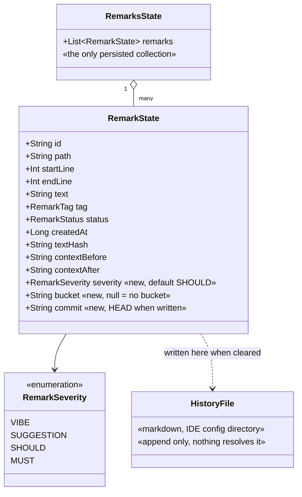
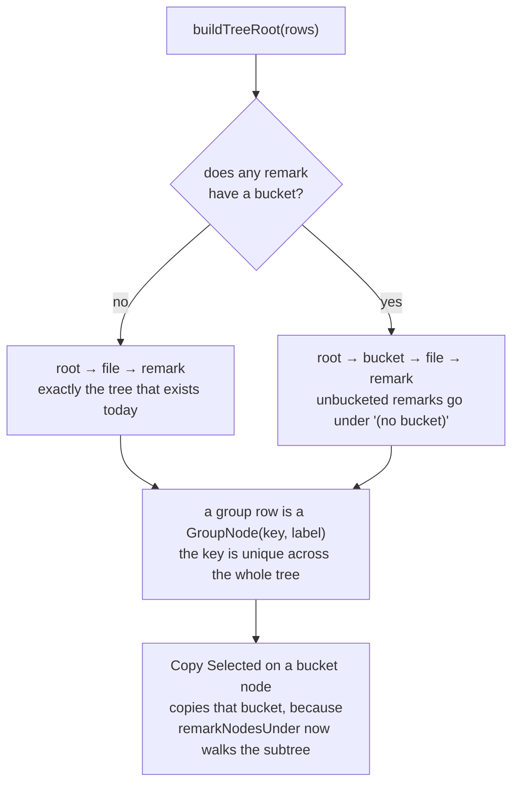
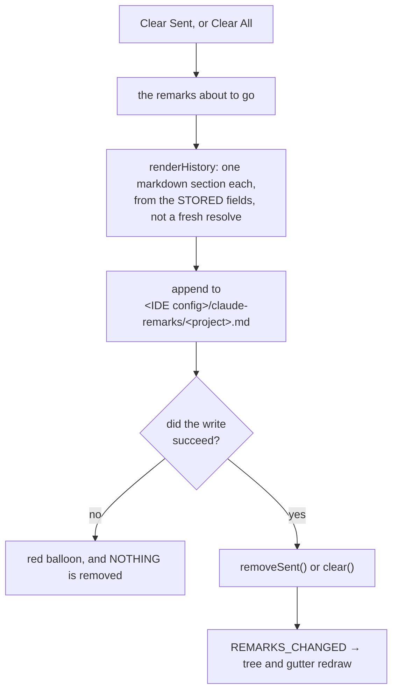

# Claude Remarks — Phase 5 Implementation Plan

**Status: not started.** Branch `claude-remarks-phase1-2`. The diff-viewer idea is being built by
another agent and is deliberately not in this plan.

## Contents

1. [What is true today](#1-what-is-true-today)
2. [The shape of the change](#2-the-shape-of-the-change)
3. [Scope judgement: what I would cut](#3-scope-judgement-what-i-would-cut)
4. [The ordering, and why not to fix it](#4-the-ordering-and-why-not-to-fix-it)
5. [Decisions carried in, and the two I changed](#5-decisions-carried-in-and-the-two-i-changed)
6. [Platform facts checked against the 2025.2 jars](#6-platform-facts-checked-against-the-20252-jars)
7. [Rules that must hold at every step](#7-rules-that-must-hold-at-every-step)
8. [Implementation steps](#8-implementation-steps)
   - [Task 1: Document the action ids for IdeaVim, and pin them](#task-1-document-the-action-ids-for-ideavim-and-pin-them)
   - [Task 2: Severity and bucket on the record, and their mutation functions](#task-2-severity-and-bucket-on-the-record-and-their-mutation-functions)
   - [Task 3: The tree grows a bucket level](#task-3-the-tree-grows-a-bucket-level)
   - [Task 4: One menu for changing a remark, used by the gutter and the tree](#task-4-one-menu-for-changing-a-remark-used-by-the-gutter-and-the-tree)
   - [Task 5: Severity in the copied prompt, and the scale note](#task-5-severity-in-the-copied-prompt-and-the-scale-note)
   - [Task 6: Tag chips replace the drop-down](#task-6-tag-chips-replace-the-drop-down)
   - [Task 7: Alt+0 to Alt+4 pick the tag](#task-7-alt0-to-alt4-pick-the-tag)
   - [Task 8: Read the repository HEAD, with no VCS dependency](#task-8-read-the-repository-head-with-no-vcs-dependency)
   - [Task 9: Stamp each remark with the commit, and show it](#task-9-stamp-each-remark-with-the-commit-and-show-it)
   - [Task 10: Write cleared remarks to a history file](#task-10-write-cleared-remarks-to-a-history-file)
   - [Task 11: Clear Sent and Clear All archive before they delete](#task-11-clear-sent-and-clear-all-archive-before-they-delete)
   - [Task 12: Class-name completion — read the recommendation first](#task-12-class-name-completion--read-the-recommendation-first)
   - [Task 13: Verify the four hard constraints](#task-13-verify-the-four-hard-constraints)
   - [Task 14: Update design.md, CLAUDE.md and the README](#task-14-update-designmd-claudemd-and-the-readme)
9. [Known limits](#9-known-limits)
10. [Hand checks in a sandbox IDE](#10-hand-checks-in-a-sandbox-ide)

## 1. What is true today

Read from the source on this branch, not assumed.

**A remark carries eleven stored fields, and none of them is a severity, a bucket or a commit.**
`model/RemarkState.kt:22-34` declares `id`, `path`, `startLine`, `endLine`, `text`, `tag`,
`status`, `createdAt`, `textHash`, `contextBefore`, `contextAfter`. That is the whole record.

**The remarks list is the only persisted collection, and its annotation is load-bearing.**
`store/RemarkStore.kt:52-53` carries `@get:XCollection(style = XCollection.Style.v2)` on
`val remarks by list<RemarkState>()`. Without it the list serializes empty and every remark is lost
with nothing logged. Phase 5 adds no second persisted collection — see task 10 for why.

**Six functions change a remark, and each one publishes.** `store/RemarkEdits.kt:37-93` holds
`addRemark`, `editRemark`, `deleteRemark`, `markRemarksSent`, `clearSentRemarks`,
`clearAllRemarks`. Phase 5 makes that eight.

**Clearing deletes outright.** `store/RemarkEdits.kt:75-79` calls `removeSent()` and
`store/RemarkEdits.kt:81-85` calls `clear()`. Nothing is written anywhere before the remarks go.

**The tree has exactly two levels, and a group row is a bare String.**
`ui/RemarksTree.kt:78-90` builds the root, groups by `path`, and puts the path string straight into
the node as its user object. `ui/RemarksTree.kt:118-120` draws any `String` user object in bold.

**Two places in the panel assume that two-level shape.** `ui/RemarksToolWindowFactory.kt:146-151`
turns a user object into a selection key, and a group's key is the path string itself.
`ui/RemarksToolWindowFactory.kt:178-186` reads only the root's direct children when it collects the
file groups to collapse and re-expand. A third level breaks both.

**`remarkNodesUnder` walks one level down, not the whole subtree.** `ui/RemarksTree.kt:60-68` maps
a non-leaf node to its direct children and casts each to `RemarkNode`. With a bucket level above
the files, a selected bucket node would yield file nodes, which are not `RemarkNode`, so it would
answer an empty list. Delete and Copy Selected would both silently do nothing on a bucket.

**The tag is picked from a drop-down, and the drop-down costs a special case.**
`ui/RemarkInputPanel.kt:62-64` builds a `ComboBox` of label strings.
`ui/RemarkInputPanel.kt:115-122` is `enterInTagBox`, which exists only because Enter means two
different things depending on whether the drop-down is open. `RemarkInputPanelTest:101-112` pins it.

**Enter and Shift+Enter are Swing input-map bindings on the text area.**
`ui/RemarkInputPanel.kt:69-79`. `RemarkInputPanelTest:59-70` looks the bindings up in the map rather
than dispatching key events, so no window is needed.

**The remark heading in the prompt has four parts.** `render/PromptRenderer.kt:44-47`: the number,
the line range, the tag, and the orphan note.

**The prompt header is entirely the user's own string.** `settings/RemarkSettings.kt:14-31` holds
the default; `settings/RemarkSettingsConfigurable.kt:30-31` binds a text area straight to it. Anything
that lives only inside that default text is gone the moment someone rewrites it.

**The gutter icon menu has two items.** `editor/RemarkGutterIcon.kt:94-100`: Edit Remark and
Delete Remark. `editor/RemarkGutterIcon.kt:29-37` is the `RemarkPlacement` record the gutter
computes off the EDT.

**The two action ids already exist and are already namespaced.**
`src/main/resources/META-INF/plugin.xml:29` is `ClaudeRemarks.AddRemark` and `:42` is
`ClaudeRemarks.CopyAll`. `plugin.xml:13-15` registers the tool window with `id="Claude Remarks"`.
Nothing in `README.md` mentions any of them, and nothing pins them.

### One correction to `docs/ideas.md`

The note on tag chips writes the call as `row.segmentedButton(items) { presentation, item -> ... }`.
The bytecode says the lambda's first parameter is named `$this$segmentedButton`, so it is a receiver,
not a parameter. In Kotlin it is written `segmentedButton(items) { text = it }`, where `this` is the
`SegmentedButton.ItemPresentation` and `it` is the item. The feasibility conclusion in the note is
right; only the call shape is different.

## 2. The shape of the change

The record grows three scalar fields. Nothing else about storage changes.



The bucket field is what turns the tree from two levels into three, and only when it is used:



And Clear stops being a delete:



## 3. Scope judgement: what I would cut

You asked me to say so rather than plan dutifully. Three things.

**Cut class-name completion (task 12).** The prompt already quotes the code each remark points at,
so a symbol name typed into a remark is only useful when it names a *different* place. The IDE
already solves that with `Copy Reference` (`Ctrl+Alt+Shift+C`), which puts the fully qualified name
on the clipboard, and the remark box already accepts paste. That is the whole feature for zero
lines of code. The version in `docs/ideas.md` — swapping `JBTextArea` for `EditorTextField` — costs
the Enter and Shift+Enter bindings, a fight over which of two nested popups owns Escape, an IdeaVim
interaction nobody has tested, and a rewrite of a test that is green today. Task 12 below plans the
cheap version instead, and opens with this recommendation. If one thing is dropped from this plan,
drop that task.

**Cut the "current bucket".** `docs/ideas.md` asks whether new remarks should join a current bucket
by default, and answers "probably yes, otherwise every remark needs the field filled in by hand".
That is only true if buckets are assigned one remark at a time. They are not: task 3 makes
`remarkNodesUnder` walk the subtree, so selecting a file node — or the whole tree — and choosing
Move to Bucket is one action for a whole reading pass. Skipping the current bucket removes a
persisted setting, a toolbar control, and the class of confusion where a remark lands in a bucket
you forgot you had selected. It also keeps the input popup untouched, which your own decision
demands. What is lost: if you want every remark bucketed as you write it, you must remember to move
them afterwards. Add the current bucket when someone actually forgets and minds.

**Cut a "Copy Bucket" toolbar button.** `docs/ideas.md` suggests one. It is not needed. Select the
bucket node in the tree and press Copy Selected — that already means "everything under this node"
once `remarkNodesUnder` is recursive. One fewer button, one fewer thing to grey out correctly.

Nothing else here is worth cutting. Severity is the item with the highest value per line, because
it changes what the model does with the prompt rather than what the tree looks like.

## 4. The ordering, and why not to fix it

The order is 1 (IdeaVim), then 2-5 (severity and buckets), then 6-7 (chips and keys), then 8-11
(history and the commit stamp), then 12 (completion). It is decided. One part of it looks like a
mistake and is not.

Tasks 6 and 7 put the tag chips and the Alt keys on the Swing input map of a `JBTextArea`. Task 12,
if it is ever built as the full `EditorTextField` swap, moves those keys into the editor's action
system and throws that work away.

That is deliberate. The keys are about ten lines plus one test. The input rewrite is the largest
single item on the list and the one most likely to be cut. Shipping keyboard tag selection now is
worth writing those ten lines twice. Do not reorder this to "save" the rewrite: the saving is ten
lines, and the cost is that the fastest, cheapest improvement to the daily flow waits behind the
riskiest task on the list.

## 5. Decisions carried in, and the two I changed

Carried in unchanged:

- **The severity scale is `vibe / suggestion / should / must`.** Decided. Not an open question.
- **Severity is worthless unless the prompt acts on it.** The tree and the gutter tooltip show it,
  and the prompt explains the scale. The explanation is appended by the renderer, not stored in the
  editable header, so rewriting the header cannot silently strip the meaning out from under the
  levels. Task 5.
- **The input popup stays fast.** No severity chooser in it. The default is applied and the level is
  changed afterwards, from the gutter icon menu or the tree. Task 4.
- **The copied prompt stays grouped by file.** It is not re-sorted by severity. The code is what
  makes a remark understandable, and splitting a file's remarks apart to sort them costs more than
  it buys.
- **The commit is captured once, when the remark is written.** It records what the author was
  looking at. Nothing refreshes it.
- **The commit is read from `.git` directly.** No Git4Idea. The plugin keeps depending only on
  `com.intellij.modules.platform`. Task 8 handles `.git` being a file and a detached HEAD.
- **History lives in the IDE configuration directory.** Never in the project, never in version
  control.
- **The active list must not grow.** Everything in it is resolved per remark on every change.

Two things I changed, and you should agree before execution starts.

**The archive is a markdown file, not a second persisted list.** Your decision said cleared remarks
"move to a separate archive list". The reason given was that the active list must not grow, and a
file satisfies that reason completely — nothing ever resolves it. The choice is between a persisted
XML collection and an append-only markdown file. With the XML collection you get a structured
archive you could one day restore from, and you pay for a second service that has to copy the same
`PersistentStateComponentWithModificationTracker` shape `RemarkStore` has (the deep `snapshot()`, the
`@Synchronized` mutators, the `modCount()`), plus a new `@get:XCollection` and its trap, plus a
browse window before a person can read a single archived remark. With the markdown file you get
about fifteen lines, a file you can open, grep and paste from today, and no way to restore a remark
by pressing a button. Since this plan does not build a browse window either way, the structured
archive buys nothing today and costs a service. The general property: the XML archive is
speculative structure. I chose the file. Task 10 and task 11.

**A single Delete still deletes.** Only Clear Sent and Clear All archive. Deleting one row you
picked out is an explicit "this one was a mistake", and archiving every typo makes the history file
useless. Say so if you want single deletes archived too — it is one line in `deleteRemark`.

**The default severity is `should`.** A remark you bothered to write is usually something you want
done, and the two ends of the scale — `vibe` and `must` — are the ones worth choosing on purpose.
Change the default in one place if you disagree: `model/RemarkState.kt`.

## 6. Platform facts checked against the 2025.2 jars

Checked with `javap` against
`/Users/sasha/.gradle/caches/9.1.0/transforms/c3bd2a49efd270bc2558f65097ad6f39/transformed/ideaIC-2025.2-aarch64/lib`.

- `Row.segmentedButton(Collection<T>, Function2<SegmentedButton.ItemPresentation, T, Unit>): SegmentedButton<T>`
  exists. The first lambda parameter is named `$this$segmentedButton` in the bytecode, so in Kotlin
  it is a receiver: `segmentedButton(items) { text = it }`.
- `SegmentedButton<T>` has `getItems`/`setItems`, `getSelectedItem`/`setSelectedItem`,
  `getComponent`, `bind`, `whenItemSelected`, `whenItemSelectedFromUi`.
- `SegmentedButton.ItemPresentation` has `text`, `toolTipText`, `icon`, `enabled`.
- `PopupHandler.installPopupMenu(JComponent, ActionGroup, String)` exists.
- `Messages.showEditableChooseDialog(String, String, Icon, String[], String, InputValidator): String`
  exists. It returns null when the dialog is cancelled.
- `PathManager.getConfigDir(): java.nio.file.Path` exists. It is not called by this plan — see below.
- `ActivateToolWindowAction.Manager.getActionIdForToolWindow(String): String` is public and static,
  so task 1's test can derive the tool window action id rather than assert a hand-written string.
- `ChooseByNameContributor.CLASS_EP_NAME` exists, in `app-client.jar`. Whether it is present in
  every JetBrains IDE that satisfies `com.intellij.modules.platform` is **not** settled here. Task 12
  guards for it at runtime.

One thing worth stating because it deletes code before it is written: an application-level `@State`
with `Storage("someFile.xml")` already lands inside `PathManager.getConfigDir()`. That is where
`settings/RemarkSettings.kt` writes `remarksPluginSettings.xml` today. So "history lives in the IDE
config directory" needs no path code at all if the archive were an XML component. Task 10 does call
`PathManager.getConfigDir()`, because a markdown file is not a `@State` component — but the
directory is the same one the platform already uses, so there is no second place to reason about.

## 7. Rules that must hold at every step

These are grep-enforced in `CLAUDE.md`. Every task preserves all four.

1. **Nothing under `src/` writes to a source file, ever.**

   ```bash
   grep -rnE "WriteCommandAction|WriteAction\.|runWriteAction|insertString|replaceString|deleteString|[Dd]ocument\.setText|setBinaryContent" src/
   ```

   Task 10 writes a file, with `Files.writeString` into the IDE configuration directory. That is
   neither a source file nor inside the project, and it does not match the pattern.

2. **`anchor/` and `render/PromptRenderer.kt` stay free of `com.intellij` imports.** Task 5 changes
   `PromptRenderer.kt` and must add none. The scale note is a `const val` in that same file, which
   is the point: it is part of the rendered document, not a setting.

3. **`store/RemarkEdits.kt` holds the only functions that change a remark.** Six today, eight after
   task 2. The grep in `CLAUDE.md` lists the store's mutator names by hand:

   ```bash
   grep -rnE "RemarkStore\.getInstance\([^)]*\)\.(add|remove|edit|markSent|removeSent|clear)\(" \
     src/main/kotlin --include=*.kt | grep -v RemarkEdits.kt
   ```

   That list has to be edited every time a mutator is added, and forgetting is silent: the guard
   keeps passing while it stops covering the new function. Task 13 replaces it with a form that
   needs no editing — allow the one read-only method instead of listing the writers:

   ```bash
   grep -rn "RemarkStore\.getInstance([^)]*)\." src/main/kotlin --include=*.kt \
     | grep -v RemarkEdits.kt | grep -v "\.all()"
   ```

4. **Nothing remark-related enters version control.** Remarks stay in `.idea/workspace.xml`. The
   history file is in the IDE configuration directory, outside every project. The large-payload
   copy file is in the system temp directory. There is no path that writes inside a project.

Two more, carried from earlier phases because breaking them cost real time:

5. **Every persisted field needs a round-trip test.** Task 2 adds three, and one of them
   (`severity`) needs a second test proving that a remark stored before the field existed loads with
   the default rather than a null.
6. **Prove a test is a real guard by mutation.** Break the production line the test covers, watch
   the named test fail, restore. Every task below names the mutation.

## 8. Implementation steps

TDD throughout: write the failing test, run it, watch it fail for the right reason, then implement.
Run the narrow per-task command after each change. The full suite runs at the end. Complete each
task before starting the next. No parallel waves — task 3 consumes task 2, task 4 consumes task 3,
task 9 consumes task 8, task 11 consumes task 10.

### Task 1: Document the action ids for IdeaVim, and pin them

**Model:** haiku

**Files:**
- Modify: `README.md` — add a section `## IdeaVim` after the section `## Installing into your own IDE`
- Modify: `src/main/resources/META-INF/plugin.xml` — add a comment above the
  `<toolWindow id="Claude Remarks"` element
- Create: `src/test/kotlin/dev/sasha/clauderemarks/action/ActionIdsTest.kt`

Nothing to build. The ids work with `:action` today. What is missing is that nobody is told, and
that nothing stops a later change from renaming them.

- [x] write the failing test in `ActionIdsTest.kt`:

```kotlin
package dev.sasha.clauderemarks.action

import com.intellij.ide.actions.ActivateToolWindowAction
import com.intellij.openapi.actionSystem.ActionManager
import com.intellij.testFramework.fixtures.BasePlatformTestCase

/**
 * These three ids are a public interface. They are what a .ideavimrc maps with ":action <id>", and
 * they are documented in the README as ids that will not be renamed. A rename would break every
 * user's mapping silently: ":action" on an unknown id fails inside IdeaVim, not here, so nothing in
 * this project would ever notice.
 */
class ActionIdsTest : BasePlatformTestCase() {

    fun testTheRegisteredActionIdsAreTheDocumentedOnes() {
        val manager = ActionManager.getInstance()
        assertNotNull("ClaudeRemarks.AddRemark is documented in the README", manager.getAction("ClaudeRemarks.AddRemark"))
        assertNotNull("ClaudeRemarks.CopyAll is documented in the README", manager.getAction("ClaudeRemarks.CopyAll"))
    }

    /**
     * The tool window's activation action is generated by the platform from the tool window id in
     * plugin.xml, so it is not written down anywhere in Kotlin. Renaming <toolWindow id="Claude
     * Remarks"> silently changes the id the README publishes. This asserts the derivation, so at
     * least the documented string is checked against the rule that produces it.
     */
    fun testTheToolWindowActivationIdIsTheDocumentedOne() {
        assertEquals(
            "ActivateClaudeRemarksToolWindow",
            ActivateToolWindowAction.Manager.getActionIdForToolWindow("Claude Remarks"),
        )
    }
}
```

- [x] run `./gradlew test --tests "dev.sasha.clauderemarks.action.ActionIdsTest"` — must pass
      without any production change. If `getAction` returns null for either id, the plugin
      descriptor is not being loaded in the fixture, and that is a finding worth reporting rather
      than working around.
- [x] add the comment to `plugin.xml`, directly above the `<toolWindow>` element:

```xml
        <!-- The id is part of the plugin's public interface: the platform derives the action id
             ActivateClaudeRemarksToolWindow from it, and the README documents that id for IdeaVim
             mappings. Renaming this breaks every user's .ideavimrc without any error. -->
```

- [x] add the `## IdeaVim` section to `README.md`:

````markdown
## IdeaVim

IdeaVim can run any registered action by id with `:action <id>`, so the plugin works from a
`.ideavimrc` mapping with no extra code. These three ids are a public interface and will not be
renamed:

| Id | What it does |
| --- | --- |
| `ClaudeRemarks.AddRemark` | Open the remark box on the selection, or on the caret line |
| `ClaudeRemarks.CopyAll` | Turn every pending remark into one prompt on the clipboard |
| `ActivateClaudeRemarksToolWindow` | Open and focus the Claude Remarks tool window |

Example mappings:

```vim
nnoremap <leader>r :action ClaudeRemarks.AddRemark<CR>
vnoremap <leader>r :action ClaudeRemarks.AddRemark<CR>
nnoremap <leader>c :action ClaudeRemarks.CopyAll<CR>
nnoremap <leader>R :action ActivateClaudeRemarksToolWindow<CR>
```

Two things to check the first time you use it, rather than assume:

- **Visual mode.** Select lines with `V`, then `<leader>r`. `:action` invoked from visual mode has
  historically been awkward about whether the selection still exists when the action runs. The
  action reads `editor.selectionModel`, so if the selection is gone it falls back to the caret line
  and you get a one-line remark instead of the block you chose. If that happens, the fix is on the
  mapping side, not in the plugin.
- **Typing in the box.** The remark box is a plain Swing text area, which IdeaVim does not touch, so
  typing, Enter and Escape all behave normally.
````

- [x] run `./gradlew verifyPluginProjectConfiguration` — must report no errors
- [x] **mutation check**: change `ClaudeRemarks.AddRemark` to `ClaudeRemarks.AddRemarkX` in
      `plugin.xml`. `testTheRegisteredActionIdsAreTheDocumentedOnes` must fail. Restore it. Then
      change the `<toolWindow id>` to `"Claude Remarks 2"` and confirm
      `testTheToolWindowActivationIdIsTheDocumentedOne` does **not** fail — that is the limit of
      this guard, and the plugin.xml comment is what covers the gap.
- [x] commit

### Task 2: Severity and bucket on the record, and their mutation functions

**Model:** sonnet

**Files:**
- Modify: `src/main/kotlin/dev/sasha/clauderemarks/model/RemarkState.kt` — add `RemarkSeverity`, its
  `label` extension next to `RemarkTag.label`, and the `severity` and `bucket` properties on
  `RemarkState`
- Modify: `src/main/kotlin/dev/sasha/clauderemarks/store/RemarkStore.kt` — two `@Synchronized`
  methods on `RemarksState` after `markSent`, and two forwarders next to `RemarkStore.markSent`
- Modify: `src/main/kotlin/dev/sasha/clauderemarks/store/RemarkEdits.kt` — two functions after
  `markRemarksSent`, and the doc comment that says "six functions"
- Modify: `src/test/kotlin/dev/sasha/clauderemarks/store/TestRemarks.kt` — two parameters on the
  `remark()` builder
- Modify: `src/test/kotlin/dev/sasha/clauderemarks/store/RemarkStoreStateTest.kt` — round-trip and
  mutator tests, after `an edited remark survives the round trip through xml`
- Modify: `src/test/kotlin/dev/sasha/clauderemarks/store/RemarkEditsTest.kt` — publish tests, after
  `testMarkingSentPublishesAndKeepsTheRemark`

Both fields are plain scalars on an existing `BaseState`, so the `@get:XCollection` trap does not
apply. What does apply is that `severity` has a non-null default, and a remark written before this
field existed has no attribute for it in `workspace.xml`. That case gets its own test.

- [x] add the failing tests to `RemarkStoreStateTest.kt`:

```kotlin
    @Test
    fun `severity and bucket survive the round trip`() {
        val state = RemarkStore.RemarksState()
        state.addRemark(remark(id = "r-1", severity = RemarkSeverity.MUST, bucket = "auth refactor"))

        val restored = roundTrip(state).remarks.single()

        assertEquals(RemarkSeverity.MUST, restored.severity)
        assertEquals("auth refactor", restored.bucket)
    }

    @Test
    fun `a remark with no bucket round-trips as null`() {
        val state = RemarkStore.RemarksState()
        state.addRemark(remark(id = "r-1", bucket = null))

        assertNull(roundTrip(state).remarks.single().bucket)
    }

    /**
     * Every remark already in someone's workspace.xml was written before the severity field
     * existed, so its element has no severity attribute at all. The default has to come back, not
     * null: a null severity would reach the renderer and the tree, both of which read it without a
     * null check, and the failure would be a crash on the first copy after upgrading.
     */
    @Test
    fun `a remark stored before severity existed loads with the default`() {
        val restored = XmlSerializer.deserialize(
            JDOMUtil.load("""<RemarksState><remarks><RemarkState id="r-1" path="src/Foo.kt" /></remarks></RemarksState>"""),
            RemarkStore.RemarksState::class.java,
        )

        assertEquals(RemarkSeverity.SHOULD, restored.remarks.single().severity)
    }

    @Test
    fun `setting the severity only touches the ids given and marks the state as changed`() {
        val state = RemarkStore.RemarksState()
        state.addRemark(remark(id = "r-1"))
        state.addRemark(remark(id = "r-2"))
        val before = state.modificationCount

        assertEquals(1, state.setSeverity(setOf("r-1"), RemarkSeverity.MUST))

        assertEquals(RemarkSeverity.MUST, state.snapshot().first { it.id == "r-1" }.severity)
        assertEquals(RemarkSeverity.SHOULD, state.snapshot().first { it.id == "r-2" }.severity)
        assertTrue(state.modificationCount > before)
    }

    @Test
    fun `setting the severity to what it already is changes nothing`() {
        val state = RemarkStore.RemarksState()
        state.addRemark(remark(id = "r-1", severity = RemarkSeverity.MUST))
        val before = state.modificationCount

        assertEquals(0, state.setSeverity(setOf("r-1"), RemarkSeverity.MUST))

        assertEquals(before, state.modificationCount)
    }

    @Test
    fun `setting the bucket writes it and clearing it writes null`() {
        val state = RemarkStore.RemarksState()
        state.addRemark(remark(id = "r-1"))

        assertEquals(1, state.setBucket(setOf("r-1"), "auth refactor"))
        assertEquals("auth refactor", state.snapshot().single().bucket)

        assertEquals(1, state.setBucket(setOf("r-1"), null))
        assertNull(state.snapshot().single().bucket)
    }

    @Test
    fun `setting the bucket to what it already is changes nothing`() {
        val state = RemarkStore.RemarksState()
        state.addRemark(remark(id = "r-1", bucket = "b"))
        val before = state.modificationCount

        assertEquals(0, state.setBucket(setOf("r-1"), "b"))

        assertEquals(before, state.modificationCount)
    }
```

Add `import dev.sasha.clauderemarks.model.RemarkSeverity` to that file.

- [x] run `./gradlew test --tests "dev.sasha.clauderemarks.store.RemarkStoreStateTest"` — expect a
      compile failure
- [x] add to `model/RemarkState.kt`:

```kotlin
/**
 * How strongly a remark should be acted on. Declared low to high.
 *
 * A second axis next to the tag, and a different question: the tag says what kind of remark it is,
 * this says how much it matters. Without it a `refactor` remark reads the same in the prompt
 * whether it was an idle thought or the whole point of the reading pass, so the model either does
 * everything or guesses.
 */
enum class RemarkSeverity { VIBE, SUGGESTION, SHOULD, MUST }

/** Lowercase, for the same reason RemarkTag.label is: this exact string is printed into the tree,
 *  the tooltip, the history file and the prompt. */
val RemarkSeverity.label: String get() = name.lowercase()
```

and inside `RemarkState`, after `status`:

```kotlin
    /**
     * Defaults to SHOULD rather than being nullable. A remark you bothered to write is usually
     * something you want done; the two ends of the scale are the ones worth choosing on purpose.
     * Non-null also means the renderer and the tree can print it with no null check, and a remark
     * stored before this field existed loads with the default instead of a null.
     */
    var severity by enum(RemarkSeverity.SHOULD)

    /** Null means no bucket. Set from the tree or the gutter menu, never in the input popup: the
     *  popup has to stay fast, and a second chooser in it makes it a form. */
    var bucket by string()
```

- [x] add to `RemarkStore.RemarksState`, after `markSent`:

```kotlin
        /** Returns how many actually changed, so re-applying the level a remark already has is a
         *  no-op — the same shape as markSent, for the same reason. */
        @Synchronized
        fun setSeverity(ids: Set<String>, severity: RemarkSeverity): Int {
            val changed = remarks.filter { it.id in ids && it.severity != severity }
            changed.forEach { it.severity = severity }
            if (changed.isNotEmpty()) incrementModificationCount()
            return changed.size
        }

        /** [bucket] null takes a remark out of every bucket. Returns how many actually changed. */
        @Synchronized
        fun setBucket(ids: Set<String>, bucket: String?): Int {
            val changed = remarks.filter { it.id in ids && it.bucket != bucket }
            changed.forEach { it.bucket = bucket }
            if (changed.isNotEmpty()) incrementModificationCount()
            return changed.size
        }
```

and the forwarders on `RemarkStore`, next to `markSent`:

```kotlin
    fun setSeverity(ids: Set<String>, severity: RemarkSeverity): Int =
        liveState.setSeverity(ids, severity)

    fun setBucket(ids: Set<String>, bucket: String?): Int = liveState.setBucket(ids, bucket)
```

Add `import dev.sasha.clauderemarks.model.RemarkSeverity` to `RemarkStore.kt`.

- [x] add the two parameters to the `remark()` builder in `TestRemarks.kt`:

```kotlin
    severity: RemarkSeverity = RemarkSeverity.SHOULD,
    bucket: String? = null,
```

and the two assignments in its body.

- [x] run `./gradlew test --tests "dev.sasha.clauderemarks.store.RemarkStoreStateTest"` — must pass
- [x] add the failing tests to `RemarkEditsTest.kt`:

```kotlin
    fun testSettingTheSeverityPublishes() {
        val stored = addOne()

        setRemarkSeverity(project, listOf(stored.id!!), RemarkSeverity.MUST)

        assertEquals(2, heard)
        assertEquals(RemarkSeverity.MUST, RemarkStore.getInstance(project).all().single().severity)
    }

    fun testSettingTheSeverityToWhatItAlreadyIsDoesNotPublish() {
        val stored = addOne()

        setRemarkSeverity(project, listOf(stored.id!!), RemarkSeverity.SHOULD)

        assertEquals(1, heard)
    }

    fun testSettingTheBucketPublishes() {
        val stored = addOne()

        setRemarkBucket(project, listOf(stored.id!!), "auth refactor")

        assertEquals(2, heard)
        assertEquals("auth refactor", RemarkStore.getInstance(project).all().single().bucket)
    }

    /**
     * A bucket typed as "  " is not a bucket. Without the trim it becomes a group in the tree whose
     * label is invisible, and a second one every time somebody types a different amount of
     * whitespace.
     */
    fun testABlankBucketMeansNoBucket() {
        val stored = addOne()
        setRemarkBucket(project, listOf(stored.id!!), "  ")

        assertNull(RemarkStore.getInstance(project).all().single().bucket)
    }

    fun testABucketIsTrimmedBeforeItIsStored() {
        val stored = addOne()
        setRemarkBucket(project, listOf(stored.id!!), "  auth refactor  ")

        assertEquals("auth refactor", RemarkStore.getInstance(project).all().single().bucket)
    }
```

- [x] add the two functions to `RemarkEdits.kt`, after `markRemarksSent`:

```kotlin
fun setRemarkSeverity(project: Project, ids: Collection<String>, severity: RemarkSeverity) {
    if (RemarkStore.getInstance(project).setSeverity(ids.toSet(), severity) > 0) {
        notifyRemarksChanged(project)
    }
}

/**
 * Blank means no bucket, and the name is trimmed. Both live here rather than at the call site,
 * because there are two call sites — the gutter icon menu and the tree — and a bucket name that
 * differs only by whitespace is a second group in the tree that looks identical to the first.
 */
fun setRemarkBucket(project: Project, ids: Collection<String>, bucket: String?) {
    val clean = bucket?.trim()?.takeIf { it.isNotEmpty() }
    if (RemarkStore.getInstance(project).setBucket(ids.toSet(), clean) > 0) {
        notifyRemarksChanged(project)
    }
}
```

Change the file's doc comment from "These six functions" to "These eight functions", and add
`import dev.sasha.clauderemarks.model.RemarkSeverity`.

- [x] run `./gradlew test --tests "dev.sasha.clauderemarks.store.*"` — all must pass
- [x] **mutation check**: three of them, because three separate things could be wrong.
      1. Change `var severity by enum(RemarkSeverity.SHOULD)` to `var severity by enum<RemarkSeverity>()`
         (nullable, no default). `a remark stored before severity existed loads with the default`
         must fail. Restore it.
      2. Delete the `incrementModificationCount()` inside `setSeverity`.
         `setting the severity only touches the ids given and marks the state as changed` must fail
         on its count assertion. Restore it.
      3. Delete the `?.trim()?.takeIf { it.isNotEmpty() }` in `setRemarkBucket`.
         `testABlankBucketMeansNoBucket` must fail. Restore it.
- [x] commit

### Task 3: The tree grows a bucket level

**Model:** opus

**Files:**
- Modify: `src/main/kotlin/dev/sasha/clauderemarks/ui/RemarksTree.kt` — add `GroupNode`, add
  `bucket` and `severity` to `RemarkNode`, rewrite `buildTreeRoot` and `remarkNodesUnder`, change
  the `is String` branch of `RemarkTreeRenderer`
- Modify: `src/main/kotlin/dev/sasha/clauderemarks/ui/RemarksToolWindowFactory.kt` — `keyOf`,
  `collapsedFiles` → `collapsedGroups`, `recollapse`, `fileNodes` → `groupNodes`
- Modify: `src/test/kotlin/dev/sasha/clauderemarks/ui/RemarksTreeTest.kt` — the `row()` helper gains
  `bucket` and `severity`, `fileNames` reads a `GroupNode`, plus the new bucket tests
- Modify: `src/test/kotlin/dev/sasha/clauderemarks/ui/RemarksPanelTest.kt` — one new test for a
  three-level tree

This is the task with the highest chance of a quiet defect, which is why it is `opus`. The panel's
selection and collapse machinery has already produced three real bugs (see the comments at
`ui/RemarksToolWindowFactory.kt:120-124`, `:133-141` and `:153-157`), and every one of them was
about capture and restore describing different things.

Two rules shape the design.

**The bucket level appears only when a bucket is used.** Somebody who never touches buckets must get
exactly the tree they have today, with no `(no bucket)` wrapper around everything. Four lines, and
it keeps the default experience unchanged.

**A group row carries a key as well as a label.** Today a group's user object is the path string,
and the panel uses that string as the selection key. With two levels of group, a bucket named `src`
and a file named `src` would be the same key, and restoring a selection after a rebuild would pick
the wrong one. `GroupNode(key, label)` separates what is drawn from what identifies it, and the key
is the whole path from the root.

- [x] write the failing tests in `RemarksTreeTest.kt` (and change the `row()` helper and
      `fileNames` to match):

```kotlin
    /** Somebody who has never used a bucket must get exactly the tree they had before. */
    @Test
    fun `with no buckets in use the tree is still root then file then remark`() {
        val root = buildTreeRoot(listOf(row(path = "src/Foo.kt", id = "r-1")))

        assertEquals(1, root.childCount)
        val file = root.getChildAt(0) as DefaultMutableTreeNode
        assertEquals("src/Foo.kt", (file.userObject as GroupNode).label)
        assertTrue((file.getChildAt(0) as DefaultMutableTreeNode).userObject is RemarkNode)
    }

    @Test
    fun `one remark in a bucket puts every remark under a bucket level`() {
        val root = buildTreeRoot(
            listOf(
                row(id = "r-1", path = "src/Foo.kt", bucket = "auth refactor"),
                row(id = "r-2", path = "src/Foo.kt", bucket = null),
            )
        )

        val labels = (0 until root.childCount)
            .map { ((root.getChildAt(it) as DefaultMutableTreeNode).userObject as GroupNode).label }
        // Unbucketed first: those are the remarks just written, and they are the ones being moved.
        assertEquals(listOf(NO_BUCKET_LABEL, "auth refactor"), labels)
    }

    /**
     * A bucket and a file can carry the same name. The panel uses a group's key to put a selection
     * back after a rebuild, so two groups sharing a key means restoring the wrong row.
     */
    @Test
    fun `a bucket and a file with the same name have different keys`() {
        val root = buildTreeRoot(listOf(row(id = "r-1", path = "src", bucket = "src")))

        val bucket = (root.getChildAt(0) as DefaultMutableTreeNode).userObject as GroupNode
        val file = ((root.getChildAt(0) as DefaultMutableTreeNode)
            .getChildAt(0) as DefaultMutableTreeNode).userObject as GroupNode

        assertEquals("src", bucket.label)
        assertEquals("src", file.label)
        assertNotEquals(bucket.key, file.key)
    }

    /**
     * Selecting a bucket and pressing Copy Selected is what "Copy Bucket" means, and it is the only
     * reason no Copy Bucket button is needed. The old one-level walk found file nodes under a
     * bucket, none of which is a RemarkNode, and answered an empty list — so Copy Selected and
     * Delete would both have done nothing at all, silently.
     */
    @Test
    fun `selecting a bucket node counts as selecting every row under every file in it`() {
        val root = buildTreeRoot(
            listOf(
                row(id = "r-1", path = "src/A.kt", bucket = "b"),
                row(id = "r-2", path = "src/Z.kt", bucket = "b"),
            )
        )

        val ids = remarkNodesUnder(listOf(root.getChildAt(0) as DefaultMutableTreeNode)).map { it.id }

        assertEquals(listOf("r-1", "r-2"), ids)
    }

    @Test
    fun `a leaf carries its bucket and its severity`() {
        val node = remarkNode(row(bucket = "b", severity = RemarkSeverity.MUST))

        assertEquals("b", node.bucket)
        assertEquals("must", node.severity)
    }
```

- [x] run `./gradlew test --tests "dev.sasha.clauderemarks.ui.RemarksTreeTest"` — expect a compile
      failure
- [x] rewrite the node-building half of `RemarksTree.kt`:

```kotlin
/** The label shown for remarks that are in no bucket, once any bucket exists. */
const val NO_BUCKET_LABEL = "(no bucket)"

/**
 * A group row: a bucket or a file.
 *
 * The key and the label are separate on purpose. A bucket can be called "src" and so can a
 * directory, and the panel puts a selection back after every rebuild by matching keys. Two groups
 * sharing a key means restoring the wrong one. The key is the whole path from the root; the label
 * is what is drawn.
 */
data class GroupNode(val key: String, val label: String)

/** One leaf. Everything a row needs to draw itself and to navigate. */
data class RemarkNode(
    val id: String,
    val path: String,
    val position: String,
    val text: String,
    val tag: String?,
    val severity: String,
    val bucket: String?,
    val sent: Boolean,
    val startLine: Int,
)

/**
 * Files in path order, rows inside a file in resolved line order, and buckets in name order with
 * the unbucketed ones first — those are the remarks just written, and the ones about to be moved.
 *
 * The bucket level appears only once some remark is actually in a bucket. Without that check,
 * anyone who never uses buckets would get a "(no bucket)" node wrapped around their whole tree for
 * a feature they never asked for.
 *
 * A remark with no id is left out, unchanged: its row would draw normally and then do nothing,
 * because Delete and Copy Selected both match on the id.
 */
fun buildTreeRoot(rows: List<ResolvedRemark>): DefaultMutableTreeNode {
    val root = DefaultMutableTreeNode("remarks")
    val nodes = rows.filter { it.remark.id != null }
        .map(::remarkNode)
        .sortedWith(compareBy({ it.bucket ?: "" }, { it.path }, { it.startLine }))

    if (nodes.none { it.bucket != null }) {
        addFileGroups(root, "", nodes)
        return root
    }

    nodes.groupBy { it.bucket }.forEach { (bucket, inBucket) ->
        val label = bucket ?: NO_BUCKET_LABEL
        val key = "bucket:$label"
        val bucketNode = DefaultMutableTreeNode(GroupNode(key, label))
        addFileGroups(bucketNode, "$key/", inBucket)
        root.add(bucketNode)
    }
    return root
}

private fun addFileGroups(
    parent: DefaultMutableTreeNode,
    keyPrefix: String,
    nodes: List<RemarkNode>,
) {
    nodes.groupBy { it.path }.forEach { (path, inFile) ->
        val fileNode = DefaultMutableTreeNode(GroupNode("${keyPrefix}file:$path", path))
        inFile.forEach { fileNode.add(DefaultMutableTreeNode(it)) }
        parent.add(fileNode)
    }
}

/**
 * The remark rows a set of selected tree nodes covers, at any depth. Distinct, because selecting a
 * bucket together with a file inside it would otherwise count that file's rows twice.
 */
fun remarkNodesUnder(selected: List<DefaultMutableTreeNode>): List<RemarkNode> =
    selected.flatMap(::leavesOf).distinct()

/**
 * Recursive, not one level down. A bucket node's children are file nodes, and a one-level walk over
 * them finds GroupNodes and answers nothing at all — so selecting a bucket and pressing Copy
 * Selected or Delete would do nothing, with no message.
 */
private fun leavesOf(node: DefaultMutableTreeNode): List<RemarkNode> =
    when (val user = node.userObject) {
        is RemarkNode -> listOf(user)
        else -> (0 until node.childCount).flatMap { index ->
            (node.getChildAt(index) as? DefaultMutableTreeNode)?.let(::leavesOf).orEmpty()
        }
    }
```

`remarkNode` gains two fields:

```kotlin
        severity = row.remark.severity.label,
        bucket = row.remark.bucket,
```

and `RemarkTreeRenderer` changes its group branch and appends the severity:

```kotlin
                append("${user.position}  ", SimpleTextAttributes.GRAYED_ATTRIBUTES)
                append(user.text, body)
                user.tag?.let { append("  [$it]", SimpleTextAttributes.GRAYED_ATTRIBUTES) }
                append("  ${user.severity}", SimpleTextAttributes.GRAYED_ATTRIBUTES)
                if (user.sent) append("  sent", SimpleTextAttributes.GRAYED_ATTRIBUTES)
            }

            is GroupNode -> append(user.label, SimpleTextAttributes.REGULAR_BOLD_ATTRIBUTES)
```

- [x] update `RemarksToolWindowFactory.kt`. Four changes, and they must agree with each other:

```kotlin
    /** A remark row is its id, a group row is its key. The root is invisible and never a row. */
    private fun keyOf(component: Any?): String? =
        when (val user = (component as? DefaultMutableTreeNode)?.userObject) {
            is RemarkNode -> user.id
            is GroupNode -> user.key
            else -> null
        }

    /**
     * The group rows that are shut right now, read before setRoot throws the rows away.
     *
     * isVisible is not decoration. JTree reports a node inside a collapsed ancestor as not
     * expanded, so without it every file group inside a collapsed bucket would be recorded as
     * collapsed and would stay shut after the rebuild even when the bucket is opened again. The
     * cost of the check: a file group you shut inside a bucket you then shut is forgotten. That is
     * the smaller surprise of the two.
     */
    private fun collapsedGroups(): Set<String> =
        groupNodes()
            .filter { (_, path) -> tree.isVisible(path) && !tree.isExpanded(path) }
            .map { it.first }
            .toSet()

    /** Shuts them again after expandAll, so a group you closed stays closed across a refresh. */
    private fun recollapse(groups: Set<String>) {
        if (groups.isEmpty()) return
        groupNodes().forEach { (key, treePath) -> if (key in groups) tree.collapsePath(treePath) }
    }

    /**
     * Every group row with the TreePath that reaches it, at any depth. Read from the model, not
     * from row indexes, so it does not depend on what is expanded at the time.
     */
    private fun groupNodes(): List<Pair<String, TreePath>> {
        val root = tree.model.root as? DefaultMutableTreeNode ?: return emptyList()
        val found = mutableListOf<Pair<String, TreePath>>()
        fun walk(node: DefaultMutableTreeNode, path: TreePath) {
            (node.userObject as? GroupNode)?.let { found += it.key to path }
            for (index in 0 until node.childCount) {
                val child = node.getChildAt(index) as? DefaultMutableTreeNode ?: continue
                walk(child, path.pathByAddingChild(child))
            }
        }
        walk(root, TreePath(root))
        return found
    }
```

`refresh()` changes its two local names from `wasCollapsed = collapsedFiles()` to
`wasCollapsed = collapsedGroups()`. Nothing else in the panel changes: `expandAll` already walks by
row index with a `while` loop, so it opens three levels as readily as two.

- [x] add the panel test to `RemarksPanelTest.kt`:

```kotlin
    /**
     * expandAll walks by row index and grows the range as rows appear, so it opens a third level
     * too. This pins that, and pins that a bucket node is one selection covering every row under it.
     */
    fun testABucketTreeIsFullyExpandedAndABucketNodeSelectsEveryRowUnderIt() {
        val first = addRemark(project, "A.kt", LINES, 0..0, "one", null)
        val second = addRemark(project, "B.kt", LINES, 0..0, "two", null)
        setRemarkBucket(project, listOf(first.id!!, second.id!!), "auth refactor")

        val panel = panel()

        // one bucket + two file groups + two rows
        assertEquals(5, panel.tree.rowCount)

        panel.tree.setSelectionRow(0)
        assertEquals(1, panel.tree.selectionCount)
        assertEquals(2, panel.selectedIds().size)
    }
```

- [x] run `./gradlew test --tests "dev.sasha.clauderemarks.ui.*"` — all must pass
- [x] **mutation check**: two.
      1. Change `leavesOf`'s recursive branch back to one level:
         `else -> (0 until node.childCount).mapNotNull { (node.getChildAt(it) as? DefaultMutableTreeNode)?.userObject as? RemarkNode }`.
         `selecting a bucket node counts as selecting every row under every file in it` must fail,
         and so must `testABucketTreeIsFullyExpandedAndABucketNodeSelectsEveryRowUnderIt`. Restore it.
         Done: exactly those two failed, nothing else.
      2. Change `addFileGroups` to build `GroupNode(path, path)` instead of prefixing the key.
         `a bucket and a file with the same name have different keys` must fail. Restore it.
         **This did not hold, and the test was fixed rather than the check dropped.** A bucket key
         already starts with `bucket:`, so it can never equal a bare path, and that test stayed
         green under the mutation. The thing the key prefix really protects is the same file
         appearing under two different buckets: both file groups would answer to one key, and the
         panel would restore the wrong one. A second test,
         `the same file under two buckets gives two different keys`, covers that, and it does fail
         under the mutation. Both tests are kept.
- [x] commit

### Task 4: One menu for changing a remark, used by the gutter and the tree

**Model:** sonnet

**Files:**
- Create: `src/main/kotlin/dev/sasha/clauderemarks/ui/RemarkActions.kt`
- Modify: `src/main/kotlin/dev/sasha/clauderemarks/editor/RemarkGutterIcon.kt` — `menuFor`, and add
  `severity` to `RemarkPlacement` and to `tooltipFor`
- Modify: `src/main/kotlin/dev/sasha/clauderemarks/editor/RemarkGutter.kt` — fill `severity` in
  `placementsFor`
- Modify: `src/main/kotlin/dev/sasha/clauderemarks/ui/RemarksToolWindowFactory.kt` — install a
  right-click menu on the tree, in `init`, after the Delete shortcut registration
- Create: `src/test/kotlin/dev/sasha/clauderemarks/ui/RemarkActionsTest.kt`
- Modify: `src/test/kotlin/dev/sasha/clauderemarks/editor/RemarkGutterIconTest.kt` — the tooltip
  test now expects the severity

One action group, built once, used from two places. The gutter icon menu acts on the one remark
under the icon; the tree's right-click menu acts on whatever is selected. The ids arrive as a lambda
rather than a list because the tree's selection changes between the menu being built and an item
being pressed.

The bucket chooser is an editable choose dialog, not a plain input prompt. Picking an existing
bucket by name is the common case, and typing it again by hand is exactly how "auth refactor" and
"auth-refactor" become two buckets that look like one.

- [x] write the failing test in `RemarkActionsTest.kt`:

```kotlin
package dev.sasha.clauderemarks.ui

import com.intellij.openapi.actionSystem.ActionGroup
import com.intellij.testFramework.fixtures.BasePlatformTestCase
import dev.sasha.clauderemarks.model.RemarkSeverity
import dev.sasha.clauderemarks.store.RemarkStore
import dev.sasha.clauderemarks.store.addRemark

/**
 * The menu itself is checked by hand. What is checked here is the part that would fail silently:
 * that every severity has an item, and that pressing one changes exactly the remarks the lambda
 * names at the moment it is pressed, not the ones it named when the menu was built.
 */
class RemarkActionsTest : BasePlatformTestCase() {

    override fun setUp() {
        super.setUp()
        // The light fixture project is shared across test classes.
        RemarkStore.getInstance(project).clear()
    }

    fun testThereIsOneItemForEverySeverity() {
        val group = remarkChangeActions(project) { emptyList() }
        val severity = group.getChildren(null).filterIsInstance<ActionGroup>().single()

        assertEquals(
            RemarkSeverity.entries.map { it.name.lowercase() },
            severity.getChildren(null).map { it.templatePresentation.text },
        )
    }

    /**
     * The ids are read when the item is pressed, not when the menu is built. The tree rebuilds
     * itself on every remark change, so a list captured at build time is stale by the time anybody
     * clicks — it would set the severity on rows that are no longer selected.
     */
    fun testPressingASeverityItemActsOnTheIdsAtPressTime() {
        val first = addRemark(project, "A.kt", listOf("a", "b"), 0..0, "one", null)
        var wanted = emptyList<String>()
        val group = remarkChangeActions(project) { wanted }
        val must = (group.getChildren(null).filterIsInstance<ActionGroup>().single())
            .getChildren(null).single { it.templatePresentation.text == "must" }

        wanted = listOf(first.id!!)
        must.actionPerformed(com.intellij.testFramework.TestActionEvent.createTestEvent(must))

        assertEquals(RemarkSeverity.MUST, RemarkStore.getInstance(project).all().single().severity)
    }
}
```

- [x] run `./gradlew test --tests "dev.sasha.clauderemarks.ui.RemarkActionsTest"` — expect a compile
      failure
- [x] create `ui/RemarkActions.kt`:

```kotlin
package dev.sasha.clauderemarks.ui

import com.intellij.openapi.actionSystem.ActionGroup
import com.intellij.openapi.actionSystem.DefaultActionGroup
import com.intellij.openapi.project.DumbAwareAction
import com.intellij.openapi.project.Project
import com.intellij.openapi.ui.Messages
import dev.sasha.clauderemarks.model.RemarkSeverity
import dev.sasha.clauderemarks.model.label
import dev.sasha.clauderemarks.store.RemarkStore
import dev.sasha.clauderemarks.store.setRemarkBucket
import dev.sasha.clauderemarks.store.setRemarkSeverity

/**
 * The actions that change remarks that already exist, built once and used from two places: the
 * gutter icon's click menu, which acts on the one remark under the icon, and the tool window
 * tree's right-click menu, which acts on whatever is selected.
 *
 * [ids] is a lambda, not a list. The tree rebuilds itself on every remark change, so a list read
 * when the menu was built is stale by the time anything in it is pressed.
 *
 * This is also the whole answer to "where does the severity get chosen". Not in the input popup:
 * that popup is the action that has to stay fast, and a second chooser in it turns it into a form.
 * The level is defaulted when the remark is written and changed here afterwards.
 */
fun remarkChangeActions(project: Project, ids: () -> List<String>): ActionGroup {
    val severity = DefaultActionGroup("Severity", true)
    RemarkSeverity.entries.forEach { level ->
        severity.add(DumbAwareAction.create(level.label) { setRemarkSeverity(project, ids(), level) })
    }
    // A plain DefaultActionGroup(vararg) is not a popup, so its children are inlined where it is
    // placed rather than becoming a nested submenu. The Severity group above IS a popup, on purpose.
    return DefaultActionGroup(
        severity,
        DumbAwareAction.create("Move to Bucket…") { chooseBucket(project, ids()) },
    )
}

/**
 * An editable chooser, not a plain text prompt. Picking an existing bucket by name is the common
 * case, and re-typing it is exactly how "auth refactor" and "auth-refactor" become two buckets that
 * look like one from across the tree. An empty answer means no bucket, which is how a remark comes
 * back out of one. Cancel returns null and changes nothing.
 */
private fun chooseBucket(project: Project, ids: List<String>) {
    if (ids.isEmpty()) return
    val stored = RemarkStore.getInstance(project).all()
    val existing = stored.mapNotNull { it.bucket }.distinct().sorted()
    val current = stored.firstOrNull { it.id == ids.first() }?.bucket.orEmpty()
    val chosen = Messages.showEditableChooseDialog(
        "Bucket for ${ids.size} remark${if (ids.size == 1) "" else "s"} (leave empty for none):",
        "Move to Bucket",
        null,
        existing.toTypedArray(),
        current,
        null,
    ) ?: return
    setRemarkBucket(project, ids, chosen)
}
```

- [x] wire it into the gutter icon menu. In `editor/RemarkGutterIcon.kt`:

```kotlin
private fun menuFor(project: Project, editor: Editor, id: String): ActionGroup = DefaultActionGroup(
    DumbAwareAction.create("Edit Remark") {
        val stored = RemarkStore.getInstance(project).all().firstOrNull { it.id == id } ?: return@create
        openRemarkEdit(project, editor, id, stored.text.orEmpty(), stored.tag)
    },
    // The same group the tree's right-click menu uses. Here the id is fixed: it is the remark whose
    // icon was clicked.
    remarkChangeActions(project) { listOf(id) },
    Separator.getInstance(),
    DumbAwareAction.create("Delete Remark") { deleteRemark(project, id) },
)
```

and add the severity to the placement and the tooltip:

```kotlin
data class RemarkPlacement(
    val id: String,
    val text: String,
    val tag: RemarkTag?,
    val severity: RemarkSeverity,
    val sent: Boolean,
    val startLine: Int,
    val endLine: Int,
    val orphaned: Boolean,
)
```

```kotlin
    placement.tag?.let { append("  [").append(it.label).append("]") }
    append("  ").append(placement.severity.label)
```

The renderer's `equals` and `hashCode` need no change: they already key on the tooltip text, and the
severity is inside it, so a severity change repaints and an unchanged one does not.

`editor/RemarkGutter.kt`'s `placementsFor` fills the new field:

```kotlin
                    severity = remark.severity,
```

- [x] install the tree menu. In `RemarksPanel.init`, after the Delete shortcut registration:

```kotlin
        // The same actions the gutter icon menu offers, acting on the tree selection instead of on
        // one icon. This is the only reason the tree needs a right-click menu at all: severity and
        // buckets are set after the fact, and the tree is where a whole reading pass is triaged.
        PopupHandler.installPopupMenu(tree, treeMenu(), "ClaudeRemarksTree")
```

and beside it:

```kotlin
    private fun treeMenu(): ActionGroup = DefaultActionGroup(
        remarkChangeActions(project) { selectedIds() },
        Separator.getInstance(),
        DumbAwareAction.create("Delete") { deleteSelected() },
    )
```

Imports to add: `com.intellij.openapi.actionSystem.ActionGroup`,
`com.intellij.openapi.actionSystem.Separator`, `com.intellij.ui.PopupHandler`.

- [x] update the tooltip expectation in `RemarkGutterIconTest.kt` so it includes the severity.
- [x] run `./gradlew test --tests "dev.sasha.clauderemarks.ui.*" --tests "dev.sasha.clauderemarks.editor.*"`
      — all must pass
- [x] **mutation check**: change `remarkChangeActions`'s parameter from `ids: () -> List<String>` to
      a plain `ids: List<String>` and capture it at build time in the test.
      `testPressingASeverityItemActsOnTheIdsAtPressTime` must fail. Restore it.
- [x] commit

### Task 5: Severity in the copied prompt, and the scale note

**Model:** sonnet

**Files:**
- Modify: `src/main/kotlin/dev/sasha/clauderemarks/render/PromptRenderer.kt` — `RenderedRemark`, the
  `SEVERITY_SCALE_NOTE` constant, the header block at the top of `renderPrompt`, the remark heading
- Modify: `src/main/kotlin/dev/sasha/clauderemarks/render/PromptPayload.kt` — fill `severity` in
  `collectForPrompt`
- Modify: `src/test/kotlin/dev/sasha/clauderemarks/render/PromptRendererTest.kt` — the remark
  builder and the new tests
- Modify: `src/test/kotlin/dev/sasha/clauderemarks/render/PromptPayloadTest.kt` — the collector now
  carries the severity through

This is the task that decides whether severity is worth anything. A level that is printed and never
explained is a word in a heading that nothing responds to.

The explanation is a constant in `PromptRenderer.kt`, not in `DEFAULT_PROMPT_HEADER`. The header is
editable in settings, so anything that lives only inside it disappears the moment someone rewrites
it — and the levels would keep being printed, now with nothing saying what they mean. The renderer
appends the note under whatever header the user wrote.

The note is appended on every copy, not only when the levels vary. The alternative was to print it
only when more than one level is in use. That saves four lines of prompt when every remark is at the
default, and it costs a branch that has to be right in the case that matters least. One rule, one
test, no branch.

`PromptRenderer.kt` must gain no `com.intellij` import — check with the grep in
[task 13](#task-13-verify-the-four-hard-constraints).

- [x] write the failing tests in `PromptRendererTest.kt`:

```kotlin
    @Test
    fun `the heading carries the severity after the tag`() {
        val out = renderPrompt("H", listOf(rendered(tag = "bug", severity = "must")))

        assertTrue(out, out.contains("### 1. lines 1-1 — bug — must"))
    }

    @Test
    fun `a remark with no tag still carries its severity`() {
        val out = renderPrompt("H", listOf(rendered(tag = null, severity = "vibe")))

        assertTrue(out, out.contains("### 1. lines 1-1 — vibe"))
    }

    /**
     * The scale is appended by the renderer, not stored in the editable header. Somebody who
     * rewrites the header in settings must not silently lose the meaning of the levels while the
     * levels keep being printed.
     */
    @Test
    fun `the scale is explained under whatever header the user wrote`() {
        val out = renderPrompt("my own header", listOf(rendered()))

        assertTrue(out.startsWith("my own header"))
        assertTrue(out.contains(SEVERITY_SCALE_NOTE.trim()))
        assertTrue(
            "the scale belongs above the remarks, not after them",
            out.indexOf(SEVERITY_SCALE_NOTE.trim()) < out.indexOf("### 1."),
        )
    }

    @Test
    fun `an empty remark list gets the header and nothing else`() {
        assertEquals("H\n", renderPrompt("H", emptyList()))
    }
```

- [x] run `./gradlew test --tests "dev.sasha.clauderemarks.render.PromptRendererTest"` — expect a
      compile failure
- [x] change `PromptRenderer.kt`. `RenderedRemark` gains one required field, right after `tag`:

```kotlin
    /** "vibe" | "suggestion" | "should" | "must", already lowercase. Never null: every remark has
     *  a level, defaulted when it was written. */
    val severity: String,
```

Required rather than defaulted on purpose: a default would let a caller forget to wire it and ship
"should" for everything, silently. A required parameter makes the compiler point at
`collectForPrompt`.

Add the note:

```kotlin
/**
 * Appended under the header on every copy.
 *
 * Not part of DEFAULT_PROMPT_HEADER, and that is the whole point. The header is editable in
 * settings, so anything living only inside it is gone the moment somebody rewrites it — and the
 * levels would keep being printed with nothing left to say what they mean. This is part of the
 * rendered document instead, so it survives any header.
 */
const val SEVERITY_SCALE_NOTE: String = """
Each remark carries one of four levels, saying how strongly to act on it:

- must — do it, whatever it costs.
- should — do it unless there is a concrete reason not to. If you skip it, say why.
- suggestion — do it if it is cheap and does not fight the surrounding code.
- vibe — an idle thought. You may decline it. Say in one line whether you took it.

A remark may also carry "commit <sha>". That is the revision the author was reading when they wrote
it. For a remark marked orphaned, comparing the file against that revision is the fastest way to
find where its code went.
"""
```

The opening of `renderPrompt`:

```kotlin
    val out = StringBuilder(header.trimEnd())
        .append("\n\n")
        .append(SEVERITY_SCALE_NOTE.trim())
        .append("\n\n---\n")
```

and the heading:

```kotlin
                out.append("\n### ").append(number).append(". ")
                    .append("lines ").append(remark.startLine + 1).append("-").append(remark.endLine + 1)
                remark.tag?.let { out.append(" — ").append(it) }
                out.append(" — ").append(remark.severity)
                if (remark.orphaned) out.append(" — orphaned, the line numbers are stale")
```

- [x] fill the field in `collectForPrompt`, next to `tag`:

```kotlin
            severity = row.remark.severity.label,
```

Add `import dev.sasha.clauderemarks.model.label` — it is already imported for `RemarkTag.label`, and
the extension for `RemarkSeverity` lives in the same file, so one import covers both.

- [x] run `./gradlew test --tests "dev.sasha.clauderemarks.render.*"` — all must pass
- [x] **mutation check**: delete the `.append(SEVERITY_SCALE_NOTE.trim())` line.
      `the scale is explained under whatever header the user wrote` must fail. Restore it. Then
      delete `out.append(" — ").append(remark.severity)` and confirm
      `the heading carries the severity after the tag` fails.
- [x] commit

### Task 6: Tag chips replace the drop-down

**Model:** sonnet

**Files:**
- Modify: `src/main/kotlin/dev/sasha/clauderemarks/ui/RemarkInputPanel.kt` — replace `tagBox` with
  `chips`, delete `enterInTagBox` and `COMBO_ENTER_KEY`, add `TAG_CHOICES` and `selectedTag`
- Modify: `src/test/kotlin/dev/sasha/clauderemarks/ui/RemarkInputPanelTest.kt` — delete
  `testEnterInTheTagChooserSavesOnlyWhenTheDropDownIsClosed`, rewrite the two tests that touch
  `tagBox`

This task deletes more than it adds, and that is the best part of it. `enterInTagBox`
(`ui/RemarkInputPanel.kt:115-122`) exists only because Enter means two different things depending on
whether a drop-down is open. There is no drop-down after this, so the special case, its comment and
its test all go.

The chip items are label strings, not `RemarkTag?`. `SegmentedButton<T>` is generic over the item
type, and `tagLabel` / `tagFromLabel` already exist as the pair that converts, already tested by
`RemarkInputRulesTest`. Using them keeps the whole nullable-generic question from arising.

**The one risk in this task.** The Kotlin UI DSL builds a real `ActionToolbar` under a segmented
button. Whether `panel { row { segmentedButton(...) } }` constructs under a headless
`BasePlatformTestCase` is not proven — `JBTextArea` and `ComboBox` do, which is what the current
tests rely on. If construction fails, the fallback is to hold the tag in a plain field on the panel
and let the chips only mirror it, so `submit()` and the tests read the field rather than the
component. Try the direct version first; it is fewer moving parts.

- [x] change the two `tagBox` tests in `RemarkInputPanelTest.kt` and delete the third:

```kotlin
    fun testSubmitHandsBackTheTypedTextAndTheChosenTag() {
        val panel = RemarkInputPanel("", null)
        panel.textArea.text = "  why is this locked?  "
        panel.selectedTag = RemarkTag.QUESTION
        var got: RemarkInput? = null
        panel.onSubmit = { got = it }

        panel.submit()

        assertEquals("why is this locked?", got?.text)
        assertEquals(RemarkTag.QUESTION, got?.tag)
    }

    fun testAnExistingRemarkOpensPreFilled() {
        val panel = RemarkInputPanel("old note", RemarkTag.REFACTOR)

        assertEquals("old note", panel.textArea.text)
        assertEquals(RemarkTag.REFACTOR, panel.selectedTag)
    }

    /** "(no tag)" is a chip like any other, so clearing the tag is one click, not a drop-down. */
    fun testTheNoTagChipIsFirstAndMeansNull() {
        val panel = RemarkInputPanel("x", RemarkTag.BUG)

        assertEquals(NO_TAG_LABEL, TAG_CHOICES.first())
        panel.selectedTag = null
        assertNull(panel.selectedTag)
    }
```

Delete `testEnterInTheTagChooserSavesOnlyWhenTheDropDownIsClosed` and the now-unused
`java.awt.event.ActionEvent` import if nothing else in the file needs it.

- [x] run `./gradlew test --tests "dev.sasha.clauderemarks.ui.RemarkInput*"` — expect a compile
      failure
- [x] change `RemarkInputPanel.kt`:

```kotlin
/** The chips, "(no tag)" first, then the four tags in enum order. The Alt keys in the next task
 *  index into this list, so the order here is the order there. */
val TAG_CHOICES: List<String> = listOf(NO_TAG_LABEL) + RemarkTag.entries.map { tagLabel(it) }
```

Inside the class, replacing `tagBox`:

```kotlin
    // Assigned by the panel { } builder below, which runs eagerly, so it is set before the init
    // block. Declared first, because Kotlin initializes properties in declaration order.
    private lateinit var chips: SegmentedButton<String>

    /**
     * A row of chips instead of a drop-down. Adding a remark is the action that has to stay fast,
     * and reaching for a drop-down breaks the flow of typing a sentence and pressing Enter.
     *
     * It also removes a special case rather than adding one. With a drop-down, Enter meant "save"
     * or "commit the highlighted item" depending on whether the list was open, and the plugin's own
     * binding won both times — so arrowing to "bug" and pressing Enter saved the remark with the
     * previous tag. There is no open state on a chip row, so that whole branch is gone.
     */
    private val chipRow: DialogPanel = panel {
        row("Tag:") {
            // The lambda's receiver is the ItemPresentation and its argument is the item, checked
            // in the bytecode: the first parameter is named "$this$segmentedButton".
            chips = segmentedButton(TAG_CHOICES) { text = it }
        }
    }

    /** What the chips say, as a tag. The one place the label strings are converted back. */
    var selectedTag: RemarkTag?
        get() = tagFromLabel(chips.selectedItem)
        set(value) {
            chips.selectedItem = tagLabel(value)
        }
```

In `init`, delete the whole `tagBox` binding block, set the initial value, and change the layout:

```kotlin
        selectedTag = initialTag

        add(JBScrollPane(textArea).apply { preferredSize = Dimension(520, 84) }, BorderLayout.CENTER)
        add(chipRow, BorderLayout.SOUTH)
```

`submit()` reads the property:

```kotlin
    fun submit() {
        val result = remarkInputResult(textArea.text, selectedTag) ?: return
        onSubmit?.invoke(result)
    }
```

Delete `enterInTagBox` and `COMBO_ENTER_KEY`. Imports: drop `com.intellij.openapi.ui.ComboBox`,
`java.awt.FlowLayout`, `javax.swing.JLabel`; add `com.intellij.openapi.ui.DialogPanel`,
`com.intellij.ui.dsl.builder.SegmentedButton`, `com.intellij.ui.dsl.builder.panel`,
`com.intellij.ui.dsl.builder.segmentedButton`.

- [x] run `./gradlew test --tests "dev.sasha.clauderemarks.ui.RemarkInput*"` — must pass
- [x] **mutation check**: change `selectedTag`'s getter to `get() = null`.
      `testSubmitHandsBackTheTypedTextAndTheChosenTag` must fail. Restore it.
- [x] commit

### Task 7: Alt+0 to Alt+4 pick the tag

**Model:** sonnet

**Files:**
- Modify: `src/main/kotlin/dev/sasha/clauderemarks/ui/RemarkInputPanel.kt` — the `init` block, after
  the Enter and Shift+Enter bindings
- Modify: `src/test/kotlin/dev/sasha/clauderemarks/ui/RemarkInputPanelTest.kt` — two tests

The same mechanism the Enter and Shift+Enter bindings already use: a keystroke in the text area's
`WHEN_FOCUSED` input map, an action in its action map, and a test that looks them up rather than
dispatching key events, so no window is needed.

Alt+0 is "(no tag)" and Alt+1 to Alt+4 are the four tags, in the order the chips show them. The keys
index into `TAG_CHOICES`, so the two can never drift apart.

**One thing this test cannot prove.** Alt+1 to Alt+4 are bound to the Project, Bookmarks, Find and
Run tool windows in the default keymap. Whether the IDE's key dispatcher gives way to a Swing input
map on the focused component inside a `JBPopup` is not settled by the existing Enter binding: Enter
is not a global IDE shortcut, so it never had to compete. The tests below pass either way, because
they invoke the action directly. **This is a hand check in a sandbox IDE, listed in
[section 10](#10-hand-checks-in-a-sandbox-ide).** If the IDE action wins, the fallback is to
register the five as real `AnAction`s with `registerCustomShortcutSet(..., panel, disposable)`,
which goes through the action system and therefore wins by construction — at the cost of a
`Disposable` parameter on `RemarkInputPanel`.

- [x] write the failing tests in `RemarkInputPanelTest.kt`:

```kotlin
    fun testEveryChipHasAnAltKey() {
        val panel = RemarkInputPanel("", null)
        val map = panel.textArea.getInputMap(JComponent.WHEN_FOCUSED)

        TAG_CHOICES.indices.forEach { index ->
            val stroke = KeyStroke.getKeyStroke(KeyEvent.VK_0 + index, InputEvent.ALT_DOWN_MASK)
            assertEquals("$TAG_KEY_PREFIX$index", map.get(stroke))
            assertNotNull(panel.textArea.actionMap.get(map.get(stroke)))
        }
    }

    /**
     * The binding existing is not the same as the binding doing the right thing. This presses the
     * actions and checks what the chips ended up saying, so a key wired to the wrong chip fails.
     */
    fun testAltOneSelectsTheFirstTagAndAltZeroClearsIt() {
        val panel = RemarkInputPanel("", null)
        val event = ActionEvent(panel, ActionEvent.ACTION_PERFORMED, "")

        panel.textArea.actionMap.get("${TAG_KEY_PREFIX}1").actionPerformed(event)
        assertEquals(RemarkTag.entries.first(), panel.selectedTag)

        panel.textArea.actionMap.get("${TAG_KEY_PREFIX}4").actionPerformed(event)
        assertEquals(RemarkTag.entries.last(), panel.selectedTag)

        panel.textArea.actionMap.get("${TAG_KEY_PREFIX}0").actionPerformed(event)
        assertNull(panel.selectedTag)
    }
```

- [x] run `./gradlew test --tests "dev.sasha.clauderemarks.ui.RemarkInputPanelTest"` — expect a
      compile failure
- [x] add to `RemarkInputPanel.kt`:

```kotlin
/** Action map keys for the tag chips, one per entry in TAG_CHOICES. */
const val TAG_KEY_PREFIX = "claudeRemarks.tag."
```

and in `init`, after the Shift+Enter binding:

```kotlin
        // Alt+0 clears the tag, Alt+1..Alt+4 pick the four tags, in the order the chips show them.
        // The index into TAG_CHOICES is what ties the keys to the chips, so the two cannot drift.
        // VK_0 through VK_4 are contiguous key codes.
        TAG_CHOICES.forEachIndexed { index, label ->
            val key = "$TAG_KEY_PREFIX$index"
            map.put(KeyStroke.getKeyStroke(KeyEvent.VK_0 + index, InputEvent.ALT_DOWN_MASK), key)
            textArea.actionMap.put(key, object : AbstractAction() {
                override fun actionPerformed(e: ActionEvent) {
                    chips.selectedItem = label
                }
            })
        }
```

Update the text area's placeholder so the keys are discoverable:

```kotlin
        emptyText.text = "Your remark. Enter saves, Shift+Enter adds a line, Alt+1-4 picks a tag, Esc cancels."
```

- [x] run `./gradlew test --tests "dev.sasha.clauderemarks.ui.RemarkInputPanelTest"` — must pass
- [x] **mutation check**: change the action body to `chips.selectedItem = TAG_CHOICES[0]` for every
      index. `testEveryChipHasAnAltKey` must still pass — it only checks that bindings exist — and
      `testAltOneSelectsTheFirstTagAndAltZeroClearsIt` must fail. That is the point of having both.
      Restore it.
- [x] commit

### Task 8: Read the repository HEAD, with no VCS dependency

**Model:** sonnet

**Files:**
- Create: `src/main/kotlin/dev/sasha/clauderemarks/store/GitHead.kt`
- Create: `src/test/kotlin/dev/sasha/clauderemarks/store/GitHeadTest.kt`

Git integration lives in the separate Git4Idea plugin, and using its API would mean declaring a
dependency on it and requiring it to be installed. The plugin depends only on
`com.intellij.modules.platform` and must keep loading in any JetBrains IDE. So this reads the files
directly: about forty lines, no dependency, no VCS API.

No `com.intellij` import in this file. It takes a `java.nio.file.Path` and returns a `String?`, so
its tests are plain JUnit against temporary directories and run in milliseconds — the same shape as
`anchor/Anchoring.kt` and `render/PromptRenderer.kt`, for the same reason.

Four cases have to work, and each has a test:

- `.git` is a directory, `HEAD` names a ref, the ref file exists. The ordinary case.
- `.git` is a directory, `HEAD` holds a sha. A detached HEAD, which is what a bisect or a checkout
  of a tag leaves behind.
- `.git` is a directory, `HEAD` names a ref, but there is no loose ref file. After `git gc` or
  `git pack-refs` the branch lives in `packed-refs` instead.
- `.git` is a *file*. A worktree or a submodule. It holds `gitdir: <path>`, and inside that
  directory `commondir` points back at the shared `.git` where the refs actually live.

And the project directory may be below the repository root — a module inside a monorepo — so the
search walks up.

- [ ] write the failing tests in `GitHeadTest.kt`:

```kotlin
package dev.sasha.clauderemarks.store

import java.nio.file.Files
import java.nio.file.Path
import org.junit.Assert.assertEquals
import org.junit.Assert.assertNull
import org.junit.Test

/** Plain JUnit against temporary directories: GitHead.kt has no platform import at all. */
class GitHeadTest {

    private val sha = "0123456789abcdef0123456789abcdef01234567"
    private val other = "89abcdef0123456789abcdef0123456789abcdef"

    @Test
    fun `a branch checkout reads the loose ref the HEAD names`() {
        val repo = repo()
        write(repo, ".git/HEAD", "ref: refs/heads/main\n")
        write(repo, ".git/refs/heads/main", "$sha\n")

        assertEquals(sha, headCommit(repo))
    }

    @Test
    fun `a detached HEAD holds the sha directly`() {
        val repo = repo()
        write(repo, ".git/HEAD", "$sha\n")

        assertEquals(sha, headCommit(repo))
    }

    /** After git gc there is no loose ref file: the branch lives in packed-refs. */
    @Test
    fun `a packed ref is found when there is no loose one`() {
        val repo = repo()
        write(repo, ".git/HEAD", "ref: refs/heads/main\n")
        write(
            repo,
            ".git/packed-refs",
            "# pack-refs with: peeled fully-peeled sorted \n" +
                "$other refs/heads/other\n" +
                "$sha refs/heads/main\n",
        )

        assertEquals(sha, headCommit(repo))
    }

    /**
     * A worktree and a submodule both replace .git with a file. Inside the directory it points at,
     * HEAD is local but the refs live in the shared directory that commondir names.
     */
    @Test
    fun `a worktree reads its own HEAD and the shared refs`() {
        val repo = repo()
        write(repo, ".git/refs/heads/feature", "$sha\n")
        write(repo, ".git/worktrees/wt/HEAD", "ref: refs/heads/feature\n")
        write(repo, ".git/worktrees/wt/commondir", "../..\n")
        val worktree = Files.createDirectories(repo.resolve("wt"))
        Files.writeString(worktree.resolve(".git"), "gitdir: ${repo.resolve(".git/worktrees/wt")}\n")

        assertEquals(sha, headCommit(worktree))
    }

    /** A module opened as its own project sits below the repository root. */
    @Test
    fun `the search walks up to find the repository`() {
        val repo = repo()
        write(repo, ".git/HEAD", "$sha\n")
        val module = Files.createDirectories(repo.resolve("modules/api/src"))

        assertEquals(sha, headCommit(module))
    }

    @Test
    fun `a directory with no repository above it has no commit`() {
        assertNull(headCommit(repo()))
    }

    /** Anything unreadable, truncated or hand-edited answers null rather than throwing: a missing
     *  commit stamp is a missing field, never a failure to add the remark. */
    @Test
    fun `a HEAD holding something that is not a sha has no commit`() {
        val repo = repo()
        write(repo, ".git/HEAD", "not a sha at all\n")

        assertNull(headCommit(repo))
    }

    private fun repo(): Path = Files.createTempDirectory("claude-remarks-git")

    private fun write(root: Path, relative: String, content: String) {
        val file = root.resolve(relative)
        Files.createDirectories(file.parent)
        Files.writeString(file, content)
    }
}
```

- [ ] run `./gradlew test --tests "dev.sasha.clauderemarks.store.GitHeadTest"` — expect a compile
      failure
- [ ] create `store/GitHead.kt`:

```kotlin
package dev.sasha.clauderemarks.store

import java.nio.file.Files
import java.nio.file.Path

/**
 * The repository HEAD commit, read straight out of .git.
 *
 * No platform import, and no VCS API. Git integration lives in the separate Git4Idea plugin, and
 * using it would mean declaring a dependency on it and requiring it to be installed. This plugin
 * depends only on com.intellij.modules.platform so that it loads in any JetBrains IDE, and forty
 * lines of file reading keeps that true. It only understands git, which is enough.
 *
 * Everything here answers null rather than throwing. A missing commit stamp is a missing field on
 * the remark; it is never a reason for the remark not to be added.
 */

private val SHA = Regex("[0-9a-f]{40}")

/** The HEAD commit of the repository [startDir] is in, walking up to find it, or null. */
fun headCommit(startDir: Path): String? {
    val gitDir = gitDirFor(startDir) ?: return null
    val head = readTrimmed(gitDir.resolve("HEAD")) ?: return null
    if (!head.startsWith("ref:")) return head.takeIf { SHA.matches(it) }

    val ref = head.removePrefix("ref:").trim()
    // A worktree's own directory holds its HEAD but not the refs: those live in the shared
    // directory that commondir names. A plain repository has no commondir, and then the two are
    // the same directory, so this one lookup covers both.
    val commonDir = readTrimmed(gitDir.resolve("commondir"))
        ?.let { runCatching { gitDir.resolve(it).normalize() }.getOrNull() }
        ?: gitDir

    val loose = readTrimmed(commonDir.resolve(ref))?.takeIf { SHA.matches(it) }
    return loose ?: packedRef(commonDir, ref)
}

/**
 * The directory holding HEAD, found by walking up from [startDir]. A project can be opened at a
 * module below the repository root, so the first .git up the tree is the answer.
 *
 * .git is a file rather than a directory in a worktree and in a submodule. It then holds one line,
 * "gitdir: <path>", and that path may be relative to the file's own directory.
 */
private fun gitDirFor(startDir: Path): Path? {
    val start = runCatching { startDir.toAbsolutePath().normalize() }.getOrNull() ?: return null
    val dotGit = generateSequence(start) { it.parent }
        .map { it.resolve(".git") }
        .firstOrNull { Files.exists(it) }
        ?: return null

    if (Files.isDirectory(dotGit)) return dotGit
    val named = readTrimmed(dotGit)
        ?.lineSequence()
        ?.firstOrNull { it.startsWith("gitdir:") }
        ?.removePrefix("gitdir:")
        ?.trim()
        ?: return null
    return runCatching { dotGit.parent.resolve(named).normalize() }.getOrNull()
}

/** After git gc or git pack-refs there is no loose ref file, and the branch is a line in here. */
private fun packedRef(commonDir: Path, ref: String): String? =
    readTrimmed(commonDir.resolve("packed-refs"))
        ?.lineSequence()
        ?.map { it.trim().split(' ') }
        ?.firstOrNull { it.size == 2 && it[1] == ref && SHA.matches(it[0]) }
        ?.first()

private fun readTrimmed(path: Path): String? =
    runCatching { Files.readString(path).trim() }.getOrNull()
```

- [ ] run `./gradlew test --tests "dev.sasha.clauderemarks.store.GitHeadTest"` — must pass
- [ ] confirm the file has no platform import:
      `grep -n "com.intellij" src/main/kotlin/dev/sasha/clauderemarks/store/GitHead.kt` must find
      nothing
- [ ] **mutation check**: change `commonDir` to always be `gitDir`.
      `a worktree reads its own HEAD and the shared refs` must fail. Restore it. Then delete the
      `packedRef` fallback (return `loose` alone) and confirm
      `a packed ref is found when there is no loose one` fails.
- [ ] commit

### Task 9: Stamp each remark with the commit, and show it

**Model:** sonnet

**Files:**
- Modify: `src/main/kotlin/dev/sasha/clauderemarks/model/RemarkState.kt` — one property after
  `bucket`
- Modify: `src/main/kotlin/dev/sasha/clauderemarks/store/RemarkEdits.kt` — `addRemark` fills it
- Modify: `src/main/kotlin/dev/sasha/clauderemarks/ui/RemarksTree.kt` — the orphan label in
  `remarkNode`
- Modify: `src/main/kotlin/dev/sasha/clauderemarks/render/PromptRenderer.kt` — `RenderedRemark` and
  the heading
- Modify: `src/main/kotlin/dev/sasha/clauderemarks/render/PromptPayload.kt` — fill it in
  `collectForPrompt`
- Modify: `src/test/kotlin/dev/sasha/clauderemarks/store/RemarkStoreStateTest.kt` — round trip
- Modify: `src/test/kotlin/dev/sasha/clauderemarks/store/TestRemarks.kt` — one parameter
- Modify: `src/test/kotlin/dev/sasha/clauderemarks/ui/RemarksTreeTest.kt` — the orphan label test
- Modify: `src/test/kotlin/dev/sasha/clauderemarks/render/PromptRendererTest.kt` — the heading

The commit is captured once, when the remark is written, and nothing refreshes it. The point is to
record what the author was looking at, not what the repository is doing now.

**Where it is shown, and where it is not.** The gutter tooltip and the prompt heading always carry
it. The tree row carries it only when the row is orphaned, folded into the label that already says
so: `(orphaned, written at a1b2c3d)`. An orphan is exactly when the commit is worth something —
`git diff` against that revision is the fastest way to find where the code went — and putting a sha
on every row of a tree that is already showing a position, a text, a tag and a level would be
clutter on the rows that need nothing.

`addRemark` runs on the EDT and this reads two small files. That is microseconds, once per remark,
at human pace. There is no cache, on purpose: a cache keyed on the HEAD file's timestamp is more
code than the read it saves.

- [ ] add the round-trip test to `RemarkStoreStateTest.kt`:

```kotlin
    @Test
    fun `the commit survives the round trip and is null when there was none`() {
        val state = RemarkStore.RemarksState()
        state.addRemark(remark(id = "r-1", commit = "0123456789abcdef0123456789abcdef01234567"))
        state.addRemark(remark(id = "r-2", commit = null))

        val restored = roundTrip(state).remarks

        assertEquals("0123456789abcdef0123456789abcdef01234567", restored.first { it.id == "r-1" }.commit)
        assertNull(restored.first { it.id == "r-2" }.commit)
    }
```

and to `RemarksTreeTest.kt`:

```kotlin
    /**
     * An orphan is exactly when the commit is worth something: the code moved, and diffing against
     * the revision the remark was written at is the fastest way to find where it went.
     */
    @Test
    fun `an orphaned row says which commit the remark was written at`() {
        val node = remarkNode(
            row(result = AnchorResult.Orphaned(4, 6), commit = "0123456789abcdef0123456789abcdef01234567")
        )

        assertEquals("5-7 (orphaned, written at 01234567)", node.position)
    }

    @Test
    fun `an orphaned row with no commit says only that it is orphaned`() {
        assertEquals(
            "5-7 (orphaned)",
            remarkNode(row(result = AnchorResult.Orphaned(4, 6), commit = null)).position,
        )
    }
```

and to `PromptRendererTest.kt`:

```kotlin
    @Test
    fun `the heading carries the short commit when there is one`() {
        val out = renderPrompt(
            "H",
            listOf(rendered(severity = "must", commit = "0123456789abcdef0123456789abcdef01234567")),
        )

        assertTrue(out, out.contains("— must — commit 01234567"))
    }
```

- [ ] run `./gradlew test --tests "dev.sasha.clauderemarks.store.RemarkStoreStateTest" --tests "dev.sasha.clauderemarks.ui.RemarksTreeTest" --tests "dev.sasha.clauderemarks.render.PromptRendererTest"`
      — expect compile failures
- [ ] add to `RemarkState`, after `bucket`:

```kotlin
    /**
     * The repository HEAD when this remark was written, or null when there was no readable git
     * repository. Captured once and never refreshed: it records what the author was looking at.
     * The stored line numbers and the textHash only mean anything against one revision, and this
     * is the one.
     */
    var commit by string()
```

- [ ] fill it in `addRemark` in `RemarkEdits.kt`:

```kotlin
        // Two small file reads on the EDT, once per remark, at human pace. No cache: one keyed on
        // the HEAD file's timestamp would be more code than the read it saves.
        this.commit = project.basePath?.let { headCommit(Path.of(it)) }
```

with `import java.nio.file.Path`.

- [ ] change the orphan label in `remarkNode`:

```kotlin
    val label = when {
        result is AnchorResult.Orphaned -> " (orphaned${writtenAt(row.remark.commit)})"
        result is AnchorResult.Relocated && movedFromStored -> " (moved)"
        else -> ""
    }
```

```kotlin
/** Short, because a tree row is already carrying a position, a text, a tag and a level. */
private fun writtenAt(commit: String?): String =
    commit?.let { ", written at ${it.take(8)}" }.orEmpty()
```

- [ ] add `val commit: String? = null` to `RenderedRemark`, after `severity`, and add it to the
      heading in `renderPrompt`, between the severity and the orphan note:

```kotlin
                remark.commit?.let { out.append(" — commit ").append(it.take(8)) }
```

Defaulted to null here, unlike `severity`: a remark genuinely may not have one, so a caller that
omits it is not necessarily a caller that forgot.

- [ ] fill it in `collectForPrompt`: `commit = row.remark.commit,`
- [ ] add `commit: String? = null` to the `remark()` builder in `TestRemarks.kt` and to the `row()`
      helper in `RemarksTreeTest.kt`
- [ ] run `./gradlew test` — the whole suite must pass
- [ ] **mutation check**: change `writtenAt` to return `""` always.
      `an orphaned row says which commit the remark was written at` must fail. Restore it. Then
      delete the `this.commit = ...` line in `addRemark` and confirm the hand check in
      [section 10](#10-hand-checks-in-a-sandbox-ide) is the only thing that would have caught it —
      no automated test covers the capture itself, because the light fixture project has no git
      repository. Note that gap rather than building a fixture for it.
- [ ] commit

### Task 10: Write cleared remarks to a history file

**Model:** sonnet

**Files:**
- Create: `src/main/kotlin/dev/sasha/clauderemarks/store/RemarkHistory.kt`
- Create: `src/test/kotlin/dev/sasha/clauderemarks/store/RemarkHistoryTest.kt`

An append-only markdown file under the IDE configuration directory. Nothing resolves it, so the
active list stays the size it is and the plugin does not get slower the longer it is used. The
configuration directory is outside every project, so nothing here can enter version control.

[Section 5](#5-decisions-carried-in-and-the-two-i-changed) has the full reasoning for a file rather
than a second persisted collection. The short version: a persisted collection would need a second
service copying `RemarkStore`'s whole thread-safety shape, a new `@get:XCollection` and its trap,
and a browse window before anyone could read a single archived remark — and this plan does not build
that window. A markdown file is readable today.

The rendering reads the **stored** fields, not a fresh resolve. By the time anyone reads this file
the code has moved and the file may be gone.

- [ ] write the failing tests in `RemarkHistoryTest.kt`:

```kotlin
package dev.sasha.clauderemarks.store

import dev.sasha.clauderemarks.model.RemarkSeverity
import dev.sasha.clauderemarks.model.RemarkTag
import java.nio.file.Files
import java.nio.file.Path
import org.junit.Assert.assertEquals
import org.junit.Assert.assertFalse
import org.junit.Assert.assertTrue
import org.junit.Test

/** Plain JUnit: the renderer is pure and the writer only needs a temporary directory. */
class RemarkHistoryTest {

    @Test
    fun `a rendered remark carries everything that was stored about it`() {
        val out = renderHistory(
            listOf(
                remark(
                    id = "r-1",
                    path = "src/Foo.kt",
                    startLine = 9,
                    endLine = 11,
                    text = "why is this locked?",
                    tag = RemarkTag.QUESTION,
                    severity = RemarkSeverity.MUST,
                    bucket = "auth refactor",
                    commit = "0123456789abcdef0123456789abcdef01234567",
                )
            ),
            now = 0L,
        )

        assertTrue(out, out.contains("**src/Foo.kt** lines 10-12"))
        assertTrue(out, out.contains("question"))
        assertTrue(out, out.contains("must"))
        assertTrue(out, out.contains("bucket auth refactor"))
        assertTrue(out, out.contains("commit 01234567"))
        assertTrue(out, out.contains("why is this locked?"))
    }

    @Test
    fun `a remark with no tag no bucket and no commit renders without empty separators`() {
        val out = renderHistory(listOf(remark(id = "r-1", tag = null, bucket = null, commit = null)), now = 0L)

        assertFalse(out, out.contains("bucket "))
        assertFalse(out, out.contains("commit "))
        assertTrue(out, out.contains("should"))
    }

    @Test
    fun `writing twice appends rather than replacing`() {
        val file = Files.createTempDirectory("claude-remarks-history").resolve("deep/history.md")

        assertEquals(1, appendToHistory(file, listOf(remark(id = "r-1", text = "first"))))
        assertEquals(1, appendToHistory(file, listOf(remark(id = "r-2", text = "second"))))

        val written = Files.readString(file)
        assertTrue(written, written.contains("first"))
        assertTrue(written, written.contains("second"))
    }

    @Test
    fun `writing nothing writes no file at all`() {
        val file = Files.createTempDirectory("claude-remarks-history").resolve("history.md")

        assertEquals(0, appendToHistory(file, emptyList()))

        assertFalse(Files.exists(file))
    }
}
```

- [ ] run `./gradlew test --tests "dev.sasha.clauderemarks.store.RemarkHistoryTest"` — expect a
      compile failure
- [ ] create `store/RemarkHistory.kt`:

```kotlin
package dev.sasha.clauderemarks.store

import com.intellij.openapi.application.PathManager
import com.intellij.openapi.project.Project
import dev.sasha.clauderemarks.model.RemarkState
import dev.sasha.clauderemarks.model.label
import java.nio.charset.StandardCharsets
import java.nio.file.Files
import java.nio.file.Path
import java.nio.file.StandardOpenOption
import java.time.Instant
import java.time.ZoneId
import java.time.format.DateTimeFormatter

/**
 * Where cleared remarks go instead of being deleted.
 *
 * A markdown file in the IDE configuration directory. Not a second list in workspace.xml, which
 * would grow without bound in a file the tool window resolves on every change. Not a file beside
 * the project, which is exactly what the rule against remarks entering version control exists to
 * prevent. The configuration directory cannot be committed by accident, which is the whole point.
 *
 * Not a persisted collection either, and that is a deliberate trade. A collection would be
 * structured enough to restore a remark from, and would cost a second service copying RemarkStore's
 * whole thread-safety shape, another @get:XCollection with its silent-data-loss trap, and a browse
 * window before anybody could read one archived remark. A text file is readable, greppable and
 * pasteable today. What is given up: putting a cleared remark back is copy and paste, not a button.
 *
 * The file does not travel with the project and is lost if the IDE configuration is wiped. That is
 * accepted: it is a record of past reading passes, not project data.
 */

private val WHEN = DateTimeFormatter.ofPattern("yyyy-MM-dd HH:mm").withZone(ZoneId.systemDefault())

/** One file per project, named so a person can find it, keyed so two projects cannot collide. */
fun historyFile(project: Project): Path =
    PathManager.getConfigDir()
        .resolve("claude-remarks")
        .resolve("${safeName(project.name)}-${project.locationHash}.md")

private fun safeName(name: String): String = name.replace(Regex("[^A-Za-z0-9._-]"), "_")

/**
 * Appends [remarks] to [file] and returns how many were written.
 *
 * Throws IOException, and the caller must not delete anything when it does. An archive that failed
 * to write, followed by a delete that succeeded, is a remark lost silently — the one thing this
 * plugin promises never to do.
 */
fun appendToHistory(file: Path, remarks: List<RemarkState>): Int {
    if (remarks.isEmpty()) return 0
    file.parent?.let { Files.createDirectories(it) }
    Files.writeString(
        file,
        renderHistory(remarks),
        StandardCharsets.UTF_8,
        StandardOpenOption.CREATE,
        StandardOpenOption.APPEND,
    )
    return remarks.size
}

/**
 * What was STORED about each remark, not what it resolves to now. By the time somebody reads this
 * the code has moved, and the file may not exist at all.
 *
 * Internal and pure, so it is tested without touching a disk.
 */
internal fun renderHistory(
    remarks: List<RemarkState>,
    now: Long = System.currentTimeMillis(),
): String = buildString {
    append("\n## cleared ").append(WHEN.format(Instant.ofEpochMilli(now))).append("\n")
    remarks.forEach { remark ->
        append("\n- **").append(remark.path.orEmpty()).append("** lines ")
            .append(remark.startLine + 1).append("-").append(remark.endLine + 1)
        remark.tag?.let { append(" — ").append(it.label) }
        append(" — ").append(remark.severity.label)
        remark.bucket?.let { append(" — bucket ").append(it) }
        remark.commit?.let { append(" — commit ").append(it.take(8)) }
        append("\n\n")
        // Indented, so a remark holding a markdown heading or a fence cannot restructure the
        // document around it. The same problem the prompt renderer solves with backslash escapes;
        // here nothing has to survive as prose, so an indent is enough.
        remark.text.orEmpty().lines().forEach { append("      ").append(it).append("\n") }
    }
}
```

- [ ] run `./gradlew test --tests "dev.sasha.clauderemarks.store.RemarkHistoryTest"` — must pass
- [ ] **mutation check**: change `StandardOpenOption.APPEND` to `StandardOpenOption.TRUNCATE_EXISTING`.
      `writing twice appends rather than replacing` must fail. Restore it.
- [ ] commit

### Task 11: Clear Sent and Clear All archive before they delete

**Model:** sonnet

**Files:**
- Modify: `src/main/kotlin/dev/sasha/clauderemarks/store/RemarkEdits.kt` — `clearSentRemarks`,
  `clearAllRemarks`, and a private `archive`
- Modify: `src/test/kotlin/dev/sasha/clauderemarks/store/RemarkEditsTest.kt` — three tests

The rule: archive first, and if the archive cannot be written, delete nothing and say so in red.
Silently losing a remark because a file write failed is the failure this plugin exists to avoid.

Both functions take the history file as a defaulted parameter. That is what makes the failure path
testable: a test can point them at a temporary file, and at a path whose parent is an existing
*file*, which makes `createDirectories` throw on every platform.

- [ ] write the failing tests in `RemarkEditsTest.kt`:

```kotlin
    fun testClearSentWritesTheRemarksToTheHistoryFileFirst() {
        val stored = addOne()
        markRemarksSent(project, listOf(stored.id!!))
        val history = Files.createTempDirectory("h").resolve("history.md")

        assertEquals(1, clearSentRemarks(project, history))

        assertEquals(0, RemarkStore.getInstance(project).all().size)
        assertTrue(Files.readString(history).contains("note"))
    }

    fun testClearAllWritesEveryRemarkToTheHistoryFileFirst() {
        addOne()
        addOne()
        val history = Files.createTempDirectory("h").resolve("history.md")

        assertEquals(2, clearAllRemarks(project, history))

        assertEquals(0, RemarkStore.getInstance(project).all().size)
    }

    /**
     * The rule that matters. A remark that could not be archived must still be in the store: an
     * archive that failed followed by a delete that succeeded is a remark lost with nothing said.
     */
    fun testNothingIsDeletedWhenTheHistoryFileCannotBeWritten() {
        addOne()
        val blocked = Files.createTempFile("blocked", ".txt").resolve("history.md")

        assertEquals(0, clearAllRemarks(project, blocked))

        assertEquals(1, RemarkStore.getInstance(project).all().size)
    }
```

- [ ] run `./gradlew test --tests "dev.sasha.clauderemarks.store.RemarkEditsTest"` — expect a
      compile failure
- [ ] change the two functions in `RemarkEdits.kt`:

```kotlin
/**
 * Writes the sent remarks to the history file, then removes them. Returns how many were removed.
 *
 * The history file is a parameter with a default so the failure path can be tested. Nothing else
 * passes it.
 */
fun clearSentRemarks(project: Project, historyFile: Path = historyFile(project)): Int {
    val going = RemarkStore.getInstance(project).all().filter { it.status == RemarkStatus.SENT }
    if (!archive(project, historyFile, going)) return 0
    val removed = RemarkStore.getInstance(project).removeSent()
    if (removed > 0) notifyRemarksChanged(project)
    return removed
}

fun clearAllRemarks(project: Project, historyFile: Path = historyFile(project)): Int {
    if (!archive(project, historyFile, RemarkStore.getInstance(project).all())) return 0
    val removed = RemarkStore.getInstance(project).clear()
    if (removed > 0) notifyRemarksChanged(project)
    return removed
}

/**
 * False when the archive could not be written, and then nothing may be deleted. A single Delete on
 * a row is not routed through here on purpose: that is an explicit "this one was a mistake", and
 * archiving every typo makes the history file useless.
 */
private fun archive(project: Project, file: Path, remarks: List<RemarkState>): Boolean =
    try {
        appendToHistory(file, remarks)
        true
    } catch (e: IOException) {
        notifyRemarks(
            project,
            "Nothing was cleared: the remark history could not be written to $file (${e.message}).",
            NotificationType.ERROR,
        )
        false
    }
```

Imports to add: `com.intellij.notification.NotificationType`,
`dev.sasha.clauderemarks.action.notifyRemarks`, `dev.sasha.clauderemarks.model.RemarkStatus`,
`java.io.IOException`, `java.nio.file.Path`. `notifyRemarks` is `internal`, and Kotlin's `internal`
is module-wide, so it is reachable from this package.

- [ ] run `./gradlew test --tests "dev.sasha.clauderemarks.store.*"` — all must pass
- [ ] **mutation check**: change `archive` to `return true` in its catch block instead of `false`.
      `testNothingIsDeletedWhenTheHistoryFileCannotBeWritten` must fail. Restore it.
- [ ] commit

### Task 12: Class-name completion — read the recommendation first

**Model:** opus

**My recommendation is not to build this.** Judge it before starting.

The prompt already quotes the code every remark points at, so a symbol name typed into a remark is
only useful when it names a *different* place. For that, the IDE already has `Copy Reference`
(`Ctrl+Alt+Shift+C`), which puts the fully qualified name of the symbol under the caret on the
clipboard, and the remark box already accepts paste. That is the whole feature, for no code, and it
works for every symbol kind rather than only classes.

The version in `docs/ideas.md` replaces `JBTextArea` with `EditorTextField`. What that costs: the
Enter and Shift+Enter bindings move out of Swing input maps into the editor's action system, so
tasks 6 and 7 are rewritten; the outer `JBPopup` must not cancel when the completion lookup takes
focus, which is a `setCancelOnWindowDeactivation` question plus a decision about which popup owns
Escape; and IdeaVim treats an `EditorTextField` as a real editor, so Escape leaves insert mode
instead of cancelling and the first Enter belongs to vim. Every one of those is a hand check in a
running IDE, and none of them is coverable by a test.

If you still want something, the task below is the cheap version: one keystroke in the box that
opens a name chooser and inserts the pick at the caret. It does not touch the key handling, it does
not nest one popup's focus inside another's, and it is about sixty lines.

**One unresolved thing, and it decides whether this can be built at all.**
`ChooseByNameContributor.CLASS_EP_NAME` is in `app-client.jar` in IntelliJ IDEA Community 2025.2.
Whether it is registered in every JetBrains IDE that satisfies `com.intellij.modules.platform` is
not settled — it may need `com.intellij.modules.lang`, which the plugin does not depend on. The code
below guards for it at runtime rather than declaring a dependency, so the plugin still loads
everywhere and the keystroke simply does nothing where the extension point is absent. **Verify this
before building the rest of the task**, by running the plugin in a non-IDEA JetBrains IDE, or by
reading the module descriptor that owns `com.intellij.navigation`.

**Files:**
- Create: `src/main/kotlin/dev/sasha/clauderemarks/ui/ClassNameInsert.kt`
- Modify: `src/main/kotlin/dev/sasha/clauderemarks/ui/RemarkInputPanel.kt` — one more binding in
  `init`, and the placeholder text
- Create: `src/test/kotlin/dev/sasha/clauderemarks/ui/ClassNameInsertTest.kt`

- [ ] settle the extension point question above, and record the answer in this file before writing
      any code. If the extension point is not universally available and you are not willing to
      declare `com.intellij.modules.lang`, stop here and mark the task cut.
- [ ] write the failing test in `ClassNameInsertTest.kt`:

```kotlin
package dev.sasha.clauderemarks.ui

import com.intellij.testFramework.fixtures.BasePlatformTestCase
import com.intellij.ui.components.JBTextArea

/**
 * The chooser popup needs a window and is checked by hand. What is tested here is the part that
 * would be wrong silently: where the chosen name lands in the text, and that a missing extension
 * point answers an empty list instead of throwing.
 */
class ClassNameInsertTest : BasePlatformTestCase() {

    fun testTheChosenNameIsInsertedAtTheCaret() {
        val area = JBTextArea("see  for why")
        area.caretPosition = 4

        insertAtCaret(area, "JcrSessionProvider")

        assertEquals("see JcrSessionProvider for why", area.text)
    }

    fun testInsertingOverASelectionReplacesIt() {
        val area = JBTextArea("see WrongName for why")
        area.select(4, 13)

        insertAtCaret(area, "JcrSessionProvider")

        assertEquals("see JcrSessionProvider for why", area.text)
    }

    fun testAskingForNamesNeverThrows() {
        // Answers whatever this IDE has, including nothing at all. The only requirement is that a
        // missing extension point is an empty list, not an exception that kills the keystroke.
        assertNotNull(projectClassNames(project))
    }
}
```

- [ ] run `./gradlew test --tests "dev.sasha.clauderemarks.ui.ClassNameInsertTest"` — expect a
      compile failure
- [ ] create `ui/ClassNameInsert.kt`:

```kotlin
package dev.sasha.clauderemarks.ui

import com.intellij.navigation.ChooseByNameContributor
import com.intellij.openapi.application.ModalityState
import com.intellij.openapi.application.ReadAction
import com.intellij.openapi.project.Project
import com.intellij.openapi.ui.popup.JBPopupFactory
import com.intellij.util.concurrency.AppExecutorUtil
import javax.swing.text.JTextComponent

/**
 * One keystroke in the remark box that inserts a class name from the project.
 *
 * Not a completion popup inside the text area, and not an EditorTextField. See the note at the top
 * of task 12 in docs/plans/20260803-claude-remarks-phase5.md for what that would have cost: the
 * Enter and Shift+Enter bindings, a fight over which of two nested popups owns Escape, and an
 * IdeaVim interaction nobody has tested.
 */

/**
 * Every class name the project knows about, or an empty list.
 *
 * CLASS_EP_NAME is the language-neutral source behind Ctrl+N. Whether the extension point is
 * registered in every JetBrains IDE that satisfies com.intellij.modules.platform is not settled, so
 * this catches rather than declaring a dependency on com.intellij.modules.lang: where the point is
 * absent, the keystroke does nothing and the plugin still loads.
 *
 * Must run inside a read action, off the EDT. getNames walks indexes and returns tens of thousands
 * of strings on a large project.
 */
fun projectClassNames(project: Project): List<String> =
    runCatching {
        ChooseByNameContributor.CLASS_EP_NAME.extensionList
            .flatMap { runCatching { it.getNames(project, false).toList() }.getOrDefault(emptyList()) }
            .distinct()
            .sorted()
    }.getOrDefault(emptyList())

/**
 * replaceSelection, not insert(text, caretPosition): insert ignores a selection, so choosing a name
 * with text selected would keep the old text and put the new one beside it. The same reason the
 * Shift+Enter action uses replaceSelection.
 */
fun insertAtCaret(target: JTextComponent, name: String) {
    target.replaceSelection(name)
}

/** EDT. Reads the names off the EDT, then opens the chooser. */
fun chooseClassName(project: Project, target: JTextComponent) {
    ReadAction.nonBlocking<List<String>> { projectClassNames(project) }
        .expireWith(project)
        .coalesceBy(::chooseClassName, project)
        .finishOnUiThread(ModalityState.defaultModalityState()) { names ->
            if (names.isEmpty()) return@finishOnUiThread
            JBPopupFactory.getInstance()
                .createPopupChooserBuilder(names)
                .setTitle("Insert Class Name")
                .setNamerForFiltering { it }
                .setItemChosenCallback { insertAtCaret(target, it) }
                .createPopup()
                .showInCenterOf(target)
        }
        .submit(AppExecutorUtil.getAppExecutorService())
}
```

- [ ] bind it in `RemarkInputPanel.init`, after the tag keys:

```kotlin
        // Ctrl+Space, the key people already press for completion, even though this opens a chooser
        // rather than completing inline.
        map.put(
            KeyStroke.getKeyStroke(KeyEvent.VK_SPACE, InputEvent.CTRL_DOWN_MASK),
            CLASS_NAME_KEY,
        )
        textArea.actionMap.put(CLASS_NAME_KEY, object : AbstractAction() {
            override fun actionPerformed(e: ActionEvent) = chooseClassName(project, textArea)
        })
```

This needs a `Project`, which `RemarkInputPanel` does not have today. Add it as the first
constructor parameter and pass it from `showRemarkInput` in `action/AddRemarkAction.kt`. Both
existing call sites already have one. Every `RemarkInputPanel(...)` construction in
`RemarkInputPanelTest` gains `project` as its first argument.

- [ ] run `./gradlew test --tests "dev.sasha.clauderemarks.ui.*"` — all must pass
- [ ] **mutation check**: change `insertAtCaret` to `target.insert(name, target.caretPosition)`.
      `testInsertingOverASelectionReplacesIt` must fail. Restore it.
- [ ] commit

### Task 13: Verify the four hard constraints

**Model:** haiku

**Files:**
- Modify: `CLAUDE.md` — rule 3's grep and its wording

- [ ] no code writes to a source file. Must return nothing:

```bash
grep -rnE "WriteCommandAction|WriteAction\.|runWriteAction|insertString|replaceString|deleteString|[Dd]ocument\.setText|setBinaryContent" src/
```

- [ ] the anchoring module has no platform dependency. Must return nothing:

```bash
grep -rn "com.intellij" src/main/kotlin/dev/sasha/clauderemarks/anchor/
```

- [ ] the prompt renderer has none either. Must return nothing:

```bash
grep -rn "com.intellij" src/main/kotlin/dev/sasha/clauderemarks/render/PromptRenderer.kt
```

- [ ] `store/RemarkEdits.kt` holds the only functions that change a remark. **Replace the grep in
      `CLAUDE.md` with this form.** The old one lists the store's mutator names by hand, so it has
      to be edited every time one is added — and forgetting is silent: the guard keeps passing while
      it stops covering the new function. Phase 5 adds `setSeverity` and `setBucket`, which the old
      pattern would have missed. Allowing the one read-only method is the version that needs no
      editing ever again:

```bash
grep -rn "RemarkStore\.getInstance([^)]*)\." src/main/kotlin --include=*.kt \
  | grep -v RemarkEdits.kt | grep -v "\.all()"   # must be empty
```

  Test code stays outside on purpose: fixture-backed classes call
  `RemarkStore.getInstance(project).clear()` in `setUp` to clear the shared light-fixture project.

- [ ] confirm the new grep really is stronger: temporarily add
      `RemarkStore.getInstance(project).setBucket(setOf("x"), null)` to
      `ui/RemarksToolWindowFactory.kt`, run **both** patterns, and confirm the old one stays quiet
      while the new one catches it. Remove the line.
- [ ] nothing remark-related can enter version control: remarks are in `.idea/workspace.xml`, the
      settings and the history file are in the IDE configuration directory, and the large-payload
      copy is under `java.io.tmpdir`. Confirm no `Files.write`, `Files.createDirectories` or
      `Path.of` in `src/main` resolves anything under `project.basePath`.
- [ ] update `CLAUDE.md` rule 3's text: eight functions, not six, and the new grep.
- [ ] `./gradlew test` — the whole suite
- [ ] `./gradlew verifyPluginProjectConfiguration` — no errors
- [ ] `./gradlew verifyPlugin` — read the report for anything incompatible with 2025.2
- [ ] `./gradlew buildPlugin` — a zip appears under `build/distributions/`
- [ ] commit

### Task 14: Update design.md, CLAUDE.md and the README

**Model:** sonnet

**Files:**
- Modify: `docs/claude/design.md` — the data model section, a new section on severity and buckets, a
  new section on the history file and the commit stamp, and the tree's shape
- Modify: `CLAUDE.md` — the project structure block, the rules block, the testing block
- Modify: `README.md` — the phases section, the tool window description, the IdeaVim section from
  task 1
- Modify: `docs/ideas.md` — mark what was built and what was deliberately cut

`docs/claude/design.md` is the living record of what the system is. This plan file is the record of
how the work happened. Do not let them drift.

- [ ] update `docs/claude/design.md`:
      - the field list gains `severity`, `bucket` and `commit`, each with one line on why it exists
        and, for severity, why it is non-null with a default.
      - a new section on severity: that the scale is `vibe / suggestion / should / must`, that the
        explanation is a constant in `render/PromptRenderer.kt` rather than in the editable header,
        and the reason — a header the user rewrites would strip the meaning while the levels kept
        printing.
      - a new section on buckets: the bucket level appears only when a bucket is in use; a group row
        is a `GroupNode(key, label)` because a bucket and a directory can share a name and the panel
        restores selections by key; `remarkNodesUnder` walks the whole subtree, which is what makes
        Copy Selected on a bucket node mean "copy this bucket" and is why there is no Copy Bucket
        button.
      - a new section on the history file: where it is, why a markdown file rather than a persisted
        collection, that Clear Sent and Clear All archive first and delete nothing if the write
        fails, and that a single Delete still deletes.
      - a new section on the commit stamp: read from `.git` with no Git4Idea dependency, captured
        once when the remark is written, handled for a `.git` file, a detached HEAD, packed refs and
        a project below the repository root; shown in the gutter tooltip, in the prompt heading, and
        in the tree only on an orphaned row.
      - the anchoring sections are untouched. Nothing in phase 5 goes near `anchor/Anchoring.kt`.
- [ ] update `CLAUDE.md`: the structure block gains `store/GitHead.kt`, `store/RemarkHistory.kt` and
      `ui/RemarkActions.kt`; rule 3 says eight functions and carries the new grep; the testing block
      names `ActionIdsTest`, `RemarkActionsTest`, `GitHeadTest` and `RemarkHistoryTest`.
- [ ] update `README.md`: the workflow paragraph mentions the chips and the Alt keys, the tool
      window paragraph mentions buckets and the right-click menu, and there is one sentence saying
      cleared remarks are written to a file in the IDE configuration directory rather than deleted.
- [ ] update `docs/ideas.md`: strike through or remove what phase 5 built, and record what was cut
      and why — the current bucket, the Copy Bucket button, and (if you take the recommendation) the
      `EditorTextField` swap.
- [ ] commit

## 9. Known limits

Recorded so they are not rediscovered as bugs.

- **The archive cannot be read from inside the IDE.** It is a markdown file at
  `<IDE config>/claude-remarks/<project>-<hash>.md`. Putting a cleared remark back is copy and
  paste, not a button. Build a read-only History node in the tree when somebody actually wants one;
  the file format is already the shape a renderer would produce.
- **The archive grows without bound.** It is a log. If a file that has grown to megabytes ever
  matters, the fix is to start a new file per month, not to trim the old one.
- **There is no current bucket.** New remarks start in no bucket, and a whole reading pass is moved
  into one with a single Move to Bucket on a multi-row selection. Add a current bucket when someone
  forgets to move them and minds.
- **The bucket level is bucket, then file, then remark.** Not bucket, then tag, then file.
  `docs/ideas.md` asks for the second; the first keeps the file grouping people already have, and
  the copied prompt is grouped by file for the same reason. There is no toggle, because a toggle is
  a setting and a setting is a thing to maintain.
- **The tree shows the commit only on an orphaned row.** Everywhere else it would be a sha on a row
  that already carries a position, a text, a tag and a level. The gutter tooltip always has it.
- **A single Delete does not archive.** Only Clear Sent and Clear All do.
- **The commit is never refreshed.** A remark written on one branch keeps that branch's HEAD after a
  checkout. That is the point: it records what the author was looking at.
- **`headCommit` only understands git.** No Mercurial, no Subversion, no Perforce. A project under
  any of those gets a null commit, and everything else works.
- **`Alt+1` to `Alt+4` are unproven against the IDE keymap.** They are Swing input-map bindings on a
  text area inside a popup, and the default keymap binds those combinations to tool windows. The
  test proves the bindings exist and do the right thing when invoked; it cannot prove the key event
  reaches them. See the hand check below and the fallback named in task 7.
- **The chip row has not been built headlessly.** Whether the Kotlin UI DSL's `segmentedButton`
  constructs under `BasePlatformTestCase` is the one thing in task 6 that may need adjusting.
- **A file group collapsed inside a bucket that you then collapse is forgotten on the next
  rebuild.** The alternative — recording it as collapsed — makes every file group inside a collapsed
  bucket stay shut after the bucket is opened again, which is the larger surprise.
- **Everything already listed in the phase 3-4 plan still holds**: the tree does not refresh while
  you type, the resolved position is never written back into the stored record, and renaming or
  moving a file orphans every remark in it for good.

## 10. Hand checks in a sandbox IDE

*No checkboxes — these need a person. `./gradlew runIde` must not be run from an agent session: it
starts an interactive sandbox IDE that never exits on its own.*

1. **The Alt keys.** Open the remark box, type a word, press `Alt+2`. The second tag chip must
   become selected and the Project tool window must not open. Then `Alt+0` must clear the tag. If
   the tool window opens instead, task 7's fallback applies.
2. **The chips.** The row must render as chips, not as four separate buttons, and clicking one must
   deselect the others. Pressing Enter with a chip focused must save the remark.
3. **Severity end to end.** Add three remarks. Set one to `must` and one to `vibe` from the gutter
   icon menu, and one from the tree's right-click menu. Confirm the tree rows show the level, that
   the gutter tooltips show it, and that Copy All Pending produces a prompt whose header is followed
   by the scale note and whose headings carry the levels.
4. **The scale survives a rewritten header.** Open Settings, Tools, Claude Remarks. Replace the
   header with one sentence of your own. Copy again. The scale note must still be there, under your
   sentence.
5. **Buckets.** With no bucket set, the tree must look exactly as it does today. Select two remarks
   in two files, right-click, Move to Bucket, type a name. The tree must gain a bucket level with
   `(no bucket)` first. Select the bucket node and press Copy Selected: it must copy exactly those
   two. Collapse the bucket, add a remark elsewhere, and confirm the bucket is still collapsed after
   the tree rebuilds.
6. **The commit stamp.** Add a remark in a git repository. Confirm the gutter tooltip and the copied
   prompt both carry `commit <sha>`, and that the sha matches `git rev-parse HEAD`. Repeat in a
   `git worktree` and after `git checkout --detach`. Then delete a line inside a remarked block so
   the remark orphans, and confirm the tree row reads `(orphaned, written at <sha>)`.
7. **The history file.** Copy some remarks, press Clear Sent, confirm. Open
   `<IDE config>/claude-remarks/` and confirm a markdown file exists holding those remarks with
   their text, tag, level and commit. Press Clear All with pending remarks and confirm they are
   appended to the same file rather than replacing what was there.
8. **IdeaVim.** With IdeaVim installed, add the four mappings from the README. Select lines with `V`
   and press `<leader>r`: the box must open on the whole selection, not on one line. Press
   `<leader>c` and confirm the balloon. Press `<leader>R` and confirm the tool window takes focus.
9. **Nothing was written to a source file.** In the sandbox project, `git status` must be clean
   apart from `.idea/workspace.xml`.
