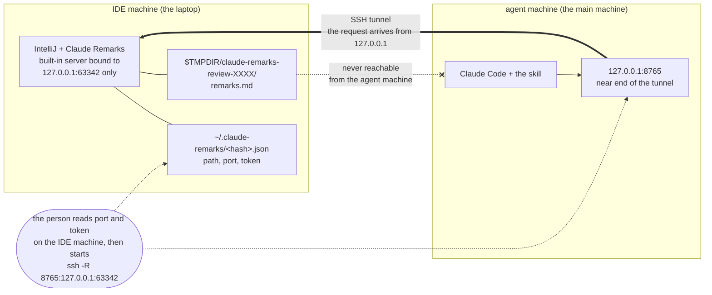
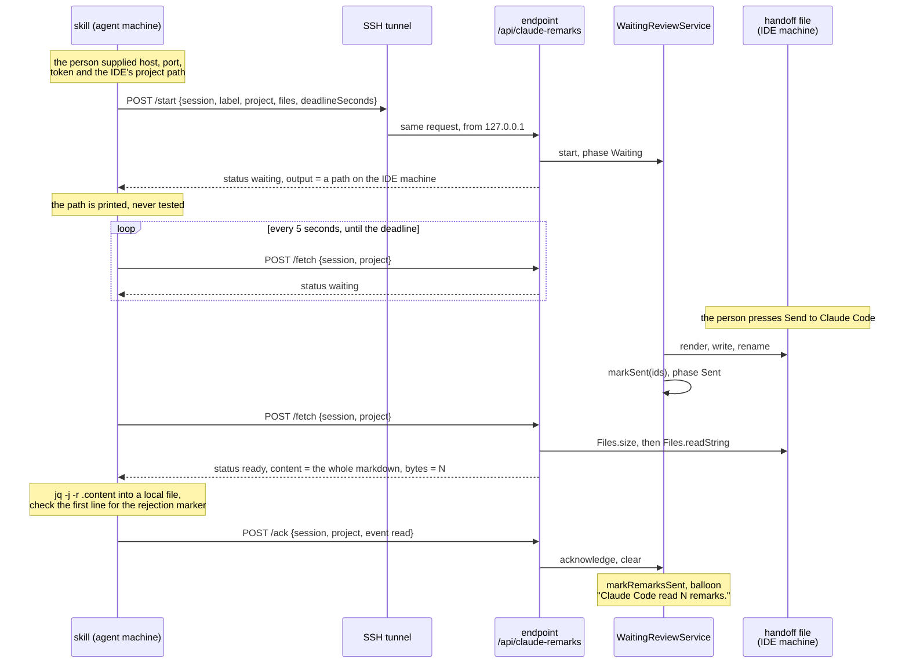
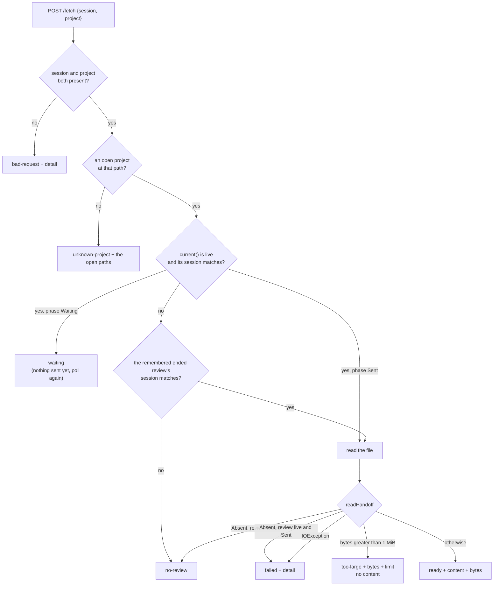
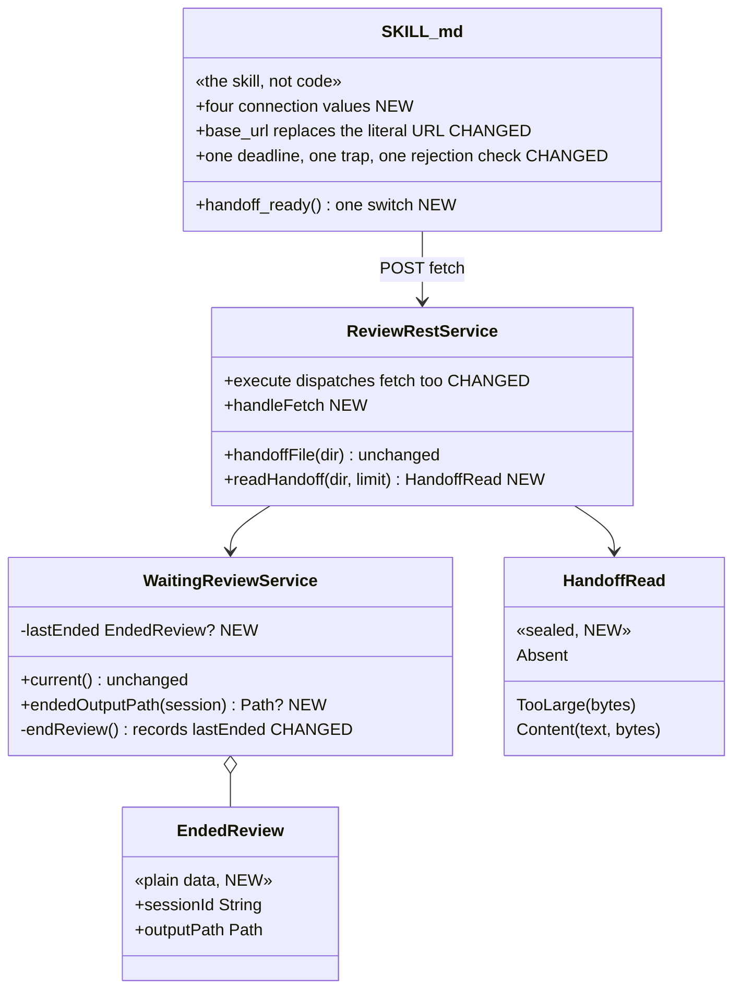

# Claude Remarks — Phase 8 Implementation Plan

**Sending remarks to a remote agent session over SSH.**

**Status: planned, nothing built.** Branch `claude-remarks-phase1-2`, working tree clean at `bae4a13`,
version `0.4.1`. There is no git remote.

**The design is decided, not open.** `docs/ideas.md`, "Sending remarks to a remote agent session",
names the three parts: a fetch action on the existing endpoint that returns the handoff file's
content in the HTTP response body instead of a path, the skill taking connection values as
arguments, and a tunnel the person sets up by hand. This plan does not revisit those. It decides the
questions the idea entry left open, and it names one thing the idea entry gets wrong — see
[section 7](#7-what-contradicts-docsideasmd).

**Nothing has to stay compatible with anything.** The project is a day old, there is no released
version anyone runs, and there is one user. So this plan does not carry a compatibility shim, a
version field or a fallback branch anywhere, and a later reader should not add one. If a cleaner
design wants to change an endpoint's response shape or rename a field, change it and change the skill
in the same commit. Both sides ship together.

**Citations name symbols, not line numbers.** Same reason as phase 6 and phase 7: a symbol name
survives the next commit in the same file, a line number does not.

## Contents

1. [What is true today](#1-what-is-true-today)
2. [Platform facts, checked against the real artifacts](#2-platform-facts-checked-against-the-real-artifacts)
3. [The transport fact, and why the security check does not reopen](#3-the-transport-fact-and-why-the-security-check-does-not-reopen)
4. [The design questions, decided](#4-the-design-questions-decided)
5. [The shape of the change](#5-the-shape-of-the-change)
6. [Decisions, and the alternatives rejected](#6-decisions-and-the-alternatives-rejected)
7. [What contradicts `docs/ideas.md`](#7-what-contradicts-docsideasmd)
8. [Scope judgement: what I cut](#8-scope-judgement-what-i-cut)
9. [Rules that must hold at every step](#9-rules-that-must-hold-at-every-step)
10. [Ordering](#10-ordering)
11. [Implementation steps](#11-implementation-steps)
    - [Task 1: Prove the local path before building on it](#task-1-prove-the-local-path-before-building-on-it)
    - [Task 2: The plugin remembers the ended review's output path](#task-2-the-plugin-remembers-the-ended-reviews-output-path)
    - [Task 3: Reading the handoff file, with a size cap](#task-3-reading-the-handoff-file-with-a-size-cap)
    - [Task 4: The fetch action on the endpoint](#task-4-the-fetch-action-on-the-endpoint)
    - [Task 5: The skill takes four connection values](#task-5-the-skill-takes-four-connection-values)
    - [Task 6: One wait loop, one transport switch](#task-6-one-wait-loop-one-transport-switch)
    - [Task 7: Verify acceptance criteria](#task-7-verify-acceptance-criteria)
    - [Task 8: Documentation and the version](#task-8-documentation-and-the-version)
12. [Known limits](#12-known-limits)
13. [Hand checks, and why this phase needs two machines](#13-hand-checks-and-why-this-phase-needs-two-machines)

## 1. What is true today

Read from the source on this branch, not assumed.

**The endpoint already dispatches on a sub-path, and an unknown one already refuses.** `execute` in
`review/ReviewRestService.kt` splits the path with
`urlDecoder.path().split(getServiceName()).last().trimStart('/')` and has a `when` over `"start"`,
`"ack"` and `else -> badRequest(...)`. So adding a third action is one `when` branch and one handler
function. Nothing about the security rule, the rate limit or the response shape has to move.

**One security check covers the whole service, not one action.** `isHostTrusted` is called by
`RestService.process` before `execute` runs, so the new action inherits the token check, the
`Origin`/`Referer` refusal and the POST-only rule with no code at all.

**The handoff file is always local to the endpoint, and the plugin never deletes it.**
`WaitingReviewState.outputPath` is a fresh `Files.createTempDirectory("claude-remarks-review-")`, and
`handoffFile(outputDir)` names `remarks.md` inside it. `atomicWriteString` writes it. Nothing in the
plugin removes either the file or the directory — `docs/claude/design.md`, "The store stays the
durable tier", says so and gives the reason. So a fetch can read the file back at any time, as many
times as it likes.

**`WaitingReviewService.current()` keeps the output path retrievable — but only while the review
lives.** Every ending goes through the private `endReview()`, which sets `state = null`. After that
the output path is gone from memory. **This is the fact the plan hangs from**, because of the next
one.

**Rejecting writes the file and then clears the review, in that order.**
`rejectWaitingReview` in `review/SendReview.kt` calls `atomicWriteString(handoffFile(...),
REJECTION_BODY)` and then `WaitingReviewService.getInstance(project).clear(waiting.sessionId)`. The
local skill is polling the file itself, so it sees the rejection body a second later and does not
care that the review is gone. A fetch action keyed to the live review would answer "nothing is
waiting" instead, and the remote agent could not tell a rejection from a timeout. Task 2 exists for
this one case.

**`markSent` can fail after a successful write.** `sendToWaitingReview` writes the file, then calls
`markSent`, which returns false if the deadline task ended the review in between. The file exists and
holds real remarks, and the review is gone. The local skill still reads them. A fetch keyed to the
live review would lose them. Task 2 covers this case too, for free.

**Nothing is marked sent until the `read` acknowledgement.** `finishReview` in `review/SendReview.kt`
is the only caller of `markRemarksSent` on this path, reached only through
`POST /api/claude-remarks/ack` with `event: "read"`. Phase 7's whole point. This plan does not touch
it.

**`acknowledge` refuses a session mismatch.** `WaitingReviewService.acknowledge` answers
`AckOutcome.NO_REVIEW` when the session id does not match, which is the rule "one agent must not end
another agent's review". The fetch has to hold the same line.

**The response body is built in memory and sent whole.** `execute` writes into a
`BufferExposingByteArrayOutputStream` and calls `send(out, request, context)`. There is no streaming
and no chunking. So a large body is a large allocation, which is why [section 4](#4-the-design-questions-decided)
decides a cap.

**The skill is one shell script spread over seven steps, and it must run as one Bash call.**
`docs/skill/claude-remarks-review/SKILL.md` says so in step 3 and repeats the reason: the Bash tool
starts a new shell every call and nothing crosses that boundary. Every guard in that file is written
as shell code rather than prose, because prose cannot stop a script. Seven defects were found in it by
reading it as a literal program.

**The skill's "Same machine only" section tells the model to stop.** It says the remote case is
planned for phase 8 and is not built, and "If asked to do this over SSH, say so and stop rather than
trying step 3 below." That section is what this phase replaces.

**`SKILL.md` is symlinked from `~/.claude/skills/` and `~/.claude-work/skills/`.** An edit to it is
live for every Claude Code session on this machine at once. There is no install step and no version
check, so a half-finished edit is immediately in use.

**The skill's request carries the repository path, and the IDE matches it exactly.** `matchProject`
in `review/ReviewRestService.kt` compares the requested path against every open project's
`basePath` resolved with `toRealPath()`. The skill sends `git rev-parse --show-toplevel` from its own
machine. On one machine those are the same path. On two machines they need not be. See
[section 7](#7-what-contradicts-docsideasmd).

**The rendered prompt already carries the commit each remark was written against.**
`render/PromptRenderer.kt` appends `" — commit "` and the first eight characters of `remark.commit`.
That is the only thing that lets a remote agent notice that the two machines' checkouts have drifted
apart, and it is already built.

**Version is `0.4.1` in `build.gradle.kts`.** Phase 7 released 0.4.0.

## 2. Platform facts, checked against the real artifacts

Read from `~/dev/oss/intellij-community` at tag `idea/2025.2.6.3`, not from memory.

**The built-in server binds `127.0.0.1` and nothing else.** `BuiltInServer.bind` in
`platform/built-in-server/src/org/jetbrains/io/BuiltInServer.kt` does
`InetAddress.getByName("127.0.0.1")` and binds every candidate port to that address. So the endpoint
cannot be reached from another machine at all, with or without a token. A tunnel is not a convenience
here; it is the only way in.

**The rate limit is 30 requests a minute, counted per source address, in a one-minute window from the
first request.** `RestService.getMaxRequestsPerMinute()` reads the registry key
`ide.rest.api.requests.per.minute` and defaults to 30. `getRequesterId` returns
`(context.channel().remoteAddress() as InetSocketAddress).address`, and `abuseCounter` is a Caffeine
cache with `expireAfterWrite(1, TimeUnit.MINUTES)`. **This is the most important platform fact in the
plan.** A tunnelled request arrives from `127.0.0.1`, so it shares one counter with every other local
client of the built-in server. Polling a fetch action once a second would answer 429 after thirty
seconds. The poll interval in [task 6](#task-6-one-wait-loop-one-transport-switch) is chosen from this
number, and a 429 has to be treated as "wait longer", never as "stop".

**Nothing in the platform caps the response body.** `RestService.send` wraps the whole byte array with
`Unpooled.wrappedBuffer(byteOut.internalBuffer, 0, byteOut.size())`. So a cap is this plugin's
decision to make, and if it does not make one there is none.

**`createJsonWriter` is a plain Gson `JsonWriter` with two-space indentation, and it escapes what JSON
requires.** `JsonWriter(out.writer()).apply { setIndent("  ") }`. A markdown body with quotes,
backslashes, newlines and `<` comes out as a legal JSON string that `jq` reads back byte for byte. No
hand-rolled escaping is needed, unlike `renderHandshake`, which is hand-built because it is not
written through a JSON library at all.

**A truncated response cannot be mistaken for a complete one.** JSON is self-delimiting, so `jq`
exits non-zero on a body that was cut off. That is the integrity check the skill uses, and it is why
[task 6](#task-6-one-wait-loop-one-transport-switch) does not compare byte counts.

**`jq -j -r` writes the value with no trailing newline.** Checked by running it:
`printf '{"content":"a\nb"}' | jq -j -r .content | wc -c` gives 3, and without `-j` it gives 4. So the
fetched copy of the handoff file can be byte-identical to the file the IDE wrote.

**`cmd && break` leaves the function's real exit status in `$?`, but `! cmd` does not.** Checked by
running it: a function returning 2 inside `while :; do f && break; s=$?` gives `s=2`, while
`while ! f` would collapse every non-zero status to 1. The wait loop in
[task 6](#task-6-one-wait-loop-one-transport-switch) needs three outcomes, so it must use the first
shape. This is exactly the class of defect this file has a history of.

**`shellcheck` is not installed on this machine.** So the shell verification in tasks 5 and 6 is
`sh -n` plus `bash -n` on the extracted script, plus an undefined-variable comparison. The exact
commands are in those tasks, and they were run against today's `SKILL.md` and pass.

## 3. The transport fact, and why the security check does not reopen

**An HTTP response body crosses an SSH tunnel. A path does not.** That one sentence is the whole
phase. Phase 6 handed back a filesystem path because both sides shared a filesystem. Two machines do
not share one, so the same handover has to put the bytes in the response instead. Nothing else about
phase 6 was wrong; its assumption simply does not hold here.

**A tunnel keeps the request looking like it came from localhost, so the localhost-only rule still
holds and does not need reopening.** The `sshd` on the IDE machine — or the local `ssh` client for a
`-R` forwarding — opens the connection to `127.0.0.1:63342` itself. The endpoint sees a loopback peer
address. Three things follow, and all three are good:

- The platform's own local-host expectation is satisfied without any change, because the connection
  really is a loopback connection.
- `requestIsAllowed` needs no new branch. The request still carries no `Origin` and no `Referer`,
  because `curl` sends neither, so the refusal rule from phase 6 admits it exactly as it admits a
  local `curl`.
- The rate-limit counter is keyed on that same loopback address, which is the cost side of the same
  fact — see [section 2](#2-platform-facts-checked-against-the-real-artifacts).

**The token is what makes exposing the endpoint through a tunnel safe at all.** Without it, anything
that can reach the near end of the tunnel can drive the endpoint: start reviews, read other people's
remarks, end their sessions. On the agent machine the near end is a loopback port, so "anything that
can reach it" means every process and every user on that machine. The token is the only thing between
them and the IDE. Two consequences worth writing down rather than assuming:

- **The token is minted once per IDE run** (`ReviewToken.value`, a `UUID` in a Kotlin `object`) and is
  the same for every project that IDE has open. Handing it to an agent hands over that whole IDE run,
  not one review. The only way to invalidate it is to restart the IDE. Re-opening a project rewrites
  the handshake file with the same token.
- **The person will paste the token into an agent prompt**, so it lands in a transcript. That is
  accepted, because the token is useless without a route to that IDE's loopback interface, and it
  dies with the IDE run. The skill must never `echo` it, so it appears once rather than twice.

## 4. The design questions, decided

**Where the fetch lives: a third sub-path, `POST /api/claude-remarks/fetch`.**

A field on `ack` would mean the acknowledgement carries the remarks. Then the IDE marks them sent in
the same request that delivers them, and a tunnel that dies while the response is in flight leaves the
IDE believing the agent has remarks it never received. The only copy was in the lost response. A flag
on `start` cannot work at all: `start` answers immediately, before the person has pressed anything, so
there is nothing to return. Making it wait would block a netty IO thread for up to 24 hours. A third
sub-path is a separate moment in time, which is what a poll needs, and it reuses the existing
dispatch, the existing security check and the existing `else -> bad-request` branch.

**The method is POST, not GET.** `isMethodSupported` allows POST only, and
`docs/claude/design.md`'s security section explains that refusing every other method removes the
cross-origin `` GET class of request entirely. Adding GET back for a read-shaped action would
reopen that hole for the whole service, not just for the fetch. So the fetch posts a JSON body of
`{session, project}`, the same shape as `ack` without its `event`.

**Fetching is not reading. The `read` acknowledgement stays the only thing that marks remarks sent.**
The skill must fetch, get the content in hand, check the rejection marker, and only then send
`ack read` — the same order the local path already uses, where `cat` comes before the acknowledgement.
The endpoint enforces this by doing nothing at all beyond reading a file: no store mutation, no
balloon, no state change. Two reasons, and the second is the one that decides it:

- The fetch is a poll, so it runs many times per review. Anything it changed would have to be
  idempotent.
- A fetch response can be lost. If the fetch marked the remarks sent, a lost response would leave the
  IDE saying "delivered" with nothing delivered. Keeping the two separate means the agent can fetch
  again as often as it needs, and the IDE only believes the delivery when the agent says so in a
  request that can only be sent after the bytes arrived.

**Response size: a cap of 1 MiB, and over the cap the endpoint refuses instead of truncating.**
`status: "too-large"`, with `bytes` and `limit`, and no content field at all. The skill reports the two
numbers, says the remarks are still pending in the IDE, names the handoff file's path on the IDE
machine, and stops. Truncating was the alternative and it is the worse one: a markdown prompt cut in
the middle looks complete to a model, the last remark ends mid-sentence, and nothing on either side
says that anything is missing. Refusing loses the automated handover for one oversized review and
keeps every other guarantee. 1 MiB is chosen because a remark with its code context is a few hundred
bytes, so the cap is thousands of remarks — unreachable in ordinary use, and still a bound on what one
response will allocate. The check is `Files.size` before the read, so an oversized file is never read
into memory at all.

**What the skill does with the connection values: it takes four, not three, and it keeps one wait
loop.** Host, port, token, and the repository path as the IDE machine sees it. The fourth one is
[section 7](#7-what-contradicts-docsideasmd). `127.0.0.1` on the agent machine means the near end of
the tunnel, so host defaults to `127.0.0.1` and is a variable only because the person supplies it.
There is deliberately no guard forbidding a non-loopback host: the built-in server binds loopback only
(see [section 2](#2-platform-facts-checked-against-the-real-artifacts)), so a wrong host cannot
connect, and connection refused is a legible failure. Every guard is shell code, every variable is
assigned in the same shell scope that reads it, and the traps exit.

**How the person discovers the values: on the IDE machine, from the handshake file, with two lines of
shell.** Documented in `SKILL.md`'s new "Over SSH" section and summarised in `README.md`:

```sh
HS=~/.claude-remarks/$(printf %s "$(git rev-parse --show-toplevel)" | shasum -a 256 | cut -c1-16).json
jq . "$HS"     # prints path, port and token
```

That is run in the repository, on the machine the IDE is on. The same shell then starts the tunnel, so
the port that was just read is the one that gets forwarded. There is no new IDE surface for this — see
[section 8](#8-scope-judgement-what-i-cut).

**The handshake file does not change, and here is why.** It already carries exactly the three values
the person needs, so it is the discovery source rather than an obstacle. Nothing that could be added to
it would help the agent, because the agent cannot read a file on the other machine whatever is in it.
And a field describing a tunnel would be state about something the plugin explicitly does not manage,
does not detect and does not report on. So: unchanged, no new field, no new permission, no migration.

**The local path keeps working, and that is a correctness requirement, not a compatibility one.**
Nothing older than this plan has to keep working, for the reason given under the title: the project
is a day old and has one user. So the plan is free to change the shape of a request or a response,
and it changes the skill in the same commit when it does. As it turns out it does not need to: `start` still answers with `output`
because the local transport still reads that file, `ack` is unchanged because the acknowledgement
still means the same thing, and the new action is additive. That is the design falling out this way,
not a constraint being honoured. What does have to be true at the end is that a local review still
works end to end, which [task 1](#task-1-prove-the-local-path-before-building-on-it) proves before
the edits and the hand checks prove again after them.

## 5. The shape of the change

Two new endpoint answers on one new sub-path, one remembered path in the service, one file read with a
cap, and a skill that learns a second transport for the same wait loop. Nothing about rendering, the
store, the clipboard, the handshake, the atomic write, the banner or the diff opening moves.

The topology, which is the hard part:



The remote run, end to end. Compare it with the local run: only the two middle steps differ.



What the fetch answers, and from where:



Where the code changes:



## 6. Decisions, and the alternatives rejected

**The plugin remembers one ended review's output path, so a rejection still reaches a remote agent.**
The alternative was to answer `no-review` for a review that has ended, and let the remote skill report
"the review ended in the IDE — either the person rejected it or it expired". That is honest, and it
throws away the exact thing phase 7 spent a whole task building: the person's decision reaching the
agent within a second or two instead of after a 30-minute timeout. Reintroducing "you cannot tell a
rejection from a timeout" for the remote transport would undo that fix for the transport that needs it
most. The cost is one nullable field holding a session id and a path, set in the one function every
ending already goes through. It also covers the case where `markSent` loses the race with the deadline
task and real remarks are sitting in a file that no live review points at.

**A rejection is delivered as content, not as a status of its own.** The rejection body is already
written into the handoff file, so a fetch that reads that file hands the remote skill exactly the bytes
the local skill reads. Both then run the same first-line check against
`<!-- claude-remarks: rejected -->`, and the marker stays one wire format with one reader. A
`status: "rejected"` answer would be a second way to say the same thing, and the skill would need two
branches that must agree.

**One remembered review, not a map of them.** A map would need an eviction rule, and there is no
question it answers: at most one review per project is ever waiting, so at most one has just ended.
A second entry could only serve an agent that is still fetching a review from two reviews ago, which
means it is past its own deadline and has already given up.

**The size cap is a parameter on the read function and a private constant at the call site.** The
boundary cases are then testable in milliseconds with a small limit, and the real 1 MiB constant is
exercised once by a smoke test that writes an oversized file. The alternative — one hard-coded
constant — would make the boundary test either impossible or a one-second test that writes a megabyte
for every case.

**The file read happens on the netty IO thread, and that is a deliberate, bounded corner.** `Files.size`
and `Files.readString` are plain `java.nio`, which rule 5 allows in this file for the same reason
`toRealPath()` is allowed. The read is of a file in the local temp directory, at most 1 MiB. The
ceiling: a hung or unresponsive filesystem stalls one netty IO thread for as long as the read takes.
The alternative is to answer the request asynchronously from a pooled thread, which means holding the
`ChannelHandlerContext` past the return of `execute` and writing the response later — real machinery,
for a bounded local read. Not worth it; named here so nobody has to guess whether it was considered.

**The skill keeps one wait loop with a switch inside it, rather than two loops.** Two loops would mean
two copies of the deadline arithmetic, the two traps, the `cat` check, the rejection check and the
acknowledgement — every one of them a line the file's own history says gets subtly wrong. One loop
with a small `handoff_ready` function isolates the difference to the one thing that actually differs:
how you find out whether the remarks are there yet. The cost is that a proven path gets edited, and
that is paid for twice — [task 1](#task-1-prove-the-local-path-before-building-on-it) proves the local
path before the edit, and the hand checks prove it again after.

**The poll interval for the remote case is 5 seconds, and a 429 backs off rather than stopping.** 5
seconds is 12 fetches a minute against a budget of 30 that is shared with every other local client of
that IDE's built-in server. A 429 while remarks may already be waiting must not end the review, so the
loop sleeps 20 seconds and carries on; the loop's own deadline still governs when it gives up. The
local case keeps its 1-second filesystem poll, which costs nothing and talks to no server.

**Every `curl` gets `--connect-timeout` and `--max-time`, and the acknowledgement especially.** A
tunnel whose far end has gone away does not refuse a connection; it accepts and then hangs. The
acknowledgement runs from an `EXIT` trap, so a hang there hangs the agent's shell on the way out,
forever, with nothing to report to. A time limit turns that into a failed request the IDE's own
deadline already covers.

**In the remote case the `output` path from the `start` response is printed and never tested.** It is
a path on the other machine. `[ -e "$output" ]` there would test the agent machine's filesystem for a
name that belongs to the IDE machine. The random temp-directory suffix makes a false match
essentially impossible, but "essentially impossible" is not a guard, and the variable has one honest
use: telling the person where the file is if the fetch cannot deliver it.

## 7. What contradicts `docs/ideas.md`

**The idea entry says the person passes three values. It is four.** `docs/ideas.md` names host, port
and token. It misses the repository path *as the IDE machine sees it*.

The `start` request's `project` field is matched by `matchProject` against every open project's
`basePath` resolved with `toRealPath()`, on the IDE machine. The skill fills it from
`git rev-parse --show-toplevel` on its own machine. Two machines can have the same repository checked
out at two different paths — a different user name, a different parent directory, an external disk —
and then the request answers `unknown-project` even though the IDE plainly has the project open.

Nothing about this is dangerous, and the failure is already legible: the `unknown-project` body carries
`open`, the list of project paths the IDE says it has. So the fix is small and the plan takes it: a
fourth value, `ide_project`, defaulting to the local `git rev-parse --show-toplevel` output, so the
common case where both machines use the same path needs nothing extra. The skill reports the `open`
list when the answer is `unknown-project` and tells the person to pass the right path.

**Two smaller things the idea entry does not mention, both handled above rather than left open:** the
rate limit makes the poll interval a design decision instead of a free choice, and a rejection has to
survive the review being cleared or the remote agent cannot tell it from a timeout.

## 8. Scope judgement: what I cut

- **No "Copy connection details" action in the tool window.** It would be a genuinely useful button —
  one click to put the host, port, token and project path on the clipboard — and it is cheap. It is
  also a fourth part on a design that decided three, it puts a secret on the system clipboard where
  anything can read it, and two lines of shell already do the job on the machine the person is sitting
  at. Add it if reading the handshake file by hand turns out to be the step that annoys.
- **The plugin does not manage, detect or report on the tunnel.** `docs/ideas.md` decided this and it
  is right: a missing tunnel is connection refused, which is the same legible failure phase 6 already
  relies on. No health check, no status field, no banner text about a tunnel.
- **No change to the local transport, and this is the one cut worth arguing.** The choice: keep two
  transports and one small switch in the skill, or make every review fetch over HTTP and delete the
  switch. Deleting the switch is real deletion — it is the most defect-prone new shell in the phase,
  and nothing about compatibility stands in the way of removing it now. What happens with one
  transport: every local review posts a fetch instead of running `stat`, so the daily case joins the
  30-requests-a-minute budget, its poll interval has to rise from 1 second to 5 to stay inside it, and
  two projects reviewing at once spend 24 of those 30 requests between them before a single start or
  acknowledgement. What happens with two transports: the daily case keeps a free 1-second filesystem
  check and needs no server round trip at all, and the difference between the two is about fifteen
  lines of shell in one function. So the unified version is cheaper to read and more expensive to run,
  in exactly the case that runs every day. Two transports.
- **No streaming and no chunked handover for an oversized review.** The cap refuses; the person reads
  the file on the IDE machine or sends fewer remarks. Splitting a markdown prompt across responses is
  real work for a case that needs thousands of remarks to reach.
- **No automated test of the tunnel.** Nothing in a Gradle test can open an SSH connection to a second
  machine. That is what [section 13](#13-hand-checks-and-why-this-phase-needs-two-machines) is for, and
  it is the first time this project has a check that needs two machines.

## 9. Rules that must hold at every step

The five greps from `CLAUDE.md`, "Rules that must not break", must come back empty after every task.
Two of them are the ones this phase can actually break:

**Rule 5, the endpoint stays off the VFS, Swing and `invokeAndWait`.** This is the rule most at risk,
because the fetch reads a file inside `execute`.

```bash
grep -rnE "invokeAndWait|projectRoot\(|FileEditorManager|VfsUtil|SwingUtilities" \
  src/main/kotlin/dev/sasha/clauderemarks/review/ReviewRestService.kt   # must be empty
```

Plain `java.nio` is what is allowed there: `Files.exists`, `Files.size`, `Files.readString`. The VFS is
not — no `VfsUtil`, no `VirtualFile`, no `LocalFileSystem`. And the same trap phase 6 and phase 7 both
hit is still live: the grep is line-based and cannot tell a comment from code, so the new handler's
KDoc must not name any of the five forbidden symbols, not even to say they are absent.

**Rule 3, only `store/RemarkEdits.kt` mutates a remark.** The fetch must not mark anything sent, so
nothing this phase adds should go anywhere near the store.

```bash
grep -rn "RemarkStore\.getInstance([^)]*)\." src/main --include=*.kt \
  | grep -v RemarkEdits.kt | grep -v "\.all()"   # must be empty
```

The other three (the `anchor/` package and `render/PromptRenderer.kt` free of `com.intellij`, and no
source-file writes anywhere) are not near this work but are run at every step anyway, because a guard
that is only run at the end cannot say which change broke it.

**Two product rules that hold for this phase without any code:** no remark is ever written into a
source file as a comment, and nothing remark-related enters VCS. This phase adds one response field
and one shell branch; it writes no files beyond the handoff file that already exists.

**Do not run `./gradlew runIde` from an agent session.** It starts an interactive sandbox IDE that
never exits.

## 10. Ordering

Eight tasks, in this order: prove the local path (1), remember the ended review's path (2), read the
file with a cap (3), the fetch action (4), the skill's connection values (5), the skill's wait loop
(6), verify (7), document (8).

**Tasks 2 and 3 are the only independent pair.** Task 2 touches `review/WaitingReview.kt` and
`WaitingReviewServiceTest`; task 3 touches `review/ReviewRestService.kt` and `ReviewRequestTest`.
Either order works. They are small enough that running them in parallel probably costs more
coordination than it saves.

**Task 4 needs both 2 and 3**, because the fetch handler calls one function from each.

**Task 5 comes before task 6, and both edit `SKILL.md`.** They touch different sections of it: task 5
rewrites the front matter, the "Same machine only" section and the setup in steps 1 to 3; task 6
rewrites step 6's wait loop. Splitting them means the riskiest file in the phase is reviewed twice, in
two smaller pieces, and each piece passes the extracted-script check on its own.

**Task 5 must not land before task 4.** The skill is symlinked into two live skill directories, so the
moment the "Same machine only" section stops saying "stop", some session may try the remote path. The
plugin side has to answer a fetch before the skill offers one.

## 11. Implementation steps

TDD throughout: write the failing test, run it, watch it fail for the right reason, then implement.
Run the narrow per-task command after each change. The full suite runs once, in task 7. Complete each
task before starting the next.

### Task 1: Prove the local path before building on it

**Model:** sonnet

**Files:**
- Read only: `CLAUDE.md`, the "Rules that must not break" section
- Read only: `src/main/kotlin/dev/sasha/clauderemarks/review/WaitingReview.kt` — `endReview`, and the
  class KDoc's list of things that exist for the tests
- Read only: `src/main/kotlin/dev/sasha/clauderemarks/review/ReviewRestService.kt` — `execute`'s
  `when` over the action, and `handoffFile`
- Read only: `src/main/kotlin/dev/sasha/clauderemarks/review/SendReview.kt` — `rejectWaitingReview`

Phase 7's 28 hand checks were all deferred and none has been run. So the path this phase extends is
known-good by unit tests only. This task is where that is fixed, or at least named.

The mechanical half, which an agent can do:

- [ ] `git status --porcelain` must be empty. Another agent may be mid-task in this worktree. If it is
      not empty, **stop and report** what is there rather than working around it.
- [ ] `execute`'s `when` still has exactly the three branches `"start"`, `"ack"` and `else`. If it
      already has a fetch, this plan was written against an older tree — stop and report.
- [ ] `endReview()` is still the one private function every ending goes through, and it still sets
      `state = null` with no record of what it removed. Task 2 depends on that being the starting point.
- [ ] `rejectWaitingReview` still calls `atomicWriteString` and then `clear(waiting.sessionId)`, in
      that order. The whole argument for task 2 rests on it.
- [ ] run all five grep guards from [section 9](#9-rules-that-must-hold-at-every-step) now, before any
      change. All five must be empty. A guard that was already failing must not be blamed on this phase.
- [ ] `./gradlew test` passes on the untouched tree. Report the test count, so task 7 can compare.
- [ ] extract the skill's shell blocks and check them, so the baseline is a script that parses:

      ```bash
      awk '/^ *```sh$/{f=1;next} /^ *```$/{f=0;next} f' \
        docs/skill/claude-remarks-review/SKILL.md > /tmp/skill-baseline.sh
      sh -n /tmp/skill-baseline.sh && bash -n /tmp/skill-baseline.sh && echo "SYNTAX OK"
      ```

      This passes today: 79 lines, `SYNTAX OK`. Report the line count so tasks 5 and 6 can compare.
- [ ] no commit — this task writes nothing

**The hand half, which only a person at a real IDE can do.** These three are owed before anything
after task 1 is trusted. Run `./gradlew runIde` **by hand**, never from an agent session.

- [ ] **the plugin loads at all.** The Claude Remarks tool window is present. This is the single most
      important check in the task: phase 7 added `<depends>com.intellij.modules.vcs</depends>` to
      `plugin.xml` and that has never been in front of a running IDE. If the dependency id is wrong the
      plugin refuses to load, and **the only symptom is the tool window simply not being there** — no
      dialog, no obvious error. If it is missing, read `idea.log` for the plugin loading error and stop
      the phase there.
- [ ] **one local review, end to end.** Install the current skill, start a review from a Claude Code
      session on the same machine, write two remarks, press Send to Claude Code, and confirm the skill
      reads them, the remarks turn gray only after the acknowledgement, and the balloon says
      "Claude Code read 2 remarks."
- [ ] **one local rejection.** Start a review, press Reject in the banner, and confirm the skill stops
      within a second or two, reports the rejection, does not treat the body as remarks, and every
      remark stays black.

### Task 2: The plugin remembers the ended review's output path

**Model:** sonnet

**Files:**
- Edit: `src/main/kotlin/dev/sasha/clauderemarks/review/WaitingReview.kt` — a new `EndedReview` data
  class next to `WaitingReviewState`; a `lastEnded` field and an `endedOutputPath` function in
  `WaitingReviewService`; one line added to the private `endReview()`
- Edit: `src/test/kotlin/dev/sasha/clauderemarks/review/WaitingReviewServiceTest.kt` — three new tests

One nullable field, set in the one place every ending already goes through.

```kotlin
/**
 * The session id and output path of the review that ended most recently. It exists for one caller:
 * the endpoint's fetch action, which has to be able to hand a rejection body to a remote agent. The
 * rejection is written to the handoff file and then the review is cleared, so a fetch that could only
 * see a live review would answer "nothing is waiting" and the agent could not tell a rejection from a
 * timeout.
 *
 * One review, not a map: at most one review per project is ever waiting, so at most one has just
 * ended. An older one could only serve an agent that is already past its own deadline.
 */
private data class EndedReview(val sessionId: String, val outputPath: Path)
```

The field and the reader:

```kotlin
@Volatile
private var lastEnded: EndedReview? = null

/**
 * Where the review [session] wrote its handoff file, if that review has ended and was the most
 * recent one to end. Null for any other session, which is what keeps one agent from reading another
 * agent's remarks.
 *
 * Unsynchronized for the same reason [current] is: it reads one volatile field, does no IO, and a
 * stale read cannot produce a wrong answer for a session that does not match.
 */
internal fun endedOutputPath(session: String): Path? =
    lastEnded?.takeIf { it.sessionId == session }?.outputPath
```

And in `endReview()`, before `state = null`:

```kotlin
lastEnded = acting?.let { EndedReview(it.sessionId, it.outputPath) }
```

**`endReview()` is the only place this belongs.** Its own KDoc says three hand-rolled copies of its
four lines are how `clear()` came to leave a scheduled task queued. Setting `lastEnded` in
`acknowledge` and `expireIfStale` and `clear` separately would be the same mistake again.

**Do not add this to the class KDoc's "four things that exist for the tests" list.** It is a production
surface with a production caller, which is exactly what that list is there to keep it separate from.

- [ ] write the failing tests in `WaitingReviewServiceTest.kt`, which is already fixture-backed and
      already starts reviews with a caller-supplied output path:
  - `an ended review's output path is still findable by its session` — start `s1` with a known temp
    directory, `clear("s1")`, then `endedOutputPath("s1")` equals that directory.
  - `a different session cannot find the ended review's path` — same setup, `endedOutputPath("s2")` is
    null. This is the "one agent must not read another agent's remarks" rule as a test.
  - `only the most recently ended review is remembered` — end `s1`, then start and end `s2`, then
    `endedOutputPath("s1")` is null and `endedOutputPath("s2")` is the second directory. This pins the
    one-review decision, so a later change to a map has to argue with a failing test.
- [ ] run `./gradlew test --tests "dev.sasha.clauderemarks.review.WaitingReviewServiceTest"` — expect a
      compile failure
- [ ] implement
- [ ] the same command passes, and `./gradlew test --tests "dev.sasha.clauderemarks.review.SendReviewTest"`
      still passes — `SendReviewTest` clears the service in `setUp` and `tearDown`, so it is the class
      most likely to notice a new field that outlives a clear
- [ ] **mutation:** delete the new line from `endReview()` — the first test must fail. Drop the
      `takeIf { it.sessionId == session }` — the second test must fail. Change `lastEnded = ...` to
      only assign when `lastEnded == null` — the third test must fail. Restore all three.
- [ ] commit: `feat: the service remembers where the review that just ended wrote its handoff file` —
      stage exactly the two files above

### Task 3: Reading the handoff file, with a size cap

**Model:** sonnet

**Files:**
- Edit: `src/main/kotlin/dev/sasha/clauderemarks/review/ReviewRestService.kt` — a `HandoffRead` sealed
  interface and a `readHandoff` function immediately after the existing `handoffFile`; a
  `MAX_HANDOFF_BYTES` constant next to `DEFAULT_DEADLINE_SECONDS`
- Edit: `src/test/kotlin/dev/sasha/clauderemarks/review/ReviewRequestTest.kt` — four new tests

`handoffFile` names the file; this names what happens when you read it. They belong side by side for
the same reason `handoffFile` is a function rather than two string literals.

```kotlin
/** What reading the handoff file produced. [bytes] is the file's size, not the string's length. */
internal sealed interface HandoffRead {
    /** No file at that path: the review was cleared before anything was written. */
    data object Absent : HandoffRead
    data class TooLarge(val bytes: Long) : HandoffRead
    data class Content(val text: String, val bytes: Long) : HandoffRead
}

/**
 * The whole handoff file, or a refusal. [limit] is a parameter rather than the constant below so the
 * boundary is testable in milliseconds instead of by writing a megabyte for every case.
 *
 * Over the limit the file is not read at all — the size is checked first, so an oversized review
 * never becomes an oversized allocation. Truncating was the alternative and it is worse: a markdown
 * prompt cut in the middle looks complete to a model.
 *
 * The exists-then-size pair is not a race here: the plugin never deletes the handoff file or the
 * directory holding it. An IOException from either call is left to the caller, which turns it into a
 * `failed` answer the same way a start request does.
 */
internal fun readHandoff(outputDir: Path, limit: Long): HandoffRead {
    val file = handoffFile(outputDir)
    if (!Files.exists(file)) return HandoffRead.Absent
    val bytes = Files.size(file)
    if (bytes > limit) return HandoffRead.TooLarge(bytes)
    return HandoffRead.Content(Files.readString(file, StandardCharsets.UTF_8), bytes)
}
```

And the constant, next to the deadline bounds and named for the same reason they are:

```kotlin
/**
 * The largest handoff file the fetch action will put in a response. A remark with its code context is
 * a few hundred bytes, so this is thousands of remarks — unreachable in ordinary use, and still a
 * bound on what one response allocates. Named rather than inlined because the skill's own message
 * quotes the number back to the person.
 */
private const val MAX_HANDOFF_BYTES = 1_048_576L
```

- [ ] write the failing tests in `ReviewRequestTest.kt`, which is plain JUnit with no fixture. It needs
      a temp directory per test; create one with `Files.createTempDirectory` and delete it in an
      `@After`, rather than reaching for the fixture-only `TempPaths`:
  - `a missing handoff file reads as absent` — an empty directory gives `HandoffRead.Absent`.
  - `a handoff file under the limit reads back whole` — write text **containing a multi-byte character**
    (an em dash or an accented letter), and assert both that the text comes back identical and that
    `bytes` is the UTF-8 byte count, which is larger than the character count. Two assertions, because
    the second is the one that catches a size computed from the string.
  - `a file over the limit is refused and its content is not returned` — call with a limit of 4 against
    a longer file; assert the result is `TooLarge` with the real byte count, and that the result is not
    a `Content` of any kind.
  - `a file exactly at the limit is not refused` — a file whose byte count equals the limit reads back
    as `Content`. This pins `>` rather than `>=`.
- [ ] run `./gradlew test --tests "dev.sasha.clauderemarks.review.ReviewRequestTest"` — expect a
      compile failure
- [ ] implement
- [ ] the same command passes
- [ ] **mutation:** make `readHandoff` skip the `Files.exists` check and let `Files.size` throw — the
      absent test must fail. Change `bytes` to `text.length.toLong()` — the multi-byte test must fail.
      Delete the `if (bytes > limit)` branch — the refusal test must fail. Change `>` to `>=` — the
      exactly-at-the-limit test must fail. Restore all four.
- [ ] `grep -rnE "invokeAndWait|projectRoot\(|FileEditorManager|VfsUtil|SwingUtilities" src/main/kotlin/dev/sasha/clauderemarks/review/ReviewRestService.kt`
      is empty — rule 5, run now rather than at the end, because this is the task that adds filesystem
      code to that file
- [ ] commit: `feat: read the handoff file back, refusing anything over a megabyte` — stage exactly the
      two files above

### Task 4: The fetch action on the endpoint

**Model:** sonnet

**Files:**
- Edit: `src/main/kotlin/dev/sasha/clauderemarks/review/ReviewRestService.kt` — a `FetchRequest` class
  next to `AckRequest`; a `"fetch"` branch in `execute`'s `when`; a `handleFetch` function after
  `handleAck`; the class KDoc's first paragraph, which lists the actions and their answers
- Edit: `src/test/kotlin/dev/sasha/clauderemarks/review/ReviewEndpointSmokeTest.kt` — six new tests

The request body is `ack`'s shape without the event:

```kotlin
/** Gson fills these by reflection too. No `event` and no `label`: a fetch changes nothing. */
private class FetchRequest(
    val session: String? = null,
    val project: String? = null,
)
```

The handler. The order of the two lookups is the decision worth reading twice: the live review first,
then the review that just ended.

```kotlin
/**
 * Hands the waiting review's handoff file back in the response body, so an agent on another machine
 * can read remarks it has no filesystem access to. Answers `ready`, `waiting`, `no-review`,
 * `too-large`, `unknown-project`, `bad-request` or `failed`.
 *
 * **Changes nothing.** Not the store, not the review's phase, not the deadline. Fetching is not
 * reading: the `read` acknowledgement stays the only thing that marks a remark sent, so a fetch whose
 * response is lost to a dead tunnel costs one retry rather than a delivery the IDE believes in and the
 * agent never got. It is therefore safe to call as often as the skill likes, which is what a poll
 * needs.
 *
 * The live review is checked before the one that just ended, so a session id reused by a new review
 * reads the new review. A review that has ended is still readable because the person's rejection is
 * written into that same file and then the review is cleared — see review/SendReview.kt.
 */
private fun handleFetch(request: FullHttpRequest, writer: JsonWriter) { ... }
```

Its shape, in the order the answers are decided:

1. Parse. A blank `session` or `project` is `bad-request` with the same `badRequest` helper the other
   two actions use.
2. `matchProject(wanted, writer) ?: return`.
3. `val service = WaitingReviewService.getInstance(project)`.
4. `val live = service.current()?.takeIf { it.sessionId == session }`.
5. If `live` is non-null and its phase is `ReviewPhase.Waiting`, answer `waiting` and return. Nothing
   has been written yet, and the skill's poll is supposed to come back.
6. Otherwise find the directory: `live?.outputPath ?: service.endedOutputPath(session)`. Null means
   `no-review`.
7. `readHandoff(dir, MAX_HANDOFF_BYTES)` inside a `try`/`catch (e: IOException)` that answers `failed`
   with the message, the same way `handleStart` answers a failed temp-directory creation. Then:
   - `Absent` with `live == null` is `no-review` — the review ended before anything was written.
   - `Absent` with a live `Sent` review is `failed` with a detail, because the phase says the file was
     written and it is not there. A lie is not a better answer than an error.
   - `TooLarge` is `status: "too-large"` plus `bytes` and `limit`, and **no content field**.
   - `Content` is `status: "ready"` plus `content` and `bytes`.

**`ReviewPhase.Waiting` is compared with `==`, never `is`.** One spelling per shape across this
plugin: `==` for the object, `is` for the `Sent` data class that carries fields. `canSend` in
`review/SendReview.kt` says so at its own declaration.

**The KDoc must not name any of rule 5's five forbidden symbols**, not even to say the handler does
not use them. The grep is line-based and would fire on the comment. Phase 6 and phase 7 both hit this.

- [ ] write the failing tests in `ReviewEndpointSmokeTest.kt`, which already has a `post(path, json)`
      helper over a real `EmbeddedChannel` and a `projectPath()` helper:
  - `testAFetchBeforeTheSendAnswersWaiting` — start a review, fetch, assert the body contains
    `"waiting"` and does **not** contain `"content"`.
  - `testAFetchAfterTheSendCarriesTheWholePromptInTheBody` — start a review with a controlled
    directory, `atomicWriteString(handoffFile(dir), "a note about A")`, `markSent`, then fetch: the
    body contains `"ready"` and contains the remark text. **This is the transport fact as a test:** the
    body carries content, not a path.
  - `testAFetchMarksNothingSentAndLeavesTheReviewAlone` — after that same `ready` fetch, the remark is
    still `RemarkStatus.PENDING` and `current()` is still non-null with a `Sent` phase. This is the
    ordering decision as a test.
  - `testAFetchOfARejectedReviewStillCarriesTheRejectionBody` — write `REJECTION_BODY` to the handoff
    file, `clear(session)`, then fetch: the body is `"ready"` and its content starts with
    `<!-- claude-remarks: rejected -->`, spelled out as a literal rather than read from
    `REJECTED_MARKER`, for the same reason `SendReviewTest` spells it out.
  - `testAFetchForASessionNothingKnowsAboutAnswersNoReview` — a fetch with a session id no review ever
    used, while another review is waiting, answers `no-review` and does not carry the other review's
    content.
  - `testAFetchOverTheSizeLimitAnswersTooLargeAndNoContent` — write a file of about 1.1 MiB whose last
    line is a recognisable marker, `markSent`, fetch: the body contains `"too-large"`, contains
    `"limit"`, and does **not** contain the marker. This is the one test that exercises the real
    `MAX_HANDOFF_BYTES`; the boundary itself is task 3's job.
- [ ] check that `testAnUnknownActionDoesNotStartAReview` still passes — adding a third `when` branch
      must not weaken the `else`
- [ ] run `./gradlew test --tests "dev.sasha.clauderemarks.review.ReviewEndpointSmokeTest"` — expect a
      compile failure
- [ ] implement
- [ ] the same command passes
- [ ] **mutation:** answer `ready` unconditionally, ignoring the phase — the waiting test must fail.
      Write `handoffFile(dir).toString()` into `content` instead of the text — the whole-prompt test
      must fail. Call `finishReview(project, session, ReviewEnd.READ)` from `handleFetch` — the
      marks-nothing-sent test must fail. Look only at `current()` and drop the `endedOutputPath` branch
      — the rejection test must fail. Drop the session comparison in step 4 — the unknown-session test
      must fail. Pass `Long.MAX_VALUE` as the limit — the too-large test must fail. Restore all six.
- [ ] all five grep guards from [section 9](#9-rules-that-must-hold-at-every-step) come back empty
- [ ] commit: `feat: a fetch action returns the handoff file's content in the response body` — stage
      exactly the two files above

### Task 5: The skill takes four connection values

**Model:** sonnet

**Files:**
- Edit: `docs/skill/claude-remarks-review/SKILL.md` — the front matter's `description`; the
  "Same machine only" section, replaced by "Over SSH: the IDE on another machine"; step 1's
  `git rev-parse`; step 2, which becomes conditional; step 3's `curl` URLs and its `mktemp` line
- No test file: `SKILL.md` is not compiled. The verification is below and it is real.

**This file is symlinked into `~/.claude/skills/` and `~/.claude-work/skills/`.** The edit is live for
every session on this machine the moment it is saved. So task 4 has to be committed first, and this
task should be finished in one sitting rather than left half-edited.

**The section that says "stop" is replaced by the section that says how.** The current
"Same machine only" section tells the model to refuse the remote case. The new "Over SSH" section is
prose plus two commands, and it is written for the person, not for the model:

- **On the IDE machine**, in the repository: read the port and the token out of the handshake file with
  the two lines in [section 4](#4-the-design-questions-decided) above. Do not send the token over
  anything that logs it.
- **Start the tunnel from the IDE machine**, in that same shell, so the port that was just read is the
  one being forwarded:

  ```sh
  ssh -o ExitOnForwardFailure=yes -R 8765:127.0.0.1:"$PORT" the-agent-machine
  ```

  `-R` and not `-L`: the SSH connection already goes from the IDE machine to the agent machine, and
  `-R` forwards a port on the far end back through it. `-L` would need the IDE machine to be reachable
  by `sshd` from the agent machine, which is the harder direction to arrange on a laptop.
  `ExitOnForwardFailure=yes` is not decoration: without it, a port already taken on the agent machine
  makes `ssh` print a warning and connect anyway, and every later request answers connection refused
  for a reason that looks nothing like the cause. Pick a port nothing on the agent machine uses, and do
  not reuse 63342 if that machine runs an IDE too.
- **Then tell the agent four values:** the tunnel's local port on the agent machine (8765 above), the
  token, the repository path as the **IDE machine** sees it, and the host only if it is not
  `127.0.0.1`.
- **A missing tunnel looks like connection refused**, and that is the whole of the error handling. The
  plugin does not manage the tunnel, does not detect it and does not report on it.
- **Restarting the IDE is what invalidates the token.** Re-opening a project rewrites the handshake
  file with the same token, because the token is minted once per IDE run.

The setup block, in the same defensive style as the rest of the file — every guard is code, every
variable is assigned in the shell scope that reads it:

```sh
# Remote case only: the IDE is on another machine, reached through an SSH tunnel this shell does not
# manage. Leave ide_port EMPTY for the normal same-machine case and the rest is ignored.
ide_port=          # the tunnel's local port ON THIS MACHINE, e.g. 8765
ide_token=         # the token from the IDE machine's handshake file
ide_project=       # the repository path as the IDE MACHINE sees it; empty means use this machine's
ide_host=127.0.0.1 # the near end of the tunnel; change only if you tunnelled somewhere else

root=$(git rev-parse --show-toplevel)
[ -n "$ide_project" ] || ide_project=$root
if [ -n "$ide_port" ]; then
  remote=yes
  host=$ide_host ; port=$ide_port ; token=$ide_token
  case $ide_port in *[!0-9]*|'') echo "ide_port must be a port number: '$ide_port'"; exit 1;; esac
  [ -n "$token" ] || { echo "the remote case needs the IDE run's token — read it on the IDE machine, see 'Over SSH' above"; exit 1; }
  echo "remote: $host:$port, project $ide_project"   # never echo the token
else
  remote=
  host=127.0.0.1
  name=$(printf %s "$root" | shasum -a 256 | cut -c1-16)
  handshake="$HOME/.claude-remarks/$name.json"
  [ -f "$handshake" ] || { echo "no IDE has $root open (no handshake file at $handshake)"; exit 1; }
  port=$(jq -r .port "$handshake")
  token=$(jq -r .token "$handshake")
fi
base_url="http://$host:$port/api/claude-remarks"
```

**`$root` stays the agent machine's own path**, because the file list is built from the agent's own
git. `$ide_project` is what goes in the request's `project` field and in every `ack` and `fetch` body.
The two are the same string in the same-machine case, which is why the default is `$root`.

**Every `curl` gets `"$base_url/start"` in place of the literal URL, and two time limits:**
`--connect-timeout 5 --max-time 20`. A tunnel whose far end has gone away accepts the connection and
then hangs, so a request with no time limit hangs the whole shell.

**`unknown-project` needs one more sentence in step 5**, because it stops being a rare mistake and
becomes the normal first failure of the remote case: the two machines have the repository at different
paths. The body's `open` array is the list of paths that IDE does have open, so report it and tell the
person which value to pass as `ide_project`.

**Two lines in step 3's response check must move, not just be edited.** `echo "start: http $http_code"`
and the `cat "$start_resp"` after it are what make the answer visible to the model. Keep them exactly
where they are and in that order.

- [ ] `grep -n 'Same machine only\|127.0.0.1:\$port\|same machine' docs/skill/claude-remarks-review/SKILL.md`
      first, so every place that promises the same-machine limit is found before one is missed. There
      are at least three: the front matter's `description`, the section heading, and step 3's URLs.
- [ ] rewrite the front matter `description` so it no longer says "Requires the IDE and this skill to
      run on the same machine". Say instead that the same machine is the normal case and that a remote
      IDE needs a tunnel and four values.
- [ ] replace the "Same machine only" section with "Over SSH: the IDE on another machine", covering the
      six points above
- [ ] add the setup block, fold step 2's handshake read into its `else` branch, and change every
      `curl` URL to `"$base_url/..."` with the two time limits
- [ ] add `fetch_resp=$(mktemp)` to step 3's existing
      `start_resp=$(mktemp) ; ack_resp=$(mktemp)` line, so all three temp files are created in one
      place. Task 6 uses it.
- [ ] **verify by extracting and parsing the script, not by reading it:**

      ```bash
      awk '/^ *```sh$/{f=1;next} /^ *```$/{f=0;next} f' \
        docs/skill/claude-remarks-review/SKILL.md > /tmp/skill.sh
      sh -n /tmp/skill.sh && bash -n /tmp/skill.sh && echo "SYNTAX OK"
      ```
- [ ] **verify that every variable read is assigned somewhere in the same script.** This is the check
      that catches the defect class this file has a history of — a step split into another shell, or a
      variable renamed in one place. The jq argument names are computed rather than listed by hand, so
      the allowlist maintains itself:

      ```bash
      grep -oE -- '--argjson +[A-Za-z_][A-Za-z0-9_]*|--arg +[A-Za-z_][A-Za-z0-9_]*' /tmp/skill.sh \
        | awk '{print $2}' | sort -u > /tmp/jqargs.txt
      comm -23 \
        <(grep -oE '\$\{?[A-Za-z_][A-Za-z0-9_]*' /tmp/skill.sh | tr -d '${' | sort -u) \
        <(cat <(grep -oE '(^|[;( ])[A-Za-z_][A-Za-z0-9_]*(=|\(\))' /tmp/skill.sh | tr -d ' ;(=)') \
              /tmp/jqargs.txt <(printf 'HOME\nTMPDIR\nPATH\n') | sort -u)
      ```

      Must print nothing. It prints nothing against today's `SKILL.md`, so a new name in the output is
      this task's own doing.
- [ ] **mutation, for a file that has no unit test:** delete one `fi` from the new `if`, re-run the
      syntax check, and confirm it fails. Then rename `base_url` to `baseurl` in one of its uses only,
      re-run the undefined-variable check, and confirm it prints `baseurl`. Restore both. A check that
      has never been seen to fail is not a check.
- [ ] commit: `feat(skill): take a host, port, token and the IDE's project path for a remote IDE` —
      stage exactly the one file

### Task 6: One wait loop, one transport switch

**Model:** sonnet

**Files:**
- Edit: `docs/skill/claude-remarks-review/SKILL.md` — step 6: the `ack` function's time limits, a new
  `handoff_ready` function, the `handoff` variable, the wait loop, and the `cat`/rejection/`ack read`
  lines that follow it
- Edit: `docs/skill/claude-remarks-review/SKILL.md` — the "What to say if something goes wrong" list at
  the end: three new entries
- No test file, for the same reason as task 5. The three checks below are the verification, and the
  third one really runs the loop.

**One loop, one deadline, one trap, one rejection check, one acknowledgement.** The only thing that
differs between the two transports is how you find out whether the remarks are there yet, so that is
the only thing inside the switch.

```sh
output=$(jq -r .output "$start_resp")
[ -n "$output" ] && [ "$output" != null ] \
  || { echo "the waiting response carried no output path"; exit 1; }

# Where the remarks will be readable on THIS machine, and how often to look.
# Same machine: the file the IDE wrote. Remote: a local copy the fetch writes into.
# In the remote case $output is a path on the IDE MACHINE, so it is only ever printed, never tested
# with -e. Five seconds, not one: the IDE's built-in server allows 30 requests a minute from one
# address, shared with everything else talking to it, and a 429 is not something to hit on purpose.
if [ -n "$remote" ]; then handoff=$(mktemp); poll_seconds=5; else handoff=$output; poll_seconds=1; fi

ack() {
  jq -n --arg session "$session" --arg project "$ide_project" --arg event "$1" \
    '{session:$session, project:$project, event:$event}' \
  | curl -s -o "$ack_resp" -w '%{http_code}' --connect-timeout 5 --max-time 20 \
      -X POST "$base_url/ack" \
      -H "X-Claude-Remarks-Token: $token" -H "Content-Type: application/json" -d @-
}
trap 'ack abandoned >/dev/null' EXIT
trap 'ack abandoned >/dev/null; trap - EXIT; exit 130' INT TERM

# 0 = the remarks are now in $handoff. 1 = not yet, keep waiting. 2 = stop, the reason is printed.
handoff_ready() {
  if [ -z "$remote" ]; then
    [ -e "$handoff" ] || return 1
    return 0
  fi
  fetch_code=$(jq -n --arg session "$session" --arg project "$ide_project" \
      '{session:$session, project:$project}' \
    | curl -s -o "$fetch_resp" -w '%{http_code}' --connect-timeout 5 --max-time 30 \
        -X POST "$base_url/fetch" \
        -H "X-Claude-Remarks-Token: $token" -H "Content-Type: application/json" -d @-)
  if [ "$fetch_code" = 429 ]; then
    echo "the IDE is rate limiting (30 requests a minute from one address); backing off"
    sleep 20
    return 1
  fi
  if [ "$fetch_code" != 200 ]; then
    echo "fetch: http $fetch_code"; cat "$fetch_resp"; echo
    echo "see step 4 for what this HTTP status means"
    return 2
  fi
  fetch_answer=$(jq -r '.status // empty' "$fetch_resp" 2>/dev/null)
  case $fetch_answer in
    ready)
      # -j so jq adds no trailing newline: the copy is then byte-identical to the file the IDE wrote.
      jq -j -r .content "$fetch_resp" > "$handoff" \
        || { echo "the fetched body could not be read as JSON — it was probably cut off"; return 2; }
      return 0 ;;
    waiting) return 1 ;;
    too-large)
      echo "the review is too big to send through the tunnel: $(jq -r '"\(.bytes) bytes, limit \(.limit)"' "$fetch_resp")"
      echo "the remarks are still pending in the IDE. The file is at $output on the IDE machine."
      echo "Ask the person to read it there, or to send fewer remarks."
      return 2 ;;
    *)
      echo "fetch answered '$fetch_answer'"; cat "$fetch_resp"; echo
      return 2 ;;
  esac
}

deadline=$(( $(date +%s) + ${deadline_seconds:-1800} ))
while :; do
  handoff_ready && break
  ready_status=$?
  [ "$ready_status" -eq 2 ] && exit 1
  [ "$(date +%s)" -ge "$deadline" ] && { echo "timed out waiting for the IDE"; exit 1; }
  sleep "$poll_seconds"
done
cat "$handoff" || { echo "the handoff file could not be read"; exit 1; }
trap - EXIT INT TERM
```

**`while :; do handoff_ready && break; ready_status=$?` and never `while ! handoff_ready`.** `!`
collapses every non-zero status to 1, so the three-way answer would become two-way and a hard stop
would be read as "keep waiting" until the deadline. With `&& break` the compound command's status is
the function's own, which was checked by running it — see
[section 2](#2-platform-facts-checked-against-the-real-artifacts).

**`fetch_code` and `fetch_answer` are plain names, not `status`.** The file already carries the reason:
in zsh `status` is read-only, and an assignment to it fails *after* the command substitution has
already run, so the request is sent and the script dies believing nothing happened.

**Everything after the loop stays as it is, with `$handoff` in place of `$output`.** The `cat`, the
`trap -`, the first-line rejection check, `ack read`, `ack_code`, `ack_answer`. In the same-machine case
`$handoff` *is* `$output`, so those lines read the same file they read today.

- [ ] add the three new "What to say if something goes wrong" entries: no tunnel (connection refused —
      name the `ssh -R` command and `ExitOnForwardFailure`), `too-large` (the two numbers, the remarks
      are still pending, the path on the IDE machine), and `unknown-project` in the remote case (the two
      machines disagree about the repository path; the `open` list says which one to pass).
- [ ] rewrite step 6 as above
- [ ] the same extract-and-parse check as task 5: `sh -n` and `bash -n` both clean
- [ ] the same undefined-variable check as task 5: prints nothing
- [ ] **run the loop against a stub, in remote mode.** In the scratchpad, put a fake `curl` early on
      `PATH` that reads a canned response file and prints a canned HTTP code, and drive the extracted
      script through three sequences: two `waiting` answers then a `ready` one, a `ready` whose content
      is the rejection body, and a `too-large`. Confirm the first prints the remarks and sends
      `ack read`, the second reports the rejection and sends no `ack read`, and the third exits non-zero
      with both numbers in the message. **Do not commit the stub** — this project has no home for a
      shell test, and a fixture nobody runs again is worse than a one-time check honestly labelled.
      Paste the output in the task record.
- [ ] **mutation:** change the loop to `while ! handoff_ready` and re-run the stub with the `too-large`
      sequence — it must now poll to the deadline instead of exiting, which is the defect the loop shape
      exists to avoid. Then remove `-j` from the `jq` that writes `$handoff` and confirm the copy is one
      byte longer than the content. Restore both.
- [ ] confirm the local path is untouched in behaviour: run the stub-free local sequence by hand —
      create a file at a path, set `remote=` empty, and confirm the loop finds it, `cat`s it, and does
      the rejection check on the same file rather than a copy
- [ ] commit: `feat(skill): fetch the remarks over the tunnel, with one wait loop for both transports`
      — stage exactly the one file

### Task 7: Verify acceptance criteria

**Model:** sonnet

**Files:**
- Read only: everything phase 8 touched

- [ ] all five grep guards from [section 9](#9-rules-that-must-hold-at-every-step), each pasted with its
      output. All five empty.
- [ ] `./gradlew build` — compiles, runs the whole suite, assembles.
- [ ] `./gradlew verifyPluginProjectConfiguration`. Nothing in this phase edits `plugin.xml` or
      `build.gradle.kts` before task 8's version bump, so this should be unchanged — run it anyway and
      paste the output, so task 8's change has a clean baseline to compare against.
- [ ] `./gradlew verifyPlugin` — the report must still name **exactly one** internal-API usage,
      `SegmentedButton.getComponent()`. A second one is not free; if one appeared, find it and remove it
      rather than accepting it.
- [ ] `./gradlew test` once more on its own, with `--rerun-tasks`, and report the test count next to
      task 1's number, so a test that quietly stopped being registered is visible.
- [ ] confirm by reading that `handleFetch` calls nothing that mutates the store, and that no file under
      `review/` gained a `RemarkStore.getInstance` call beyond `SendReview.kt`'s allowed `.all()` read.
      The rule 3 grep covers it, but say you looked.
- [ ] the extract-and-parse and undefined-variable checks from tasks 5 and 6, both clean, with the final
      line count of the extracted script next to task 1's baseline of 79
- [ ] no commit — this task writes nothing

### Task 8: Documentation and the version

**Model:** sonnet

**Files:**
- Edit: `docs/claude/design.md` — one new subsection at the end of "The Shared Review Session", and one
  new entry in "Known Issues" if task 4 left the `failed`-on-missing-file case reachable
- Edit: `CLAUDE.md` — the opening paragraphs (a "Phase 8 is built." paragraph), the `review/` lines of
  the project structure, and the testing section
- Edit: `README.md` — the paragraph that currently says the remote case is not built
- Edit: `docs/ideas.md` — the "Sending remarks to a remote agent session" section: mark it built, and
  record the fourth value it did not anticipate
- Edit: `build.gradle.kts` — `version = "0.5.0"`

**The design doc gets one new subsection**, "Reaching an agent on another machine", under "The Shared
Review Session". `docs/plans/` records how the work happened; the design doc is what the system now is.
Write it so a future session can load the design from `CLAUDE.md` instead of re-deriving it from code.
It must cover:

- **the transport fact**: an HTTP response body crosses an SSH tunnel and a path does not, and that
  this is the whole reason the fetch action exists
- **why the security model is unchanged**: the built-in server binds `127.0.0.1` only, so a tunnel is
  the only route in and the request arrives from loopback, satisfying the platform's own expectation
  and `requestIsAllowed` with no new branch — and that the token is what makes exposing the endpoint
  through a tunnel safe at all, because on the agent machine the near end of the tunnel is reachable by
  every process on that machine
- **that fetching is not reading**, and the reason: a fetch response can be lost, so the `read`
  acknowledgement stays the only thing that marks a remark sent, and the fetch changes nothing and is
  safe to repeat
- **why the plugin remembers one ended review's output path**: a rejection is written to the handoff
  file and then the review is cleared, so a fetch that could only see a live review would answer
  "nothing waiting" and a remote agent could not tell a rejection from a timeout. And that the same
  field covers the `markSent`-lost-the-race case for free.
- **the size cap, and why it refuses instead of truncating**: a markdown prompt cut in the middle looks
  complete to a model
- **the rate limit as a design input**: 30 requests a minute per source address, all tunnelled requests
  sharing one loopback address, which is where the 5-second poll interval comes from
- **the four values, not three**, and why the fourth exists: the request's `project` field is matched
  against the IDE machine's own project paths, and two machines need not agree on where a checkout lives
- **that the handshake file did not change**, and why: it already carries what the person needs, nothing
  in it could help the agent, and a field about a tunnel would be state the plugin does not manage
- **that the skill keeps one wait loop**, and that `while ! f` cannot be used because `!` collapses the
  three-way return

**`CLAUDE.md`.** Add a "**Phase 8 is built.**" paragraph in the same shape as phase 5, 6 and 7. Update
the `review/` lines of the project structure for `readHandoff`, `HandoffRead`, the fetch action and
`endedOutputPath`. Add the new tests to the testing section in the right group — the `readHandoff` tests
are plain JUnit with a temp directory, the fetch tests need the fixture. Update the opening paragraph
about which phases have been in front of a real IDE: task 1's three hand checks either ran or did not,
and the sentence must say which. **Rule 5 gains one sentence**: the fetch reads a file inside
`ReviewRestService.kt`, plain `java.nio` is what makes that allowed, and the comment trap is still live.

**`README.md`.** The paragraph beginning "**This only works when the IDE and the Claude Code session run
on the same machine.**" is now wrong in full. Replace it with what the remote case needs: a tunnel the
person sets up, four values passed to the skill, and the two commands that read them. Keep the honesty
of the old paragraph — nothing about a missing tunnel is silent, it is connection refused.

**`docs/ideas.md`.** Mark the section built, and **do not delete what it assumed**. Add the fourth value
as a correction in place, in one or two sentences, pointing at the design doc. What was assumed and how
it turned out is the useful part of that file.

- [ ] write the design doc subsection
- [ ] update `CLAUDE.md`, `README.md`, `docs/ideas.md`
- [ ] grep for every remaining promise that the remote case is not built, and fix each:

      ```bash
      grep -rn "same machine\|Same machine\|not built\|planned for phase 8" --include="*.md" . | grep -v '^./build'
      ```
- [ ] bump `version = "0.5.0"` in `build.gradle.kts`
- [ ] `./gradlew verifyPluginProjectConfiguration` after the version change, and paste the output
- [ ] commit: `docs: record how remarks reach an agent on another machine` — stage exactly the files
      listed above

## 12. Known limits

**The two machines' checkouts can disagree, and the plugin cannot see it.** The remarks describe lines
in the IDE machine's copy, which is the copy the person actually read, so they are right. If the agent's
copy is at a different revision, the line numbers do not line up with what the agent has. The one thing
that makes this detectable is already built: each remark in the rendered prompt carries
`— commit <sha>`, so an agent can compare it with its own `HEAD`. The skill should say so when the
values differ, but nothing enforces it.

**A review of uncommitted work built from the agent's tree may open plain editors on the IDE machine.**
`OpenReviewFiles.kt` asks the IDE machine's own `ChangeListManager` whether each file has a local
change. The skill builds the file list from the agent machine's git. If the uncommitted work only exists
on the agent machine, the IDE has no `Change` for those files and every one opens as a plain editor. That
is the same degraded case phase 7 already documents for committed revisions, reached a second way.

**A same-session retry after a send hands back the old remarks, and the fetch inherits it.** This is an
existing entry in `docs/claude/design.md`'s "Known Issues": `startOrConflict`'s same-session branch
copies the `Sent` phase forward, so a `start` retried after a send answers `waiting` for a review whose
file already exists. The remote skill's first fetch then returns the previous review's remarks
immediately, exactly as the local skill's existence check does. Not made worse here, and not fixed here.

**The remembered output path survives until the next review ends.** A fetch with a valid token and the
right session id can read the last ended review's handoff file for as long as the IDE runs, or until
another review ends. The token is the boundary, and it is the same boundary that already protects
starting a review and reading remarks. The alternative — clearing the record once it has been fetched —
would break the one property that makes a fetch safe to lose, which is that it can be repeated.

**A dead tunnel is only noticed on the next request.** `--max-time` bounds each request, so a dead
tunnel costs at most one poll interval plus 30 seconds before the skill reports it. Nothing watches the
tunnel between requests, by design.

**The `too-large` case has no way out except the person.** A review over the cap cannot be re-sent from
the IDE, because the phase guard refuses a second send. The person reads the file on the IDE machine, or
rejects and starts again with fewer remarks. Reachable only with thousands of remarks or one enormous
remark text.

## 13. Hand checks, and why this phase needs two machines

**This is a new kind of hand check for this project.** Every earlier phase could be checked by one
person at one sandbox IDE. This one cannot: a tunnel needs two machines, an `sshd`, and an agent session
on the far side. Nothing in a Gradle test can stand in for it. So the checks below split into two
groups, and the second group is genuinely blocked without the second machine — do not tick it from a
guess.

**None of these are automated.** Run `./gradlew runIde` **by hand**, never from an agent session.

On the IDE machine, to have the values in hand:

```bash
HS=~/.claude-remarks/$(printf %s "$(git rev-parse --show-toplevel)" | shasum -a 256 | cut -c1-16).json
PORT=$(jq -r .port "$HS"); TOKEN=$(jq -r .token "$HS"); ROOT=$(git rev-parse --show-toplevel)
POST() { curl -s -X POST -H "X-Claude-Remarks-Token: $TOKEN" -H 'Content-Type: application/json' \
  -d "$2" "http://127.0.0.1:$PORT/api/claude-remarks/$1"; }
```

**One machine is enough for these.**

- [ ] the three checks in [task 1](#task-1-prove-the-local-path-before-building-on-it), run before
      anything else in the phase: the plugin loads and the tool window is there, one local review end to
      end, one local rejection
- [ ] `POST fetch '{"session":"s1","project":"'"$ROOT"'"}'` with no review at all answers `no-review`
- [ ] start a review, then fetch before pressing anything: `waiting`, and no `content` field
- [ ] press Send to Claude Code, then fetch: `ready`, and the `content` field holds the whole markdown
      prompt — the same text Copy All Pending would put on the clipboard
- [ ] fetch again, twice more: the same `ready` and the same content every time, and **the remarks are
      still black** and the banner still says the remarks are waiting to be read. Fetching is not
      reading.
- [ ] then `POST ack '{"session":"s1","project":"'"$ROOT"'","event":"read"}'`: now the remarks turn gray
      and the banner disappears
- [ ] start a review, press **Reject**, then fetch: `ready`, and the content's first line is exactly
      `<!-- claude-remarks: rejected -->`. This is the check that the remembered output path works, and
      it is the reason task 2 exists.
- [ ] with a review waiting, fetch with a **different** session id: `no-review`, and it does not carry
      the waiting review's content
- [ ] fetch with a wrong token: **403 and no dialog appears in the IDE** — the third action inherits the
      whole security rule
- [ ] a `GET` to `/api/claude-remarks/fetch` returns 404, not 405
- [ ] fetch 40 times in a row as fast as possible: the later ones answer **429**, and after a minute a
      fetch answers normally again. This is the number the 5-second poll interval is chosen from, so see
      it once.

**These need two machines, an `sshd`, and an agent session on the far side.**

- [ ] `ssh -o ExitOnForwardFailure=yes -R 8765:127.0.0.1:"$PORT" the-agent-machine` connects. Then run
      it a second time while the first is still up and confirm it **fails loudly** rather than
      connecting with no forwarding.
- [ ] on the agent machine, with no tunnel: the skill's first `curl` gets connection refused and the
      skill says so and stops. No retry loop, no port scan.
- [ ] **the full remote round trip.** With the tunnel up, run the skill on the agent machine with the
      four values. The banner appears on the IDE machine, the named files open, the person writes two
      remarks and presses Send, and within about five seconds the agent has the remarks and reports
      them. The remarks turn gray on the IDE machine. Then confirm the balloon says
      "Claude Code read 2 remarks."
- [ ] **the wrong project path.** Run it again with `ide_project` set to a path that IDE does not have
      open: the answer is `unknown-project`, the body lists the open paths, and the skill reports that
      list. This is the failure the fourth value exists for, so see it once.
- [ ] **a rejection over the tunnel.** Start a remote review, press Reject in the IDE, and confirm the
      agent stops within about five seconds, reports the rejection, does not treat the body as remarks,
      and every remark stays black.
- [ ] **the deadline over the tunnel.** Start with `deadline_seconds=90` and never press Send. The
      banner clears itself on the IDE machine, and the agent reports the timeout. The remarks, if any
      were written, are still pending.
- [ ] **the tunnel dies mid-review.** Start a remote review, then kill the `ssh` process while the skill
      is waiting. The skill must stop within about a minute — one poll interval plus `--max-time` — and
      report it, rather than hang. Then confirm the IDE's own deadline clears the banner later.
- [ ] **the acknowledgement's trap does not hang on a dead tunnel.** With the tunnel killed, interrupt
      the skill's Bash call. The `EXIT` trap's `ack abandoned` must fail within its `--max-time` and the
      shell must exit. Before the time limits, this hung.
- [ ] **a local review still works after the edit.** Run one local review end to end with the new
      `SKILL.md` and `ide_port` left empty. This is the regression check on the edit to a working path,
      and it is the one check in this group that only needs one machine — run it even if the second
      machine is not available.
- [ ] optional, hard to reach by hand: paste about a megabyte of text into one remark and send it, to
      see `too-large` and the message the person gets. The endpoint side is covered by task 4's test, so
      skip this if the paste is impractical.
