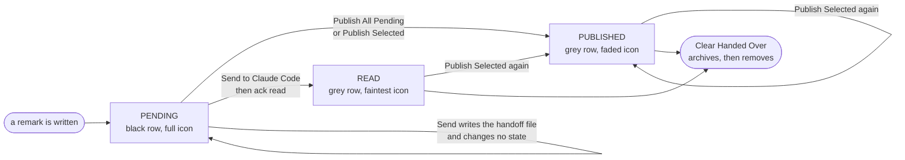
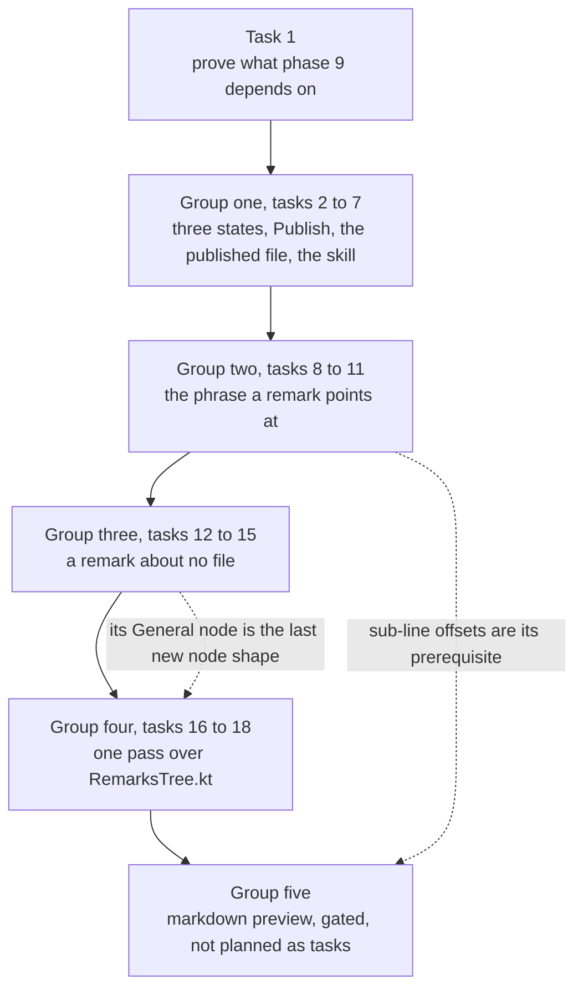

# Claude Remarks: Phase 9 Implementation Plan

**Three honest states, publishing to a file, the phrase a remark points at, a remark about no file,
and one pass over the tree.**

**Status: planned, nothing built.** Branch `claude-remarks-phase1-2`, version `0.5.0`, working tree
clean at `6d52962`. There is no git remote.

**The width of this phase was chosen, not overlooked.** Sasha decided to stitch the whole idea
backlog into one phase after being offered one theme per phase. This plan does not re-argue that. It
makes the width safe in one way: the work is ordered by subsystem, so each file is opened once by a
group of tasks that finish it, instead of four times by four separate ideas.

**Nothing has to stay compatible with anything.** One user, no released version anyone runs, no git
remote. So there is no compatibility shim, no version field and no fallback branch anywhere in this
plan. One exception is written down and argued for: the two published action ids stay as they are,
because the README promises they will not be renamed.

**Citations name symbols, not line numbers.** Same reason as phases 6, 7 and 8. A symbol name
survives the next commit in the same file.

## Contents

1. [What is true today](#1-what-is-true-today)
2. [What contradicts `docs/ideas.md`](#2-what-contradicts-docsideasmd)
3. [The state machine, which is the core change](#3-the-state-machine-which-is-the-core-change)
4. [The open questions, decided](#4-the-open-questions-decided)
5. [Groups, their order, and why the grouping differs from the brief](#5-groups-their-order-and-why-the-grouping-differs-from-the-brief)
6. [Waves](#6-waves)
7. [Rules that must hold at every step](#7-rules-that-must-hold-at-every-step)
8. [Implementation steps](#8-implementation-steps)
    - [Task 1: Prove what phase 9 depends on](#task-1-prove-what-phase-9-depends-on)
    - [Group one: three states, and publishing to a file](#group-one-three-states-and-publishing-to-a-file)
    - [Task 2: Three states, and every reader of them](#task-2-three-states-and-every-reader-of-them)
    - [Task 3: Publish replaces copy](#task-3-publish-replaces-copy)
    - [Task 4: The published file: its name, its header, its write](#task-4-the-published-file-its-name-its-header-its-write)
    - [Task 5: The publish pipeline writes the file](#task-5-the-publish-pipeline-writes-the-file)
    - [Task 6: The skill learns to read a published file](#task-6-the-skill-learns-to-read-a-published-file)
    - [Task 7: Group one documentation](#task-7-group-one-documentation)
    - [Group two: the remark points at the phrase](#group-two-the-remark-points-at-the-phrase)
    - [Task 8: Store the selected phrase](#task-8-store-the-selected-phrase)
    - [Task 9: Find the phrase again](#task-9-find-the-phrase-again)
    - [Task 10: The tree row and the gutter tooltip show the sub-line range](#task-10-the-tree-row-and-the-gutter-tooltip-show-the-sub-line-range)
    - [Task 11: The history file, and group two documentation](#task-11-the-history-file-and-group-two-documentation)
    - [Group three: a remark that belongs to no file](#group-three-a-remark-that-belongs-to-no-file)
    - [Task 12: The renderer's General section](#task-12-the-renderers-general-section)
    - [Task 13: Resolve passes over a remark with no path](#task-13-resolve-passes-over-a-remark-with-no-path)
    - [Task 14: The entry point in the tool window](#task-14-the-entry-point-in-the-tool-window)
    - [Task 15: The General group, the history file, and group three documentation](#task-15-the-general-group-the-history-file-and-group-three-documentation)
    - [Group four: one pass over the tree](#group-four-one-pass-over-the-tree)
    - [Task 16: File rows show the file name first](#task-16-file-rows-show-the-file-name-first)
    - [Task 17: Drag remarks onto a bucket](#task-17-drag-remarks-onto-a-bucket)
    - [Task 18 (optional, dropped by default): a Published group](#task-18-optional-dropped-by-default-a-published-group)
    - [Task 19: The version, the idea file, and the final sweep](#task-19-the-version-the-idea-file-and-the-final-sweep)
9. [Group five: annotating a rendered markdown preview, and its gate](#9-group-five-annotating-a-rendered-markdown-preview-and-its-gate)
10. [What this phase deliberately does not build](#10-what-this-phase-deliberately-does-not-build)
11. [Known limits, and the Known Issues entries to add](#11-known-limits-and-the-known-issues-entries-to-add)
12. [Hand checks](#12-hand-checks)

## 1. What is true today

Read from the source on this branch. Every claim below was checked, not remembered.

**One state value means two different things, and its own KDoc says so.**
`model/RemarkState.kt` has `enum class RemarkStatus { PENDING, SENT }` and the comment above it says
`SENT` is written "once a copy reaches the clipboard". The review path writes the same value only
after an agent posts `ack read`, in `reportReviewEnd` in `review/SendReview.kt`. Two paths, one value.

**Nothing outside Kotlin reads the persisted status string.** Only `workspace.xml` holds it, written
and read by the platform's serializer through `var status by enum(RemarkStatus.PENDING)`. The prompt
renderer, the history file and the handshake file never print it. So renaming the value costs exactly
one thing: remarks stored as `SENT` will not parse and will load as pending.

**Twelve places read the one state.** `ui/RemarksTree.kt` (`remarkNode`, and the renderer's grey
row), `ui/RemarksToolWindowFactory.kt` (`sentCount`, the Publish All condition, `confirmClearSent`),
`action/CopyRemarks.kt` (`prepare`'s pending filter, `CopyAllRemarksAction.update`),
`review/SendReview.kt` (`canSend`, `reportReviewEnd`), `editor/RemarkGutter.kt` (`placementsFor`),
`editor/RemarkGutterIcon.kt` (`SENT_ICON`, `tooltipFor`), `store/RemarkEdits.kt`
(`markRemarksSent`, `clearSentRemarks`) and `store/RemarkStore.kt` (`markSent`, `removeSent`).

**The sub-line columns already exist.** This is the biggest difference from what `docs/ideas.md`
describes. `RemarkState` already has `startColumn` and `endColumn` with the "0 means whole lines"
convention. `action/AddRemarkAction.kt`'s `selectedColumns` computes them. `render/PromptPayload.kt`
passes them into `RenderedRemark`. `render/PromptRenderer.kt` already wraps the exact selection in
`⟦` and `⟧` through `markersValid` and `withSelectionMarkers`, and `SEVERITY_SCALE_NOTE` already
explains the two markers to the model. Phase 8's hotfix built all of that.

**What the sub-line work still lacks:** the anchor knows nothing about columns.
`anchor/Anchoring.kt` hashes whole lines in `hashLines`, and `captureAnchor` takes only a line range.
So a stored column pair is never refreshed and goes stale in silence. `markersValid` then falls back
to plain lines. The tree still prints `9-9` in `remarkNode`. `store/RemarkHistory.kt`'s
`renderHistory` still prints `lines 10-12` only.

**A remark with no path does not crash anything, and it is close to reachable.** `RemarkState.path`
is `by string()`, so it is already nullable. `RemarksTree.remarkNode` does `path =
row.remark.path.orEmpty()`, so a pathless remark lands in a file group with an empty name.
`RemarkGutter.placementsFor` filters `it.path == path` against a real document path, so a pathless
remark is skipped there already, with no change needed. `RemarkResolver.resolveOne` refuses it with
"no path stored" and marks it orphaned, which is the one wrong answer in the set.
`render/PromptRenderer.kt` groups by `path` and would print an empty `##` heading.

**The tree label really is the whole path.** `addFileGroups` builds
`GroupNode("${keyPrefix}file:$path", path)`, and `RemarkTreeRenderer` draws a `GroupNode` with a
single `append(user.label, REGULAR_BOLD_ATTRIBUTES)`. `GroupNode` already separates `key` from
`label`, and `RemarksPanel` restores the selection by key, so changing what is drawn cannot break
the selection.

**The published file has a naming scheme ready to copy.** `handshakeName` in
`review/ReviewHandshake.kt` returns the first 16 hex characters of sha256 over the project's real
path, plus `.json`. `handshakeDir()` is `~/.claude-remarks`. The directory is set to `rwx------` and
the handshake file to `rw-------`. `atomicWriteString` in `review/AtomicWrite.kt` writes a temp file
beside the target and renames it. The skill already computes the same hash with
`printf %s "$root" | shasum -a 256 | cut -c1-16`.

**The publish pipeline already has the shape the file write needs.** `copyRemarks` runs `prepare`
inside `ReadAction.nonBlocking`, then does the clipboard work in `finishOnUiThread`, then
`markRemarksSent`, then one balloon. `clipboardPayload` already writes a file on the EDT above 100 KB,
and `docs/claude/design.md` argues why that write belongs there and not inside the read action.

**The drag-and-drop classes exist in the 2025.2 jars.** Checked with `javap` against
`app-client.jar`, not remembered. `com.intellij.ide.dnd.aware.DnDAwareTree extends
com.intellij.ui.treeStructure.Tree` and has a `DnDAwareTree(TreeModel)` constructor, which is the
constructor `RemarksPanel.tree` uses today. `DnDSupport.createBuilder(JComponent)` returns
`DnDSupportBuilder`, which has `setBeanProvider`, `setTargetChecker`, `setDropHandler`,
`setDisposableParent` and `install`. `setRemarkBucket` already does the whole drop action and
publishes `REMARKS_CHANGED`.

**The markdown preview really does carry source offsets.** `md-src-pos` attributes in the bundled
Markdown plugin hold character ranges such as `0..225` into the `.md` source, on paragraph and span
elements. Found in the test data of `plugins/markdown` in the local IntelliJ checkout. Character
offsets, not line numbers, which is why the sub-line model is that idea's prerequisite.

**The test baseline.** 349 test functions across 33 test classes by name count. Phase 8 reported 330
tests from `./gradlew test`. Task 1 reports the real number so later tasks can compare.

**No hand check has been run for phases 1 to 5, 7 or 8.** `CLAUDE.md` records this per phase. Only
phase 6's seven security checks and phase 5's commit stamp were seen in a real IDE. So the UI this
phase changes has never been watched by a person. Task 1 exists for that.

## 2. What contradicts `docs/ideas.md`

Four things. Two of them change what the tasks do.

**The selection-range entry is out of date, and this matters.** "A remark should point at the
selection, not at the whole line" lists the model change, the prompt change and the renderer change
as work to do. All three are already built (see [section 1](#1-what-is-true-today)). What is left is
the anchor, the tree label and the history file. Group two is written against the code, not against
that list.

**"Hashing the selected text" cannot recover a moved phrase, so this plan stores the phrase
instead.** The idea entry says hashing the phrase makes the anchor survive a reflowed paragraph. A
hash can only confirm a guess. To find a phrase that moved, something has to produce candidate
positions, and for a sub-line range that means candidate line and column pairs, which is every
substring of every line. Storing the phrase text turns the same job into one `indexOf` per candidate
line. `contextBefore` and `contextAfter` already store six lines of real source in `workspace.xml`,
so a stored phrase is not a new kind of data. See
[the decisions](#4-the-open-questions-decided) for the trade-off written out.

**The gutter needs no change for a pathless remark.** The idea entry says "resolve and the gutter
must skip it". `RemarkGutter.placementsFor` already does, because it filters on an exact path match
against a real document. Only the resolver needs the change.

**`CLAUDE.md` rule 3's own guard does not run in zsh.** It is written
`grep -rn "..." src/main --include=*.kt | ...`. In zsh the bare `*.kt` is a glob, and zsh fails the
whole line with `no matches found: --include=*.kt` before grep starts. The pipeline then prints
nothing, which looks exactly like a guard that passed. Checked by running both forms in `zsh -c`.
The quoted form `--include='*.kt'` runs. This is not a phase 9 defect, but every task in this phase
runs that guard, so [task 1](#task-1-prove-what-phase-9-depends-on) checks it and
[task 19](#task-19-the-version-the-idea-file-and-the-final-sweep) fixes the wording in `CLAUDE.md`.

## 3. The state machine, which is the core change



Two edges are worth reading twice.

**`Send to Claude Code` changes no state at all.** That is phase 7's rule and this phase keeps it.
The review channel can confirm a read, so it waits for the confirmation instead of guessing. The
banner already shows the in-between state as "Sent N remarks. Waiting for Claude Code to read them."

**Publishing a `READ` remark moves it back to `PUBLISHED`.** The person is handing it over again, and
nothing has confirmed that second handover. Leaving it at `READ` would claim a confirmation for a
handover nobody confirmed.

## 4. The open questions, decided

**One published file overwritten, or timestamped files accumulating? One file, overwritten.**
With one file the skill computes the name from the repository path and reads it, exactly as it
already does for the handshake file. With timestamped files the skill has to list a directory, sort
by name or by mtime, pick the newest, and something has to delete the old ones. The old ones are also
readable, so an agent can be pointed at a file from yesterday and act on it with full confidence.
The property being traded is history against having one truth. One truth wins here, because the store
in `workspace.xml` is already the durable tier, and `docs/claude/design.md` says so under "The store
stays the durable tier".

**The name and location: `~/.claude-remarks/<first 16 hex of sha256 of the real project path>.md`.**
The same 16 hex characters `handshakeName` computes, with `.md` instead of `.json`. `handshakeName`
gets a small extraction so both callers share one function. The skill computes it with the one-line
`shasum` it already runs. Permissions `rw-------`, in the directory that is already `rwx------`,
because the file holds remark text and slices of source.

**What the second publish does to the file: it overwrites it with what that publish rendered.**
`Publish All Pending` renders pending remarks only. So publish three remarks, write a fourth, publish
again, and the file then holds the fourth alone. Nothing is lost: the first three are still in the
store, still shown in the tree as published, and `Publish Selected` hands any of them over again.
The alternative, publishing everything that is not `READ` every time, would keep the file complete
but would also put already published remarks back on the clipboard on every publish, which is the
destination the person actually pastes from. A stale file is the risk this creates, and the header
inside the file is the answer to it.

**The file carries a timestamp, the head commit and a count, above the same markdown.** First line
is the marker `<!-- claude-remarks: published -->`, the same trick `REJECTED_MARKER` uses so a reader
can tell one kind of file from another before handing anything to a model. Then `published:`,
`commit:` and `remarks:` lines, then a blank line, then the prompt exactly as the clipboard gets it.
The clipboard does not get the preamble. That is the one deliberate difference between the two
destinations, and the reason is that the preamble exists for a reader who finds the file later, and a
paste is never later.

**How the skill is told to read it: a second mode in the same skill.** They share the repository
root, the project hash and the whole "act on the markdown" step. A separate skill would copy that
shell, and this file has a history of exactly one defect class, a variable read where it was never
assigned: seven found in phase 7 and two more in phase 8. Two copies of the discovery shell is two
places for that to happen again. The cost is a longer skill file and a front matter description that
has to name both jobs, or the model will not pick it for "read the remarks I published". The new
section goes above `## Steps` with its own self-contained shell block, so it shares no variable with
the review flow at all.

**A review is waiting and the person publishes: publishing writes the clipboard and the file, and
leaves the review alone.** The review is a different contract. It has a session id, a handoff path
minted for it, and an acknowledgement that marks remarks `READ`. Satisfying it from `Publish` would
hand the same remarks to two channels and then let one of them confirm a read for a paste that may
have gone somewhere else entirely. The banner after a publish is unchanged, still "Claude Code is
waiting: <label>". There is a real consequence, and it is written down as a limit in
[section 11](#11-known-limits-and-the-known-issues-entries-to-add): publishing everything leaves
nothing pending, so `Send to Claude Code` greys out and the waiting review can only be answered with
Reject.

**Is `READ` reachable outside the review path? No, and that asymmetry is the point of two states.**
`markRemarksRead` gets exactly one production caller, `reportReviewEnd` in `review/SendReview.kt`, on
the `ReviewEnd.READ` branch. A new grep guard keeps it that way, and it is the only guard this phase
adds.

**What the phrase is stored over: the selected text itself, only for a real sub-line range.** A
whole-line remark stores nothing new, so `workspace.xml` does not change for the common case and the
anchor for it stays byte-identical. A sub-line remark stores the text between its two columns, joined
with newlines when the selection spans lines. Cost: the phrase is source text in `workspace.xml`, and
a very long selection stores a very long string. Accepted, because `contextBefore` and `contextAfter`
already store six full source lines per remark, and because a sub-line selection is short by
definition, which is the whole reason the feature exists.

**What happens to the existing tests and the stored remarks when the anchor learns about the
phrase: nothing.** `hashLines` and `captureAnchor` do not change. `resolveAnchor` does not change.
The phrase work is one new pure function plus one composition function, both in `anchor/`, both
skipped when the stored phrase is null. Every remark stored today has a null phrase, so it resolves
exactly as it does now. `AnchoringTest` keeps every test it has.

**Which grouping axis wins for a published remark: the question is deferred with the group.**
Published remarks stay grey in place in this phase, as decided before planning. If the Published
group is ever built, it goes at the very top and bucket groups sit inside it, because the first
question the tree answers should be "what is left to do". The cost of that order is that one bucket
can then appear twice, once inside Published and once outside, and that cost is the reason
[task 18](#task-18-optional-dropped-by-default-a-published-group) is optional. What would make it
worth building: more than about twenty remarks in the tree with a third of them handed over, and the
person scrolling past grey rows to find work.

## 5. Groups, their order, and why the grouping differs from the brief



**Group boundaries are shipping points.** Every group ends with the suite green, the five guards
empty and a commit that could be released on its own. Dropping a whole group leaves the ones before
it complete.

**The grouping differs from the brief's proposal in one place, on purpose.** The brief put "the
fileless remark's tree shape" inside the single pass over `ui/RemarksTree.kt`. A tree shape for a
remark nobody can create is dead code, so the remark that belongs to no file is its own group here,
with its entry point, its renderer section, its resolver change, its tree node and its history line.
The tree pass then follows it and does the three changes that are only about the tree: the file row
label, the drag, and the optional Published group. That keeps the stitching payoff, because
`RemarksTree.kt` is opened by group three for one small node addition and by group four for the rest,
rather than by four separate ideas.

**The order inside group one puts the state model first** because everything else in the group reads
it, and Sasha wants that part most.

## 6. Waves

**No waves. Every task in this plan runs in sequence.**

The reason in one line: after task 1, no two tasks touch disjoint files. Group one's seven tasks pass
`store/`, `ui/`, `action/` and `review/` between them; group two changes what the renderer and the
tree read; groups three and four both edit `ui/RemarksTree.kt`. The one task that looks parallel, the
skill edit in task 6, depends on the published file's exact name and header being final, which is
task 4. Running it early would mean writing the skill against a guess.

## 7. Rules that must hold at every step

The five guards in `CLAUDE.md` under "Rules that must not break". Every one must come back empty
after every task. Write the third one's glob quoted, `--include='*.kt'`, whatever `CLAUDE.md` still
says, for the reason in [section 2](#2-what-contradicts-docsideasmd).

```bash
grep -rn "com.intellij" src/main/kotlin/dev/sasha/clauderemarks/anchor/
grep -rn "com.intellij" src/main/kotlin/dev/sasha/clauderemarks/render/PromptRenderer.kt
grep -rn "RemarkStore\.getInstance([^)]*)\." src/main --include='*.kt' \
  | grep -v RemarkEdits.kt | grep -v "\.all()"
grep -rnE "WriteCommandAction|WriteAction\.|runWriteAction|insertString|replaceString|deleteString|[Dd]ocument\.setText|setBinaryContent" src/
grep -rnE "invokeAndWait|projectRoot\(|FileEditorManager|VfsUtil|SwingUtilities" \
  src/main/kotlin/dev/sasha/clauderemarks/review/ReviewRestService.kt
```

Four rules bind specific tasks in this phase:

- **The anchoring module stays free of the platform.** Group two adds two functions to `anchor/`.
  Both take lists of strings and return data. No `Document`, no `Project`.
- **The markdown renderer stays free of the platform.** Group three adds the General section to
  `render/PromptRenderer.kt`. Same shape as everything already in that file.
- **`store/RemarkEdits.kt` holds the only functions that change a remark.** This phase takes the
  count from eight to eleven: `markRemarksSent` becomes `markRemarksPublished`, `markRemarksRead`
  is new, `clearSentRemarks` becomes `clearHandedOverRemarks`, and `addGeneralRemark` is new. Every
  count written in prose has to move with it.
- **The review endpoint is not touched by this phase at all.** Publishing needs no endpoint action,
  because the skill reads a file whose name it can compute. So rule 5 stays true for free, and no
  task may add anything to `review/ReviewRestService.kt`.

**Every task ends green, not only every group.** No task in this plan may leave the tree not
compiling, a test failing or a guard tripping at its own boundary. The reason is how the plan is run:
`/planning:exec` drives it task by task and its only stopping condition is whether that task's
checkboxes are ticked. It does not compile between tasks. So a red tree at a task boundary is
invisible to the driver, and a failure in the next task cannot be attributed to either side. Where
that forced two pieces of work into one task, the task says so and carries more checkboxes than the
others. Checked once over every task in this plan: task 2 was the only one that had this shape.

**One new guard, added in task 2, because it protects the whole point of the phase:**

```bash
grep -rn "markRemarksRead(" src/main --include='*.kt' \
  | grep -v "store/RemarkEdits.kt" | grep -v "review/SendReview.kt"   # must be empty
```

**Threading, unchanged from every earlier phase.** EDT for UI, `ReadAction` for `Document` and PSI
reads, nothing slow on the EDT. The published file write goes in the same place `clipboardPayload`'s
write already goes, for the reason `docs/claude/design.md` gives: a non-blocking read action is
cancelled and re-run when a write action asks for the lock, so a file write inside it leaves a stray
file on every retry.

**Do not run `./gradlew runIde`.** It starts an interactive sandbox IDE that never exits. Every check
that needs one is in [section 12](#12-hand-checks) for a person to run.

**Every task's tests are judged by mutation.** Each test checkbox names the change to production code
that must make it fail. A test that stays green under an obviously broken implementation is not
accepted. This standard caught real defects in phases 7 and 8.

## 8. Implementation steps

### Task 1: Prove what phase 9 depends on

**Model:** sonnet

**Files:**
- Read only: `CLAUDE.md`, the "Rules that must not break" section
- Read only: `src/main/kotlin/dev/sasha/clauderemarks/model/RemarkState.kt`, `RemarkStatus` and the
  `startColumn`/`endColumn` pair
- Read only: `src/main/kotlin/dev/sasha/clauderemarks/render/PromptRenderer.kt`, `markersValid`,
  `withSelectionMarkers`
- Read only: `src/main/kotlin/dev/sasha/clauderemarks/anchor/Anchoring.kt`, `hashLines`,
  `captureAnchor`
- Read only: `src/main/kotlin/dev/sasha/clauderemarks/ui/RemarksTree.kt`, `addFileGroups`,
  `remarkNode`
- Read only: `src/main/kotlin/dev/sasha/clauderemarks/review/ReviewHandshake.kt`, `handshakeName`,
  `handshakeDir`

This phase is built on top of seven phases whose UI nobody has watched run. This task does the half
an agent can do, and names the half only a person can.

The mechanical half:

- [ ] `git status --porcelain` is empty. Another agent may be working in this tree. If it is not
      empty, stop and report what is there rather than working around it.
- [ ] `RemarkStatus` still has exactly two values, `PENDING` and `SENT`. If it already has three,
      this plan was written against an older tree. Stop and report.
- [ ] `RemarkState` already has `startColumn` and `endColumn`, and `PromptRenderer.kt` already has
      `markersValid` and `withSelectionMarkers`. Group two depends on that being the starting point,
      because the plan does not re-plan them.
- [ ] `anchor/Anchoring.kt` still has no reference to any column, and `captureAnchor` still takes a
      line range only. Group two's whole design rests on this.
- [ ] run all five guards from [section 7](#7-rules-that-must-hold-at-every-step) now, before any
      change, with the third one's glob **quoted**. All five must be empty. Then run the third one
      once with the bare glob under `zsh -c` and confirm it fails with `no matches found`, which is
      the finding in [section 2](#2-what-contradicts-docsideasmd). Report both results.
- [ ] `./gradlew test --rerun-tasks` passes on the untouched tree. Report **two numbers and say which
      is which**: the count Gradle reports as executed tests, and the count of test functions by name.
      They do not agree on this tree, 346 executed against 349 by name, so a later task must not read
      that difference as a regression. Both are written down here once.

      ```bash
      grep -rhoE 'fun +(test[A-Za-z0-9_]*|`[^`]+`)' src/test | wc -l
      ```
- [ ] extract the skill's shell blocks and check the baseline parses:

      ```bash
      awk '/^ *```sh$/{f=1;next} /^ *```$/{f=0;next} f' \
        docs/skill/claude-remarks-review/SKILL.md > /tmp/skill-baseline.sh
      sh -n /tmp/skill-baseline.sh && bash -n /tmp/skill-baseline.sh && echo "SYNTAX OK"
      ```

      Report the line count, so task 6 can compare.
- [ ] no commit. This task writes nothing except this plan file's own checkboxes.

**The hand half, which only a person at a real IDE can do.** Run `./gradlew runIde` **by hand**,
never from an agent session. These are owed before anything after task 1 is trusted.

- [ ] **the plugin loads at all.** The Claude Remarks tool window is present in the sandbox IDE.
      This is the most important check in the phase. If a `plugin.xml` dependency is wrong the plugin
      refuses to load and **the only symptom is the tool window simply not being there**: no dialog,
      no visible error. If it is missing, read `idea.log` for the plugin loading error and stop the
      phase here.
- [ ] **a remark on part of one line reaches the prompt with its markers.** Select three words inside
      a line, add a remark, press Copy All Pending, paste, and confirm `⟦` and `⟧` sit exactly around
      those three words. This is phase 8's hotfix, never seen running, and group two builds on it.
- [ ] **the grey row and the faded gutter icon are visible today.** Add a remark, copy it, and
      confirm the row greys and the gutter icon fades. Task 2 splits that one appearance into two, so
      the starting point has to be seen once.

### Group one: three states, and publishing to a file

Ships: `PENDING`, `PUBLISHED` and `READ`; the action called Publish; a file under
`~/.claude-remarks/` that an agent can read whenever; and a skill that reads it.

### Task 2: Three states, and every reader of them

**Model:** sonnet

**One task, not two, and it is deliberately larger than the rest.** Renaming the stored value breaks
every reader of it in the same compile. Splitting the enum from the readers would leave the tree not
compiling at the boundary between them, and `/planning:exec` does not compile between tasks, so that
red tree would be invisible to the driver and a failure in the next task could not be attributed to
either side. So this task carries more checkboxes than the others. A task that ends green is worth
more than a task that ends small.

**Files:**
- Edit: `src/main/kotlin/dev/sasha/clauderemarks/model/RemarkState.kt`, `RemarkStatus` and its KDoc
- Edit: `src/main/kotlin/dev/sasha/clauderemarks/store/RemarkStore.kt`, `RemarksState.markSent` and
  `removeSent` become `markPublished`, `markRead` and `removeHandedOver`, plus the four delegating
  methods on `RemarkStore`
- Edit: `src/main/kotlin/dev/sasha/clauderemarks/store/RemarkEdits.kt`, `markRemarksSent` becomes
  `markRemarksPublished`, `markRemarksRead` is new, `clearSentRemarks` becomes
  `clearHandedOverRemarks`, and the count in the file's own KDoc
- Edit: `src/main/kotlin/dev/sasha/clauderemarks/ui/RemarksTree.kt`, `RemarkNode.sent` becomes
  `status`, `remarkNode`'s mapping, and `RemarkTreeRenderer`'s grey row
- Edit: `src/main/kotlin/dev/sasha/clauderemarks/editor/RemarkGutterIcon.kt`, `SENT_ICON` becomes
  two icons, `RemarkPlacement.sent` becomes `status`, `tooltipFor`'s last line, and
  `RemarkGutterIconRenderer`'s `getIcon`/`equals`/`hashCode`
- Edit: `src/main/kotlin/dev/sasha/clauderemarks/editor/RemarkGutter.kt`, `placementsFor`'s mapping
- Edit: `src/main/kotlin/dev/sasha/clauderemarks/ui/RemarksToolWindowFactory.kt`, `sentCount`
  becomes `handedOverCount`, the Clear button's text, and `confirmClearSent`
- Edit: `src/main/kotlin/dev/sasha/clauderemarks/review/SendReview.kt`, `reportReviewEnd`'s
  `ReviewEnd.READ` branch calls `markRemarksRead`
- Edit: `src/main/kotlin/dev/sasha/clauderemarks/action/CopyRemarks.kt`, the two `PENDING` filters
  keep their meaning, and `markRemarksSent` becomes `markRemarksPublished`
- Edit: `CLAUDE.md`, the new guard under "Rules that must not break"
- Edit: `src/test/kotlin/dev/sasha/clauderemarks/store/RemarkStoreStateTest.kt`, the round trip
  tests and the mutator tests
- Edit: `src/test/kotlin/dev/sasha/clauderemarks/store/RemarkEditsTest.kt`, the notification tests
- Edit: `src/test/kotlin/dev/sasha/clauderemarks/store/TestRemarks.kt`, the `status` default only if
  it needs it
- Edit: `src/test/kotlin/dev/sasha/clauderemarks/ui/RemarksTreeTest.kt`,
  `src/test/kotlin/dev/sasha/clauderemarks/review/SendReviewTest.kt`,
  `src/test/kotlin/dev/sasha/clauderemarks/review/ReviewEndpointSmokeTest.kt`

```kotlin
/**
 * What has happened to a remark, in order.
 *
 * PENDING is written, handed nowhere. PUBLISHED means handed to a channel that cannot confirm a
 * read: the clipboard is one, the published file is another. READ means an agent said it read them,
 * over POST /api/claude-remarks/ack. Only the review path can produce READ, which is the whole
 * reason there are two words for "handed over" rather than one.
 *
 * PENDING stays the first value and the default, so BaseState keeps omitting it and nothing has to
 * migrate. A remark stored by an older build as "SENT" does not parse and loads as PENDING. That is
 * accepted: those remarks had already been handed over, and nothing about them is lost but a colour.
 */
enum class RemarkStatus { PENDING, PUBLISHED, READ }
```

`markPublished` counts a remark as changed when its status is not already `PUBLISHED`, so publishing
a `READ` remark moves it back. `removeHandedOver` removes everything whose status is not `PENDING`.

Three appearances, one per state. `PENDING` keeps `AllIcons.General.Note` at full strength and a
black row. `PUBLISHED` keeps today's `IconLoader.getTransparentIcon(AllIcons.General.Note, 0.45f)`
and a grey row ending in `published`. `READ` gets `0.25f` and a grey row ending in `read`. Both
transparency overloads exist in the 2025.2 jars, checked with `javap`.

`GRAYED_ATTRIBUTES` for both grey states rather than a second grey: `SimpleTextAttributes` has
`GRAY_ATTRIBUTES` and `GRAYED_SMALL_ATTRIBUTES` as well, but the word at the end of the row is what
tells the two apart, and two greys a person cannot reliably tell apart is a distinction that only
exists in the code.

**`canSend` and `prepare`'s pending filter keep meaning `PENDING` only.** Publish must not
re-publish what was already published, which is what `Publish Selected` is for. The consequence is
the limit in [section 11](#11-known-limits-and-the-known-issues-entries-to-add).

**`ReviewPhase.Sent` keeps its name.** It describes the review, not the remark: the file was written
and the acknowledgement has not arrived. Renaming it would spread this phase into phase 7's design
for no gain.

- [ ] write the failing tests in `RemarkStoreStateTest`:
  - `a remark stored as SENT by an older build loads as pending`. Build the XML by hand with
    `JDOMUtil.load` carrying `status="SENT"`, deserialize it the way the existing round trip does,
    and assert `PENDING`. This is the accepted reset, pinned so it is a decision and not a surprise.
  - `published and read both survive the round trip`. One remark of each, compared as serialized XML
    the way `every field survives a write and read cycle` already does.
  - `marking published moves a read remark back to published`. And `markPublished` returns 1 for it.
  - `clearing handed over removes published and read and keeps pending`.
- [ ] write the failing tests in `RemarkEditsTest`: `markRemarksPublished` publishes
      `REMARKS_CHANGED`, `markRemarksRead` publishes it, and neither publishes when nothing changed.
- [ ] write the failing tests for the readers: `RemarksTreeTest`, a published remark's node carries
      `PUBLISHED` and a read one carries `READ`; `SendReviewTest`, an `ack read` leaves the remarks
      `READ`, not `PUBLISHED`; `ReviewEndpointSmokeTest`, the same through the endpoint.
- [ ] run `./gradlew test` and expect compile failures in the store and in every reader
- [ ] implement the enum, the store, the three edit functions and every reader in one pass, and add
      the new guard to `CLAUDE.md`
- [ ] `./gradlew test` passes whole, and all six guards are empty
- [ ] **mutation:** make `markPublished` skip a remark whose status is `READ`; the "moves a read
      remark back" test must fail. Make `removeHandedOver` remove only `PUBLISHED`; the clearing test
      must fail. Keep the enum constant named `SENT` next to the other two; the older-build test must
      fail. Make `reportReviewEnd` call `markRemarksPublished` instead of `markRemarksRead`; the
      `SendReviewTest` and endpoint tests must fail. Make `remarkNode` map both handed-over states to
      one value; the tree test must fail. Restore all five.
- [ ] commit: `feat: a remark is pending, published or read, and published is not read`

### Task 3: Publish replaces copy

**Model:** sonnet

**Files:**
- Rename: `src/main/kotlin/dev/sasha/clauderemarks/action/CopyRemarks.kt` to `PublishRemarks.kt`,
  `copyRemarks` to `publishRemarks`, `CopyAllRemarksAction` to `PublishAllRemarksAction`, and the
  balloon wording inside it
- Rename: `src/test/kotlin/dev/sasha/clauderemarks/action/CopyRemarksTest.kt` to
  `PublishRemarksTest.kt`, and its three test names
- Edit: `src/main/resources/META-INF/plugin.xml`, the `class`, `text` and `description` of the
  action whose id is `ClaudeRemarks.CopyAll`, plus a comment saying why the id keeps the old word
- Edit: `src/main/kotlin/dev/sasha/clauderemarks/ui/RemarksToolWindowFactory.kt`, the two toolbar
  button texts, and the Clear Handed Over dialog wording
- Edit: `src/main/kotlin/dev/sasha/clauderemarks/review/SendReview.kt`, the import and the comment
  naming `ALL_PENDING`
- Edit: `src/test/kotlin/dev/sasha/clauderemarks/action/ActionIdsTest.kt`, one new assertion
- Edit: `README.md`, the walkthrough sentences and a note under the id table

**The action ids do not change.** `README.md` says the three ids "are a public interface and will not
be renamed", and `ActionIdsTest` pins them with a message that cites the README. Renaming
`ClaudeRemarks.CopyAll` would break Sasha's own `.ideavimrc` silently, because `:action` on an
unknown id fails inside IdeaVim and nothing in this project would notice. What it would buy is a
tidier id. That is not worth a broken mapping, so the id keeps a word the button no longer uses and
`plugin.xml` says so in a comment. `README.md` gets one sentence under the table for the same reason.

- [ ] write the failing test in `ActionIdsTest`: the action registered as `ClaudeRemarks.CopyAll` has
      a template text starting with `Publish`. This pins the rename that the id cannot show.
- [ ] run `./gradlew test --tests "dev.sasha.clauderemarks.action.*"` and expect a failure
- [ ] do the renames, including the file and class renames, and update every call site
- [ ] `./gradlew test` passes whole, and `./gradlew verifyPluginProjectConfiguration` passes after the
      `plugin.xml` edit
- [ ] **mutation:** put the text back to `Copy All Pending Claude Remarks`; the new assertion must
      fail. Change the id to `ClaudeRemarks.PublishAll`; the existing id assertion must fail.
      Restore both.
- [ ] commit: `refactor: the copy action is called Publish, and its id stays as documented`

### Task 4: The published file: its name, its header, its write

**Model:** sonnet

**Files:**
- Edit: `src/main/kotlin/dev/sasha/clauderemarks/review/ReviewHandshake.kt`, extract `projectHash`
  out of `handshakeName`, which then returns `projectHash(realPath) + ".json"`
- New: `src/main/kotlin/dev/sasha/clauderemarks/review/PublishedRemarks.kt`, `publishedName`,
  `PUBLISHED_MARKER`, `publishedHeader`, `writePublished`
- New: `src/test/kotlin/dev/sasha/clauderemarks/review/PublishedRemarksTest.kt`

Three functions and one constant. `publishedHeader` is pure and takes its clock, so the test pins a
real string rather than a shape.

```kotlin
/** The first line, so a reader can tell this file from a handoff file or a rejection before it hands
 *  the body to a model. A wire format shared with SKILL.md: not reworded without editing it too. */
const val PUBLISHED_MARKER = "<!-- claude-remarks: published -->"

/**
 * The same 16 hex characters handshakeName uses, with .md instead of .json, so a skill running in
 * the repository computes this name with the shasum one-liner it already runs for the handshake.
 */
fun publishedName(realPath: String): String = projectHash(realPath) + ".md"

/**
 * What sits above the prompt in the published file. A published file can be read hours later, or
 * twice, and nothing confirms a read on this path, so the reader has to be able to see how old it is
 * and what revision it was about. The same defect shape is already recorded in
 * docs/claude/design.md under Known Issues for a same-session review retry.
 */
fun publishedHeader(now: Long, commit: String?, count: Int): String
```

`writePublished(root: Path, body: String, dir: Path = handshakeDir()): Path` creates the directory,
sets it to `rwx------`, writes through `atomicWriteString`, then sets the file to `rw-------`. The
order is the one `writeHandshake` argues for: the permission call on the file has to run after the
rename, because `atomicWriteString` renames a temp file onto the target.

- [ ] write the failing tests in `PublishedRemarksTest`:
  - `the published name is the handshake name with a markdown suffix`. Same input, both functions,
    the first 16 characters equal.
  - `the header starts with the marker and carries the time, the commit and the count`. A fixed
    `now`, a 40 character sha, assert the exact four lines, with the commit cut to eight characters
    the way the prompt heading and the tree both cut it.
  - `a header with no commit says so rather than printing an empty field`.
  - `the write lands in the given directory, owner readable only, and leaves no temp file behind`.
    A temp directory, then list it and assert exactly one file.
- [ ] run `./gradlew test --tests "dev.sasha.clauderemarks.review.PublishedRemarksTest"` and expect a
      compile failure
- [ ] implement, then the same command and
      `./gradlew test --tests "dev.sasha.clauderemarks.review.ReviewHandshakeTest"` both pass. The
      handshake test is the one that notices a bad extraction of `projectHash`.
- [ ] **mutation:** make `publishedName` hash something other than the real path, for example the
      project name; the first test must fail. Drop the marker line from `publishedHeader`; the second
      must fail. Move the file permission call to before `atomicWriteString`; the fourth must fail.
      Restore all three.
- [ ] commit: `feat: the published file has a name a skill can compute and a header it can date`

### Task 5: The publish pipeline writes the file

**Model:** sonnet

**Files:**
- Edit: `src/main/kotlin/dev/sasha/clauderemarks/action/PublishRemarks.kt`, `Prepared` gains the
  project root and the head commit, `prepare` fills them, `publishRemarks` gains a `dir` parameter
  and writes the file in the `finishOnUiThread` block, and a new pure `publishMessage`
- Edit: `src/test/kotlin/dev/sasha/clauderemarks/action/PublishRemarksTest.kt`, the message tests

The order inside `finishOnUiThread` is clipboard, then file, then mark, then one balloon:

- the clipboard fails: nothing is marked and nothing is written, exactly as today. Nothing was handed
  over, so nothing says it was.
- the file write fails and the clipboard succeeded: the remarks **are** marked published, and the
  balloon says in the same sentence that the file was not updated. The clipboard handover really
  happened, and `PUBLISHED` means handed to a channel that cannot confirm. Refusing to mark would be
  a lie in the other direction. The risk this leaves is a stale file, and it is written down in
  [section 11](#11-known-limits-and-the-known-issues-entries-to-add).
- nothing pending: the existing early return keeps the file untouched. **Never write an empty
  published file**, because an agent reading one cannot tell "nothing to say" from "something went
  wrong".

The project root and the commit are read inside `prepare`, which runs in the read action, so
`projectRoot(project)?.toNioPath()?.toRealPath()` and `headCommit` both stay off the EDT.
`toRealPath` is the same expression `ReviewHandshakeService.start` uses, and the two have to produce
the same string or the skill computes a different name.

The async pipeline itself is not driven from a test. `PublishRemarksTest`'s own KDoc already says the
clipboard and the balloon are checked by hand, and pumping a read action plus an EDT callback in a
light fixture buys a flaky test. What is tested is `publishMessage`, a pure function over the count,
the file count, the oversized clipboard file and the write failure.

- [ ] write the failing tests in `PublishRemarksTest`:
  - `the message says how many remarks and how many files were published`.
  - `the message names the temp file when the payload was too large for the clipboard`. The case
    `clipboardPayload` already has.
  - `the message says the published file was not updated when the write failed`. And it still
    reports the published count, because the clipboard handover happened.
- [ ] run `./gradlew test --tests "dev.sasha.clauderemarks.action.PublishRemarksTest"` and expect a
      compile failure
- [ ] implement, then the same command passes and `./gradlew test` passes whole
- [ ] **mutation:** make the failed-write branch skip `markRemarksPublished`; the third message test
      must fail once it also asserts the count. Make `prepare` return a null root; the publish then
      writes nothing, which the hand check in [section 12](#12-hand-checks) catches and no unit test
      can, so say that plainly in the report rather than inventing a test that does not exist.
      Restore.
- [ ] commit: `feat: publishing writes the same markdown to a file the skill can find`

### Task 6: The skill learns to read a published file

**Model:** opus

**Files:**
- Edit: `docs/skill/claude-remarks-review/SKILL.md`, the front matter `description`, and a new
  section `## Read remarks the person already published` placed above `## Steps`

**This file is symlinked into `~/.claude/skills/` and `~/.claude-work/skills/`, so an edit is live
for every Claude Code session on this machine at once.** There is no install step and no version
check. A half-finished edit is immediately in use.

The new section is one self-contained shell block. It shares no variable with the review flow, which
is the point: nine defects have been found in this file, and every one was a variable read where it
was never assigned. Guards are code, never prose, because prose cannot stop a script.

What the block does, in order: find the repository root; compute the same 16 character hash; build
the path under `$HOME/.claude-remarks`; stop if the file is missing, with a sentence saying that
nobody has published anything for this repository; stop if the first line is not
`<!-- claude-remarks: published -->`, because that means the file is something else; read the
`published:` and `commit:` lines out of the header; compare the commit against
`git rev-parse --short=8 HEAD` and **say plainly when they differ**, because then the remarks are
about code that has moved; print the whole file; then act on it.

Three things the block must not do, each for a stated reason: do not delete the file, because nothing
on this path confirms a read, which is the whole reason `PUBLISHED` is a separate state from `READ`;
do not post anything to the endpoint, because there is no review and an `ack` would answer
`no-review`; do not set a trap, because there is no review to abandon.

- [ ] write the new section, and extend the front matter `description` so a request like "read the
      remarks I published" selects this skill. Without that the section is unreachable: the
      description is what the model matches on.
- [ ] extract and check the syntax of the whole file the way task 1 did, and separately extract the
      new section's block alone and run `sh -n` and `bash -n` on it:

      ```bash
      awk '/^ *```sh$/{f=1;next} /^ *```$/{f=0;next} f' \
        docs/skill/claude-remarks-review/SKILL.md > /tmp/skill-phase9.sh
      sh -n /tmp/skill-phase9.sh && bash -n /tmp/skill-phase9.sh && echo "SYNTAX OK"
      ```
- [ ] **prove every variable read in the new block is assigned in the same block.** List every `$name`
      it reads and name the line that assigns it. This is the mechanical check that found the seven
      phase 7 defects and the two phase 8 ones. Report the list, not a claim that it passes.
- [ ] **mutation:** delete the marker check and confirm by reading that a handoff file, or any other
      markdown file at that path, would then be handed to a model as remarks. Delete the commit
      comparison and confirm the reader loses the only signal that the remarks are stale. Restore
      both. There is no automated test for a skill file, so the mutation is read and reported rather
      than run.
- [ ] commit: `feat(skill): a second mode reads the file a publish wrote`

### Task 7: Group one documentation

**Model:** sonnet

**Files:**
- Edit: `docs/claude/design.md`, rename the section "The Copy Pipeline" to "The Publish Pipeline",
  keeping one sentence saying what it used to be called; a new subsection "The three states, and why
  published is not read"; a new subsection "The published file"; one new entry in `## Known Issues`
- Edit: `CLAUDE.md`, the opening paragraph's walkthrough, the phase list, the `store/` and
  `action/` lines of the project structure, rule 3's function count, and the new guard from task 2
- Edit: `README.md`, the walkthrough, and the note under the id table if task 3 did not add it

`## Known Issues` entries carry a likelihood and a severity now. Keep that convention. The new entry
is **RARE, MAJOR: a failed published-file write leaves the previous file in place**, with the
reasoning: the balloon says the write failed, but the file that is still on disk looks exactly like a
current one to a skill reading it, and only the header's timestamp gives it away.

- [ ] update `docs/claude/design.md`, describing the state machine in words and naming which action
      causes which transition
- [ ] update `CLAUDE.md`, including the counts in rule 3 and the new guard, and write rule 3's glob
      quoted while you are in there if task 19 has not run yet
- [ ] update `README.md`
- [ ] `./gradlew test` still passes, and all six guards are empty. Documentation should not change
      either, and running them here is what proves the group is shippable.
- [ ] commit: `docs: record the three states, the publish pipeline and the published file`

### Group two: the remark points at the phrase

Ships: the exact words a sub-line remark was written about, recoverable after the line moves or is
reflowed, and visible in the tree, the tooltip and the history file.

### Task 8: Store the selected phrase

**Model:** sonnet

**Files:**
- Edit: `src/main/kotlin/dev/sasha/clauderemarks/model/RemarkState.kt`, a `phrase` property with its
  KDoc
- Edit: `src/main/kotlin/dev/sasha/clauderemarks/anchor/Anchoring.kt`, a new pure `phraseAt`
- Edit: `src/main/kotlin/dev/sasha/clauderemarks/store/RemarkEdits.kt`, `addRemark` fills `phrase`
- Edit: `src/test/kotlin/dev/sasha/clauderemarks/anchor/AnchoringTest.kt`, `phraseAt`
- Edit: `src/test/kotlin/dev/sasha/clauderemarks/store/RemarkStoreStateTest.kt`, the round trip
- Edit: `src/test/kotlin/dev/sasha/clauderemarks/store/RemarkEditsTest.kt`, what `addRemark` stores

```kotlin
/**
 * The exact text between [startColumn] and [endColumn], for a sub-line remark only, or null.
 *
 * Null for a whole-line remark, which is every remark stored before this field existed: BaseState
 * omits a property still at its default, so nothing migrates and the anchor for those remarks is
 * unchanged. Stored as text rather than as a hash because a hash can only confirm a guess, and
 * finding a phrase that moved needs something to search for. The context lines beside it already
 * store six lines of real source, so this is not a new kind of data in workspace.xml.
 */
var phrase by string()
```

`phraseAt(lines, startLine, endLine, startColumn, endColumn): String?` returns null when
`endColumn <= startColumn`, when either column is out of bounds for its line, or when the range is
not a real sub-line range. For a range inside one line it is one substring. For a range across lines
it is the tail of the first line, the whole lines between, and the head of the last, joined with
newlines. This is the same shape `withSelectionMarkers` in the renderer already assumes.

- [ ] write the failing tests in `AnchoringTest`: a phrase inside one line; a phrase across three
      lines joined with newlines; null for a whole-line range; null for a column past the end of its
      line, which a hand-edited `workspace.xml` can hold.
- [ ] write the failing tests: `RemarkStoreStateTest`, the phrase survives the round trip, and a
      remark with no phrase round-trips as null; `RemarkEditsTest`, `addRemark` with real columns
      stores the phrase, and with `0 to 0` stores null.
- [ ] run `./gradlew test --tests "dev.sasha.clauderemarks.anchor.AnchoringTest"` and
      `--tests "dev.sasha.clauderemarks.store.*"`, expect failures, then implement and pass both
- [ ] **mutation:** make `phraseAt` return the whole line instead of the substring; the first
      `AnchoringTest` test must fail. Make it ignore the bounds check; the fourth must fail. Make
      `addRemark` store the phrase even when the columns are `0 to 0`; the `RemarkEditsTest` test must
      fail. Restore all three.
- [ ] commit: `feat: a sub-line remark stores the words it points at`

### Task 9: Find the phrase again

**Model:** opus

**Files:**
- Edit: `src/main/kotlin/dev/sasha/clauderemarks/anchor/Anchoring.kt`, `findPhrase` and
  `resolveWithPhrase`, both pure
- Edit: `src/main/kotlin/dev/sasha/clauderemarks/store/RemarkResolver.kt`, `ResolvedRemark` gains
  the resolved columns, `resolveOne` calls `resolveWithPhrase`
- Edit: `src/main/kotlin/dev/sasha/clauderemarks/render/PromptPayload.kt`, read the resolved columns
  instead of the stored ones
- Edit: `src/test/kotlin/dev/sasha/clauderemarks/anchor/AnchoringTest.kt`,
  `src/test/kotlin/dev/sasha/clauderemarks/store/RemarkResolverTest.kt`,
  `src/test/kotlin/dev/sasha/clauderemarks/render/PromptPayloadTest.kt`

`ResolvedRemark` gains the two columns **with defaults**, so every existing construction site in the
production code and in the tests keeps compiling and this task ends green like the rest.

**This is the riskiest task in the phase.** Anchoring is the code every other feature reads through,
and its tests run in milliseconds only because `anchor/` has no platform import. Both new functions
take lists of strings and return data, so that stays true.

`hashLines`, `captureAnchor` and `resolveAnchor` are not touched. `resolveWithPhrase` composes:

- **No stored phrase.** Return `resolveAnchor`'s own result and the stored columns, unchanged. This
  is every remark that exists today, and it must be identical down to the returned values.
- **A phrase, and the line resolve found the lines** (`Exact` or `Relocated`). Look for the phrase
  inside those lines. Found: return the same result with the columns where it actually is now. Not
  found: return the same result with the stored columns, and the renderer's existing `markersValid`
  then decides whether to draw markers at all. The line is right, the phrase inside it changed, and
  a whole-line quote is the honest fallback.
- **A phrase, and the line resolve orphaned.** Search for the phrase near the stored line, nearest
  first, within the existing `SEARCH_RADIUS`. Found: `Relocated` to that line with the found columns.
  This is the reflowed-paragraph case, and it is the one thing this task buys that today's code
  cannot do at all. Not found: `Orphaned`, exactly as now.

The alternative considered and rejected: hashing the phrase instead of storing it, as
`docs/ideas.md` suggests. To find a moved phrase from a hash, something has to hash candidate
substrings, and for a sub-line range the candidates are every substring of every line. With the text
stored it is one `indexOf` per candidate line. The property being traded is a slightly larger
`workspace.xml` against being able to recover at all.

- [ ] write the failing tests in `AnchoringTest`:
  - `a null phrase resolves exactly as the line-only resolve does`. Call both and compare, so the
    unchanged path is pinned by a test rather than by care.
  - `a phrase found at a new column inside the same line refreshes the columns`.
  - `a phrase that no longer exists inside its resolved line keeps the stored columns`.
  - `a phrase found on another line after the block orphaned relocates the remark to it`. The
    reflow case, built as a paragraph rewrapped into two lines.
  - `a phrase nowhere in the file stays orphaned`.
  - `the search does not look past the radius`.
- [ ] write the failing tests: `RemarkResolverTest`, a resolved row carries refreshed columns;
      `PromptPayloadTest`, `collectForPrompt` passes the resolved columns into `RenderedRemark`, so
      the `⟦` and `⟧` markers land on the phrase after it moved.
- [ ] run `./gradlew test --tests "dev.sasha.clauderemarks.anchor.AnchoringTest"`, expect failures,
      implement, then run the whole suite. **All 349 existing tests must still pass**, because the
      null-phrase path did not change.
- [ ] **mutation:** make `resolveWithPhrase` run the phrase search even when the phrase is null; the
      first test must fail. Make the orphan branch search the whole file instead of the radius; the
      radius test must fail. Make `collectForPrompt` read `row.remark.startColumn` again; the
      `PromptPayloadTest` test must fail. Restore all three.
- [ ] commit: `feat: a sub-line remark finds its own words again after they move`

### Task 10: The tree row and the gutter tooltip show the sub-line range

**Model:** sonnet

**Files:**
- Edit: `src/main/kotlin/dev/sasha/clauderemarks/ui/RemarksTree.kt`, `remarkNode`'s `position`
- Edit: `src/main/kotlin/dev/sasha/clauderemarks/editor/RemarkGutterIcon.kt`, `RemarkPlacement`
  gains the phrase, and `tooltipFor` prints it
- Edit: `src/main/kotlin/dev/sasha/clauderemarks/editor/RemarkGutter.kt`, `placementsFor` fills it
- Edit: `src/test/kotlin/dev/sasha/clauderemarks/ui/RemarksTreeTest.kt`,
  `src/test/kotlin/dev/sasha/clauderemarks/editor/RemarkGutterIconTest.kt`

A whole-line remark keeps `9-9`. A sub-line remark inside one line reads `9:12-38`. A sub-line remark
across lines reads `9:12-11:5`. The `(moved)` and `(orphaned, written at …)` suffixes are unchanged.

**The phrase goes in the tooltip, not in the tree row.** The row already carries a position, the
remark text, a tag and a level, and it crops on the right, which is the very problem
[task 16](#task-16-file-rows-show-the-file-name-first) exists to fix. The gutter tooltip has room,
already escapes its text with `escapeXmlEntities` and already turns newlines into `<br/>`, so the
phrase costs one line there and nothing anywhere else. `docs/ideas.md` suggests the row instead; the
row is where space is scarce.

- [ ] write the failing tests: `RemarksTreeTest`, the three position shapes, plus that a stale
      column pair does not print a column beyond the line, which is the same guard `markersValid`
      makes in the renderer; `RemarkGutterIconTest`, the tooltip carries the phrase, escaped, and
      carries nothing extra for a whole-line remark.
- [ ] run `./gradlew test --tests "dev.sasha.clauderemarks.ui.RemarksTreeTest"` and
      `--tests "dev.sasha.clauderemarks.editor.RemarkGutterIconTest"`, expect failures
- [ ] implement, then both pass and `./gradlew test` passes whole
- [ ] **mutation:** make the position label print columns for a whole-line remark too; the first
      shape test must fail. Drop the escaping on the phrase in `tooltipFor`; the escaping test must
      fail. Restore both.
- [ ] commit: `feat: the tree shows the sub-line range and the tooltip shows the phrase`

### Task 11: The history file, and group two documentation

**Model:** sonnet

**Files:**
- Edit: `src/main/kotlin/dev/sasha/clauderemarks/store/RemarkHistory.kt`, `renderHistory`'s heading
  line and one new indented line for the phrase
- Edit: `src/test/kotlin/dev/sasha/clauderemarks/store/RemarkHistoryTest.kt`
- Edit: `docs/claude/design.md`, a subsection under the anchoring design, "The phrase a remark
  points at"
- Edit: `CLAUDE.md`, the `anchor/` and `model/` lines of the project structure, and the testing
  paragraph

The heading line gains the columns the same way the tree label does. The phrase goes on its own
indented line under the heading, indented like the remark text already is, so a phrase holding a
fence or a heading character cannot restructure the document. That is the same argument the file's
existing comment makes about the remark text.

- [ ] write the failing tests in `RemarkHistoryTest`: a sub-line remark's heading carries the
      columns; its phrase is written indented; a whole-line remark's output is unchanged, character
      for character, from what the existing test asserts.
- [ ] run `./gradlew test --tests "dev.sasha.clauderemarks.store.RemarkHistoryTest"`, expect a
      failure, implement, pass
- [ ] **mutation:** write the phrase unindented; the indent test must fail. Print the columns for a
      whole-line remark; the unchanged-output test must fail. Restore both.
- [ ] update `docs/claude/design.md` and `CLAUDE.md`
- [ ] `./gradlew test` passes whole and all six guards are empty
- [ ] commit: `feat: the history file records the sub-line range and the phrase`

### Group three: a remark that belongs to no file

Ships: a remark with no code behind it, written from the tool window, rendered first in the prompt,
and grouped under General in the tree.

### Task 12: The renderer's General section

**Model:** sonnet

**Files:**
- Edit: `src/main/kotlin/dev/sasha/clauderemarks/render/PromptRenderer.kt`, `renderPrompt` splits
  general remarks out and renders them first, with no code block
- Edit: `src/test/kotlin/dev/sasha/clauderemarks/render/PromptRendererTest.kt`

The renderer comes first in this group, and the test for the orphan trap comes first inside the task.
A general remark has no `startLine`, no `textHash` and no context, which is exactly the shape the
renderer currently describes as an orphan: "the code this remark points at could not be found". A
general remark rendered through `blockWithoutCode` reads as a broken remark instead of a deliberate
one.

`RenderedRemark.path` stays a non-null `String`, and `""` means "about no file". A nullable `path`
would touch every construction site and every test that builds one, for the same expressiveness.
`renderPrompt` partitions on `path.isEmpty()`, renders the general group first under one heading, and
gives each general remark its number, its tag, its level, its commit and its text, with no fence at
all.

**General remarks go at the top.** A general remark is usually the most important one in a reading
pass, and one placed after forty file sections has already been read as an afterthought.

- [ ] write the failing tests in `PromptRendererTest`:
  - `a general remark is rendered before every file section`.
  - `a general remark has no code block and does not say the code could not be found`. The orphan
    trap, and the test worth writing first.
  - `a general remark still carries its tag, its level and its commit`.
  - `a prompt of general remarks only still renders`.
- [ ] run `./gradlew test --tests "dev.sasha.clauderemarks.render.PromptRendererTest"`, expect
      failures, implement, pass
- [ ] **mutation:** let a general remark fall through to `codeBlock`; the orphan-trap test must fail.
      Sort the general group with the file groups instead of before them; the ordering test must fail.
      Restore both.
- [ ] guard 2 is still empty. This file must stay free of the platform.
- [ ] commit: `feat: the prompt has a General section, and it comes first`

### Task 13: Resolve passes over a remark with no path

**Model:** sonnet

**Files:**
- Edit: `src/main/kotlin/dev/sasha/clauderemarks/store/RemarkResolver.kt`, `resolveOne`'s first
  branch, and a named helper for "this remark is about no file"
- Edit: `src/test/kotlin/dev/sasha/clauderemarks/store/RemarkResolverTest.kt`,
  `src/test/kotlin/dev/sasha/clauderemarks/store/ResolveAllTest.kt`,
  `src/test/kotlin/dev/sasha/clauderemarks/editor/RemarkGutterTest.kt`

`resolveOne` today refuses a remark with no path and marks it orphaned. That is the one wrong answer
in the whole set: a general remark is not a remark whose file disappeared.

**No new `AnchorResult` case.** A general remark resolves as `Exact(0, 0)` and every reader decides
by asking whether the path is empty. Adding a fourth case to the sealed interface would touch every
`when` over it, in the tree, the payload collector and the gutter, to express something those readers
already have to ask about anyway. One named helper, `isAboutNoFile`, is what they ask.

**The gutter needs no change, and a test proves it.** `placementsFor` filters `it.path == path`
against a real document's relative path, which is never empty, so a general remark is already
skipped. `docs/ideas.md` says the gutter needs work here. It does not.

- [ ] write the failing tests: `RemarkResolverTest`, a remark with a null path resolves as exact at
      line 0 and is not orphaned; the same for a blank path; a remark with a real path that is
      missing is **still** orphaned, so the change did not widen; `RemarkGutterTest`, a general
      remark produces no placement in a document.
- [ ] run `./gradlew test --tests "dev.sasha.clauderemarks.store.*"` and
      `--tests "dev.sasha.clauderemarks.editor.RemarkGutterTest"`, expect failures
- [ ] implement, then both pass
- [ ] **mutation:** make `isAboutNoFile` true for any path that does not resolve to a file; the
      "still orphaned" test must fail. Put the old `refuse(remark, "no path stored")` back; the first
      test must fail. Restore both.
- [ ] commit: `feat: a remark about no file resolves as itself instead of as an orphan`

### Task 14: The entry point in the tool window

**Model:** sonnet

**Files:**
- Edit: `src/main/kotlin/dev/sasha/clauderemarks/store/RemarkEdits.kt`, `addGeneralRemark`
- Edit: `src/main/kotlin/dev/sasha/clauderemarks/action/AddRemarkAction.kt`,
  `openGeneralRemarkInput`, which reuses `RemarkInputPanel` and shows the popup over a component
  instead of over an editor
- Edit: `src/main/kotlin/dev/sasha/clauderemarks/ui/RemarksToolWindowFactory.kt`, one toolbar button
- Edit: `src/test/kotlin/dev/sasha/clauderemarks/store/RemarkEditsTest.kt`,
  `src/test/kotlin/dev/sasha/clauderemarks/ui/RemarksPanelTest.kt`

`addGeneralRemark(project, text, tag)` stores a remark with a null path, both lines at 0, no
`textHash`, no context, and the commit stamp, then publishes `REMARKS_CHANGED`. It is the eleventh
function in `RemarkEdits.kt`, and the count in the file's KDoc and in `CLAUDE.md` rule 3 moves with
it.

`openGeneralRemarkInput` cannot use `showInBestPositionFor(editor)`, because there is no editor. It
shows the popup in the centre of the component it is given, which is the tool window's tree. The
input panel itself needs no change: it takes text and a tag and knows nothing about a file.

**One surface, not three.** No `plugin.xml` action, no Tools menu entry, no keystroke. The tool
window is the one place a person is looking at remarks rather than at code, which is where a thought
about the whole change gets written. A second entry point can be added when the first one is missed.

- [ ] write the failing tests: `RemarkEditsTest`, `addGeneralRemark` stores a remark with a null
      path, publishes `REMARKS_CHANGED`, and carries the commit stamp; `RemarksPanelTest`, the
      toolbar offers the button and it is enabled with no selection and no editor open.
- [ ] run `./gradlew test --tests "dev.sasha.clauderemarks.store.RemarkEditsTest"` and
      `--tests "dev.sasha.clauderemarks.ui.RemarksPanelTest"`, expect failures
- [ ] implement, then both pass and `./gradlew test` passes whole
- [ ] **mutation:** make `addGeneralRemark` store the project name as the path; the null-path test
      must fail. Drop the `notifyRemarksChanged` call; the notification test must fail. Restore both.
- [ ] guard 3 is still empty, and its count in `CLAUDE.md` says eleven.
- [ ] commit: `feat: a remark can be written about the whole change, from the tool window`

### Task 15: The General group, the history file, and group three documentation

**Model:** sonnet

**Files:**
- Edit: `src/main/kotlin/dev/sasha/clauderemarks/ui/RemarksTree.kt`, `buildTreeRoot` puts general
  remarks in their own group, first
- Edit: `src/main/kotlin/dev/sasha/clauderemarks/store/RemarkHistory.kt`, `renderHistory`'s heading
  for a remark with no path
- Edit: `src/test/kotlin/dev/sasha/clauderemarks/ui/RemarksTreeTest.kt`,
  `src/test/kotlin/dev/sasha/clauderemarks/store/RemarkHistoryTest.kt`
- Edit: `docs/claude/design.md`, `CLAUDE.md`, `README.md`

The General group sits at the very top, above the bucket groups, and it holds every remark with no
path whatever bucket it is in. Its key is `general`, which cannot collide with a file key
(`file:<path>`) or a bucket key (`bucket:<name>`), so the selection restore in `RemarksPanel` keeps
working.

**A general remark's bucket is ignored for grouping, and that is a real cost.** Put a general remark
in a bucket and the bucket does not gather it. The reason it is still the right shape: a general
remark is about the whole change, so the top of the tree is where it should be read, and a tree with
the same remark reachable from two places is worse than one that ignores a field. `docs/ideas.md`
already calls this the layered-ordering question the tree has answered once, for buckets above files.

The history file prints `**(general)**` and no `lines` part.

- [ ] write the failing tests: `RemarksTreeTest`, a general remark is in a group keyed `general`
      placed first; it is there even when it carries a bucket; a tree of general remarks only has no
      bucket level; `RemarkHistoryTest`, a general remark's heading says general and prints no line
      numbers.
- [ ] run `./gradlew test --tests "dev.sasha.clauderemarks.ui.RemarksTreeTest"` and
      `--tests "dev.sasha.clauderemarks.store.RemarkHistoryTest"`, expect failures
- [ ] implement, then both pass and `./gradlew test` passes whole
- [ ] **mutation:** let a general remark with a bucket fall into that bucket's group; the second test
      must fail. Put the General group after the file groups; the first must fail. Restore both.
- [ ] update `docs/claude/design.md` with a subsection on the remark that belongs to no file, and
      update `CLAUDE.md` and `README.md`
- [ ] commit: `feat: general remarks have their own group at the top of the tree`

### Group four: one pass over the tree

Ships: file rows that show the file name, and dragging remarks onto a bucket. Both changes are in
`ui/RemarksTree.kt` and `ui/RemarksToolWindowFactory.kt` and nowhere else.

### Task 16: File rows show the file name first

**Model:** sonnet

**Files:**
- Edit: `src/main/kotlin/dev/sasha/clauderemarks/ui/RemarksTree.kt`, `GroupNode` gains a second
  drawn field, `addFileGroups` fills it, `RemarkTreeRenderer` draws it grey, and a pure
  `shortDirectory`
- Edit: `src/test/kotlin/dev/sasha/clauderemarks/ui/RemarksTreeTest.kt`

The row reads `Foo.kt` in bold and then its directory in grey. The row still crops on the right, but
now a half-visible directory is what is lost, and that is readable where a half-visible file name is
not. This is what the IDE does in Find Usages and in Recent Files.

`GroupNode` gains `detail: String? = null`. The default keeps every existing construction site
compiling, including the bucket nodes, which have no detail. The **key does not change**, so
`RemarksPanelTest`'s assertion that the selection survives a rebuild keeps holding, which is exactly
what the class KDoc says the key and label split is for.

`shortDirectory` shows the last two segments with a leading ellipsis when the directory has more
than two. That is one string function and no change to the tree's shape.

The alternative rejected: a node per directory segment. It turns
`src/main/kotlin/dev/sasha/clauderemarks/ui/Foo.kt` into six nested nodes with one child each, and
fixing that needs single-child chain compression, which is real logic with real tests. Worth trying
only if the file-name-first row is built and still reads badly.

- [ ] write the failing tests in `RemarksTreeTest`: a file group's label is the file name and its
      detail is the directory; a file in the project root has no detail; a deep path's detail is
      shortened to the last two segments with an ellipsis; the group **key** is unchanged from what
      the existing tests assert.
- [ ] run `./gradlew test --tests "dev.sasha.clauderemarks.ui.RemarksTreeTest"`, expect failures,
      implement, pass
- [ ] `./gradlew test --tests "dev.sasha.clauderemarks.ui.RemarksPanelTest"` still passes, which is
      the class that would notice a changed key
- [ ] **mutation:** put the whole path back in the label; the label test must fail. Change the key to
      include the file name only; the key test and a `RemarksPanelTest` test must fail. Restore both.
- [ ] commit: `feat: a file row shows the file name first and the directory in grey`

### Task 17: Drag remarks onto a bucket

**Model:** opus

**Files:**
- Edit: `src/main/kotlin/dev/sasha/clauderemarks/ui/RemarksTree.kt`, a pure `bucketDropTarget`
- Edit: `src/main/kotlin/dev/sasha/clauderemarks/ui/RemarksToolWindowFactory.kt`, `tree` becomes a
  `DnDAwareTree`, and one `DnDSupport` builder in `init`
- Edit: `src/test/kotlin/dev/sasha/clauderemarks/ui/RemarksTreeTest.kt`

Checked against the 2025.2 jars with `javap`, not remembered: `DnDAwareTree` extends
`com.intellij.ui.treeStructure.Tree` and has a `DnDAwareTree(TreeModel)` constructor, so this is a
superclass swap on one line. `DnDSupport.createBuilder(tree)` gives a builder with `setBeanProvider`,
`setTargetChecker`, `setDropHandler`, `setDisposableParent` and `install`.

The drop action already exists. `setRemarkBucket(project, ids, bucket)` is one of the mutation
functions and already publishes `REMARKS_CHANGED`, so the tree redraws itself.

**The "New bucket…" drop target is dropped from this task.** Buckets are derived: a bucket exists
because some remark carries its name, so an empty one vanishes on the next refresh. A "New bucket…"
row would have to be a permanent fake row in the node building, for a gesture nobody has tried yet.
`Move to Bucket…` in the right-click menu already creates a bucket by name, and that path is
unchanged. Dropping this also removes the obligation `docs/ideas.md` names, that a drop target which
creates something needs a tip where the person is already looking, because the part that needed
explaining is the part being cut.

Three decisions the idea entry left open, settled here: dropping onto the `(no bucket)` row clears
the bucket, because `setRemarkBucket` already takes null and it is the natural inverse; dragging a
file group moves every remark under it, because `remarkNodesUnder` already walks a subtree for
Publish Selected; the drag image stays the platform default, because a count in the drag image is
feedback for a problem nobody has hit yet.

`bucketDropTarget(node)` is the whole logic and it is pure. Given the node under the pointer it
answers: a bucket group gives that bucket name; the `(no bucket)` group gives "clear the bucket"; a
file group or a remark row inside a bucket gives that bucket; anything else, including the General
group and the tree root, is not a drop target.

- [ ] write the failing tests in `RemarksTreeTest`, all against nodes built by `buildTreeRoot`: a
      bucket group is a target for its own name; the `(no bucket)` group is a target that clears; a
      file group inside a bucket targets that bucket; a file group with no bucket level above it is
      not a target; the General group is not a target; a remark row targets the bucket it is in.
- [ ] run `./gradlew test --tests "dev.sasha.clauderemarks.ui.RemarksTreeTest"`, expect failures,
      implement `bucketDropTarget`, pass
- [ ] wire the `DnDSupport` builder with `setDisposableParent(parent)`, so the support is disposed
      with the tool window, and swap the tree class. `./gradlew test` passes whole, including
      `RemarksPanelTest`, which builds the panel for real.
- [ ] **mutation:** make `bucketDropTarget` answer the bucket for the General group too; that test
      must fail. Make the `(no bucket)` row answer its label as a bucket name instead of clearing;
      that test must fail, and note that without it a bucket literally called `(no bucket)` would be
      created. Restore both.
- [ ] the drag itself cannot be tested here, so it is a hand check in
      [section 12](#12-hand-checks). Say so in the report rather than implying the drag is covered.
- [ ] commit: `feat: dragging remarks onto a bucket moves them there`

### Task 18 (optional, dropped by default): a Published group

**Model:** sonnet

**Files:**
- Edit: `src/main/kotlin/dev/sasha/clauderemarks/ui/RemarksTree.kt`, `buildTreeRoot` adds a top
  level
- Edit: `src/test/kotlin/dev/sasha/clauderemarks/ui/RemarksTreeTest.kt`

**Do not build this unless the condition below is met.** The decision to defer it was made before
planning: published remarks stay grey in place, and where they should live is decided after living
with three states for a while. This task exists so that the decision is written down as a task that
can be dropped without touching anything else, which it can: nothing in tasks 2 to 17 depends on it.

If it is built: the Published group goes at the very top, above the bucket groups, and bucket
grouping applies inside it. The cost is that one bucket then appears twice, once inside Published and
once outside. The reason it is still the right order: the first question the tree should answer is
what is left to do, and everything under Published is not that.

The condition that would make it worth building: more than about twenty remarks in the tree with a
third of them handed over, and the person scrolling past grey rows to find the work. Until then, grey
in place keeps the code position visible, which is what makes "this file is already handled" readable
while reading the file.

- [ ] decide, and record the decision in `docs/ideas.md` either way
- [ ] if building: the tests are the two orderings and the doubled bucket, and the mutation is
      putting the Published group below the buckets
- [ ] if dropping: no commit, and say so in the report

### Task 19: The version, the idea file, and the final sweep

**Model:** sonnet

**Files:**
- Edit: `build.gradle.kts`, `version` to `0.6.0`
- Edit: `docs/ideas.md`, mark what this phase built, and keep what it did not
- Edit: `CLAUDE.md`, the phase 9 paragraph, and rule 3's glob written `--include='*.kt'`
- Edit: `docs/claude/design.md`, the final read-through
- Edit: `README.md`, the final read-through

- [ ] bump the version to `0.6.0`
- [ ] in `docs/ideas.md`, mark five entries as built and say where the design ended up: "Copying is
      not sending", "A remark should point at the selection", "A remark that belongs to no file",
      "The file rows in the tree show the whole path", "Drag a remark onto a bucket". Correct the
      two things the entries got wrong, listed in
      [section 2](#2-what-contradicts-docsideasmd): the selection entry's list of remaining work,
      and hashing the phrase instead of storing it. Leave "Annotate a selection inside a rendered
      markdown preview" open, with the gate from
      [section 9](#9-group-five-annotating-a-rendered-markdown-preview-and-its-gate) written into it.
- [ ] fix rule 3's glob in `CLAUDE.md` to the quoted form, with one sentence saying why: in zsh the
      bare form fails before grep runs and prints nothing, which looks exactly like a guard that
      passed
- [ ] read `docs/claude/design.md` and `README.md` whole and fix anything the phase made untrue
- [ ] `./gradlew build` and `./gradlew verifyPluginProjectConfiguration` and
      `./gradlew verifyPlugin` all pass. Report both test counts against the two numbers task 1
      recorded, so a difference is read as new tests rather than as a regression.
- [ ] all six guards are empty, with the third one's glob quoted
- [ ] move this plan to `docs/plans/completed/` only after the hand checks in
      [section 12](#12-hand-checks) have been run or explicitly deferred with a note saying so
- [ ] commit: `chore: version 0.6.0, and the idea file records what phase 9 built`

## 9. Group five: annotating a rendered markdown preview, and its gate

**Not planned as tasks, and cutting this section touches nothing else in the plan.**

What is now true and was not before: `md-src-pos` attributes in the bundled Markdown plugin carry
character offset ranges into the `.md` source, on paragraph and span elements. Found in
`plugins/markdown` test data in the local IntelliJ checkout. Character offsets, not line numbers,
which is why group two had to land first. After group two a remark can hold a sub-line range, find
its phrase again, and print the exact words into the prompt. So the model side is ready.

Three things must be true before this is worth starting, and none of them is code:

- **Mermaid rendering in the preview has to be good enough to read a plan in.** Mermaid needs a
  third-party plugin, and Sasha has not checked whether it draws these plans acceptably. If plan
  review does not happen in the IntelliJ preview, this whole feature has no user.
- **A preview selection has to be reachable from a plugin at all.** The preview is JCEF or a Compose
  renderer, chosen by a registry key, and a text selection inside it is a browser-level range. Read
  `MarkdownHtmlPanelProvider` and the `org.intellij.markdown.html.panel.provider` extension point in
  the checkout, and find out whether a selection can be read without a fork of the panel. If it
  cannot, the answer is "add the remark in the source file", where the tooling already works.
- **`remarkTargetProblem` has to stay the one gate.** Every entry point goes through it today. A
  preview entry point should become a third case there, not a parallel mechanism.

The first slice, if all three hold: read a preview selection, map its offsets to a line and column
range through `md-src-pos`, and hand that to the code path
[task 14](#task-14-the-entry-point-in-the-tool-window) and `addRemark` already use. No change to
`anchor/` and no change to the renderer.

## 10. What this phase deliberately does not build

- **A pluggable destination for a publish.** Phase 5 dropped the `Dispatcher` interface, the tmux
  pane and a file inside `.idea/`, and `docs/claude/design.md` says why under the publish pipeline.
  Writing one more file beside the handshake file is not that idea coming back: there is no
  interface, no plugin point, no choice of destination and nothing in the repository.
- **A clipboard-only action next to Publish.** One action, two destinations, every time. A person who
  wants only the clipboard is not a case anyone has asked for.
- **An endpoint action for the published file.** The skill computes the name from the repository path.
  An endpoint action would add a network round trip to reading a local file, and it would put new
  code in the one file rule 5 governs.
- **Deleting the published file after a read.** Nothing on this path confirms a read. That is the
  whole reason `PUBLISHED` is a separate state.
- **A `Send Selected` for the waiting review.** It would be the obvious escape from the limit below,
  and nobody has hit that limit yet.
- **Renaming `ReviewPhase.Sent`.** It describes the review, not the remark.
- **A "New bucket…" drop target.** See [task 17](#task-17-drag-remarks-onto-a-bucket).
- **A `RangeHighlighter` underline for a sub-line range in the editor.** The gutter is a line-level
  surface, so a sub-line remark shows its icon on the line it starts on, as today. An underline is
  separate, optional work.

## 11. Known limits, and the Known Issues entries to add

**Publishing everything while a review is waiting leaves Send with nothing to do.** `canSend` needs a
waiting review and at least one `PENDING` remark. Publish everything and nothing is pending, so the
Send button greys out while the banner still says Claude Code is waiting. The escape is Reject in the
banner. The fix, if this ever annoys anyone, is to let Send read published remarks too, or to add a
Send Selected. Not built, because it has never happened.

**A remark published twice is only in the file once.** The file holds what the last publish rendered.
Publish three, write a fourth, publish again, and the file holds the fourth alone. The first three
are still in the store and still in the tree, and `Publish Selected` hands them over again.

**Add one entry to `docs/claude/design.md`'s `## Known Issues`**, following the existing convention
of a likelihood word then a severity word:

**RARE, MAJOR: a failed published-file write leaves the previous published file in place.** The
clipboard succeeded, so the remarks are marked published and the balloon says the file was not
updated. But the file still on disk looks exactly like a current one to a skill reading it. Only the
`published:` line in its header gives it away, which is why that line exists. Needs a write failure
to `$HOME`, which normally means a full or read-only home directory.

**Do not make the existing EDT-blocking entry worse.** `docs/claude/design.md` records that the EDT
can block behind a netty thread's filesystem call, because `WaitingReviewService.start` holds the
service monitor across `Files.createTempDirectory`. The published file write in
[task 5](#task-5-the-publish-pipeline-writes-the-file) is on the EDT and takes no lock at all, so it
cannot join that path. Keep it that way: no synchronization around the publish write.

## 12. Hand checks

**None of these are automated.** Run `./gradlew runIde` **by hand**, never from an agent session.
`CLAUDE.md` records honestly that no hand check has ever been run for phases 1 to 5, 7 or 8, so this
list is added to a backlog rather than to a clean slate.

**One machine is enough for these.**

- [ ] the three checks in [task 1](#task-1-prove-what-phase-9-depends-on), run **before** any other
      work in the phase: the plugin loads and the tool window is there; a sub-line remark's `⟦` and
      `⟧` land on the right words; the grey row and the faded gutter icon look as expected today
- [ ] **the three states are three appearances.** Write two remarks. Publish one: its row greys, ends
      in `published`, and its gutter icon fades. Send the other to a waiting review and let the skill
      acknowledge it: its row ends in `read` and its icon is fainter still. Confirm the two grey rows
      are distinguishable by the word, not by the shade.
- [ ] **the published file appears, and its header is right.** Publish, then read
      `~/.claude-remarks/<hash>.md` in a terminal. First line is the marker. The `commit:` line
      matches `git rev-parse --short=8 HEAD`. The count matches the balloon. The markdown below it is
      the same text the clipboard holds, without the header.
- [ ] **a failed file write still marks the remarks published, and says so.** Make
      `~/.claude-remarks` read-only, publish, and confirm three things: the clipboard holds the
      prompt, the rows still turn grey and read `published`, and the balloon says in the same
      sentence that the published file was not updated. Then make the directory writable again. This
      is the one branch of the publish pipeline no unit test reaches, because the pipeline runs a
      read action and an EDT callback and driving those in a light fixture buys a flaky test. Only
      `publishMessage` is covered automatically.
- [ ] **the skill reads it in a session that started later.** In a Claude Code session, ask it to read
      the remarks you published. It must find the file with no arguments at all, print the age and
      the commit, and act on the remarks. This is the one flow that did not exist before this phase.
- [ ] **the skill notices a stale file.** Publish, then commit something so `HEAD` moves, then ask a
      session to read the published remarks. It must say plainly that the commit differs.
- [ ] **publishing twice.** Publish, write a new remark, publish again, and confirm the file holds
      only the second render while the first remarks are still grey in the tree.
- [ ] **the review path still marks read, not published.** Run one local review end to end and
      confirm the remarks turn grey **only** after the acknowledgement, and that they read `read` and
      not `published`.
- [ ] **publish while a review is waiting.** Start a review, then press Publish All Pending. The
      banner must still say Claude Code is waiting, the handoff file must not exist, and Send must go
      grey because nothing is pending. This is the limit in
      [section 11](#11-known-limits-and-the-known-issues-entries-to-add): see it once so it is not a
      surprise later.
- [ ] **Clear Handed Over.** Publish one remark, get one acknowledged as read, leave one pending.
      Press Clear Handed Over: the dialog counts two, both go, the pending one stays, and both appear
      in the history file.
- [ ] **a sub-line remark survives a reflow.** In a markdown file, write a remark on a phrase inside
      a long paragraph. Rewrap the paragraph so the phrase moves to another line. Confirm the row is
      not orphaned and that Publish puts `⟦` and `⟧` around the same words. This is
      [task 9](#task-9-find-the-phrase-again)'s whole reason to exist and no unit test reaches a
      real editor.
- [ ] **a general remark.** Add one from the tool window with no editor open. It appears under General
      at the top of the tree, has no gutter icon anywhere, and Publish puts it in a General section
      **before** every file section, with no code block and no orphan wording.
- [ ] **file rows.** Open a project with deep paths and confirm the row reads `Foo.kt` in bold with
      the directory grey after it, and that a long directory is shortened rather than cropped away.
- [ ] **the drag.** Drag one remark onto a bucket row: it moves. Drag three selected rows: all three
      move. Drag a file group onto a bucket: every remark under it moves. Drag onto `(no bucket)`:
      the bucket is cleared. Drag onto the General group: nothing happens and nothing is highlighted
      as a valid target. Then confirm the tree still restores the selection after the redraw.
- [ ] **the gutter tooltip.** Hover a sub-line remark's icon and confirm the phrase is there on its
      own line, and that a remark whose text contains `<` still renders as text.

**These need a second machine, an `sshd`, and an agent session on the far side of a tunnel.** They
are phase 8's, not this phase's, and they are still owed. Do not tick them from a guess. Section 13
of `docs/plans/completed/20260803-claude-remarks-phase8.md` is the list. The one that matters for
phase 9 is the last of them:

- [ ] **a remote review still marks remarks read, not published,** after the state split. Everything
      else in phase 8's remote list is unchanged by this phase.
