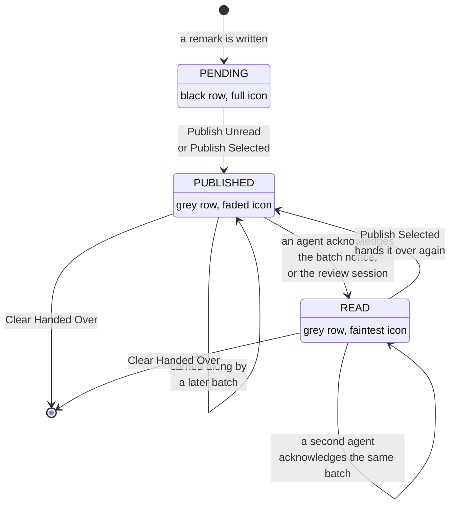
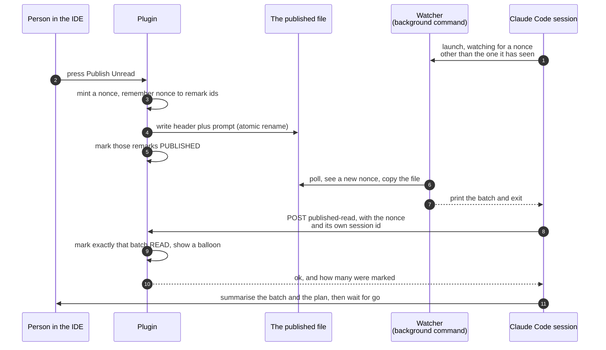

# Phase 10: one file, one acknowledgement, one watcher

A specification. It says what phase 10 is, why each decision was made, and what it costs. It does
not break the work into tasks. A separate planning pass does that.

## Contents

1. [What phase 10 is, and the problem it solves](#1-what-phase-10-is-and-the-problem-it-solves)
2. [What is true today](#2-what-is-true-today)
3. [The shape of the change](#3-the-shape-of-the-change)
4. [The merged published file](#4-the-merged-published-file)
5. [Change one: Publish Unread](#5-change-one-publish-unread)
6. [Change two: one file, replacing two](#6-change-two-one-file-replacing-two)
7. [Change three: an acknowledgement from the published path](#7-change-three-an-acknowledgement-from-the-published-path)
8. [Change four: the banner is information plus Reject](#8-change-four-the-banner-is-information-plus-reject)
9. [Change five: one watcher, shared by both modes](#9-change-five-one-watcher-shared-by-both-modes)
10. [Change six: listen mode in the skill](#10-change-six-listen-mode-in-the-skill)
11. [What breaks, relaxes or disappears, by file](#11-what-breaks-relaxes-or-disappears-by-file)
12. [What READ now means, and every place that says the old thing](#12-what-read-now-means-and-every-place-that-says-the-old-thing)
13. [Alternatives that were weighed and rejected](#13-alternatives-that-were-weighed-and-rejected)
14. [Risks, and how likely each one is to matter](#14-risks-and-how-likely-each-one-is-to-matter)
15. [What needs a hand check](#15-what-needs-a-hand-check)
16. [Open questions](#16-open-questions)
17. [Out of scope, and what it would take later](#17-out-of-scope-and-what-it-would-take-later)

## 1. What phase 10 is, and the problem it solves

Phase 9 gave a remark three states and gave publishing a file of its own. Phase 10 makes that file
the whole story.

The problem, in the order it bites. Sasha mostly does not start reviews. He writes remarks, presses
Publish, and tells a Claude Code session to read the published file. Three things then go wrong.

- Nothing ever marks those remarks read. `READ` can only come from a review acknowledgement today,
  so a remark handed over on the published path stays grey and published forever.
- Because nothing reaches `READ`, "Publish All Pending" is the only sensible filter. That in turn
  means a second publish carries only the new remarks, and the file loses the first batch.
- There are two different handover files with two different lifetimes: the stable published file per
  project, and a temporary directory minted for each review. Two files mean two readers, two
  formats, and a path handed back over HTTP that means nothing on another machine.

Phase 10 is six changes that are one feature: **one file per project, named by a batch, that either
front door writes and either front door can acknowledge.** A publish answers a waiting review. A
listening session wakes when a new batch lands. An acknowledgement carries the batch name back, and
that is what finally moves remarks to `READ`.

Listening is the new way to consume remarks, not the only one. A session can still be told to read
the file once and act, and that stays the common case. See
[change six](#10-change-six-listen-mode-in-the-skill) for the three ways and for the rule that keeps
listening from starting on its own.

Nothing about the plugin's core promise changes. Remarks still live in IDE-side state only. No
remark is ever written into a source file, and nothing remark-related enters version control.

## 2. What is true today

Read from the code on branch `claude-remarks-phase1-2`, version 0.6.0, working tree clean.

**The published file.** `review/PublishedRemarks.kt:52` writes one file per project under
`handshakeDir()`, which is `~/.claude-remarks/` (`review/ReviewHandshake.kt:83`). The name is
`publishedName(realPath)` at `review/PublishedRemarks.kt:26`, the first 16 hex characters of the
sha256 of `projectIdentity`'s answer, plus `.md`. The header is built by `publishedHeader` at
`review/PublishedRemarks.kt:38` and has four lines: the marker `<!-- claude-remarks: published -->`,
`published:`, `commit:`, `remarks:`. The file is overwritten on every publish.

**The publish pipeline.** `action/PublishRemarks.kt:91`, `publishRemarks(project, ids)`. `prepare`
at line 203 filters `status == RemarkStatus.PENDING` when `ids` is null. The EDT callback does the
clipboard, then the file, then `markRemarksPublished`, then one balloon. The published file's write
failure is reported inside the same balloon and does not stop the marking.

**The review's own file.** `WaitingReviewState.outputPath` (`review/WaitingReview.kt:44`) is a fresh
`Files.createTempDirectory("claude-remarks-review-")`, created inside `start` at line 194 through
the supplier `startOrConflict` takes at line 83. `handoffFile(outputDir)`
(`review/ReviewRestService.kt:42`) names `remarks.md` inside it. The `start` response hands that
path back as `output` at line 254.

**The review's acknowledgement.** `POST /api/claude-remarks/ack` reaches `handleAck`
(`review/ReviewRestService.kt:269`), which calls `finishReview` in `review/SendReview.kt:164`.
`reportReviewEnd` at line 200 is the only production caller of `markRemarksRead`.

**Guard 5 and guard 6.** Guard 5 (`CLAUDE.md:275`) greps `review/ReviewRestService.kt` for
`invokeAndWait`, `projectRoot(`, `FileEditorManager`, `VfsUtil` and `SwingUtilities`. Guard 6
(`CLAUDE.md:304`) allows `markRemarksRead(` only in `store/RemarkEdits.kt` and
`review/SendReview.kt`.

**Two corrections to the brief, both small.**

- The brief says the banner carries a "Send to Claude Code" control. There are two send controls,
  not one. The banner's link is labelled **"Send remarks"**
  (`ui/RemarksToolWindowFactory.kt:115`). The toolbar button labelled **"Send to Claude Code"** is a
  separate control (`ui/RemarksToolWindowFactory.kt:468`). There is also a third entry point, the
  Tools menu action `ClaudeRemarks.SendToWaiting`, registered in `plugin.xml:70` against
  `review/SendReview.kt`'s `SendReviewAction`. All three call the same `sendToWaitingReview`. Phase
  10 removes all three, see [change four](#8-change-four-the-banner-is-information-plus-reject).
- The brief says phase 7's guards "refuse a second send and refuse an overwrite after a send". Both
  live in `review/SendReview.kt`, not in `review/WaitingReview.kt`. The second-send refusal is at
  line 33, inside `sendToWaitingReview`. The overwrite refusal is at line 134, inside
  `rejectWaitingReview`. `review/WaitingReview.kt`'s `markSent` at line 237 has no such guard: it
  copies the phase whatever the phase already was, so the service already allows a second stamp. The
  refusals are both in the action layer.

One more fact that decides a security argument later. `~/.claude-remarks/` is created with
`rwx------` and every file in it with `rw-------` (`review/PublishedRemarks.kt:53` and
`review/ReviewHandshake.kt:139`). It is not a shared directory. That is why a predictable name is
safe there, while a predictable name under `java.io.tmpdir` is not.

## 3. The shape of the change

The three states, and every edge that moves a remark between them after phase 10.



There is deliberately no edge from `PENDING` straight to `READ`. An acknowledgement names a batch,
and every remark in a batch was marked published by the same publish that wrote the batch.

The sequence, with both front doors on one file.



## 4. The merged published file

One file per project, at the path phase 9 already uses:
`~/.claude-remarks/<first 16 hex of sha256 of projectIdentity>.md`. The name does not change. The
marker on line 1 does not change. The header grows.

```
<!-- claude-remarks: published -->
nonce: 1f6f2b0a-4a1d-4f8e-9a55-1c0d7f2b3e44
published: 2026-08-04 14:03
commit: a1b2c3d4
remarks: 7
review: 0f0a2c31-77b1-4b2d-8b6e-2a9c5f0d1e77
label: the auth refactor, first pass
rejected: no

<!-- the rendered prompt starts here, exactly what the clipboard gets -->
```

Line 1 to line 8 are the header, always eight lines, always in this order. Line 9 is blank. The
prompt starts on line 10.

Why each field is there.

- **`<!-- claude-remarks: published -->`** stays line 1 and stays word for word. It tells this file
  from anything else before a model reads a byte of it. It is a wire format shared with the skill.
- **`nonce`** names this batch. It is what an acknowledgement carries back, and it is what a watcher
  compares to decide "is this new". A fresh `UUID.randomUUID().toString()` per write. Random, not a
  counter: a counter would restart at 1 after an IDE restart and collide with a nonce still sitting
  in the file on disk.
- **`published`** says how old this is. Unchanged from phase 9, and the reason is unchanged: nothing
  on this path confirms a read, so a file found on disk has to say when it was written.
- **`commit`** says which revision the remarks describe, cut to eight characters, `none` when there
  is no repository. Unchanged from phase 9. The skill compares it against the current HEAD and warns
  when they differ.
- **`remarks`** is the count. It lets a reader see at a glance that a truncated read is truncated.
- **`review`** is the session id of the review this publish answers, or `none`. Two readers need it.
  The review mode's wait uses it to be sure the batch on disk answers its own review and not a
  publish that happened before it started. A listening session uses it to say "this batch answers a
  review started by another session" rather than treating it as a free publish.
- **`label`** is the label that review declared, or `none`. It tells a session that did not start
  the review what the person was asked to look at.
- **`rejected`** is `yes` or `no`. A rejection is now written into this same file, so the file needs
  a field that says the body is a refusal rather than remarks.

**Every field is always written, `none` when there is nothing to say.** That is what keeps the line
numbers fixed forever, and fixed line numbers are what let the skill read the header by line number
instead of grepping for it. Grepping is not safe here: a remark's own text can start a line with
`commit:` or with an HTML comment, and the skill already learned that lesson once, in the rejection
check that used to be a `grep -q` with a `^` anchor.

**The label has to be sanitized before it is written.** It arrives over HTTP from the skill, and a
label carrying a newline would split the header and move every line after it. The rule: replace
every character below U+0020 with a space, then cut to 120 characters, the same 120 the banner
already cuts to at `ui/RemarksToolWindowFactory.kt:214`.

**The rejection body.** After the header, the same sentences `REJECTION_BODY` carries today, with
its own first line marker removed. The header's `rejected: yes` is the one signal, and `remarks: 0`
is the count. Two signals for one fact drift apart, so there is only one.

**Why merging the two files is safe now, and was not before.** With one file, a second publish
overwrites a batch that may not have been read yet. The remarks in it are not lost: they are still
in the store, still shown grey in the tree, and the next Publish Unread carries every one of them
again, because they are not `READ`. Before change one that was not true. Publish All Pending
collected only `PENDING` remarks, so a batch that was overwritten before anyone read it could only
be recovered by selecting those exact rows by hand and pressing Publish Selected. The store has
always been the durable tier. Change one is what makes the store's copy reachable again by pressing
one button.

**Why a predictable path is now safe, when phase 6 refused one.** Phase 6 minted a fresh temporary
directory for each review, because a predictable name under `java.io.tmpdir` can be pre-created as a
symlink by another local user, pointing the plugin's write somewhere that user chose. That argument
does not apply to `~/.claude-remarks/`. The directory is created `rwx------`, so no other user can
create anything inside it, and `atomicWriteString` writes its temporary file inside that same
directory. So the whole `mktemp` reasoning goes, including the response field that had to hand the
path back.

## 5. Change one: Publish Unread

**The decision.** Publish All Pending becomes **Publish Unread**, and it collects every remark whose
status is not `READ`, which is `PENDING` and `PUBLISHED` together. Publish Selected is unchanged: it
uses the ids it was given, whatever their status.

**The reason.** A control's meaning must not depend on state the person cannot see. "Pending" is
such a state: after one publish, remarks look grey in the tree, and pressing Publish All Pending
again then quietly produces a file holding only what was written since. That is the same property
phase 9 bought when it renamed Copy to Publish. "Unread" is a word about the file's reader, and the
person can see it: a row says "published" or "read" at its end.

"Outstanding" was rejected as a name. The word means both "excellent" and "not yet dealt with", and
a button label has no room to say which one.

**The coupling that must be stated.** On its own this change makes every publish bigger than the
last, because nothing except a review acknowledgement produces `READ` today. It only works together
with [change three](#7-change-three-an-acknowledgement-from-the-published-path). The two must ship
together.

**What it touches.** The filter in `prepare` (`action/PublishRemarks.kt:206`), the toolbar button's
label and its enablement (`ui/RemarksToolWindowFactory.kt:451`), and the Tools menu action's own
enablement and text (`action/PublishRemarks.kt:295`, `plugin.xml:62`). The action id
`ClaudeRemarks.CopyAll` does not change. README promises it will not be renamed and `ActionIdsTest`
pins it.

## 6. Change two: one file, replacing two

**The decision.** There is one handover file per project: the published file. Publish Unread writes
it, Publish Selected writes it, and a rejection writes it. The review's temporary directory, the
`handoffFile` inside it, the `output` field in the start response, and the remembered path of the
most recently ended review all go.

**What each removal costs and buys.**

- `WaitingReviewState.outputPath` goes. `startOrConflict` loses its supplier parameter, and with it
  the whole argument about creating a directory only on the accepting branch. `start` then does no
  filesystem work at all, so it can no longer throw `IOException`, so the `failed` status the start
  action can answer becomes unreachable and is removed with it.
- `endedOutputPath`, the private `EndedReview` record and the `lastEnded` field
  (`review/WaitingReview.kt:113`, `153`, `163`) go. They existed so a fetch could still reach a
  rejection after the review was cleared. With one stable file there is nothing to remember: the
  file is still there, and its header says whose review it answered.
- `handoffFile` and `readHandoff` in `review/ReviewRestService.kt` are replaced by one read of the
  published file, with the same size cap. `MAX_HANDOFF_BYTES` becomes `MAX_PUBLISHED_BYTES`, still
  1 MiB, still refusing rather than truncating.

**How fetch decides what to answer.** `POST /api/claude-remarks/fetch` still takes `{session,
project}` and still changes nothing. Its rule becomes:

1. A live review for this session, still in the `Waiting` phase, means nothing has been published
   for it yet: answer `waiting`.
2. Otherwise read the published file. Over the size cap, answer `too-large`. Absent, answer
   `no-review`.
3. Parse the header. If `review:` equals the requested session, answer `ready` with the whole
   content, plus `nonce` and `bytes`. This covers a rejection too, and the skill reads
   `rejected: yes` out of the header it was handed.
4. Otherwise answer `no-review`. The file exists but it answers somebody else's review, or no
   review at all.

Parsing the header needs a pure function next to the one that writes it: `publishedHeaderOf(text)`
in `review/PublishedRemarks.kt`, returning the eight fields or null when the first line is not the
marker. Pure Kotlin, so its tests need no fixture, the same shape `renderHandshake` and
`publishedHeader` already have.

Reading a file inside `execute` is already allowed and stays allowed: it is plain `java.nio`, the
same reason `readHandoff` and `toRealPath()` are fine there today. Guard 5 is unaffected, and its
grep does not change.

**Where the write happens.** `writePublished` stays the one write, and `rejectWaitingReview` now
calls it instead of writing to a review directory. That means the reject path needs the project's
identity, so it calls `projectIdentity(project)` on the EDT. That is a `toRealPath` plus the walk up
the tree for `.git`, the same cost `addRemark` already pays on the EDT once per remark. When it
answers null, nothing is written and the balloon says the rejection could not be written and the
session will wait for its own deadline.

## 7. Change three: an acknowledgement from the published path

**The decision.** A fourth endpoint action, `POST /api/claude-remarks/published-read`, taking
`{project, nonce, session}`. It marks exactly the remarks in that batch `READ`.

`session` is a value the calling session invents once for itself, with `uuidgen`, the same way review
mode already invents one. The endpoint never handed it out and never checks it against anything. It
is a name to report back, and reporting it is what lets a second session say *who* got there first
instead of only *that* somebody did. Missing or blank is `bad-request`.

**Why the nonce and not a list of remark ids.** Two reasons, both of them properties the id list
would not have. Nothing identifying a remark then crosses the wire, so a session that read the file
cannot name a remark it never saw. And a batch published after the agent read the file cannot be
marked by a late acknowledgement: the nonce it carries names the batch it actually read.

**The plugin remembers the last sixteen batches, not only the newest.** A new project-level service
holds a bounded list of batches: the nonce, the remark ids, when it was written, and, once it has
been acknowledged, which session did that and when. Sixteen is the size. A late acknowledgement is at
most a few publishes behind, and keeping every batch of a long IDE session would grow without a
bound.

The record is kept after it is acknowledged rather than removed, because that is what lets a second
session get a clear answer instead of an error. See below.

**What it answers.** `ok` with `remarks: N` for a batch that was found and not yet acknowledged.
`already-read` for a batch that was already acknowledged, carrying `remarks: N`, the `session` that
acknowledged it and the time it happened. `unknown-batch` when no remembered batch carries that
nonce, which is what an acknowledgement after an IDE restart gets, and what a nonce from a batch
older than the sixteen remembered gets. Plus the two answers every action shares, `unknown-project`
and `bad-request`.

**`already-read` means one of two very different things, and the session id is what tells them
apart.** If the session named in the answer is the caller's own, this is a retry of an acknowledgement
whose response was lost. Nothing is wrong, and the session carries on. If it is a different session,
two sessions read one batch, which is an anomaly. See the rules in
[change six](#10-change-six-listen-mode-in-the-skill) for what the second session must then do.

The session id crosses the wire and nothing else. It never reaches a balloon, a banner or any other
place in the IDE that draws caller-supplied text, so the escaping question the header's `label` has
does not arise here. The JSON writer escapes what goes into the response.

**Where the consequence lives, and why not in the endpoint.** Guard 5 forbids
`review/ReviewRestService.kt` from touching the VFS, Swing or `invokeAndWait`. Phase 7 solved this
for `ack` by putting the consequences in `review/SendReview.kt`, and the endpoint only turns an
outcome into a status field. Phase 10 does the same thing one file over: a new file
**`review/PublishedAck.kt`** holds the batch service and the one entry point the endpoint calls.
That entry point marks the remarks and shows the balloon inside `ApplicationManager`'s
`invokeLater`, exactly the way `reportLater` in `review/SendReview.kt:185` does, because the
endpoint runs on a netty IO thread.

It is a new file rather than more code in `review/SendReview.kt` because the two paths have nothing
in common but the word acknowledgement. `SendReview.kt` is about a waiting review's session, its
phase and its deadline. `PublishedAck.kt` is about a batch that exists whether or not any review
does.

**The ordering that makes a fast acknowledgement safe.** In the publish's EDT callback the order is:
mint the nonce, record the batch, write the file, mark the remarks published, show the balloon.
Recording before writing is what stops an agent that reads the file within milliseconds from being
answered `unknown-batch`. Marking published before the acknowledgement can land is guaranteed by the
EDT itself: the acknowledgement's own store change is queued with `invokeLater`, so it cannot run
inside the callback that is still publishing. Without that, an acknowledgement could set `READ` and
`markRemarksPublished` could immediately move the same remarks back to `PUBLISHED`.

**Guard 6 widens by one caller, on purpose.** The allowed list becomes `store/RemarkEdits.kt`,
`review/SendReview.kt` and `review/PublishedAck.kt`, and the grep gains one `grep -v`. The reason has
to be written into `CLAUDE.md` beside the guard: there are now two acknowledgement routes, one keyed
to a review session and one keyed to a batch nonce. Both are things the IDE minted and handed out,
and both mean an agent said it read the remarks. A publish is still not one of them, however many
times it runs.

**What listening costs a session that only watches.** Watching needs no contact with the IDE at all,
because it only reads a file. Acknowledging does: the endpoint needs the token, and the token is in
the handshake file. So a listening session reads the handshake file when it wants to acknowledge,
and when there is no handshake file it says plainly that it read the batch but could not tell the
IDE, and that the remarks stay marked published.

## 8. Change four: the banner is information plus Reject

**The decision.** The banner keeps its text and its Reject link. Its "Send remarks" link goes, the
toolbar's "Send to Claude Code" button goes, and the Tools menu action `ClaudeRemarks.SendToWaiting`
goes with them. Pressing Publish is how a person answers a review. `sendToWaitingReview`, `canSend`
and `SendReviewAction` in `review/SendReview.kt` all go.

Removing the Tools menu action is allowed: `README.md` promises three ids will not be renamed, and
`ClaudeRemarks.SendToWaiting` is not one of them. `ActionIdsTest` does not pin it either.

**The gain.** You choose what to answer with. Publish Selected can answer a review with three
remarks and keep the rest. Today the only answer is everything pending.

**The one step publish gains.** When a review is waiting at publish time, the publish stamps the
review's session id and label into the header and calls `markSent(session, ids)`, so the review's
own `ack read` still knows what to mark. Everything else about publish is unchanged.

**Which phase 7 guards go, and which stay.**

- *The refusal of a second send* (`review/SendReview.kt:33`, "Already sent. Waiting for Claude Code
  to read them.") goes with the function that holds it. Adding a remark and publishing again becomes
  an ordinary thing to do. The second publish writes a new nonce, `markSent` replaces the recorded
  ids, and the waiting session simply wakes again.
- *The refusal to overwrite after a send* (`review/SendReview.kt:134`, Reject in the `Sent` phase)
  **stays**, in a slightly different form. After a publish has answered the review, Reject writes
  nothing and only clears the banner and says the remarks were already published. The old reason was
  that overwriting destroys remarks the agent may not have read. That reason is weaker now, since
  the remarks are still in the store. The reason it stays is different: a rejection written over the
  newest batch takes that batch away from any session that has not read it yet, and pressing Reject
  after publishing does not clearly mean "take it back".
- *`markSent` returning false when there is no review left to stamp*
  (`review/WaitingReview.kt:237`) stays. The gap it covers is unchanged: the write cannot happen
  inside the service's lock, so the deadline task can still end the review in between.
- *`acknowledge`'s `NOT_SENT` branch* (`review/WaitingReview.kt:262`) stays. A `read`
  acknowledgement for a review nothing was ever published into is still a bug on one of the two
  sides.

**The cost, and it must not be waved away.** The Send button is the only thing on screen today that
tells a person how to reply. A passive banner means the banner text has to carry that, and weak
wording makes the whole feature invisible.

Proposed wording for the waiting phase, with the fixed instruction first, so a long label cannot
push it out of the visible width:

> Claude Code is waiting. Press Publish Unread to answer, or Publish Selected for some of them.
> Reviewing: *&lt;label&gt;*

And for the phase after a publish has answered it:

> Published 7 remarks for Claude Code. Waiting for it to read them. Publish again to add more.

The last sentence is deliberate. It is where a person learns that a second publish is normal rather
than an error, which is exactly what change four makes true. See
[open questions](#16-open-questions): the wording is a recommendation, not a settled decision, and
it is one of the things that has to be looked at in a running IDE.

## 9. Change five: one watcher, shared by both modes

Both skill modes end in "wait for something, then read it". Phase 10 extracts one primitive.

**The decision.** One shell program that blocks until its event happens, prints the batch, and
exits. It lives as a real script beside the skill,
`docs/skill/claude-remarks-review/watch-remarks.sh`, executable, and the skill launches it as a
**background** Bash command.

**The mechanic that decides everything else about it.** A foreground Bash call is capped at ten
minutes. A background command has no such cap, keeps running across turns, and re-invokes the
session when it **exits**. So the watcher must exit on its event and must never loop forever. A
background command that never exits never notifies, and the session waits for a signal that cannot
arrive. That exact mistake has already stalled an agent in this project.

Two things follow from that, and both are requirements, not advice.

- **Every run has a deadline and always ends.** On the deadline the watcher prints a plain sentence
  and exits. There is no path through the script that loops without a bound.
- **It is a script file, not a block of shell copied into a call.** Decided, not proposed. A
  background command is one launch line. A block that the agent retypes per call is a block the agent
  can quietly reword, and the one wording that matters is the loop that has to terminate. The cost is
  that the skill is no longer one file: `SKILL.md` documents the script's arguments, its output and
  its exit codes, and the script has to be committed executable and stay in step with that
  documentation.

**What it does.**

- Local mode: poll the published file every 2 seconds. This is a `stat` and a few `sed` reads of a
  local file. It talks to nothing.
- Remote review mode: poll `POST /api/claude-remarks/fetch` every 5 seconds, which is the existing
  `handoff_ready()` logic moved out of `SKILL.md`. Five seconds and not one, because the built-in
  server allows 30 requests a minute from one address, and a `429` means wait longer rather than
  stop.

**Arguments.** The file to watch, or the base URL plus the session and the project for the remote
case. The nonce already seen, which may be empty. Optionally the review session the batch must name.
The deadline in seconds. The poll interval.

**The token is never an argument.** It goes in an environment variable. An argument is visible to
every process on the machine through `ps`, and the token is the only gate on the endpoint.

**Output and exit codes.** On success it prints the whole file, header included, and exits 0. On the
deadline it prints one sentence and exits 1. On anything wrong it prints why and exits 2. That
covers a file it cannot read, a header that does not parse, an HTTP status it cannot use, and a batch
over the size cap.
The session reads the printed text; the exit code is there so a wrapper can tell the three apart.

**The copy that closes a race.** The watcher sees a new nonce and then reads the file. A third
publish landing in between would make it print one batch while reporting another batch's nonce, and
the acknowledgement would then name a batch nobody read. So the watcher copies the file once and
reads the nonce out of the copy. `cp` opens an inode, and a rename does not truncate the inode it
replaces, so the copy is always one whole batch, old or new.

**The deadline, and the overnight question.** Review mode uses the deadline the `start` request
declared, which is 1800 seconds by default. Listen mode uses **twelve hours**.

The question that produced that number was whether a watcher sitting overnight is a problem. It is
not, for the machine: a process that stats one local file every two seconds costs nothing
measurable, and in local mode it talks to no service at all. What the deadline protects is the
person, and it does so in three ways. A watcher holds a background slot in the session that launched
it. A timeout wakes that session with "nothing arrived", at whatever hour the timeout falls. And
listening repeatedly without ending anything accumulates watchers that each fire on their own
schedule. Twelve hours is chosen so that a normal working day never ends in a wake-up, and so that a
watcher started and forgotten is gone by the next one.

The two rules that follow matter more than the number.

**Who kills an orphaned watcher.** Four rules together.

1. The script always has a deadline and always exits, so the worst orphan is a poll loop that ends
   by itself. There is no unbounded process to hunt for.
2. **Starting a watch kills any watcher already running for that project.** The script writes a pid
   file when it starts, named from the project identity the same way the published file is:
   `~/.claude-remarks/<the same 16 hex characters>.watch`. It creates that directory `rwx------` if
   the plugin has never run on this machine. On start it reads the pid file, checks the process
   really is a watcher for this project rather than a recycled pid, kills it, and writes its own
   pid. One watcher per project on the machine, whichever session started it. This is what stops
   a person who asks to listen three times from getting three wake-ups.
3. The session that launched it also remembers its own background shell, and kills it when the
   person says to stop listening. The pid file covers watchers from other sessions; this covers the
   ordinary case inside one session.
4. If the Claude Code process dies, the child can outlive it until the deadline. In local mode that
   costs a sleep loop and nothing else, which is the strongest argument for polling a file rather
   than polling the endpoint.

**How a person stops listening without stopping the session.** There is an explicit way, and the
skill documents it in the same breath as starting: the person says stop, and the session kills the
background shell it remembers and says it has stopped. The session prints, when it starts listening,
what it is watching, what the deadline is, and how to stop it. A person who cannot see how to stop
something will end the whole session instead, which is the outcome this rule exists to avoid.

**Review mode becomes the primitive plus a preamble.** The preamble is what it already is: work out
the file list, `POST /start`, check the HTTP status and the answer. That is what puts the banner on
screen, opens the files as a diff, and declares the deadline the IDE will enforce. Then the wait is
the watcher, launched with the nonce that was on disk before the review started and with the review
session it must match.

**The declared deadline becomes honest.** Today `SKILL.md` sets `deadline_seconds=1800` and its own
error text names 1800, while a foreground wait is killed at 600. The number in the message never
happened. With the wait in a background command there is no ten minute cap, so the IDE's clock and
the skill's clock finally agree on the same 1800.

**The abandon signal moves off the trap.** Today the wait loop lives in the same shell as
`trap 'ack abandoned' EXIT`. A background watcher makes that impossible: the foreground call returns
at once, and its EXIT trap would abandon the review immediately. So there is no trap. The session
posts `ack abandoned` itself, in the foreground, when the watcher reports its deadline passed or
when the person says stop. A session that is killed outright sends nothing, and the IDE's own
scheduled deadline is what covers that, which is what it was built for in phase 7. What is given up:
a killed session leaves the banner up until the deadline instead of clearing it at once. That was
already true for a session killed between two Bash calls.

## 10. Change six: listen mode in the skill

**Three ways a session gets remarks, and when each one is right.** Listen mode is the third of them,
not a replacement for the other two, and this is the frame the rest of this section sits in.

- **One-shot read.** The person tells a session to read the published file now. It reads the file,
  takes the nonce out of the header, acknowledges it, acts on the remarks, and that is the end of it.
  No watcher, no background command, nothing left running. This is what happens most of the time, and
  it is how a session that is not listening still consumes remarks. Acknowledging comes before
  acting, for the same reason it does in listen mode: `READ` means an agent read them, not that the
  work is finished.
- **Listen.** The session watches for the next batch and wakes when it lands. See the rest of this
  section.
- **Review.** The session asks for remarks about named files. That is what puts the banner on screen,
  opens the files as a diff, and gives the IDE a deadline to enforce.

**Listening is always opt-in, per session, and never starts on its own.** This is a rule, not a
preference. Sasha often has several sessions working on one project at the same time. A session that
starts listening because it noticed a published file, or because it saw a review waiting, or because
listening seemed helpful, will take the next batch that lands, and that batch was probably meant for
one of the other sessions. So: a session starts listening only when it is asked to, in words, and it
says so when it starts. Nothing about the skill's own description, and nothing in either of the other
two ways above, may lead a session into listening by itself.

**The decision.** A third thing the skill can do: watch the published file's nonce, wake when a new
batch lands, read it, acknowledge it, then **summarise the batch and what it plans to do, and wait
for Sasha to say go.** It does not act unattended.

**The reason.** A loop that acts on whatever arrives will act on whatever arrives, in a loop,
possibly while nobody is watching. The summary is the gate, and it is cheap: the session has already
read the remarks by the time it writes it.

**The rules, each stated because each one is a way this could go wrong.**

- **Listen mode never starts a review.** It never posts to `/start`. The only request it ever sends
  is `published-read`, and only after it has read a batch.
- **A batch that answers somebody else's review is the same anomaly, and is treated the same way.**
  The header's `review:` field names a session, and it is not this one. Those remarks were written as
  an answer to a request another session made, and it is waiting for them right now. So the listening
  session **says at the top of its answer that this batch answers a review started by another
  session, does not act on the remarks, and does not acknowledge them.** Leaving the acknowledgement
  alone is what leaves the review alone: the review's own `ack read` is what should mark those
  remarks, and it will. This session never posts to `/ack` under any circumstances, because `/ack`
  belongs to the session that started the review.

  The first draft of this spec had the listening session acknowledge such a batch, on the argument
  that it really had read it. That argument is true and beside the point. Two sessions receiving one
  set of remarks is the thing to avoid, and an acknowledgement from the wrong one hides it.
- **Two sessions receiving one batch is an anomaly, and the second one says so loudly.** The first
  acknowledgement gets `ok`. The second gets `already-read` naming a session that is not its own, and
  that means two sessions read remarks meant for one. Almost every time, something upstream is wrong:
  two listeners were started on one project, or a session started listening without being asked. So
  the second session **stops, says at the top of its answer that another session already received
  this batch, names that session, and does not act on the remarks.** It does not quietly report the
  answer and carry on. Only the person can say which session should do the work.
  The opt-in rule above is what prevents this in the first place. This rule is the backstop for when
  it happens anyway. The one case that is not an anomaly is `already-read` naming the session's own
  id, which is a retry after a lost response.
- **At the start of listening, an existing batch is described, never acted on.** If the file already
  holds a batch, the session says what is in it and offers to read it, then watches from that nonce.
  Waking on something written before anyone asked for a listener is exactly the surprise this mode
  must not produce.
- **A rejection batch is reported and not acknowledged.** `rejected: yes` means zero remarks and a
  refusal aimed at a review session. There is nothing to mark read.
- **No handshake file means it can watch but not acknowledge.** It says that plainly rather than
  failing.
- **After a batch is handled, re-arming is a choice, not a reflex.** The session may launch the
  watcher again with the new nonce as the one it has seen, and it says that it is doing so. It
  launches through the same script, so the pid file rule in
  [change five](#9-change-five-one-watcher-shared-by-both-modes) still holds: one watcher per project
  on the machine, and starting one kills the watcher that was there before.

**Where the acknowledgement sits in the order.** Read the file, acknowledge, then summarise. `READ`
means an agent read the remarks. It does not mean an agent finished the work.

## 11. What breaks, relaxes or disappears, by file

Production code.

- **`action/PublishRemarks.kt`** — the filter in `prepare` becomes "not `READ`". The EDT callback
  mints a nonce, records the batch, stamps a waiting review's session and label into the header, and
  calls `markSent`. `publishMessage` gains a case for "answered the waiting review". The Tools menu
  action's text and enablement change.
- **`review/PublishedRemarks.kt`** — `publishedHeader` grows the four new fields and the label
  sanitizing. A new pure `publishedHeaderOf(text)` reads a header back. `publishedName`,
  `writePublished` and `PUBLISHED_MARKER` are unchanged.
- **`review/PublishedAck.kt`** — new. The batch service and the acknowledgement's consequences.
- **`review/WaitingReview.kt`** — `WaitingReviewState.outputPath` goes. `startOrConflict` loses the
  supplier. `EndedReview`, `lastEnded` and `endedOutputPath` go. `markSent`, `acknowledge`,
  `expireIfStale`, `clear` and the scheduled expiry are unchanged.
- **`review/SendReview.kt`** — `sendToWaitingReview`, `canSend` and `SendReviewAction` go.
  `rejectWaitingReview` writes the published file instead of a review directory, and loses
  `REJECTED_MARKER` from the body. `finishReview`, `expireStaleReview` and `reportReviewEnd` are
  unchanged.
- **`review/ReviewRestService.kt`** — `handoffFile` and `readHandoff` go. `handleStart` loses the
  `output` field and the `failed` branch. `handleFetch` reads the published file and compares the
  header's `review:`. A new `handlePublishedRead`. `MAX_HANDOFF_BYTES` becomes
  `MAX_PUBLISHED_BYTES`. The class KDoc's list of actions and answers changes.
- **`ui/RemarksToolWindowFactory.kt`** — the banner loses its send link and gains its new wording.
  The toolbar loses "Send to Claude Code" and renames "Publish All Pending" to "Publish Unread",
  with the matching enablement.
- **`plugin.xml`** — the `ClaudeRemarks.SendToWaiting` action is removed. `ClaudeRemarks.CopyAll`
  keeps its id and gets new text.
- **`store/RemarkEdits.kt`, `store/RemarkStore.kt`, `model/RemarkState.kt`** — no behaviour change.
  Three KDoc paragraphs state the old, narrower meaning of `READ` and have to be corrected. See
  [section 12](#12-what-read-now-means-and-every-place-that-says-the-old-thing).

Tests that stop compiling or stop being true. Named so the planning pass can size the work, not to
prescribe new ones.

- `SendReviewTest` — every test that calls `sendToWaitingReview` has to be rewritten against
  `publishRemarks`, or moved. `testASecondSendWhileWaitingForTheAcknowledgementIsRefused` and
  `testCanSendIsTrueWhileWaitingAndFalseOnceTheRemarksAreSent` describe behaviour that no longer
  exists. `testRejectingAfterASendDoesNotOverwriteTheHandoffFile` stays, against the published file.
- `WaitingReviewServiceTest` — the four `endedOutputPath` tests go with the field.
- `ReviewEndpointSmokeTest` — the fetch tests change shape, the start test loses `output`, and the
  new action needs its own answers covered.
- `PublishedRemarksTest` — the header test grows, and the new header reader needs its own.
- `RemarksPanelTest` — anything asserting on the toolbar's button list or the banner's links.
- `PublishRemarksTest` — the filter change and the new balloon case.

Guards. Guard 6 widens by one file, with its reason written in. Guards 1, 2, 4 and 5 are untouched
and must stay passing. Guard 3 is untouched: the batch service holds no `RemarkStore` call, and the
acknowledgement goes through `markRemarksRead` in `store/RemarkEdits.kt` as before.

**No new platform API is needed.** The batch service is a project-level `@Service`, the
acknowledgement hops to the EDT with `invokeLater`, and the file work is plain `java.nio`. Every one
of those already exists in this codebase in the same shape. So nothing here owes a check against the
SDK checkout or a `javap` against the jars.

## 12. What READ now means, and every place that says the old thing

**The new meaning.** `READ` means an agent said it read the remarks. It no longer means "an agent
said so through the shared review session".

**The invariant that must survive intact, unchanged in strength:** only an agent's own
acknowledgement produces `READ`, never a publish, however many times it runs.

What changes is the number of acknowledgement routes, from one to two: the review's `ack read`,
keyed to a session the IDE handed out, and the published path's `published-read`, keyed to a batch
nonce the IDE minted. Both are answers to something the IDE created. Neither is a side effect of
handing remarks over.

Every place that states the narrower version, and every one of them has to be updated:

- `CLAUDE.md:116`, the phase 9 group one paragraph, "an agent said, through the shared review
  session, that it actually read the remarks".
- `CLAUDE.md:304`, guard 6 itself, both its allowed-callers list and its prose, "a remark reaches
  `READ` for one reason only".
- `docs/claude/design.md`, "The three states, and why published is not read", lines 1020 to 1027.
- `docs/claude/design.md`, "The published file", lines 1219 to 1227, the paragraph on how the skill
  reads it, and lines 1210 to 1217, "A waiting review is left alone", which change four reverses.
- `docs/claude/design.md`, "The store stays the durable tier", line 1670.
- `docs/claude/design.md`, "Three signals that the remarks arrived", lines 1723 to 1734.
- `docs/claude/design.md`, "Reaching an agent on another machine", line 1863, "the `read`
  acknowledgement is still the only thing that marks a remark sent".
- `docs/claude/design.md`, "The waiting review's output path is a directory", "The path is
  unpredictable, minted per review", and the supplier paragraph under "One waiting review per
  project". All three describe machinery that change two deletes.
- `README.md:21`, the phase 9 bullet, "Only a review's read acknowledgement produces `READ`".
- `README.md` lines 5, 9, 30, 41 to 44, 113 and 165: the button names, the Send to Claude Code
  paragraph, the id table's description of `ClaudeRemarks.CopyAll`, and the description of the
  `review/` package.
- `docs/ideas.md:1434`, "Only the review path can produce this."
- `model/RemarkState.kt:16`, `store/RemarkEdits.kt:117` and `store/RemarkStore.kt:117`, the three
  KDoc paragraphs.
- `docs/skill/claude-remarks-review/SKILL.md`, whole. Its front matter description, both existing
  modes, and the three "must not do" rules in the published mode, two of which change: this mode now
  does post to the endpoint, and it does read a token.

`docs/plans/completed/20260803-claude-remarks-phase9.md` also states the old meaning. It is a record
of how that phase happened and is not edited.

## 13. Alternatives that were weighed and rejected

**One acknowledgement mechanism instead of two.** The review's `ReviewPhase.Sent(ids)` could hold a
nonce instead of a list of ids, and then both front doors would acknowledge the same way, by nonce.
It is tidier on paper. It was rejected because it churns the most delicate file in the review path,
`review/WaitingReview.kt`, along with its balloon counts and most of `WaitingReviewServiceTest`, and
buys no behaviour at all: the review's phase and the batch record hold the same list for the same
publish. The duplication is one field. Phase 10 is already changing that file enough.

**A `status` endpoint action so listen mode can ask whether a review is waiting.** Rejected, because
the fact arrives on its own at the only moment it matters. A batch that answers a review carries the
review's session id in its header, and a listening session reads it there. Adding an action would
mean another request shape, another set of answers, and another thing the skill has to get right,
for information it is handed anyway.

**Keeping the batch memory across an IDE restart.** Rejected. It would mean a new persisted
component, its own `@get:XCollection` trap, and a migration, so that an acknowledgement arriving
after a restart could be honoured. The alternative costs one honest answer, `unknown-batch`, and the
person can publish again. `WaitingReviewService` made the same choice for the same reason and it has
held.

**Writing the rejection as a separate file, keeping the published file for remarks only.** Rejected,
because it is the two-file design again under a new name, and the reader would have to check two
paths and reason about which is newer.

## 14. Risks, and how likely each one is to matter

- **Publishes grow without bound when nothing ever acknowledges.** *Certain*, for a person who
  never lets any session acknowledge, whether by listening or by a one-shot read. Publish Unread
  carries every non-`READ` remark, so each file is bigger than the last until Clear Handed Over runs. The relief valves already exist: Clear Handed Over,
  and Publish Selected for a narrower batch. It should be said in `README.md` rather than discovered.
- **A background watcher written as an unbounded loop stalls the session.** *Certain* if it is
  written that way, and it has already happened once in this project. The deadline in the script is
  the guard, and it is the single most important line in change five.
- **A second publish overwrites a batch nobody has read yet.** *Likely*, since publishing often is
  the point of change four. The remarks are still in the store, and the next Publish Unread carries
  them again. The one case that does not recover by itself: two Publish Selected batches with
  different rows, where the first batch's rows are only recovered by a later Publish Unread or by
  selecting them again.
- **The skill and the plugin disagree about the header's line numbers during an upgrade.**
  *Likely*, exactly once, at the moment one side is updated and the other is not. The skill checks
  that line 2 starts with `nonce: ` and says "this plugin is older than this skill" rather than
  reading the wrong lines.
- **Two sessions receive one batch.** *Occasional*, and it is not a case to smooth over. It almost
  always means something upstream is wrong: two listeners on one project, a session that started
  listening without being asked, or a listener that woke on a batch answering another session's
  review. Three things sit between it and harm, in this order. Listening is
  opt-in, so there is normally only one listener. The `already-read` answer names the session that
  got there first, so the second one can tell an anomaly from a retry of its own request. And the
  second session stops and says so instead of acting.
- **A session starts listening without being asked.** *Likely*, if the skill's own description reads
  as an invitation, because a session that can watch will want to watch. It is the direct cause of
  the risk above. The guard is wording: the skill says in its description and in its rules that
  listening starts only when a person asks for it in words.
- **A rejection erases the last published batch from the file.** *Occasional*. Same recovery as the
  overwrite above.
- **An orphaned watcher outlives its session.** *Occasional*. Bounded by the deadline, and in local
  mode it touches nothing but a local file.
- **An acknowledgement after an IDE restart is answered `unknown-batch`.** *Occasional*. The remarks
  stay published and can be published again.
- **A label carrying a control character breaks the fixed-line header.** *Rare*, but it is
  caller-supplied text arriving over HTTP, so it is sanitized rather than trusted.
- **The watcher's pid file names a pid that now belongs to something else.** *Rare*. A machine has
  to recycle the pid between one watcher exiting and the next one starting. The script checks that
  the process really is a watcher for this project before it kills anything, so the failure is a
  watcher that is not killed rather than a process that should not have been.
- **The token leaks through `ps` if it is passed as a script argument.** *Rare*, because the spec
  forbids it, and *certain* if that rule is ignored. It is written into the script's own interface
  for that reason.
- **Guard 6 collects a fourth caller later because widening it once made it feel negotiable.**
  *Occasional*. The guard names its three files and says why each is there, the same way guard 3
  names the ways past itself instead of growing its pattern.

## 15. What needs a hand check

No automated test in this project reaches any of these. Every one needs a sandbox IDE, and several
need a real Claude Code session beside it.

- The banner's new wording fits the tool window at an ordinary width, with a 120 character label.
- Pressing Publish Unread while a review is waiting really stamps the review, and the waiting session
  really wakes on that batch.
- Pressing Publish a second time while the same review is waiting is accepted and wakes the session
  again.
- A background watcher really re-invokes the session when it exits. This is a Claude Code mechanic,
  not plugin behaviour, and it is the assumption the whole of change five rests on.
- Listen mode end to end: the session waits, the person publishes, the session wakes, reads,
  acknowledges, and the tree row turns from "published" to "read".
- Two listening sessions on one project: the first gets `ok`, the second gets `already-read`, and
  both report it plainly.
- Reject writes the merged file, and the review session reports the rejection rather than treating
  the body as remarks.
- A publish whose file write fails still marks the remarks published and says in the balloon that
  the file was not updated.
- The remote review path over an SSH tunnel still works against the merged file. This one needs a
  second machine.

**The plugin has now run in a real IDE, for the first time.** Against version 0.6.0, while this
spec was being reviewed: a review started over the endpoint, the waiting banner appeared, the file
the request named was opened, remarks were written including sub-line ones with their `⟦` and `⟧`
markers, Send to Claude Code handed them over, and the `read` acknowledgement came back. That closes
the gating hand check phases 6 to 9 all owed, the one that asked whether any of this works outside
the tests at all. `CLAUDE.md` says none of it has been seen running, and that sentence is now wrong.

It closes that one check and no others. Still owed by hand, and still owed after phase 10: the
markdown preview entry point from phase 9, the drag onto a bucket, phase 7's scheduled deadline and
its diff over changed files, phase 9's gutter and tree appearance, and the whole remote path over a
tunnel, which needs a second machine. The lists are in `CLAUDE.md`, in section 13 of the phase 8 plan
and in section 12 of the phase 9 plan. Phase 10 adds the checks above to what is left.

## 16. Open questions

- **The banner wording.** Section 8 proposes one. It is the weakest part of this spec, because the
  banner is now the only place a person learns how to answer a review, and the text has to fit a
  narrow panel next to a variable-length label. Two alternatives worth trying in front of a real
  IDE: "Claude Code is waiting: *&lt;label&gt;*. Publish to answer." and a two-line panel with the
  instruction on the second line. Decide by looking, not by argument.
- **How the person asks a session to listen.** The rule is settled: only when asked, in words. The
  wording that makes a session read that as a rule rather than as a suggestion is not, and it is the
  kind of thing that only shows itself in use. Watch for a session that starts listening off its own
  bat and tighten the skill's wording when it happens.

Four questions that were open in the first draft are now decided and have moved into the design: the
watcher lives in a script file beside `SKILL.md`, listen mode's deadline is twelve hours, the plugin
remembers sixteen batches, and `already-read` names the session that acknowledged first.

## 17. Out of scope, and what it would take later

- **Reading the published file from a session on another machine.** Out of scope for phase 10, and
  the direction it should be solved in is worth recording, because the obvious direction is the wrong
  one. Do not extend the tunnel and the poll. Phase 8's fetch is keyed to a review session, and a
  remote listening session has none, so the shape that suggests itself is a fetch keyed to the
  project plus a poll for a new nonce across the tunnel. That runs straight into the built-in
  server's 30 requests a minute from one address, which is what forced the remote review poll to
  five seconds already, and it puts one poll per remote session on top of that.

  Sasha's direction instead: a small push service on the machine the IDE runs on, which a remote
  session subscribes to, so a new batch is pushed once when it happens and nothing polls anything.
  Whoever designs this later should start from that shape. It is not designed here, and the
  questions it opens, what the service is, how a subscription is authenticated, and what happens to a
  subscriber that went away, are all open.
- **Asking a running session a question from the IDE**, the idea in `docs/ideas.md`. Unrelated to
  this phase.
- **A `Published` group in the tree**, designed in phase 9 and deliberately left unbuilt. Change one
  makes the grey rows matter more, so the condition recorded in `docs/ideas.md` for building it is
  worth re-reading after phase 10 has been used for a while. Not part of this phase.
