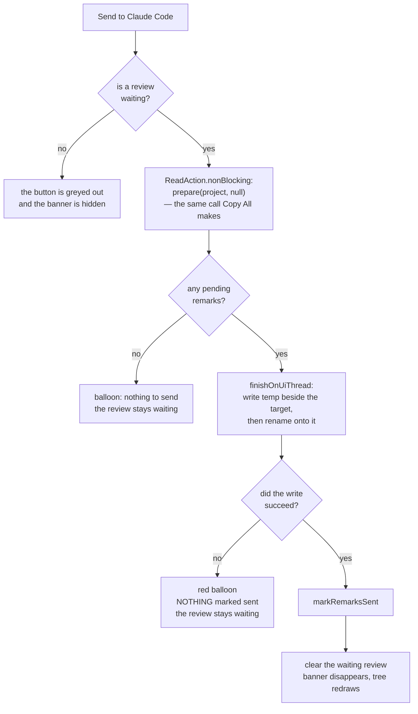
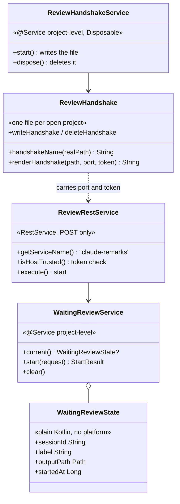

# Claude Remarks — Phase 6 Implementation Plan

**A review session shared between Claude Code and the IDE.**

**Status: not started.** Branch `claude-remarks-phase1-2`. Phase 6 starts only after phase 5 is
finished — see [What is true today](#1-what-is-true-today) for why that is not optional.

## Contents

1. [What is true today](#1-what-is-true-today)
2. [Platform facts checked against the 2025.2 jars](#2-platform-facts-checked-against-the-20252-jars)
3. [Still to verify](#3-still-to-verify)
4. [The shape of the change](#4-the-shape-of-the-change)
5. [The security question, settled](#5-the-security-question-settled)
6. [Scope judgement: what I would cut](#6-scope-judgement-what-i-would-cut)
7. [Decisions carried in, and the four I made](#7-decisions-carried-in-and-the-four-i-made)
8. [Rules that must hold at every step](#8-rules-that-must-hold-at-every-step)
9. [Ordering and parallel waves](#9-ordering-and-parallel-waves)
10. [Implementation steps](#10-implementation-steps)
    - [Task 1: Check the ground before building on it](#task-1-check-the-ground-before-building-on-it)
    - [Task 2: The handshake file](#task-2-the-handshake-file-so-a-skill-can-find-this-ide-and-this-project)
    - [Task 3: The atomic write, borrowed from revdiff](#task-3-the-atomic-write-borrowed-from-revdiff)
    - [Task 4: The waiting review, one per project](#task-4-the-waiting-review-one-per-project)
    - [Task 5: The endpoint](#task-5-the-endpoint)
    - [Task 6: Send the remarks to the waiting session](#task-6-send-the-remarks-to-the-waiting-session)
    - [Task 7: The banner that says who is waiting](#task-7-the-banner-that-says-who-is-waiting)
    - [Task 8: Open the files under review — the cheap version, and droppable](#task-8-open-the-files-under-review--the-cheap-version-and-droppable)
    - [Task 9: The Claude Code skill](#task-9-the-claude-code-skill)
    - [Task 10: Verify the constraints and the whole suite](#task-10-verify-the-constraints-and-the-whole-suite)
    - [Task 11: Update the design docs](#task-11-update-the-design-docs)
11. [Known limits](#11-known-limits)
12. [Hand checks in a sandbox IDE](#12-hand-checks-in-a-sandbox-ide)

## 1. What is true today

Read from the source on this branch, not assumed.

**Phase 5 is half built, and this plan assumes it is finished.** `git log` stops at `17e2be6`, which
is phase 5 task 7. Tasks 8 to 14 of `docs/plans/20260803-claude-remarks-phase5.md` are not done.
That includes task 10, the history file, which the phase 6 brief describes as "already the durable
tier". **It does not exist yet.** Phase 6 deliberately does not depend on it — see
[section 6](#6-scope-judgement-what-i-would-cut) — but task 1 below still checks that phase 5 has
landed before anything is built on top of it.

What phase 5 *has* landed is visible in the code: `store/RemarkEdits.kt:76` is `setRemarkSeverity`,
so tasks 1 to 7 of phase 5 are in.

**The whole prompt payload already exists, and it is one function call.**
`action/CopyRemarks.kt:118-135` is `internal fun prepare(project, ids): Prepared`. It resolves,
reads the files, renders the markdown, and returns `Prepared(markdown, ids, files)`. Phase 6 needs
the same three values with a different destination. Nothing about rendering changes.

**`prepare` must run inside a read action, off the EDT.** `action/CopyRemarks.kt:47-52` wraps it in
`ReadAction.nonBlocking { }.expireWith(project).coalesceBy(...)`. `render/PromptPayload.kt:87` says
`collectForPrompt` "must be called inside a read action, off the EDT" because it reads `Document`s.

**A file write must not go inside that read action.** `action/CopyRemarks.kt:58-62` says why: a
non-blocking read action is cancelled and re-run whenever a write action asks for the lock, so a
file write in there runs once per retry and leaves a stray file behind each time. The clipboard path
solves this by writing in `finishOnUiThread`. Phase 6 does the same.

**Marking remarks sent is one call, and it already publishes.** `store/RemarkEdits.kt:72-74` is
`markRemarksSent(project, ids)`. `action/CopyRemarks.kt:81` calls it only after the handover
succeeded, and a failed clipboard write marks nothing (`action/CopyRemarks.kt:63-80`). Phase 6 keeps
that rule exactly.

**`notifyRemarksChanged` publishes synchronously.** `store/RemarkEdits.kt:110-112` uses
`messageBus.syncPublisher`, so the listener runs on whichever thread called it. That matters in phase
6, because one caller will be a netty IO thread.

**The tool window panel puts one component in the centre and nothing anywhere else.**
`ui/RemarksToolWindowFactory.kt:97-98` is `setToolbar(buildToolbar().component)` then
`setContent(JBScrollPane(tree))`. `SimpleToolWindowPanel` uses a `BorderLayout` and `setContent`
takes the centre. There is no place for a banner today. Task 7 adds one by wrapping the scroll pane.

**The toolbar is built in code and every button greys itself out.**
`ui/RemarksToolWindowFactory.kt:274-285` is the `ToolbarAction` inner class: it takes an `enabled`
lambda and runs it in `update()` on `ActionUpdateThread.EDT`.
`ui/RemarksToolWindowFactory.kt:299-329` builds the five buttons. A sixth fits with no new
machinery.

**The panel already redraws itself on one topic.** `ui/RemarksToolWindowFactory.kt:95` subscribes to
`REMARKS_CHANGED` and calls `refresh()`. `refresh()` (`:103-123`) runs `resolveAll` off the EDT and
finishes on the EDT. Phase 6 reuses that one topic rather than adding a second.

**The project-level service pattern to copy is `RemarkGutter`.**
`editor/RemarkGutter.kt:48-49` is `@Service(Service.Level.PROJECT) class RemarkGutter(private val
project: Project) : Disposable`, and `editor/RemarkGutterStartup.kt:11-14` is a `ProjectActivity`
whose whole body is `RemarkGutter.getInstance(project).start()`. The comment there says why: touching
the service creates it, `start()` registers its listeners, and it must not depend on the tool window
being opened. Phase 6's handshake service copies that shape exactly, including `dispose()`.

**The path check that stops a caller escaping the project already exists.**
`store/RemarkResolver.kt:81-83` is `fileForStoredPath(root, path)`, which resolves relative to the
root and then re-checks with `VfsUtilCore.isAncestor`. Note the file: it is in `RemarkResolver.kt`,
not in `RemarkTarget.kt`. `store/RemarkResolver.kt:30-31` is `projectRoot(project)`, which returns a
`VirtualFile?` from `project.basePath`.

**The plugin declares exactly one dependency.** `src/main/resources/META-INF/plugin.xml:11` is
`<depends>com.intellij.modules.platform</depends>`. Nothing else. Phase 6 adds no second one, and
[section 2](#2-platform-facts-checked-against-the-20252-jars) shows why it does not have to.

**The temp-file habit already exists, with its reasoning written down.**
`render/PromptPayload.kt:44-49` explains why `Files.createTempFile` is used instead of a predictable
name: the system temp directory is shared and world-writable, so a predictable name can be
pre-created as a symlink by another local user, and on POSIX `createTempFile` also creates the file
`rw-------`. Phase 6 reuses that reasoning for the directory it hands out.

## 2. Platform facts checked against the 2025.2 jars

Checked with `javap` against
`/Users/sasha/.gradle/caches/9.1.0/transforms/c3bd2a49efd270bc2558f65097ad6f39/transformed/ideaIC-2025.2-aarch64/`.

**Every class phase 6 needs is in a platform `lib/` jar, not in a bundled plugin.** This is the fact
the single-dependency claim rests on, so it was checked class by class:

| class | jar |
| --- | --- |
| `org.jetbrains.ide.RestService` | `lib/app-client.jar` |
| `org.jetbrains.ide.HttpRequestHandler` | `lib/app-client.jar` |
| `org.jetbrains.ide.BuiltInServerManager` | `lib/app-client.jar` |
| `com.intellij.ui.EditorNotificationPanel` | `lib/app-client.jar` |
| `io.netty.handler.codec.http.FullHttpRequest` | `lib/util-8.jar` |
| `com.google.gson.Gson` | `lib/util-8.jar` |

`OpenFileHttpService`, the platform's own example of a `RestService`, is **not** in this
distribution: it lives in the `com.intellij.remoteControl` plugin, which IDEA Community does not
bundle. Read it in the checkout for reference, never as proof that something is on the classpath.

Signatures, from `javap` on `lib/app-client.jar`:

- `public abstract java.lang.String execute(QueryStringDecoder, FullHttpRequest, ChannelHandlerContext) throws IOException`
  — note `public`, not `protected`. Returning a non-null string makes the platform send
  `400 BAD_REQUEST` with that text. Returning null means the service already sent its own response.
- `protected boolean isHostTrusted(FullHttpRequest, QueryStringDecoder) throws InterruptedException, InvocationTargetException`
- `protected boolean isMethodSupported(HttpMethod)`
- `protected abstract java.lang.String getServiceName()`
- `public static final JsonReader createJsonReader(FullHttpRequest)` and
  `public static final JsonWriter createJsonWriter(OutputStream)`
- `public static final void send(BufferExposingByteArrayOutputStream, HttpRequest, ChannelHandlerContext)`
  — this is the one that sends a JSON body with a 200.
- `BuiltInServerManager.getInstance()` is static, and `getPort()` is abstract on it, so Kotlin reads
  it as `BuiltInServerManager.getInstance().port`.
- `EditorNotificationPanel()` has a no-argument constructor, `setText(String)`, and
  `createActionLabel(String, Runnable): HyperlinkLabel`.

The extension point is `com.intellij.httpRequestHandler`, declared at `HttpRequestHandler.kt:33` in
the checkout as `ExtensionPointName("com.intellij.httpRequestHandler")`, and it takes an
`implementation=` attribute.

**A plain `curl` with no `Origin` and no `Referer` is trusted by the built-in server by default, and
so is a page in a browser that suppresses its referrer.** This is the whole security question, and
it is answered in [section 5](#5-the-security-question-settled). The chain, read from the checkout:

- `org/jetbrains/io/DelegatingHttpRequestHandler.kt:34` runs
  `isSupported(request) && isAccessible(request) && process(...)`.
- `HttpRequestHandler.kt:53-57`: `isAccessible` is
  `hostName != null && isOriginAllowed(request) != FORBID && isLocalHost(hostName)`.
- `HttpRequestHandler.kt:60-61`: the default `isOriginAllowed` is
  `if (request.isLocalOrigin()) ALLOW else FORBID`.
- `com/intellij/util/io/netty.kt:264-266`: `isLocalOrigin()` is
  `parseAndCheckIsLocalHost(origin) && parseAndCheckIsLocalHost(referrer)`.
- `com/intellij/util/io/netty.kt:284-287`: `parseAndCheckIsLocalHost(null)` returns **true**.

So a request carrying neither header reaches `RestService.process`, and `RestService.kt:281` then
sees `isOriginAllowed(request) == ALLOW` and returns trusted with no dialog. That is convenient for a
command-line skill and dangerous for everything else.

**`isRequestSigned` cannot be used by an external tool.**
`builtInWebServer/BuiltInWebServerAuth.kt:57-58`: `acquireToken()` puts a random token in a Caffeine
cache that expires one minute after the last access, and only IDE-internal code ever calls it. There
is no file an outside process can read to obtain it. The long-lived `USER_WEB_TOKEN` file is used
only for a browser cookie in `validateToken`, and `RestService` never calls `validateToken`. So the
platform offers this plugin no usable shared secret, and phase 6 mints its own.

## 3. Still to verify

Everything above was checked. Four things were not, and each says what I believe and the exact check
the task must run.

**Whether the Gradle plugin puts `lib/app-client.jar` on the compile classpath.** The class is in the
right kind of jar, which is the hard part, but IntelliJ Platform Gradle Plugin 2.18.1 decides for
itself which jars a plugin compiles against. I believe it puts all of `lib/` there. **Check at the
start of task 5:** write a one-line stub that extends `RestService` and run `./gradlew compileKotlin`
before writing any logic. If it does not resolve, the fix is normally
`intellijPlatform { ... }` bundled-module wiring, not a `<depends>` — but stop and report either
way, because a second dependency changes a claim this plan makes twice.

**Whether POSIX file permissions apply.** Task 2 sets owner-only permissions on the handshake
directory. On a filesystem with no POSIX view that throws. **Task 2 must wrap it** in
`fileAttributesViewOrNull<PosixFileAttributeView>()?.setPermissions(...)`, the same shape
`BuiltInWebServerAuth.kt:40-41` uses, so a filesystem without POSIX degrades instead of failing.

**The built-in server port when two IDE processes run at once.** I believe one IDE process runs one
built-in server, that it starts at 63342, and that a second process takes 63343. Nothing in the plan
depends on the number, because task 2 writes the real port from
`BuiltInServerManager.getInstance().port` into the handshake file. **The hand check in task 12
confirms it** by starting a second IDE and reading the two handshake files.

**Whether a light fixture can exercise the netty path.** I believe it cannot: there is no
`FullHttpRequest` to build without pulling netty into the test source set, and the built-in server is
not started in a `BasePlatformTestCase`. The plan therefore puts every decision the endpoint makes
into pure functions and tests those. **Task 5 states this rather than discovering it.** If an
executing agent finds a cheap way to build a `DefaultFullHttpRequest` in a test, that is a bonus, not
a requirement.

## 4. The shape of the change

Two new pieces of plumbing, one new button, one banner. The payload, the renderer, the store and the
clipboard path are all untouched.

```mermaid
sequenceDiagram
    participant Skill as Claude Code skill
    participant FS as ~/.claude-remarks/&lt;hash&gt;.json
    participant IDE as IDE endpoint<br/>/api/claude-remarks/start
    participant Panel as Remarks tool window
    participant Out as handoff file

    Note over IDE,FS: on project open, the plugin writes<br/>project path, port and token
    IDE->>FS: write handshake, mode 600
    Skill->>FS: read port and token for this repo
    Skill->>IDE: POST start {session, label, project}
    alt another review already waiting
        IDE-->>Skill: status "conflict", with the other label
        Note over Skill: report it, do not wait
    else accepted
        IDE-->>Skill: status "waiting"<br/>output = /tmp/.../remarks.md
        IDE->>Panel: banner "Claude Code is waiting: &lt;label&gt;"
    end
    Note over Skill: poll: while the file does not exist, sleep 1
    Note over Panel: the person reads and writes remarks
    Panel->>Out: Send to Claude Code:<br/>render, write temp, rename
    Panel->>Panel: markRemarksSent, clear the banner
    Skill->>Out: the file now exists, read it whole
```

What the button does, and where it refuses:



The new files hold one idea each:



## 5. The security question, settled

**The rule: the endpoint accepts a request only if it is a POST, carries no `Origin` and no
`Referer` header, and carries the correct secret in the `X-Claude-Remarks-Token` header. Everything
else gets 403.**

The three conditions are independent, and each one alone closes a different hole.

**Why POST only.** [Section 2](#2-platform-facts-checked-against-the-20252-jars) showed that a
request with neither `Origin` nor `Referer` is trusted by default. A page in a browser can produce
exactly that request: `` on a page that sets
`<meta name="referrer" content="no-referrer">` sends no `Origin` — a simple GET never does — and no
`Referer`, because the policy suppresses it, while `Host` is `127.0.0.1:63342`, which passes the
local-host check. An `` tag can only issue a GET. So refusing every method except POST removes
that whole class of request. The remaining browser ways to send a cross-origin POST are a form submit
and `fetch`, and both always attach an `Origin` header, which the next condition rejects.

**Why refusing `Origin` and `Referer` outright.** A command-line client never sends either. A browser
almost always sends at least one. Turning "the header is missing" from a default-allow into a
requirement inverts the platform's own risky default in the one place this plugin controls. It costs
two lines and a reviewer can check it by eye.

**Why the token as well.** The two conditions above stop a web page. They do not stop another process
on the same machine, and this endpoint is worth protecting from one: it hands back a path the plugin
will later fill with remark text and slices of source code, and it puts caller-chosen text on screen
inside the IDE. The token is a random string minted once per IDE run and written into the handshake
file with owner-only permissions. A process that cannot read that file cannot drive the endpoint. As
a second effect, a custom request header on a cross-origin `fetch` forces a CORS preflight, which
this endpoint never answers, so the browser never sends the real request either.

**Where the check goes.** Override `isHostTrusted(request, urlDecoder)`. The base implementation is
`protected open` (`RestService.kt:271-273`) and returning `false` from it makes `process` send 403
before `execute` runs (`RestService.kt:216-219`). Overriding it also means the platform's referrer
dialog is never reached, so no request can pop a modal window at the person. Override
`isMethodSupported` to return `true` only for POST (`RestService.kt:207`), which makes `isSupported`
refuse a GET before anything else looks at it.

**The alternative I rejected: `isOriginAllowed = ASK_CONFIRMATION`, the way `OpenFileHttpService`
does it.** That is what the platform's own open-a-file endpoint uses. Walk through what happens: the
skill sends a request with no `Origin` and no `Referer`; `ASK_CONFIRMATION` is not `ALLOW`, so
`isHostTrusted` falls through to the referrer branch, finds a null host, and shows a modal Yes/No
dialog. Because the host is null the answer is not cached — `RestService.kt:299-301` only caches when
both host and scheme are known — so the dialog appears on **every** request. A skill that pops a
modal dialog in the IDE before the person can start reading is worse than no feature. The token check
avoids the dialog entirely and is stricter at the same time.

## 6. Scope judgement: what I would cut

**Cut the diff opening, or make it the last and smallest task.** The brief says the IDE "opens the
diff for that set of commits or the local diff". That is the expensive half and the least valuable
one. Doing it properly means a diff built from Git revisions, which means an optional dependency on
`Git4Idea`, plus `GitFileRevision`, `DiffContentFactory` and `DiffManager`, and it breaks the single
`com.intellij.modules.platform` dependency the plugin has held since phase 1. What it buys: the
person does not press `Cmd+9` themselves. Task 8 below plans the cheap version instead — the skill
already knows the commit range, so it runs `git diff --name-only` itself and sends the paths, and the
IDE opens those files in editors. If one task is dropped from this plan, drop task 8.

Two smaller things I am not building, and why.

**No second durable copy of the payload.** revdiff writes the annotation set to a history directory
on every quit, because its handoff file is deleted by the launcher's `trap` and its own process is
about to end. Neither is true here. The plugin never deletes the handoff file, and the remarks stay
in the store marked `SENT` until someone clears them, so they can be sent or copied again with
controls that already exist. **The store is the durable tier.** Adding a second write would also
collide with phase 5's history file, which is written when remarks are *cleared*: a remark handed
over and later cleared would appear in it twice. Stated plainly: nothing is lost when the agent dies,
because nothing was ever only in the handoff file.

**No cancel endpoint.** The skill cannot withdraw a review after its own process has died, which is
the only case that matters. The person clears a stale review from the banner in the IDE. A `force`
flag on `start` was the alternative, and it is worse: it lets a second skill run silently steal a
review the person is halfway through. The idempotency check in task 4 covers the honest retry case,
which is the one a flag would otherwise be used for.

## 7. Decisions carried in, and the four I made

Carried in unchanged, from `docs/ideas.md` and the phase 6 brief:

- **A file, not a socket.** The IDE writes one file, the skill watches for it.
- **The clipboard path stays.** Nothing in phase 6 removes or changes `copyRemarks`. With no skill
  installed and nothing listening, the plugin behaves exactly as it does today.
- **The endpoint is a `RestService` on the built-in server.** No new port, no new process.
- **The atomic write comes from revdiff.** Write the whole content to a temp file in the *same
  directory* as the target, then rename onto the target. A same-filesystem rename is atomic on POSIX,
  so a reader watching the path sees either nothing or the complete content. This is why the skill's
  wait can be "while the file does not exist, sleep": there is no partial state to observe.
- **A graceful finish and a killed session are different.** The handoff file is written only when the
  person presses the button. An IDE that quits, crashes, or simply closes the project writes nothing.
  A payload that exists always means somebody chose to send it.
- **No remark reaches a source file, and nothing remark-related enters version control.** The
  handshake file is under the user's home directory, the handoff file is in a fresh temp directory.
  Neither is inside a project.

Four decisions I made, which the brief left open. Say so before execution starts if you disagree.

**The skill finds the IDE through a handshake file keyed by the repository path, not by scanning
ports.** The problem is real: the built-in server port belongs to the IDE *process*, so two IDE
products running at once are on different ports, and the token is per-IDE too. The alternatives were
(a) the skill scans 63342 upwards and asks each one "do you have this project open", or (b) the
plugin writes one small file per open project and the skill reads the one that matches. Walk through
(a): the skill makes up to ten HTTP requests on every review, each of which needs a token it does not
have yet, so the token would have to be found some other way anyway. Walk through (b): the plugin
writes `~/.claude-remarks/<first 16 hex characters of the sha256 of the real project path>.json` when
the project opens and deletes it when the project closes; the skill computes the same name from
`git rev-parse --show-toplevel` with `shasum -a 256`, reads one file, and gets the port, the token
and a confirmation that this IDE really has this repository open. One file write solves port
discovery, token delivery and project matching together. I chose (b).

**The IDE chooses the handoff path, not the skill.** revdiff does the opposite: its shell launcher
mints a `mktemp` path and passes it in. Here the path would arrive over HTTP, and a path chosen by
the caller is a write-anywhere primitive behind an endpoint. Instead `start` creates a fresh
directory with `Files.createTempDirectory("claude-remarks-review-")` — an unpredictable name,
owner-only on POSIX, for the reason `render/PromptPayload.kt:44-49` already spells out — and returns
`<that directory>/remarks.md` in the response. The skill uses the path it is given. Nothing the
caller sends is ever used as a filesystem path.

**One waiting review per project, and a second `start` is refused, not queued.** The state lives in
memory in a project-level service, so an IDE restart clears it and there is no persisted field to
migrate. A `start` for a project that already has a waiting review answers `conflict` with the
waiting label and the time it started, unless the `session` id in the request equals the one already
waiting, in which case the same output path is returned again. That last part is three lines and it
turns an honest network retry from a confusing conflict into a no-op.

**The endpoint answers 200 with a `status` field in the body, and does not use 409 or 404 for its
own outcomes.** The alternative is proper status codes. Walk through it: a shell script that uses
`curl -f` throws the body away on a 4xx, which is exactly the body carrying the label of the review
that is already waiting, so the skill would have to drop `-f` and parse the status code separately.
Walk through the chosen shape: the skill runs one `curl`, parses one JSON object, and reads
`status`, which is `waiting`, `conflict` or `unknown-project`. One code path on both sides. Real HTTP
error codes are still used for the things the platform itself generates — 403 from `isHostTrusted`,
404 from an unmatched service name — so a genuine plumbing failure still looks different from an
application answer. This also keeps the plugin off `org.jetbrains.io.response`, whose exact shape is
not verified in [section 2](#2-platform-facts-checked-against-the-20252-jars).

## 8. Rules that must hold at every step

The four grep guards in `CLAUDE.md` must stay empty after every task. Two of them need a note for
phase 6.

1. **Nothing under `src/` writes to a source file.**

   ```bash
   grep -rnE "WriteCommandAction|WriteAction\.|runWriteAction|insertString|replaceString|deleteString|[Dd]ocument\.setText|setBinaryContent" src/
   ```

   Phase 6 writes two files, both with `Files.writeString` and `Files.move`, neither of which matches
   the pattern, and neither of which is inside a project.

2. **`anchor/` and `render/PromptRenderer.kt` stay free of `com.intellij` imports.** Phase 6 touches
   neither.

3. **`store/RemarkEdits.kt` holds the only functions that change a remark.** Phase 6 calls
   `markRemarksSent` and nothing else. Phase 5 task 13 rewrites this guard into the form that allows
   only `.all()`; task 1 below records which form is actually in `CLAUDE.md`, and task 10 runs that
   one.

4. **Nothing remark-related enters version control.** The handoff file is in a temp directory, the
   handshake file is under `~/.claude-remarks/`. Neither is inside a project, so no `.gitignore` rule
   has to be remembered.

Three more, carried from earlier phases:

5. **Prove a test is a real guard by mutation.** Break the production line the test covers, watch the
   named test fail, restore. Every task below names its mutation.
6. **Never block the EDT, and never touch Swing off it.** New in phase 6: `execute` runs on a netty
   IO thread, which is neither the EDT nor a thread holding any IntelliJ lock. It must not read a
   `Document`, must not touch the VFS, must not touch Swing, and must not call `invokeAndWait`. It
   sets a field in a service, makes a file-system call, and returns.
7. **Nothing is marked sent unless the handover succeeded.** Copy already works this way
   (`action/CopyRemarks.kt:63-80`). Task 6 keeps it.

## 9. Ordering and parallel waves

**No parallel waves.** Every task after the first consumes the one before it: task 3 writes the
atomic write that tasks 2 and 6 use, task 4 defines the waiting review that tasks 5, 6 and 7 all
read, and task 5 fixes the request shape that task 9's skill has to send. There are eleven tasks and
the whole phase is small; splitting it into waves would cost more coordination than it saves.

The order is: check the ground (1), the handshake file (2), the atomic write (3), the waiting review
(4), the endpoint (5), the send action (6), the banner (7), the optional file opening (8), the skill
(9), verify (10), document (11).

## 10. Implementation steps

TDD throughout: write the failing test, run it, watch it fail for the right reason, then implement.
Run the narrow per-task command after each change. The full suite runs once, in task 10. Complete
each task before starting the next.

### Task 1: Check the ground before building on it

**Model:** haiku

**Files:**
- Read only: `docs/plans/20260803-claude-remarks-phase5.md`, the task list in its Contents
- Read only: `CLAUDE.md`, the "Rules that must not break" section, guard 3
- Read only: `src/main/kotlin/dev/sasha/clauderemarks/store/RemarkEdits.kt`, the exported mutation
  functions

Phase 6 was planned while phase 5 was half finished. This task takes five minutes and stops the whole
phase from being built on a wrong assumption.

- [ ] confirm every phase 5 task is done: `git log --oneline` must show commits past task 7
      (`17e2be6`, the tag keys). If phase 5 tasks 8 to 14 are still open, **stop and report** — phase
      6 is planned to start after phase 5, not beside it.
- [ ] confirm `markRemarksSent(project, ids)` is still exported from `store/RemarkEdits.kt`. Task 6
      calls it.
- [ ] read guard 3 in `CLAUDE.md` and write down which of its two forms is in place: the hand-listed
      mutator names, or the `.all()` allow-list form phase 5 task 13 introduces. Task 10 runs the one
      that is actually there.
- [ ] confirm the four grep guards are all empty right now, before any phase 6 change. A guard that
      was already failing must not be blamed on this phase.
- [ ] no commit — this task writes nothing

### Task 2: The handshake file, so a skill can find this IDE and this project

**Model:** sonnet

**Files:**
- Create: `src/main/kotlin/dev/sasha/clauderemarks/review/ReviewHandshake.kt` — `handshakeName`,
  `handshakeDir`, `renderHandshake`, `writeHandshake`, `deleteHandshake`, the per-run token, and the
  `@Service(Service.Level.PROJECT)` class `ReviewHandshakeService` with `start()` and `dispose()`
- Create: `src/test/kotlin/dev/sasha/clauderemarks/review/ReviewHandshakeTest.kt`
- Edit: `src/main/kotlin/dev/sasha/clauderemarks/editor/RemarkGutterStartup.kt` — one more line in
  `execute`, after the existing `RemarkGutter.getInstance(project).start()`

One JSON file per open project, under `~/.claude-remarks/`. It tells a skill three things: which port
this IDE's built-in server listens on, the secret to send with a request, and — by existing at all —
that this IDE has this repository open.

The name is derived from the project root so the skill can compute it without searching:
`sha256(the real path of the project root)`, first 16 hex characters, plus `.json`. The skill side is
one line of shell, which is why sha256 was chosen over anything cleverer.

The token is one random string per IDE run, held in memory in an application-level holder. It is not
persisted: a restart mints a new one, the handshake file is rewritten on the next project open, and
the skill reads the file every time anyway.

The service copies `RemarkGutter`'s shape exactly (`editor/RemarkGutter.kt:48-49`): a project-level
`@Service` implementing `Disposable`, created by the existing `ProjectActivity` touching it, writing
in `start()` and deleting in `dispose()`. Do **not** add a second `postStartupActivity` to
`plugin.xml`: one activity per project is enough and the existing one already runs at the right time.
Do **not** write from the service's `init` block: a service can be constructed on any thread, and IO
belongs in the explicit `start()`, which is exactly why `RemarkGutter` is built that way.

- [ ] write the failing tests in `ReviewHandshakeTest.kt`. Plain JUnit — the name and the rendering
      are pure, and the write only needs a temporary directory:
  - `the file name is the same for the same path and different for a different path` — call
    `handshakeName` twice with the same string and once with another, assert equal and not equal, and
    assert the name is 16 hexadecimal characters plus `.json`
  - `the rendered handshake carries the project path, the port and the token` — assert
    `renderHandshake("/a/b", 63342, "s3cret")` contains each of the three values. A `contains` check
    on `"port": 63342` is enough: the reader is `jq` in a shell script, not a Kotlin parser.
  - `a project path holding a quote or a backslash is escaped` — pass a path with `"` and `\` in it
    and assert the output still has balanced quotes. A hand-built JSON string is the obvious way to
    write `renderHandshake`, and a hand-built one that forgets escaping produces a file `jq` cannot
    read.
  - `writing twice replaces rather than appends` — write to a temporary directory twice with
    different ports, read back, assert the second port is there and the first is not
  - `deleting a handshake that is not there does not throw`
- [ ] run `./gradlew test --tests "dev.sasha.clauderemarks.review.ReviewHandshakeTest"` — expect a
      compile failure
- [ ] create `review/ReviewHandshake.kt`. Points the implementation must get right, each with a
      comment saying why:
  - `handshakeDir()` is `Path.of(System.getProperty("user.home"), ".claude-remarks")`. Not the IDE
    configuration directory: the skill has to find this without knowing which JetBrains product is
    running, and the configuration directory name carries the product and the version.
  - create the directory with owner-only POSIX permissions through
    `fileAttributesViewOrNull<PosixFileAttributeView>()?.setPermissions(...)`, so a filesystem with
    no POSIX view degrades instead of throwing. Same shape as
    `builtInWebServer/BuiltInWebServerAuth.kt:40-41`.
  - the project root comes from the same `projectRoot(project)` the rest of the plugin uses
    (`store/RemarkResolver.kt:30-31`), then `toNioPath().toRealPath()`, so a symlinked checkout gives
    the same name the skill computes from `git rev-parse --show-toplevel`. A project with no root
    writes no handshake.
  - the port is `BuiltInServerManager.getInstance().port`
  - the write uses `atomicWriteString` from task 3. Task 3 comes after this one, so write a plain
    `Files.writeString` here and switch it in task 3. Leave a `TODO` naming task 3 so the switch is
    not forgotten.
- [ ] add `ReviewHandshakeService.getInstance(project).start()` to `RemarkGutterStartup.execute`
- [ ] run `./gradlew test --tests "dev.sasha.clauderemarks.review.ReviewHandshakeTest"` — must pass
- [ ] **mutation check**: make `handshakeName` return a constant. `the file name is the same for the
      same path and different for a different path` must fail. Restore it.
- [ ] commit

### Task 3: The atomic write, borrowed from revdiff

**Model:** sonnet

**Files:**
- Create: `src/main/kotlin/dev/sasha/clauderemarks/review/AtomicWrite.kt` — `atomicWriteString` and
  the internal `tempFileFor`
- Create: `src/test/kotlin/dev/sasha/clauderemarks/review/AtomicWriteTest.kt`
- Edit: `src/main/kotlin/dev/sasha/clauderemarks/review/ReviewHandshake.kt` — replace the plain
  `Files.writeString` and delete the `TODO` task 2 left

The one piece of plumbing that removes a whole class of race. Write the full content to a temp file
**in the same directory as the target**, then rename that temp file onto the target. A rename inside
one filesystem is atomic on POSIX, so a reader watching the target path sees either the old complete
content or the new complete content, never half a file. That is why the skill's wait can be "does the
file exist yet" and nothing more.

The same-directory part is the part that is easy to get wrong and easy to test. A temp file in the
system temp directory is usually on a different filesystem from the target's, and `Files.move` with
`ATOMIC_MOVE` across filesystems throws `AtomicMoveNotSupportedException`. So
`tempFileFor(target).parent` must equal `target.parent`, and that is the assertion.

- [ ] write the failing tests in `AtomicWriteTest.kt`. Plain JUnit, one temporary directory:
  - `the temp file is created beside the target, not in the system temp directory` — assert
    `tempFileFor(target).parent == target.parent`
  - `writing creates the file with exactly the given content`
  - `writing again replaces the whole content` — write a long string, then a short one, assert the
    short one is all that is there
  - `no temp file is left behind` — after a successful write, assert the target's directory holds
    exactly one entry
  - `a missing parent directory is created`
- [ ] run `./gradlew test --tests "dev.sasha.clauderemarks.review.AtomicWriteTest"` — expect a compile
      failure
- [ ] create `review/AtomicWrite.kt`:
      `Files.createTempFile(target.parent, ".claude-remarks-", ".tmp")`, then
      `Files.writeString(temp, text, StandardCharsets.UTF_8)`, then
      `Files.move(temp, target, StandardCopyOption.ATOMIC_MOVE, StandardCopyOption.REPLACE_EXISTING)`.
      Delete the temp file in a `catch` so a failed write leaves nothing behind, then rethrow. The
      comment must say why the temp file goes in the target's directory and not in `java.io.tmpdir`.
- [ ] switch `ReviewHandshake.kt` over to `atomicWriteString`
- [ ] run `./gradlew test --tests "dev.sasha.clauderemarks.review.AtomicWriteTest" --tests "dev.sasha.clauderemarks.review.ReviewHandshakeTest"`
      — both must pass
- [ ] **mutation check**: change `Files.createTempFile(target.parent, …)` to `Files.createTempFile(…)`
      without the directory argument. `the temp file is created beside the target, not in the system
      temp directory` must fail. Restore it.
- [ ] commit

### Task 4: The waiting review, one per project

**Model:** sonnet

**Files:**
- Create: `src/main/kotlin/dev/sasha/clauderemarks/review/WaitingReview.kt` — the plain
  `WaitingReviewState` data class, the `StartResult` sealed result, the pure `startOrConflict`
  function, and `@Service(Service.Level.PROJECT) class WaitingReviewService`
- Create: `src/test/kotlin/dev/sasha/clauderemarks/review/WaitingReviewTest.kt`

The IDE's record of who is waiting. At most one per project. It lives in memory only: an IDE restart
clears it, so there is no persisted field, no `@State`, and no migration.

Split so that the interesting part is testable in milliseconds. `startOrConflict(current, request)`
is a pure function over plain data — it decides accept, reuse or conflict and returns the new state.
The service is a thin holder around it, with an `AtomicReference` and a publish.

The three outcomes:

- nothing is waiting → accept, and the new state carries the output path the caller created
- the same `session` id is already waiting → return the existing state unchanged, so an honest retry
  gets the same output path instead of a conflict
- a different `session` id is waiting → conflict, carrying the other label and its start time, so the
  endpoint can put both in the response body

- [ ] write the failing tests in `WaitingReviewTest.kt`. Plain JUnit, no fixture — `startOrConflict`
      takes and returns plain data:
  - `a start with nothing waiting is accepted`
  - `the same session starting again gets the same output path back` — assert the returned state is
    the one already held, output path included
  - `a different session while one is waiting is a conflict` — assert the conflict carries the
    waiting label
  - `after clearing, a different session is accepted`
- [ ] run `./gradlew test --tests "dev.sasha.clauderemarks.review.WaitingReviewTest"` — expect a
      compile failure
- [ ] create `review/WaitingReview.kt`. The service holds an `AtomicReference<WaitingReviewState?>`,
      because `start` is called from a netty IO thread while `current()` is read on the EDT by the
      toolbar's `update()`. A comment must say that: it is the reason for the atomic reference rather
      than a plain field.
- [ ] both `start` and `clear` tell the tool window to redraw. Reuse `notifyRemarksChanged(project)`
      from `store/RemarkEdits.kt` rather than adding a second topic: the panel already subscribes to
      it, the banner and the toolbar both live in that panel, and this happens twice per review, so
      the extra `resolveAll` costs nothing worth a new topic. Wrap the publish in
      `ApplicationManager.getApplication().invokeLater { }` — `notifyRemarksChanged` uses
      `syncPublisher` (`store/RemarkEdits.kt:110-112`), so the listener would otherwise run on the
      netty IO thread that called `start`.
- [ ] run `./gradlew test --tests "dev.sasha.clauderemarks.review.WaitingReviewTest"` — must pass
- [ ] **mutation check**: make the conflict branch return accept instead. `a different session while
      one is waiting is a conflict` must fail. Restore it.
- [ ] commit

### Task 5: The endpoint

**Model:** opus

**Files:**
- Create: `src/main/kotlin/dev/sasha/clauderemarks/review/ReviewRestService.kt` — `getServiceName`,
  `isMethodSupported`, `isHostTrusted`, `execute`, and the pure helpers `requestIsAllowed` and
  `projectForPath`
- Create: `src/test/kotlin/dev/sasha/clauderemarks/review/ReviewRequestTest.kt`
- Edit: `src/main/resources/META-INF/plugin.xml` — a `<httpRequestHandler>` entry inside the existing
  `<extensions defaultExtensionNs="com.intellij">` block, next to `postStartupActivity`

**Do the classpath check from [Still to verify](#3-still-to-verify) first.** Write a stub that
extends `RestService` and overrides nothing but `getServiceName`, and run `./gradlew compileKotlin`.
The class is in `lib/app-client.jar` and netty and gson are in `lib/util-8.jar`, so it should
resolve. If it does not, stop and report: the plugin's single `com.intellij.modules.platform`
dependency is a claim this plan makes twice.

`POST /api/claude-remarks/start`, request body:

```json
{ "session": "an id the skill invents once per run",
  "label": "Claude Code — reviewing feature/foo",
  "project": "/absolute/path/to/the/repository" }
```

Response, always 200, with one of three `status` values. See
[section 7](#7-decisions-carried-in-and-the-four-i-made) for why the outcome is in the body rather
than in the HTTP status code.

```json
{ "status": "waiting",
  "output": "/var/folders/.../claude-remarks-review-1234/remarks.md",
  "project": "claude-remarks" }

{ "status": "conflict",
  "label": "Claude Code — reviewing feature/bar",
  "startedAt": 1754300000000 }

{ "status": "unknown-project",
  "open": ["/Users/sasha/dev/other-repo"] }
```

Everything the endpoint decides goes into two pure functions, because the netty path cannot be
exercised in a light fixture (see [Still to verify](#3-still-to-verify)). `execute` itself is then
short enough to read in one go.

- [ ] write the failing tests in `ReviewRequestTest.kt`. Plain JUnit over plain values — the
      authorisation rule takes four nullable strings, not an `HttpRequest`:
  - `a request with the right token and no browser headers is allowed` —
    `requestIsAllowed(token = secret, expected = secret, origin = null, referer = null)` is true
  - `a wrong token is refused`
  - `a missing token is refused`
  - `a request carrying an Origin header is refused even with the right token`
  - `a request carrying a Referer header is refused even with the right token`
  - `the project is matched by its real path` — `projectForPath` over a list of (path, name) pairs,
    where the wanted path is given with a trailing slash, and assert it still matches
  - `an unknown project path matches nothing`
- [ ] run `./gradlew test --tests "dev.sasha.clauderemarks.review.ReviewRequestTest"` — expect a
      compile failure
- [ ] create `review/ReviewRestService.kt`:
  - `override fun getServiceName() = "claude-remarks"`, so the URL is `/api/claude-remarks/start`
  - `override fun isMethodSupported(method: HttpMethod) = method === HttpMethod.POST`
  - `override fun isHostTrusted(request, urlDecoder)` reads the three headers and calls
    `requestIsAllowed`. It must **not** call `super`: the whole point is that the platform's referrer
    dialog is never reached. A comment must say so, with the reason from
    [section 5](#5-the-security-question-settled).
  - `execute` reads the JSON with `createJsonReader(request)` and `gson`, finds the project among
    `ProjectManager.getInstance().openProjects`, creates the output directory with
    `Files.createTempDirectory("claude-remarks-review-")`, calls the waiting-review service, and
    writes the response with `createJsonWriter` into a `BufferExposingByteArrayOutputStream`, then
    `send(byteOut, request, context)` and returns null. Returning a non-null string would make the
    platform send a 400 instead.
  - **it must not read a `Document`, touch the VFS, touch Swing, or call `invokeAndWait`.** It runs
    on a netty IO thread. Everything it does is a field write and a file-system call. A comment must
    say this, because it is the rule most likely to be broken by a later change.
  - it must not throw on a malformed body: catch the gson failure and answer
    `{"status": "bad-request"}`, so a typo in the skill produces a readable answer instead of a stack
    trace in the IDE log
- [ ] register the handler in `plugin.xml`:
      `<httpRequestHandler implementation="dev.sasha.clauderemarks.review.ReviewRestService"/>`
- [ ] run `./gradlew test --tests "dev.sasha.clauderemarks.review.ReviewRequestTest"` — must pass
- [ ] run `./gradlew verifyPluginProjectConfiguration` — `plugin.xml` changed
- [ ] **mutation check**: make `requestIsAllowed` ignore its `origin` argument. `a request carrying an
      Origin header is refused even with the right token` must fail. Restore it.
- [ ] commit

### Task 6: Send the remarks to the waiting session

**Model:** sonnet

**Files:**
- Create: `src/main/kotlin/dev/sasha/clauderemarks/review/SendReview.kt` —
  `sendToWaitingReview(project)` and the `SendReviewAction` for the Tools menu
- Create: `src/test/kotlin/dev/sasha/clauderemarks/review/SendReviewTest.kt`
- Edit: `src/main/resources/META-INF/plugin.xml` — a third `<action>` in the existing `<actions>`
  block, added to `ToolsMenu` next to `ClaudeRemarks.CopyAll`

The same pipeline as Copy All Pending with a different destination. Reuse `prepare(project, null)`
from `action/CopyRemarks.kt:118` — do not re-render anything. It is `internal`, so it is visible.

The shape copies `copyRemarks` exactly, and for the same reasons:

- `ReadAction.nonBlocking { prepare(project, null) }.expireWith(project).coalesceBy(...)`, so the
  resolve and the document reads happen off the EDT
- the file write happens in `finishOnUiThread`, **not** inside the read action. The comment at
  `action/CopyRemarks.kt:58-62` gives the reason and it applies here word for word: a cancelled read
  action re-runs its block, so a write in there leaves a stray file per retry.
- `markRemarksSent` runs only after the write returned. An `IOException` gets a red balloon and marks
  nothing, and the review stays waiting so the person can try again.
- `onError` reports anything thrown inside `prepare`, and stays quiet for `ProcessCanceledException`
  and `CancellationException`

Two things that are new here:

- **nothing to send is not a failure.** If `prepared.ids` is empty, show the same quiet balloon Copy
  shows and leave the review waiting. The agent is still waiting on purpose, and ending the review
  with an empty file would tell it the person had finished.
- **the review is cleared after a successful send.** The banner disappears, the button greys out, and
  a later `start` from a new session is accepted.

- [ ] write the failing tests in `SendReviewTest.kt`. This one needs the light fixture
      (`BasePlatformTestCase`), like `CopyRemarksTest`, and must call
      `RemarkStore.getInstance(project).clear()` in `setUp` — the fixture project is shared between
      test classes:
  - `sending writes the whole prompt to the waiting review's output path` — start a review pointing
    at a path in a temporary directory, add a remark, send, assert the file exists and contains the
    remark text
  - `sending marks the remarks sent` — assert the status is `SENT` afterwards
  - `sending clears the waiting review` — assert the service reports nothing waiting
  - `a failed write marks nothing sent and leaves the review waiting` — point the output at a path
    whose parent is a regular file, so the write throws, then assert the remark is still `PENDING`
    and the review is still waiting
  - `sending with nothing pending leaves the review waiting and writes no file`
- [ ] run `./gradlew test --tests "dev.sasha.clauderemarks.review.SendReviewTest"` — expect a compile
      failure
- [ ] create `review/SendReview.kt` and the Tools-menu action. The action's `update()` enables it only
      when a review is waiting **and** at least one remark is pending, on `ActionUpdateThread.BGT`,
      the same as `CopyAllRemarksAction` (`action/CopyRemarks.kt:158-167`).
- [ ] register the action in `plugin.xml` with id `ClaudeRemarks.SendToWaiting`, text
      "Send Claude Remarks to the Waiting Session", added to `ToolsMenu`, with no default keystroke —
      the same choice `ClaudeRemarks.CopyAll` made, for the same reason given in the comment above it
- [ ] run `./gradlew test --tests "dev.sasha.clauderemarks.review.SendReviewTest"` — must pass
- [ ] run `./gradlew verifyPluginProjectConfiguration`
- [ ] **mutation check**: move `markRemarksSent` above the write, so it runs before the file is
      written. `a failed write marks nothing sent and leaves the review waiting` must fail. Restore
      it.
- [ ] commit

### Task 7: The banner that says who is waiting

**Model:** sonnet

**Files:**
- Edit: `src/main/kotlin/dev/sasha/clauderemarks/ui/RemarksToolWindowFactory.kt` —
  - `RemarksPanel.init`, line 98: wrap `JBScrollPane(tree)` in a `BorderLayout` panel and put the
    banner in `NORTH`
  - `RemarksPanel.refresh`, inside the `finishOnUiThread` block after `restoreSelection`: update the
    banner's visibility and text
  - `buildToolbar`, line 300: a sixth `ToolbarAction`, "Send to Claude Code"
- Edit: `src/test/kotlin/dev/sasha/clauderemarks/ui/RemarksPanelTest.kt` — two more test methods

`EditorNotificationPanel` is confirmed present with a no-argument constructor, `setText(String)` and
`createActionLabel(String, Runnable)` — see
[section 2](#2-platform-facts-checked-against-the-20252-jars).

The banner shows `Claude Code is waiting: <label>` with two links, "Send remarks" and "Cancel". It is
hidden whenever nothing is waiting, which is almost always.

**The label is caller-supplied text and must be treated as such.** It arrives over HTTP.
`EditorNotificationPanel.setText` feeds a `JLabel`, and Swing renders a string starting with `<html>`
as markup. So pass the label through `StringUtil.escapeXmlEntities` and cut it to 120 characters.
Write the reason in a comment, because the next person to touch that line will see an escape call on
a string that "obviously" comes from a trusted tool.

The toolbar button and the banner's "Send remarks" link both call `sendToWaitingReview(project)` from
task 6. "Cancel" calls the waiting-review service's `clear()`. Two entry points, one function.

Why both a banner and a toolbar button: the banner is what makes the state visible, and a disabled
toolbar button is easy to miss. The button is what makes the action reachable from the keyboard and
from a keymap entry, which a hyperlink is not.

- [ ] add the failing tests to `RemarksPanelTest.kt`:
  - `the banner is hidden when no review is waiting` — build the panel, assert the banner component
    is not visible
  - `the banner shows the waiting label` — start a review, refresh the panel, assert the banner is
    visible and its text contains the label
- [ ] run `./gradlew test --tests "dev.sasha.clauderemarks.ui.RemarksPanelTest"` — expect a compile
      failure
- [ ] make the banner `internal`, not private, so the test can look at it. `RemarksPanel.tree` already
      does this (`ui/RemarksToolWindowFactory.kt:68-69`), with the reason in a comment.
- [ ] make the three edits above
- [ ] run `./gradlew test --tests "dev.sasha.clauderemarks.ui.RemarksPanelTest"` — must pass
- [ ] **mutation check**: make the banner always visible. `the banner is hidden when no review is
      waiting` must fail. Restore it.
- [ ] commit

### Task 8: Open the files under review — the cheap version, and droppable

**Model:** sonnet

**Files:**
- Edit: `src/main/kotlin/dev/sasha/clauderemarks/review/ReviewRestService.kt` — an optional `files`
  array on the request, the pure `filterReviewPaths` helper, and the `invokeLater` that opens them
- Edit: `src/test/kotlin/dev/sasha/clauderemarks/review/ReviewRequestTest.kt` — two more test methods
- Edit: `docs/skill/claude-remarks-review/SKILL.md` — only if task 9 already ran; otherwise task 9
  writes the `files` step directly

**Read [section 6](#6-scope-judgement-what-i-would-cut) before starting.** This is the task to drop
if the phase is running long. The full version of this feature — a real diff for a commit range —
needs `Git4Idea` and breaks the plugin's single platform dependency. This is the cheap version: the
skill runs `git diff --name-only <range>` itself and sends the paths, and the IDE opens those files
in editors. The person then gets a diff by pressing the IDE's own shortcut on any of them.

The paths come from a caller, so they get the same treatment as the label. Two checks, at two
different places, because they need different threads:

- **The string check runs anywhere.** Drop any path that is absolute or that has a `..` segment, and
  keep at most twenty. A request naming a thousand paths must not lock the IDE up. This is
  `filterReviewPaths`, pure, and it is what the tests cover.
- **The VFS check runs on the EDT.** `fileForStoredPath` (`store/RemarkResolver.kt:81-83`) resolves
  against the project root and re-checks with `VfsUtilCore.isAncestor`. It touches the VFS, so it
  cannot run on the netty IO thread. Reuse it, do not write a second one.

The opening itself must run on the EDT too: `FileEditorManager.openFile` is a UI call. Use
`ApplicationManager.getApplication().invokeLater { }`, never `invokeAndWait` — the HTTP response must
not wait for editors to appear.

- [ ] add the failing tests to `ReviewRequestTest.kt`:
  - `a path that climbs out of the project is dropped` — pass `../../etc/passwd` and an absolute
    path, assert the filtered list is empty
  - `at most twenty files survive the filter`
- [ ] run `./gradlew test --tests "dev.sasha.clauderemarks.review.ReviewRequestTest"` — expect a
      compile failure
- [ ] implement `filterReviewPaths` as a pure function, and the `fileForStoredPath` lookup plus the
      opening inside one `invokeLater`
- [ ] run `./gradlew test --tests "dev.sasha.clauderemarks.review.ReviewRequestTest"` — must pass
- [ ] **mutation check**: remove the `..` rejection from `filterReviewPaths`. `a path that climbs out
      of the project is dropped` must fail. Restore it.
- [ ] commit

### Task 9: The Claude Code skill

**Model:** sonnet

**Files:**
- Create: `docs/skill/claude-remarks-review/SKILL.md` — the skill itself, kept in this repository so
  it is reviewed and versioned with the endpoint it talks to
- Create: `docs/skill/README.md` — one paragraph on installing it, which is a copy or a symlink into
  `~/.claude/skills/`

The other half of the feature. Keeping the source of truth here is deliberate: the request shape and
the skill are one protocol, and a protocol with its two halves in two places drifts. Installing is a
copy.

What the skill does, in order:

1. find the repository root with `git rev-parse --show-toplevel`
2. compute the handshake name: `printf %s "$root" | shasum -a 256 | cut -c1-16`, then `.json`
3. read `~/.claude-remarks/<that name>.json`. If it is missing, say plainly that no IDE has this
   repository open, and stop. Do not retry, do not scan ports.
4. `POST` to `http://127.0.0.1:<port>/api/claude-remarks/start` with the token header, a session id
   made once per run, a label naming what is being reviewed, and the repository path. Send no
   `Origin` and no `Referer` — `curl` sends neither by default, so this needs no flag, only a note
   never to add one.
5. read `status` from the response. On `conflict`, report the label that is already waiting and stop.
   On `unknown-project`, list the projects the IDE says are open and stop.
6. on `waiting`, take the `output` path and wait for it:

   ```sh
   deadline=$(( $(date +%s) + 1800 ))
   while [ ! -e "$OUTPUT" ]; do
     [ "$(date +%s)" -ge "$deadline" ] && { echo "timed out waiting for the IDE"; exit 1; }
     sleep 1
   done
   cat "$OUTPUT"
   ```

   The existence check is enough because the IDE renames the file into place. There is no partial
   state to observe. The whole file-transport decision rests on this one point, so the skill must say
   so in a comment, or somebody later "improves" the loop into a size check or a lock file.
7. read the file, act on the remarks, and say what was done

What the skill must also state in its own text:

- if the person never presses the button, the wait times out and **nothing is lost** — the remarks
  are still in the IDE and can be sent again or copied
- a missing handshake file means the IDE is not running or the project is not open. It does not mean
  the plugin is broken.
- a timeout does not clear the review in the IDE. The person clears it from the banner.

- [ ] write `docs/skill/claude-remarks-review/SKILL.md`
- [ ] write `docs/skill/README.md`
- [ ] no test command — this task adds no Kotlin. It is verified by hand in task 12.
- [ ] commit

### Task 10: Verify the constraints and the whole suite

**Model:** haiku

**Files:**
- Read only: everything under `src/`

- [ ] `./gradlew test` — the whole suite, and show the output
- [ ] `./gradlew build`
- [ ] `./gradlew verifyPluginProjectConfiguration`
- [ ] `./gradlew verifyPlugin`
- [ ] guard 1, must be empty:

  ```bash
  grep -rnE "WriteCommandAction|WriteAction\.|runWriteAction|insertString|replaceString|deleteString|[Dd]ocument\.setText|setBinaryContent" src/
  ```

- [ ] guard 2, both must be empty:

  ```bash
  grep -rn "com.intellij" src/main/kotlin/dev/sasha/clauderemarks/anchor/
  grep -rn "com.intellij" src/main/kotlin/dev/sasha/clauderemarks/render/PromptRenderer.kt
  ```

- [ ] guard 3, in whichever form task 1 recorded from `CLAUDE.md`, must be empty
- [ ] guard 4 by hand: `grep -rn "basePath\|projectRoot(project)" src/main/kotlin/dev/sasha/clauderemarks/review/`
      and confirm the project root is used only to *name* the handshake file, never as a directory to
      write into. The two files phase 6 writes are under the user's home directory and in a fresh
      temp directory.
- [ ] confirm no new `<depends>` appeared in `plugin.xml`
- [ ] commit

### Task 11: Update the design docs

**Model:** sonnet

**Files:**
- Edit: `docs/claude/design.md` — a new section "The Shared Review Session" after "The Copy
  Pipeline", and a correction in "What is still not built"
- Edit: `CLAUDE.md` — the opening paragraph (phase 6 exists now), the "Project structure" block (the
  new `review/` package), and the "Testing" section (the new test classes)
- Edit: `README.md` — how to use the review session, and the fact that the plugin works with no skill
  installed
- Edit: `docs/ideas.md` — mark "A review session shared between Claude Code and the IDE" as built,
  keeping the reasoning

`CLAUDE.md` lines 20-21 currently say phase 5 "does not exist and was dropped". If phase 5 finished
first, as task 1 requires, that sentence is already wrong and this task fixes it too.

The design doc section must record, in plain words, the five things a future session would otherwise
re-derive by reading code:

- why the transport is a file and not a socket
- why the atomic rename means the reader needs no completeness check
- the three-part security rule, and why the platform's own default is not enough
- why the store is the durable tier, so there is no second history write
- why the handshake file is keyed by the repository path rather than found by scanning ports

- [ ] make the edits
- [ ] `./gradlew test` once more, in case a documentation example was copied from stale code
- [ ] commit

## 11. Known limits

**One review per project, and a stale one needs a person.** If the skill dies while a review is
waiting, the review stays waiting until somebody presses Cancel in the banner or closes the project.
There is no timeout on the IDE side. Adding one means a background timer and a decision about what a
half-expired review looks like, and the Cancel link costs nothing.

**The handshake file survives a crash.** It is deleted when the project closes normally. An IDE that
is killed leaves it behind, pointing at a port that is no longer listening. The skill then gets a
connection refused, which is a clear enough failure. Deleting stale files on startup was considered
and dropped: it is one more thing to get wrong, and the error it would prevent is already legible.

**The handoff file is never deleted by the plugin.** It sits in a temp directory until the operating
system cleans it. It holds remark text and slices of source, the same as the large-clipboard file
`render/PromptPayload.kt` already writes, and the same reasoning applies: the directory is owner-only
on POSIX. Unlike the clipboard file it cannot use `deleteOnExit`, because the skill may still be
reading it after the IDE quits.

**Nothing tests the netty path.** Every decision the endpoint makes is in a pure function with a
test. The wiring from a real HTTP request to those functions is checked by hand in
[section 12](#12-hand-checks-in-a-sandbox-ide) and nowhere else.

**Two IDEs with the same project open both write the same handshake file.** The second one wins. The
skill then talks to whichever IDE wrote last. This is rare enough to accept and obvious enough to
diagnose: the review appears in the wrong window.

**A remark written but not sent is invisible to the agent.** Sending is always an explicit press.
That is the same rule revdiff has, and it is the reason a payload that exists always means somebody
chose to send it.

## 12. Hand checks in a sandbox IDE

None of these are automated. Run `./gradlew runIde` **by hand**, never from an agent session — it
starts a sandbox IDE that does not exit on its own.

- [ ] open a project, then confirm `~/.claude-remarks/` holds one file whose contents name that
      project, a port and a token, and that the file is mode 600
- [ ] `curl -s -X POST -H "X-Claude-Remarks-Token: <the token>" -d '{"session":"s1","label":"test","project":"<the path>"}' http://127.0.0.1:<port>/api/claude-remarks/start`
      answers `"status": "waiting"` with an `output` path, and the banner appears in the tool window
- [ ] the same `curl` with a wrong token returns 403, and **no dialog appears in the IDE**
- [ ] the same `curl` as a `GET` returns 404, not 200
- [ ] `curl` with `-H "Origin: http://evil.example"` and the right token returns 403
- [ ] a second `curl` with a different `session` answers `"status": "conflict"` naming the first label
- [ ] a second `curl` with the same `session` answers `"status": "waiting"` with the same `output`
      path
- [ ] a label containing `<html><b>x` shows the tags as text in the banner, not as bold text
- [ ] write two remarks, press Send to Claude Code, and confirm the output file appears complete, the
      remarks turn gray, and the banner disappears
- [ ] press Cancel in the banner instead, and confirm the banner disappears with nothing written and
      the remarks still pending
- [ ] close the project and confirm the handshake file is gone
- [ ] start a second IDE process at the same time, open a different project, and confirm the two
      handshake files carry two different ports
- [ ] with nothing listening at all, confirm Copy All Pending still works exactly as before — this is
      the check that the clipboard path really did stay
- [ ] install the skill and run one real review from end to end
