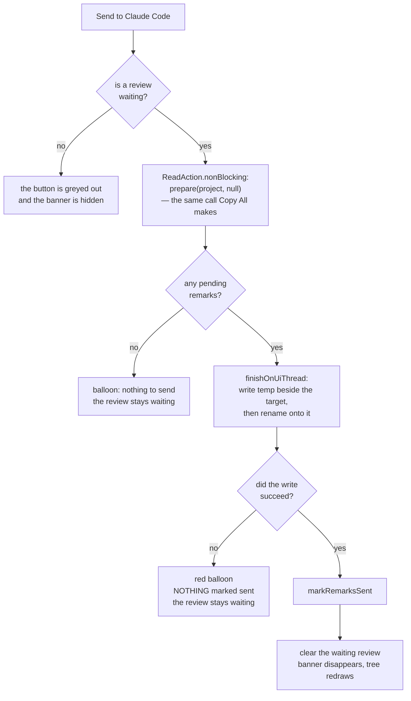
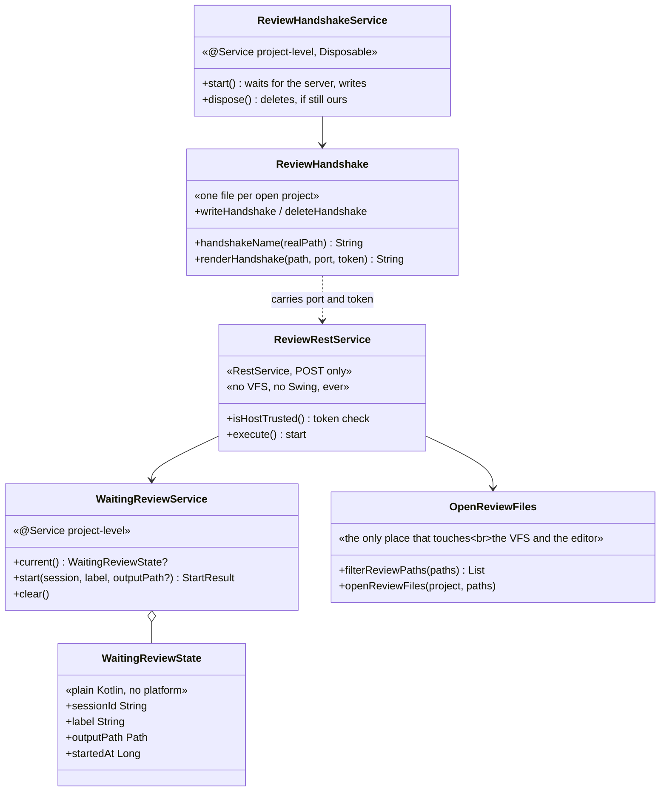

# Claude Remarks — Phase 6 Implementation Plan

**A review session shared between Claude Code and the IDE.**

**Status: not started.** Branch `claude-remarks-phase1-2`. Phase 5 is complete. Task 1 still gates on
that, and it gates on artifacts, not on commit count.

**Citations in this plan name symbols, not line numbers.** Phase 5 landed commits into the same files
while this plan was being written, and every line number in the first draft was stale within a day. A
symbol name survives the next commit; a line number does not.

## Contents

1. [What is true today](#1-what-is-true-today)
2. [Platform facts checked against the 2025.2 jars](#2-platform-facts-checked-against-the-20252-jars)
3. [Still to verify](#3-still-to-verify)
4. [The shape of the change](#4-the-shape-of-the-change)
5. [The security question, settled](#5-the-security-question-settled)
6. [Scope judgement: what I would cut](#6-scope-judgement-what-i-would-cut)
7. [Decisions carried in, and the six I made](#7-decisions-carried-in-and-the-six-i-made)
8. [Rules that must hold at every step](#8-rules-that-must-hold-at-every-step)
9. [Ordering and parallel waves](#9-ordering-and-parallel-waves)
10. [Implementation steps](#10-implementation-steps)
    - [Task 1: Check the ground before building on it](#task-1-check-the-ground-before-building-on-it)
    - [Task 2: The handshake file](#task-2-the-handshake-file-so-a-skill-can-find-this-ide-and-this-project)
    - [Task 3: The atomic write, borrowed from revdiff](#task-3-the-atomic-write-borrowed-from-revdiff)
    - [Task 4: The waiting review, one per project](#task-4-the-waiting-review-one-per-project)
    - [Task 5: The endpoint](#task-5-the-endpoint)
    - [Task 6: Send the remarks to the waiting session](#task-6-send-the-remarks-to-the-waiting-session)
    - [Task 7: The banner that says who is waiting](#task-7-the-banner-that-says-who-is-waiting)
    - [Task 8: The Claude Code skill](#task-8-the-claude-code-skill)
    - [Task 9: Open the files under review — the cheap version, and droppable](#task-9-open-the-files-under-review--the-cheap-version-and-droppable)
    - [Task 10: Verify the constraints and the whole suite](#task-10-verify-the-constraints-and-the-whole-suite)
    - [Task 11: Update the design docs](#task-11-update-the-design-docs)
11. [Known limits](#11-known-limits)
12. [Hand checks in a sandbox IDE](#12-hand-checks-in-a-sandbox-ide)

## 1. What is true today

Read from the source on this branch, not assumed.

**Phase 5 is complete.** Task 12 is `d42457c`, task 13 is `0ef2290`, task 14 is `60e3be0`, and
`a055473` accepts one internal-API usage so `verifyPlugin` passes. Task 1 below still gates on the
artifacts phase 5 leaves behind rather than on commits, because counting commits does not work in a
branch that also carries this plan file.

**The repository already carries one accepted internal-API usage** (`a055473`). That is the reason task
2 goes out of its way not to add a second one.

**The history file exists.** `store/RemarkHistory.kt` holds `historyFile(project)` and
`appendToHistory(file, remarks)`, and `clearSentRemarks` and `clearAllRemarks` in
`store/RemarkEdits.kt` both take a `historyFile` parameter and archive before deleting. Phase 6 still
does not write to it — see [section 7](#7-decisions-carried-in-and-the-six-i-made) for the reasoning and
for the sign-off this needs.

**The whole prompt payload already exists, and it is one function call.** `internal fun prepare` in
`action/CopyRemarks.kt` resolves, reads the files, renders the markdown, and returns
`Prepared(markdown, ids, files)`. Phase 6 needs the same three values with a different destination.
Nothing about rendering changes.

**`prepare` must run inside a read action, off the EDT.** `copyRemarks` in `action/CopyRemarks.kt` wraps
it in `ReadAction.nonBlocking { }.expireWith(project).coalesceBy(...)`. The comment on
`collectForPrompt` in `render/PromptPayload.kt` says it "must be called inside a read action, off the
EDT" because it reads `Document`s.

**A file write must not go inside that read action.** The comment above the `clipboardPayload` call in
`copyRemarks` says why: a non-blocking read action is cancelled and re-run whenever a write action asks
for the lock, so a file write in there runs once per retry and leaves a stray file behind each time. The
clipboard path solves this by writing in `finishOnUiThread`. Phase 6 does the same.

**Marking remarks sent is one call, and it already publishes.** `markRemarksSent(project, ids)` in
`store/RemarkEdits.kt`. `copyRemarks` calls it only after the handover succeeded, and a failed clipboard
write marks nothing. Phase 6 keeps that rule exactly.

**`notifyRemarksChanged` publishes synchronously.** It uses `messageBus.syncPublisher`, so the listener
runs on whichever thread called it. That matters in phase 6, because one caller will be a netty IO
thread.

**The tool window panel puts one component in the centre and nothing anywhere else.** `RemarksPanel`'s
`init` in `ui/RemarksToolWindowFactory.kt` is `setToolbar(buildToolbar().component)` then
`setContent(JBScrollPane(tree))`. `SimpleToolWindowPanel` uses a `BorderLayout` and `setContent` takes
the centre. There is no place for a banner today. Task 7 adds one by wrapping the scroll pane.

**The toolbar is built in code and every button greys itself out.** The `ToolbarAction` inner class in
`ui/RemarksToolWindowFactory.kt` takes an `enabled` lambda and runs it in `update()` on
`ActionUpdateThread.EDT`. `buildToolbar` builds the five buttons. A sixth fits with no new machinery.

**The panel already redraws itself on one topic.** `RemarksPanel.init` subscribes to `REMARKS_CHANGED`
and calls `refresh()`. `refresh()` runs `resolveAll` off the EDT and finishes on the EDT. Phase 6 reuses
that one topic rather than adding a second.

**The project-level service pattern to copy is `RemarkGutter`.** `editor/RemarkGutter.kt` is
`@Service(Service.Level.PROJECT) class RemarkGutter(private val project: Project) : Disposable`, and
`editor/RemarkGutterStartup.kt` is a `ProjectActivity` whose whole body is
`RemarkGutter.getInstance(project).start()`. The comment there says why: touching the service creates
it, `start()` registers its listeners, and it must not depend on the tool window being opened. Phase 6's
handshake service copies that shape exactly, including `dispose()`.

**The path check that stops a caller escaping the project already exists.** `fileForStoredPath(root,
path)` in `store/RemarkResolver.kt` resolves relative to the root and then re-checks with
`VfsUtilCore.isAncestor`. Note the file: it is in `RemarkResolver.kt`, not `RemarkTarget.kt`.
`projectRoot(project)` is in the same file and returns a `VirtualFile?` from `project.basePath`.

**`project.basePath` is the path as the project was opened, not the physical path.** For a symlinked
checkout the two differ. Task 2 normalizes with `toRealPath()` so the handshake *name* agrees with what
the skill computes; task 5 has to normalize again, for the same reason, when it *matches* an incoming
request.

**Fixture-backed tests clear the shared state in both `setUp` and `tearDown`.**
`ui/RemarksPanelTest.kt` clears `RemarkStore` in both, and has a private `settle()` helper that every
test calls after anything that hops off the EDT and back. `CLAUDE.md` explains the hazard: the light
fixture project is shared across test classes, so anything one class leaves behind is still there when
the next one starts. Phase 6 adds a second piece of shared project state, and tasks 6 and 7 must clear
it the same way.

**The plugin declares exactly one dependency.** `src/main/resources/META-INF/plugin.xml` has
`<depends>com.intellij.modules.platform</depends>` and nothing else. Phase 6 adds no second one, and
[section 2](#2-platform-facts-checked-against-the-20252-jars) shows why it does not have to.

**The temp-file habit already exists, with its reasoning written down.** The comment above
`Files.createTempFile` in `render/PromptPayload.kt` explains why a predictable name is not used: the
system temp directory is shared and world-writable, so a predictable name can be pre-created as a
symlink by another local user, and on POSIX `createTempFile` also creates the file `rw-------`. Phase 6
reuses that reasoning for the directory it hands out.

## 2. Platform facts checked against the 2025.2 jars

Checked with `javap` against
`/Users/sasha/.gradle/caches/9.1.0/transforms/c3bd2a49efd270bc2558f65097ad6f39/transformed/ideaIC-2025.2-aarch64/`.

**Every class phase 6 needs is in a platform `lib/` jar, not in a bundled plugin.** This is the fact the
single-dependency claim rests on, so it was checked class by class:

| class | jar |
| --- | --- |
| `org.jetbrains.ide.RestService` | `lib/app-client.jar` |
| `org.jetbrains.ide.HttpRequestHandler` | `lib/app-client.jar` |
| `org.jetbrains.ide.BuiltInServerManager` | `lib/app-client.jar` |
| `com.intellij.ui.EditorNotificationPanel` | `lib/app-client.jar` |
| `io.netty.handler.codec.http.FullHttpRequest` | `lib/util-8.jar` |
| `io.netty.handler.codec.http.DefaultFullHttpRequest` | `lib/util-8.jar` |
| `io.netty.channel.embedded.EmbeddedChannel` | `lib/util-8.jar` |
| `com.google.gson.Gson` | `lib/util-8.jar` |

Both jars are already on the compile classpath: the plugin imports `JBScrollPane` from `app-client.jar`
and `VfsUtilCore` from `util-8.jar` today, and it compiles. No second `<depends>` is needed. The two
netty rows in the middle matter for testing — see task 5's smoke test.

`OpenFileHttpService`, the platform's own example of a `RestService`, is **not** in this distribution: it
lives in the `com.intellij.remoteControl` plugin, which IDEA Community does not bundle. Read it in the
checkout for reference, never as proof that something is on the classpath.

Signatures, from `javap` on `lib/app-client.jar`:

- `public abstract java.lang.String execute(QueryStringDecoder, FullHttpRequest, ChannelHandlerContext) throws IOException`
  — note `public`, not `protected`. Returning a non-null string makes the platform send
  `400 BAD_REQUEST` with that text. Returning null means the service already sent its own response.
  Being public is also what lets a test call it directly.
- `protected boolean isHostTrusted(FullHttpRequest, QueryStringDecoder) throws InterruptedException, InvocationTargetException`
  — this two-argument form is the non-deprecated one. The single-argument overload is deprecated.
- `protected boolean isMethodSupported(HttpMethod)`, which defaults to GET only.
- `protected abstract java.lang.String getServiceName()`
- `public static final JsonReader createJsonReader(FullHttpRequest)` and
  `public static final JsonWriter createJsonWriter(OutputStream)`
- `public static final void send(BufferExposingByteArrayOutputStream, HttpRequest, ChannelHandlerContext)`
  — this is the one that sends a JSON body with a 200.
- `BuiltInServerManager.getInstance()` is static; `getPort()` and `waitForStart()` are abstract on it.
- `EditorNotificationPanel()` has a no-argument constructor, `setText(String)`, and
  `createActionLabel(String, Runnable): HyperlinkLabel`.

The extension point is `com.intellij.httpRequestHandler`, declared in `HttpRequestHandler.kt` in the
checkout as `ExtensionPointName("com.intellij.httpRequestHandler")`, and it takes an `implementation=`
attribute.

**`RestService.process` sends status codes of its own, above `execute`.** 403 when `isHostTrusted` is
false, 429 when the per-minute counter passes
`Registry.intValue("ide.rest.api.requests.per.minute", 30)`, and 400 or 500 from its `catch`. None of
them carries a JSON body. The skill therefore has to read the HTTP status before it looks for a `status`
field — see task 8.

**The built-in server port is not known at project-open time.** `BuiltInServerManagerImpl.port` is
`portOverride ?: server?.port ?: getDefaultPort()`, and `server` is only set by
`startServerInPooledThread`, which the constructor launches on `Dispatchers.IO` and which first awaits
the registry load, then calls `BuiltInServer.start(..., tryAnyPort = true)`. So `port` answers 63342
until the real bind finishes, and the real bind can land on a different number. A `ProjectActivity` at
project open can easily win that race. `waitForStart()` joins that job and returns the manager; it
asserts it is not on the EDT, which a `ProjectActivity` coroutine satisfies. **Task 2 must read
`BuiltInServerManager.getInstance().waitForStart().port`.**

**A plain `curl` with no `Origin` and no `Referer` is trusted by the built-in server by default, and so
is a page in a browser that suppresses its referrer.** This is the whole security question, and it is
answered in [section 5](#5-the-security-question-settled). The chain, read from the checkout:

- `org/jetbrains/io/DelegatingHttpRequestHandler.kt` runs
  `isSupported(request) && isAccessible(request) && process(...)`.
- `HttpRequestHandler.isAccessible` is
  `hostName != null && isOriginAllowed(request) != FORBID && isLocalHost(hostName)`.
- The default `HttpRequestHandler.isOriginAllowed` is `if (request.isLocalOrigin()) ALLOW else FORBID`.
- `com/intellij/util/io/netty.kt`: `isLocalOrigin()` is
  `parseAndCheckIsLocalHost(origin) && parseAndCheckIsLocalHost(referrer)`.
- `com/intellij/util/io/netty.kt`: `parseAndCheckIsLocalHost(null)` returns **true**.

So a request carrying neither header reaches `RestService.process`, which then sees
`isOriginAllowed(request) == ALLOW` and returns trusted with no dialog. That is convenient for a
command-line skill and dangerous for everything else.

**`isRequestSigned` cannot be used by an external tool.** `BuiltInWebServerAuth.acquireToken()` puts a
random token in a Caffeine cache that expires one minute after the last access, and only IDE-internal
code ever calls it. There is no file an outside process can read to obtain it. The long-lived
`USER_WEB_TOKEN` file is used only for a browser cookie in `validateToken`, and `RestService` never
calls `validateToken`. So the platform offers this plugin no usable shared secret, and phase 6 mints its
own.

## 3. Still to verify

Two things, each with the check written into the task that needs it.

**Whether POSIX file permissions apply.** Task 2 sets owner-only permissions on the handshake directory
and file. On a filesystem with no POSIX view that throws. **Task 2 must guard it** with
`fileAttributesViewOrNull<PosixFileAttributeView>()?.setPermissions(...)`, and its permission test must
skip itself when `Files.getFileAttributeView(dir, PosixFileAttributeView::class.java)` is null, so the
suite still passes on a filesystem without POSIX.

**Whether two IDE processes really land on two different ports.** The code says
`BuiltInServer.start(firstPort = 63342, portsCount = PORTS_COUNT, tryAnyPort = true)`, so the second
process should take the next free port, and once the range is full it takes any free port at all. Task 2
does not depend on the number, because it reads the real one after `waitForStart()`. **The hand check in
[section 12](#12-hand-checks-in-a-sandbox-ide) confirms it** by starting a second IDE and comparing the
two handshake files.

An earlier draft of this plan claimed a light fixture could not exercise the netty path. **That was
wrong.** `DefaultFullHttpRequest` and `EmbeddedChannel` are both in `lib/util-8.jar`, which is already
on the compile classpath, so `execute` can be called from a test. Task 5 has the smoke test, and it is
the one test that would have caught the unclosed-writer bug this plan's first draft carried.

## 4. The shape of the change

Two new pieces of plumbing, one new button, one banner. The payload, the renderer, the store and the
clipboard path are all untouched.

```mermaid
sequenceDiagram
    participant Skill as Claude Code skill
    participant FS as ~/.claude-remarks/&lt;hash&gt;.json
    participant IDE as IDE endpoint<br/>/api/claude-remarks/start
    participant Panel as Remarks tool window
    participant Out as handoff file

    Note over IDE,FS: on project open, the plugin waits for<br/>the server, then writes path, port, token
    IDE->>FS: write handshake, mode 600
    Skill->>FS: read port and token for this repo
    Skill->>IDE: POST start {session, label, project}
    alt HTTP is not 200
        IDE-->>Skill: 403 stale token, 429 rate limit,<br/>404 no handler
        Note over Skill: plumbing failure, report verbatim
    else another review already waiting
        IDE-->>Skill: status "conflict", with the other label
        Note over Skill: report it, do not wait
    else accepted
        IDE-->>Skill: status "waiting"<br/>output = /tmp/.../remarks.md
        IDE->>Panel: banner "Claude Code is waiting: &lt;label&gt;"
    end
    Note over Skill: poll: while the file does not exist, sleep 1
    Note over Panel: the person reads and writes remarks
    Panel->>Out: Send to Claude Code:<br/>render, write temp, rename
    Panel->>Panel: markRemarksSent, clear the banner
    Skill->>Out: the file now exists, read it whole
```

What the button does, and where it refuses:



The new files hold one idea each:



## 5. The security question, settled

**The rule: the endpoint accepts a request only if it is a POST, carries no `Origin` and no `Referer`
header, and carries the correct secret in the `X-Claude-Remarks-Token` header. Everything else gets
403.**

The three conditions are independent, and each one alone closes a different hole.

**Why POST only.** [Section 2](#2-platform-facts-checked-against-the-20252-jars) showed that a request
with neither `Origin` nor `Referer` is trusted by default. A page in a browser can produce exactly that
request: `` on a page that sets
`<meta name="referrer" content="no-referrer">` sends no `Origin` — a simple GET never does — and no
`Referer`, because the policy suppresses it, while `Host` is `127.0.0.1:63342`, which passes the
local-host check. An `` tag can only issue a GET. So refusing every method except POST removes that
whole class of request. `isMethodSupported` defaults to GET only, so this override is load-bearing in
both directions: without it the service would accept GET and refuse POST. The remaining browser ways to
send a cross-origin POST are a form submit and `fetch`, and both always attach an `Origin` header, which
the next condition rejects.

**Why refusing `Origin` and `Referer` outright.** A command-line client never sends either. A browser
almost always sends at least one. Turning "the header is missing" from a default-allow into a
requirement inverts the platform's own risky default in the one place this plugin controls. It costs two
lines and a reviewer can check it by eye.

**This rule is not redundant with the platform's own check, and the reason is specific to an IDE.** The
built-in web server serves files out of open projects at `127.0.0.1:63342`. A malicious `.html` file
committed into a repository that the person opens is therefore served from a **local** origin, so
`isLocalOrigin()` returns true and the platform's own check waves it straight through to `process`. At
that point only the "refuse any `Origin`" rule stops it. Write this into the design doc in task 11, or
somebody later deletes the check as duplicating what the platform already does.

**Why the token as well.** The two conditions above stop a web page. They do not stop another process on
the same machine, and this endpoint is worth protecting from one: it hands back a path the plugin will
later fill with remark text and slices of source code, and it puts caller-chosen text on screen inside
the IDE. The token is a random string minted once per IDE run and written into the handshake file with
owner-only permissions. A process that cannot read that file cannot drive the endpoint. As a second
effect, a custom request header on a cross-origin `fetch` forces a CORS preflight, which this endpoint
never answers, so the browser never sends the real request either.

**Where the check goes.** Override `isHostTrusted(request, urlDecoder)`. `RestService.process` calls it
unconditionally and first, and returning `false` makes it send 403 before `execute` runs. The override
must not call `super`: that is what makes both the unusable `isRequestSigned` path and the platform's
referrer dialog unreachable, so no request can pop a modal window at the person.

**The alternative I rejected: `isOriginAllowed = ASK_CONFIRMATION`, the way `OpenFileHttpService` does
it.** That is what the platform's own open-a-file endpoint uses. Walk through what happens: the skill
sends a request with no `Origin` and no `Referer`; `ASK_CONFIRMATION` is not `ALLOW`, so `isHostTrusted`
falls through to the referrer branch, finds a null host, and shows a modal Yes/No dialog. Because the
host is null the answer is not cached — `RestService` only caches when both host and scheme are known —
so the dialog appears on **every** request. A skill that pops a modal dialog in the IDE before the
person can start reading is worse than no feature. The token check avoids the dialog entirely and is
stricter at the same time.

## 6. Scope judgement: what I would cut

**Cut the diff opening, or make it the last and smallest task.** The brief says the IDE "opens the diff
for that set of commits or the local diff". That is the expensive half and the least valuable one. Doing
it properly means a diff built from Git revisions, which means an optional dependency on `Git4Idea`,
plus `GitFileRevision`, `DiffContentFactory` and `DiffManager`, and it breaks the single
`com.intellij.modules.platform` dependency the plugin has held since phase 1. What it buys: the person
does not press `Cmd+9` themselves. Task 9 below plans the cheap version instead — the skill already
knows the commit range, so it runs `git diff --name-only` itself and sends the paths, and the IDE opens
those files in editors. If one task is dropped from this plan, drop task 9.

**No cancel endpoint.** The skill cannot withdraw a review after its own process has died, which is the
only case that matters. The person clears a stale review from the banner in the IDE. A `force` flag on
`start` was the alternative, and it is worse: it lets a second skill run silently steal a review the
person is halfway through. The idempotency check in task 4 covers the honest retry case, which is the
one a flag would otherwise be used for.

## 7. Decisions carried in, and the six I made

Carried in unchanged, from `docs/ideas.md` and the phase 6 brief:

- **A file, not a socket.** The IDE writes one file, the skill watches for it.
- **The clipboard path stays.** Nothing in phase 6 removes or changes `copyRemarks`. With no skill
  installed and nothing listening, the plugin behaves exactly as it does today.
- **The endpoint is a `RestService` on the built-in server.** No new port, no new process.
- **The atomic write comes from revdiff.** Write the whole content to a temp file in the *same
  directory* as the target, then rename onto the target. A same-filesystem rename is atomic on POSIX, so
  a reader watching the path sees either nothing or the complete content. This is why the skill's wait
  can be "while the file does not exist, sleep": there is no partial state to observe.
- **A graceful finish and a killed session are different.** The handoff file is written only when the
  person presses the button. An IDE that quits, crashes, or simply closes the project writes nothing. A
  payload that exists always means somebody chose to send it.
- **No remark reaches a source file, and nothing remark-related enters version control.** The handshake
  file is under the user's home directory, the handoff file is in a fresh temp directory. Neither is
  inside a project.

Six decisions I made, which the brief left open. **Read all six before execution starts.** The first two
decline things `docs/ideas.md` carries in as instructions, so they need an explicit yes or no rather
than a silent pass.

**I decline the second durable copy of the payload, and this one needs your sign-off.**
`docs/ideas.md` says, under "What to borrow from revdiff": *"Copy: the two-tier idea — one file for the
fast path, one durable log for recovery when the fast path fails."* I am not building it. The reasoning:
revdiff needs the second tier because its handoff file is deleted by the launcher's `trap` and its own
process is about to end. Neither is true here. The plugin never deletes the handoff file, and the
remarks stay in the store marked `SENT` until somebody clears them, so they can be sent or copied again
from controls that already exist. **The store is the durable tier.** Adding a second write would also
double-count against phase 5's history file, which writes on *clear*: a remark handed over and later
cleared would appear in it twice. What is given up: if the handoff file is gone and the person has
already cleared the remarks, the payload survives only in phase 5's history format, not in the prompt
format the agent would have received. Say so if you want the second write anyway — it is one call to
`appendToHistory` in task 6, plus a decision about the double entry.

**I also decline the "fixed, predictable path per review", and it needs the same sign-off.**
`docs/ideas.md` says: *"Adapt: the path naming. revdiff mints a fresh `mktemp` path per invocation
because a shell script is the one deciding where to write; the IDE plugin can choose one fixed,
predictable path per review up front, which is actually simpler than what revdiff has to do."* Simpler,
yes, and wrong here. `render/PromptPayload.kt` already carries the reason in a comment: the system temp
directory is shared and world-writable, so any other local user can pre-create a predictable name as a
symlink and the plugin's write lands wherever it points. That comment was written for the clipboard
file; the handoff file holds the same remark text and the same slices of source. So the path is
unpredictable — `Files.createTempDirectory("claude-remarks-review-")` — and the plugin hands it back in
the response instead of both sides agreeing on it in advance. What is given up: the skill cannot guess
the path before it calls, so a skill that lost the response cannot find the file. It re-runs `start`
instead, and the idempotency rule below gives it the same path back.

**The skill finds the IDE through a handshake file keyed by the repository path, not by scanning
ports.** The problem is real: the built-in server port belongs to the IDE *process*, so two IDE products
running at once are on different ports, and the token is per-IDE too. The alternatives were (a) the
skill scans 63342 upwards and asks each one "do you have this project open", or (b) the plugin writes
one small file per open project and the skill reads the one that matches. Walk through (a): the skill
makes up to ten HTTP requests on every review, each of which needs a token it does not have yet, so the
token would have to be found some other way anyway. Walk through (b): the plugin writes
`~/.claude-remarks/<first 16 hex characters of the sha256 of the real project path>.json` when the
project opens and deletes it when the project closes; the skill computes the same name from
`git rev-parse --show-toplevel` with `shasum -a 256`, reads one file, and gets the port, the token and a
confirmation that this IDE really has this repository open. One file write solves port discovery, token
delivery and project matching together. I chose (b). `git rev-parse --show-toplevel` returns the
physical path even for a symlinked checkout, so pairing it with `toRealPath()` on the plugin side agrees
— for the name in task 2 and for the match in task 5.

**One waiting review per project, and a second `start` is refused, not queued.** The state lives in
memory in a project-level service, so an IDE restart clears it and there is no persisted field to
migrate. A `start` for a project that already has a waiting review answers `conflict` with the waiting
label and the time it started, unless the `session` id in the request equals the one already waiting, in
which case the same output path is returned again. That last part is three lines and it turns an honest
network retry from a confusing conflict into a no-op.

**The endpoint answers 200 with a `status` field in the body, and does not use 409 or 404 for its own
outcomes.** The alternative is proper status codes. Walk through it: a shell script that uses `curl -f`
throws the body away on a 4xx, which is exactly the body carrying the label of the review that is
already waiting, so the skill would have to drop `-f` and parse the status code separately. Walk through
the chosen shape: the skill runs one `curl`, parses one JSON object, and reads `status`, which is one of
exactly four values — `waiting`, `conflict`, `unknown-project`, `bad-request`. Real HTTP error codes
stay reserved for what `RestService.process` generates above `execute`: 403, 429, and 400 or 500 from
its `catch`, plus 404 when no handler claims the request. So the skill checks the HTTP status first and
only then looks for `status`, and a plumbing failure never looks like an application answer.

**The endpoint stays free of the VFS and Swing, and the file opening lives in its own file.** `execute`
runs on a netty IO thread, so it must not touch either. Task 9 needs both. Rather than mixing them and
relying on a comment, the file opening goes in `review/OpenReviewFiles.kt` and does its own
`invokeLater`. That keeps the rule checkable by a grep on one file — see rule 5 in
[section 8](#8-rules-that-must-hold-at-every-step) — rather than by a reviewer reading carefully.

## 8. Rules that must hold at every step

The four grep guards in `CLAUDE.md` must stay empty after every task. Two of them need a note for phase
6, and phase 6 adds a fifth.

1. **Nothing under `src/` writes to a source file.**

   ```bash
   grep -rnE "WriteCommandAction|WriteAction\.|runWriteAction|insertString|replaceString|deleteString|[Dd]ocument\.setText|setBinaryContent" src/
   ```

   Phase 6 writes two files, both with `Files.writeString` and `Files.move`, neither of which matches
   the pattern, and neither of which is inside a project.

2. **`anchor/` and `render/PromptRenderer.kt` stay free of `com.intellij` imports.** Phase 6 touches
   neither.

3. **`store/RemarkEdits.kt` holds the only functions that change a remark.** Phase 6 calls
   `markRemarksSent` and nothing else. This guard is now the `.all()` allow-list form.

4. **Nothing remark-related enters version control.** The handoff file is in a temp directory, the
   handshake file is under `~/.claude-remarks/`. Neither is inside a project, so no `.gitignore` rule
   has to be remembered.

5. **New in phase 6: the endpoint never touches the VFS, Swing, or `invokeAndWait`.** Task 11 adds this
   to `CLAUDE.md`, because it is the most fragile new invariant in the plugin and a paragraph in a plan
   file does not outlive the plan:

   ```bash
   grep -rnE "invokeAndWait|projectRoot\(|FileEditorManager|VfsUtil|SwingUtilities" \
     src/main/kotlin/dev/sasha/clauderemarks/review/ReviewRestService.kt   # must be empty
   ```

   This is why the file opening lives in `review/OpenReviewFiles.kt` instead of inside `execute`.

Four more, carried from earlier phases or new to this one:

6. **Prove a test is a real guard by mutation.** Break the production line the test covers, watch the
   named test fail, restore. Every task below names its mutation.
7. **Never block the EDT, and never touch Swing off it.** `execute` runs on a netty IO thread, which is
   neither the EDT nor a thread holding any IntelliJ lock. It sets a field in a service, makes one
   filesystem call, and returns. [Section 11](#11-known-limits) records the one place this plan
   knowingly bends the rule, and why that is accepted.
8. **Nothing is marked sent unless the handover succeeded.** Copy already works this way. Task 6 keeps
   it, and task 6's failure-path test is the only guard on it.
9. **Never run `git add -A` or `git add .`** Several agents work on this repository at the same time.
   Every commit step below names the exact files to stage. Stage those and nothing else. If
   `git status --porcelain` shows a file you did not create or edit, leave it alone and say so in the
   task report.

## 9. Ordering and parallel waves

**No parallel waves.** Every task after the first consumes the one before it: task 3 writes the atomic
write that tasks 2 and 6 use, task 4 defines the waiting review that tasks 5, 6 and 7 all read, task 5
fixes the request shape that task 8's skill has to send, and task 9 adds a field to that request which
task 8's skill then has to send too. There are eleven tasks and the whole phase is small; splitting it
into waves would cost more coordination than it saves.

The order is: check the ground (1), the handshake file (2), the atomic write (3), the waiting review (4),
the endpoint (5), the send action (6), the banner (7), the skill (8), the optional file opening (9),
verify (10), document (11).

**The skill comes before the file opening on purpose.** The file opening is the droppable task. If it ran
first, the endpoint would grow a `files` array that no skill ever sends. Running it after the skill means
it edits a skill that already exists, and dropping it leaves nothing dangling.

## 10. Implementation steps

TDD throughout: write the failing test, run it, watch it fail for the right reason, then implement. Run
the narrow per-task command after each change. The full suite runs once, in task 10. Complete each task
before starting the next.

### Task 1: Check the ground before building on it

**Model:** haiku

**Files:**
- Read only: `CLAUDE.md`, the "Rules that must not break" section
- Read only: `src/main/kotlin/dev/sasha/clauderemarks/store/RemarkHistory.kt`
- Read only: `src/main/kotlin/dev/sasha/clauderemarks/store/RemarkEdits.kt`

Phase 6 was planned while phase 5 was still landing. This task takes five minutes and stops the whole
phase from being built on a half-finished base.

**Gate on artifacts, not on commits.** Counting commits does not work here: this plan file was itself
committed into the same branch, so "there are commits after phase 5 task 7" is already true and proves
nothing.

- [ ] `git status --porcelain` must be empty. Another agent may be mid-task in this same worktree. If it
      is not empty, **stop and report** what is there rather than working around it.
- [ ] phase 5 task 10 landed: `src/main/kotlin/dev/sasha/clauderemarks/store/RemarkHistory.kt` exists
      and exports `historyFile` and `appendToHistory`
- [ ] phase 5 task 13 landed — guard 3 in `CLAUDE.md` is the `.all()` allow-list form, not the
      hand-listed mutator names:

      ```bash
      grep -c 'grep -v "\\.all()"' CLAUDE.md   # must be 1
      ```

- [ ] phase 5 task 14 landed:

      ```bash
      grep -c "does not exist and was dropped" CLAUDE.md   # must be 0
      ```

      Match that exact phrase and nothing looser. `CLAUDE.md` now says "What was dropped before it was
      built is a separate, larger idea", so a grep for the bare word "dropped" halts on a finished phase.
- [ ] confirm `markRemarksSent(project, ids)` is still exported from `store/RemarkEdits.kt`. Task 6 calls
      it.
- [ ] run the first four grep guards from [section 8](#8-rules-that-must-hold-at-every-step) now, before
      any phase 6 change. All four must be empty. The fifth names a file that does not exist yet. A guard
      that was already failing must not be blamed on this phase.
- [ ] no commit — this task writes nothing

### Task 2: The handshake file, so a skill can find this IDE and this project

**Model:** sonnet

**Files:**
- Create: `src/main/kotlin/dev/sasha/clauderemarks/review/ReviewHandshake.kt` — `handshakeName`,
  `handshakeDir`, `renderHandshake`, `writeHandshake`, `deleteHandshake`, the per-run token, and the
  `@Service(Service.Level.PROJECT)` class `ReviewHandshakeService` with `start()` and `dispose()`
- Create: `src/test/kotlin/dev/sasha/clauderemarks/review/ReviewHandshakeTest.kt`
- Edit: `src/main/kotlin/dev/sasha/clauderemarks/editor/RemarkGutterStartup.kt` — one more line in
  `RemarkGutterStartup.execute`, after the existing `RemarkGutter.getInstance(project).start()`

One JSON file per open project, under `~/.claude-remarks/`. It tells a skill three things: which port
this IDE's built-in server listens on, the secret to send with a request, and — by existing at all —
that this IDE has this repository open.

The name is derived from the project root so the skill can compute it without searching: `sha256(the
real path of the project root)`, first 16 hex characters, plus `.json`. The skill side is one line of
shell, which is why sha256 was chosen over anything cleverer.

The token is one random string per IDE run, held in memory in an application-level holder. It is not
persisted: a restart mints a new one, the handshake file is rewritten on the next project open, and the
skill reads the file every time anyway.

The service copies `RemarkGutter`'s shape exactly: a project-level `@Service` implementing `Disposable`,
created by the existing `ProjectActivity` touching it, writing in `start()` and deleting in `dispose()`.
Do **not** add a second `postStartupActivity` to `plugin.xml`: one activity per project is enough and
the existing one already runs at the right time. Do **not** write from the service's `init` block: a
service can be constructed on any thread, and IO belongs in the explicit `start()`, which is exactly why
`RemarkGutter` is built that way.

- [ ] write the failing tests in `ReviewHandshakeTest.kt`. Plain JUnit — the name and the rendering are
      pure, and the write only needs a temporary directory:
  - `the file name is the same for the same path and different for a different path` — call
    `handshakeName` twice with the same string and once with another, assert equal and not equal, and
    assert the name is 16 hexadecimal characters plus `.json`
  - `the rendered handshake carries the project path, the port and the token` — assert
    `renderHandshake("/a/b", 63342, "s3cret")` contains each of the three values. A `contains` check on
    `"port": 63342` is enough: the reader is `jq` in a shell script, not a Kotlin parser.
  - `a project path holding a quote or a backslash is escaped` — pass a path with `"` and `\` in it and
    assert the output still has balanced quotes. A hand-built JSON string is the obvious way to write
    `renderHandshake`, and a hand-built one that forgets escaping produces a file `jq` cannot read.
  - `writing twice replaces rather than appends` — write to a temporary directory twice with different
    ports, read back, assert the second port is there and the first is not
  - `the handshake directory is owner-only and traversable` — after a write, assert
    `Files.getPosixFilePermissions(dir) == PosixFilePermissions.fromString("rwx------")`. **Assert the
    permission set directly. Do not assert that the directory can be listed.** Listing needs only `r`,
    so a directory left at `rw-------` still lists fine, and the thing that actually fails is *creating
    a file inside it* — which means a list-based test passes or fails depending on whether the
    implementer sets the permissions before or after writing the file. Asserting the set is
    ordering-independent. Skip the test when
    `Files.getFileAttributeView(dir, PosixFileAttributeView::class.java)` is null, so a filesystem
    without POSIX does not fail the suite.
  - `deleting a handshake that is not there does not throw`
- [ ] run `./gradlew test --tests "dev.sasha.clauderemarks.review.ReviewHandshakeTest"` — expect a
      compile failure
- [ ] create `review/ReviewHandshake.kt`. Seven points the implementation must get right, each with a
      comment saying why:

  **The directory needs an execute bit, the file must not have one.** A directory with only `OWNER_READ`
  and `OWNER_WRITE` is mode 600. Listing it still works, but nothing can create a file inside it, so the
  feature never works at all. Use `PosixFilePermissions.fromString("rwx------")` for the directory and
  `"rw-------"` for the file. Both come from `java.nio.file.attribute` and read as the mode a person
  would write by hand.

  **Set the directory's permissions immediately after `createDirectories`, before anything is written
  into it.** Two reasons. A create-time-only call never runs when `~/.claude-remarks` already exists at
  755 — from an earlier version, from a dotfile script, from anything — and then every token in that
  directory is world-readable, which is security, not tidiness. And doing it after the file write means
  the file lands while the directory is still world-readable, which is a window however short.

  **Guard both permission calls** with
  `fileAttributesViewOrNull<PosixFileAttributeView>()?.setPermissions(...)`, so a filesystem with no
  POSIX view degrades instead of throwing. Do **not** use
  `com.intellij.util.io.PosixFilePermissionsUtil`: it is annotated `@ApiStatus.Internal`, the plugin
  verifier reports internal API use, and this repository already carries one accepted internal-API usage
  (`a055473`) — a second one is not free. `PosixFilePermissions.fromString("rwx------")` from the JDK
  produces the same set as `fromUnixMode(0700)` and is shorter. Note in the comment that
  `fileAttributesViewOrNull` is `kotlin.io.path` from the Kotlin standard library, `@InlineOnly`, with no
  `@ExperimentalPathApi` and so no `@OptIn` — so this pair removes internal-API exposure entirely rather
  than trading one internal call for another.

  **`handshakeDir()` is `Path.of(System.getProperty("user.home"), ".claude-remarks")`.** Not the IDE
  configuration directory: the skill has to find this without knowing which JetBrains product is
  running, and the configuration directory name carries the product and the version.

  **The port is `BuiltInServerManager.getInstance().waitForStart().port`, never plain `.port`.**
  `BuiltInServerManagerImpl.port` falls back to 63342 until the real bind finishes, and the bind runs
  asynchronously on `Dispatchers.IO` after the registry loads, using `tryAnyPort = true`. A
  `ProjectActivity` at project open can win that race and write a port nothing listens on, on a
  perfectly healthy first launch. `waitForStart()` asserts it is not on the EDT, which the
  `ProjectActivity` coroutine satisfies. It does block that coroutine until the server binds — see
  [section 11](#11-known-limits).

  **Skip the whole thing in unit test mode.** Guard `start()` with
  `if (ApplicationManager.getApplication().isUnitTestMode) return`. In test mode
  `BuiltInServerManagerImpl` never launches its start job, so `waitForStart()` would start a real HTTP
  server during `./gradlew test`. The tests in this task call `writeHandshake` directly, so they never
  need `start()`.

  **`dispose()` deletes the file only if it is still ours.** Two IDEs with the same project open both
  write this file and the second one wins. If the first then closes and deletes it, the survivor becomes
  silently undiscoverable. So `dispose()` reads the file first and deletes only if it still carries this
  run's token. A read that fails for any reason means delete nothing.

  The project root comes from the same `projectRoot(project)` the rest of the plugin uses
  (`store/RemarkResolver.kt`), then `toNioPath().toRealPath()`, so a symlinked checkout gives the same
  name the skill computes from `git rev-parse --show-toplevel`. A project with no root writes no
  handshake.

  The write uses `atomicWriteString` from task 3. Task 3 comes after this one, so write a plain
  `Files.writeString` here and switch it in task 3. Leave a `TODO` naming task 3 so the switch is not
  forgotten.
- [ ] add `ReviewHandshakeService.getInstance(project).start()` to `RemarkGutterStartup.execute`
- [ ] run `./gradlew test --tests "dev.sasha.clauderemarks.review.ReviewHandshakeTest"` — must pass
- [ ] **mutation check**: change the directory permissions to `"rw-------"`. `the handshake directory is
      owner-only and traversable` must fail. Restore it.
- [ ] **second mutation check**: make `handshakeName` return a constant. `the file name is the same for
      the same path and different for a different path` must fail. Restore it.
- [ ] commit, staging exactly:

  ```bash
  git add src/main/kotlin/dev/sasha/clauderemarks/review/ReviewHandshake.kt \
          src/test/kotlin/dev/sasha/clauderemarks/review/ReviewHandshakeTest.kt \
          src/main/kotlin/dev/sasha/clauderemarks/editor/RemarkGutterStartup.kt
  ```

### Task 3: The atomic write, borrowed from revdiff

**Model:** sonnet

**Files:**
- Create: `src/main/kotlin/dev/sasha/clauderemarks/review/AtomicWrite.kt` — `atomicWriteString` and the
  internal `tempFileFor`
- Create: `src/test/kotlin/dev/sasha/clauderemarks/review/AtomicWriteTest.kt`
- Edit: `src/main/kotlin/dev/sasha/clauderemarks/review/ReviewHandshake.kt` — inside `writeHandshake`,
  replace the plain `Files.writeString` and delete the `TODO` task 2 left

The one piece of plumbing that removes a whole class of race. Write the full content to a temp file **in
the same directory as the target**, then rename that temp file onto the target. A rename inside one
filesystem is atomic on POSIX, so a reader watching the target path sees either the old complete content
or the new complete content, never half a file. That is why the skill's wait can be "does the file exist
yet" and nothing more.

The same-directory part is the part that is easy to get wrong and easy to test. A temp file in the system
temp directory is usually on a different filesystem from the target's, and `Files.move` with
`ATOMIC_MOVE` across filesystems throws `AtomicMoveNotSupportedException`.

**Two functions, and the test and the implementation must agree on both:**

```kotlin
/** Creates the temp file and returns it. In the target's own directory, so the rename is atomic. */
internal fun tempFileFor(target: Path): Path =
    Files.createTempFile(target.parent, ".claude-remarks-", ".tmp")

fun atomicWriteString(target: Path, text: String) {
    Files.createDirectories(target.parent)   // createTempFile throws if the parent is absent
    val temp = tempFileFor(target)
    try {
        Files.writeString(temp, text, StandardCharsets.UTF_8)
        Files.move(temp, target, StandardCopyOption.ATOMIC_MOVE, StandardCopyOption.REPLACE_EXISTING)
    } catch (e: IOException) {
        Files.deleteIfExists(temp)   // a failed write leaves nothing behind
        throw e
    }
}
```

`tempFileFor` both names and creates, because `Files.createTempFile` does both and splitting them would
mean writing a name generator by hand. The consequence for the test: it must create the parent directory
itself before calling `tempFileFor` directly.

- [ ] write the failing tests in `AtomicWriteTest.kt`. Plain JUnit, one temporary directory:
  - `the temp file is created beside the target, not in the system temp directory` — create the parent
    directory, then assert `tempFileFor(target).parent == target.parent`
  - `writing creates the file with exactly the given content`
  - `writing again replaces the whole content` — write a long string, then a short one, assert the short
    one is all that is there
  - `no temp file is left behind` — after a successful write, assert the target's directory holds exactly
    one entry
  - `a missing parent directory is created` — call `atomicWriteString` with a target two levels below an
    empty temporary directory, assert the file is there with the right content. This is what
    `Files.createDirectories` is for; without it `createTempFile` throws.
- [ ] run `./gradlew test --tests "dev.sasha.clauderemarks.review.AtomicWriteTest"` — expect a compile
      failure
- [ ] create `review/AtomicWrite.kt` as above. The comment must say why the temp file goes in the
      target's directory and not in `java.io.tmpdir`.
- [ ] switch `writeHandshake` in `ReviewHandshake.kt` over to `atomicWriteString`. The permission call on
      the *file* has to run **after** the move, because the temp file is the one that gets renamed. The
      permission call on the *directory* still runs before anything is written into it, as task 2
      requires.
- [ ] run `./gradlew test --tests "dev.sasha.clauderemarks.review.AtomicWriteTest" --tests "dev.sasha.clauderemarks.review.ReviewHandshakeTest"`
      — both must pass
- [ ] **mutation check**: change `Files.createTempFile(target.parent, …)` to `Files.createTempFile(…)`
      without the directory argument. `the temp file is created beside the target, not in the system temp
      directory` must fail. Restore it.
- [ ] **second mutation check**: delete the `Files.createDirectories` line. `a missing parent directory
      is created` must fail. Restore it.
- [ ] commit, staging exactly:

  ```bash
  git add src/main/kotlin/dev/sasha/clauderemarks/review/AtomicWrite.kt \
          src/test/kotlin/dev/sasha/clauderemarks/review/AtomicWriteTest.kt \
          src/main/kotlin/dev/sasha/clauderemarks/review/ReviewHandshake.kt
  ```

### Task 4: The waiting review, one per project

**Model:** sonnet

**Files:**
- Create: `src/main/kotlin/dev/sasha/clauderemarks/review/WaitingReview.kt` — the plain
  `WaitingReviewState` data class, the `StartResult` sealed result, the pure `startOrConflict` function,
  and `@Service(Service.Level.PROJECT) class WaitingReviewService`
- Create: `src/test/kotlin/dev/sasha/clauderemarks/review/WaitingReviewTest.kt`

The IDE's record of who is waiting. At most one per project. It lives in memory only: an IDE restart
clears it, so there is no persisted field, no `@State`, and no migration.

Split so that the interesting part is testable in milliseconds. `startOrConflict(current, session,
label, outputPath)` is a pure function over plain data — it decides accept, reuse or conflict. The
service is a thin holder around it.

The three outcomes:

- nothing is waiting → accept, and the new state carries the output path
- the same `session` id is already waiting → return the existing state unchanged, so an honest retry gets
  the same output path instead of a conflict
- a different `session` id is waiting → conflict, carrying the other label and its start time, so the
  endpoint can put both in the response body

**The signature is `internal fun start(session: String, label: String, outputPath: Path? = null)`.** Two
things follow from that one default parameter, and both matter:

- **The service creates the output directory, and only after it has decided to accept.** The obvious
  order — create the directory, then ask — leaks one temp directory on every conflict, and a conflict is
  exactly what a retrying skill produces repeatedly. So with `outputPath` null, `start` decides first,
  then calls `Files.createTempDirectory` only on the accept branch.
- **A supplied `outputPath` skips the directory creation, and it exists for the tests.** Task 6 has to
  point a review at a path it controls: once to read the written file back, and once at a path whose
  parent is a regular file so the write fails. Without this parameter that second test is impossible —
  the directory the service makes for itself always exists — and task 6's failure path, which is the
  only guard on rule 8, would have nothing to assert. Say so in the comment, so nobody removes the
  parameter as unused production code.

**Use `@Volatile` plus `@Synchronized`, not an `AtomicReference`.** The field is read from the EDT by the
toolbar's `update()` and written from a netty IO thread, so it needs `@Volatile`. The mutation is a read,
a decision, a directory creation and a write, which is too much for a compare-and-set lambda — a retried
compare-and-set would create a second directory. `@Synchronized` on `start` and `clear` is free at this
call rate, and `RemarkStore` already uses `@Synchronized` mutators, so it is the house pattern. One
consequence is recorded in [section 11](#11-known-limits) rather than fixed.

- [ ] write the failing tests in `WaitingReviewTest.kt`. Plain JUnit, no fixture — `startOrConflict`
      takes and returns plain data:
  - `a start with nothing waiting is accepted`
  - `the same session starting again gets the same output path back` — assert the returned state is the
    one already held, output path included
  - `a different session while one is waiting is a conflict` — assert the conflict carries the waiting
    label
  - `after clearing, a different session is accepted`
- [ ] run `./gradlew test --tests "dev.sasha.clauderemarks.review.WaitingReviewTest"` — expect a compile
      failure
- [ ] create `review/WaitingReview.kt`. The comments must record three things: why the field is
      `@Volatile` and the methods `@Synchronized`, why the directory is created after the decision rather
      than before it, and why `outputPath` is a parameter at all.
- [ ] both `start` and `clear` tell the tool window to redraw. Reuse `notifyRemarksChanged(project)` from
      `store/RemarkEdits.kt` rather than adding a second topic: the panel already subscribes to it, the
      banner and the toolbar both live in that panel, and this happens twice per review, so the extra
      `resolveAll` costs nothing worth a new topic. Wrap the publish in
      `ApplicationManager.getApplication().invokeLater { }` — `notifyRemarksChanged` uses
      `syncPublisher`, so the listener would otherwise run on the netty IO thread that called `start`.
- [ ] run `./gradlew test --tests "dev.sasha.clauderemarks.review.WaitingReviewTest"` — must pass
- [ ] **mutation check**: make the conflict branch return accept instead. `a different session while one
      is waiting is a conflict` must fail. Restore it.
- [ ] commit, staging exactly:

  ```bash
  git add src/main/kotlin/dev/sasha/clauderemarks/review/WaitingReview.kt \
          src/test/kotlin/dev/sasha/clauderemarks/review/WaitingReviewTest.kt
  ```

### Task 5: The endpoint

**Model:** opus

**Files:**
- Create: `src/main/kotlin/dev/sasha/clauderemarks/review/ReviewRestService.kt` — `getServiceName`,
  `isMethodSupported`, `isHostTrusted`, `execute`, and the pure helpers `requestIsAllowed` and
  `projectForPath`
- Create: `src/test/kotlin/dev/sasha/clauderemarks/review/ReviewRequestTest.kt` — the pure tests
- Create: `src/test/kotlin/dev/sasha/clauderemarks/review/ReviewEndpointSmokeTest.kt` — the one test that
  calls `execute`
- Edit: `src/main/resources/META-INF/plugin.xml` — a `<httpRequestHandler>` entry inside the existing
  `<extensions defaultExtensionNs="com.intellij">` block, next to `postStartupActivity`

Start with a stub that extends `RestService` and overrides nothing but `getServiceName`, and run
`./gradlew compileKotlin`. This is a cheap sanity check, not a gate: `app-client.jar` and `util-8.jar`
are already on the compile classpath, as
[section 2](#2-platform-facts-checked-against-the-20252-jars) shows.

`POST /api/claude-remarks/start`, request body:

```json
{ "session": "an id the skill invents once per run",
  "label": "Claude Code — reviewing feature/foo",
  "project": "/absolute/path/to/the/repository" }
```

Response, always 200, with exactly one of four `status` values. See
[section 7](#7-decisions-carried-in-and-the-six-i-made) for why the outcome is in the body rather than
in the HTTP status code.

```json
{ "status": "waiting",
  "output": "/var/folders/.../claude-remarks-review-1234/remarks.md",
  "project": "claude-remarks" }

{ "status": "conflict",
  "label": "Claude Code — reviewing feature/bar",
  "startedAt": 1754300000000 }

{ "status": "unknown-project",
  "open": ["/Users/sasha/dev/other-repo"] }

{ "status": "bad-request",
  "detail": "what could not be parsed" }
```

- [ ] write the failing tests in `ReviewRequestTest.kt`. Plain JUnit over plain values — the
      authorisation rule takes four nullable strings, not an `HttpRequest`:
  - `a request with the right token and no browser headers is allowed` —
    `requestIsAllowed(token = secret, expected = secret, origin = null, referer = null)` is true
  - `a wrong token is refused`
  - `a missing token is refused`
  - `a request carrying an Origin header is refused even with the right token`
  - `a request carrying a Referer header is refused even with the right token`
  - `the project is matched by its real path` — `projectForPath` over a list of (path, name) pairs, where
    the wanted path is given with a trailing slash, and assert it still matches
  - `an unknown project path matches nothing`
- [ ] write the failing smoke test in `ReviewEndpointSmokeTest.kt`. One test, and it is the only thing in
      the whole plan that runs `execute`:

  ```kotlin
  fun `execute answers with a non-empty JSON body`() {
      val body = Unpooled.copiedBuffer("""{"session":"s1","label":"t","project":"/nope"}""", UTF_8)
      val request = DefaultFullHttpRequest(HTTP_1_1, HttpMethod.POST, "/api/claude-remarks/start", body)
      val channel = EmbeddedChannel()
      ReviewRestService().execute(QueryStringDecoder(request.uri()), request, channel.pipeline().firstContext())
      // read the content of every outbound message and join it
      val sent = channel.outboundMessages().joinToString("") { contentOf(it) }
      assertTrue(sent, sent.contains("\"status\""))
  }
  ```

  `DefaultFullHttpRequest` and `EmbeddedChannel` are both in `lib/util-8.jar`, already on the compile
  classpath. **This is the test that catches an unclosed JSON writer**, which produces a 200 with an
  empty body and nothing else notices. A project path of `/nope` is deliberate: the answer is
  `unknown-project`, which needs no project and no filesystem, so the test stays a plain JUnit test with
  no fixture.

  Call `execute` directly, **not** `process`. Going through `process` would exercise `isHostTrusted` too,
  which is tempting, but `process` catches `Throwable` and calls `LOG.error`, which throws in tests, and
  it also touches a per-instance abuse counter. The trust rule is already covered by `requestIsAllowed`'s
  five tests. Keep the smoke test to the one thing nothing else can reach.
- [ ] run `./gradlew test --tests "dev.sasha.clauderemarks.review.ReviewRequestTest" --tests "dev.sasha.clauderemarks.review.ReviewEndpointSmokeTest"`
      — expect a compile failure
- [ ] create `review/ReviewRestService.kt`:
  - `override fun getServiceName() = "claude-remarks"`, so the URL is `/api/claude-remarks/start`
  - `override fun isMethodSupported(method: HttpMethod) = method === HttpMethod.POST`. The base defaults
    to GET only, so this override both adds POST and removes GET.
  - `override fun isHostTrusted(request, urlDecoder)` reads the three headers and calls
    `requestIsAllowed`. Override the **two-argument** form, which is the non-deprecated one. It must
    **not** call `super`: that is what makes the platform's referrer dialog and the unusable
    `isRequestSigned` path unreachable. A comment must say so, with the reason from
    [section 5](#5-the-security-question-settled), including the point that a malicious `.html` served
    out of the project itself counts as a local origin.
  - **`execute` normalizes every open project's path before matching.** `project.basePath` is the path as
    the project was opened, which for a symlinked checkout is the symlink, while the skill sends the
    physical path from `git rev-parse --show-toplevel`. Without normalization the endpoint answers
    `unknown-project` for a project that is plainly open, and the test named
    `the project is matched by its real path` would be a name with nothing behind it. So `execute` maps
    each open project to `Path.of(basePath).toRealPath()` — inside a `runCatching`, because a project
    whose directory has been deleted still appears in `openProjects` — and hands the normalized pairs to
    `projectForPath`. `toRealPath()` is a filesystem call, which the netty thread may make; note in the
    comment that this is deliberately **not** `projectRoot(project)`, which returns a `VirtualFile` and
    is forbidden here by rule 5.
  - `execute` reads the JSON with `createJsonReader(request)` and `gson`, calls
    `WaitingReviewService.start(session, label)`, and writes the response.
  - **the response writer must be closed before `send`.** `createJsonWriter` wraps a buffering
    `OutputStreamWriter`, so without `writer.close()` the buffer is never flushed and every response is a
    200 with an empty body — the skill then reads no `status` and hangs to its own timeout. The
    platform's own `InstallPluginService` closes it for the same reason. The shape is:

    ```kotlin
    val out = BufferExposingByteArrayOutputStream()
    val writer = createJsonWriter(out)
    writer.beginObject()
    // … name/value pairs …
    writer.endObject()
    writer.close()
    send(out, request, context)
    return null   // non-null would make the platform send a 400 instead
    ```

  - **it must not touch the VFS, Swing, or `invokeAndWait`.** It runs on a netty IO thread. Rule 5 in
    [section 8](#8-rules-that-must-hold-at-every-step) greps this file for exactly that, so keep the file
    clean rather than relying on the comment.
  - it must not throw on a malformed body: catch the gson failure and answer `{"status": "bad-request"}`
    with a `detail`, so a typo in the skill produces a readable answer instead of a stack trace in the
    IDE log
- [ ] register the handler in `plugin.xml`:
      `<httpRequestHandler implementation="dev.sasha.clauderemarks.review.ReviewRestService"/>`
- [ ] run the two test classes again — both must pass
- [ ] run `./gradlew verifyPluginProjectConfiguration` — `plugin.xml` changed
- [ ] **mutation check**: make `requestIsAllowed` ignore its `origin` argument. `a request carrying an
      Origin header is refused even with the right token` must fail. Restore it.
- [ ] **second mutation check**: delete `writer.close()`. `execute answers with a non-empty JSON body`
      must fail. Restore it. This is the one that proves the smoke test earns its place.
- [ ] commit, staging exactly:

  ```bash
  git add src/main/kotlin/dev/sasha/clauderemarks/review/ReviewRestService.kt \
          src/test/kotlin/dev/sasha/clauderemarks/review/ReviewRequestTest.kt \
          src/test/kotlin/dev/sasha/clauderemarks/review/ReviewEndpointSmokeTest.kt \
          src/main/resources/META-INF/plugin.xml
  ```

### Task 6: Send the remarks to the waiting session

**Model:** sonnet

**Files:**
- Create: `src/main/kotlin/dev/sasha/clauderemarks/review/SendReview.kt` — `sendToWaitingReview(project)`
  and the `SendReviewAction` for the Tools menu
- Create: `src/test/kotlin/dev/sasha/clauderemarks/review/SendReviewTest.kt`
- Edit: `src/main/resources/META-INF/plugin.xml` — a third `<action>` in the existing `<actions>` block,
  added to `ToolsMenu` next to `ClaudeRemarks.CopyAll`

The same pipeline as Copy All Pending with a different destination. Reuse `prepare(project, null)` from
`action/CopyRemarks.kt` — do not re-render anything. It is `internal`, so it is visible.

The shape copies `copyRemarks` exactly, and for the same reasons:

- `ReadAction.nonBlocking { prepare(project, null) }.expireWith(project)`, so the resolve and the
  document reads happen off the EDT
- **`.coalesceBy(::sendToWaitingReview, project)`**, written out in full. Not `coalesceBy(project)`: the
  comment in `CopyRemarks.kt` explains that a shared key makes two different actions throw each other
  away, so pressing Send while a Copy is running would drop the Copy with nothing to show for it. Naming
  the function makes the key unique to this action. `CopyRemarks.kt`'s own `ALL_PENDING` constant is
  private and cannot be reused, and it is not needed here — there is only one kind of send.
- the file write happens in `finishOnUiThread`, **not** inside the read action. The comment in
  `copyRemarks` gives the reason and it applies here word for word: a cancelled read action re-runs its
  block, so a write in there leaves a stray file per retry.
- `markRemarksSent` runs only after the write returned. An `IOException` gets a red balloon and marks
  nothing, and the review stays waiting so the person can try again.
- `onError` reports anything thrown inside `prepare`, and stays quiet for `ProcessCanceledException` and
  `CancellationException`

Two things that are new here:

- **nothing to send is not a failure.** If `prepared.ids` is empty, show the same quiet balloon Copy
  shows and leave the review waiting. The agent is still waiting on purpose, and ending the review with
  an empty file would tell it the person had finished.
- **the review is cleared after a successful send.** The banner disappears, the button greys out, and a
  later `start` from a new session is accepted.

- [ ] write the failing tests in `SendReviewTest.kt`. This one needs the light fixture
      (`BasePlatformTestCase`), like `CopyRemarksTest`. **`setUp` and `tearDown` must both clear
      `RemarkStore` and `WaitingReviewService`.** The fixture project is shared between test classes, and
      the failure-path test below deliberately leaves a review waiting — without the clear, task 7's
      `the banner is hidden when no review is waiting` passes or fails depending on which class ran
      first. `ui/RemarksPanelTest.kt` already clears the store in both methods, for exactly this reason.

      Both path-dependent tests use task 4's `outputPath` parameter:
  - `sending writes the whole prompt to the waiting review's output path` — start a review with
    `outputPath` set to a path inside a temporary directory, add a remark, send, then read that same path
    back and assert it contains the remark text
  - `sending marks the remarks sent` — assert the status is `SENT` afterwards
  - `sending clears the waiting review` — assert the service reports nothing waiting
  - `a failed write marks nothing sent and leaves the review waiting` — start a review with `outputPath`
    set to a path whose **parent is a regular file**, so `Files.createDirectories` throws, then assert
    the remark is still `PENDING` and the review is still waiting. This test only works because `start`
    takes a path: the directory the service creates for itself always exists, so nothing could make the
    write fail. It is the only guard on rule 8 — if it cannot be made to fail for the right reason, stop
    and report rather than deleting it.
  - `sending with nothing pending leaves the review waiting and writes no file`
- [ ] run `./gradlew test --tests "dev.sasha.clauderemarks.review.SendReviewTest"` — expect a compile
      failure
- [ ] create `review/SendReview.kt` and the Tools-menu action. The action's `update()` enables it only
      when a review is waiting **and** at least one remark is pending, on `ActionUpdateThread.BGT`, the
      same as `CopyAllRemarksAction`.
- [ ] register the action in `plugin.xml` with id `ClaudeRemarks.SendToWaiting`, text "Send Claude
      Remarks to the Waiting Session", added to `ToolsMenu`, with no default keystroke — the same choice
      `ClaudeRemarks.CopyAll` made, for the reason given in the comment above it
- [ ] run `./gradlew test --tests "dev.sasha.clauderemarks.review.SendReviewTest"` — must pass
- [ ] **mutation check**: move `markRemarksSent` above the write, so it runs before the file is written.
      `a failed write marks nothing sent and leaves the review waiting` must fail. Restore it.
- [ ] commit, staging exactly:

  ```bash
  git add src/main/kotlin/dev/sasha/clauderemarks/review/SendReview.kt \
          src/test/kotlin/dev/sasha/clauderemarks/review/SendReviewTest.kt \
          src/main/resources/META-INF/plugin.xml
  ```

### Task 7: The banner that says who is waiting

**Model:** sonnet

**Files:**
- Edit: `src/main/kotlin/dev/sasha/clauderemarks/ui/RemarksToolWindowFactory.kt` —
  - a new `internal val banner` field beside the existing `internal val tree`
  - `RemarksPanel.init`, at the `setContent(JBScrollPane(tree))` call: wrap the scroll pane in a
    `BorderLayout` panel and put the banner in `NORTH`
  - `RemarksPanel.refresh`, inside the `finishOnUiThread` block after `restoreSelection`: update the
    banner's visibility and text
  - `RemarksPanel.buildToolbar`, in the `DefaultActionGroup(...)` list: a sixth `ToolbarAction`,
    "Send to Claude Code"
- Edit: `src/test/kotlin/dev/sasha/clauderemarks/ui/RemarksPanelTest.kt` — two more test methods, and a
  `WaitingReviewService` clear in both `setUp` and `tearDown`

Line numbers are deliberately absent from that list, because phase 5 moved this file repeatedly.

`EditorNotificationPanel` is confirmed present with a no-argument constructor, `setText(String)` and
`createActionLabel(String, Runnable)` — see
[section 2](#2-platform-facts-checked-against-the-20252-jars).

The banner shows `Claude Code is waiting: <label>` with two links, "Send remarks" and "Cancel". It is
hidden whenever nothing is waiting, which is almost always.

**The label is caller-supplied text and must be treated as such.** It arrives over HTTP.
`EditorNotificationPanel.setText` feeds a `JLabel`, and Swing renders a string starting with `<html>` as
markup. So pass the label through `StringUtil.escapeXmlEntities` and cut it to 120 characters. Write the
reason in a comment, because the next person to touch that line will see an escape call on a string that
"obviously" comes from a trusted tool.

The toolbar button and the banner's "Send remarks" link both call `sendToWaitingReview(project)` from
task 6. "Cancel" calls the waiting-review service's `clear()`. Two entry points, one function.

Why both a banner and a toolbar button: the banner is what makes the state visible, and a disabled
toolbar button is easy to miss. The button is what makes the action reachable from the keyboard and from
a keymap entry, which a hyperlink is not.

- [ ] add the `WaitingReviewService` clear to `RemarksPanelTest`'s `setUp` and `tearDown`, beside the
      `RemarkStore` clear that is already in both
- [ ] add the failing tests to `RemarksPanelTest.kt`. **Both must call the existing private `settle()`
      helper** after building or refreshing the panel: `refresh()` hops off the EDT and back, so an
      assertion made immediately sees the panel before the rebuild. Every existing test in that class
      calls it, and the `panel()` helper calls it too.
  - `the banner is hidden when no review is waiting` — build the panel, `settle()`, assert the banner
    component is not visible
  - `the banner shows the waiting label` — start a review, refresh the panel, `settle()`, assert the
    banner is visible and its text contains the label
- [ ] run `./gradlew test --tests "dev.sasha.clauderemarks.ui.RemarksPanelTest"` — expect a compile
      failure
- [ ] make the banner `internal`, not private, so the test can look at it. `RemarksPanel.tree` already
      does this, with the reason in a comment.
- [ ] make the edits above
- [ ] run `./gradlew test --tests "dev.sasha.clauderemarks.ui.RemarksPanelTest" --tests "dev.sasha.clauderemarks.review.SendReviewTest"`
      — both classes must pass, in one command, so a leak between them shows up here rather than in task
      10
- [ ] **mutation check**: make the banner always visible. `the banner is hidden when no review is
      waiting` must fail. Restore it.
- [ ] commit, staging exactly:

  ```bash
  git add src/main/kotlin/dev/sasha/clauderemarks/ui/RemarksToolWindowFactory.kt \
          src/test/kotlin/dev/sasha/clauderemarks/ui/RemarksPanelTest.kt
  ```

### Task 8: The Claude Code skill

**Model:** sonnet

**Files:**
- Create: `docs/skill/claude-remarks-review/SKILL.md` — the skill itself, kept in this repository so it
  is reviewed and versioned with the endpoint it talks to
- Create: `docs/skill/README.md` — one paragraph on installing it, which is a copy or a symlink into
  `~/.claude/skills/`

The other half of the feature. Keeping the source of truth here is deliberate: the request shape and the
skill are one protocol, and a protocol with its two halves in two places drifts. Installing is a copy.

What the skill does, in order:

1. find the repository root with `git rev-parse --show-toplevel`. It returns the physical path even for a
   symlinked checkout, which is what makes it agree with the plugin's `toRealPath()`.
2. compute the handshake name: `printf %s "$root" | shasum -a 256 | cut -c1-16`, then `.json`
3. read `~/.claude-remarks/<that name>.json`. If it is missing, say plainly that no IDE has this
   repository open, and stop. Do not retry, do not scan ports.
4. `POST` to `http://127.0.0.1:<port>/api/claude-remarks/start` with the token header, a session id made
   once per run, a label naming what is being reviewed, and the repository path. Send no `Origin` and no
   `Referer` — `curl` sends neither by default, so this needs no flag, only a note never to add one.
5. **check the HTTP status before looking for anything in the body.** Use
   `curl -s -o body -w '%{http_code}'`, never `curl -f`. Three non-200 answers are reachable, and none
   of them carries a `status` field:
   - **403** — the token was refused. The most likely cause is not an attack: the token is minted once
     per IDE run and the handshake file survives a kill, so a restarted IDE listening on the same port
     hands back 403 on a stale token. Tell the person to re-open the project, which rewrites the
     handshake.
   - **429** — the built-in server's rate limit, 30 requests per minute by default. Wait and retry once.
   - **404** — no handler claimed the request. Either the plugin is not installed in that IDE, or the
     request was not a POST.
   - anything else, and any 200 whose body is not parseable JSON — report the status and the body
     verbatim, and stop. Do not guess.
6. only on a 200 with parseable JSON, read `status`. It is one of exactly four values:
   - `conflict` — report the label that is already waiting, and stop
   - `unknown-project` — list the projects the IDE says are open, and stop
   - `bad-request` — report the `detail` field. This means the skill and the plugin disagree about the
     request shape, which is a bug in one of them and not something to retry.
   - `waiting` — continue to step 7
7. take the `output` path and wait for it:

   ```sh
   deadline=$(( $(date +%s) + 1800 ))
   while [ ! -e "$OUTPUT" ]; do
     [ "$(date +%s)" -ge "$deadline" ] && { echo "timed out waiting for the IDE"; exit 1; }
     sleep 1
   done
   cat "$OUTPUT"
   ```

   The existence check is enough because the IDE renames the file into place. There is no partial state
   to observe. The whole file-transport decision rests on this one point, so the skill must say so in a
   comment, or somebody later "improves" the loop into a size check or a lock file.
8. read the file, act on the remarks, and say what was done

What the skill must also state in its own text:

- if the person never presses the button, the wait times out and **nothing is lost** — the remarks are
  still in the IDE and can be sent again or copied
- a missing handshake file means the IDE is not running or the project is not open. It does not mean the
  plugin is broken.
- a timeout does not clear the review in the IDE. The person clears it from the banner.

- [ ] write `docs/skill/claude-remarks-review/SKILL.md`
- [ ] write `docs/skill/README.md`
- [ ] no test command — this task adds no Kotlin. It is verified by hand in
      [section 12](#12-hand-checks-in-a-sandbox-ide).
- [ ] commit, staging exactly:

  ```bash
  git add docs/skill/claude-remarks-review/SKILL.md docs/skill/README.md
  ```

### Task 9: Open the files under review — the cheap version, and droppable

**Model:** sonnet

**Files:**
- Create: `src/main/kotlin/dev/sasha/clauderemarks/review/OpenReviewFiles.kt` — the pure
  `filterReviewPaths` and `openReviewFiles(project, paths)`, which does its own `invokeLater`
- Create: `src/test/kotlin/dev/sasha/clauderemarks/review/OpenReviewFilesTest.kt`
- Edit: `src/main/kotlin/dev/sasha/clauderemarks/review/ReviewRestService.kt` — an optional `files` array
  on the request record, and one call to `openReviewFiles` in `execute`
- Edit: `docs/skill/claude-remarks-review/SKILL.md` — add the `files` field to the request the skill
  sends, built from `git diff --name-only <range>`, relative to the repository root

**Read [section 6](#6-scope-judgement-what-i-would-cut) before starting.** This is the task to drop if
the phase is running long. The full version of this feature — a real diff for a commit range — needs
`Git4Idea` and breaks the plugin's single platform dependency. This is the cheap version: the skill runs
`git diff --name-only <range>` itself and sends the paths, and the IDE opens those files in editors. The
person then gets a diff by pressing the IDE's own shortcut on any of them.

This task runs after the skill on purpose. If it ran first, the endpoint would grow a `files` array that
no skill ever sends, and the field would sit there unused.

**A separate file, not a block inside `execute`.** `openReviewFiles` touches the VFS and the editor, and
`execute` is forbidden both by rule 5, which greps `ReviewRestService.kt` for exactly those calls. So
`execute` calls `openReviewFiles(project, request.files)` and nothing more, and `openReviewFiles` does
its own `invokeLater`.

The paths come from a caller, so they get the same treatment as the label. Two checks, at two different
places, because they need different threads:

- **The string check runs anywhere.** Drop any path that is absolute or that has a `..` segment, and keep
  at most twenty. A request naming a thousand paths must not lock the IDE up. This is
  `filterReviewPaths`, pure, and it is what the tests cover.
- **The VFS check runs on the EDT.** `fileForStoredPath` in `store/RemarkResolver.kt` resolves against
  the project root and re-checks with `VfsUtilCore.isAncestor`. Reuse it, do not write a second one.

The opening itself must run on the EDT too: `FileEditorManager.openFile` is a UI call. Use
`ApplicationManager.getApplication().invokeLater { }`, never `invokeAndWait` — the HTTP response must not
wait for editors to appear.

- [ ] write the failing tests in `OpenReviewFilesTest.kt`. Plain JUnit — `filterReviewPaths` is pure:
  - `a path that climbs out of the project is dropped` — pass `../../etc/passwd` and an absolute path,
    assert the filtered list is empty
  - `at most twenty files survive the filter`
- [ ] run `./gradlew test --tests "dev.sasha.clauderemarks.review.OpenReviewFilesTest"` — expect a
      compile failure
- [ ] create `review/OpenReviewFiles.kt`, add the `files` field and the one call in
      `ReviewRestService.execute`, and add the `files` step to `docs/skill/claude-remarks-review/SKILL.md`
- [ ] run `./gradlew test --tests "dev.sasha.clauderemarks.review.OpenReviewFilesTest"` — must pass
- [ ] run rule 5's grep on `ReviewRestService.kt` — it must still be empty. If it is not, the VFS call
      ended up in the wrong file.
- [ ] **mutation check**: remove the `..` rejection from `filterReviewPaths`. `a path that climbs out of
      the project is dropped` must fail. Restore it.
- [ ] the wiring itself has no automated test — the hand check in
      [section 12](#12-hand-checks-in-a-sandbox-ide) is the only proof the VFS lookup and the
      `invokeLater` are connected at all. Do not skip it.
- [ ] commit, staging exactly:

  ```bash
  git add src/main/kotlin/dev/sasha/clauderemarks/review/OpenReviewFiles.kt \
          src/test/kotlin/dev/sasha/clauderemarks/review/OpenReviewFilesTest.kt \
          src/main/kotlin/dev/sasha/clauderemarks/review/ReviewRestService.kt \
          docs/skill/claude-remarks-review/SKILL.md
  ```

### Task 10: Verify the constraints and the whole suite

**Model:** haiku

**Files:**
- Read only: everything under `src/`

- [ ] `git status --porcelain` — note anything unexpected before starting
- [ ] `./gradlew test` — the whole suite, and show the output
- [ ] `./gradlew build`
- [ ] `./gradlew verifyPluginProjectConfiguration`
- [ ] `./gradlew verifyPlugin` — and confirm it reports **no new** internal-API usage. One is already
      accepted (`a055473`); phase 6 must not add a second.
- [ ] guard 1, must be empty:

  ```bash
  grep -rnE "WriteCommandAction|WriteAction\.|runWriteAction|insertString|replaceString|deleteString|[Dd]ocument\.setText|setBinaryContent" src/
  ```

- [ ] guard 2, both must be empty:

  ```bash
  grep -rn "com.intellij" src/main/kotlin/dev/sasha/clauderemarks/anchor/
  grep -rn "com.intellij" src/main/kotlin/dev/sasha/clauderemarks/render/PromptRenderer.kt
  ```

- [ ] guard 3, the `.all()` allow-list form, must be empty
- [ ] guard 4 by hand:
      `grep -rn "basePath\|projectRoot(project)" src/main/kotlin/dev/sasha/clauderemarks/review/`
      and confirm the project root is used only **to name the handshake file and to match the requested
      project — never as a directory to write into**. Hits are expected: task 5 matches on `basePath`,
      and task 9 resolves paths under the root. What must not appear is a write inside a project. The two
      files phase 6 writes are under the user's home directory and in a fresh temp directory.
- [ ] guard 5, the new one, must be empty:

  ```bash
  grep -rnE "invokeAndWait|projectRoot\(|FileEditorManager|VfsUtil|SwingUtilities" \
    src/main/kotlin/dev/sasha/clauderemarks/review/ReviewRestService.kt
  ```

- [ ] confirm no new `<depends>` appeared in `plugin.xml`
- [ ] no commit unless something above needed a fix. If it did, stage only the files you changed.

### Task 11: Update the design docs

**Model:** sonnet

**Files:**
- Edit: `docs/claude/design.md` — a new section "The Shared Review Session" after "The Copy Pipeline",
  and a correction in "What is still not built"
- Edit: `CLAUDE.md` — the opening paragraph (phase 6 exists now), a **fifth rule** in "Rules that must
  not break", the "Project structure" block (the new `review/` package), and the "Testing" section (the
  new test classes, and the note that `SendReviewTest` and `RemarksPanelTest` both clear
  `WaitingReviewService`)
- Edit: `README.md` — how to use the review session, and the fact that the plugin works with no skill
  installed
- Edit: `docs/ideas.md` — mark "A review session shared between Claude Code and the IDE" as built,
  keeping the reasoning, and record that **two** of its "what to borrow" instructions were deliberately
  declined, with the reasons: the two-tier durability copy, and the fixed predictable path

**The fifth `CLAUDE.md` rule is the important part of this task.** The plugin's most fragile new
invariant — that `execute` never touches the VFS, Swing, or `invokeAndWait` — has no guard, and a
paragraph in a plan file does not outlive the plan. Add it in the same shape as the other four:

```bash
grep -rnE "invokeAndWait|projectRoot\(|FileEditorManager|VfsUtil|SwingUtilities" \
  src/main/kotlin/dev/sasha/clauderemarks/review/ReviewRestService.kt   # must be empty
```

with a sentence saying that `execute` runs on a netty IO thread, that this is why `openReviewFiles` lives
in its own file, and that `execute`'s one filesystem call, `toRealPath()`, is deliberately fine there
while `projectRoot(project)` is not.

The design doc section must record, in plain words, the eight things a future session would otherwise
re-derive by reading code:

- why the transport is a file and not a socket
- why the atomic rename means the reader needs no completeness check
- the three-part security rule, and **why the platform's own check is not enough**: the built-in web
  server serves files out of open projects at `127.0.0.1:63342`, so a malicious `.html` committed into a
  repository the person opens is served from a *local* origin and passes `isLocalOrigin()` straight
  through to `process`. Only the "refuse any `Origin`" rule stops it there. Without this written down,
  somebody later deletes the check as duplicating what the platform already does.
- why the store is the durable tier, so there is no second history write
- why the handshake file is keyed by the repository path rather than found by scanning ports, and why
  both the name and the match normalize with `toRealPath()`
- why the port is read after `waitForStart()` and not before
- **why the waiting review uses `@Volatile` with `@Synchronized` rather than an `AtomicReference`**: the
  mutation is a read, a decision, a directory creation and a write, and a retried compare-and-set would
  create a second temp directory. This is the least re-derivable fact in the whole design.
- **why the temp directory is created after the accept decision, not before it**: creating it first leaks
  one directory per conflict, and a retrying skill produces conflicts repeatedly. This is also why
  `start` takes an optional `outputPath`, which task 6's failure-path test needs.

- [ ] make the edits
- [ ] run the new guard 5 grep and confirm it is empty, so `CLAUDE.md` does not ship a rule that is
      already broken
- [ ] `./gradlew test` once more, in case a documentation example was copied from stale code
- [ ] commit, staging exactly:

  ```bash
  git add docs/claude/design.md CLAUDE.md README.md docs/ideas.md
  ```

## 11. Known limits

**One review per project, and a stale one needs a person.** If the skill dies while a review is waiting,
the review stays waiting until somebody presses Cancel in the banner or closes the project. There is no
timeout on the IDE side. Adding one means a background timer and a decision about what a half-expired
review looks like, and the Cancel link costs nothing.

**The EDT can block on a monitor a netty thread holds, and that is accepted.**
`WaitingReviewService.start` and `clear` are `@Synchronized`; `start` runs on a netty IO thread and makes
one `Files.createTempDirectory` call inside the monitor; and two callers reach `clear` from the EDT —
`sendToWaitingReview`'s `finishOnUiThread` block, and the banner's Cancel link. So in principle the EDT
can wait on one directory-creation syscall. Not fixed: it is one syscall, it happens at most twice per
review, and nobody will ever observe it. Written down because rule 7 in
[section 8](#8-rules-that-must-hold-at-every-step) forbids exactly this shape, and the next reviewer
should find the decision here instead of finding the code and reporting it again.

**`start()` blocks the project-open coroutine until the built-in server binds.** That is the price of
`waitForStart()`, and it is the right price: the alternative is writing a port nothing listens on. The
wait is normally milliseconds, because the server starts early in the IDE's own startup.

**With the built-in server disabled, the handshake names a port nothing listens on.** Setting
`idea.builtin.server.disabled` makes `startServerInPooledThread` return immediately, so `server` stays
null and `.port` answers the 63342 default — the exact case `waitForStart()` exists to prevent, arriving
by a different road. No code handles it: the skill gets connection refused, which this section already
calls a legible failure. Written down so nobody spends an afternoon on it.

**Two IDEs with the same project open both write the same handshake file.** The second one wins, and the
skill talks to whichever IDE wrote last. The review then appears in the wrong window, which is odd but
easy to diagnose. The worse version — the first IDE closing and deleting a file that now holds the second
one's port and token, leaving the survivor silently undiscoverable — is guarded against in task 2:
`dispose()` deletes the file only if it still carries this run's token.

**The handshake file survives a crash, and a stale token reads as 403.** It is deleted when the project
closes normally. An IDE that is killed leaves it behind. If nothing is listening the skill gets a
connection refused; if a restarted IDE took the same port, the skill gets a 403 on the old token
instead, which is why task 8's skill treats 403 as "re-open the project" rather than as an attack.
Deleting stale files on startup was considered and dropped: it is one more thing to get wrong.

**The handoff file is never deleted by the plugin.** It sits in a temp directory until the operating
system cleans it. It holds remark text and slices of source, the same as the large-clipboard file
`render/PromptPayload.kt` already writes, and the same reasoning applies: the directory is owner-only on
POSIX. Unlike the clipboard file it cannot use `deleteOnExit`, because the skill may still be reading it
after the IDE quits.

**One automated test reaches `execute`, and none reaches `process`.** The smoke test in task 5 proves the
response has a body. Everything above `execute` — the trust check actually firing, the method filter, the
rate limit — is covered only by the pure `requestIsAllowed` tests and by the hand checks in
[section 12](#12-hand-checks-in-a-sandbox-ide).

**A remark written but not sent is invisible to the agent.** Sending is always an explicit press. That is
the same rule revdiff has, and it is the reason a payload that exists always means somebody chose to
send it.

## 12. Hand checks in a sandbox IDE

None of these are automated. Run `./gradlew runIde` **by hand**, never from an agent session — it starts
a sandbox IDE that does not exit on its own.

Read the port and token out of the handshake file first and use them below:

```bash
HS=~/.claude-remarks/$(printf %s "$(git rev-parse --show-toplevel)" | shasum -a 256 | cut -c1-16).json
PORT=$(jq -r .port "$HS"); TOKEN=$(jq -r .token "$HS")
```

- [ ] open a project, then confirm `~/.claude-remarks/` holds one file whose contents name that project,
      a port and a token; that the file is mode 600; and that the directory is mode 700
- [ ] confirm the port in the file is the port the IDE is really listening on:
      `lsof -nP -iTCP:"$PORT" -sTCP:LISTEN`. Take the port from the handshake, not a fixed `6334` prefix
      — `BuiltInServer.start` falls back to any free port once its range is full, and that is exactly the
      case this check exists to catch.
- [ ] `curl -s -X POST -H "X-Claude-Remarks-Token: $TOKEN" -d '{"session":"s1","label":"test","project":"<the path>"}' http://127.0.0.1:$PORT/api/claude-remarks/start`
      answers a **non-empty** body containing `"status": "waiting"` and an `output` path, and the banner
      appears in the tool window. An empty body means `writer.close()` is missing.
- [ ] a symlinked checkout works: open the project through a symlink, then send the **physical** path
      from `git rev-parse --show-toplevel`, and confirm the answer is `waiting`, not `unknown-project`
- [ ] the same `curl` with a wrong token returns 403, and **no dialog appears in the IDE**
- [ ] the same `curl` as a `GET` returns 404. Not 405: `isMethodSupported` makes `isSupported` return
      false, so this handler never claims the request and no other handler answers it.
- [ ] `curl` with `-H "Origin: http://evil.example"` and the right token returns **404, not 403**. A
      non-local origin is refused by `isAccessible` before `process` runs, so `isHostTrusted` never fires
      and the request falls through unclaimed.
- [ ] `curl` with `-H "Origin: http://127.0.0.1:$PORT"` and the right token returns 403. This is the one
      the "refuse any Origin" rule exists for: the origin is local, so the platform's own check passes
      it, and only our rule stops it.
- [ ] `curl` with `-H "Referer: http://127.0.0.1:$PORT/index.html"` and the right token returns 403. The
      rule refuses `Referer` as well as `Origin`, and the header-reading code is exactly the netty wiring
      no test reaches.
- [ ] a second `curl` with a different `session` answers `"status": "conflict"` naming the first label
- [ ] a second `curl` with the same `session` answers `"status": "waiting"` with the same `output` path
- [ ] after several conflicts, confirm the temp directory holds only one `claude-remarks-review-*`
      directory, not one per attempt
- [ ] a label containing `<html><b>x` shows the tags as text in the banner, not as bold text
- [ ] write two remarks, press Send to Claude Code, and confirm the output file appears complete, the
      remarks turn gray, and the banner disappears
- [ ] press Cancel in the banner instead, and confirm the banner disappears with nothing written and the
      remarks still pending
- [ ] **task 9, which nothing else verifies:** send a `start` carrying
      `"files": ["README.md", "CLAUDE.md", "../../etc/passwd"]` and confirm the two real files open in
      editors and the third opens nothing. Its filter has unit tests, but this is the only check that the
      VFS lookup and the `invokeLater` are wired up at all.
- [ ] close the project and confirm the handshake file is gone
- [ ] start a second IDE process at the same time, open a different project, and confirm the two
      handshake files carry two different ports
- [ ] with nothing listening at all, confirm Copy All Pending still works exactly as before — this is the
      check that the clipboard path really did stay
- [ ] install the skill and run one real review from end to end
