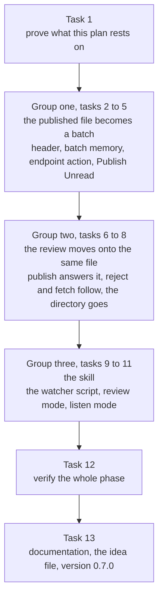

# Claude Remarks: Phase 10 Implementation Plan

**One file, one acknowledgement, one watcher.**

**Status: planned, nothing built.** Branch `claude-remarks-phase1-2`, version `0.6.0`, working tree
clean at `86b483b`, which is the commit that carries the approved spec. There is no git remote.

**The spec is the reasoning; this file is the work.** Everything about why phase 10 looks like this
is in `docs/plans/20260804-claude-remarks-phase10-spec.md`, approved and committed. This plan does
not re-argue any of it. It says what to change, in what order, and how each step is checked. Where a
task needs a decision the spec settled, it names the spec section instead of repeating the argument.

**Citations name symbols, not line numbers.** Same reason as phases 6 to 9: a symbol name survives
the next commit in the same file. The one place line numbers appear is
[section 1](#1-what-is-true-today-checked-not-assumed), where they were read at `86b483b` and are
there to be confirmed, not trusted.

**Nothing has to stay compatible with anything.** One user, no released version anyone runs, no git
remote. So there is no compatibility shim and no fallback branch anywhere in this plan. One exception
stays, as in phase 9: `ClaudeRemarks.CopyAll` and `ClaudeRemarks.AddRemark` keep their ids, because
`README.md` promises they will not be renamed. `ClaudeRemarks.SendToWaiting` carries no such promise
and is removed.

## Contents

1. [What is true today, checked not assumed](#1-what-is-true-today-checked-not-assumed)
2. [The order, and why it is this order](#2-the-order-and-why-it-is-this-order)
3. [Waves](#3-waves)
4. [Validation commands](#4-validation-commands)
5. [Rules that must hold at every step](#5-rules-that-must-hold-at-every-step)
6. [Implementation steps](#6-implementation-steps)
    - [Task 1: Prove what this plan rests on](#task-1-prove-what-this-plan-rests-on)
    - [Group one: the published file becomes a batch](#group-one-the-published-file-becomes-a-batch)
    - [Task 2: The header the merged file carries, and the reader for it](#task-2-the-header-the-merged-file-carries-and-the-reader-for-it)
    - [Task 3: The batch memory, and what an acknowledgement causes](#task-3-the-batch-memory-and-what-an-acknowledgement-causes)
    - [Task 4: The endpoint action that takes a nonce back](#task-4-the-endpoint-action-that-takes-a-nonce-back)
    - [Task 5: Publish records its batch, and Publish Unread replaces Publish All Pending](#task-5-publish-records-its-batch-and-publish-unread-replaces-publish-all-pending)
    - [Group two: the review moves onto the same file](#group-two-the-review-moves-onto-the-same-file)
    - [Task 6: Publishing answers a waiting review, and the three send controls go](#task-6-publishing-answers-a-waiting-review-and-the-three-send-controls-go)
    - [Task 7: A rejection and a fetch use the one file](#task-7-a-rejection-and-a-fetch-use-the-one-file)
    - [Task 8: The review's own directory goes](#task-8-the-reviews-own-directory-goes)
    - [Group three: the skill](#group-three-the-skill)
    - [Task 9: The watcher script](#task-9-the-watcher-script)
    - [Task 10: Review mode waits with the watcher](#task-10-review-mode-waits-with-the-watcher)
    - [Task 11: The one-shot read, and listen mode](#task-11-the-one-shot-read-and-listen-mode)
    - [Task 12: Verify the whole phase](#task-12-verify-the-whole-phase)
    - [Task 13: Documentation, the idea file, and the version](#task-13-documentation-the-idea-file-and-the-version)
7. [Known limits to record](#7-known-limits-to-record)
8. [Hand checks](#8-hand-checks)

## 1. What is true today, checked not assumed

Read at `86b483b`. [Task 1](#task-1-prove-what-this-plan-rests-on) confirms each of these before any
work starts, because a plan built on a stale reading ships the stale reading.

- **Three send controls, not one.** The banner link "Send remarks" at
  `ui/RemarksToolWindowFactory.kt:115`, the toolbar button "Send to Claude Code" at
  `ui/RemarksToolWindowFactory.kt:468`, and the Tools menu action `ClaudeRemarks.SendToWaiting` at
  `plugin.xml:70`. All three call `sendToWaitingReview`.
- **Phase 7's two guards are both in `review/SendReview.kt`.** The refusal of a second send at line
  33, inside `sendToWaitingReview`. The refusal to overwrite after a send at line 134, inside
  `rejectWaitingReview`. `review/WaitingReview.kt`'s `markSent` has no phase guard of its own and
  needs no relaxing.
- **`publishedHeader` has exactly one caller**, the `writeFailure` block in
  `action/PublishRemarks.kt`'s `publishRemarks`.
- **`EditorNotificationPanel` puts its text in a plain `JLabel` at `BorderLayout.CENTER` and its
  action links in a separate panel at `BorderLayout.EAST`.** Read from
  `~/dev/oss/intellij-community/platform/platform-api/src/com/intellij/ui/EditorNotificationPanel.java`.
  That is why the two-line banner in [task 6](#task-6-publishing-answers-a-waiting-review-and-the-three-send-controls-go)
  is one `<html>` string with a `<br>`, and why the Reject link sits at the right edge.
- **The endpoint's fetch tests build the fixture project's base directory on disk** before comparing
  paths, in `ReviewEndpointSmokeTest.projectPath()`. So `projectIdentity(project)` really does
  resolve inside that test class, which is what makes the published file reachable from a test at
  all. See the test-mode directory in [task 2](#task-2-the-header-the-merged-file-carries-and-the-reader-for-it).

## 2. The order, and why it is this order



**Three things decide this order, and each of them would bite if the order were different.**

**The acknowledgement lands before Publish Unread does.** Change one on its own makes every publish
bigger than the last, because nothing except a review acknowledgement produces `READ`. So the batch
memory (task 3) and the endpoint action (task 4) come first, and the filter flips to "not read" only
in task 5, in the same task that starts recording batches. There is no commit in this plan where
Publish Unread exists and no acknowledgement route does.

**The file's shape lands before anything reads it.** The header and its reader are task 2. Every
later task either writes that header (tasks 5, 6, 7) or reads it (tasks 7, 9, 10, 11). Writing the
skill against a header that is still moving is how phase 9 nearly wrote its skill task against a
guess, and its own section 6 says so.

**The review path moves in one direction, writers before readers.** Task 6 makes publish the thing
that answers a review and removes the three send controls in the same task, so there is never a
commit where two different controls answer the same review into two different files. Task 7 then
moves the rejection and the fetch onto the file publish is already writing. Task 8 deletes the
directory nothing uses any more. Doing task 8 earlier would break tasks 6 and 7 at compile time;
doing task 7 before task 6 would leave a commit where a fetch reads a file that nothing writes.

**One transitional state is accepted and named.** Between task 6 and task 7, a rejection is still
written into the review's temporary directory while a review's answer is written into the published
file. A remote agent in that window can fetch an answer but not a rejection. It lasts one task, no
version is released inside it, and each task's own tests are honest about what its own code does.

**Group boundaries are shipping points.** Each group ends with the suite green, all six guards empty,
and a commit that could stand on its own. Group one leaves the published path complete on the plugin
side. Group two leaves the review path complete. Group three makes the skill use both.

## 3. Waves

**No waves. Every task runs in sequence.**

The reason in one line: after task 1, no two tasks in this plan have disjoint `Files:` blocks.

The detail, because "no waves" is a decision and not a default. Tasks 2, 5 and 6 all edit
`action/PublishRemarks.kt`. Tasks 4, 7 and 8 all edit `review/ReviewRestService.kt`. Tasks 6, 7 and 8
all edit `review/SendReview.kt`. Tasks 9, 10 and 11 all edit
`docs/skill/claude-remarks-review/SKILL.md`. Tasks 3 and 13 both edit `CLAUDE.md`, which is a
registration point in the sense that matters here: two agents editing it at once produce a conflict
nobody reviewed. The two tasks that look independent are the watcher script (task 9) and the endpoint
action (task 4), and both are written against the header shape task 2 settles, so neither can start
before it.

## 4. Validation commands

**The narrow command per task.** Run the one that belongs to the task, not the suite. Every gradle
run is FOREGROUND with a 600000 ms timeout. Never backgrounded.

| Task | Command |
| --- | --- |
| 2 | `./gradlew test --tests "dev.sasha.clauderemarks.review.PublishedRemarksTest"` |
| 3 | `./gradlew test --tests "dev.sasha.clauderemarks.review.PublishedAckTest"` |
| 4 | `./gradlew test --tests "dev.sasha.clauderemarks.review.ReviewEndpointSmokeTest"` |
| 5 | `./gradlew test --tests "dev.sasha.clauderemarks.action.PublishRemarksTest" --tests "dev.sasha.clauderemarks.ui.RemarksPanelTest" --tests "dev.sasha.clauderemarks.action.ActionIdsTest"` |
| 6 | `./gradlew test --tests "dev.sasha.clauderemarks.review.SendReviewTest" --tests "dev.sasha.clauderemarks.ui.RemarksPanelTest"` |
| 7 | `./gradlew test --tests "dev.sasha.clauderemarks.review.SendReviewTest" --tests "dev.sasha.clauderemarks.review.ReviewEndpointSmokeTest"` |
| 8 | `./gradlew test --tests "dev.sasha.clauderemarks.review.WaitingReviewTest" --tests "dev.sasha.clauderemarks.review.WaitingReviewServiceTest" --tests "dev.sasha.clauderemarks.review.ReviewEndpointSmokeTest"` |
| 9 to 11 | no gradle. The checks are shell runs, written out inside each task. |
| 12 | the wide gate below |
| 13 | the wide gate below |

**The wide gate**, run in tasks 12 and 13 only:

```bash
./gradlew build
./gradlew verifyPluginProjectConfiguration
./gradlew verifyPlugin
```

**The six guards**, run at the end of every task. Every one must print nothing.

```bash
grep -rn "com.intellij" src/main/kotlin/dev/sasha/clauderemarks/anchor/
grep -rn "com.intellij" src/main/kotlin/dev/sasha/clauderemarks/render/PromptRenderer.kt
grep -rn "RemarkStore\.getInstance([^)]*)\." src/main --include='*.kt' \
  | grep -v RemarkEdits.kt | grep -v "\.all()"
grep -rnE "WriteCommandAction|WriteAction\.|runWriteAction|insertString|replaceString|deleteString|[Dd]ocument\.setText|setBinaryContent" src/
grep -rnE "invokeAndWait|projectRoot\(|FileEditorManager|VfsUtil|SwingUtilities" \
  src/main/kotlin/dev/sasha/clauderemarks/review/ReviewRestService.kt
grep -rn "markRemarksRead(" src/main --include='*.kt' \
  | grep -v "store/RemarkEdits.kt" | grep -v "review/SendReview.kt" | grep -v "review/PublishedAck.kt"
```

The sixth one gains its third exclusion in [task 3](#task-3-the-batch-memory-and-what-an-acknowledgement-causes),
which is also the task that writes the reason into `CLAUDE.md`. Before task 3, run it with two
exclusions, as `CLAUDE.md` still has it.

**Quote every grep glob**, `--include='*.kt'`. Unquoted, zsh expands it before grep runs, fails the
line with "no matches found", and prints nothing. Nothing printed looks exactly like a guard that
passed.

## 5. Rules that must hold at every step

- **Never write remarks into a source file.** Remarks live in IDE-side state only, and nothing
  remark-related enters version control. Guard 4 is the mechanical half of this.
- **Threading.** EDT for UI. `ReadAction` for `Document` and PSI reads. Nothing slow on the EDT. The
  publish's file work stays inside the `finishOnUiThread` block, never inside the read action, for
  the reason `docs/claude/design.md` gives: a non-blocking read action is cancelled and re-run
  whenever a write action asks for the lock, so a file write in there leaves a stray file on every
  retry.
- **The endpoint runs on a netty IO thread.** Guard 5 keeps the VFS, Swing and `invokeAndWait` out of
  `review/ReviewRestService.kt`. Plain `java.nio` calls are fine there and always were. Anything an
  acknowledgement causes goes through `invokeLater` from `review/PublishedAck.kt`, the same way
  `review/SendReview.kt`'s `reportLater` already does.
- **Guard 5's comment trap is still live.** The grep is line-based and cannot tell a comment from
  code, so no comment inside `ReviewRestService.kt` may name any of the five forbidden symbols, even
  to say they are absent.
- **Guard 6 gains one allowed caller and no more.** `review/PublishedAck.kt`. `CLAUDE.md` has to say
  why: there are now two acknowledgement routes, one keyed to a review session and one keyed to a
  batch nonce, and a publish is still neither of them.
- **Every task ends green.** No task may leave the tree not compiling, a test failing or a guard
  tripping at its own boundary. `/planning:exec` drives task by task and does not compile in between,
  so a red tree at a boundary is invisible to the driver and the next task's failure cannot be
  attributed to either side. Where that forces two pieces of work into one task, the task says so.
  Task 6 is the one with that shape in this plan.
- **Every task's tests are judged by mutation.** Each test checkbox names the change to production
  code that must make it fail. A test that stays green under an obviously broken implementation is
  not accepted.
- **Do not run `./gradlew runIde`.** It starts an interactive sandbox IDE that never exits. Every
  check that needs one is in [section 8](#8-hand-checks) for a person to run.

## 6. Implementation steps

### Task 1: Prove what this plan rests on

**Model:** sonnet

**Files:**
- Read only. This task changes no file and makes no commit.

Every number and fact below is recorded in this task's result note, so a later task can compare
against it rather than guess.

- [x] record the baseline test counts two ways, because they measure different things and both are
      quoted later: the executed count from `build/test-results/test/*.xml` after
      `./gradlew test`, and the declaration count from
      `grep -rc "    fun test\|    fun \`" src/test --include='*.kt'` summed. **Executed: 461.
      Declared: 464.** (`./gradlew test` reported `UP-TO-DATE`, so the executed count is read from
      the existing `build/test-results/test/*.xml`, the same result the last real run produced —
      re-running would not change it.)
- [x] run all six guards from [section 4](#4-validation-commands), with the sixth in its current
      two-exclusion form, and record that each printed nothing. **All six printed nothing.**
- [x] confirm the three send controls are still where
      [section 1](#1-what-is-true-today-checked-not-assumed) says: `grep -n "Send remarks\|Send to Claude Code" src/main/kotlin/dev/sasha/clauderemarks/ui/RemarksToolWindowFactory.kt`
      and `grep -n "SendToWaiting" src/main/resources/META-INF/plugin.xml`. **Confirmed**, both at
      the lines section 1 names.
- [x] confirm `publishedHeader` still has exactly one caller:
      `grep -rn "publishedHeader" src/main --include='*.kt'`. **Confirmed**: the declaration in
      `review/PublishedRemarks.kt:38`, and one import plus one call site in
      `action/PublishRemarks.kt`.
- [x] confirm phase 7's two guards are both in `review/SendReview.kt` and that
      `review/WaitingReview.kt`'s `markSent` has no phase check of its own. Read both functions.
      **Confirmed.** The second-send refusal is `sendToWaitingReview`'s
      `if (waiting.phase is ReviewPhase.Sent)` at line 33, and the overwrite-after-send refusal is
      `rejectWaitingReview`'s `if (waiting.phase is ReviewPhase.Sent)` at line 134 — both exactly
      where section 1 says. `markSent` unconditionally does
      `state = acting.copy(phase = ReviewPhase.Sent(ids))` once the session id matches; it reads no
      phase.
- [x] read `platform/platform-api/src/com/intellij/ui/EditorNotificationPanel.java` in
      `~/dev/oss/intellij-community` and confirm two things the banner work depends on: `setText`
      feeds a plain `JLabel`, and action links go into a separate panel added at
      `BorderLayout.EAST`. If either has changed, say so plainly and stop, because
      [task 6](#task-6-publishing-answers-a-waiting-review-and-the-three-send-controls-go)'s wording
      is written against them. **Both confirmed, unchanged.** `setText(text)` is
      `myLabel.setText(text)` where `myLabel` is a plain `JLabel` field. Action links go into
      `myLinksPanel` (`createActionLabel` adds to it), and the constructor adds that panel with
      `panel.add(BorderLayout.EAST, myLinksPanel)`.
- [x] no commit: nothing changed.

### Group one: the published file becomes a batch

### Task 2: The header the merged file carries, and the reader for it

**Model:** sonnet

**Files:**
- Modify: `src/main/kotlin/dev/sasha/clauderemarks/review/PublishedRemarks.kt`. Replace
  `fun publishedHeader(now, commit, count)` and the private `PUBLISHED_WHEN` formatter with a
  `data class PublishedHeader` plus `render()`, add `publishedHeaderOf`, add the private label
  sanitizer. `PUBLISHED_MARKER`, `publishedName` and `writePublished` keep their current bodies.
- Modify: `src/main/kotlin/dev/sasha/clauderemarks/review/ReviewHandshake.kt`, the body of
  `fun handshakeDir()`, which gains the unit-test branch below.
- Modify: `src/main/kotlin/dev/sasha/clauderemarks/action/PublishRemarks.kt`, the
  `val writeFailure = if (prepared.root == null)` block inside `publishRemarks`, which is the only
  caller of `publishedHeader`.
- Modify: `src/test/kotlin/dev/sasha/clauderemarks/review/PublishedRemarksTest.kt`, the two header
  tests `the header starts with the marker and carries the time, the commit and the count` and
  `a header with no commit says so rather than printing an empty field`.

The header is eight fixed lines in a fixed order, every field always written, `none` when there is
nothing to say. Section 4 of the spec says why fixed lines matter: the skill reads them by line
number, and grepping for them is unsafe because a remark's own text can start a line with `commit:`.

```kotlin
data class PublishedHeader(
    val nonce: String,
    val publishedAt: Long,
    val commit: String?,
    val remarks: Int,
    val reviewSession: String?,
    val reviewLabel: String?,
    val rejected: Boolean,
) {
    /** The eight lines, in order, ending with a newline. The caller adds the blank line. */
    fun render(): String
}

/** The eight fields back, or null when the first line is not the marker or a line is malformed. */
fun publishedHeaderOf(text: String): PublishedHeader?
```

Two details that are not free choices:

- **The label is sanitized inside `render()`.** Every character below U+0020 becomes a space, then
  the result is cut to 120 characters. The label arrives over HTTP from the skill, and one newline in
  it would split the header and move every line after it. 120 is the same cut the banner already
  makes in `ui/RemarksToolWindowFactory.kt`'s `updateBanner`.
- **`publishedHeaderOf` is strict.** A missing prefix on any of lines 2 to 8, or a `remarks:` value
  that is not an integer, returns null. A lie is not a better answer than an error, and the fetch in
  [task 7](#task-7-a-rejection-and-a-fetch-use-the-one-file) turns null into `failed` with a detail.

**`handshakeDir()` gains a unit-test branch, and this is what makes the rest of the phase testable.**

```kotlin
fun handshakeDir(): Path =
    if (ApplicationManager.getApplication()?.isUnitTestMode == true)
        Path.of(System.getProperty("java.io.tmpdir"), "claude-remarks-test")
    else Path.of(System.getProperty("user.home"), ".claude-remarks")
```

The endpoint computes the published file's path itself, so a test that drives `execute` cannot pass a
directory in through an HTTP request. Without this branch, `ReviewEndpointSmokeTest` would write real
files into the developer's own `~/.claude-remarks`. `ReviewHandshakeService.start()` already returns
early in test mode for exactly this reason, so the motivation and the mechanism both have a
precedent in this file. The alternative considered and rejected: an internal mutable
`publishedDirForTests` that each test sets and restores, which is a global that a forgotten
`tearDown` leaves pointing at the wrong place.

- [x] write the failing tests in `PublishedRemarksTest`:
  - `the header renders eight lines in a fixed order`. A fixed `publishedAt`, a 40 character sha, a
    review session and label. Assert the exact eight lines, the commit cut to eight characters, and
    that line 1 is `PUBLISHED_MARKER`.
  - `a header with nothing to say writes none rather than an empty field`. Null commit, null review
    session, null label. Three `none` values, and `rejected: no`.
  - `a label with a newline stays on one line, and a long label is cut`. A label holding `\n` and
    200 characters. Assert the rendered header still has eight lines and that the label line is at
    most 120 characters past its prefix.
  - `a rendered header reads back as the same fields`. `publishedHeaderOf(render())` equals the
    original, with the label already sanitized.
  - `a body that does not start with the marker reads back as null`.
  - `a header with a line out of order reads back as null`. Swap `commit:` and `remarks:`.
  - `a header whose count is not a number reads back as null`.
- [x] run `./gradlew test --tests "dev.sasha.clauderemarks.review.PublishedRemarksTest"` and expect a
      compile failure
- [x] implement `PublishedHeader`, `render`, `publishedHeaderOf` and the sanitizer, then update the
      one caller in `publishRemarks` to build a `PublishedHeader` with a fresh
      `UUID.randomUUID().toString()` nonce, the head commit, the count, and null, null, false for the
      review fields. Nothing records a batch yet; that is
      [task 5](#task-5-publish-records-its-batch-and-publish-unread-replaces-publish-all-pending).
- [x] implement the `handshakeDir()` test branch
- [x] the narrow command passes, and `./gradlew test --tests "dev.sasha.clauderemarks.review.ReviewHandshakeTest"`
      still passes, since it is the class that would notice a broken `handshakeDir`
- [x] **mutation:** drop the marker line from `render()`; the first test and the round-trip test must
      fail. Let the sanitizer keep the newline; the label test must fail. Make `publishedHeaderOf`
      accept a header with a line out of order; that test must fail. Restore all three.
- [x] all six guards print nothing
- [x] commit: `feat: the published file's header names the batch it carries`

### Task 3: The batch memory, and what an acknowledgement causes

**Model:** sonnet

**Files:**
- Create: `src/main/kotlin/dev/sasha/clauderemarks/review/PublishedAck.kt`, holding
  `PublishedAckOutcome`, `PublishedBatch`, `PublishedAckAnswer`, `PublishedBatchService` and
  `reportPublishedRead`.
- Create: `src/test/kotlin/dev/sasha/clauderemarks/review/PublishedAckTest.kt`.
- Modify: `CLAUDE.md`, the numbered guard beginning
  `6. **Only \`store/RemarkEdits.kt\` and \`review/SendReview.kt\` may call \`markRemarksRead\`.**` —
  its title, its prose and its grep.

```kotlin
enum class PublishedAckOutcome { OK, ALREADY_READ, UNKNOWN_BATCH }

/** One published batch: what it carried, and who said they read it. */
data class PublishedBatch(
    val nonce: String,
    val ids: List<String>,
    val writtenAt: Long,
    val readBy: String? = null,
    val readAt: Long = 0,
)

/** What the endpoint needs to write its answer. [readBy] and [readAt] are set for ALREADY_READ. */
data class PublishedAckAnswer(
    val outcome: PublishedAckOutcome,
    val remarks: Int = 0,
    val readBy: String? = null,
    val readAt: Long = 0,
)
```

`PublishedBatchService` is `@Service(Service.Level.PROJECT)`, in memory only, holding at most
`MAX_REMEMBERED_BATCHES = 16` batches, oldest dropped first. `record(nonce, ids)` and
`acknowledge(nonce, session)` are both `@Synchronized`, because `record` is called from the EDT and
`acknowledge` from a netty IO thread. There is no unsynchronized reader here, so this service needs
none of the reasoning `WaitingReviewService.current()` carries.

An acknowledged batch is kept, not removed. That is what lets a second session get `already-read`
naming the first session instead of `unknown-batch`, which is the distinction section 7 of the spec
turns into a rule the skill acts on.

`reportPublishedRead(project, nonce, session): PublishedAckAnswer` is the endpoint's only entry
point. It calls `acknowledge`, and on `OK` it queues the store change and the balloon with
`ApplicationManager.getApplication().invokeLater`, checking `project.isDisposed` inside the queued
runnable, exactly as `review/SendReview.kt`'s `reportLater` does. The balloon reads
`Claude Code read N remarks.` where N is the batch size.

**The `invokeLater` is load-bearing and not decoration.** It is what stops a fast acknowledgement
from landing between the publish's file write and its `markRemarksPublished` call, which would set
`READ` and then have it immediately overwritten back to `PUBLISHED`. Both run on the EDT, so the
acknowledgement queues behind the publish that is still finishing.

- [x] write the failing tests in `PublishedAckTest`, fixture-backed (`BasePlatformTestCase`), clearing
      `RemarkStore` in `setUp` and `tearDown` because the light fixture project is shared across test
      classes:
  - `an acknowledgement of a recorded batch answers ok and marks its remarks read`. Add two remarks,
    record a batch of both, acknowledge, `UIUtil.dispatchAllInvocationEvents()`, then assert both are
    `READ` and the answer says two.
  - `a second session acknowledging the same batch is told who was first`. `ALREADY_READ`, carrying
    the first session id.
  - `the same session acknowledging twice is told it was itself`. `ALREADY_READ` naming that same
    session, which is how the skill tells a retry from an anomaly.
  - `a nonce nothing recorded answers unknown-batch and marks nothing`.
  - `only the last sixteen batches are remembered`. Record seventeen, then acknowledge the first:
    `UNKNOWN_BATCH`. Acknowledge the second: `OK`.
  - `an acknowledgement marks only its own batch`. Two batches, acknowledge the older one, and the
    newer one's remarks stay `PUBLISHED`.
- [x] run `./gradlew test --tests "dev.sasha.clauderemarks.review.PublishedAckTest"` and expect a
      compile failure
- [x] implement `PublishedAck.kt`, then the narrow command passes
- [x] widen guard 6 in `CLAUDE.md`: add `review/PublishedAck.kt` to the title and to the grep's
      exclusions, and rewrite the prose so it says what `READ` now means. It means an agent said it
      read the remarks. There are two acknowledgement routes, one keyed to a review session and one
      keyed to a batch nonce, both of them answers to something the IDE minted. A publish is still
      neither, however many times it runs. Keep the "one way past it, named rather than patched"
      paragraph as it is.
- [x] **mutation:** remove the batch from the list on acknowledgement instead of marking it read; the
      second-session test must fail with `UNKNOWN_BATCH`. Raise `MAX_REMEMBERED_BATCHES` to 17; the
      retention test must fail. Restore both. Then a third mutation with a different outcome: call
      `markRemarksRead` straight from `reportPublishedRead` instead of inside `invokeLater`. **No
      test catches this**, because a fixture test already runs on the EDT, and no guard catches it
      either, since the grep for that rule only reads `ReviewRestService.kt`. Say so plainly in the
      report and restore it. The rule survives as the comment in the code and as the ordering
      paragraph above, and nothing stronger is available.
- [x] all six guards print nothing, the sixth now with three exclusions
- [x] commit: `feat: the plugin remembers the batches it published and what reading one means`

### Task 4: The endpoint action that takes a nonce back

**Model:** sonnet

**Files:**
- Modify: `src/main/kotlin/dev/sasha/clauderemarks/review/ReviewRestService.kt`: the class KDoc's
  list of actions and answers, the `when (action)` inside `execute`, a new private
  `PublishedReadRequest` beside `FetchRequest`, and a new private `handlePublishedRead` after
  `handleFetch`.
- Modify: `src/test/kotlin/dev/sasha/clauderemarks/review/ReviewEndpointSmokeTest.kt`, adding tests
  beside the existing fetch ones.

`POST /api/claude-remarks/published-read`, body `{project, nonce, session}`. All three are required;
missing or blank is `bad-request`. `session` is a value the calling session invents for itself. The
endpoint never handed it out and never checks it. It is a name to report back, which is what lets a
second session say who got there first.

Answers: `ok` with `remarks`; `already-read` with `remarks`, `session` and `readAt`;
`unknown-batch`; `unknown-project`; `bad-request`. The handler does nothing but parse, call
`matchProject`, call `reportPublishedRead` and write fields. Every consequence lives in
`review/PublishedAck.kt`, for guard 5.

- [x] write the failing tests in `ReviewEndpointSmokeTest`:
  - `a published-read for a recorded batch answers ok and marks the remarks read`. Record through
    `PublishedBatchService`, post, `UIUtil.dispatchAllInvocationEvents()`, assert `READ`.
  - `a second published-read for the same batch answers already-read and names the first session`.
  - `a published-read for a nonce nothing recorded answers unknown-batch`.
  - `a published-read with no nonce answers bad-request`.
  - `a published-read for a project nothing has open answers unknown-project`.
- [x] run `./gradlew test --tests "dev.sasha.clauderemarks.review.ReviewEndpointSmokeTest"` and expect
      a compile failure
- [x] implement, then the narrow command passes
- [x] **mutation:** remove the `"published-read"` branch from `execute`'s `when`; every new test must
      fail with `bad-request` from the unknown-action branch. Make `handlePublishedRead` accept a
      blank nonce; the bad-request test must fail. Restore both.
- [x] all six guards print nothing. Guard 5 matters most here: nothing added to this file may name
      the VFS, Swing or `invokeAndWait`, in code or in a comment.
- [x] commit: `feat: an agent can tell the IDE it read a published batch`

### Task 5: Publish records its batch, and Publish Unread replaces Publish All Pending

**Model:** sonnet

**Files:**
- Modify: `src/main/kotlin/dev/sasha/clauderemarks/action/PublishRemarks.kt`: the filter line in
  `prepare` reading `if (wanted == null) row.remark.status == RemarkStatus.PENDING`, the
  `finishOnUiThread` block in `publishRemarks` where the header is built, and
  `PublishAllRemarksAction.update`.
- Modify: `src/main/kotlin/dev/sasha/clauderemarks/ui/RemarksToolWindowFactory.kt`, the
  `ToolbarAction("Publish All Pending", ...)` entry inside `toolbarActions`.
- Modify: `src/main/resources/META-INF/plugin.xml`, the `text` and `description` attributes of the
  `ClaudeRemarks.CopyAll` action. The id itself does not change.
- Modify: `src/test/kotlin/dev/sasha/clauderemarks/action/PublishRemarksTest.kt`, the tests that
  drive `prepare`.
- Modify: `src/test/kotlin/dev/sasha/clauderemarks/ui/RemarksPanelTest.kt`, any test naming the
  toolbar button by its old label.

Three changes, and they belong together because the third is only safe once the first two exist.

1. `prepare`'s null-`ids` branch filters on `row.remark.status != RemarkStatus.READ` instead of
   `== RemarkStatus.PENDING`. Publish Selected is untouched: it uses the ids it was given.
2. The `finishOnUiThread` block records the batch through `PublishedBatchService` **before** it
   writes the file. A fast agent can read the file and acknowledge within milliseconds, and a batch
   recorded after the write would answer `unknown-batch` to an acknowledgement that was correct. If
   the write then fails, the recorded batch is simply unreachable, which costs nothing.
3. The label becomes **Publish Unread**, in the toolbar, in the Tools menu entry and in its
   description. The enablement condition becomes "any remark that is not `READ`" in both
   `toolbarActions` and `PublishAllRemarksAction.update`.

`ActionIdsTest.testClaudeRemarksCopyAllsLabelStartsWithPublish` keeps passing without an edit,
because "Publish Unread Claude Remarks" still starts with Publish. Run it anyway, in the narrow
command, so that is a fact rather than an assumption.

- [x] write the failing tests in `PublishRemarksTest`:
  - `a publish with no ids takes every remark that is not read`. Three remarks, one `PENDING`, one
    `PUBLISHED`, one `READ`. `prepare(project, null)` returns the first two.
  - `a publish with ids takes exactly those, read ones included`.
- [x] update the toolbar test in `RemarksPanelTest` to the new label, and add
      `the publish button is offered while any remark is not read` if no test covers the enablement.
      (No test in `RemarksPanelTest` named the toolbar button by its old label — grep confirmed no
      occurrence of "Publish All Pending" there — so nothing needed updating in that file for this
      task.)
- [x] run `./gradlew test --tests "dev.sasha.clauderemarks.action.PublishRemarksTest" --tests "dev.sasha.clauderemarks.ui.RemarksPanelTest" --tests "dev.sasha.clauderemarks.action.ActionIdsTest"`
      and expect a failure
- [x] implement all three changes, then the narrow command passes
- [x] **mutation:** put the filter back to `== RemarkStatus.PENDING`; the first new test must fail.
      Move the batch recording to after the file write; no test catches it, because the publish
      pipeline is asynchronous and is not driven from a test, so say that plainly in the report and
      leave the ordering comment in the code as the only guard. Restore both.
- [x] all six guards print nothing
- [x] commit: `feat: Publish Unread carries everything an agent has not read, and names its batch`

### Group two: the review moves onto the same file

### Task 6: Publishing answers a waiting review, and the three send controls go

**Model:** opus

This is the largest task in the plan, and it is one task on purpose. Splitting it would leave a
commit where two different controls answer the same review into two different files. See
[section 2](#2-the-order-and-why-it-is-this-order).

**Files:**
- Modify: `src/main/kotlin/dev/sasha/clauderemarks/review/SendReview.kt`: delete
  `sendToWaitingReview`, `canSend` and `SendReviewAction`; add `answerWaitingReview`.
  `REJECTED_MARKER`, `REJECTION_BODY`, `rejectWaitingReview`, `finishReview`, `expireStaleReview` and
  `reportReviewEnd` stay untouched in this task.
- Modify: `src/main/kotlin/dev/sasha/clauderemarks/action/PublishRemarks.kt`, the `finishOnUiThread`
  block where the header is built, and `publishMessage`.
- Modify: `src/main/kotlin/dev/sasha/clauderemarks/ui/RemarksToolWindowFactory.kt`: the `banner`
  property initialiser, which drops its `createActionLabel("Send remarks")` line; `updateBanner`,
  which gets the new two-line text; and `toolbarActions`, which drops its
  `ToolbarAction("Send to Claude Code", ...)` entry. Also the `import` lines for `canSend` and
  `sendToWaitingReview`.
- Modify: `src/main/resources/META-INF/plugin.xml`, the whole `<action id="ClaudeRemarks.SendToWaiting" ...>`
  element and the comment above it that begins `Same reachability as ClaudeRemarks.CopyAll`.
- Modify: `src/test/kotlin/dev/sasha/clauderemarks/review/SendReviewTest.kt`: the tests named
  `testSendingWritesTheWholePromptToTheWaitingReviewsOutputPath`,
  `testSendingMarksNothingUntilTheAgentAcknowledges`,
  `testSendingKeepsTheReviewAndRecordsWhatWasWritten`,
  `testAFailedWriteMarksNothingSentAndLeavesTheReviewWaiting`,
  `testSendingWithNothingPendingLeavesTheReviewWaitingAndWritesNoFile`,
  `testASecondSendWhileWaitingForTheAcknowledgementIsRefused`,
  `testASendWhoseReviewEndedMidRenderDoesNotOverwriteTheRejection` and
  `testCanSendIsTrueWhileWaitingAndFalseOnceTheRemarksAreSent`.
- Modify: `src/test/kotlin/dev/sasha/clauderemarks/ui/RemarksPanelTest.kt`, the tests
  `testTheBannerShowsTheWaitingLabel` and `testTheBannerSaysTheRemarksAreWaitingToBeReadAfterASend`.

**What replaces the send.** One function in `review/SendReview.kt`, so the coupling has a test:

```kotlin
/** What a publish does about a waiting review. Null when none is waiting. */
internal fun waitingReviewForPublish(project: Project): WaitingReviewState?

/** Records that this publish answered [session], and says what to add to the balloon. */
internal fun answerWaitingReview(project: Project, session: String, ids: List<String>): String?
```

`waitingReviewForPublish` is `WaitingReviewService.current()`, named so the publish reads one
function rather than reaching into the service. `answerWaitingReview` calls `markSent(session, ids)`
and returns the sentence the balloon adds: null when the stamp succeeded and the review is simply
waiting to read them, and the "the review ended first" sentence when `markSent` returned false. The
publish calls the first before it builds the header and the second after the file write succeeded.
Nothing is stamped when the write failed, because nothing was handed over on that path.

**Why this is testable when the publish pipeline is not.** The pipeline is asynchronous and phase 9
recorded that driving it in a light fixture buys a flaky test. These two functions are ordinary calls
against a project service, so `SendReviewTest` drives them directly and the coupling that change four
rests on stops being untested.

**The banner.** Two lines, decided in section 8 of the spec:

```
Claude Code is waiting: <label>
Publish to answer, or Reject.
```

`EditorNotificationPanel.setText` feeds a plain `JLabel`, so the two lines are one `<html>` string
with a `<br>` between them, and the label keeps the escaping and the 120 character cut it has today.
`StringUtil.escapeXmlEntities` on the label is what stops caller-supplied text from injecting Swing
markup, and wrapping the whole string in `<html>` deliberately does not weaken that: the label is
escaped first, then placed inside. The Reject link keeps its `createActionLabel` and sits at the
right edge of the panel, which is where the panel puts every link. The second line therefore reads
`Publish to answer, or` in the label with `Reject` as the link beside it. If that reads badly at a
real width, the fallback in the spec is `Publish to answer.` with the link unchanged, and the hand
check in [section 8](#8-hand-checks) is what decides.

The `Sent` phase text becomes:
`Published N remarks for Claude Code. Waiting for it to read them. Publish again to add more.`

- [x] write the failing tests in `SendReviewTest`, replacing the eight named above:
  - `answering a waiting review records what was published`. Start a review, call
    `answerWaitingReview`, assert the phase is `Sent` with those ids.
  - `answering a review that already ended says so instead of claiming a handover`. Clear the review
    first, then assert the returned sentence is not null.
  - `answering a review a second time replaces the recorded ids`. This is the behaviour phase 7's
    "already sent" refusal used to forbid, and it is now the normal case.
  - `nothing is marked read until the acknowledgement`. Keep the substance of
    `testSendingMarksNothingUntilTheAgentAcknowledges` against the new path.
  - keep `testRejectingWritesTheMarkerAndClearsTheReview`,
    `testRejectingLeavesEveryRemarkPending`, `testRejectingAfterASendDoesNotOverwriteTheHandoffFile`,
    `testAFailedRejectionStillClearsTheReview` and the three acknowledgement tests exactly as they
    are. They are [task 7](#task-7-a-rejection-and-a-fetch-use-the-one-file)'s to change, not this
    task's.
- [x] update `RemarksPanelTest`'s two banner tests to the new text, and add
      `the banner offers Reject and nothing else`, which reads the panel's links and asserts there is
      exactly one
- [x] run `./gradlew test --tests "dev.sasha.clauderemarks.review.SendReviewTest" --tests "dev.sasha.clauderemarks.ui.RemarksPanelTest"`
      and expect a compile failure
- [x] implement: the two new functions, the publish's two calls, the header's `reviewSession` and
      `reviewLabel` fields filled from the waiting review, the three control removals, the banner
      text, and `publishMessage`'s extra sentence
- [x] the narrow command passes, and `./gradlew test` passes whole. Run the whole suite here even
      though this task's narrow command is smaller: this task deletes public functions, and the
      classes that used them are spread across the suite.
- [x] **mutation:** make `answerWaitingReview` ignore `markSent`'s return value and always answer
      null; the second test must fail. Leave the review fields out of the header; add an assertion in
      the first test that the rendered header names the session, or say plainly that the header
      stamping is only covered by the hand check. Restore.
- [x] all six guards print nothing
- [x] commit: `feat: publishing is how you answer a waiting review, and the Send controls are gone`

### Task 7: A rejection and a fetch use the one file

**Model:** sonnet

**Files:**
- Modify: `src/main/kotlin/dev/sasha/clauderemarks/review/SendReview.kt`: `rejectWaitingReview`, which
  gains a nullable `dir` parameter and writes through `writePublished`; and `REJECTION_BODY`, which
  loses its first marker line. Delete `REJECTED_MARKER`.
- Modify: `src/main/kotlin/dev/sasha/clauderemarks/review/ReviewRestService.kt`: `handleFetch`, and
  `readHandoff`, which becomes `readPublished` over the project's published file. Rename
  `MAX_HANDOFF_BYTES` to `MAX_PUBLISHED_BYTES` and `HandoffRead` to `PublishedRead`. `handoffFile`
  stays for now; [task 8](#task-8-the-reviews-own-directory-goes) removes it.
- Modify: `src/test/kotlin/dev/sasha/clauderemarks/review/SendReviewTest.kt`, the four rejection tests
  named in [task 6](#task-6-publishing-answers-a-waiting-review-and-the-three-send-controls-go).
- Modify: `src/test/kotlin/dev/sasha/clauderemarks/review/ReviewEndpointSmokeTest.kt`, the six fetch
  tests from `testAFetchBeforeTheSendAnswersWaiting` to
  `testAFetchOverTheSizeLimitAnswersTooLargeAndNoContent`.
- Modify: `src/test/kotlin/dev/sasha/clauderemarks/review/ReviewRequestTest.kt`, the `readHandoff`
  tests and its size cap.

**The rejection becomes a batch.** `rejectWaitingReview` builds a `PublishedHeader` with
`rejected = true`, `remarks = 0`, a fresh nonce, and the waiting review's session and label; writes
the header plus `REJECTION_BODY` through `writePublished`; records the batch with an empty id list,
so that "every write to the file records a batch" holds without exception; then clears the review as
it does today. It needs `projectIdentity(project)`, which is a `toRealPath` plus the walk up the tree
for `.git`, on the EDT. That is the same cost `addRemark` already pays there once per remark. A null
identity writes nothing and says so in a red balloon, and the review is still cleared, keeping the
current rule that a banner the person cannot dismiss is worse than a session that waits for its own
deadline.

`dir: Path? = null` is a parameter, not a default argument that resolves `handshakeDir()`, and the
reason is the trap `store/RemarkEdits.kt`'s `clearHandedOverRemarks` already names: Kotlin evaluates
a default argument in the synthetic bridge, before the body runs, so anything it throws escapes the
try. Null means the real directory, resolved inside the try. Only the tests pass a path.

**The phase 7 guard that stays.** Reject in the `Sent` phase still writes nothing and only clears the
review, with the message that the remarks were already published. Its reason changed and the KDoc has
to change with it: a rejection written over the newest batch takes that batch away from any session
that has not read it yet, and pressing Reject after publishing does not clearly mean "take it back".

**The fetch.** In this order:

1. A live review for this session still in `ReviewPhase.Waiting` answers `waiting`.
2. Otherwise read the published file for the matched project, `handshakeDir().resolve(publishedName(identity))`.
   Over the cap, `too-large`. Absent, `no-review`.
3. Parse the header. Null answers `failed` with a detail. If `reviewSession` equals the requested
   session, answer `ready` with the whole content, plus `nonce` and `bytes`. This is also how a
   rejection reaches a remote agent, and the skill reads `rejected: yes` out of the header it was
   handed.
4. Otherwise `no-review`: the file exists but answers somebody else's review, or no review at all.

Reading a file inside `execute` stays allowed. It is plain `java.nio`, the same reason `readHandoff`
and `toRealPath()` are allowed there today. Guard 5's grep does not change.

- [x] write the failing tests, updating the existing ones rather than adding beside them:
  - in `SendReviewTest`: `rejecting writes a rejection batch to the published file` — the header
    reads back with `rejected: yes`, `remarks: 0` and the review's session.
    `rejecting after a publish writes nothing and clears the review` — the file still holds the
    published batch, unchanged. `a failed rejection write still clears the review`, pointed at a
    directory that cannot be created. `rejecting leaves every remark pending`.
  - in `ReviewEndpointSmokeTest`: `a fetch before anything is published answers waiting`;
    `a fetch after the publish carries the whole prompt in the body`, written through
    `writePublished` into the test-mode directory; `a fetch marks nothing read and leaves the review
    alone`; `a fetch still carries a rejection`; `a fetch for a batch that answers another session
    answers no-review`; `a fetch over the size limit answers too-large and no content`;
    `a fetch of a file with a broken header answers failed`.
  - in `ReviewRequestTest`: the `readPublished` size cap tests, renamed with the function.
- [x] run `./gradlew test --tests "dev.sasha.clauderemarks.review.SendReviewTest" --tests "dev.sasha.clauderemarks.review.ReviewEndpointSmokeTest"`
      and expect a failure
- [x] implement, then that command and
      `./gradlew test --tests "dev.sasha.clauderemarks.review.ReviewRequestTest"` both pass
- [x] **mutation:** make the fetch skip the `reviewSession` comparison and answer `ready` for any
      file; the `no-review` test must fail. Make the rejection write leave `rejected` false; the
      first rejection test must fail. Make the reject path write before checking the `Sent` phase;
      the second must fail. Restore all three.
- [x] all six guards print nothing
- [x] commit: `feat: a rejection lands in the published file and a fetch reads it there`

### Task 8: The review's own directory goes

**Model:** sonnet

**Files:**
- Modify: `src/main/kotlin/dev/sasha/clauderemarks/review/WaitingReview.kt`: drop `outputPath` from
  `WaitingReviewState`; drop the `outputPath: () -> Path` supplier from `startOrConflict` and from
  `WaitingReviewService.start`; delete `EndedReview`, the `lastEnded` field and `endedOutputPath`;
  update `endReview`, which no longer records anything; and update the class KDoc's list that begins
  `**Four things here exist for the tests and for nothing else**`, which now names three.
- Modify: `src/main/kotlin/dev/sasha/clauderemarks/review/ReviewRestService.kt`: delete
  `handoffFile`; in `handleStart`, drop the `writer.name("output")` line and the `try`/`catch
  (e: IOException)` around `start`, together with the `failed` answer it produced; update the class
  KDoc's list of answers.
- Modify: `src/test/kotlin/dev/sasha/clauderemarks/review/WaitingReviewTest.kt`, every call to
  `startOrConflict`.
- Modify: `src/test/kotlin/dev/sasha/clauderemarks/review/WaitingReviewServiceTest.kt`: delete
  `testAnEndedReviewsOutputPathIsStillFindableByItsSession`,
  `testADifferentSessionCannotFindTheEndedReviewsPath`,
  `testAReviewSupersededWhileStaleIsStillFindableByItsSession` and
  `testOnlyTheMostRecentlyEndedReviewIsRemembered`; update every other call to `start`.
- Modify: `src/test/kotlin/dev/sasha/clauderemarks/review/ReviewEndpointSmokeTest.kt` and
  `src/test/kotlin/dev/sasha/clauderemarks/review/SendReviewTest.kt`, every `start(...)` call that
  passes a directory.

`start` now does no filesystem work at all, which is why the `failed` answer disappears rather than
being kept for a case that can no longer happen. The supplier's whole argument goes with it: it
existed so that a temp directory was created only on the accepting branch, and there is no directory
to create.

The four deleted tests are not a loss of coverage. They covered a field that existed so a fetch could
still reach a rejection after the review was cleared, and
[task 7](#task-7-a-rejection-and-a-fetch-use-the-one-file) covers the same behaviour end to end
through the published file, which is now where a rejection lives.

- [x] delete the four `endedOutputPath` tests, and update every remaining `start` and
      `startOrConflict` call in the four test classes
- [x] run `./gradlew test --tests "dev.sasha.clauderemarks.review.WaitingReviewTest" --tests "dev.sasha.clauderemarks.review.WaitingReviewServiceTest" --tests "dev.sasha.clauderemarks.review.ReviewEndpointSmokeTest"`
      and expect a compile failure
- [x] implement the deletions, then that command passes and `./gradlew test` passes whole
- [x] **mutation:** none for a deletion. Instead, confirm by grep that nothing still names the removed
      symbols: `grep -rn "outputPath\|endedOutputPath\|handoffFile\|lastEnded" src/ --include='*.kt'`
      must print nothing.
- [x] all six guards print nothing
- [x] commit: `refactor: one handover file, so the review keeps no directory of its own`

### Group three: the skill

### Task 9: The watcher script

**Model:** sonnet

**Files:**
- Create: `docs/skill/claude-remarks-review/watch-remarks.sh`, committed executable.
- Modify: `docs/skill/claude-remarks-review/SKILL.md`, a new section after `## Over SSH: the IDE on
  another machine` documenting the script's arguments, its output and its exit codes.

**Why a script and not a block of shell.** A background command is one launch line. A block the agent
retypes per call is a block the agent can quietly reword, and the one wording that matters is the
loop that has to terminate.

**The mechanic the whole task rests on.** A foreground Bash call is capped at ten minutes. A
background command has no such cap, keeps running across turns, and re-invokes the session when it
**exits**. So the watcher must exit on its event and must never loop forever. A background command
that never exits never notifies, and the session waits for a signal that cannot arrive. That exact
mistake has already stalled an agent in this project.

**Interface.**

```
watch-remarks.sh --file <path> [--seen <nonce>] [--require-review <session>]
                 [--deadline <seconds>] [--poll <seconds>]
watch-remarks.sh --fetch <base_url> --session <id> --project <path>
                 [--seen <nonce>] [--deadline <seconds>] [--poll <seconds>]
```

- `--file` is the local branch: poll the published file, default every 2 seconds.
- `--fetch` is the remote review branch: poll `POST /api/claude-remarks/fetch`, default every 5
  seconds, because the built-in server allows 30 requests a minute from one address.
- `--seen` is the nonce already known. Empty means any batch is new.
- `--require-review` makes the watcher wait until the batch's `review:` field equals that session.
- `--deadline` defaults to 1800 seconds. Listen mode passes 43200, which is twelve hours.

**The token never appears in the arguments.** It is read from `CLAUDE_REMARKS_TOKEN` in the
environment. An argument is visible to every process on the machine through `ps`, and the token is
the only gate on the endpoint.

**Exit codes.** 0 and the whole file on stdout, header included, when a new batch arrived. 1 and one
sentence when the deadline passed. 2 and a reason for anything wrong: a file it cannot read, a header
whose first line is not the marker or whose line 2 does not start with `nonce: `, an HTTP status it
cannot use, or a `too-large` answer.

**The copy that closes a race.** The watcher sees a new nonce and then reads the file. A third
publish landing in between would make it print one batch while reporting another batch's nonce. So it
copies the file once with `cp` and reads the nonce out of the copy. `cp` opens an inode and a rename
does not truncate the inode it replaces, so the copy is always one whole batch, old or new.

**The pid file.** On start the script writes its own pid to
`~/.claude-remarks/<the same 16 hex characters>.watch`, creating the directory `rwx------` if the
plugin has never run on this machine. Before writing it reads any pid already there, checks the
process really is a watcher for this project rather than a recycled pid, and kills it. One watcher
per project on the machine, whichever session started it. It removes its own pid file when it exits.

**A plugin older than this skill has to be legible.** If line 2 of the file does not start with
`nonce: `, exit 2 saying the plugin is older than this skill rather than reading the wrong lines.

- [x] write the script, with `set -u`, no bashisms beyond what `/bin/sh` gives, and a comment at the
      top saying in one sentence why it must always exit
- [x] check it by hand, in the scratchpad directory, not with gradle. Each of these is its own run:
  - a file that already holds the `--seen` nonce, a 3 second deadline: exits 1 with the timeout
    sentence, and takes about 3 seconds, not 0 and not forever.
  - a file whose nonce differs from `--seen`: exits 0 at once and prints the whole file.
  - no file at all, then a file written by a background `sleep 2` before it: exits 0 and prints it.
  - `--require-review s1` against a batch whose `review:` is `none`: keeps waiting, then times out.
    Against one whose `review:` is `s1`: exits 0.
  - a file whose first line is not the marker: exits 2 naming that.
  - a file whose line 2 is not `nonce: `: exits 2 saying the plugin is older than the skill.
  - two runs at once on one project: the second kills the first, and the first is gone from
    `ps` afterwards.
- [x] document it in `SKILL.md`, including that it is launched as a **background** command and why
- [x] no gradle run: this task changes no Kotlin. Run the six guards anyway, since they are cheap and
      the rule is every task.
- [x] commit: `feat: one watcher both skill modes wait with`

### Task 10: Review mode waits with the watcher

**Model:** sonnet

**Files:**
- Modify: `docs/skill/claude-remarks-review/SKILL.md`, step 6 of `## Steps` whole, from
  `output=$(jq -r .output "$start_resp")` to the end of that step; step 5's list of five statuses,
  which loses `failed`; and the two bullets in `## What to say if something goes wrong` about the
  timeout and about `start` answering `failed`.

Step 6 becomes: read the nonce that is on disk **before** the review started, launch the watcher as a
background command with `--seen <that nonce>` and `--require-review $session`, and stop the
foreground call there. When the watcher exits, read what it printed.

**The trap goes, and nothing replaces it in the same shell.** Today the wait loop lives in the same
shell as `trap 'ack abandoned' EXIT`. With the wait in a background command the foreground call
returns at once, and its EXIT trap would abandon the review immediately. So there is no trap. The
session posts `ack abandoned` itself, in the foreground, when the watcher reports its deadline passed
or when the person says stop. A session killed outright sends nothing, and the IDE's own scheduled
deadline covers that, which is what phase 7 built it for. What is given up is written down here so
nobody re-adds the trap: a killed session leaves the banner up until the deadline instead of clearing
it at once, and that was already true for a session killed between two Bash calls.

**The declared deadline becomes honest.** `deadline_seconds=1800` in step 3 and the 1800 in the
error text now describe what really happens, because there is no ten minute cap on a background
command. Say so in the step, since the old number was a claim nothing enforced.

**`$output` is gone.** The start response no longer carries it. Every mention in this file goes with
it, including the remote branch's "the file is at `$output` on the IDE machine" sentence, which
becomes the published file's path on the IDE machine.

- [x] rewrite step 6 against the watcher, keeping the rejection check but reading it from the
      header's `rejected:` field instead of the body's first line, and keeping `ack read` exactly as
      it is
- [x] remove `failed` from step 5 and from the error list, since `start` no longer does any
      filesystem work and cannot answer it
- [x] check by hand that the shell in step 6 parses: `sh -n` on the block extracted to a file
- [x] read the whole file once and fix anything the change made untrue, especially step 3's paragraph
      about running steps 1 to 6 in one Bash call, which is now steps 1 to 5 plus a launch
- [x] the six guards print nothing
- [x] commit: `feat: the review waits with the shared watcher, and its deadline is finally honest`

### Task 11: The one-shot read, and listen mode

**Model:** sonnet

**Files:**
- Create: `docs/skill/claude-remarks-review/remote-config.sh`, committed executable.
- Modify: `docs/skill/claude-remarks-review/SKILL.md`: the front matter `description`, which now names
  three ways rather than two; the opening two-bullet list under `# Claude Remarks review`; the
  section `## Read remarks the person already published` whole, including its shell block and its
  three "must not do" rules; a new section after it for listen mode; the block in step 1 of
  `## Steps` that begins `ide_port=          # the tunnel's local port ON THIS MACHINE`; the `**403**`
  bullet in step 4; the bullet in `## Over SSH: the IDE on another machine` that begins
  `**Then tell the agent four values:**`; and the 403 line in `## What to say if something goes
  wrong`.

**This task carries three things, not two.** The one-shot read, listen mode, and the stored remote
connection values below. The third was asked for after the plan was written. It sits here because it
edits the same file and nothing else depends on it.

**Three ways, and listening is opt-in.** The file has to say this plainly, because it is the rule
that keeps one batch from reaching the wrong session:

- **One-shot read.** Read the published file now, take the nonce, acknowledge it, act. No watcher.
  This is the common case.
- **Listen.** Watch for the next batch. Started only when a person asks for it, in words. Never
  because a session noticed a published file, saw a review waiting, or thought it would help.
- **Review.** Ask for remarks about named files, which is `## Steps`.

**What changes in the one-shot read.** Two of its three "must not do" rules are now wrong. It does
post to the endpoint, and it does read a token, both for the acknowledgement. The third, "do not
delete the file", stays exactly as it is. The shell reads the header by line number as it already
does, with the line numbers moved on by one for the nonce, and it reads the four new fields.
Acknowledging comes before acting: `READ` means an agent read the remarks, not that the work is
finished.

**Listen mode's rules**, each one a way this could go wrong:

- It never posts to `/start` and never posts to `/ack`. The only request it sends is
  `published-read`.
- At the start it describes any batch already in the file and offers to read it, then watches from
  that nonce. It never acts on a batch that was written before anyone asked for a listener.
- A batch whose `review:` names another session is an anomaly. Say it at the top of the answer, do
  not act on the remarks, and do not acknowledge them. The review's own `ack read` is what should
  mark them.
- `already-read` naming another session is the same anomaly. Say it at the top, name that session,
  and do not act. `already-read` naming this session's own id is a retry after a lost response and
  is not an anomaly.
- A batch with `rejected: yes` is reported and not acknowledged. There is nothing to mark read.
- No handshake file means it can watch but not acknowledge. Say that plainly rather than failing.
- After reading a batch, summarise it and what is planned, then wait for the person to say go. Do not
  act unattended.
- Re-arming is a choice, said out loud, through the same script, so the pid file rule still holds.
- Say, when listening starts, what is being watched, what the deadline is, and how to stop.

**The four connection values are stored once, not pasted every time.** Today the remote case needs
four values typed into step 1 by hand on every run: the tunnel's local port on this machine, the
token, the repository path as the IDE machine sees it, and the host. The skill now stores them the
first time they are pasted, reads them on every later run, and forgets them when asked.

```
~/.claude-remarks/remote-<16 hex characters>.env      mode 600
ide_host=127.0.0.1
ide_port=8765
ide_project=/Users/sasha/dev/magnolia/magnolia-content-api
ide_token=...
```

**The one thing that is easy to get wrong.** The 16 hex characters are the same sha256 prefix the
handshake file's name uses, computed over **this** machine's repository root, what
`git rev-parse --show-toplevel` prints here. `ide_project` inside the file is the repository path
**as the IDE machine sees it**. Those two are different strings on purpose. The name answers "which
project am I in right now", and the value answers "what does the other machine call it". They are
the same string only when both machines happen to check the repository out at the same path, which
is why the file cannot be keyed on the value it stores. Keying the name on the local root is also
what lets a person work in three repositories with three different remote IDEs and never think about
it: two repositories can never share one configuration.

**Where the code lives: a script beside `SKILL.md`, `remote-config.sh`, with `save`, `show` and
`forget`.** The reason is task 9's reason for the watcher, not a new one: the four rules below are
rules a retyped block quietly drops. An agent that reformats the write and loses the permission call,
or that adds the token to an error message, is exactly the failure a script prevents. It is a
**separate** script from the watcher because the two have nothing in common. The watcher blocks, runs
in the background and owns a pid file. This one writes a file and exits.

**Reading the file back is inline, and that is not an inconsistency.** A child process cannot set
variables in the shell that called it, so step 1 has to read the file itself. It reads it by parsing
`key=value` lines against a list of the four names it accepts, never by sourcing it. Sourcing a file
runs it. A whitelist parse runs nothing, and a value holding a space or a quote cannot change what
the rest of the line means. Step 1's four blanks are replaced by that read. Nothing else in the skill
changes, because step 2 already switches into the remote branch on a non-empty `ide_port`, and
same-machine work is untouched: no file, no remote branch, nothing to configure.

**The token never appears in an argument.** `save` reads it from `CLAUDE_REMARKS_TOKEN` in the
environment, the same variable and the same rule the watcher already uses. An argument is
world-readable through `ps`; a process's environment is not readable by another user on macOS or
Linux. One rule for the token across the whole skill rather than two.

**Four rules `save` enforces, each with the reason it exists:**

- **It never echoes the token.** Not when writing, not from `show`, not inside an error message. The
  error message is the one people forget, and it is the one that ends up pasted into a chat log.
- **It refuses to write unless `~/.claude-remarks/` is owner-only, and it writes the file `600`.**
  `writeHandshake` in `review/ReviewHandshake.kt` holds itself to exactly that standard, for a file
  holding the same token.
- **It validates before it stores.** `ide_port` must be all digits and `ide_project` must be
  absolute. A bad value that is stored fails later and further away, inside a `curl` whose error says
  nothing about where the value came from.
- **It is keyed by this machine's repository root**, so two repositories can never share one
  configuration.

**The failure that will actually happen.** The IDE mints a fresh token on every run, so a stored
token goes stale every time the IDE restarts and the endpoint answers 403. That is not a rare case.
It is what a person meets most mornings. So the 403 branch has to say the stored token is stale, name
the file it is stored in, and say where a fresh one comes from: the helper the person runs on the IDE
machine, `crtunnel`, prints it, and `## Over SSH: the IDE on another machine` is the by-hand route
when that helper is not there. A generic failure message is not acceptable here. In practice a
re-save of the port and the token is what gets used, not `forget`, because the project path does not
change when the IDE restarts.

**The trade-off, recorded rather than left unsaid.** This puts the IDE's token on the agent machine's
disk, where today it lives only on the IDE machine and only in the terminal the person read it in.
That is a real widening of exposure. It is accepted because it removes retyping four values every
session, and it is bounded two ways: the file is `600` inside a directory that must already be
`rwx------` before anything is written, and the token is minted per IDE run, so it stops working when
the IDE restarts rather than being a permanent secret.

**How this is checked.** This repository's suite is Kotlin and runs no shell, so `remote-config.sh`
is checked the way task 9 checks the watcher: by hand, in the scratchpad directory, each check its
own run. The script reads `HOME` rather than a hardcoded path, precisely so a check can point it at a
disposable directory.

- [x] rewrite the published-read section: the new header line numbers, the nonce, the
      acknowledgement, and the two corrected rules
- [x] add the listen mode section, with its launch line, its rules, and the sentence it prints when
      it starts
- [x] update the front matter description and the opening list to three ways, with the opt-in rule in
      the description itself, since that is the text a session reads before it decides anything
- [x] write `remote-config.sh` with its three subcommands, reading `HOME` for the directory and
      taking the token only from `CLAUDE_REMARKS_TOKEN`
- [x] check `remote-config.sh` by hand with `HOME` pointed at a temporary directory. Each of these is
      its own run:
  - `save` writes the file with the four keys and nothing else, and the file is mode 600.
  - the whole output of `save` does not contain the token. Grep it for the token string and find
    nothing.
  - `show` prints host, port and project, and does not contain the token.
  - `save` refuses when `~/.claude-remarks` is 755, says why, and writes nothing.
  - `save` refuses a port with a letter in it, and refuses a relative `ide_project`, and writes
    nothing in either case.
  - `forget` deletes the file. `forget` with no file says so and exits 0.
  - run from two different repository roots: two different file names.
- [x] replace step 1's four blanks with the whitelist parse, then check both directions by hand: a
      saved file produces the four variables, and a missing file leaves them empty so the
      same-machine branch still runs
- [x] make the 403 branch name the stored file and say where a fresh token comes from, in step 4 and
      in `## What to say if something goes wrong`
- [x] document `save`, `show` and `forget` in `## Over SSH: the IDE on another machine`, beside the
      four values that section already tells the person to collect
- [x] check by hand that every shell block parses with `sh -n`, and that the published file's header
      is read by line number rather than by grep
- [x] the six guards print nothing
- [x] commit: `feat: the skill reads a batch once, listens when asked, and remembers a remote IDE`

### Task 12: Verify the whole phase

**Model:** sonnet

**Files:**
- Read only, unless something fails. A fix belongs to the task that broke it, so if this task has to
  change code, say which task should have caught it.

- [ ] `./gradlew build` passes
- [ ] `./gradlew verifyPluginProjectConfiguration` passes
- [ ] `./gradlew verifyPlugin` passes, and its experimental and internal API counts match what
      [task 1](#task-1-prove-what-this-plan-rests-on) recorded. A new count means a new usage
      somebody added without saying so.
- [ ] all six guards print nothing, with every glob quoted
- [ ] report both test counts against task 1's baseline, so a difference reads as new tests rather
      than as a regression
- [ ] `grep -rn "outputPath\|endedOutputPath\|handoffFile\|REJECTED_MARKER\|sendToWaitingReview\|canSend\|SendToWaiting" src/ docs/ --include='*.kt' --include='*.md' --include='*.xml'`
      finds nothing but this plan and the spec, both of which describe them as removed
- [ ] read `docs/skill/claude-remarks-review/SKILL.md` whole against the plugin's actual answers: the
      four endpoint actions, the five statuses `published-read` can give, and the eight header lines.
      A skill that names an answer the plugin cannot give is the defect this phase is most likely to
      ship.
- [ ] no commit unless something was fixed

### Task 13: Documentation, the idea file, and the version

**Model:** sonnet

**Files:**
- Modify: `build.gradle.kts`, `version` to `0.7.0`
- Modify: `CLAUDE.md`: the opening paragraphs, which still describe Publish All Pending, Send to
  Claude Code and the narrow meaning of `READ`; the sentence saying none of this has been seen
  running in a real IDE, which is now wrong; the project structure block, which gains
  `review/PublishedAck.kt` and loses the description of the review's temp directory; and the Testing
  paragraph.
- Modify: `docs/claude/design.md`: the sections named in section 12 of the spec. "The published file"
  is rewritten around the merged file and its header. "The three states, and why published is not
  read" gets the widened meaning of `READ`. "The waiting review's output path is a directory", "The
  path is unpredictable, minted per review" and the supplier paragraph under "One waiting review per
  project" all describe machinery that is gone and are replaced by one section on why a predictable
  path in a `rwx------` directory is safe. "Three signals that the remarks arrived" and "Reaching an
  agent on another machine" both need the new acknowledgement route. Add the Contents entries for any
  new section.
- Modify: `README.md`: the button names in the two paragraphs that list them, the Send to Claude Code
  paragraph, the phase list, the id table's description of `ClaudeRemarks.CopyAll`, and the
  description of the `review/` package.
- Modify: `docs/ideas.md`, the entry `Copying is not sending, and one state is doing two jobs`,
  whose line "Only the review path can produce this" is now wrong; and the entry
  `Sending remarks to a remote agent session`, which gains the push service direction as the way the
  remote published path should be solved later.

- [ ] bump the version to `0.7.0`
- [ ] update `CLAUDE.md`, including the honest record of what the first real IDE run did and did not
      cover. It closed the gating check that phases 6 to 9 owed. It did not close the markdown
      preview entry point, the drag onto a bucket, phase 7's scheduled deadline and its diff, phase
      9's appearance checks, or anything needing a second machine.
- [ ] update `docs/claude/design.md`, then read it whole and fix anything this phase made untrue
- [ ] update `README.md`, then read it whole for the same reason
- [ ] update `docs/ideas.md`, marking what phase 10 built and recording the push service direction
      for the remote published path, without designing it
- [ ] the wide gate passes: `./gradlew build`, `./gradlew verifyPluginProjectConfiguration`,
      `./gradlew verifyPlugin`
- [ ] all six guards print nothing
- [ ] move this plan to `docs/plans/completed/` only after the hand checks in
      [section 8](#8-hand-checks) have been run, or explicitly deferred with a note saying so
- [ ] commit: `chore: version 0.7.0, and the documents describe one file and two acknowledgements`

## 7. Known limits to record

Each of these goes into `docs/claude/design.md`'s Known Issues in
[task 13](#task-13-documentation-the-idea-file-and-the-version), so they outlive this plan.

- **A second publish overwrites a batch nobody has read yet.** The remarks are still in the store, and
  the next Publish Unread carries them again. The one case that does not recover by itself is two
  Publish Selected batches with different rows: the first batch's rows come back only through a later
  Publish Unread or by selecting them again.
- **A rejection erases the last published batch from the file.** Same recovery.
- **The batch memory does not survive an IDE restart.** An acknowledgement after a restart is
  answered `unknown-batch`, the remarks stay published, and publishing again fixes it.
- **Publishes grow until something acknowledges.** Publish Unread carries every remark that is not
  `READ`. A person who never lets any session acknowledge gets a bigger file every time, until Clear
  Handed Over.
- **A killed agent session leaves the banner up until the IDE's deadline.** There is no trap any more.
  This was already true for a session killed between two Bash calls.
- **The published file cannot be read from another machine.** The remote review path works, because a
  fetch names a session. There is no remote listening. The direction for solving it later is a push
  service on the IDE machine, recorded in section 17 of the spec.

## 8. Hand checks

**None of these are automated.** Run `./gradlew runIde` **by hand**, never from an agent session.

**What the first real IDE run already closed.** Against version 0.6.0, while the spec was being
reviewed: a review started over the endpoint, the banner appeared, the file the request named opened,
remarks were written including sub-line ones with their `⟦` and `⟧` markers, Send to Claude Code
handed them over, and the `read` acknowledgement came back. That is the gating check phases 6 to 9
all owed, the one that asked whether any of this works outside the tests at all. It closes that one
and no others.

**One machine is enough for these.**

- [ ] **the banner reads right.** Start a review with a 120 character label. The first line names the
      label, the second line is visible without widening the tool window, and the Reject link at the
      right edge reads as part of the second line rather than as something unrelated. This is the
      check that decides whether the fallback wording in
      [task 6](#task-6-publishing-answers-a-waiting-review-and-the-three-send-controls-go) is needed.
- [ ] **publishing answers a review.** Start a review, write three remarks, select two, press Publish
      Selected. The banner changes to the published text, the waiting session wakes, and the file's
      header names the review's session and label.
- [ ] **publishing again while the same review waits.** Write one more remark, press Publish Unread.
      It is accepted, a new nonce is written, and the session wakes again. This is the case phase 7
      refused and phase 10 makes ordinary.
- [ ] **Publish Unread carries the earlier batch.** Publish two remarks, write a third, publish again
      with nothing acknowledged in between. The file holds all three.
- [ ] **the acknowledgement turns rows read.** Have a session read a batch and acknowledge it. The
      rows end in `read`, not `published`, and the balloon names the count.
- [ ] **listen mode, end to end.** Ask a session to listen. It says what it is watching, the
      deadline, and how to stop. Publish. It wakes, reads, acknowledges, summarises, and waits. Say
      go, and it acts.
- [ ] **stopping a listener.** Say stop. The session says it stopped, and the watcher is gone from
      `ps`.
- [ ] **two listeners on one project.** Ask two sessions to listen, then publish once. One gets `ok`.
      The other says at the top of its answer that another session already received this batch, names
      it, and does not act.
- [ ] **a batch that answers a review reaches a listener.** With a review waiting and a listener
      running, publish. The listener says the batch answers another session's review, does not act,
      and does not acknowledge.
- [ ] **rejecting.** Start a review, press Reject before publishing anything. The file holds a
      rejection with `rejected: yes`, and the waiting session reports the rejection and stops.
- [ ] **rejecting after publishing.** Publish into a review, then press Reject. Nothing is written,
      the banner clears, and the file still holds the published batch.
- [ ] **a failed file write still marks the remarks published.** Make `~/.claude-remarks` read-only,
      publish, and confirm the clipboard holds the prompt, the rows turn grey and read `published`,
      and the balloon says in the same sentence that the published file was not updated. Then make it
      writable again. This is the one branch of the publish pipeline no unit test reaches.
- [ ] **an acknowledgement after an IDE restart.** Publish, restart the IDE, then acknowledge that
      nonce. The answer is `unknown-batch`, the remarks stay published, and the skill says so plainly
      rather than looking like it failed.
- [ ] **the watcher survives a long wait.** Start listening, leave it for more than ten minutes, then
      publish. It still wakes. This is the whole reason the wait is a background command, and ten
      minutes is exactly the cap a foreground call would have hit.

**These need a second machine, and none of them has ever been run.**

- [ ] **the remote review path over a tunnel**, against the merged file: start a review from the far
      side, publish in the IDE, and confirm the fetch carries the prompt.
- [ ] **a rejection over the tunnel**: reject in the IDE and confirm the far side reads
      `rejected: yes` out of the header rather than waiting for its own deadline.
- [ ] **a fetch for a batch that answers nobody**: publish with no review waiting, then fetch from the
      far side with a session id nothing knows. The answer is `no-review`, not the file's contents.
