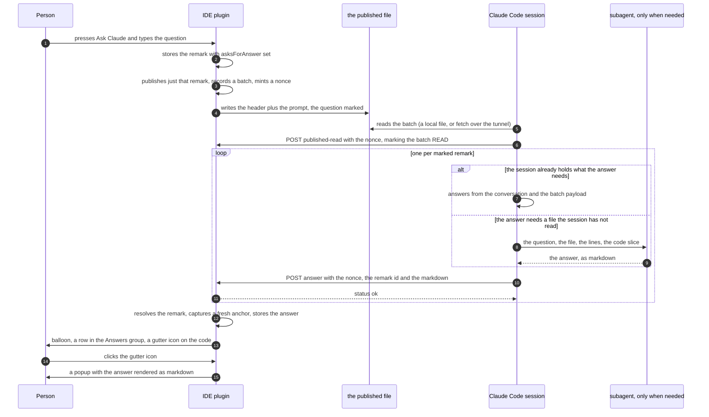
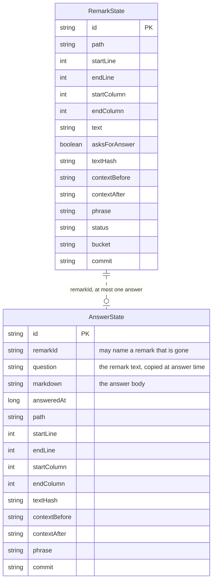
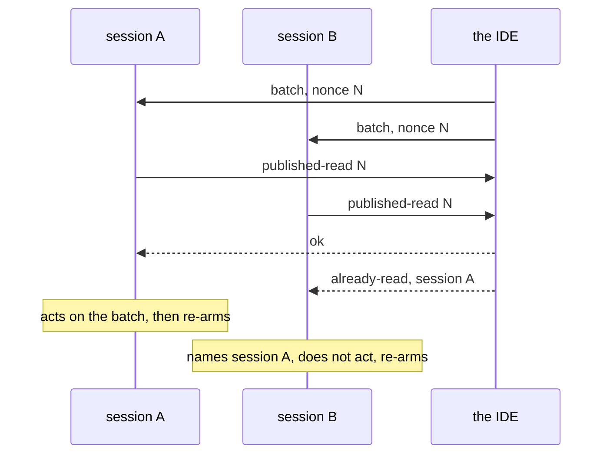

# Claude Remarks — Phase 11 Specification

One phase, six changes. It takes two fields off a remark, adds a gesture that asks a question, and
gives the agent a way to send an answer back onto the line the question was about.

## Contents

1. [What is true today](#1-what-is-true-today)
2. [Why this is one phase](#2-why-this-is-one-phase)
3. [Half one: what tags and severity cost](#3-half-one-what-tags-and-severity-cost)
4. [Half one: everything that has to change](#4-half-one-everything-that-has-to-change)
5. [Half one: the decisions](#5-half-one-the-decisions)
6. [Two tool window fixes that ride along](#6-two-tool-window-fixes-that-ride-along)
7. [Half two: the Ask Claude gesture](#7-half-two-the-ask-claude-gesture)
8. [Half two: the round trip](#8-half-two-the-round-trip)
9. [Half two: who answers](#9-half-two-who-answers)
10. [Half two: what an answer is](#10-half-two-what-an-answer-is)
11. [Half two: where an answer is stored](#11-half-two-where-an-answer-is-stored)
12. [Half two: the answer endpoint, and a relaxed fetch](#12-half-two-the-answer-endpoint-and-a-relaxed-fetch)
13. [Half two: what happens after the endpoint accepts](#13-half-two-what-happens-after-the-endpoint-accepts)
14. [Half two: reading an answer](#14-half-two-reading-an-answer)
15. [The markdown popup: what the platform really offers](#15-the-markdown-popup-what-the-platform-really-offers)
16. [Half two: clearing, history and the prompt](#16-half-two-clearing-history-and-the-prompt)
17. [The skill](#17-the-skill)
18. [The guards in CLAUDE.md](#18-the-guards-in-claudemd)
19. [What is tested and what is a hand check](#19-what-is-tested-and-what-is-a-hand-check)
20. [Risks, with how likely each is](#20-risks-with-how-likely-each-is)
21. [Open questions](#21-open-questions)
22. [What this phase deliberately does not do](#22-what-this-phase-deliberately-does-not-do)

---

## 1. What is true today

Read, not assumed. Branch `main`, working tree clean, version `0.7.0`, phases 1 to 10 built.

**The remark record** is `model/RemarkState.kt`, a `BaseState` with sixteen stored properties. Two of
them are the subject of half one: `tag`, a nullable `RemarkTag` (`BUG`, `QUESTION`, `REFACTOR`,
`NOTE`), and `severity`, a non-null `RemarkSeverity` defaulting to `SHOULD`.

**Three entry points write a remark, and they mirror each other.** `action/AddRemarkAction.kt` is the
`Ctrl+Alt+Shift+R` shortcut and the editor popup-menu item, `action/AddRemarkIntention.kt` is the
`Alt+Enter` intention, and `action/AddPreviewRemarkAction.kt` is the rendered markdown preview's
menu. All three end at `addRemark` in `store/RemarkEdits.kt`. Section 7 adds a fourth gesture beside
the first two.

**One store, one persisted list.** `store/RemarkStore.kt` is the only `@State` component holding
project data, at `@State(name = "ClaudeRemarks")` in `.idea/workspace.xml`. Its nested `RemarksState`
holds exactly one list, `remarks`, annotated `@get:XCollection(style = XCollection.Style.v2)`. Every
mutator on that class is `@Synchronized`, and `snapshot()` is a deep copy taken under the same lock.
The design document spends about a hundred lines on why (`docs/claude/design.md`, "How Remarks are
Persisted" and "Why the Serializer Is Handed a Copy"). Half two adds a second list to this same
class rather than a second component, and section 11 says why.

**The endpoint** is `review/ReviewRestService.kt`, a `RestService` at
`POST /api/claude-remarks/{start,ack,fetch,published-read}`. `execute` dispatches on the sub-path
with a plain `when`. Guard 5 in `CLAUDE.md` greps this one file for five symbol names, because
`execute` runs on a netty IO thread. Every action's consequences already live somewhere else:
`ack`'s in `review/ReviewLifecycle.kt`, `published-read`'s in `review/PublishedAck.kt`.

**The batch record** is `review/PublishedAck.kt`. `PublishedBatchService` is a project service that
remembers the last sixteen published batches in memory. Each `PublishedBatch` carries its `nonce`,
the `ids` it published, the review session it answered, and who read it. `acknowledge(nonce,
session)` is the one method today, and it is destructive: it stamps `readBy` and refuses a second
call. Half two needs a second, non-destructive lookup on the same service.

**A publish always does three things**, whichever control starts it: `publishRemarks` in
`action/PublishRemarks.kt` writes the rendered prompt to the clipboard, writes it to the published
file, and — when a review is waiting — answers that review through `answerWaitingReview`. Section 7
depends on all three, and section 20 records the one of them that can surprise.

**The remote path is tied to a review, and it is tied in two places.** Only `watch-remarks.sh
--fetch` crosses an SSH tunnel, and it refuses to run without `--session <review id>`. The endpoint
underneath it refuses harder: see section 12, which reads `handleFetch` line by line. Section 17
gives listen mode a remote branch, and section 12 is what makes that possible.

**The measured blast radius in the brief is low.** The brief says 11 files under `src/main`. The
real count is **15**:

```bash
grep -rlE "\btag\b|\bTag\b|RemarkTag|severity|Severity|SEVERITY" src/main --include='*.kt' | wc -l   # 15
grep -rlE "\btag\b|\bTag\b|RemarkTag|severity|Severity|SEVERITY" src/test --include='*.kt' | wc -l   # 13
```

The test count of 13 is right. Fourteen of the fifteen main files need a real edit. One,
`ui/RemarksToolWindowFactory.kt`, only mentions severity in two comments. Section 4 lists all
fifteen.

**What the platform offers for a markdown popup, checked against this build and not from memory**,
is section 15. The short version: both pieces exist and both are already on the compile classpath.

---

## 2. Why this is one phase

The phase now carries six changes:

1. tags and severity come off a remark (sections 3 to 5);
2. Publish moves into the shared gutter and tree menu, and the toolbar buttons get real descriptions
   (section 6);
3. an Ask Claude gesture writes a remark that asks for an answer (section 7);
4. an answer comes back into the IDE, with its own anchor, its own row and a rendered popup
   (sections 8 to 16);
5. listen mode claims the pending batch and re-arms itself (section 17);
6. listen mode works over an SSH tunnel (section 17).

Splitting was offered more than once and declined each time. This section records why keeping it
whole is defensible, so nobody re-opens it and nobody mistakes the size for drift.

**They are one thing seen from six sides: the loop between a person reading code and a session
acting on it.** Every change either removes something from that loop that was never used, or closes
a place where the loop needed a person to do something by hand.

**And they land on the same files.** Splitting means editing each of these twice:

| File | Touched by |
|---|---|
| `model/RemarkState.kt` | two fields out, one bit in |
| `store/RemarkEdits.kt` | `setRemarkSeverity` out; `recordAnswer`, `deleteAnswer`, `setRemarkAsksForAnswer` in |
| `ui/RemarkActions.kt` | Severity out; Publish and Ask for an Answer in |
| `ui/RemarksToolWindowFactory.kt` | toolbar descriptions, the Answers group, delete and double-click for answer rows |
| `ui/RemarksTree.kt` | tag and severity off the row; the asks marker on; the Answers group |
| `render/PromptRenderer.kt` | tag and severity out; the remark id and the asks marker in; `PROMPT_NOTES` rewritten |
| `docs/skill/.../SKILL.md` | the severity wording, the answer step, and listen mode three times |
| `README.md` | the severity wording, and listen mode's two reversed promises |

Seven of the thirteen test files in section 4 would be rewritten twice for the same reason.

**The honest cost of keeping it whole.** It is a large phase, and a plan built from it has to be
ordered so that one hard part cannot block the rest. Half one is deletion and lands first; the Ask
Claude gesture depends only on half one; the answer round trip depends on the gesture only for the
flag it reads. The two listen-mode changes and the two tool window fixes depend on nothing else in
the phase and can land in any order.

---

## 3. Half one: what tags and severity cost

**Severity.** `RemarkState.severity` defaults to `SHOULD` and has never been changed in practice. So
every remark ever published shipped as `should`, and the model reading them has never seen another
value.

What that costs on every publish: `render/PromptRenderer.kt` appends `SEVERITY_SCALE_NOTE` under the
prompt header, and its first paragraph is four lines explaining a four-level scale — must, should,
suggestion, vibe. Every remark heading then carries ` — should`. So the prompt spends a paragraph
teaching a scale, and then uses one value of it, forever. The reader has to hold a distinction the
document never makes.

What it costs in the UI: a `Severity` submenu inside `remarkChangeActions`, shared by the gutter
icon's click menu and the tree's right-click menu, plus one mutator on the store, one function in
`store/RemarkEdits.kt`, one word on every tree row and one on every gutter tooltip.

**Tags.** `RemarkState.tag` is nullable and is never picked, so every remark ships untagged.

What that costs: a chip row across the bottom of the input popup, `Alt+0` through `Alt+4` bound into
the text area's input map, an extra Enter binding on the chip component so Enter still submits when
focus lands there, and `TAG_CHOICES` / `tagLabel` / `tagFromLabel` to convert the chip labels back
into an enum. That is roughly a third of `ui/RemarkInputPanel.kt`, whose stated design goal is that
adding a remark stays fast. The design document says so directly: "That popup is the action that has
to stay fast, and a second chooser in it would turn a fast action into a form."

**The test both fields fail.** Neither changes what happens to the remark. A `bug` tag and a `note`
tag travel the same path; a `must` and a `vibe` travel the same path. They are labels printed into a
document, and nothing in the plugin or the skill branches on either. That is the whole argument for
deleting them, and section 7 leans on it again from the other direction.

**One thing the removal buys that is not obvious.** `build.gradle.kts` subtracts
`INTERNAL_API_USAGES` from `verifyPlugin`'s failure level, and its comment names exactly one usage:
`SegmentedButton.component`, reached from `RemarkInputPanel` so that Enter submits while focus sits
on the chip row. The chip row is the only reason that subtraction exists. Once it is gone the
subtraction may be droppable. See the task note in section 5.

**Buckets stay.** They share `remarkChangeActions` with severity, and unlike severity they are used.

---

## 4. Half one: everything that has to change

### The fifteen files under `src/main`

| File | What goes |
|---|---|
| `model/RemarkState.kt` | `enum RemarkTag`, `RemarkTag.label`, `enum RemarkSeverity`, `RemarkSeverity.label`, `var tag`, `var severity` |
| `store/RemarkStore.kt` | `setSeverity` on `RemarksState` and on the store; `editRemark(id, text, tag)` and `edit(id, text, tag)` lose their third parameter |
| `store/RemarkEdits.kt` | `setRemarkSeverity` deleted; `addRemark`, `addGeneralRemark` and `editRemark` lose their `tag` parameter |
| `store/RemarkHistory.kt` | two `append` lines in `renderHistory` |
| `ui/RemarkInputPanel.kt` | `RemarkInput`, `NO_TAG_LABEL`, `TAG_KEY_PREFIX`, `TAG_CHOICES`, `tagLabel`, `tagFromLabel`, `chipRow`, `selectedTag`, `tagChipsComponent`, the `Alt+0`..`Alt+4` bindings, the Enter binding on the chip row, and the `Alt+1-4 picks a tag` words in the placeholder |
| `ui/RemarkActions.kt` | the `Severity` submenu inside `remarkChangeActions` |
| `ui/RemarksTree.kt` | `RemarkNode.tag`, `RemarkNode.severity`, the two `append` calls in the cell renderer |
| `ui/RemarksToolWindowFactory.kt` | two comments only, no code — the real changes to this file are in sections 6 and 14 |
| `settings/RemarkSettingsConfigurable.kt` | the word `tag` in the settings page's own explanatory sentence |
| `render/PromptRenderer.kt` | `RenderedRemark.tag`, `RenderedRemark.severity`, two `append` calls in `appendRemarkTail`, and the four-level paragraph inside `SEVERITY_SCALE_NOTE` |
| `render/PromptPayload.kt` | two lines in `collectForPrompt` |
| `action/AddRemarkAction.kt` | the `tag` parameter on `showRemarkInput`, `buildInputPopup`, `openRemarkEdit` and the general-remark entry point |
| `action/AddPreviewRemarkAction.kt` | one call argument |
| `editor/RemarkGutter.kt` | two lines building `RemarkPlacement` |
| `editor/RemarkGutterIcon.kt` | `RemarkPlacement.tag`, `RemarkPlacement.severity`, two `append` calls in `tooltipFor`, one argument in the `Edit Remark` menu item |

### The thirteen test files

`AddRemarkActionTest`, `RemarkGutterIconTest`, `RemarkGutterTest`, `PromptPayloadTest`,
`PromptRendererTest`, `RemarkEditsTest`, `RemarkHistoryTest`, `RemarkStoreStateTest`, `TestRemarks`,
`RemarkActionsTest`, `RemarkInputPanelTest`, `RemarksPanelTest`, `RemarksTreeTest`.

Most are a parameter drop. Three need a decision, not a mechanical edit:

- **`store/TestRemarks.kt`** is the shared `remark(...)` builder used by every store test. It loses
  two parameters and gains one, so every call site that names them is touched.
- **`RemarkStoreStateTest`** has a test that deserializes a hand-written XML element with no
  `severity` attribute, to prove the default applies. That test goes. In its place the plan should
  add the reverse test: an element that **does** carry `severity="MUST"` and `tag="BUG"` still
  deserializes into a valid remark. That is the migration guarantee, and it is the one thing worth
  keeping a test for. The same class also builds a fully populated remark to compare serialized XML
  against its copy; that builder loses two fields and gains one.
- **`RemarkActionsTest`** loses its severity tests. What replaces them is in section 5.

### Five live documents

`README.md` (7 places), `CLAUDE.md`, `docs/claude/design.md` (the whole "Severity" and "Tag chips"
subsections under "What Phase 5 Built", plus the field list under "What a Remark Contains"),
`docs/ideas.md` (the two built-idea sections that point at those subsections), and
`docs/skill/claude-remarks-review/SKILL.md` (two places that say "each with its severity, its tag and
the code it points at").

⚠️ **Two of those five change for reasons that have nothing to do with tags or severity.**
`README.md` and `SKILL.md` both describe listen mode, and section 17 changes listen mode three
times — it claims the pending batch at startup, it re-arms itself, and it gains a remote branch. The
first two reverse rules both documents state out loud. Both also have to describe the Ask Claude
gesture from section 7. So the documentation sweep is not a tag-and-severity job, and a plan that
treats it that way will leave both files describing a plugin that no longer exists.

`docs/plans/completed/*` are a record of how work happened and are **not** edited.

---

## 5. Half one: the decisions

**Old values in `workspace.xml` are ignored on load and lost on the next write. No migration.**
Already decided. It is safe: the platform's XML deserializer skips an attribute that matches no
property on the target class. Nothing throws, nothing is logged, and the remark loads with every
other field intact. The attributes stay in the file until the next save rewrites the component.

**`SEVERITY_SCALE_NOTE` is not deleted. It is renamed and rewritten.** The constant today holds three
paragraphs, and only the first is about severity:

1. the four-level scale — **goes**;
2. what `commit <sha>` means, and that diffing against it is how to find an orphan's code —
   **stays**;
3. what `⟦` and `⟧` mean inside a quoted code block, and that neither may appear in an edit —
   **stays**.

Deleting the whole constant would silently take the marker explanation with it, and the markers
would keep being printed with nothing left to say what they are. Rename it `PROMPT_NOTES`. Section 7
adds a fourth paragraph to it, for the asks marker. The argument for why it lives in the renderer
rather than in `DEFAULT_PROMPT_HEADER` is unchanged and its comment stays: the header is the one
thing a person may rewrite, and anything living only inside it disappears when they do.

**`RemarkInput` collapses to a plain `String`.** With `tag` gone the data class holds one field.
`remarkInputResult(rawText: String): String?` and `onSubmit: ((String) -> Unit)?`. Keeping a
one-field wrapper would be furniture.

**`remarkChangeActions` keeps its name and grows to three items.** Sections 6 and 7 give it Publish
and Ask for an Answer beside Move to Bucket…, so it ends the phase as a real menu rather than a
wrapper around one entry.

**The press-time-ids guard survives, and needs no new seam.** `RemarkActionsTest`'s most valuable
test proves that `remarkChangeActions(project, ids)` reads `ids()` when an item is pressed, not when
the menu is built. That rule still matters after half one, because the tree rebuilds itself on every
remark change, so a list captured at build time is stale by the time anything is clicked.

An earlier draft of this spec worried the guard would be lost: the test presses a severity item, and
with severity gone the only item left was `Move to Bucket…`, which opens
`Messages.showEditableChooseDialog` and cannot be pressed from a test. The fix proposed there was an
injectable chooser parameter on `remarkChangeActions`.

**That is no longer needed.** Two of the three items the menu ends with — Publish and the Ask for an
Answer toggle — open no dialog and can be pressed in a test directly. One pressable item is enough to
pin the rule for the whole group: a change from `() -> List<String>` to `List<String>` breaks that
test. So the chooser parameter is dropped, and `chooseBucket` stays exactly as it is.

**Verify whether `INTERNAL_API_USAGES` can leave `build.gradle.kts`.** After the chip row is gone,
run `./gradlew verifyPlugin` with that subtraction removed. If the report comes back clean, remove
the subtraction and its comment — the comment names `SegmentedButton.component` as the one usage, so
leaving the subtraction in place would keep hiding a *future* internal-API use for no reason. If
something else turns up, keep the subtraction and rewrite the comment to name what it really covers.
This is a check with two possible outcomes, not a task with one, and the plan should say so.

---

## 6. Two tool window fixes that ride along

Neither is about tags, severity or answers. Both are small, both live in the two UI files this phase
is already editing, and both come from the same complaint: a control that exists but cannot be
found.

### Publish, in the menu the gutter icon and the tree share

**The capability exists and is hard to reach.** Publish Selected is a toolbar button in
`ui/RemarksToolWindowFactory.kt`, calling `publishRemarks(project, selectedIds())`. So asking one
question today means: write the remark, leave the editor, open the tool window, find the row, select
it, press Publish Selected. Five steps for what should be two. From the remark that asked for this:
"often you wanna ask the question before publishing the whole shebang."

`remarkChangeActions` in `ui/RemarkActions.kt` gets a Publish item. Both call sites get it at once,
because both already build their menu from that one function.

**It is called "Publish", one word, in both places.** Not "Publish This Remark" in the gutter and
"Publish Selected" in the tree. `remarkChangeActions` already takes `ids: () -> List<String>`, and
that lambda already resolves to the one remark under the icon in the gutter and to the whole
selection in the tree. One word is true in both. The items beside it are named the same way and act
on the same `ids()`, so a second naming convention inside one menu is the thing to avoid.

**It publishes exactly `ids()`** — the one remark under the icon, or the whole tree selection,
matching Publish Selected. Two items in one menu acting on different sets is the kind of difference
nobody notices until it does the wrong thing. It returns early on an empty list, the way
`chooseBucket` already does.

This is action wiring, not new pipeline. `publishRemarks(project, ids)` already takes an id
collection, already runs its own non-blocking read action, and already shows its own balloon. It is
also what section 7's Ask Claude gesture calls, so the two are the same code path.

**One test**, in `RemarkActionsTest`'s existing style: the Publish item acts on the ids the lambda
names at press time, not at build time. This is one of the two tests that replace the deleted
severity ones, and it is why section 5 needs no injectable chooser.

### Real descriptions on the toolbar buttons

`ToolbarAction` builds `DumbAwareAction(text, text, icon)`, so the text and the description are the
same string and every tooltip repeats the button's own name. That is what made a selected-only
publish look like it did not exist: hover, read "Publish Unread", learn nothing.

Give `ToolbarAction` a `description` parameter and write a real one for each of the six buttons. The
shape: **say what the button takes, not what it is called.**

| Button | Description |
|---|---|
| Add General Remark | A remark about the whole change, with no file and no lines |
| Publish Unread | Every remark not yet read |
| Publish Selected | Only the rows you picked. Select a bucket node to take that whole bucket |
| Clear Handed Over | Every remark already published or read. Answers are kept. Archived to the history file first |
| Clear All | Every remark and every answer, published or not. Archived to the history file first |
| Refresh | Re-resolves every remark against the files as they are now |

Two of these are only true after half two lands: Clear Handed Over keeping answers, and Clear All
taking them. They are written here in their final form so the plan does not have to touch this table
twice.

---

## 7. Half two: the Ask Claude gesture

### The problem: two different things wearing one shape

A remark that asks something can mean two different things, and until now the plugin could only
express one of them.

- *"Why is this a service and not a helper?"* written to **raise a topic**. It travels with the next
  publish, and the session talks about it wherever the person is reading the session's output.
- The same sentence written to **get an answer back on the line**, so it is there next to the code
  the next time that file is opened.

From the remark that asked for this: "sometimes I'd like to just dispatch an annotation with a
question that raises the topic for discussion, not an instant answer."

An earlier draft of this spec had the session read each remark and decide which kind it was. Section
9 records why that is dropped. The short version is that a guess can be wrong and a gesture cannot.

### The decision: a second entry point, and the gesture carries the intent

**`Ctrl+Alt+Shift+R` and the existing entry points keep writing an ordinary remark.** Work to do, or a
topic to raise. Nothing about them changes.

**A second action, Ask Claude, writes a remark that asks for an answer.** That is the one that comes
back on the line.

It gets the same three-way mirror the existing entry point has: its own keyboard shortcut, its own
`Alt+Enter` intention beside `AddRemarkIntention`, and its own item in the editor's right-click menu.
The shortcut should sit next to `Ctrl+Alt+Shift+R` in the keymap so the pair reads as a pair;
`Ctrl+Alt+Shift+A` is the obvious candidate and the plan should confirm nothing in the default keymap
already owns it.

⚠️ **It also needs its own action id, pinned by `ActionIdsTest`.** That test exists because
`README.md` promises the two existing ids will not be renamed, so an `.ideavimrc` can bind them. A
third id joins that promise the moment it ships.

### It publishes on the spot, and that is the point

The alternative was for Ask Claude to write the remark and stop, leaving the person to publish it
separately. **That is rejected**, because then Ask Claude is an ordinary remark plus a flag, and a
flag does not earn a second shortcut. The reason to have a second gesture at all is that asking is
one motion: write it, send it, expect an answer.

**Mechanically it is Add Remark plus the Publish item from section 6**, in that order, with the flag
set. It calls the same `publishRemarks(project, listOf(id))` the gutter's Publish item calls. No new
pipeline, and no second kind of publish.

**That inherits two side effects, and they are named here rather than discovered later**, because a
publish is a publish:

- **It writes the clipboard.** Every publish does. Asking one question replaces whatever was on the
  clipboard, which the person did not necessarily intend.
- ⚠️ **It answers a waiting review, if one is waiting.** `publishRemarks` calls
  `answerWaitingReview` whenever `waitingReviewForPublish` finds a review, so a one-question Ask
  Claude consumes that review's single answer and the waiting session's watcher exits. Section 20
  carries this as a risk. It is **not** guarded in code: phase 10 deliberately made a publish the one
  way a review is answered, and splitting that into "publishes that answer a review" and "publishes
  that do not" is a larger change than this decision justifies.

### What it costs: one bit back on `RemarkState`

`RemarkState` gains `var asksForAnswer by property(false)`. Default false, so `BaseState` omits it
and every remark stored before this field existed loads as an ordinary remark — the same no-migration
shape `startColumn`, `endColumn` and `phrase` already use.

**This has to be said plainly, because this phase deletes a `question` tag in its first half.** In
substance the new bit is what that tag's `QUESTION` value used to be. The difference is not the shape
of the data. It is what the data does:

- The tag was one of four labels, picked from a chip row in the input popup, that **changed nothing
  about what happened to the remark**. `bug`, `question`, `refactor` and `note` all travelled the
  same path and were printed into the prompt as a word. Section 3's argument for deleting it is
  exactly that.
- `asksForAnswer` is one bit, set by **which action was invoked** rather than picked from a list, and
  it **decides whether an agent sends an answer back**. It is read by the renderer, by the tree row,
  by the gutter tooltip and by the skill.

A classification that changes behaviour earns its place. One that only decorates a document does not.
A reader who thinks this is the tag coming back through the side door should weigh those two
sentences and decide; the spec is not going to pretend the resemblance is not there.

### Four interactions the flag creates

**An ordinary remark can be turned into a question afterwards, and back.** `remarkChangeActions`
gains an **Ask for an Answer** toggle, beside Publish and Move to Bucket…. It is a `ToggleAction`:
`isSelected` is true when every remark in `ids()` carries the flag, and `setSelected` sets or clears
it across all of them.

*Why toggleable rather than final.* Writing a remark and then deciding you want an answer to it is
ordinary, and making the person delete and rewrite is exactly the friction this phase exists to
remove. `remarkChangeActions` is already the place where a remark that exists gets changed — that is
what severity used it for and what bucket still uses it for.

⚠️ **The toggle only sets the flag. It does not publish.** Publishing on the spot is a property of
the *entry point gesture*, not of the flag. The Publish item sits right beside the toggle for anyone
who wants both. Keeping them separate is what stops a right-click from firing a network-adjacent
action nobody asked for.

**A general remark can ask, and it needs no extra code.** A remark about no file has no path and no
lines, and section 10 already covers what its answer looks like: an empty `path`, resolving as
itself the way `isAboutNoFile` handles the remark. It has no gutter icon — `RemarkGutterTest` already
asserts a general remark produces no placement anywhere — so its answer is readable only from the
Answers group and the popup that row opens. That is enough. There is no "Ask General Question"
toolbar button: write the general remark, right-click its row, toggle Ask for an Answer, press
Publish. A seventh toolbar button for a rare case is not worth it.

**A remark that asks, answered, then edited and published again, is covered by the replace-in-place
rule** in section 11 — checked rather than assumed. Editing changes `text` and keeps `id`, the answer
is keyed on `remarkId`, so the second answer replaces the first and carries the new question text in
its own `question` field. Nothing extra is needed.

**What the row and the gutter show before an answer exists.** The tree row gains a grey suffix,
beside the `published` and `read` words it already draws: `asks` while no answer exists, `answered`
once one does. The gutter tooltip says the same on its own line. The tree already builds from both
the remarks and the answers, so knowing which of the two words applies costs one lookup.

*Not a different icon.* `RemarkStatusLook`'s own KDoc argues that the icon axis answers "which of the
three states is it" and the colour axis answers "is this still the work", and that collapsing two
facts onto one channel is what it exists to prevent. Asking is a third fact. It goes in text.

### How the prompt carries it

`render/PromptRenderer.kt` marks the heading of a remark that asks:

```
### 3. lines 41-47 — asks for an answer — commit a1b2c3d4

id: 7f1c2a9e-...
```

The heading, not the `id:` line, because the heading is what a reader scans and this changes what
they should do with the remark. The `id:` line stays exactly what section 17 needs it for.

**`PROMPT_NOTES` gains a paragraph explaining the marker**, and `DEFAULT_PROMPT_HEADER` loses its
QUESTION-versus-INSTRUCTION bullets. The header today tells the model to work out for itself which
remarks are questions; that is the guess section 9 removes. The replacement wording lives in
`PROMPT_NOTES` rather than in the header for the reason section 5 already gives: the header is
editable, and a person who rewrote it would take the marker's meaning with them while the renderer
kept printing it.

---

## 8. Half two: the round trip

**The transport is already bidirectional, and has been since phase 6.** The agent POSTs to the IDE
today through four actions: `start`, `ack`, `fetch` and `published-read`. What is new in phase 11 is
not the direction. It is the payload.

Everything the agent sends today is a **control signal**. It moves state and draws a banner: a
review starts, a batch is marked read, a file's content comes back across a tunnel. None of it
carries anything a person reads. An answer is the first message from the agent that is **content** —
text that lands in the tool window as a thing to read, anchored to code, and kept.

**That makes this half smaller than it looks, not bigger.** `answer` is a fifth action on a route
that already exists. The token check in `isHostTrusted`, guard 5's discipline about the netty thread,
and the consequences-live-in-another-file pattern are all already built and already tested.
`review/AnswerReceipt.kt` copies `review/PublishedAck.kt` almost line for line in shape.

**The two things in this phase that really are new** are the storage shape of a second `BaseState`
list (section 11) and the markdown popup (section 15). That is where the risk sits, not in the
transport.



⚠️ **No semicolon inside a Mermaid label.** Mermaid reads `;` as a statement separator, so
`S->>IDE: POST published-read with the nonce; marks the batch READ` parses as a message followed by a
second, invalid statement, and the whole diagram fails to render rather than failing on that line.
Use a comma. This already broke this diagram once.

**Ask Claude is the fast path, not the only one.** An ordinary Publish Unread carrying a whole
reading pass works identically: any remark in it that carries the flag is marked in the prompt and
gets an answer, and the rest do not. The diagram shows one question because that is the gesture worth
drawing.

Three things to read off it.

The `published-read` acknowledgement is **unchanged and independent**. Answering is not
acknowledging. A batch can be acknowledged and never answered, or answered several times (once per
marked remark) and acknowledged once. The `answer` action must therefore not consume the batch, which
is why section 12 adds a non-destructive lookup rather than reusing `acknowledge`.

The answer is stored **after** the endpoint has already replied `ok`. The reply means "accepted",
not "stored". That is exactly the contract `published-read` already has, for the same reason: guard 5
forbids the endpoint from doing anything on the netty thread beyond parsing and answering.

**Every arrow from the session to the IDE works the same over a tunnel**, at a different base URL.
Section 17 says what the skill has to carry to make that true for listen mode.

---

## 9. Half two: who answers

### The session used to classify, and it no longer does

An earlier draft of this spec made the model sort every remark into QUESTION or INSTRUCTION as it
read the batch, using the wording `DEFAULT_PROMPT_HEADER` already carried. The argument for it was
that only a model can tell "can you rename this?" — a directive wearing a question mark — from "why
is this a service and not a helper" — a question with no question mark. A shell regex gets both
wrong, and `watch-remarks.sh` stays dumb, so a model seemed like the only thing that could decide.

**That argument was right while the intent was invisible, and it is unnecessary now that the person
states it.** The Ask Claude gesture in section 7 puts the intent in the remark itself. The guess
disappears, and with it every way the guess could be wrong: a directive answered instead of done, or
a question acted on instead of answered.

What survives from that design: `watch-remarks.sh` still never looks at what a remark says. It
delivers the batch and exits. Nothing in the shell has ever needed to understand a remark and nothing
does now.

### The session answers. A subagent is the escalation

**The trade-off, in one line: answering inline is cheap and puts the exchange into the conversation,
a subagent keeps the conversation clean and pays to re-derive context the session already has.**

What happens if the session answers directly. It has already read the files. It already knows why
that class is a service. The batch payload carries the question with its code slice. So the answer
costs one ordinary turn over context that is already loaded. What it costs: the question and the
answer become part of the conversation history.

What happens if a subagent answers. It starts empty. To answer "why is this a service and not a
helper" it re-opens the file the session read an hour ago, and probably its callers too, and pays
tokens to re-derive a conclusion the session already holds. What it buys: nothing enters the
session's own history.

**The default is the session answering directly.** The reason `/btw` was proposed in the first place
was cheap reuse of context the session already has. Making the subagent the default throws that
property away — an empty context is the one thing a subagent structurally cannot avoid.

The cost, conversation clutter, is what `/btw` exists to avoid, and here it matters much less. A
remark arriving through listen mode is not a side question. It is the session's actual work. The
exchange is on-topic content, not clutter.

**A subagent is the escalation, and it covers the case `/btw` cannot serve at all**, since a side
question has no tool access. The rule, decided by the model, per marked remark:

- **Can this be answered from the conversation and the batch payload?** Answer it directly.
- **Does it need a file the session has not read, or has not read recently?** Spawn a subagent to go
  and read, and come back with the answer.

When several questions each need a subagent, run them in parallel. They are independent, and a slow
answer to one must not hold up the others.

### Why not `/btw`

`/btw` was proposed as the route, so the reasoning is recorded here rather than lost. **The rejection
does not rest on a subagent being better. It rests on the answer being unretrievable.**

- `/btw` is interactive-mode UI, typed by a person. There is no tool, no command file and no
  programmatic route to it.
- Its answer is a dismissible terminal overlay and is deliberately ephemeral. The documentation says
  the question and the answer never enter the conversation history. So there is nothing to POST.
- A side question has no tool access. It answers from context only, which rules out every question
  that needs a file read.
- A route does exist, and it was looked at. agterm can inject `/btw <question>` into a pane, and the
  overlay's `c` key copies the answer to the clipboard as raw markdown, so a script could `pbpaste`
  it and POST it. It is rejected for five separate reasons. It hijacks the system clipboard, which is
  this plugin's own main output and is written by every publish. It needs a poll on rendered pane
  characters to know when the overlay is ready. It keeps the no-tool-access limit. It breaks the
  remote path over an SSH tunnel, where there is no pane on the agent's side at all. And it adds an
  agterm dependency to a skill that today needs only `curl` and `jq`.

The session answering in an ordinary turn keeps `/btw`'s cheapness **and** produces an answer that is
real data the session holds and can POST. That second half is the one thing `/btw` cannot provide at
any price.

---

## 10. Half two: what an answer is

An answer is **its own entity with its own anchor**, not a field on `RemarkState`. That was asked for
specifically. Two things follow, and both are the reason:

- **It re-resolves as the code moves.** It reuses `anchor/` with no new machinery, so an answer
  written about lines 40 to 45 is still pointing at that code after the file is edited.
- **It survives the question being cleared.** A reading pass can be cleared while what was learned
  stays. That is only possible because the answer does not hang off the remark record.



**At most one answer per remark.** A second answer for the same remark id replaces the first, in
place, capturing a fresh anchor as it does. Section 11 holds the mechanism and section 13 the moment
it happens. Why the IDE enforces this rather than the skill avoiding it is in section 11.

**`remarkId` is a plain reference and nothing enforces it.** The remark it names may be deleted,
cleared, or never have existed at all if `workspace.xml` was hand-edited. Nothing in the plugin
resolves an answer *through* its remark. The field is the answer's key for replacement and the way a
person tells which question this answers, not a foreign key. This is deliberate: an answer that
stopped working when its question was cleared would defeat the whole point of a separate entity.

**`question` is the remark's text, copied at answer time.** Without it, an answer whose remark has
been cleared reads as a paragraph with no subject. Copied rather than looked up, for the same reason
the anchor is.

**The anchor is captured fresh at answer time, not copied field for field.** Two options:

- *Copy the remark's stored anchor fields verbatim.* Simplest. The answer then resolves exactly like
  its remark, from wherever the remark was originally written.
- *Resolve the remark, then capture a fresh anchor at the resolved position.* The answer starts from
  where the code is **now**, so it has the full 200-line search radius ahead of it rather than
  whatever the remark has already spent.

**Take the fresh capture.** An answer usually outlives its remark, so it needs the longer runway.
The cost is one `resolveWithPhrase` plus one `captureAnchor` per answer, off the EDT inside a read
action, which is the same work the tool window already does for every remark on every refresh. A
replacement captures its own fresh anchor too, so an answer re-sent after the code moved points at
where the code is now, not where it was the first time.

**Two cases fall back to the stored fields.** A remark that orphans has no resolved position worth
capturing, and a general remark has no file at all. In both, copy the stored fields as they are. A
general remark's answer therefore has an empty `path` and resolves as itself, exactly the way
`isAboutNoFile` already handles a general remark. Section 7 depends on this.

**The remark may be gone by the time the answer is stored.** Then the answer is stored with an empty
`path`, an empty `question` and no anchor, rather than being dropped. The answer is the thing worth
keeping. Losing it because the person deleted the question in the seconds in between would be the
silent loss this plugin refuses everywhere else.

---

## 11. Half two: where an answer is stored

**A second list on the existing `RemarkStore.RemarksState`, not a second `@State` component.**

```kotlin
class RemarksState : BaseState() {
    @get:XCollection(style = XCollection.Style.v2)
    val remarks by list<RemarkState>()

    @get:XCollection(style = XCollection.Style.v2)
    val answers by list<AnswerState>()
    // ...
}
```

The alternative was a second `@Service` with its own `@State`. It is rejected because it would copy
the whole of `RemarkStore`'s thread-safety machinery: the `@Synchronized` mutators, the deep
`snapshot()`, the hand-written `getState()` returning a copy, and the `getStateModificationCount()`
override that reads through `modCount()`. `docs/claude/design.md` spends about a hundred lines
explaining why each of those is load-bearing. A second copy of all of it, with a second chance to get
one of them wrong, buys nothing: answers and remarks are read together, written from the same
places, and saved to the same file.

**⚠️ `@get:XCollection(style = XCollection.Style.v2)` on the new list is not optional.** Without it
the whole list serializes to an empty element and every answer is lost on restart with nothing
logged. This is the exact trap `RemarkStoreStateTest` was written to guard for the `remarks` list.
The new list needs its own copy of that regression test. This, with the markdown popup, is one of the
two genuinely new risks in the phase — see section 8.

### The store holds at most one answer per remark, and the IDE is what enforces it

`RemarksState` gains three `@Synchronized` mutators: `putAnswer`, `removeAnswer` and `clearAnswers`.
`snapshot()` gains an `answersSnapshot()` beside it, and `clear()` clears both lists.

**`putAnswer` is an upsert keyed by `remarkId`**, not a plain add. It removes any existing answer for
that remark and appends the new one. So a second answer for the same question replaces the first
rather than sitting beside it.

**Why the IDE enforces this and not the skill.** The alternative was for the skill to skip a question
it has already answered. That needs the published prompt to say which remarks already have an answer,
which reopens section 16's decision to keep answers out of the prompt — and it would be advisory, a
policy written in markdown that the model reading it may or may not follow. Replacement in the store
is enforced rather than advised, and it costs one lookup by remark id.

**This is not a rare case.** Every publish mints a fresh nonce, and a watcher's `--seen` guard
compares nonces rather than content, so re-publishing unchanged remarks looks exactly like new work
to a listening session. One extra press of Publish is enough. See the risk entry in section 20, which
records a live observation of it.

**A replaced answer is not archived, and that matches how the plugin already behaves.** `editRemark`
overwrites a remark's text with no archive either. The clear-then-archive rule exists for a
*deletion* the person asked for, and a replacement is visible in the tree row the moment it happens.

### `AnswerState` declares its own anchor fields

The tidy version would be an `open class AnchoredState : BaseState()` holding the nine anchor
properties, with both records extending it. It is rejected. `BaseState`'s property list is built by
the constructors, so inheritance would work — but it changes the serialization shape of
`RemarkState`, which is the record every stored remark already lives in, and silent data loss on a
`BaseState` list is exactly the failure mode this project has already been bitten by once. Nine
duplicated property declarations is a cheap price for not touching the shape of data that already
exists.

**The logic is shared even though the fields are not.** `store/RemarkResolver.kt` grows a small
value type and one function:

```kotlin
data class StoredAnchor(
    val path: String?, val startLine: Int, val endLine: Int,
    val startColumn: Int, val endColumn: Int,
    val textHash: String?, val contextBefore: String?, val contextAfter: String?,
    val phrase: String?,
)

fun resolveStored(root: VirtualFile, stored: StoredAnchor): ResolvedPosition
```

`resolveOne` for a remark and the new answer resolve both build a `StoredAnchor` and call it. That
shares the part worth sharing: the `fileForStoredPath` lookup with its `isAncestor` check, the
`Document` lookup, the general-remark case, and the five refusals that all end as the same orphaned
row. Roughly thirty lines that would otherwise be copied.

---

## 12. Half two: the answer endpoint, and a relaxed fetch

### `POST /api/claude-remarks/answer`, a fifth action

**Request body**, filled by Gson by reflection, every field nullable because it is caller-supplied:

```json
{
  "session":  "a name the calling session invents for itself",
  "project":  "the repository path as the IDE sees it",
  "nonce":    "the published batch's nonce",
  "remarkId": "the id of the remark being answered",
  "answer":   "the answer, as markdown"
}
```

**Why the nonce.** It is what proves the caller actually read the batch that carried the question.
Without it, any process that could guess a remark id could write text into the IDE's own state. The
nonce is minted by the plugin, written into a file with owner-only permissions, and is already the
key `published-read` trusts. The token check in `isHostTrusted` is the outer gate; the nonce is what
keeps one batch's caller from writing about a different batch.

**`remarkId` must be in that batch.** `PublishedBatch` already carries the `ids` it published. The
handler checks membership. Without that check a session could answer a remark it was never shown.

**The endpoint does not check `asksForAnswer`.** A session that answers an unmarked remark gets `ok`
and the answer is stored. The flag decides what the *skill* does, and duplicating the decision in the
endpoint would mean two places that can disagree — with the store's copy winning silently over the
prompt the session actually read. An answer nobody asked for is a row a person can delete; a refused
answer that was correctly asked for is work thrown away.

**The answers, all HTTP 200 with a `status` field**, the same shape every other action uses:

| `status` | when |
|---|---|
| `ok` | accepted; the store write is queued |
| `unknown-batch` | the nonce names no remembered batch, or it fell off the remembered sixteen |
| `unknown-remark` | the batch exists but does not carry that remark id |
| `too-large` | the answer is over the cap; see below |
| `unknown-project` | the same answer `matchProject` already writes |
| `bad-request` | a missing or blank field, or a body that does not parse |

There is no separate status for a replacement. A second answer for a remark already answered is
`ok`, the same as the first: the caller did nothing wrong, and section 11 explains why replacing is
the intended behaviour rather than an anomaly.

**A size cap, and refusal rather than truncation.** The answer goes straight into `workspace.xml`,
which the platform saves on every change and which the tool window resolves against. Cap it at
**16 KiB**, named `MAX_ANSWER_BYTES` beside `MAX_PUBLISHED_BYTES`. Sixteen kilobytes is roughly two
and a half thousand words, which is far more than a reading-pass question needs. Refusing rather
than truncating follows `readPublished`'s own argument: a markdown document cut in the middle looks
complete to whoever reads it next.

**⚠️ Guard 5 governs this handler.** `handleAnswer` in `review/ReviewRestService.kt` may do exactly
four things: parse the body, call `matchProject`, call one function in another file, and write the
status fields. Nothing else. Every consequence — resolving the remark, capturing the anchor,
building the answer, storing it, the balloon — lives in a new file, `review/AnswerReceipt.kt`, the
same way `ack`'s consequences live in `review/ReviewLifecycle.kt` and `published-read`'s live in
`review/PublishedAck.kt`. The comment in `ReviewRestService.kt` explaining this must not spell out
any of the five forbidden symbol names, because guard 5's grep is line-based and cannot tell a
comment from code.

**`PublishedBatchService` gains one non-destructive method.**

```kotlin
@Synchronized
internal fun batchCarries(nonce: String, remarkId: String): BatchLookup
```

answering `UNKNOWN_BATCH`, `UNKNOWN_REMARK` or `OK`. It reads and returns; it never stamps `readBy`
and never removes anything. Answering a question must not consume the batch, because the batch still
has to be acknowledgeable by `published-read`, and because several marked remarks in one batch each
get their own answer.

**The `answer` action is deliberately independent of the review lifecycle.** It is keyed to a
published batch's nonce, exactly the way `published-read` is, and it never touches
`WaitingReviewService`. So it works with no review ever started, which is the ordinary case.

### The `fetch` action loses its session requirement

Listen mode needs to read the published file over a tunnel, and `fetch` is the only action that can
carry a file's content back. It cannot serve a listener today. **The blocker is in the endpoint, not
only in the script**, and this was settled by reading `handleFetch` rather than by reasoning from the
script's own refusal.

`handleFetch` in `review/ReviewRestService.kt` uses the session in three places:

1. it refuses a body with no `session` at all, alongside a missing `project`;
2. it short-circuits to `waiting` when *this* session's own review is still `ReviewPhase.Waiting`;
3. having read the file, it hands the content back only when `header.reviewSession == session`.
   Everything else answers `no-review`.

**The third is the real blocker, and the code says so itself.** The comment on that `else` branch
reads: "The file exists but answers a different session's review, or none at all — a plain publish
with no review waiting also reaches this branch." A plain publish writes `review: none`, so
`header.reviewSession` is null, so the comparison is false for every session id any caller could
send. **A batch that does not answer a review is unreachable over the tunnel today.**

Two ways to fix it:

- *A new action beside `fetch`.* It would duplicate everything past the session checks: the
  `projectIdentity` resolve, `readPublished` with its size cap, the header parse, and the
  `ready` / `no-review` / `too-large` / `failed` answers. About forty lines, a sixth action, a sixth
  set of statuses, and a sixth block in `ReviewEndpointSmokeTest`.
- *Make `session` optional on `fetch`.* Absent means "any batch": skip the live-review short-circuit,
  which has nothing to be waiting for, and skip the header gate, which has nothing to compare
  against.

**Make `session` optional.** Phase 10 already did the work that makes this cheap. It removed the
per-review output path, so `handleFetch` now resolves the one predictable file under
`handshakeDir()`, and the *body* of the handler already has nothing to do with a review. What is left
of the session is a short-circuit and a gate, and both are meaningful only when a review exists.

**It is purely additive.** A caller that sends `session` gets today's behaviour byte for byte, so
review mode's own remote path is untouched. Only the two `session.isNullOrBlank()` refusals and the
two session-dependent branches need a null case.

**It weakens nothing.** `session` was never a secret. It is a name the caller invents for itself, and
the endpoint has never handed one out or checked one against anything. The gate on this route is the
token in `isHostTrusted`; the nonce is what gates `published-read` and `answer`. Dropping a session
requirement drops nothing that was protecting anything.

**Three things a session-less fetch can now return, and the skill has to handle each.** A plain
publish with `review: none`, which is the case this exists for. A rejection batch with
`rejected: yes`, which listen mode's exit-0 handling already reads by line number. And a batch
answering *someone else's* review, which listen mode's existing anomaly rule already covers — say so,
name the session, do not act, do not acknowledge.

---

## 13. Half two: what happens after the endpoint accepts

`reportAnswer(project, nonce, remarkId, markdown)` in `review/AnswerReceipt.kt` returns the outcome
synchronously — that is the part the endpoint writes into the response — and queues everything else.

The queued work does **not** run on `invokeLater` alone, unlike `reportPublishedRead`. It runs as a
read action off the EDT, then finishes on the EDT:

```
ReadAction.nonBlocking { buildAnswer(project, remarkId, markdown) }
    .expireWith(project)
    .finishOnUiThread(...) { answer -> recordAnswer(project, answer); notifyRemarks(project, ...) }
    .submit(AppExecutorUtil.getAppExecutorService())
```

`recordAnswer` is the one public function in `store/RemarkEdits.kt` that creates an answer, and it
goes through `putAnswer`, so **this is the moment a second answer for the same remark replaces the
first**. `buildAnswer` has already captured a fresh anchor by then, so the replacement points at
where the code is now.

Why not plain `invokeLater`. `buildAnswer` resolves the remark against its file, which means a
`Document` lookup — and `FileDocumentManager.getDocument` on a file with no editor open loads it
from disk. On the EDT that is a stall for a large file. This is the same shape the plugin already
uses in three places: the publish pipeline, the gutter sync and the tool window refresh.

Why the ordering race that `reportPublishedRead` guards against does not apply here. That function
queues on the EDT specifically so an acknowledgement cannot land between a publish's file write and
its `markRemarksPublished`. An answer touches no `status` field and no review phase. It only writes
to a list nothing else writes. So there is nothing for it to race.

**The balloon.** One sentence: `Claude Code answered a remark.` Not the answer text — the answer is
paragraphs and a balloon is a line.

---

## 14. Half two: reading an answer

The requirement is "as long as I can quickly read the answer". Three places.

### An Answers group at the very top of the tree

Above General, above the buckets, above the files. Keyed `"answers"`, labelled `Answers`. A file key
starts with `file:` and a bucket key with `bucket:`, and the general group's key is the bare word
`general`, so this bare word cannot collide with any of them — the same argument `GENERAL_KEY`
already makes.

Flat, like the General group, and **sorted newest first**. That is a different order from every
other group in the tree, and deliberately: the answer you just received is the one you want to read.

The row carries, in this order: the resolved position in grey, then the answer's **first line** in
regular attributes, then the source file's name in grey. The first line inline is what makes the
group scannable without opening anything. An answer whose first line is a markdown heading shows
that heading, which reads well.

**⚠️ An answer row is an `AnswerNode`, not a `RemarkNode`, and three places have to notice.**

- `remarkNodesUnder` returns `RemarkNode`s only, so selecting the Answers group gives `selectedIds()`
  an empty list. Publish Selected then greys itself out, which is correct by construction: an answer
  is never published. The Publish item in section 6 returns early for the same reason, and so does
  the Ask for an Answer toggle in section 7.
- `deleteSelected` must handle answer rows, or Delete on an answer does nothing silently. That is
  exactly the failure `remarkNodesUnder`'s own KDoc warns about for bucket nodes.
- `navigateToSelected` runs on double click and reads `selectedNodes().firstOrNull()`. On an answer
  row it must open the markdown popup instead of navigating. Double click is the fast path a person
  reaches for first, and it must not silently do nothing.

### A gutter icon of its own

The answer draws its own gutter icon, on the lines its own anchor resolves to, with
`AllIcons.General.Balloon`. Clicking it opens the markdown popup.

The alternative was to hang the answer off the remark's existing gutter icon — a "Show Answer" item
in that menu — and only give the answer an icon of its own once its remark is gone. It is rejected
because it makes the gutter's behaviour conditional on something invisible, and because the answer
outliving the remark is the ordinary case, not the exception. So the answer has an icon always.

**⚠️ What this costs: two icons on the same lines while both exist.** IntelliJ stacks gutter icons
on the same line, so the person sees the remark's icon and the answer's icon side by side. That is
honest but busy. It is listed in section 20 as a real risk to look at by hand, not as a solved
problem.

### The popup: the whole answer, rendered

Headings, code fences, lists and tables, not one line of plain text. This is the one piece of
genuinely new UI in the phase. Section 15 is what the platform actually offers.

---

## 15. The markdown popup: what the platform really offers

Checked against the 2025.2 jars in this build and against the Community checkout at
`~/dev/oss/intellij-community`, tag `idea/2025.2.6.3`. Not from memory.

### Both pieces exist, and both are already on the compile classpath

**Markdown to HTML: `com.intellij.markdown.utils.doc.DocMarkdownToHtmlConverter`.**

```
public static final java.lang.String convert(com.intellij.openapi.project.Project,
                                            java.lang.String,
                                            com.intellij.lang.Language);
public static final java.lang.String convert(com.intellij.openapi.project.Project,
                                            java.lang.String);
```

`javap -cp lib/app-client.jar com.intellij.markdown.utils.doc.DocMarkdownToHtmlConverter`.

Its own KDoc in
`platform/markdown-utils/src/com/intellij/markdown/utils/doc/DocMarkdownToHtmlConverter.kt` says it
"handles conversion of Markdown text to HTML, which is intended to be displayed in Quick Doc popup,
or inline in an editor". That is our case exactly. It is `@JvmStatic`, `@JvmOverloads` and
`@RequiresReadLock`. It carries **no** `@ApiStatus` annotation, so the plugin verifier has nothing
to say about it.

It does three things a raw markdown parser would not. It highlights code fences through
`QuickDocHighlightingHelper`, so a fence comes out coloured. It replaces tags the Swing HTML renderer
handles badly (`<em>` becomes `<i>`, `<strong>` becomes `<b>`). And it has its own table pass, so a
markdown table becomes a real `<table>`.

**The pane: `com.intellij.ui.components.JBHtmlPane`.**

```
public com.intellij.ui.components.JBHtmlPane();
public com.intellij.ui.components.JBHtmlPane(JBHtmlPaneStyleConfiguration, JBHtmlPaneConfiguration);
public void setText(java.lang.String);
public void dispose();
```

`javap -cp lib/app-client.jar com.intellij.ui.components.JBHtmlPane`. It extends `JEditorPane` and
implements `Disposable`.

Its own KDoc in `platform/platform-api/src/com/intellij/ui/components/JBHtmlPane.kt` lists what it
supports beyond the AWT HTML toolkit: `<code>`, `<pre><code>` and `<blockquote><pre>` code blocks,
`<kbd>`, `<details>`/`<summary>`, `border-radius`, `line-height`, and padding on inline elements.
That is the whole set a rendered answer needs.

**The no-argument constructor is enough.** It builds its own style and pane configuration through
`JBHtmlPaneStyleConfiguration.builder()` and `JBHtmlPaneConfiguration.builder()`, and calls the two
`initialize*` hooks that a subclass may override. We override neither.

### Are these on the classpath, or do they need a new `bundledModule` line?

They are on it already, and this was checked rather than assumed.

`DocMarkdownToHtmlConverter` and `JBHtmlPane` both live in `lib/app-client.jar`. The markdown parser
they sit on, `org.intellij.markdown`, lives in `lib/lib-client.jar`. The IntelliJ Platform Gradle
Plugin builds the compile classpath in `CollectorTransformer.collectIntelliJPlatformJars`, from the
current OS's `bootClassPathJarNames` plus the `com.intellij` layout entry's `classPath`, both read
out of `Resources/product-info.json`. Both jars are in both lists:

```
boot jars:  ... app-client.jar, app.jar, ... lib-client.jar, lib.jar, ...
IDEA_CORE classPath: lib-client.jar -> True,  app-client.jar -> True
```

The plugin already compiles against `app-client.jar` today: `JBTextArea`, `JBPopupFactory`,
`JBScrollPane` and `RestService` are all in it. So **no change to `build.gradle.kts`'s
`dependencies` block is needed for the markdown popup.**

### The one `verifyPlugin` consequence

`JBHtmlPane` is annotated `@Experimental` at class level, and so are
`JBHtmlPaneStyleConfiguration` and `JBHtmlPaneConfiguration` (confirmed with `javap -v`, looking for
`org.jetbrains.annotations.ApiStatus$Experimental` in the constant pool).

`build.gradle.kts` already subtracts `EXPERIMENTAL_API_USAGES` from `verifyPlugin`'s failure level,
for the three `MarkdownHtmlPanel` getters the preview extension calls. So the answer popup adds no
new tolerance. Its comment does need one more paragraph naming `JBHtmlPane` as a second reason the
subtraction exists — otherwise a future session removing the preview would also remove the
subtraction the popup depends on.

### The recommended shape

```
ReadAction.nonBlocking { DocMarkdownToHtmlConverter.convert(project, answer.markdown) }
    .expireWith(project)
    .finishOnUiThread(...) { html -> showAnswerPopup(project, html) }
    .submit(AppExecutorUtil.getAppExecutorService())
```

then, on the EDT:

```
val pane = JBHtmlPane().apply { text = html }
val scroll = JBScrollPane(pane).apply { preferredSize = Dimension(640, 420) }
JBPopupFactory.getInstance()
    .createComponentPopupBuilder(scroll, pane)
    .setTitle("Claude Code answered")
    .setResizable(true)
    .setMovable(true)
    .setRequestFocus(true)
    .setCancelKeyEnabled(true)
    .createPopup()
    .also { Disposer.register(it, pane) }
    .showInBestPositionFor(...)
```

Three things in that block are load-bearing, not decoration.

- **The conversion runs off the EDT.** `convert` is `@RequiresReadLock` and creates an intermediate
  `PsiFile` for every code fence it highlights. On the EDT that is a stall a person can feel on a
  long answer with several fences. The read action removes the risk and costs nothing new — it is
  the same pattern the publish pipeline, the gutter sync and the tree refresh already use.
- **`Disposer.register(popup, pane)`.** `JBHtmlPane` implements `Disposable`. Nothing else in this
  plugin creates a `Disposable` Swing component, so this is easy to forget and leaks quietly.
- **`setResizable(true)` and the scroll pane.** Swing's HTML renderer does not wrap long lines inside
  `<pre>`, so a code block wider than the popup would otherwise be clipped with no way to see it.
  With a resizable popup and a scroll pane the person can widen or scroll.

### If the platform turns out not to be good enough

It should be — this is what the quick documentation popup itself uses — but the fallback is named
here so nobody has to invent one under pressure. **Fall back to showing the answer's raw markdown in
a read-only `JBTextArea` in the same popup.** Raw markdown is readable, and the plugin already builds
a `JBTextArea` inside a `JBPopup` in `ui/RemarkInputPanel.kt`. What is **not** an acceptable
fallback is the markdown plugin's own `MarkdownJCEFHtmlPanel`: it starts a JCEF browser for a few
paragraphs, and `org.intellij.plugins.markdown` is an **optional** dependency, so anything using it
would have to live in `claude-remarks-markdown.xml` and would simply be missing for anyone who
disabled that plugin.

---

## 16. Half two: clearing, history and the prompt

**Answers persist in `workspace.xml` alongside remarks.** Decided.

**Clear All takes answers. Clear Handed Over does not.** Decided, and the reason is worth keeping in
the code: an answer was never handed anywhere, so "handed over" says nothing about it. Only
`clearAllRemarks` touches the answers list. Both button descriptions in section 6 say so.

**Clearing archives answers to the history file, like remarks.** `appendToHistory` grows a second
parameter and `renderHistory` grows a second section under the same `## cleared <time>` heading. An
answer's entry carries its position, its question, and its markdown indented the same way a remark's
text already is — the indent is what stops an answer holding a heading or a fence from restructuring
the document around it, and an answer holds those far more often than a remark does.

Only a *cleared* answer is archived. An answer replaced by a newer one for the same question is
overwritten with no archive — see section 11 for why that matches how `editRemark` already behaves.

**The confirmation dialog counts both.** "Delete all N remarks and M answers, including the remarks
not yet published? This cannot be undone." Today it says "all N remarks", and silently taking M
answers with it would be exactly the kind of quiet loss the archive exists to prevent.

**An answered question keeps its status.** Decided. `READ` is about handover, not about being
answered. Nothing in the answer path calls `markRemarksPublished` or `markRemarksRead`.

**Answers never enter the published prompt.** A publish carries remarks. Sending the agent's own
words back to it on the next publish is noise, and it would grow every batch. The alternative — a
short "already answered" line under a remark that has an answer — is named here and rejected for
this phase. Section 11 has the sharper version of the argument: making the skill skip an answered
question would need exactly that line, and it would be advisory where replacement is enforced.

**`PROMPT_NOTES` ends the phase with three paragraphs**, not the three it has today: the commit
paragraph and the `⟦`/`⟧` paragraph stay (section 5), the severity scale goes (section 5), and the
asks marker's explanation is added (section 7). `DEFAULT_PROMPT_HEADER` loses the
QUESTION-versus-INSTRUCTION bullets that told the model to guess.

---

## 17. The skill

`docs/skill/claude-remarks-review/SKILL.md`, and `README.md` where it describes the same behaviour.

### All three modes answer what is marked

The step is written once and referenced from listen mode, from the read-what-is-already-published
mode, and from review mode's step 7. All three read the same document, and all three hold the
batch's nonce, so a marked remark is answered wherever it arrives.

**Review mode was doubted, and the doubt does not hold.** The worry was that a review-mode session is
blocked waiting, so it has no turn in which to answer. Two things settle it:

- The session is idle only while `watch-remarks.sh` is running, and **the watcher exits the moment
  the batch arrives.** From that point the session is doing ordinary work with nothing blocking it.
- Review mode is in one way *easier* than listen mode. It has already sent `ack read` before it
  starts answering, so the review is closed and its deadline is no longer running. Answering can take
  as long as it needs without the IDE deciding the agent walked away.

Whether review mode survives at all is a separate question, in section 21. It does not change
anything here: the `answer` action is keyed to a published batch, not to a review.

### The step, in order

1. Read the batch. Line 2 is the nonce.
2. **Find every remark whose heading carries the asks marker.** No classification, no guessing — the
   marker is set by the gesture that wrote the remark (section 7). A remark without it is work to do
   or a topic to talk about, exactly as before.
3. **Answer each marked remark in this turn, from the conversation and from the batch payload.** The
   payload already carries the question, the file, the line range and the code slice around it. In
   listen mode the session has usually been reading this code all along, so the answer is often
   already in hand. Write it as markdown, opening with the substance rather than with a preamble —
   the IDE shows the first line inline on a tree row.
4. **Spawn a subagent only for a question this session cannot answer from what it holds** — one that
   needs a file nobody in this conversation has read, or has not read recently enough to trust. Give
   it the question, the file path, the line range, the code slice and the repository root, and ask
   for markdown back and nothing else, under the same opening rule. Run several in parallel when
   several questions need one.
5. POST each answer to `/api/claude-remarks/answer` with the batch's nonce and the remark's id, the
   token on stdin through `curl --config -`, exactly the shape the two `published-read` blocks
   already use.
6. Report each `status`. `ok` is silent. `unknown-batch`, `unknown-remark`, `too-large` and
   `bad-request` are each said out loud with what they mean.

**Say plainly in the skill why step 4 is the escalation and not the default**, so nobody later flips
it: a subagent starts with an empty context, so making it the default would pay to re-derive what the
session already knows, and cheap reuse of loaded context is the whole reason this route exists.
Section 9 has the full trade-off; `SKILL.md` should carry it in two or three sentences.

**A question that arrives twice is answered twice, and that is fine.** The skill does not track what
it has already answered, and it must not try: the IDE replaces an answer for the same remark id, so a
second answer costs one turn and leaves one row. See section 11.

**⚠️ The token must never reach `curl`'s argv and must never be echoed.** The new block is a third
copy of the `printf 'header = ...' | curl --config -` shape. The existing file already argues, at
length, that keeping these as copies is right rather than extracting a third script. That argument
holds here too, and the plan should quote it rather than re-deriving it.

**⚠️ The remark id has to be in the batch the skill reads, and today it is not.** The published
prompt numbers remarks `### 1.`, `### 2.` and so on. It never prints a remark's id. So the skill
literally cannot fill `remarkId` in the request.

This is one of two things half two requires from the published format, and section 7 has the other.
`render/PromptRenderer.kt` must print each remark's id on its own line under the heading, in a shape
a reader can parse by prefix and a model will not confuse with prose:

```
### 3. lines 41-47 — asks for an answer — commit a1b2c3d4

id: 7f1c2a9e-...
```

The prompt is read by a model, not only by a script, so an id in a heading would be noise in the
sentence. On its own line under the heading it is easy to find and easy to ignore.

**Two sentences the skill must also carry, about what it must *not* do.**

- Answering a question is not licence to do the work the question implies. "why is this a service
  and not a helper" is answered, not refactored.
- A failed POST is reported, not retried more than once. The IDE's replacement rule makes a retry
  harmless, so the reason to stop is that a repeatedly failing POST means something is wrong that
  retrying will not fix.

### Does answering need the person's go-ahead?

The existing skill is deliberate about this. The one-shot and review modes act on remarks without
asking. Listen mode summarises and **waits for the person to say go**, because a listener runs
unattended for hours and nobody chose that exact moment for work to start.

**Answering needs no go-ahead, in any mode. The work still does.**

The rule the skill already follows is about *changing code*, not about reading it. Answering writes
nothing to the working tree, nothing to VCS, and nothing anywhere except the IDE's own side channel
that the person opened by pressing Ask Claude. Asking "may I answer your question?" is asking
permission for the thing that was just requested — and after section 7, requested by name.

So in listen mode the split becomes: answer the marked remarks immediately, then summarise the rest
and wait for go. That makes listen mode strictly more useful than it is today — a person watching a
session gets their questions answered while they read, and still decides when the work starts.

### Listen mode stops needing to be babysat

Two changes, and **both reverse behaviour the documents currently promise out loud.** They are
written here as reversals rather than as gaps, because `SKILL.md` and `README.md` both state the old
rule and both have to be edited. Section 4 says the same thing from the documentation side.

**It claims whatever is already published, at startup.** Today listen mode "acts on nothing published
before it started". The cost of that promise: a person who publishes and then asks a session to
listen gets silence, and has to work out on their own that what they actually wanted was the one-shot
read mode.

**It re-arms itself after every batch.** Today the watcher stops at the first batch, and starting
another is "a choice, said out loud, run as its own new Bash call" — deliberately not automatic. The
cost: a manual restart after every single batch. Measured on 2026-08-05, in one sitting: three
batches, three restarts. In the words of the request: "I actually wanna ensure that once I've asked a
session to listen to remarks and it handled the batches - it carries on listening for the next ones
without me asking to restart."

#### Claiming the pending batch, at startup

**No new endpoint. The acknowledgement is the claim.** On startup the skill reads the published file
and posts `published-read` for the nonce on line 2. The three answers `published-read` already gives
distinguish every case.

| answer | what it means | what listen mode does |
|---|---|---|
| `ok` | nobody had claimed that batch | genuine unhandled work: surface it exactly as if the watcher had just caught it, then arm the watcher pinned to that nonce |
| `already-read` | another session got there first, and the answer names who | skip the batch, arm the watcher pinned to that nonce, wait for the next |
| `unknown-batch` | it fell off the remembered sixteen, or the IDE restarted since it was published | nobody can confirm whether it was handled: surface it, and **say plainly that it may already have been done** rather than presenting it as fresh |
| no file at all | nothing has ever been published for this project | arm the watcher with no `--seen`, and wait |

The summarise-and-wait-for-go rule above still applies to everything surfaced this way. That is what
stops the `unknown-batch` case from silently redoing work somebody already did.

**A batch landing between the read and the arming is not lost.** The watcher is armed with
`--seen <the nonce the skill just read>`, so a newer batch carries a different nonce and the watcher
reports it on its first poll.

**⚠️ Two live failures on 2026-08-05 prove this requirement.** Two independent sessions armed a
watcher with a `--seen` nonce that was already stale. Both watchers exited 0 within a second, on the
batch that was already sitting in the published file and had already been handled. One of the two was
this session's own watcher. Nothing was listening afterwards, and neither session noticed.

A watcher on another repository, armed by hand on the same day, gets it right — it reads the nonce
that is really in the file first, and only then arms:

```sh
nonce=$(sed -n '2p' /Users/sasha/.claude-remarks/<hash>.md | cut -d' ' -f2)
watch-remarks.sh --file ... --seen "$nonce" --deadline 43200
```

Those two lines are the startup claim above, done by hand: read the file, take the nonce that is
really there, then arm the watcher pinned to it. So this requirement is not argued from theory. It is
the fix for a failure that has already happened twice, in one day.

#### The loop, in this exact order

1. The batch arrives and the watcher exits.
2. Acknowledge it with `published-read`.
3. **Re-arm immediately, before summarising.** Not after.
4. Then summarise what arrived, and wait for go before acting on any instruction in it.

**Step 3 is where it is for a reason.** A summary takes a while, and while it is being written the
person is often still publishing. Re-arming after the summary leaves a gap with nothing listening,
which is the exact failure this whole change is fixing.

**Three things end the loop, and something must.**

- **The deadline passes with no batch.** Each re-arm gets a fresh `--deadline 43200`, so any batch
  resets the clock and listening continues for as long as the person keeps working. Twelve hours of
  silence ends it.
- **A refusal**, exit 2: a malformed header, or a file it cannot read.
- **The person asks the session to stop listening.**

**Nothing else ends it.** Another session listening to the same repository does not. Losing a batch
claim does not. A watcher killed by something in the environment does not — the session says what
happened and arms a new one. Whichever of the three ends it, **the session says so in one line, and
says why.** A listener that goes quiet is the failure this whole section exists to remove.

#### Several sessions may listen to one repository, and nothing kills a watcher

**One watcher per project was the rule, and it was the wrong rule.** It said that a starting watcher
kills whichever watcher is already running for that project, and that a session whose watcher was
killed must stop listening. The reason given was to stop two sessions doing the same work twice.

**That reason is already covered one layer up, by the batch claim.** `published-read` is atomic in
the IDE. The first session to claim a batch is answered `ok`. Every later one is answered
`already-read`, and that answer names the session that got there first. So the exclusion the killing
was meant to provide already exists, in the one place that can do it correctly.

**Doing the same exclusion twice is what caused a real incident on 2026-08-05.** A session stopped a
watcher by matching on the program's name. Every repository's watcher on this machine runs a program
called `watch-remarks.sh`, so the match hit watchers for repositories that had nothing to do with the
work in hand. Those sessions stopped listening and said nothing about it.

**So the rule is replaced. Several sessions may listen to the same repository at once, and nothing
kills a watcher.** Six rules follow, and `SKILL.md` carries all six.



**No watcher kills another.** Starting a watcher for a project never takes over from one that is
already running for it. The block in `watch-remarks.sh` that kills the pid already in the pid file is
deleted — a real edit to the script, recorded in section 22.

**The batch claim decides who acts.** All listening sessions wake on the same batch and all post
`published-read` for it. Exactly one is answered `ok`, and that one acts. A session answered
`already-read` reports which session took the batch, does not act on the batch, and **keeps
listening**. Losing a claim is an ordinary outcome, not a reason to stop.

**Repository isolation is a guarantee, and `SKILL.md` states it as one.** It must not be left as
something a reader could work out for themselves from the script. Two things hold it up, and both
already exist: the pid file is named from the project's own 16 hex characters, so two repositories
never share one, and the check on a pid requires the live process's command line to name the same
watched path, so a recycled pid belonging to another repository's watcher never matches.

**Never kill a watcher by process name.** No `pkill`, no `killall`, no `ps | grep | kill` matched on
`watch-remarks.sh`. That name is shared by every repository's watcher on the machine, so a blunt
match stops all of them at once — which is exactly what went wrong. A watcher is stopped **only** by
the pid on the first line of its own repository's pid file, and only after checking that the pid is
alive and that its command line names the same watched path.

That is what the pid file is for now. It is not a claim of ownership and it excludes nobody. It
identifies one specific watcher, and that is what makes a blunt match unnecessary.

⚠️ **The pid file names the watcher that started most recently for that project.** With two sessions
listening to one repository, stopping by the pid file stops the newer watcher. A session that has to
stop an older one matches on **both** `watch-remarks.sh` **and** its own watched path, never on the
program name alone.

**A session that stops listening says so, and says why.** It never goes quiet. The incident began
with a session that stopped silently, so the person kept publishing into a listener that was no
longer there. The deadline passing, a refusal, and the person asking it to stop each get one line.

**Exit 143 no longer means a takeover.** It is `128 + SIGTERM`, which any kill produces: a harness
restart, a machine going to sleep, a stray `kill`. With nothing killing watchers, a session that sees
143 — or any code above 128 — says in one line that the watcher was killed, and arms a new one. There
is no pid-file check on this path.

⚠️ **An earlier draft of this spec put a pid-file check here, and it is deleted.** It said: read the
pid file, retry once after two seconds, and stop listening if the file names a live watcher on the
same identity. It was the right fix for the wrong design. It existed to tell a real takeover from a
stray kill, and there are no takeovers any more. Do not re-add it.

⚠️ **Review mode carries the same wrong rule, and is corrected the same way.** `SKILL.md` step 6
tells the session that an exit code above 128 means another watcher took over, and tells it not to
acknowledge because "whichever watcher took over is the one that will see its answer". Nothing takes
over, so nobody will see it. Review mode says in one line that the watcher was killed, and launches a
new one for the same review, which is still waiting in the IDE.

**The claim and the re-arm need no code edit to `watch-remarks.sh`.** It stays one batch and exit,
and `--seen` is already optional, so the skill decides what to pass. Two edits to the script do come
out of this section: the block that kills another watcher goes, and the trap's comment, which tells a
reader to read any exit code above 128 as "another watcher took over", is corrected. The third
listen-mode change, working over the tunnel, is next, and it is the one that changes behaviour.

### Listen mode over the tunnel

Listen mode is same-machine only today. Its launch block computes a local path and passes
`--file '<that path>'`, and the remote branch, `--fetch`, refuses to run without `--session <review
id>`. So the everyday loop works on the machine the IDE runs on and nowhere else, while review mode —
the mode used less — is the only thing that crosses an SSH tunnel.

**Phase 11 closes that.** Listen mode gets a remote branch, so the same loop works from a laptop
against a workstation's IDE. Section 12 is what makes it possible on the endpoint side.

#### The four connection values

Listen mode reads the same stored file review mode's step 1 reads,
`~/.claude-remarks/remote-<hash of this machine's repository root>.env`, with the same whitelist
parse and **never** `. "$file"` — sourcing it would run it. Four values: host, port, the project path
**as the IDE machine sees it**, and the token. With none stored, the local branch runs exactly as it
does today, so nothing changes for the same-machine case.

`base_url` is built once, `http://$host:$port/api/claude-remarks`, and every request listen mode
makes uses it: the startup claim, the watcher's polls, and the answer POST.

#### What the watcher script needs

⚠️ **This is the one decision in the phase that `watch-remarks.sh` cannot absorb**, and section 22
records that. Three small edits, and no new mode:

1. Fetch mode stops requiring `--session`. The guard becomes url-and-project rather than
   url-and-session-and-project.
2. The request body omits `session` when it is empty. The relaxed endpoint (section 12) reads an
   absent session as "any batch".
3. The timeout message stops naming a session it may not have.

Everything else in fetch mode is already right for this, and that was checked in the script rather
than assumed. `--seen` is already compared against the `nonce` field of a `ready` response, which is
exactly what listen mode needs in order to skip the batch it claimed at startup. The token already
comes from `CLAUDE_REMARKS_TOKEN` in the environment and is already handed to `curl` on stdin through
`--config -`. The pid file is already keyed on `--project` in fetch mode rather than on a local path.

⚠️ **One consequence of that last point.** In file mode the pid file is named from the local
published file's own basename. In fetch mode it is named from the project path the IDE machine uses.
When those two differ — the normal remote case — a local watcher and a remote watcher for one
repository write two different pid files and never see each other. That is no longer a conflict,
because no watcher excludes another anyway. It costs one thing: stopping a watcher means knowing
which of the two files names it. Both watchers would report the same batch, and the batch claim is
what decides which session acts on it.

#### The startup claim, remotely

The claim above reads the published file's line 2 to get the nonce. **There is no local file to read
over a tunnel.** So the remote branch gets the nonce from a fetch instead:

1. POST `fetch` with no session. `ready` carries `content`, `nonce` and `bytes`.
2. `no-review` means nothing has been published for this project at all. Arm the watcher with no
   `--seen` and wait.
3. On `ready`, POST `published-read` with that nonce, and read the three answers exactly as the local
   branch does — `ok`, `already-read`, `unknown-batch`.
4. Arm the watcher: `--fetch "$base_url" --project "$ide_project" --seen "$nonce" --deadline 43200`.

`too-large`, `failed` and `bad-request` are reported and stop the start, the same way review mode's
own fetch handling already treats them.

#### The answer round trip, remotely

⚠️ **The phase's headline feature has to work here too, and it is not free just because the endpoint
is shared.** `POST /api/claude-remarks/answer` is the same action at the same path, so the transport
costs nothing — but the skill has to send it to `$base_url` rather than to `127.0.0.1`, and it has to
carry the token, which over a tunnel comes from the stored configuration rather than from a handshake
file this machine does not have.

Write it in `SKILL.md` as one rule rather than as two more code blocks: **every POST listen mode makes
goes to `$base_url`, with the token on stdin through `curl --config -`.** That one sentence covers
the startup claim, the acknowledgement after each batch, and the answer, and all three already use
that exact shape.

### Three smaller edits

- Two places say "each with its severity, its tag and the code it points at". Half one makes both
  wrong.
- The one-shot mode's "Then act on the remarks the same way step 7 describes" now has to point at
  the answer step first.
- `README.md` gains the Ask Claude gesture beside `Ctrl+Alt+Shift+R`, and its listen-mode section
  loses the two promises section 17 reverses.

---

## 18. The guards in CLAUDE.md

**Guard 3's count ends at thirteen.** It says today that `store/RemarkEdits.kt` holds eleven public
functions — ten that change a remark plus `notifyRemarksChanged`. Half one deletes
`setRemarkSeverity`, leaving nine. Half two adds `recordAnswer` and `deleteAnswer`, and section 7
adds `setRemarkAsksForAnswer`, giving **twelve mutators plus `notifyRemarksChanged`, thirteen in
all**. The guard's own prose says the line "has to match what a reader finds by opening the file and
counting", so the plan must edit it.

**⚠️ Guard 3's grep needs a second exempted read-only name.** It reads:

```bash
grep -rn "RemarkStore\.getInstance([^)]*)\." src/main --include='*.kt' \
  | grep -v RemarkEdits.kt | grep -v "\.all()"   # must be empty
```

Reading the answers list from the tree, the gutter and the resolver means a second read-only
accessor, `allAnswers()`. It has to be exempted the same way `all()` is, and the guard's prose has
to say the list is names-of-readers rather than names-of-mutators — which is exactly the argument it
already makes for `all()`.

**A new guard, named in words: only one file may create an answer.** It mirrors guard 6's argument
about `markRemarksRead`. An answer means "a Claude Code session answered this question." Letting
anything else create one would let the IDE manufacture an answer nobody wrote.

Proposed wording for `CLAUDE.md`, as a seventh numbered rule:

> **Only `store/RemarkEdits.kt` and `review/AnswerReceipt.kt` may create an answer.** An answer is a
> record that a Claude Code session answered a question. There is exactly one route that can say so:
> a `POST /api/claude-remarks/answer` request carrying the nonce of a published batch and the id of a
> remark that batch carried, handled by `reportAnswer` in `review/AnswerReceipt.kt`. Nothing else may
> mint one. Guard 6 makes the same argument about `markRemarksRead` and there are two routes there;
> here there is one.
>
> ```bash
> grep -rn "recordAnswer(" src/main --include='*.kt' \
>   | grep -v "store/RemarkEdits.kt" | grep -v "review/AnswerReceipt.kt"   # must be empty
> ```
>
> **One way past it, named rather than patched.** The grep is a line-based search on the literal
> substring `recordAnswer(`. A method reference, `::recordAnswer`, or an aliased import would reach
> the function without ever writing it. Nothing exploits this today. Following guard 3's own
> argument: the fix, if it is ever found in use, is to keep the two allowed callers as they are, not
> to grow the pattern chasing every way a call can be spelled.

The function is `recordAnswer`, not `addAnswer`, and the name is load-bearing: it upserts by remark
id (section 11), and a function called `addAnswer` that silently replaces would be a lie in the one
file the guard points at.

**No guard for `asksForAnswer`, and that is a deliberate difference.** The flag is set by the person,
from two places on purpose — the Ask Claude gesture and the toggle in `remarkChangeActions` — so
there is nothing for a one-writer rule to protect. Guards 6 and 7 exist because `READ` and an answer
are both claims *about what an agent did*, and only an agent's own message may make one. A person
saying "I want an answer to this" is not a claim about anybody else.

**Guard 5 is unchanged but now covers a fifth action, and a relaxed one.** Its grep already names
`review/ReviewRestService.kt` as a whole file, so both `handleAnswer` and the session-optional
`handleFetch` are covered with no edit. The prose should name the fifth action so a reader is not
surprised.

**Guard 4 is unchanged and still passes.** Nothing in this phase writes to a source file.

---

## 19. What is tested and what is a hand check

This repository's suite is Kotlin and runs no shell. There are no UI-rendering tests and no
end-to-end tests. So the markdown popup, the whole round trip, and everything about listen mode's
lifecycle are hand checks. That is stated here rather than discovered later.

### Automated

**Half one** is mostly deletion, so the test work is deletion too. Three things worth writing:

- `RemarkStoreStateTest`: an XML element that carries `severity="MUST"` and `tag="BUG"` still
  deserializes into a valid remark, with every other field intact. This is the migration guarantee.
- `PromptRendererTest`: a heading carries no tag and no level; `PROMPT_NOTES` no longer mentions the
  four levels but still carries the commit paragraph and the `⟦`/`⟧` paragraph.
- `RemarkActionsTest`: the press-time-ids rule, rewritten against one of the two dialog-free items
  the menu now has.

**Section 6's two fixes**:

- `RemarkActionsTest`: the menu offers Ask for an Answer, Publish and Move to Bucket…, in that order.
- `RemarksPanelTest`: every one of the six toolbar buttons has a description that is not equal to its
  own text. Asserting the exact wording would make the table in section 6 a test fixture; asserting
  they differ catches the real failure, which is a button added later with the description left out.

**Section 7's gesture**:

- `RemarkStoreStateTest`: `asksForAnswer` defaults to false, is omitted from the XML when false, and
  an element written before the field existed loads as false. Same shape as the `severity` migration
  test above, in the other direction.
- `RemarkEditsTest`: `setRemarkAsksForAnswer` publishes `REMARKS_CHANGED`, and `addRemark` stores the
  flag it was given.
- `RemarkActionsTest`: the Ask for an Answer toggle reports the store's state and flips it, across
  several ids at once.
- `PromptRendererTest`: a marked remark's heading carries the asks marker and an unmarked one does
  not; `PROMPT_NOTES` explains the marker.
- ⚠️ `ActionIdsTest`: the new action's id is pinned beside the two that already are. That test exists
  because `README.md` promises those ids will not be renamed, and the third joins the promise.
- `RemarksTreeTest`: a marked remark's row says `asks` with no answer and `answered` with one.

**Half two**, in rough order of how much they are worth:

- `RemarkStoreStateTest`: the `answers` list round-trips through `@get:XCollection`. This is the
  regression guard for the silent-loss trap and it is the single most valuable new test.
- `RemarkStoreStateTest`: `snapshot()` deep-copies answers too, and two `getState()` calls never
  return the same answers list instance.
- `RemarkEditsTest`: `recordAnswer` and `deleteAnswer` each publish `REMARKS_CHANGED`.
- `RemarkStoreStateTest` or `RemarkEditsTest`: **`putAnswer` replaces.** A second answer for the same
  remark id leaves one answer, carrying the second body. A second answer for a *different* remark id
  leaves two. This is the enforcement half of section 11's decision and nothing else pins it.
- A new `AnswerResolveTest`, fixture-backed: an answer resolves against a real file; it follows the
  code when lines are inserted above; it orphans when the code is gone; an answer with an empty path
  resolves as itself the way a general remark does.
- `RemarksTreeTest`: the Answers group is first, above General; it appears only when an answer
  exists; the row carries the answer's first line; a tree with answers and no buckets still has no
  bucket level.
- `ReviewEndpointSmokeTest`, or a new class beside it: the `answer` action's six answers, driven
  through a real `EmbeddedChannel` the way the existing four actions are, plus that a second answer
  for the same remark is also `ok`, and that an answer for an **unmarked** remark is also `ok` —
  section 12 decides the endpoint does not check the flag, and that decision needs a test or it will
  be quietly reversed.
- **`ReviewEndpointSmokeTest`, for the relaxed fetch** (section 12): a fetch with no `session` at all
  returns `ready` for a plain publish, which is the case that is impossible today; a fetch **with** a
  session still behaves exactly as it does now, including `no-review` for a batch that answers a
  different session; and a session-less fetch with no published file still answers `no-review`. The
  middle one is the regression guard — the whole argument for relaxing rather than adding an action
  is that existing callers are untouched.
- A new `AnswerReceiptTest`, fixture-backed: answering does not mark anything read; answering does
  not consume the batch, so a `published-read` after an `answer` still succeeds; an answer for a
  remark that was deleted in between is stored with no anchor rather than dropped; and an answer
  works with no review ever started, which is the ordinary case.
- `RemarkHistoryTest`: an answer's history entry, and that `clearAllRemarks` archives both lists
  while `clearHandedOverRemarks` archives only remarks.
- One fixture-backed test that `DocMarkdownToHtmlConverter.convert(project, markdown)` really works
  in this build: a `# heading` produces an `<h`, and a fenced block produces a `<pre`. It does not
  test the rendering, only that the platform call resolves and returns something. That is worth one
  test, because it is the phase's one new platform dependency.
- The two guard greps — the new answer guard and the widened guard 3 — must both come back empty.

**Nothing automated reaches listen mode's lifecycle or `watch-remarks.sh`.** The claim-at-startup
step, the re-arming loop and the remote branch are shell behaviour driven by a markdown instruction.
The Kotlin suite runs no shell, so `./gradlew test` cannot catch a regression in any of it. The
script's own checks are by hand, one run each, in the scratchpad — the same way phase 10's were.

**Nothing automated reaches Ask Claude's publish-on-the-spot either.** `publishRemarks` is an async
pipeline no test drives — `PublishRemarksTest`'s own KDoc says why — so what the gesture does past
storing the remark is a hand check.

### Hand checks only

**Checks 8, 9 and 10 need a second machine and a tunnel.** The remote checks phase 8 already owes are
listed in section 13 of `docs/plans/completed/20260803-claude-remarks-phase8.md`; these are new and
are not in that list. **Checks 11 and 26 need two Claude sessions on this one machine, not two
machines.**

1. **Ask Claude, end to end in one gesture.** Select lines, press the new shortcut, type a question,
   press Enter. The remark is stored marked, the balloon says one remark was published, and the
   published file's heading carries the asks marker.
2. **The other two entry points for it.** `Alt+Enter` offers the intention, and the editor's
   right-click menu offers the item.
3. **The toggle both ways.** Right-click an ordinary remark, turn Ask for an Answer on, check the row
   says `asks`; turn it off again, check it does not. Confirm the toggle publishes nothing.
4. **The popup renders.** Open an answer holding a heading, a bullet list, a fenced code block and a
   table. Check each is drawn as itself and not as literal markdown.
5. **The popup is usable.** It is resizable and movable, Escape closes it, a code block wider than
   the popup can be reached by widening or scrolling, and it does not open at a size that covers the
   editor.
6. **The listener re-arms itself.** Publish a batch, let the session handle it, then publish a second
   batch **without asking for anything in between**. The second batch has to arrive on its own.
7. **The listener claims what is already there.** Publish a batch, then ask a session to start
   listening. It has to pick that batch up at once rather than waiting for the next one.
8. **⚠️ Second machine: a remote listen claims a pending batch.** With the tunnel up, publish on the
   IDE machine, then start listening from the other machine. This is the check that the relaxed fetch
   and the script's dropped `--session` both work.
9. **⚠️ Second machine: a remote listen catches a new batch and re-arms.** Publish twice from the IDE
   machine with nothing asked in between.
10. **⚠️ Second machine: Ask Claude answered end to end across the tunnel.** Press Ask Claude on the
    IDE machine, let the remote session answer it, and check the answer appears in the IDE's Answers
    group and on the gutter. This is the one that proves the phase's headline feature is not quietly
    local-only.
11. **⚠️ Two sessions listening to one project.** Two sessions, not two machines. Start a listener
    in one session, then start a second listener in the other session on the same repository. Neither
    watcher is killed: both are still running. Publish once. Exactly one session is answered `ok` and
    acts on the batch. The other is answered `already-read`, names the session that got there first,
    does not act on the batch, and keeps listening.
12. **⚠️ Ask Claude while a review is waiting.** Start a review, then press Ask Claude. The one
    question answers the review and the banner moves to its Sent wording. This is section 20's risk,
    on screen — the check is that the balloon says what happened, not that it is prevented.
13. **Publish from the gutter.** Write a remark, click its gutter icon, press Publish, and check that
    exactly that one remark is published and the balloon says one remark.
14. **Publish from the tree menu** with several rows selected, and check it takes all of them — the
    same set Publish Selected would take.
15. **The toolbar tooltips.** Hover each of the six buttons and check the description is the second
    line, not a repeat of the name.
16. **The two gutter icons.** With a remark and its answer both live on the same lines, look at what
    the gutter actually does. This is the one thing in section 20 that cannot be predicted from
    reading the platform.
17. **The answer follows the code.** Insert twenty lines above the answered code, and check the
    gutter icon and the tree row both move.
18. **The answer is replaced, not doubled.** Publish the same question twice and let the session
    answer twice. Check the Answers group holds one row, carrying the second answer.
19. **A general remark can ask.** Add a general remark, toggle Ask for an Answer, publish, and check
    its answer lands in the Answers group with no position and no gutter icon.
20. **The answer survives its question.** Clear Handed Over with the answered remark in it, and check
    the answer is still in the tree, still on the gutter, and still opens.
21. **Clear All takes both**, and the history file holds both, with the answer's markdown indented.
22. **The input popup after the chip row is gone.** Enter submits, Shift+Enter adds a line, Escape
    cancels, the class-name keystroke still opens the chooser, and the placeholder no longer promises
    `Alt+1-4`.
23. **`watch-remarks.sh`'s changed fetch mode**, run in the scratchpad with `HOME` overridden: it
    starts with no `--session`, it still refuses with no `--project`, and it still refuses to run
    without `CLAUDE_REMARKS_TOKEN`.
    ⚠️ **Never against the real `~/.claude-remarks`**, which holds the real remarks.
24. **The token is invisible.** With the new POSTs in flight, both local and remote, `ps` shows no
    token in any `curl` argument line, and nothing echoes it.
25. **A killed watcher is reported and replaced.** With a listener running, send its watcher a
    plain `SIGTERM` and nothing else. The session sees 143, says in one line that the watcher was
    killed and a new one has been started, and re-arms. It never reads 143 as a takeover, because
    nothing takes over any more. This is the defect that was found live, so of the checks about the
    loop this is the one that matters most.
26. **⚠️ Two repositories on one machine stay apart.** Two sessions, not two machines. Start a
    listener for this repository and a listener for a different repository. Stop the first one, by
    the pid on the first line of its own `.watch` file. The second listener keeps running and its own
    pid file is untouched. This is the incident of 2026-08-05 turned into a check, so run it by pid
    and never by program name.

---

## 20. Risks, with how likely each is

Labelled the way `docs/claude/design.md`'s Known Issues section already labels defects: how likely
first, then how bad. **Certain** happens every time. **Likely** happens in ordinary use.
**Occasional** needs a specific sequence that does come up. **Rare** needs a coincidence or a hostile
input.

**CERTAIN, MINOR: old `severity` and `tag` attributes stay in `workspace.xml` until the next write.**
They are ignored on load and dropped on the next save. Nothing breaks. Listed so nobody reads them in
the file and thinks the removal failed.

**CERTAIN, MINOR: Ask Claude writes the clipboard.** Every publish does, and section 7 makes Ask
Claude a publish. So asking one question replaces whatever was on the clipboard. Not preventable
without a second kind of publish, which section 7 rejects, and arguably wanted — the person may well
paste the question somewhere. Written down because it is a side effect of a gesture that does not
look like it should have one.

**LIKELY, MINOR: re-publishing the same remarks arrives as a brand-new batch.** Every publish mints a
fresh nonce through `PublishedBatchService.record`, and a watcher's `--seen` guard compares nonces,
not content. So pressing Publish twice with nothing changed sends the same remarks to a listening
session twice, under two different nonces, and the session cannot tell that from new work.

Observed live on 2026-08-05: two presses, the same two remarks, nonces `3c926fc7` and `8893a879`. One
extra press is enough, which is why this is likely rather than rare — and why section 11 makes
replacement the store's rule. What it costs after that: one duplicated answering turn, not a
duplicated row. Content-keyed deduplication in the watcher was considered and is not proposed: the
watcher is deliberately dumb, and a session being told twice about the same remarks is cheap next to
a shell script that has to decide what "the same" means.

**LIKELY, MINOR: a listener nobody remembers starting is still running.** Every batch resets the
twelve-hour deadline, so a listener on a project somebody publishes to during a working day never
dies on its own. That is what section 17 asked for. The cost shows up elsewhere: a *second* session
asked to read the same project's remarks is answered `already-read`, naming a session the person has
forgotten about, and the batch it wanted has already been claimed. That is the designed behaviour
now, not a failure — the answer names the winner, so the person knows where the batch went. To stop
the forgotten listener, kill the pid on the first line of `~/.claude-remarks/<hash>.watch`, after
checking that the pid is alive and that its command line names this repository's watched path. Never
match on the program name.

**LIKELY, MINOR: two gutter icons on the same lines.** A remark and its answer both anchor to the
same code while both exist, so the gutter stacks them. Honest but busy. Hand check 16 is what decides
whether it is worth changing.

**LIKELY, MINOR: the answer's first line is a poor summary.** An answer that opens with "Sure — here
is what is going on:" makes every tree row read the same. Mitigation is in the skill, not the plugin:
the answer step asks for an answer that opens with the substance, and it asks that of the session
itself as well as of any subagent it spawns.

**OCCASIONAL, MAJOR: Ask Claude answers a waiting review.** `publishRemarks` calls
`answerWaitingReview` whenever a review is waiting, so pressing Ask Claude while a banner is up hands
that one question to the waiting session, stamps the review `Sent`, and the session's watcher exits
on it. The person's actual reading pass then has nothing left to answer that review with, and the
banner says so — "A further publish will not go to this review."

Not guarded in code. Phase 10 deliberately made a publish the single way a review is answered, and
splitting that into publishes that answer a review and publishes that do not is a larger change than
this gesture justifies. Hand check 12 is to watch it happen once and confirm the balloon explains
itself.

**OCCASIONAL, MAJOR: a wide code block in the popup.** Swing's HTML renderer does not wrap inside
`<pre>`, so a fence wider than the popup is clipped. Mitigated by the resizable popup and the scroll
pane in section 15, but not removed — a person still has to widen it.

**OCCASIONAL, MAJOR: the remark is gone by the time the answer is stored.** Handled by storing the
answer with no anchor rather than dropping it. Listed because the resulting row has no position and
no file, which looks broken until you know why.

**OCCASIONAL, MAJOR: a blunt kill stops every repository's watcher.** This happened on 2026-08-05.
A session stopped a watcher by matching on the program name `watch-remarks.sh`, which every
repository's watcher on the machine runs, so watchers for unrelated repositories died with it and
those sessions went quiet. The prevention is a rule, not a mechanism: stop a watcher only by the pid
in its own repository's pid file, after checking that the pid is alive and that its command line
names the same watched path. Section 17 states it, `SKILL.md` states it, and hand check 26 is what
proves the isolation holds.

**OCCASIONAL, MINOR: a session-less fetch hands back somebody else's review answer.** With the header
gate gone (section 12), the endpoint returns whatever the published file holds. Listen mode's
existing anomaly rule covers it — line 6 is not `review: none`, so say so, name the session, do not
act and do not acknowledge. Listed because that rule was written for the local branch and has never
been exercised over a tunnel.

**OCCASIONAL, MINOR: work is redone after an `unknown-batch` claim at startup.** A listener starting
against a batch the IDE no longer remembers cannot tell whether somebody already handled it. It
surfaces the batch and says so, and the summarise-and-wait-for-go rule is what stops it acting.
That rule is prose in `SKILL.md`, not code, so this rests on the model following it.

**OCCASIONAL, MINOR: the session answers from stale context.** Answering inline reuses what the
session already read, and that is the whole point — but the file may have changed since it read it.
The remark's own code slice inside the batch is current, so the risk is confined to a question whose
answer depends on code beyond that slice. The escalation rule is what covers it, which is why it
reads "has not read, or has not read recently enough to trust" rather than just "has not read".

**OCCASIONAL, MINOR: `unknown-batch` because the nonce fell off the remembered sixteen.** A person
who publishes seventeen times before the session answers loses the oldest batch, and the answer is
refused. Same shape as an IDE restart, and it already applies to `published-read`. Publishing again
fixes it.

**OCCASIONAL, MINOR: a watcher is killed by something in the environment.** Found live on
2026-08-05. Exit 143 is `128 + SIGTERM`, so a harness restart, a machine going to sleep and a stray
`kill` all end a watcher the same way. Occasional rather than rare, because a listener now runs for
hours and a stray signal over that span is ordinary. What it costs is a gap in listening, one batch
wide at worst: the session says the watcher was killed and arms a new one. It was major while the
first version of the rule read 143 as a takeover and stopped the listener; with nothing taking over,
there is nothing left to mistake it for. Hand check 25 is what proves the session really re-arms.

**RARE, MINOR: the pid file names only the newest watcher for a project.** Several sessions may
listen to one repository, and each writes its own pid into the same file, so the file names whichever
started last. Stopping by the pid file then stops that one. An older watcher for the same repository
has to be found by matching both the program and the watched path. Accepted: the file is a handle for
stopping one specific watcher, not a register of all of them.

**RARE, MINOR: a local and a remote watcher on one repository write two pid files.** The name comes
from the local file's basename in file mode and from the IDE-machine project path in fetch mode, and
those differ whenever the two machines mount the repository at different paths. Both watchers report
the same batch, and the batch claim decides which session acts on it. What it costs is that stopping
one of them means knowing which of the two files names it.

**RARE, MAJOR: `workspace.xml` grows.** Nothing prunes answers except Clear All. Twenty answers at
the 16 KiB cap is over 300 KB in a file the platform saves on every remark change and the tool
window resolves against. The cap and the one-answer-per-remark rule together are what keep this rare;
it is written down rather than solved.

**RARE, MAJOR: `@get:XCollection` is forgotten on the new list.** Every answer is lost on restart
with nothing logged. This is a known trap in this codebase, already paid for once. The regression
test in section 19 is the whole mitigation, and it must be written before the feature.

**RARE, MINOR: `DocMarkdownToHtmlConverter` changes shape in a future platform build.** It carries no
`@ApiStatus` annotation at all, which means it is neither promised nor forbidden. The single
fixture-backed conversion test in section 19 is what would catch it on a platform bump.

---

## 21. Open questions

Each with what would settle it.

1. **Is publishing on the spot too eager?** Section 7 makes Ask Claude write, mark and publish in one
   gesture, and that is the whole reason it is a second entry point rather than a checkbox. But it is
   the first entry point in this plugin that reaches outside the IDE, and two of its side effects are
   in section 20: the clipboard, and a waiting review. Settled by using it for a week. If it is too
   eager, the smallest retreat is to keep the gesture and drop the publish, leaving the Publish item
   in the gutter menu one keystroke away.
2. **What happens to review mode?** Once listening claims the pending batch and re-arms itself,
   listen mode covers the everyday loop on its own: a person reads, publishes, and a listening
   session picks it up. Phase 11 changes nothing about review mode either way. But retiring it is a
   bigger decision than this phase. (This question is the spec's own observation, not a request.)

   **⚠️ The strongest argument for keeping review mode is gone in this phase.** The remote path used
   to live only inside review mode's `--fetch` branch. Section 17 gives listen mode its own remote
   branch and section 12 relaxes the endpoint that made it impossible, so retiring review mode no
   longer takes phase 8's SSH path down with it.

   What is left is smaller but real: review mode is the only direction where the **agent asks first**
   and the IDE opens the files it named, as a real diff for uncommitted work. Listen mode opens
   nothing and shows no banner, so a person who is not already looking at the code gets no signal at
   all.

   What would settle it: use listen mode for a few real reading passes, on both machines, and see
   whether that one thing is missed. If it is not, the cut is large and clean —
   `WaitingReviewService`, `OpenReviewFiles.kt`, the banner, `rejectWaitingReview`,
   `expireStaleReview`, `start` and `ack`, `--require-review`, and the `com.intellij.modules.vcs`
   hard dependency that exists only for `ShowDiffAction`. `fetch` and `remote-config.sh` would stay,
   because listen mode uses both after this phase. That is its own phase, not part of this one.
3. **Does the one-shot read mode still earn its own section in `SKILL.md`?** Section 17 makes listen
   mode start by doing exactly what the one-shot mode does — read the published batch, claim it with
   `published-read`, surface it — and then loop. The only difference left is that the one-shot mode
   never arms a watcher.

   **The recommendation is to keep both, and here is the reason.** What routes a request to a mode is
   the skill's own frontmatter description, and "read the remarks I just published" and "watch for
   remarks" are different asks. Folding them into one section means one description trying to
   describe both, which is exactly what makes skill routing unreliable. There is a practical
   difference too: the one-shot mode is self-contained in a single Bash call, while listen mode has
   to resolve `watch-remarks.sh` by absolute path and run a background call. Somebody who only wants
   to read one published batch should not have to do the second thing.

   It stays open because the counter-argument is real — that is now a third copy of the
   read-the-header-and-claim-it block — and because the intent behind the two modes is a judgement
   call, not a structural fact.
4. **Should a remark that already has an answer say so in the next published prompt?** Assumed no —
   see sections 11 and 16. Settled by publishing twice with an answer in between and reading what the
   second prompt looks like. If the answer turns out to be yes, the enforcement in the store stays
   either way; the prompt line would only save the session a duplicated turn.
5. **Should the answer's gutter icon be suppressed while its remark still exists?** Assumed no.
   Settled by hand check 16: put both on screen and look.
6. **Can `INTERNAL_API_USAGES` leave `build.gradle.kts` once the chip row is gone?** Settled by
   running `./gradlew verifyPlugin` with the subtraction removed. Two outcomes, both fine.
7. **Should an answer carry which session answered it?** The request already sends `session`. Storing
   it costs one field and would let a person tell two sessions' answers apart. Not proposed, because
   nothing so far has needed to tell two answers apart — though the re-arming listener in section 17
   makes a long-lived second session more likely than it was. Settled by whether two ever answer the
   same batch.
8. **Should the answer record whether it came from the session or from a subagent?** It would show
   in the tree row and would say how much context stood behind it. Not proposed, because it is a
   detail about how the answer was produced rather than about the code. Settled by whether a
   subagent answer ever turns out to be visibly worse than an inline one.

**Three questions from earlier drafts are now closed, recorded here so they are not re-opened.**
*Does review mode classify and answer?* Yes, all three modes answer what is marked — section 17,
including why being blocked on the watcher is not a problem. *Is there a way to re-ask?* Yes, and it
needs no new UI: **re-asking is publishing the remark again.** The new answer replaces the old one in
place, with a fresh anchor. *Who decides which remarks are questions?* Nobody decides any more — the
gesture does, and section 9 records why the classifying design was dropped.

---

## 22. What this phase deliberately does not do

- **No migration of old `severity` and `tag` values.** Decided; section 5.
- **No injectable chooser on `remarkChangeActions`.** Section 5. The two dialog-free items make it
  unnecessary.
- **No Ask Claude item in the rendered markdown preview's menu.** Section 7 adds the gesture to the
  shortcut, the `Alt+Enter` intention and the editor's right-click menu, and stops there. The
  preview's own entry point still owes its phase 9 hand checks — nobody has confirmed the existing
  item even appears in a running preview — so a second unverified item there doubles what is
  unchecked for a case nobody has asked for. The toggle covers it: write the remark from the preview,
  right-click its row, ask.
- **No "Ask General Question" toolbar button.** Section 7. A general remark can ask through the
  toggle, and a seventh toolbar button for a rare case is not worth it.
- **No enum, no second field, no chip row for the asks flag.** One boolean set by which action was
  invoked. Section 7 argues why that is not the `question` tag returning.
- **No `asksForAnswer` check in the `answer` endpoint.** Section 12. The flag decides what the skill
  does; duplicating it in the endpoint creates two places that can disagree.
- **No answer in the published prompt.** Section 16.
- **No shared `BaseState` superclass for the anchor fields.** Section 11.
- **No second `@State` component for answers.** Section 11.
- **No second answer kept beside the first.** Section 11. Replacement is the rule, not a tolerated
  duplicate, and it is enforced in the store rather than advised in the skill.
- **No archive of a replaced answer.** Section 11. `editRemark` already overwrites without one.
- **No sixth endpoint action for a session-less fetch.** Section 12. `fetch` is relaxed instead,
  which leaves every existing caller byte-for-byte unchanged.
- **No guard against Ask Claude answering a waiting review.** Section 20. Splitting publish into two
  kinds costs more than the case is worth.
- **No content-keyed deduplication in `watch-remarks.sh`.** Section 20. It stays one batch and exit,
  and it still never reads what a remark says.
- **No exclusion between watchers.** Section 17. Several sessions may listen to one repository, and
  the batch claim is what stops two of them doing the same work.
- **No register of every running watcher.** Section 17. The pid file names one watcher, the newest
  for that project, and that is enough to stop that one by pid.
- **No `/btw` route, and no agterm dependency in the skill.** Section 9.
- **No subagent as the default answerer.** Section 9. It is the escalation for a question the session
  cannot answer from what it already holds.
- **No classification by the model.** Section 9. The gesture carries the intent, so there is nothing
  left to infer.
- **No decision about review mode's future.** Section 21.
- **No merge of the one-shot read mode into listen mode.** Section 21 keeps that open, with a
  recommendation.
- **No JCEF browser for the popup.** Section 15.
- **No pruning of answers beyond Clear All.** Section 20.
- **No change to how `published-read` works.** Answering and acknowledging stay independent, and
  listen mode's startup claim uses it exactly as it is.

⚠️ **`watch-remarks.sh` does change, and this is the first phase in which it has.** Section 17. Two
of the three listen-mode decisions were absorbed with no edit, because the script already takes
`--seen` or not and already exits on its own event. The third, working over the tunnel, cannot be:
fetch mode requires a `--session` that a listener does not have. Three small edits there, no new
mode, and the script still delivers one batch and exits.

⚠️ **A fourth edit comes from the decision that nothing kills a watcher.** The block that kills
whichever pid is already in the pid file goes. The pid file itself stays, and so does the check that
a pid is alive and that its command line names the same watched path — that check is now what makes
stopping one specific watcher safe, and it is what keeps two repositories apart. The trap's own
comment is corrected in the same task: it tells a reader to read any exit code above 128 as another
watcher taking over, and section 17 shows that is wrong and is where the wrong rule came from.

### Hard constraints carried into every task

- **NEVER write remarks into source files as comments.** No `// AI!` markers. Remarks and answers
  live in IDE-side state only.
- **Nothing remark-related enters VCS.**
- **Respect IntelliJ threading rules.** EDT for UI, ReadAction for PSI and Document reads, never
  block the EDT. The endpoint's `execute` runs on a netty IO thread; guard 5 governs
  `review/ReviewRestService.kt`, so the new action's consequences live in
  `review/AnswerReceipt.kt`, the way the `ack` action's live in `review/ReviewLifecycle.kt`.
- **Verify current platform APIs against the SDK checkout or the jars.** Do not rely on training data
  for extension point names, the Gradle plugin DSL, or the `plugin.xml` schema.
- **Do NOT run `./gradlew runIde`.** It starts an interactive sandbox IDE that never exits.
- **Any shell check runs in the scratchpad with `HOME` overridden.** Never against the real
  `~/.claude-remarks`.
- **The IDE token must never reach `curl`'s argv**, where `ps` can see it, and must never be echoed.
  That holds for the new answer POST and for the relaxed fetch as much as for the calls that already
  exist.
- **No semicolon inside a Mermaid diagram label.** Section 8. It breaks the whole diagram, not one
  line.
