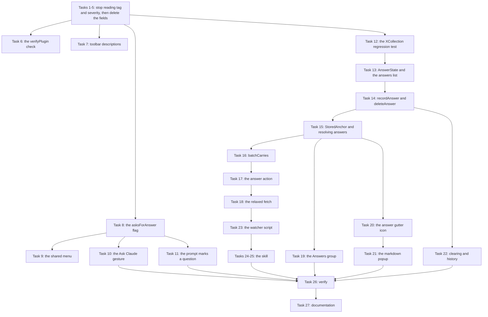
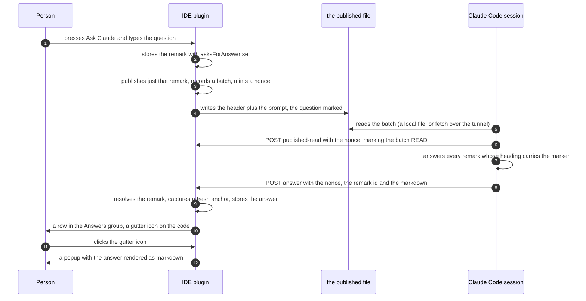

# Claude Remarks Phase 11

## Contents

1. [Overview](#overview)
2. [Context (from discovery)](#context-from-discovery)
3. [Development Approach](#development-approach)
4. [Testing Strategy](#testing-strategy)
5. [Progress Tracking](#progress-tracking)
6. [Solution Overview](#solution-overview)
7. [Technical Details](#technical-details)
8. [What Goes Where](#what-goes-where)
9. [Implementation Steps](#implementation-steps)
10. [Post-Completion](#post-completion)

---

## Overview

Phase 11 carries six changes. The specification is
`docs/plans/20260805-claude-remarks-phase11-spec.md`, and every design argument lives there. This
plan turns it into tasks.

1. **Tags and severity come off a remark.** Severity has never been changed from its default and
   tags have never been picked, so every remark ever published shipped as an untagged `should`.
   Meanwhile the prompt spends a paragraph teaching a four-level scale it then uses one value of, and
   the input popup carries a chip row and five key bindings for a field nobody sets.
2. **Publish moves into the shared gutter and tree menu, and the toolbar buttons get real
   descriptions.** Publishing one remark exists today only as a toolbar button, so asking one
   question takes five steps. Every toolbar tooltip repeats the button's own name, which is why a
   selected-only publish looked like it did not exist.
3. **An Ask Claude gesture writes a remark that asks for an answer.** A remark written the ordinary
   way is work to do or a topic to raise. A remark written through Ask Claude is one the agent
   answers, and the answer comes back onto the line.
4. **An answer comes back into the IDE.** This is the first time anything the agent sends is content
   a person reads rather than a control signal. The answer is its own record with its own anchor, it
   gets a row at the top of the tree and a gutter icon on the code, and clicking that icon opens the
   answer rendered as markdown.
5. **Listen mode claims the pending batch at startup and re-arms itself after each one**, so it stops
   needing a manual restart after every batch.
6. **Listen mode works over an SSH tunnel**, so the everyday loop is the same on a laptop as on the
   machine running the IDE.

**How it fits.** Nothing here is a new subsystem. The answer reuses `anchor/` for its position, the
existing `RemarkStore` for its storage, and the existing `RestService` for its transport. The Ask
Claude gesture reuses `addRemark` and `publishRemarks`. The remote listen branch reuses the `fetch`
action, relaxed by one field.

---

## Context (from discovery)

### The files this touches

- **`model/RemarkState.kt`** — the persisted record, a `BaseState` with sixteen stored properties.
  Two go (`tag`, `severity`), one arrives (`asksForAnswer`).
- **`store/RemarkStore.kt`** — the only `@State` component holding project data, at
  `@State(name = "ClaudeRemarks")` in `.idea/workspace.xml`. Its nested `RemarksState` holds one
  list today and two after this phase.
- **`store/RemarkEdits.kt`** — the only route production code has to change a remark. Eleven public
  functions today, thirteen after this phase.
- **`store/RemarkResolver.kt`** — `resolveAll`, `resolveOne`, `anchorOf`, `isAboutNoFile`.
- **`render/PromptRenderer.kt`** — pure Kotlin, no platform imports. Remarks to markdown.
- **`review/ReviewRestService.kt`** — the `RestService` at
  `POST /api/claude-remarks/{start,ack,fetch,published-read}`, gaining a fifth action.
- **`review/PublishedAck.kt`** — `PublishedBatchService`, the memory of the last sixteen published
  batches.
- **`ui/RemarkActions.kt`**, **`ui/RemarksTree.kt`**, **`ui/RemarksToolWindowFactory.kt`**,
  **`ui/RemarkInputPanel.kt`** — the tool window and the shared menu.
- **`editor/RemarkGutter.kt`**, **`editor/RemarkGutterIcon.kt`** — the gutter icons and tooltips.
- **`docs/skill/claude-remarks-review/SKILL.md`** and
  **`docs/skill/claude-remarks-review/watch-remarks.sh`** — the skill side.

### Patterns already in the codebase that this follows

- **A new endpoint action's consequences live in their own file.** `ack`'s live in
  `review/ReviewLifecycle.kt`, `published-read`'s in `review/PublishedAck.kt`. The `answer` action's
  live in a new `review/AnswerReceipt.kt`. Guard 5 in `CLAUDE.md` is why.
- **Expensive work runs in a `ReadAction.nonBlocking` and finishes on the EDT.** The publish
  pipeline, the gutter sync and the tool window refresh all do this. So does building an answer and
  converting markdown to HTML.
- **A new stored field defaults to something `BaseState` omits, so nothing migrates.**
  `startColumn`, `endColumn` and `phrase` all do this. `asksForAnswer` defaults to `false`.
- **A shared menu is built once and used from two places.** `remarkChangeActions` is used by the
  gutter icon's click menu and by the tree's right-click menu.
- **A pure value type keeps logic out of the platform.** `anchor/SubLineRange.kt` and
  `render/PromptRenderer.kt` are both platform-free so their tests need no fixture. `StoredAnchor`
  follows.

### Dependencies

- IntelliJ Platform 2025.2, Kotlin 2.1.20, `jvmToolchain(21)`, Gradle wrapper 9.1.0.
- `com.intellij.markdown.utils.doc.DocMarkdownToHtmlConverter` and
  `com.intellij.ui.components.JBHtmlPane` are both in `lib/app-client.jar`, which is already on the
  compile classpath. **No change to `build.gradle.kts`'s `dependencies` block is needed.** Section 15
  of the spec records how that was checked.
- `JBHtmlPane` is `@ApiStatus.Experimental`, and `build.gradle.kts` already subtracts
  `EXPERIMENTAL_API_USAGES` from `verifyPlugin`'s failure level for the markdown preview. No new
  tolerance is needed, only one more paragraph in that comment.

---

## Development Approach

**parallel waves**: none - the tasks form one dependency chain and the disjointness test fails almost
everywhere. Half one changes `addRemark`'s signature and the shared `remark(...)` builder in
`store/TestRemarks.kt`, so its edits ripple into test files that six later tasks own. Half two is
sequential by construction: the answers list, then the resolver that reads it, then the endpoint that
writes it, then the tree and gutter that draw it. The two shell tasks describe the endpoint contract
the task before them changes. The one genuinely disjoint pair found — the `verifyPlugin` check and
the toolbar descriptions — is two small tasks, which is not worth a wave.

**testing approach**: TDD (tests first)

Each task writes its tests before its implementation, and each ends with a narrow gate over its own
test classes. The full suite runs once, in the verify task.

**Order.** Half one runs first, and inside it the readers stop reading the two fields before the
fields are deleted. That keeps the tree compiling at every step: a task that removed
`RemarkState.tag` while four files still read it would leave the build broken until every later task
landed.

---

## Testing Strategy

**Automated, per task.** Every task ends with `./gradlew test --tests '...'` naming only its own test
classes. No `clean`, and never the whole suite — that runs once in the verify task.

**Two regression guards are written before the code they guard.**

- ⚠️ **The `@get:XCollection` guard for the answers list, in task 12, before task 13 adds the list.**
  Without that annotation the whole list serializes to an empty element and every answer is lost on
  restart with nothing logged. The specification labels it RARE, MAJOR. This trap has already cost
  this project once, for the `remarks` list.
- **The migration guard, in task 5.** An element carrying `severity="MUST"` and `tag="BUG"` must
  still deserialize into a valid remark after the fields are gone.

**What the automated suite cannot reach**, stated here so nobody looks for it:

- The publish pipeline past the read action. `PublishRemarksTest`'s own KDoc says why: pumping a read
  action plus an EDT callback in a light fixture buys a flaky test for very little. So Ask Claude's
  publish-on-the-spot is a hand check.
- Anything in `watch-remarks.sh` or `SKILL.md`. The Kotlin suite runs no shell. The script's checks
  are by hand, one run each, in the scratchpad.
- Any rendering. There are no UI-rendering tests, so the markdown popup is a hand check.

**Hand checks live in [Post-Completion](#post-completion)**, with the ones needing a second machine
marked.

---

## Progress Tracking

| # | Task | Status |
|---|---|---|
| 1 | Stop printing the tag and the level in the published prompt | complete |
| 2 | Stop showing the tag and the level in the tree, the gutter and the history file | complete |
| 3 | Take the tag chip row out of the input popup | complete |
| 4 | Take the Severity submenu out of the shared menu | complete |
| 5 | Delete the tag and severity fields | complete |
| 6 | Check whether the internal-API subtraction can leave the build file | complete |
| 7 | Real descriptions on the six toolbar buttons | complete |
| 8 | The asksForAnswer flag, and the function that sets it | complete |
| 9 | The shared menu gets Publish and Ask for an Answer | complete |
| 10 | The Ask Claude action, its intention and its menu item | complete |
| 11 | The prompt marks a remark that asks, and prints every remark's id | complete |
| 12 | The regression test for the answers list annotation | complete |
| 13 | AnswerState and the answers list in the store | complete |
| 14 | recordAnswer and deleteAnswer, and the new guard | complete |
| 15 | StoredAnchor, and resolving an answer against its file | complete |
| 16 | batchCarries on the published batch service | not started |
| 17 | The answer endpoint action and AnswerReceipt | not started |
| 18 | The fetch action loses its session requirement | not started |
| 19 | The Answers group in the tree | not started |
| 20 | The answer's gutter icon | not started |
| 21 | The markdown popup | not started |
| 22 | Clearing, the history file and the confirmation dialogs | not started |
| 23 | watch-remarks.sh fetch mode without a session | not started |
| 24 | The skill answers what is marked | not started |
| 25 | The skill: listen mode claims, re-arms and reaches over the tunnel | not started |
| 26 | Verify acceptance criteria | not started |
| 27 | [Final] Update documentation | not started |

---

## Solution Overview



**The round trip the phase builds.**



---

## Technical Details

### The new stored records

`RemarkState` loses `tag` and `severity`, and gains one boolean:

```kotlin
/** Set by the Ask Claude gesture, or by the toggle in the shared menu. Decides whether an
 *  agent sends an answer back. Defaults to false, so BaseState omits it and nothing migrates. */
var asksForAnswer by property(false)
```

`AnswerState` is a new `BaseState` in `model/AnswerState.kt`. It declares its own anchor fields
rather than sharing a superclass with `RemarkState`, because changing `RemarkState`'s serialization
shape risks the silent-loss trap for data that already exists:

```kotlin
class AnswerState : BaseState() {
    var id by string()
    var remarkId by string()      // a plain reference; the remark may be gone
    var question by string()      // the remark's text, copied at answer time
    var markdown by string()      // the answer body
    var answeredAt by property(0L)
    var path by string()
    var startLine by property(0)
    var endLine by property(0)
    var startColumn by property(0)
    var endColumn by property(0)
    var textHash by string()
    var contextBefore by string()
    var contextAfter by string()
    var phrase by string()
    var commit by string()
}
```

`RemarksState` gains a second list beside `remarks`:

```kotlin
@get:XCollection(style = XCollection.Style.v2)
val answers by list<AnswerState>()
```

⚠️ **That annotation is not optional and not cosmetic.** Without it the list serializes to an empty
element and every answer is lost on restart with nothing logged.

### At most one answer per remark

`RemarksState.putAnswer` is an upsert keyed on `remarkId`, not a plain add. It removes any existing
answer for that remark, then appends. A second answer for the same question replaces the first and
captures its own fresh anchor.

This is enforced in the store rather than avoided in the skill, because a re-publish mints a fresh
nonce and a watcher compares nonces rather than content — so the same question reaching a session
twice is ordinary, not rare.

### The shared logic between resolving a remark and resolving an answer

`store/RemarkResolver.kt` gains a pure value type and one function, so the `isAncestor` check, the
`Document` lookup, the general-remark case and the five refusals are written once:

```kotlin
data class StoredAnchor(
    val path: String?, val startLine: Int, val endLine: Int,
    val startColumn: Int, val endColumn: Int,
    val textHash: String?, val contextBefore: String?, val contextAfter: String?,
    val phrase: String?,
)

fun resolveStored(root: VirtualFile, stored: StoredAnchor): ResolvedPosition
```

### The answer endpoint

`POST /api/claude-remarks/answer`, a fifth action on the same `RestService`.

```json
{
  "session":  "a name the calling session invents for itself",
  "project":  "the repository path as the IDE sees it",
  "nonce":    "the published batch's nonce",
  "remarkId": "the id of the remark being answered",
  "answer":   "the answer, as markdown"
}
```

Answers, all HTTP 200 with a `status` field: `ok`, `unknown-batch`, `unknown-remark`, `too-large`
(over 16 KiB), `unknown-project`, `bad-request`.

⚠️ **Guard 5 governs the handler.** `handleAnswer` may parse the body, call `matchProject`, call one
function in another file, and write the status fields. Nothing else. Every consequence lives in
`review/AnswerReceipt.kt`.

### The relaxed fetch

`handleFetch` uses the session in three places, and the third is what stops a listener using it:
`header.reviewSession == session` means a plain publish, which writes `review: none`, can never come
back over the tunnel. Making `session` optional is purely additive — a caller that sends one gets
today's behaviour byte for byte.

### The markdown popup

Convert off the EDT, then show on the EDT:

```
ReadAction.nonBlocking { DocMarkdownToHtmlConverter.convert(project, answer.markdown) }
    .expireWith(project)
    .finishOnUiThread(...) { html -> showAnswerPopup(project, html) }
    .submit(AppExecutorUtil.getAppExecutorService())
```

`DocMarkdownToHtmlConverter.convert` is `@RequiresReadLock` and builds a `PsiFile` per code fence, so
running it on the EDT is a stall a person can feel. `JBHtmlPane` implements `Disposable`, so the
popup must `Disposer.register(popup, pane)`.

---

## What Goes Where

| File | What changes |
|---|---|
| `model/RemarkState.kt` | `RemarkTag`, `RemarkSeverity` and both extensions deleted; `tag` and `severity` deleted; `asksForAnswer` added |
| `model/AnswerState.kt` | **new** — the answer record |
| `store/RemarkStore.kt` | `setSeverity` deleted; `edit` loses its `tag`; the `answers` list, `putAnswer`, `removeAnswer`, `clearAnswers`, `answersSnapshot`, `allAnswers` added |
| `store/RemarkEdits.kt` | `setRemarkSeverity` deleted; `tag` off three signatures; `setRemarkAsksForAnswer`, `recordAnswer`, `deleteAnswer` added |
| `store/RemarkResolver.kt` | `StoredAnchor` and `resolveStored` added; `resolveOne` rewritten onto them; `resolveAnswers` added |
| `store/RemarkHistory.kt` | tag and severity off the heading; an answers section added; `appendToHistory` gains a parameter |
| `render/PromptRenderer.kt` | `tag` and `severity` off `RenderedRemark` and `appendRemarkTail`; `SEVERITY_SCALE_NOTE` becomes `PROMPT_NOTES`; the asks marker and the `id:` line added |
| `render/PromptPayload.kt` | `collectForPrompt` stops reading two fields and starts reading one |
| `settings/RemarkSettings.kt` | `DEFAULT_PROMPT_HEADER` loses the QUESTION-versus-INSTRUCTION bullets |
| `settings/RemarkSettingsConfigurable.kt` | the word `tag` in the settings page's own sentence |
| `ui/RemarkInputPanel.kt` | the chip row, its constants, its Alt bindings and `RemarkInput` all deleted |
| `ui/RemarkActions.kt` | the Severity submenu deleted; Publish and the Ask for an Answer toggle added |
| `ui/RemarksTree.kt` | tag and severity off the row; the asks and answered suffixes; the Answers group and `AnswerNode` |
| `ui/RemarksToolWindowFactory.kt` | `ToolbarAction` gains a description; six descriptions written; delete and double-click handle answer rows; the Clear All dialog counts answers |
| `ui/AnswerPopup.kt` | **new** — the markdown popup |
| `editor/RemarkGutter.kt` | tag and severity off `RemarkPlacement`; answer placements added |
| `editor/RemarkGutterIcon.kt` | tag and severity off the tooltip; the asks line; the answer's own renderer |
| `action/AddRemarkAction.kt` | `tag` off four signatures |
| `action/AddPreviewRemarkAction.kt` | one call argument |
| `action/AskClaudeAction.kt` | **new** — the gesture, plus its intention |
| `review/ReviewRestService.kt` | the `answer` action dispatched and handled; `handleFetch` loses its session requirement |
| `review/PublishedAck.kt` | `batchCarries` added |
| `review/AnswerReceipt.kt` | **new** — `reportAnswer` and `buildAnswer` |
| `META-INF/plugin.xml` | the Ask Claude action, its shortcut and its intention registered |
| `build.gradle.kts` | the `pluginVerification` comment; possibly one subtraction removed |
| `docs/skill/.../watch-remarks.sh` | fetch mode stops requiring `--session` |
| `docs/skill/.../SKILL.md` | the answer step; listen mode three times |

---

## Implementation Steps

### Task 1: Stop printing the tag and the level in the published prompt

**Files:**
- Modify: `src/main/kotlin/dev/sasha/clauderemarks/render/PromptRenderer.kt` (the `tag` and `severity` properties on `RenderedRemark`; the two `append` calls in `appendRemarkTail`; `SEVERITY_SCALE_NOTE`)
- Modify: `src/main/kotlin/dev/sasha/clauderemarks/render/PromptPayload.kt` (the `tag =` and `severity =` lines in `collectForPrompt`)
- Modify: `src/test/kotlin/dev/sasha/clauderemarks/render/PromptRendererTest.kt`
- Modify: `src/test/kotlin/dev/sasha/clauderemarks/render/PromptPayloadTest.kt`

- [x] rewrite `PromptRendererTest` so a remark heading carries neither a tag nor a level, and so the renamed note still carries the commit paragraph and the `⟦`/`⟧` paragraph
- [x] delete the `tag` and `severity` properties from `RenderedRemark` and the two `append` calls from `appendRemarkTail`
- [x] rename `SEVERITY_SCALE_NOTE` to `PROMPT_NOTES` and delete only its first paragraph, the four-level scale — the commit paragraph and the marker paragraph both stay, and its comment about why it lives here rather than in the header stays
- [x] drop the two field assignments in `collectForPrompt`, and update `PromptPayloadTest`
- [x] run `./gradlew test --tests 'dev.sasha.clauderemarks.render.*'` - must pass before task 2

### Task 2: Stop showing the tag and the level in the tree, the gutter and the history file

**Files:**
- Modify: `src/main/kotlin/dev/sasha/clauderemarks/ui/RemarksTree.kt` (the `tag` and `severity` properties on `RemarkNode`; their assignments in `remarkNode`; the two `append` calls in `RemarkTreeRenderer.customizeCellRenderer`)
- Modify: `src/main/kotlin/dev/sasha/clauderemarks/editor/RemarkGutterIcon.kt` (the `tag` and `severity` properties on `RemarkPlacement`; the two `append` calls in `tooltipFor`)
- Modify: `src/main/kotlin/dev/sasha/clauderemarks/editor/RemarkGutter.kt` (the `tag =` and `severity =` lines in `placementsFor`)
- Modify: `src/main/kotlin/dev/sasha/clauderemarks/store/RemarkHistory.kt` (the two `append` calls in `renderHistory`)
- Modify: `src/test/kotlin/dev/sasha/clauderemarks/ui/RemarksTreeTest.kt`, `src/test/kotlin/dev/sasha/clauderemarks/editor/RemarkGutterIconTest.kt`, `src/test/kotlin/dev/sasha/clauderemarks/editor/RemarkGutterTest.kt`, `src/test/kotlin/dev/sasha/clauderemarks/store/RemarkHistoryTest.kt`

- [x] update the four test classes so no assertion expects a tag or a level in a row, a tooltip or a history heading
- [x] delete the two properties from `RemarkNode` and the two `append` calls from the cell renderer
- [x] delete the two properties from `RemarkPlacement` and the two `append` calls from `tooltipFor`, keeping the phrase line and the status lines untouched
- [x] delete the two `append` calls from `renderHistory`, keeping the phrase line and the bucket line
- [x] run `./gradlew test --tests 'dev.sasha.clauderemarks.ui.RemarksTreeTest' --tests 'dev.sasha.clauderemarks.editor.*' --tests 'dev.sasha.clauderemarks.store.RemarkHistoryTest'` - must pass before task 3

### Task 3: Take the tag chip row out of the input popup

**Files:**
- Modify: `src/main/kotlin/dev/sasha/clauderemarks/ui/RemarkInputPanel.kt` (`RemarkInput`, `NO_TAG_LABEL`, `TAG_KEY_PREFIX`, `TAG_CHOICES`, `tagLabel`, `tagFromLabel`, `remarkInputResult`, the `chipRow` property, `selectedTag`, `tagChipsComponent`, the `Alt+0`..`Alt+4` loop in `init`, the Enter binding on the chip row, and the `emptyText.text` placeholder)
- Modify: `src/main/kotlin/dev/sasha/clauderemarks/action/AddRemarkAction.kt` (the `tag` parameter on `showRemarkInput`, `buildInputPopup`, `openRemarkEdit` and `openGeneralRemarkInput`)
- Modify: `src/main/kotlin/dev/sasha/clauderemarks/action/AddPreviewRemarkAction.kt` (the `input.tag` argument in the `addRemark` call)
- Modify: `src/main/kotlin/dev/sasha/clauderemarks/store/RemarkEdits.kt` (the `tag` parameter on `addRemark`, `addGeneralRemark` and `editRemark`)
- Modify: `src/main/kotlin/dev/sasha/clauderemarks/store/RemarkStore.kt` (`RemarksState.editRemark` and `RemarkStore.edit`)
- Modify: `src/test/kotlin/dev/sasha/clauderemarks/ui/RemarkInputPanelTest.kt`, `src/test/kotlin/dev/sasha/clauderemarks/action/AddRemarkActionTest.kt`

- [x] rewrite `RemarkInputPanelTest` so it checks the Enter, Shift+Enter and class-name bindings and nothing about chips
- [x] delete the chip row, its five constants and helpers, `selectedTag`, `tagChipsComponent` and the Alt binding loop, and collapse `RemarkInput` to a plain `String` returned by `remarkInputResult`
- [x] rewrite the placeholder text so it no longer promises `Alt+1-4 picks a tag`
- [x] drop the `tag` parameter from the four functions in `AddRemarkAction.kt`, from the three in `RemarkEdits.kt`, and from `editRemark`/`edit` in `RemarkStore.kt`, then fix every call site the compiler names
- [x] run `./gradlew test --tests 'dev.sasha.clauderemarks.ui.RemarkInputPanelTest' --tests 'dev.sasha.clauderemarks.action.AddRemarkActionTest'` - must pass before task 4

### Task 4: Take the Severity submenu out of the shared menu

**Files:**
- Modify: `src/main/kotlin/dev/sasha/clauderemarks/ui/RemarkActions.kt` (the `severity` `DefaultActionGroup` inside `remarkChangeActions`, and its two imports)
- Modify: `src/test/kotlin/dev/sasha/clauderemarks/ui/RemarkActionsTest.kt`

- [x] delete the two severity tests from `RemarkActionsTest` and leave the bucket-item test in place
- [x] delete the `severity` group from `remarkChangeActions`, leaving `Move to Bucket…` as its only child for now
- [x] update the function's KDoc, which today explains where severity is chosen — replace that paragraph rather than leaving it describing something that is gone
- [x] run `./gradlew test --tests 'dev.sasha.clauderemarks.ui.RemarkActionsTest'` - must pass before task 5

### Task 5: Delete the tag and severity fields

**Model:** haiku

**Files:**
- Modify: `src/main/kotlin/dev/sasha/clauderemarks/model/RemarkState.kt` (`enum class RemarkTag`, `RemarkTag.label`, `enum class RemarkSeverity`, `RemarkSeverity.label`, `var tag`, `var severity`)
- Modify: `src/main/kotlin/dev/sasha/clauderemarks/store/RemarkStore.kt` (`RemarksState.setSeverity` and `RemarkStore.setSeverity`)
- Modify: `src/main/kotlin/dev/sasha/clauderemarks/store/RemarkEdits.kt` (`setRemarkSeverity`, and the count in the file's own header comment)
- Modify: `src/main/kotlin/dev/sasha/clauderemarks/settings/RemarkSettingsConfigurable.kt` (the `comment(...)` string that names `tag`)
- Modify: `src/main/kotlin/dev/sasha/clauderemarks/ui/RemarksToolWindowFactory.kt` (the two comments that mention severity, one above `tree.addMouseListener`, one in `TreePopupHandler`'s KDoc)
- Modify: `src/test/kotlin/dev/sasha/clauderemarks/store/TestRemarks.kt` (the `tag` and `severity` parameters on `remark(...)`)
- Modify: `src/test/kotlin/dev/sasha/clauderemarks/store/RemarkStoreStateTest.kt`

- [x] add the migration test to `RemarkStoreStateTest`: an XML element carrying `severity="MUST"` and `tag="BUG"` still deserializes into a valid remark with every other field intact
- [x] delete the test that asserts a missing `severity` attribute loads as the default, and drop the two fields from the fully populated remark the serialization test builds
- [x] delete both enums, both `label` extensions and both properties from `RemarkState.kt`
- [x] delete `setSeverity` from both places in `RemarkStore.kt` and `setRemarkSeverity` from `RemarkEdits.kt`, and correct the function count in that file's header comment
- [x] drop the two parameters from `remark(...)` in `TestRemarks.kt`, reword the settings page sentence, and reword the two comments in `RemarksToolWindowFactory.kt`
- [x] run `./gradlew test --tests 'dev.sasha.clauderemarks.store.*'` - must pass before task 6

### Task 6: Check whether the internal-API subtraction can leave the build file

**Files:**
- Modify: `build.gradle.kts` (the `pluginVerification` block's `failureLevel` line and the comment above it)

- [x] remove `- FailureLevel.INTERNAL_API_USAGES` from the `failureLevel` expression, leaving the experimental subtraction alone
- [x] run `./gradlew verifyPlugin` and read the report
- [x] if it passes, delete the two comment paragraphs that describe `SegmentedButton.component` as the one internal usage — the chip row that caused it is gone
- [x] if it fails, put the subtraction back and rewrite the comment to name what the verifier actually found, rather than leaving it describing a usage that no longer exists (not needed — the run passed with zero internal-API usages)
- [x] run `./gradlew verifyPluginProjectConfiguration` - must pass before task 7

### Task 7: Real descriptions on the six toolbar buttons

**Model:** haiku

**Files:**
- Modify: `src/main/kotlin/dev/sasha/clauderemarks/ui/RemarksToolWindowFactory.kt` (the `ToolbarAction` inner class constructor and its `DumbAwareAction(text, text, icon)` call, and the six `ToolbarAction(...)` constructions in `toolbarActions()`)
- Modify: `src/test/kotlin/dev/sasha/clauderemarks/ui/RemarksPanelTest.kt`

- [x] add a test that every toolbar action's description differs from its own text — assert they differ rather than asserting the exact wording, so the table stays prose and not a fixture
- [x] give `ToolbarAction` a `description` parameter and pass it through to `DumbAwareAction(text, description, icon)`
- [x] write the six descriptions from the plan's own table, saying what each button takes rather than repeating its name — Clear Handed Over says answers are kept, Clear All says it takes them
- [x] run `./gradlew test --tests 'dev.sasha.clauderemarks.ui.RemarksPanelTest'` - must pass before task 8

### Task 8: The asksForAnswer flag, and the function that sets it

**Files:**
- Modify: `src/main/kotlin/dev/sasha/clauderemarks/model/RemarkState.kt` (add `var asksForAnswer by property(false)` after `text`)
- Modify: `src/main/kotlin/dev/sasha/clauderemarks/store/RemarkStore.kt` (add `RemarksState.setAsksForAnswer` beside `setBucket`, and the delegating `RemarkStore.setAsksForAnswer`)
- Modify: `src/main/kotlin/dev/sasha/clauderemarks/store/RemarkEdits.kt` (add `setRemarkAsksForAnswer` beside `setRemarkBucket`, and an `asksForAnswer` parameter on `addRemark` and `addGeneralRemark`)
- Modify: `src/test/kotlin/dev/sasha/clauderemarks/store/TestRemarks.kt` (add `asksForAnswer` to `remark(...)`, defaulting to false)
- Modify: `src/test/kotlin/dev/sasha/clauderemarks/store/RemarkStoreStateTest.kt`, `src/test/kotlin/dev/sasha/clauderemarks/store/RemarkEditsTest.kt`

- [x] write the migration test: `asksForAnswer` defaults to false, is omitted from the serialized XML when false, and an element written before the field existed loads as false
- [x] write the test that `setRemarkAsksForAnswer` publishes `REMARKS_CHANGED`, and that `addRemark` stores the flag it was given
- [x] add the property to `RemarkState`, with a KDoc saying what sets it and what reads it
- [x] add `setAsksForAnswer` to `RemarksState` and `RemarkStore`, returning how many changed, the same shape `setBucket` uses
- [x] add `setRemarkAsksForAnswer` to `RemarkEdits.kt` and the parameter to the two add functions, and correct the function count in that file's header comment
- [x] run `./gradlew test --tests 'dev.sasha.clauderemarks.store.RemarkStoreStateTest' --tests 'dev.sasha.clauderemarks.store.RemarkEditsTest'` - must pass before task 9

### Task 9: The shared menu gets Publish and Ask for an Answer

**Files:**
- Modify: `src/main/kotlin/dev/sasha/clauderemarks/ui/RemarkActions.kt` (`remarkChangeActions`, adding two children before `Move to Bucket…`)
- Modify: `src/test/kotlin/dev/sasha/clauderemarks/ui/RemarkActionsTest.kt`

- [x] write the test that the menu offers Ask for an Answer, Publish and Move to Bucket…, in that order
- [x] write the test that pressing Publish acts on the ids the lambda names at press time, not at build time — this replaces the deleted severity test and is why no injectable chooser is needed
- [x] write the test that the Ask for an Answer toggle reports the store's state and flips it across several ids at once
- [x] add a `ToggleAction` whose `isSelected` is true when every remark in `ids()` carries the flag, and whose `setSelected` calls `setRemarkAsksForAnswer` on all of them
- [x] add a Publish item calling `publishRemarks(project, ids())`, returning early on an empty list the way `chooseBucket` already does
- [x] run `./gradlew test --tests 'dev.sasha.clauderemarks.ui.RemarkActionsTest'` - must pass before task 10

### Task 10: The Ask Claude action, its intention and its menu item

**Files:**
- Create: `src/main/kotlin/dev/sasha/clauderemarks/action/AskClaudeAction.kt`
- Modify: `src/main/kotlin/dev/sasha/clauderemarks/action/AddRemarkAction.kt` (`selectedLines` and `showRemarkInput`, both reused by the new action)
- Modify: `src/main/resources/META-INF/plugin.xml` (the `<actions>` block, beside `ClaudeRemarks.AddRemark`; and the `<intentionAction>` registration)
- Create: `src/main/resources/intentionDescriptions/AskClaudeIntention/description.html`
- Modify: `src/test/kotlin/dev/sasha/clauderemarks/ui/ActionIdsTest.kt`

- [x] add the new action id to `ActionIdsTest` beside the two it already pins — that test exists because `README.md` promises those ids will not be renamed, and the third joins the promise
- [x] check the default keymap for `Ctrl+Alt+Shift+A` and pick a free stroke if it is taken, then register the action, its shortcut and its intention in `plugin.xml`
- [x] write `AskClaudeAction.kt`: open the same input popup, call `addRemark` with `asksForAnswer = true`, then call `publishRemarks(project, listOf(remark.id))` on the stored remark
- [x] add the intention beside `AddRemarkIntention`, and the editor popup-menu entry beside the existing one, so the gesture has the same three entry points the ordinary remark has
- [x] run `./gradlew test --tests 'dev.sasha.clauderemarks.action.ActionIdsTest'` and `./gradlew verifyPluginProjectConfiguration` - must pass before task 11

### Task 11: The prompt marks a remark that asks, and prints every remark's id

**Files:**
- Modify: `src/main/kotlin/dev/sasha/clauderemarks/render/PromptRenderer.kt` (add `id` and `asksForAnswer` to `RenderedRemark`; the heading in `renderPrompt`'s file loop and its General loop; `appendRemarkTail`; `PROMPT_NOTES`)
- Modify: `src/main/kotlin/dev/sasha/clauderemarks/render/PromptPayload.kt` (`collectForPrompt`)
- Modify: `src/main/kotlin/dev/sasha/clauderemarks/settings/RemarkSettings.kt` (`DEFAULT_PROMPT_HEADER`, the two QUESTION-versus-INSTRUCTION bullets)
- Modify: `src/test/kotlin/dev/sasha/clauderemarks/render/PromptRendererTest.kt`

- [x] write the tests: a marked remark's heading carries `— asks for an answer` and an unmarked one does not, every remark carries an `id:` line under its heading, and `PROMPT_NOTES` explains the marker
- [x] add `id` and `asksForAnswer` to `RenderedRemark` and fill them in `collectForPrompt`
- [x] print the marker in the heading and the id on its own line under it, in both the General section and the per-file sections
- [x] add the marker's meaning to `PROMPT_NOTES` — it belongs there and not in the header, because the header is editable and a rewritten one would take the explanation with it
- [x] delete the two QUESTION-versus-INSTRUCTION bullets from `DEFAULT_PROMPT_HEADER`, which told the model to work out for itself which remarks are questions
- [x] run `./gradlew test --tests 'dev.sasha.clauderemarks.render.*' --tests 'dev.sasha.clauderemarks.settings.*'` - must pass before task 12

### Task 12: The regression test for the answers list annotation

**Files:**
- Create: `src/test/kotlin/dev/sasha/clauderemarks/store/AnswerStateTest.kt`
- Modify: `src/test/kotlin/dev/sasha/clauderemarks/store/RemarkStoreStateTest.kt` (beside the existing `@get:XCollection` guard for the `remarks` list)

- [x] ⚠️ write the guard first, before task 13 adds the list: a `RemarksState` holding one answer must serialize to XML that actually contains that answer's fields, and must deserialize back to one answer
- [x] write the guard that `snapshot()` copies answers deeply, so no reader shares an object with the live state
- [x] write the guard that two `getState()` calls never return the same answers list instance
- [x] confirm each of the three fails right now, for the right reason, before task 13 makes them pass — a guard that was green before the feature existed is guarding nothing (proven by mutation against a temporary scaffold, which was then reverted; see the progress log)
- [x] run `./gradlew test --tests 'dev.sasha.clauderemarks.store.AnswerStateTest' --tests 'dev.sasha.clauderemarks.store.RemarkStoreStateTest'` - expected to fail here, and must pass at the end of task 13

### Task 13: AnswerState and the answers list in the store

**Files:**
- Create: `src/main/kotlin/dev/sasha/clauderemarks/model/AnswerState.kt`
- Modify: `src/main/kotlin/dev/sasha/clauderemarks/store/RemarkStore.kt` (`RemarksState`: the `answers` list beside `remarks`, `putAnswer`, `removeAnswer`, `clearAnswers`, `answersSnapshot`, and `clear`; `RemarkStore`: `allAnswers` and the delegating mutators, and `getState`)
- Modify: `src/test/kotlin/dev/sasha/clauderemarks/store/AnswerStateTest.kt`

- [x] write the test that `putAnswer` replaces: a second answer for the same `remarkId` leaves one answer carrying the second body, and a second answer for a different `remarkId` leaves two
- [x] create `AnswerState` with its own copy of the anchor fields, and a KDoc saying why it does not share a superclass with `RemarkState`
- [x] ⚠️ add the `answers` list to `RemarksState` **with `@get:XCollection(style = XCollection.Style.v2)`** — without it the list serializes empty and every answer is lost on restart with nothing logged
- [x] add `putAnswer` as an upsert keyed on `remarkId`, plus `removeAnswer`, `clearAnswers` and `answersSnapshot`, all `@Synchronized`; make `clear()` clear both lists and `getState()` copy both
- [x] add `allAnswers()` to `RemarkStore` as the read-only accessor the tree, the gutter and the resolver will use
- [x] run `./gradlew test --tests 'dev.sasha.clauderemarks.store.AnswerStateTest' --tests 'dev.sasha.clauderemarks.store.RemarkStoreStateTest'` - must pass before task 14

### Task 14: recordAnswer and deleteAnswer, and the new guard

**Files:**
- Modify: `src/main/kotlin/dev/sasha/clauderemarks/store/RemarkEdits.kt` (add `recordAnswer` and `deleteAnswer` beside `setRemarkBucket`, and correct the count in the file's header comment)
- Modify: `src/test/kotlin/dev/sasha/clauderemarks/store/RemarkEditsTest.kt`

- [x] write the tests that `recordAnswer` and `deleteAnswer` each publish `REMARKS_CHANGED`
- [x] add `recordAnswer(project, answer)` going through `putAnswer`, so replacement happens here and nowhere else
- [x] add `deleteAnswer(project, id)` going through `removeAnswer`
- [x] name it `recordAnswer` and not `addAnswer` — it upserts, and a function called `addAnswer` that silently replaces would be a lie in the one file the new guard points at
- [x] correct the function count in the file's header comment to thirteen, twelve mutators plus `notifyRemarksChanged`
- [x] run `./gradlew test --tests 'dev.sasha.clauderemarks.store.RemarkEditsTest'` - must pass before task 15

### Task 15: StoredAnchor, and resolving an answer against its file

**Files:**
- Modify: `src/main/kotlin/dev/sasha/clauderemarks/store/RemarkResolver.kt` (add `StoredAnchor` and `resolveStored`; rewrite `resolveOne` onto them; add `ResolvedAnswer` and `resolveAnswers`)
- Create: `src/test/kotlin/dev/sasha/clauderemarks/store/AnswerResolveTest.kt`
- Modify: `src/test/kotlin/dev/sasha/clauderemarks/store/ResolveAllTest.kt`

- [x] write `AnswerResolveTest`: an answer resolves against a real file, follows the code when twenty lines are inserted above it, orphans when the code is gone, and an answer with an empty path resolves as itself the way a general remark does
- [x] add the pure `StoredAnchor` value type and `resolveStored`, carrying the `fileForStoredPath` check, the `Document` lookup, the general case and the five refusals
- [x] rewrite `resolveOne` to build a `StoredAnchor` and call `resolveStored`, and confirm `ResolveAllTest` still passes unchanged — the remark path must behave identically
- [x] add `resolveAnswers(project)` reading `allAnswers()` and returning a resolved row per answer, with `ProgressManager.checkCanceled()` once per answer the way `resolveAll` already does
- [x] run `./gradlew test --tests 'dev.sasha.clauderemarks.store.AnswerResolveTest' --tests 'dev.sasha.clauderemarks.store.ResolveAllTest'` - must pass before task 16

### Task 16: batchCarries on the published batch service

**Files:**
- Modify: `src/main/kotlin/dev/sasha/clauderemarks/review/PublishedAck.kt` (add `BatchLookup` and `PublishedBatchService.batchCarries` beside `acknowledge`)
- Modify: `src/test/kotlin/dev/sasha/clauderemarks/review/PublishedAckTest.kt`

- [ ] write the tests: a known nonce carrying the remark answers OK, a known nonce not carrying it answers UNKNOWN_REMARK, an unknown nonce answers UNKNOWN_BATCH
- [ ] write the test that `batchCarries` is non-destructive — a `published-read` after any number of `batchCarries` calls still answers `ok`
- [ ] add the `BatchLookup` enum and the `@Synchronized batchCarries`, which reads and returns and never stamps `readBy`
- [ ] run `./gradlew test --tests 'dev.sasha.clauderemarks.review.PublishedAckTest'` - must pass before task 17

### Task 17: The answer endpoint action and AnswerReceipt

**Files:**
- Create: `src/main/kotlin/dev/sasha/clauderemarks/review/AnswerReceipt.kt`
- Modify: `src/main/kotlin/dev/sasha/clauderemarks/review/ReviewRestService.kt` (the `when (action)` inside `execute`; a new `AnswerRequest` class beside `PublishedReadRequest`; a new `handleAnswer` beside `handlePublishedRead`; a `MAX_ANSWER_BYTES` constant beside `MAX_PUBLISHED_BYTES`)
- Create: `src/test/kotlin/dev/sasha/clauderemarks/review/AnswerReceiptTest.kt`
- Modify: `src/test/kotlin/dev/sasha/clauderemarks/review/ReviewEndpointSmokeTest.kt`

- [ ] write the endpoint tests through a real `EmbeddedChannel`: `ok`, `unknown-batch`, `unknown-remark`, `too-large`, `unknown-project`, `bad-request`, and that a second answer for the same remark is also `ok`
- [ ] write the test that an answer for an **unmarked** remark is also `ok` — the endpoint deliberately does not check `asksForAnswer`, and without a test that decision will be quietly reversed
- [ ] write `AnswerReceiptTest`: answering marks nothing read, answering does not consume the batch, an answer for a remark deleted in between is stored with no anchor rather than dropped, and an answer works with no review ever started
- [ ] write `reportAnswer` and `buildAnswer` in `AnswerReceipt.kt`, resolving the remark and capturing a fresh anchor inside a `ReadAction.nonBlocking`, then calling `recordAnswer` and the balloon in `finishOnUiThread`
- [ ] ⚠️ add `handleAnswer` to `ReviewRestService.kt` doing only four things — parse, `matchProject`, call `reportAnswer`, write the status fields — and keep its comment free of the five symbol names guard 5 greps for, because that grep cannot tell a comment from code
- [ ] run `./gradlew test --tests 'dev.sasha.clauderemarks.review.AnswerReceiptTest' --tests 'dev.sasha.clauderemarks.review.ReviewEndpointSmokeTest'` - must pass before task 18

### Task 18: The fetch action loses its session requirement

**Files:**
- Modify: `src/main/kotlin/dev/sasha/clauderemarks/review/ReviewRestService.kt` (`handleFetch`: the `session.isNullOrBlank()` refusal, the `live` short-circuit, and the `header.reviewSession == session` branch)
- Modify: `src/test/kotlin/dev/sasha/clauderemarks/review/ReviewEndpointSmokeTest.kt`

- [ ] write the test that a fetch with no `session` returns `ready` for a plain publish — the case that is impossible today, because a plain publish writes `review: none` and the header gate can never match
- [ ] write the regression test that a fetch **with** a session behaves exactly as it does now, including `no-review` for a batch answering a different session — this is the whole argument for relaxing rather than adding a sixth action
- [ ] write the test that a session-less fetch with no published file still answers `no-review`
- [ ] make `session` optional: refuse only on a missing `project`, skip the live-review short-circuit when there is no session, and skip the header gate when there is no session
- [ ] update the class KDoc's list of what `fetch` answers, and say that an absent session means any batch
- [ ] run `./gradlew test --tests 'dev.sasha.clauderemarks.review.ReviewEndpointSmokeTest'` - must pass before task 19

### Task 19: The Answers group in the tree

**Files:**
- Modify: `src/main/kotlin/dev/sasha/clauderemarks/ui/RemarksTree.kt` (add `ANSWERS_KEY` and `ANSWERS_LABEL` beside `GENERAL_KEY`; add `AnswerNode`; add the group to `buildTreeRoot` above the General group; add the asks and answered suffix to `RemarkTreeRenderer.customizeCellRenderer`)
- Modify: `src/main/kotlin/dev/sasha/clauderemarks/ui/RemarksToolWindowFactory.kt` (`refresh` so it resolves answers too, `deleteSelected`, `navigateToSelected`)
- Modify: `src/test/kotlin/dev/sasha/clauderemarks/ui/RemarksTreeTest.kt`, `src/test/kotlin/dev/sasha/clauderemarks/ui/RemarksPanelTest.kt`

- [ ] write the tests: the Answers group is first and above General, it appears only when an answer exists, its rows are sorted newest first, a row carries the answer's first line, and a tree with answers and no buckets still has no bucket level
- [ ] write the test that a marked remark's row says `asks` with no answer and `answered` with one
- [ ] add `AnswerNode` and the Answers group to `buildTreeRoot`, keyed on a bare word that cannot collide with `file:` or `bucket:`
- [ ] add the grey `asks` and `answered` suffix to the remark row, beside the `published` and `read` words — text and not a new icon, because the icon axis already carries status
- [ ] make `deleteSelected` handle answer rows and `navigateToSelected` open the popup instead of navigating when the selected row is one
- [ ] run `./gradlew test --tests 'dev.sasha.clauderemarks.ui.RemarksTreeTest' --tests 'dev.sasha.clauderemarks.ui.RemarksPanelTest'` - must pass before task 20

### Task 20: The answer's gutter icon

**Files:**
- Modify: `src/main/kotlin/dev/sasha/clauderemarks/editor/RemarkGutterIcon.kt` (add an `AnswerPlacement` beside `RemarkPlacement`, an `answerTooltipFor`, and an `AnswerGutterIconRenderer` with its own `equals` and `hashCode`; add the asks line to `tooltipFor`)
- Modify: `src/main/kotlin/dev/sasha/clauderemarks/editor/RemarkGutter.kt` (`placementsFor` so it also builds answer placements, and `apply` so it paints them)
- Modify: `src/test/kotlin/dev/sasha/clauderemarks/editor/RemarkGutterTest.kt`, `src/test/kotlin/dev/sasha/clauderemarks/editor/RemarkGutterIconTest.kt`

- [ ] write the tests: an answer produces a placement on its resolved lines, a general remark's answer produces none, and the answer renderer's `equals` and `hashCode` are keyed on what is painted
- [ ] write the test that a marked remark's tooltip carries the asks line and an unmarked one does not
- [ ] add `AnswerPlacement`, `answerTooltipFor` and `AnswerGutterIconRenderer` using `AllIcons.General.Balloon`
- [ ] extend `placementsFor` and `apply` so answers get highlighters alongside remarks, keeping the existing rule that a live highlighter is kept when the fresh resolve orphans
- [ ] run `./gradlew test --tests 'dev.sasha.clauderemarks.editor.*'` - must pass before task 21

### Task 21: The markdown popup

**Files:**
- Create: `src/main/kotlin/dev/sasha/clauderemarks/ui/AnswerPopup.kt`
- Modify: `src/main/kotlin/dev/sasha/clauderemarks/editor/RemarkGutterIcon.kt` (`AnswerGutterIconRenderer.getClickAction`, so clicking opens the popup)
- Modify: `build.gradle.kts` (the `pluginVerification` comment, adding a paragraph naming `JBHtmlPane`)
- Create: `src/test/kotlin/dev/sasha/clauderemarks/ui/AnswerPopupTest.kt`

- [ ] write the one fixture-backed test that `DocMarkdownToHtmlConverter.convert(project, markdown)` works in this build: a `# heading` produces an `<h` and a fenced block produces a `<pre` — it tests that the platform call resolves and returns, not that it renders
- [ ] write `showAnswerPopup`, converting inside a `ReadAction.nonBlocking` and showing in `finishOnUiThread`, because `convert` is `@RequiresReadLock` and builds a `PsiFile` per fence
- [ ] build the popup from a `JBHtmlPane` inside a `JBScrollPane`, resizable and movable, with `setCancelKeyEnabled(true)`
- [ ] ⚠️ `Disposer.register(popup, pane)` — `JBHtmlPane` implements `Disposable`, nothing else in this plugin creates a `Disposable` Swing component, and forgetting it leaks quietly
- [ ] add a paragraph to the `pluginVerification` comment naming `JBHtmlPane` as a second reason the experimental subtraction exists, so removing the preview later does not remove the subtraction the popup needs
- [ ] run `./gradlew test --tests 'dev.sasha.clauderemarks.ui.AnswerPopupTest'` and `./gradlew verifyPlugin` - must pass before task 22

### Task 22: Clearing, the history file and the confirmation dialogs

**Files:**
- Modify: `src/main/kotlin/dev/sasha/clauderemarks/store/RemarkHistory.kt` (`appendToHistory` gains an answers parameter; `renderHistory` gains an answers section)
- Modify: `src/main/kotlin/dev/sasha/clauderemarks/store/RemarkEdits.kt` (`clearAllRemarks` and the private `archive`)
- Modify: `src/main/kotlin/dev/sasha/clauderemarks/ui/RemarksToolWindowFactory.kt` (`confirmClearAll`'s message)
- Modify: `src/test/kotlin/dev/sasha/clauderemarks/store/RemarkHistoryTest.kt`, `src/test/kotlin/dev/sasha/clauderemarks/store/RemarkEditsTest.kt`

- [ ] write the tests: an answer's history entry carries its position, its question and its markdown indented; `clearAllRemarks` archives both lists and clears both; `clearHandedOverRemarks` archives and clears only remarks
- [ ] add the answers parameter to `appendToHistory` and the answers section to `renderHistory`, indenting the markdown the way a remark's text already is so a heading or a fence cannot restructure the document
- [ ] make `clearAllRemarks` collect answers as well as remarks, archive both in one write, and clear both only if that write succeeded
- [ ] leave `clearHandedOverRemarks` alone — an answer was never handed anywhere, so "handed over" says nothing about it
- [ ] change the Clear All dialog to count both, so it never silently takes answers a person was not told about
- [ ] run `./gradlew test --tests 'dev.sasha.clauderemarks.store.RemarkHistoryTest' --tests 'dev.sasha.clauderemarks.store.RemarkEditsTest'` - must pass before task 23

### Task 23: watch-remarks.sh fetch mode without a session

**Files:**
- Modify: `docs/skill/claude-remarks-review/watch-remarks.sh` (the `fetch)` branch of the mode `case` that requires `session_id`; the `jq -n` body construction in the fetch loop; the `timed_out_fetch` message; the `usage` synopsis; the comment above `trap 'cleanup; ...' INT TERM HUP`)

- [ ] drop `session_id` from the fetch-mode guard, so it requires the url and the project and no longer the session
- [ ] build the request body without a `session` field when `$session_id` is empty, and with it when it is not
- [ ] reword `timed_out_fetch` so it does not name a session it may not have, and update the `usage` synopsis to show `--session` as optional
- [ ] ⚠️ correct the comment above the `INT TERM HUP` trap, which tells a reader to treat any exit code above 128 as "another watcher took over" — that is wrong, 143 is `128 + SIGTERM` from any kill, and it is where the wrong rule in the skill came from. Say instead that the pid file, not the exit code, is what distinguishes a takeover
- [ ] ⚠️ leave the token handling exactly as it is — read from `CLAUDE_REMARKS_TOKEN` and passed to `curl` on stdin through `--config -`, never as an argument where `ps` can read it
- [ ] check by hand in the scratchpad, with `HOME` pointed at a temporary directory and **never at the real `~/.claude-remarks`**: it starts with no `--session`, it still refuses with no `--project`, and it still refuses with no `CLAUDE_REMARKS_TOKEN` - must pass before task 24

### Task 24: The skill answers what is marked

**Files:**
- Modify: `docs/skill/claude-remarks-review/SKILL.md` (a new answering section referenced from all three modes; the two places that say "each with its severity, its tag and the code it points at"; the one-shot mode's closing "Then act on the remarks" line)

- [ ] write the answering step once: find every remark whose heading carries the asks marker, answer each in this turn from the conversation and the batch payload, and POST each answer with the batch's nonce and the remark's id
- [ ] say plainly that a subagent is the escalation and not the default, and why — it starts with an empty context, so making it the default pays to re-derive what the session already knows
- [ ] add the two must-not rules: answering a question is not licence to do the work it implies, and a failed POST is reported rather than retried more than once
- [ ] ⚠️ write the POST as a third copy of the `printf 'header = ...' | curl --config -` shape, so the token never reaches `curl`'s argv and is never echoed — the file already argues why these stay copies rather than a shared script
- [ ] reference the answering step from listen mode, from the read-what-is-published mode and from review mode's step 7, and fix the two severity-and-tag sentences
- [ ] check by hand in the scratchpad that the new shell block runs, with `HOME` overridden - must pass before task 25

### Task 25: The skill: listen mode claims, re-arms and reaches over the tunnel

**Files:**
- Modify: `docs/skill/claude-remarks-review/SKILL.md` (the `## Listen for the next batch` section: its startup block, its exit-code handling, and its opening promise that it acts on nothing published before it started)

- [ ] add the startup claim: read the published file, POST `published-read` for the nonce on line 2, and act on each of the three answers — `ok` surfaces it, `already-read` skips it, `unknown-batch` surfaces it and says plainly it may already have been done
- [ ] add the loop in this exact order — batch arrives, acknowledge, **re-arm immediately, before summarising**, then summarise and wait for go — and say why step three is where it is
- [ ] ⚠️ write the exit-code-above-128 rule against the **pid file**, never against the code itself — 143 is `128 + SIGTERM` and any kill produces it. Read `~/.claude-remarks/<hash>.watch`; if absent, wait two seconds and read once more; if it then names a live process whose command line holds `watch-remarks.sh` and the same identity, another session took over, so say so and **stop**; otherwise nothing took over, so re-arm and say in one line that the watcher was killed and restarted
- [ ] say which identity the check compares in each mode — the published file's path in file mode, the project path as the IDE machine sees it in fetch mode — and apply the same check to review mode's step 6, which carries the same wrong rule and predates this phase
- [ ] add the remote branch: read the four stored values from `remote-<hash>.env` with a whitelist parse and never by sourcing it, build `base_url` once, get the startup nonce from a session-less `fetch` because there is no local file to read, and arm the watcher with `--fetch` and `--seen`
- [ ] state the one rule covering every remote POST — the claim, the acknowledgement and the answer all go to `$base_url` with the token on stdin — and delete the two sentences promising listen mode acts on nothing published before it started
- [ ] check by hand in the scratchpad that the changed blocks run, with `HOME` overridden - must pass before task 26

### Task 26: Verify acceptance criteria

**Files:**
- Modify: none

- [ ] run `./gradlew test` — the whole suite, once
- [ ] run `./gradlew build` and `./gradlew verifyPluginProjectConfiguration`
- [ ] run `./gradlew verifyPlugin` and confirm the report is what task 6 and task 21 left it
- [ ] run all six `CLAUDE.md` guard greps plus the new answer guard, and confirm every one comes back empty
- [ ] confirm `store/RemarkEdits.kt` really holds thirteen public functions, by opening it and counting, because that is what the guard's own prose promises a reader
- [ ] ⚠️ do **not** run `./gradlew runIde` — it starts an interactive sandbox IDE that never exits

### Task 27: [Final] Update documentation

**Files:**
- Modify: `README.md` (the remark-writing section that names `Ctrl+Alt+Shift+R`, the tag and severity paragraphs, the tool window section, and the Listen mode section)
- Modify: `CLAUDE.md` (the phase paragraphs, the rules list, the project structure block, the testing section)
- Modify: `docs/claude/design.md` (the Contents, "What a Remark Contains", the "Severity" and "Tag chips" subsections, the Publish Pipeline, the Shared Review Session, Known Issues)
- Modify: `docs/ideas.md` (the two built-idea sections that point at the deleted design subsections)
- Modify: `docs/plans/20260805-claude-remarks-phase11.md` (move to `docs/plans/completed/`)

- [ ] update `CLAUDE.md`: the phase 11 paragraph, the new seventh guard, guard 3's count of thirteen and its second exempted read-only name, guard 5's fifth action, the project structure block for the four new files, and the testing section
- [ ] update `docs/claude/design.md`: delete the "Severity" and "Tag chips" subsections, add sections for the Ask Claude gesture and for what an answer is, and record the two new Known Issues — Ask Claude answering a waiting review, and a local and a remote watcher not seeing each other
- [ ] update `README.md`: the Ask Claude gesture beside `Ctrl+Alt+Shift+R`, the deleted tag and severity paragraphs, and the two listen-mode promises this phase reverses
- [ ] update `docs/ideas.md` so the two built-idea sections no longer point at design subsections that are gone
- [ ] bump the version in `build.gradle.kts` and add a `CHANGELOG.md` entry
- [ ] move this plan to `docs/plans/completed/20260805-claude-remarks-phase11.md`

---

## Post-Completion

### Hard constraints carried into every task

- **NEVER write remarks into source files as comments.** No `// AI!` markers. Remarks and answers
  live in IDE-side state only.
- **Nothing remark-related enters VCS.**
- **Respect IntelliJ threading rules.** EDT for UI, ReadAction for PSI and Document reads, never
  block the EDT. The endpoint's `execute` runs on a netty IO thread; guard 5 governs
  `review/ReviewRestService.kt`, so the new action's consequences live in
  `review/AnswerReceipt.kt`, the way the `ack` action's live in `review/ReviewLifecycle.kt`.
- **Verify current platform APIs against the SDK checkout or the jars.** Do not rely on training data
  for extension point names, the Gradle plugin DSL, or the `plugin.xml` schema. The checkout is at
  `~/dev/oss/intellij-community`, tag `idea/2025.2.6.3`; the jars are under
  `~/.gradle/caches/9.1.0/transforms/*/transformed/ideaIC-2025.2-aarch64/lib/`.
- **Do NOT run `./gradlew runIde`.** It starts an interactive sandbox IDE that never exits.
- **Any shell check runs in the scratchpad with `HOME` overridden.** Never against the real
  `~/.claude-remarks`, which holds real remarks.
- **The IDE token must never reach `curl`'s argv**, where `ps` can see it, and must never be echoed.
  That holds for the new answer POST and for the relaxed fetch as much as for the calls that already
  exist.
- **No semicolon inside a Mermaid diagram label.** Mermaid reads it as a statement separator and the
  whole diagram fails to render, not one line.

### Hand checks

None of these is reachable by `./gradlew test`. The Kotlin suite runs no shell, there are no
UI-rendering tests, and the publish pipeline past its read action is not driven by any test.

**⚠️ Checks 8, 9 and 10 need the laptop as a second machine, with an SSH tunnel to the IDE
machine.** The remote checks phase 8 already owes are a separate list, in section 13 of
`docs/plans/completed/20260803-claude-remarks-phase8.md`.

1. **Ask Claude, end to end in one gesture.** Select lines, press the shortcut, type a question,
   press Enter. The remark is stored marked, the balloon says one remark was published, and the
   published file's heading carries the asks marker.
2. **The other two entry points for it.** `Alt+Enter` offers the intention, and the editor's
   right-click menu offers the item.
3. **The toggle both ways.** Right-click an ordinary remark, turn Ask for an Answer on, check the row
   says `asks`, turn it off again. Confirm the toggle publishes nothing.
4. **The popup renders.** Open an answer holding a heading, a bullet list, a fenced code block and a
   table. Check each is drawn as itself and not as literal markdown.
5. **The popup is usable.** Resizable and movable, Escape closes it, a code block wider than the
   popup can be reached by widening or scrolling, and it does not open at a size that covers the
   editor.
6. **The listener re-arms itself.** Publish a batch, let the session handle it, then publish a second
   batch without asking for anything in between. The second batch has to arrive on its own.
7. **The listener claims what is already there.** Publish a batch, then ask a session to start
   listening. It has to pick that batch up at once.
8. **⚠️ Second machine: a remote listen claims a pending batch.** With the tunnel up, publish on the
   IDE machine, then start listening from the other machine. This is the check that the relaxed fetch
   and the script's dropped `--session` both work.
9. **⚠️ Second machine: a remote listen catches a new batch and re-arms.** Publish twice from the IDE
   machine with nothing asked in between.
10. **⚠️ Second machine: Ask Claude answered end to end across the tunnel.** Press Ask Claude on the
    IDE machine, let the remote session answer it, and check the answer appears in the IDE's Answers
    group and on the gutter. This proves the phase's headline feature is not quietly local-only.
11. **A real takeover stops the loser.** Start a second listener on the same project. The first must
    read the pid file, find a live watcher on the same identity, report that it was displaced, and
    stop — not re-arm.
12. **⚠️ Ask Claude while a review is waiting.** Start a review, then press Ask Claude. The one
    question answers the review and the banner moves to its Sent wording. The check is that the
    balloon says what happened, not that it is prevented.
13. **Publish from the gutter.** Write a remark, click its gutter icon, press Publish, and check
    exactly that one remark is published.
14. **Publish from the tree menu** with several rows selected, and check it takes all of them.
15. **The toolbar tooltips.** Hover each of the six buttons and check the description is the second
    line, not a repeat of the name.
16. **The two gutter icons.** With a remark and its answer both live on the same lines, look at what
    the gutter actually does. This cannot be predicted from reading the platform.
17. **The answer follows the code.** Insert twenty lines above the answered code, and check the
    gutter icon and the tree row both move.
18. **The answer is replaced, not doubled.** Publish the same question twice and let the session
    answer twice. The Answers group must hold one row, carrying the second answer.
19. **A general remark can ask.** Add a general remark, toggle Ask for an Answer, publish, and check
    its answer lands in the Answers group with no position and no gutter icon.
20. **The answer survives its question.** Clear Handed Over with the answered remark in it, and check
    the answer is still in the tree, still on the gutter, and still opens.
21. **Clear All takes both**, and the history file holds both, with the answer's markdown indented.
22. **The input popup after the chip row is gone.** Enter submits, Shift+Enter adds a line, Escape
    cancels, the class-name keystroke still opens the chooser, and the placeholder no longer promises
    `Alt+1-4`.
23. **The token is invisible.** With the new POSTs in flight, both local and remote, `ps` shows no
    token in any `curl` argument line, and nothing echoes it.
24. **⚠️ A stray kill does not stop the listener.** With a listener running, send its watcher a plain
    `SIGTERM` and nothing else. The session must find no pid file, say in one line that the watcher
    was killed and restarted, and re-arm. This is the defect that was found live on 2026-08-05, so of
    the three checks about the loop this is the one that matters most.

### Open questions the specification leaves for later

These are not tasks. They are settled by using the plugin, and section 21 of the specification says
what would settle each: whether publishing on the spot is too eager, what happens to review mode,
whether the one-shot read mode still earns its own section in `SKILL.md`, whether an answered remark
should say so in the next prompt, whether the answer's gutter icon should be suppressed while its
remark exists, whether an answer should record which session wrote it, and whether it should record
whether a subagent was involved.
