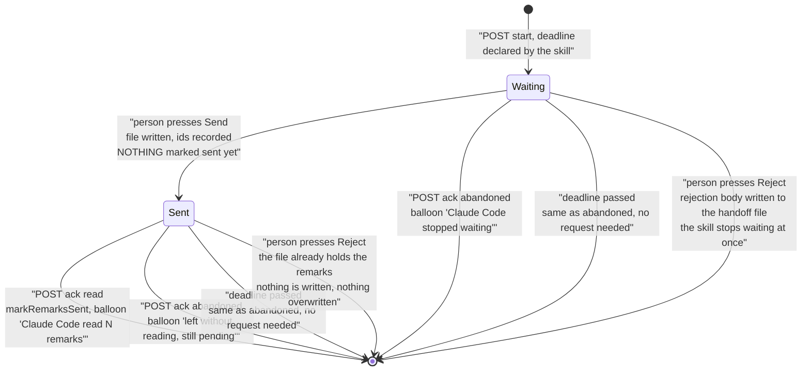
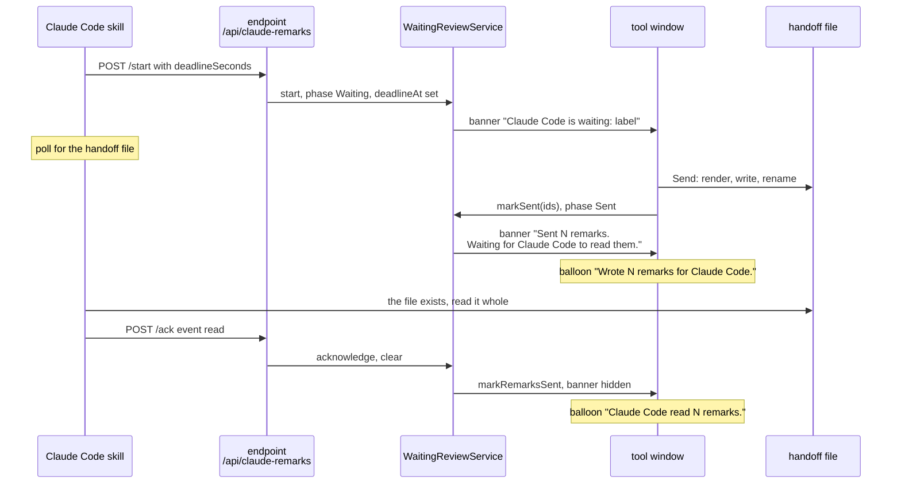
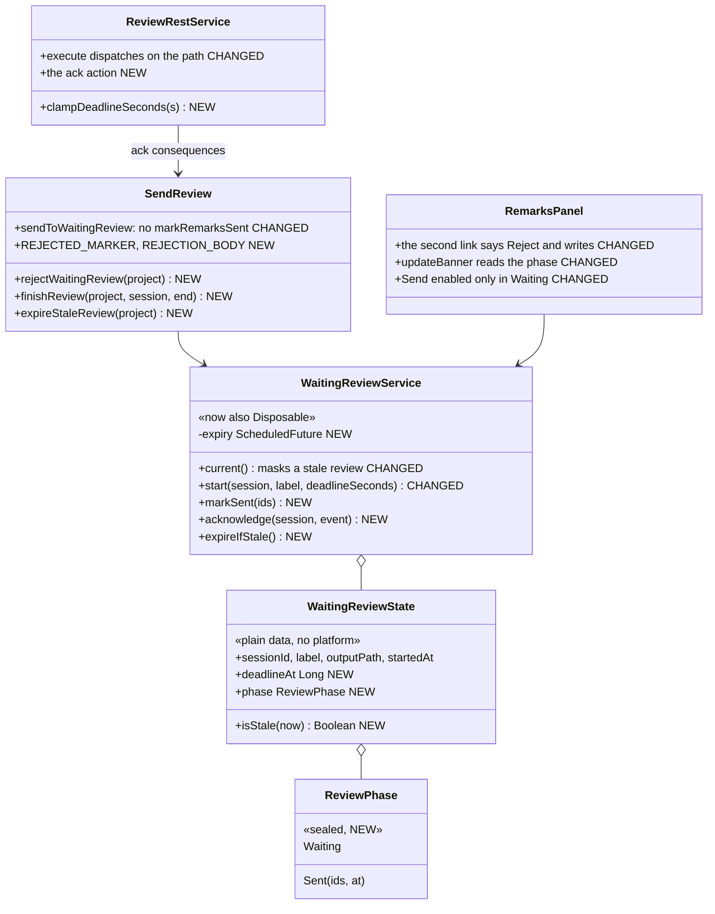
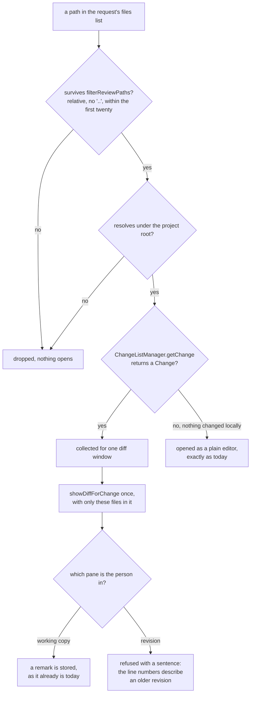

# Claude Remarks — Phase 7 Implementation Plan

**Tell the IDE the remarks were actually delivered — and tell Claude Code when they never will be.**

**Status: complete.** All 12 tasks are done and released as 0.4.0, on branch
`claude-remarks-phase1-2`. **The hand checks in [section 12](#12-hand-checks-in-a-sandbox-ide) have
not been run** — the sessions that built this phase were autonomous, and `runIde` starts an
interactive IDE. Phase 6, for contrast, is complete, released as 0.3.0, and its security checks were
run by hand in a real IDE.

**This plan takes the number 7, so the remote-over-SSH work becomes phase 8.** Four documents still
promise that phase 7 is the remote work. Task 12 corrects every one of them. Do not leave two
documents disagreeing about what phase 7 is.

**The phase carries three subjects, which is the user's explicit call**, recorded at the end of
`docs/ideas.md`: the delivery
acknowledgement signals, the rejection defect, and opening a real diff for just the files the skill
named. The third one is `docs/ideas.md`, "Open the real diff for just the files the skill named",
commit `ff0a9b7`. It shares no code with the first two, so it sits at the end, in tasks 9 and 10.

**The phase carries a defect fix, and it comes first.** Pressing Cancel in the banner ends the review
inside the IDE and writes nothing, so the waiting session polls for a file that will never appear
until its own timeout. `docs/ideas.md` has the entry, "Rejecting a review has to reach Claude Code,
and the link should say Reject". Task 2 fixes it and renames the link, before any of the new
machinery. For the other three signals the IDE does not know what happened on the far side. For this
one it knows exactly — a person decided — and throws the decision away.

**Citations name symbols, not line numbers.** Same reason as phase 6: a symbol name survives the
next commit in the same file, a line number does not.

## Contents

1. [What is true today](#1-what-is-true-today)
2. [Platform facts, checked against the real artifacts](#2-platform-facts-checked-against-the-real-artifacts)
3. [The four open questions, decided](#3-the-four-open-questions-decided)
4. [The shape of the change](#4-the-shape-of-the-change)
5. [Decisions, and the alternatives rejected](#5-decisions-and-the-alternatives-rejected)
6. [Still to verify](#6-still-to-verify)
7. [Scope judgement: what I cut](#7-scope-judgement-what-i-cut)
8. [Rules that must hold at every step](#8-rules-that-must-hold-at-every-step)
9. [Ordering and parallel waves](#9-ordering-and-parallel-waves)
10. [Implementation steps](#10-implementation-steps)
    - [Task 1: Check the ground before building on it](#task-1-check-the-ground-before-building-on-it)
    - [Task 2: Reject writes the decision, and the link says Reject](#task-2-reject-writes-the-decision-to-the-handoff-file-and-the-link-says-reject)
    - [Task 3: The review's phase and its deadline, as plain data](#task-3-the-reviews-phase-and-its-deadline-as-plain-data)
    - [Task 4: The service transitions, and the deadline task](#task-4-the-service-transitions-and-the-deadline-task)
    - [Task 5: The endpoint's second action](#task-5-the-endpoints-second-action)
    - [Task 6: Send writes, the acknowledgement marks sent](#task-6-send-writes-the-acknowledgement-marks-sent)
    - [Task 7: The banner and the buttons stop lying](#task-7-the-banner-and-the-buttons-stop-lying)
    - [Task 8: The skill declares a deadline, acknowledges the read, and reports leaving](#task-8-the-skill-declares-a-deadline-acknowledges-the-read-and-reports-leaving)
    - [Task 9: Refuse a remark on the revision side of a diff](#task-9-refuse-a-remark-on-the-revision-side-of-a-diff)
    - [Task 10: Open a real diff for the files the skill named](#task-10-open-a-real-diff-for-the-files-the-skill-named)
    - [Task 11: Verify the constraints and the whole suite](#task-11-verify-the-constraints-and-the-whole-suite)
    - [Task 12: Documentation, the phase renumbering, and the version](#task-12-documentation-the-phase-renumbering-and-the-version)
11. [Known limits](#11-known-limits)
12. [Hand checks in a sandbox IDE](#12-hand-checks-in-a-sandbox-ide)

## 1. What is true today

Read from the source on this branch, not assumed.

**The send clears the waiting review immediately.** `sendToWaitingReview` in `review/SendReview.kt`
writes the handoff file, then calls `markRemarksSent(project, prepared.ids)`, then
`WaitingReviewService.getInstance(project).clear()`, then shows the balloon. **This is the single
most important fact in the plan.** The brief says the read acknowledgement should be recorded on
`WaitingReviewState`, but by the time the skill reads the file there is no state left to record it
on. So the send has to stop clearing the review. That one change is what the rest of the design
hangs from.

**The balloon says "Sent", and it is the last thing that happens.**
`notifyRemarks(project, "Sent $count remark${...} to Claude Code.")` in `sendToWaitingReview`. It
runs after a successful `atomicWriteString` and nothing else. A write is all it knows about.

**Cancel writes nothing, and that is the defect.** The banner's second link is
`createActionLabel("Cancel") { WaitingReviewService.getInstance(project).clear() }` in the `banner`
field initializer of `RemarksPanel`, and `clear()` in `review/WaitingReview.kt` sets the state to null
and notifies the panel. No file is written. Meanwhile the skill's step 6 is inside
`while [ ! -e "$output" ]` for its full 1800 seconds. So the person ends the review and the agent
never hears about it.

**Nothing in the plugin writes the handoff file except the send.** `atomicWriteString(handoffFile(waiting.outputPath), prepared.markdown)`
in `sendToWaitingReview` is the only call. Task 2 adds the second one, reusing both functions
unchanged.

**The banner is binary and only the IDE can clear it.** `updateBanner` in
`ui/RemarksToolWindowFactory.kt` reads `WaitingReviewService.current()`, hides the banner when it is
null, and otherwise sets one text: `"Claude Code is waiting: " + escapeXmlEntities(label.take(120))`.
The only two callers of `clear()` are the send and the banner's Cancel link, both inside the IDE.

**The banner's two links are created once, in the field initializer**, not per refresh:
`createActionLabel("Send remarks")` and `createActionLabel("Cancel")` sit in the `banner` property of
`RemarksPanel`. Only `banner.text` is changed later. That shapes task 7: the text can vary per phase
for free, the link set cannot.

**The banner repaints only from `refresh()`.** `updateBanner()` is called at the end of the
`finishOnUiThread` block in `RemarksPanel.refresh()`, and `refresh()` runs from the constructor and
from the `REMARKS_CHANGED` subscription. So a state change that publishes nothing leaves the banner
showing the old text. `WaitingReviewService.notifyPanel()` already publishes on every `start` and
`clear`, through `invokeLater`.

**The toolbar polls, the banner does not.** `ToolbarAction.update` runs on the EDT on every toolbar
tick and calls `WaitingReviewService.getInstance(project).current()` for the Send button. So a
decision expressed inside `current()` reaches the Send button on its own, and reaches the banner only
on the next publish. The tick is real, and its conditions matter for the hand checks:
`ToolbarUpdater.MyTimerListener` registers with `ActionManager.addTimerListener`, and
`ActionManagerImpl` fires that timer every `TIMER_DELAY = 500` milliseconds while the IDE window is
active and every `DEACTIVATED_TIMER_DELAY = 5000` while it is not. The listener returns early unless
`updater.component.isShowing()`. So: about half a second, and only while the tool window is open and
the IDE has focus.

**`WaitingReviewState` carries four fields:** `sessionId`, `label`, `outputPath`, `startedAt`. There
is no deadline and no phase. `outputPath` is the temp *directory*; `handoffFile(outputPath)` in
`review/ReviewRestService.kt` names the file inside it.

**`startOrConflict` is pure and takes the output path as a supplier.** Three branches: no current
review accepts a new one, the same session id gets the current state back unchanged, anything else
conflicts. The supplier is only invoked on the first branch, which is what stops a retry or a
conflict from creating a temp directory.

**`WaitingReviewService` is `@Volatile` field plus `@Synchronized` methods, on purpose.** Not an
`AtomicReference`: `updateAndGet` re-runs its lambda on contention and that lambda creates a
directory. `current()` is deliberately unsynchronized so the EDT never blocks on a lock a netty
thread holds across `Files.createTempDirectory`. Both facts are in `docs/claude/design.md`, section
"One waiting review per project". This plan keeps both.

**The service is not `Disposable` today.** `ReviewHandshakeService` in `review/ReviewHandshake.kt`
is, and it is the shape to copy: a project-level `@Service` implementing `Disposable`.

**`requestIsAllowed` guards the whole service, not one action.** It is called from
`ReviewRestService.isHostTrusted`, which the platform calls in `process` before `execute`. A second
action under the same service name is guarded by it with no change at all.

**`execute` ignores the request path completely.** It parses the body and starts a review. Combined
with the platform's prefix matching in [section 2](#2-platform-facts-checked-against-the-real-artifacts),
that means `POST /api/claude-remarks/anything` starts a review today. Task 5 makes only `/start` do
that, and answers `bad-request` for an unknown action.

**Marking a remark sent is idempotent.** `RemarkStore.markSent` filters to remarks whose status is
not already `SENT` and returns how many changed; `markRemarksSent` in `store/RemarkEdits.kt`
publishes only when that count is above zero.

**There is no function that marks a remark pending again.** `store/RemarkEdits.kt` exports eight
mutation functions and none of them moves a remark back from `SENT`. That is why
[section 3](#3-the-four-open-questions-decided) resolves the first open question without needing one.

**`notifyRemarks` is `internal` in `action/CopyRemarks.kt`** and takes a `NotificationType`. The
notification group `Claude Remarks` is already registered in `plugin.xml`. No new registration is
needed anywhere in this phase. The only `plugin.xml` edit in the whole phase is task 10's one
`<depends>` line for VCS.

**The review request already carries the files, and they are already opened as plain editors.**
`openReviewFiles(project, paths)` in `review/OpenReviewFiles.kt` filters the paths with
`filterReviewPaths` — absolute paths and `..` segments dropped, at most twenty — then, inside one
`invokeLater`, resolves each through `fileForStoredPath(root, path)` and calls
`FileEditorManager.openFile(file, false)`. The skill's own step 3 calls this "the cheap version of the
diff". So task 10 changes what that one `forEach` does, and adds no request field.

**A remark written on the revision side of a diff is stored against the right file with the wrong line
numbers.** `targetFiles` in `store/RemarkTarget.kt` returns two candidates: the document's own file,
then `DiffDataKeys.CURRENT_CONTENT`'s `highlightFile`. On the working-copy side the first candidate is
the real file and everything is correct. On the revision side the first candidate is a
`LightVirtualFile` with no path under the project, so the second candidate answers — the right file,
but the anchor was taken from the previous revision's document. Nothing today tells the person.

**`remarkTargetProblem` is the only gate, so one guard covers both entry points.**
`AddRemarkAction`'s input opener calls `remarkTargetProblem` and returns when it is non-null, and only
then calls `relativePathOf`. `AddRemarkIntention.isAvailable` calls `remarkTargetProblem` too. So a
refusal added inside `remarkTargetProblem` reaches the shortcut, the popup menu and the Alt+Enter
intention at once, and `relativePathOf` does not have to change.

**`DiffRemarkTargetTest` currently asserts the revision side works.** It asserts
`relativePathOf(project, editor, contextOf(revision))` is `"Diffed.kt"` **and**
`remarkTargetProblem(...)` is null. The second assertion inverts in task 9.

**`plugin.xml` declares exactly one dependency**, `com.intellij.modules.platform`. Task 10 adds the
second one in the whole project's history, and [section 2](#2-platform-facts-checked-against-the-real-artifacts)
says which and why it also needs a line in `build.gradle.kts`.

**The skill declares its own timeout already, as a literal.**
`docs/skill/claude-remarks-review/SKILL.md` step 6 has `deadline=$(( $(date +%s) + 1800 ))`. The IDE
is never told about it. That literal becomes the number the skill sends.

**The skill's documentation admits the problem this phase fixes.** Step 6 says "A timeout does not
clear the waiting review inside the IDE — the person clears it themselves from the banner's Cancel
link."

**`SendReviewTest` is the guard that will move.** It asserts that a successful write marks the
remarks sent, and that a failed write marks nothing. The first assertion inverts in task 6; the
second one stays exactly as it is.

## 2. Platform facts, checked against the real artifacts

Source read from `~/dev/oss/intellij-community`, tag `idea/2025.2.6.3`. Signatures checked with
`javap` against
`/Users/sasha/.gradle/caches/9.1.0/transforms/c3bd2a49efd270bc2558f65097ad6f39/transformed/ideaIC-2025.2-aarch64/lib/`.

**A second action needs no plugin.xml change: `RestService.isSupported` already accepts sub-paths.**
From `platform/built-in-server/src/org/jetbrains/ide/RestService.kt`, after it has matched
`/api/<serviceName>`:

```kotlin
if (uri.length == minLength) {
  return true
}
else {
  val c = uri[minLength]
  return c == '/' || c == '?'
}
```

So `/api/claude-remarks`, `/api/claude-remarks/start` and `/api/claude-remarks/ack` all reach the
same handler. `isMethodSupported` is checked first, so all of them stay POST-only.

**The platform's own way to dispatch on the sub-path.** `UploadLogsService` in the same package is
one `RestService` with two actions, and it splits the path by hand:

```kotlin
val path = urlDecoder.path().split(serviceName).last().trimStart('/')
if (path == "status") { ... }
if (path != "uploads") { sendStatus(HttpResponseStatus.BAD_REQUEST, false, channel); return null }
```

Task 5 copies that expression. **Do not use `substringAfterLast('/')`** — on the bare path
`/api/claude-remarks` that returns `claude-remarks`, which would be read as an action name.

**`QueryStringDecoder` has both `path()` and `rawPath()`.** Confirmed by `javap`. `path()` is the
decoded path with the query string already removed, so `/api/claude-remarks/ack?x=1` gives
`/api/claude-remarks/ack`.

**The rate limit is 30 requests per minute per remote address**, from
`getMaxRequestsPerMinute() = Registry.intValue("ide.rest.api.requests.per.minute", 30)`. One review
now costs at most three requests instead of one: start, then either the read or the abandoned
acknowledgement. Nowhere near the limit.

**The scheduled executor exists and returns a plain `ScheduledExecutorService`.** `javap` on
`com.intellij.util.concurrency.AppExecutorUtil`:

```
public static java.util.concurrent.ScheduledExecutorService getAppScheduledExecutorService();
```

`AppExecutorUtil` is already imported in `review/SendReview.kt` and
`ui/RemarksToolWindowFactory.kt`, for `getAppExecutorService()`. Task 4 uses the scheduled one from
the same class, so no new dependency and no new import root.

**The existing smoke test already exercises the path dispatch, so task 5 needs no new mechanism.**
`ReviewEndpointSmokeTest` builds `DefaultFullHttpRequest(HTTP_1_1, POST, "/api/claude-remarks/start",
body)` and calls `execute` with `QueryStringDecoder(request.uri())`. So `urlDecoder.path()` inside
`execute` already returns `/api/claude-remarks/start` in that test today, and a second test with a
different uri exercises a second action for real.

**`ShowDiffAction.showDiffForChange(Project, Iterable<? extends Change>)` exists, and it is in a
module jar rather than in `app.jar`.** `javap` reports six overloads, including the two-argument form
and an `(project, changes, int index)` one. The class file is
`lib/modules/intellij.platform.vcs.impl.jar`, **not** `lib/app.jar`. That distinction is the reason
task 10 needs a line in `build.gradle.kts` as well as one in `plugin.xml` — see the next fact.

**`ChangeListManager.getChange(VirtualFile)` and `getChange(FilePath)` both exist, and they are in
`lib/app.jar`.** Read from
`platform/vcs-api/src/com/intellij/openapi/vcs/changes/ChangeListManager.java`: both are abstract and
both return `@Nullable Change`. Null means the file has no local change, which is exactly the signal
task 10 uses to decide between a diff and a plain editor.

**`com.intellij.modules.vcs` is declared by the same module that carries `ShowDiffAction`.**
`platform/vcs-impl/resources/intellij.platform.vcs.impl.xml` line 3 is
`<module value="com.intellij.modules.vcs"/>`. So the `<depends>` id in `plugin.xml` and the module name
in the jar are two views of one thing: `com.intellij.modules.vcs` for the plugin descriptor,
`intellij.platform.vcs.impl` for the build.

**The Gradle plugin has a `bundledModule` dependency helper.** `bundledModule` and `bundledModules` are
both present in `IntelliJPlatformDependenciesExtension` in
`intellij-platform-gradle-plugin-2.18.1.jar`. That a dedicated helper exists for modules under
`lib/modules/` is the reason [section 6](#6-still-to-verify) treats "is that jar already on the compile
classpath" as a question to settle by compiling rather than by assuming.

**`process` runs `isHostTrusted`, then the rate limit, then `execute`.** Unchanged from phase 6, and
it is the reason a second action inherits the whole security rule for free.

## 3. The four open questions, decided

**Question one: does an abandoned review leave the remarks pending, or mark them pending again if
they were already marked sent?**

**Decided: they are never marked sent in the first place, so there is nothing to undo.** The rule the
codebase already states is "nothing is marked sent unless the handover succeeded". This phase only
sharpens what "succeeded" means: not "the file was written" but "the agent said it read the file". So
the send records which ids it wrote and leaves them pending; the read acknowledgement is what calls
`markRemarksSent`.

Why this and not "mark them sent, then mark them pending again on abandon": the second version needs
a ninth mutation function in `store/RemarkEdits.kt`, needs the ids kept somewhere so it can find
them, and needs a rule for a remark the person edited in between. The version chosen needs the ids
kept — that part is the same — and nothing else. It is strictly less code and it never shows the
person a gray remark that was not delivered.

What it costs: between pressing Send and the acknowledgement arriving, the remarks stay black. The
skill polls once a second, so that is about one second in the normal case. The banner says what is
happening during it. And if no acknowledgement ever comes, the remarks stay pending, which is the
direction where nothing is lost.

**Question two: is the deadline a plugin setting or a number the skill declares?**

**Decided: the skill declares it, in the `start` request.** The skill already has the number as a
literal in its own wait loop. Two numbers in two places drift, and the failure when they drift is
ugly in both directions: a plugin deadline shorter than the skill's makes the IDE call a live agent
dead, and a longer one leaves the banner lying for exactly the window this phase exists to close. One
number, sent once, used by both sides.

The cost is that the number arrives over HTTP from outside, so it has to be validated at the
boundary. `clampDeadlineSeconds` in `ReviewRestService.kt` does that: absent means 1800 seconds, and
anything present is clamped into 60 seconds through 24 hours. The clamp lives at the endpoint, not in
the service, because that is where untrusted input arrives — and because it lets a test hand the
service a deadline of zero and get an instantly stale review, which is the only practical way to test
staleness without waiting a minute.

**Question three: does the rejection carry a reason the person typed, or only the fact?**

**Decided: only the fact.** A reason means a modal input box on a link press. The person is sitting
next to the agent and the next message is a better place for a reason than a dialog in the middle of a
decision meant to take one click. The body is the marker line and two sentences of prose.

This is also the cheap version to change later if it turns out to be wanted: the skill matches the
first line and hands everything after it to the model, so a reason can be appended to the body without
the skill changing at all.

**Question four: what happens to the remarks when a review is rejected?**

**Decided: nothing at all. They stay pending.** Rejecting this handoff is not discarding what was
written — the person may be refusing this particular hand-over and still want to keep their remarks.
So `rejectWaitingReview` never touches the store, which makes the right answer also the smallest
implementation.

## 4. The shape of the change

One link that writes instead of only closing, one new field pair on the review state, three new
service transitions, one new endpoint action, and a banner that reads the phase instead of just
checking for null. Nothing about rendering, the store's
shape, the clipboard path, the handshake or the atomic write moves.

The review's life, and where each of the three signals enters:



The normal run, end to end:



Where the code changes:



What the review request does with each file it names, which is the whole of tasks 9 and 10:



## 5. Decisions, and the alternatives rejected

**The rejection travels on the path the skill is already watching.** `atomicWriteString(handoffFile(outputPath), REJECTION_BODY)`,
the same two functions the send path uses, on the same path the endpoint already promised in its
`waiting` response. The alternatives were a second acknowledgement direction — the IDE calling out to
the skill, which has no server — and a second file the skill would have to watch as well. Both are
more moving parts than writing the file the skill is already blocked on.

**The rejection body's first line is a wire format, and a test pins it.**
`<!-- claude-remarks: rejected -->`, matched by one `grep -q` in the skill. It is an HTML comment, so
a body handed to a model whole reads as prose with an invisible first line, and a markdown renderer
shows nothing. A JSON envelope would have been the other option and would force the skill to parse a
file that is otherwise plain markdown for a human reader.

**A failed rejection write still clears the review, and says so in red.** The person asked for the
review to end, and a banner they cannot dismiss is worse than a slow agent. What is lost is only
promptness: the session falls back to waiting for its own deadline, which is exactly today's
behaviour, and the balloon says that is what will happen. The send path makes the opposite choice — a
failed write there keeps the review, because there the remarks are the thing at stake and nothing has
been decided yet.

**Reject in the Sent phase writes nothing.** The handoff file already holds the remarks and the agent
may already have read them. Overwriting it with a rejection body would destroy remarks that were
never delivered, silently. So in that phase Reject only clears the review and says the remarks were
already written. This guard arrives with the Sent phase itself, in task 6, not in task 2.

**One `ack` action with an `event` field, not two paths.** `/api/claude-remarks/ack` with
`{"session": ..., "project": ..., "event": "read" | "abandoned"}`. Two paths, `/read` and
`/abandoned`, would need two request classes and two dispatch branches for one shared session and
project check. The event is one string compared in one place.

**The answer stays "always HTTP 200 with a `status` field".** Phase 6's contract, in
`ReviewRestService`'s KDoc: real status codes are reserved for what the platform produces above
`execute`, so a plumbing failure never looks like an application answer to a shell script. The ack
adds three application answers — `ok`, `no-review`, `not-sent` — and reuses `unknown-project` and
`bad-request` unchanged.

**The deadline is enforced two ways, and each covers a hole the other leaves.**
`WaitingReviewState.isStale(now)` is a pure comparison used by `current()`, so a stale review can
never be sent to and can never enable a button, no matter what the scheduler did. A scheduled task at
the deadline is what makes the *screen* catch up, because the banner only repaints when something
publishes. The predicate alone leaves a stale banner on screen until the person happens to change a
remark. The task alone is a promise about timing, and a laptop that slept through the deadline breaks
it. Together they are about fifteen lines.

**The scheduled task is not a repeating poll.** One `schedule` per accepted review, cancelled on
`clear` and on `dispose`. A repeating tick would run for the whole IDE session for a feature that is
idle almost all of the time.

**A review whose deadline has passed no longer blocks a new one.** `startOrConflict` gains a stale
branch, so a killed session does not leave the project unusable for the next review until somebody
presses Cancel. The branch order matters and is not arbitrary: the same-session retry is checked
*before* staleness, so a retry always gets its own state and its own output path back, even a late
one. A different session gets in only when the current review is dead.

**The banner says "the agent left" with a balloon, not with a third banner state.** Keeping a
finished review on screen means keeping state that nothing removes, and then answering "when does
this text go away". A balloon is the platform's own idiom for a fact that has already happened, and
the notification group already exists.

**The banner's two links stay as they are, and Send refuses politely in the Sent phase.**
`createActionLabel` only adds a label, and the links are built once in the field initializer. Making
the link set depend on the phase means rebuilding the banner. Instead `sendToWaitingReview` answers a
press in the Sent phase with "Already sent. Waiting for Claude Code to read them." — a dead control
is what this codebase avoids, and a control that says why is the cheap version of not being dead.

**Re-sending in the Sent phase is refused, not merged.** The agent may already have read the first
file. Overwriting it would mean the person cannot tell which version was read.

**The deadline is not extended when the remarks are sent.** The skill's own wait loop is not
extended either, so extending the IDE's copy would recreate exactly the drift
[section 3](#3-the-four-open-questions-decided) rejects. If the person sends at second 1799 of 1800,
the acknowledgement has one second to arrive. That is the truth about that agent, not a bug.

**The ack carries the project path, like `start` does.** The alternative — find the project by
scanning open projects for one holding this session id — would let the skill send one field less, and
`projectForPath` would go unused for the new action. Symmetry with `start` is worth more than one
field, and the skill already has `$root` in a variable.

**The IDE decides diff-or-editor per file, and the skill is not asked.** Whether a file has a local
change is a fact the IDE holds and the agent would be guessing at. So no mode flag, no new request
field, and a file with no local change keeps exactly today's behaviour — a plain editor, which is also
the right answer for a file the person should read but has not touched.

**One diff window over all the changed files, not one per file.**
`showDiffForChange(project, changes)` takes an `Iterable`, and the window it opens has next-file and
previous-file navigation inside it. Opening one window per file would put the person back in the
tab-shuffling this feature exists to remove.

**A hard `<depends>` on `com.intellij.modules.vcs`, not an optional one.** The optional form needs a
second descriptor file and a second code path for an IDE without VCS. Every JetBrains IDE ships VCS,
so the second path would never run and could never be tested. The cost of being wrong is honest and
loud: the plugin refuses to load rather than half-working.

**A remark on the revision side of a diff is refused, not mapped.** The other option is to map the
line through the diff's own line mapping onto the working copy, which is real work and belongs in a
later phase. Refusing costs one branch in `remarkTargetProblem` and a sentence the person can act on —
the other pane is one click away. What is given up: today an old-side remark is stored, and the
content hashing in `anchor/` sometimes finds the right line anyway, when the region happens to be
unchanged. That is precisely the case where it is least useful, since an unchanged region is not what
the review is about, and when the region did change the remark orphans with no warning. So this trades
"sometimes right, silently wrong the rest of the time" for "always refused, with a reason". Recorded
because it is a removal, and `docs/ideas.md` records that the user may overrule it.

**Committed ranges are out of scope, and the plan says so rather than degrading quietly.**
`ChangeListManager` only knows uncommitted work, so a review of `main..HEAD` gets null from every
`getChange` and falls back to plain editors. Building `Change` objects from two committed revisions
needs the Git plugin rather than the platform's VCS API. Local changes are the case worth building
first: that is when the work is unfinished, which is when a remark is worth writing.

**No read detection on the plugin side.** Carried straight from `docs/ideas.md`: there is no portable
signal for "this file was read", and anything built on access times or file locks is wrong on some
filesystem. The agent knows; it says so.

## 6. Still to verify

Six things. Each has the check written into the task that needs it.

**A scheduled task can outlive the project it names.** The delay can be up to 24 hours, so the task
can fire after the project closed, and `project.service<...>()` on a disposed project throws. I
believe two cheap guards cover it, and **task 4 must do both**: `WaitingReviewService` implements
`Disposable` and cancels the future in `dispose()`, and the task body starts with
`if (project.isDisposed) return`. The cancel is the normal path; the `isDisposed` check covers the
task already being handed to a thread when disposal happens. Task 4 also asserts that
`ScheduledFuture.cancel(false)` is the right call — do not use `cancel(true)`, which interrupts a
running task for no benefit here.

**Whether `EditorNotificationPanel` can remove an action label.** I did not check the jars, because
the plan does not need it: both links stay and the phase only changes `banner.text`. If a later change
does want per-phase links, `javap com.intellij.ui.EditorNotificationPanel` first. Do not add this to
phase 7.

**Whether the notification balloon is safe to raise from the thread that ends the review.** The read
and abandoned acknowledgements arrive on a netty IO thread. The plan does not depend on the answer:
task 5 puts the store mutation and the balloon inside `invokeLater`, the same way
`WaitingReviewService.notifyPanel` already does, so both run on the EDT. **Task 5 must not "simplify"
that away** even if a balloon appears to work from a background thread.

**Whether `lib/modules/intellij.platform.vcs.impl.jar` is already on the compile classpath.**
`ShowDiffAction` is in that jar, not in `app.jar`, and the Gradle plugin has a dedicated
`bundledModule` helper for jars in that directory — which reads as "ask for it by name". I believe
task 10 needs `bundledModule("intellij.platform.vcs.impl")` in the `intellijPlatform` dependencies
block, next to nothing else, because the project has no such block entry today. **Settle it by
compiling, not by reading**: write the import, run `./gradlew compileKotlin`, and add the line only if
the symbol does not resolve. `ChangeListManager` and `Change` are in `app.jar` and will resolve either
way, so the import that decides this is the `ShowDiffAction` one.

**Whether `ChangeListManager` has finished its first refresh when a review arrives.** Before the
initial update it can answer null for a file that does have a local change, which would degrade the
diff to plain editors with nothing said. A review normally arrives long after project open, so I do
not expect it. `ChangeListManager.invokeAfterUpdate` is the fix if it happens. **Do not build that up
front** — the hand check in [section 12](#12-hand-checks-in-a-sandbox-ide) sends a review request
immediately after opening a project, which is the case that would show it.

**Whether `./gradlew verifyPlugin` still reports exactly one accepted internal-API usage.**
`SegmentedButton.getComponent()`, allowed in `a055473`. Nothing in this plan reaches for an internal
API — `AppExecutorUtil` is public, `ScheduledFuture` is the JDK. Task 11 confirms the count did not
grow.

## 7. Scope judgement: what I cut

**No plugin setting for the deadline.** [Section 3](#3-the-four-open-questions-decided) settles it: the
skill declares the number. A setting would be a second source of truth for the same value.

**No "the agent is thinking" progress state.** A signal for "the agent read the remarks and is now
working" was tempting and is not in the brief. Reading is the last thing the IDE can know about
without the agent reporting its own progress, which is a much larger idea.

**No history entry for an abandoned review.** `store/RemarkHistory.kt` archives on *clear*, and
phase 6 deliberately declined to write a second durable copy on handover. Nothing about an abandoned
review changes that argument: the remarks are still in the store, still pending, and still visible.

**No retry of a failed acknowledgement beyond one attempt.** The skill sends the ack once and reports
a failure. The deadline backstop already covers "the IDE never heard about it", so retry logic in a
shell script would add a loop to cover a case that is already covered.

**No line mapping from the revision side onto the working copy.** [Section 5](#5-decisions-and-the-alternatives-rejected)
settles it: refuse with a sentence. The mapping is a later phase.

**No support for a review of committed revisions.** Out of scope, stated in section 5, and the plan
says what happens instead rather than leaving it to be discovered.

**No optional-dependency descriptor for VCS.** A hard `<depends>` and one line in the build file.

**No reason box on the reject.** [Section 3](#3-the-four-open-questions-decided) settles it: the body
carries the fact and nothing else.

**No archive entry for a rejected review.** Same argument as the abandoned one: the remarks are still
in the store and still pending, so nothing needs preserving.

**No `plugin.xml` change for the acknowledgement work.** The sub-path routes to the existing handler
and the notification group is registered. The one edit that file does get is task 10's `<depends>` line,
which belongs to the diff work.

## 8. Rules that must hold at every step

The five grep guards in `CLAUDE.md` must come back empty after every task.

1. **`anchor/` and `render/PromptRenderer.kt` stay free of `com.intellij`.** Phase 7 touches neither.
2. **`store/RemarkEdits.kt` holds the only functions that change a remark.** Phase 7 calls
   `markRemarksSent` and nothing else, from `review/SendReview.kt`, which already imports it. It adds
   no ninth mutation function — see [section 3](#3-the-four-open-questions-decided).
3. **No code writes to a source file.** Phase 7 writes no file at all that phase 6 did not already
   write.
4. **Nothing remark-related enters version control.** No new file outside the project and no new
   file inside one.
5. **`review/ReviewRestService.kt` never touches the VFS, Swing, or `invokeAndWait`:**

   ```bash
   grep -rnE "invokeAndWait|projectRoot\(|FileEditorManager|VfsUtil|SwingUtilities" \
     src/main/kotlin/dev/sasha/clauderemarks/review/ReviewRestService.kt   # must be empty
   ```

   **The trap phase 6 hit is live again in this phase.** That grep is line-based and cannot tell a
   comment from code. Task 5 adds an explanation of why the ack's consequences live in another file,
   and that explanation **must not name any of the five symbols above**. Say "the file that owns the
   editor side" and point at `review/SendReview.kt` by name instead.

   **Task 10 is the other half of this rule.** Opening a diff needs the VFS, the editor and Swing.
   Every line of it goes in `review/OpenReviewFiles.kt`, which exists for exactly this reason and does
   its own `invokeLater`. None of it goes anywhere near the file this grep watches.

Five more, carried in or new:

6. **Prove every test is a real guard by mutation.** Break the production line the test covers, watch
   the named test fail, restore. Every task below names its mutation.
7. **Never block the EDT, and never touch Swing off it.** The endpoint runs on a netty IO thread. All
   store and UI work triggered by an acknowledgement goes through `invokeLater`.
8. **Keep the two threading decisions in `WaitingReviewService`.** `@Volatile` plus `@Synchronized`,
   never an `AtomicReference`; `current()` stays unsynchronized. Both are recorded in
   `docs/claude/design.md`. Task 4 adds a pure comparison inside `current()` and nothing that takes a
   lock or does IO.
9. **Nothing is marked sent unless the agent said it read the file.** This is the phase's whole point
   and `SendReviewTest` is its guard.
10. **Reject writes before it clears.** The defect this phase opens with. A rejection that only clears
    the in-memory state is the bug, not a simplification, and the reject test in task 2 is the only
    guard on it.
11. **Never run `git add -A` or `git add .`** Several agents work in this repository. Every commit
    step names the exact files to stage. If `git status --porcelain` shows a file you did not touch,
    leave it and say so in the task report.

## 9. Ordering and parallel waves

**No parallel waves.** Every task after the second consumes the one before it: task 3 defines the
phase and the deadline that task 4's transitions move between, task 4 defines the transitions task 5's
endpoint calls, task 5 creates the acknowledgement path that task 6 hands the marking over to, and
task 7 renders the phase the tasks before it produce. Twelve small tasks, and no pair of them can be
worked on without reading the same two files; splitting them into waves would cost more coordination
than it saves.

The order is: check the ground (1), reject writes the decision (2), the phase and deadline as data
(3), the service transitions (4), the endpoint action (5), the send stops marking sent (6), the banner
and the buttons (7), the skill (8), refuse a remark on a revision pane (9), open the real diff (10),
verify (11), document (12).

**The diff work sits at the end because it shares no code with the rest.** Tasks 9 and 10 touch
`store/RemarkTarget.kt`, `review/OpenReviewFiles.kt`, `plugin.xml` and `build.gradle.kts`; the
acknowledgement work touches none of those. Putting them last means the phase's headline — the IDE and
the agent agreeing on what happened — is complete before the second subject starts, and it puts the
only `plugin.xml` and `build.gradle.kts` change immediately before the task that runs
`verifyPluginProjectConfiguration`.

**Task 9 comes before task 10, not after.** Task 10 makes the diff the normal way a review starts, so
the pane where a remark gets the wrong line numbers goes from rare to common. Refusing it first means
the common case is never wrong, not even between two commits.

**Task 2 comes first, and it is the only task that could have gone anywhere.** It depends on nothing
this phase adds: `atomicWriteString`, `handoffFile`, `current()` and `clear()` all exist today. It is
first because it is the only signal in this phase that already fires and is already lost, so a phase
that stopped halfway would still have fixed the defect. Everything after it improves cases the IDE
currently cannot see at all.

**Task 5 comes before task 6 on purpose.** Task 6 is what stops `sendToWaitingReview` from calling
`markRemarksSent`. If it ran first, there would be a commit where nothing in the plugin ever marks a
remark sent through the review path. In this order the acknowledgement can already mark them before
the send stops doing it, so no step leaves the plugin worse than it started.

## 10. Implementation steps

TDD throughout: write the failing test, run it, watch it fail for the right reason, then implement.
Run the narrow per-task command after each change. The full suite runs once, in task 11. Complete each
task before starting the next.

### Task 1: Check the ground before building on it

**Model:** haiku

**Files:**
- Read only: `CLAUDE.md`, the "Rules that must not break" section
- Read only: `src/main/kotlin/dev/sasha/clauderemarks/review/WaitingReview.kt`
- Read only: `src/main/kotlin/dev/sasha/clauderemarks/review/SendReview.kt`

Five minutes, and it stops the whole phase from being built on a base that moved.

- [x] `git status --porcelain` must be empty. Another agent may be mid-task in this worktree. If it is
      not empty, **stop and report** what is there rather than working around it.
- [x] `WaitingReviewState` still has exactly the four fields `sessionId`, `label`, `outputPath`,
      `startedAt`. If it already has more, this plan was written against an older tree — stop and
      report.
- [x] `sendToWaitingReview` still calls `markRemarksSent` and then
      `WaitingReviewService.getInstance(project).clear()`. Tasks 5 and 6 both depend on that being the
      starting point.
- [x] run all five grep guards from
      [section 8](#8-rules-that-must-hold-at-every-step) now, before any change. All five must be
      empty. A guard that was already failing must not be blamed on this phase.
- [x] `./gradlew test` passes on the untouched tree. Report the test count, so task 11 can compare.
- [x] no commit — this task writes nothing

### Task 2: Reject writes the decision to the handoff file, and the link says Reject

**Model:** sonnet

**Files:**
- Edit: `src/main/kotlin/dev/sasha/clauderemarks/review/SendReview.kt` — `REJECTED_MARKER`,
  `REJECTION_BODY` and `rejectWaitingReview(project)`, next to `sendToWaitingReview`
- Edit: `src/main/kotlin/dev/sasha/clauderemarks/ui/RemarksToolWindowFactory.kt` — the second
  `createActionLabel` in the `banner` field initializer of `RemarksPanel`
- Edit: `src/test/kotlin/dev/sasha/clauderemarks/review/SendReviewTest.kt` — three new tests

The defect, first, and it needs nothing this phase has not already got: `atomicWriteString`,
`handoffFile`, `current()` and `clear()` all exist today.

**The body, and why the marker is a constant of its own:**

```kotlin
/**
 * The skill matches this as the file's first line to tell a rejection from a set of remarks before it
 * hands the body to a model. It is a wire format shared with a shell script, so it is not reworded
 * without changing `docs/skill/claude-remarks-review/SKILL.md` in the same commit.
 */
internal const val REJECTED_MARKER = "<!-- claude-remarks: rejected -->"

internal val REJECTION_BODY = """
    $REJECTED_MARKER

    The person rejected this review in the IDE. No remarks were sent and none are coming.
    Stop waiting for this file and do not start another review unless you are asked to.
""".trimIndent()
```

An HTML comment, so a body handed to a model whole reads as ordinary prose and a markdown renderer
shows nothing. `REJECTION_BODY` has to be a `val`, not a `const val`, because `trimIndent()` is a
function call.

**The action:**

```kotlin
/**
 * The person answering "not now". `clear()` alone was the bug: it ended the review inside the IDE and
 * left the waiting session polling a path nothing would ever write, for its whole timeout.
 */
fun rejectWaitingReview(project: Project) {
    val waiting = WaitingReviewService.getInstance(project).current() ?: return
    try {
        atomicWriteString(handoffFile(waiting.outputPath), REJECTION_BODY)
        notifyRemarks(project, "Rejected the review. Claude Code will stop waiting.")
    } catch (e: IOException) {
        notifyRemarks(
            project,
            "The rejection could not be written: ${e.message}. " +
                "The Claude Code session will wait for its own timeout instead.",
            NotificationType.ERROR,
        )
    }
    // Cleared either way. The person asked for this review to end, and a banner they cannot dismiss
    // is worse than a session that waits for its own deadline.
    WaitingReviewService.getInstance(project).clear()
}
```

**No read action and no thread hop.** The body is a constant, so there is nothing to resolve, nothing
to render and no `Document` to read — the whole reason `sendToWaitingReview` needs
`ReadAction.nonBlocking` does not apply. The write runs on the EDT, which is where
`sendToWaitingReview` already does its own `atomicWriteString`, inside `finishOnUiThread`. A few
hundred bytes and a rename in a temp directory.

**The link:**

```kotlin
// Reject, not Cancel: this writes the decision to the handoff file so the waiting session stops at
// once. "Cancel" read as "close this banner", which is exactly the behaviour that was wrong.
createActionLabel("Reject") { rejectWaitingReview(project) }
```

- [x] `grep -rn '"Cancel"' src/` first, so a test or another caller that names the old label is found
      before it is broken rather than after
- [x] write the failing tests in `SendReviewTest.kt`, which already builds a review with an output path
      it controls and already has a failure-path fixture whose parent is a regular file:
  - `testRejectingWritesTheMarkerAndClearsTheReview` — after `rejectWaitingReview`, the handoff file's
    **first line is exactly** `<!-- claude-remarks: rejected -->`, and `current()` is null. Spell the
    marker out in the test as a literal rather than referring to `REJECTED_MARKER`: the skill's own
    `grep -q` spells it out too, and a test that reads the constant would keep passing after a rename
    that breaks the skill.
  - `testRejectingLeavesEveryRemarkPending` — a pending remark is still `PENDING` afterwards. This is
    the whole of decision four, as a test.
  - `testAFailedRejectionStillClearsTheReview` — point the review at a path whose parent is a regular
    file so the write throws; assert `current()` is null afterwards and the remark is still `PENDING`.
- [x] run `./gradlew test --tests "dev.sasha.clauderemarks.review.SendReviewTest"` — expect a compile
      failure
- [x] implement
- [x] the same command passes, and `./gradlew test --tests "dev.sasha.clauderemarks.ui.RemarksPanelTest"`
      still passes
- [x] **mutation:** delete the `atomicWriteString` call from `rejectWaitingReview`, which is exactly
      the defect being fixed — `testRejectingWritesTheMarkerAndClearsTheReview` must fail. Change one
      character of `REJECTED_MARKER` — the same test must fail on the first-line assertion. Restore
      both.
- [x] commit: `fix: rejecting a review tells Claude Code instead of only closing the banner` — stage
      exactly the three files above

### Task 3: The review's phase and its deadline, as plain data

**Model:** sonnet

**Files:**
- Edit: `src/main/kotlin/dev/sasha/clauderemarks/review/WaitingReview.kt` — add the `ReviewPhase`
  sealed interface, two fields and `isStale` on `WaitingReviewState`, and the stale branch in
  `startOrConflict`. Do not touch `WaitingReviewService` in this task.
- Edit: `src/test/kotlin/dev/sasha/clauderemarks/review/WaitingReviewTest.kt` — the existing plain
  JUnit class for `startOrConflict`

The whole phase decision as data a test can build by hand, with no service and no fixture.

```kotlin
/**
 * How far a review has got. A review in [Sent] has had its handoff file written and carries the ids
 * that were written, so the read acknowledgement knows what to mark sent. A sealed pair rather than
 * a nullable id list, so "ids exist only after a send" is not a rule a caller can forget.
 */
sealed interface ReviewPhase {
    object Waiting : ReviewPhase
    data class Sent(val ids: List<String>, val at: Long) : ReviewPhase
}
```

`WaitingReviewState` gains `deadlineAt: Long` and `phase: ReviewPhase = ReviewPhase.Waiting`, plus:

```kotlin
/** Past its deadline, so the agent that asked for it is presumed gone. */
fun isStale(now: Long = System.currentTimeMillis()): Boolean = now >= deadlineAt
```

The default argument is what lets production callers stay quiet and tests pass a clock.

`startOrConflict` gains `deadlineSeconds: Long` and `now: Long = System.currentTimeMillis()`, both
**before** the `outputPath` supplier so the trailing-lambda call style keeps working. Its branches
become, in this order:

```kotlin
current == null -> accept a new state
current.sessionId == session -> StartResult.Accepted(current)   // an honest retry, however late
current.isStale(now) -> accept a new state, replacing the dead one
else -> StartResult.Conflict(current)
```

**The order is the decision, not an accident.** Same session first means a retry always gets its own
output path back, even after the deadline, so a slow skill never starts polling a directory the
plugin has just replaced. Staleness second means a *different* session gets in only when the current
review is really dead.

- [x] add the failing tests to `WaitingReviewTest.kt`. Plain JUnit, no fixture:
  - `a review is stale once its deadline has passed` — build a state with `deadlineAt = 1000`, assert
    `isStale(999)` is false, `isStale(1000)` is true, `isStale(1001)` is true. The boundary matters:
    the scheduled task in task 4 fires exactly at the deadline, and with a `>` comparison it would
    find the review not yet stale and do nothing.
  - `a stale review does not block a different session` — a current state with a passed deadline, a
    new session id, assert `Accepted` and that the accepted state is the new one
  - `a retry of the same session gets the same state back even after the deadline` — assert
    `Accepted(current)` is the *same* state instance, and that the output-path supplier was never
    called
  - `a live review still conflicts with a different session` — the existing test, unchanged except
    for the new arguments
  - `the deadline is computed from the same instant as the start time` — pass `now = 5000` and
    `deadlineSeconds = 60`, assert `startedAt == 5000` and `deadlineAt == 65000`. Two separate
    `System.currentTimeMillis()` calls would make these disagree by a millisecond or two, which is
    harmless in production and exactly the kind of drift a reader later has to rule out.
- [x] run `./gradlew test --tests "dev.sasha.clauderemarks.review.WaitingReviewTest"` — expect a
      compile failure
- [x] implement. Every existing caller of `startOrConflict` and of the `WaitingReviewState`
      constructor has to pass the new arguments; the compiler finds them all.
- [x] the same command passes
- [x] **mutation:** change `isStale` to `now > deadlineAt` — `a review is stale once its deadline has
      passed` must fail on the boundary case. Then move the staleness branch above the same-session
      branch — `a retry of the same session gets the same state back even after the deadline` must
      fail. Restore both.
- [x] commit: `feat: a review carries a phase and a deadline` — stage exactly
      `src/main/kotlin/dev/sasha/clauderemarks/review/WaitingReview.kt` and
      `src/test/kotlin/dev/sasha/clauderemarks/review/WaitingReviewTest.kt`

### Task 4: The service transitions, and the deadline task

**Model:** sonnet

**Files:**
- Edit: `src/main/kotlin/dev/sasha/clauderemarks/review/WaitingReview.kt` —
  `WaitingReviewService`: the `current()` mask, the new `start` parameter, `markSent`,
  `acknowledge`, `expireIfStale`, the `expiry` future, `Disposable`
- Create: `src/test/kotlin/dev/sasha/clauderemarks/review/WaitingReviewServiceTest.kt` —
  fixture-backed, because a project-level service needs a project

The service owns the state field and the lock. It does **not** touch the store and shows no balloon;
those are task 5's, in `review/SendReview.kt`. Keeping the store out of this file is what stops the
review lifecycle and the remark model from growing into each other.

```kotlin
/** What an acknowledgement did, so the endpoint can answer honestly. */
enum class AckOutcome { OK, NO_REVIEW, NOT_SENT }

/** What ended a review. STALE is the deadline; the other two come from the skill. */
enum class ReviewEnd { READ, ABANDONED, STALE }
```

Six changes to the service:

**`current()` masks a stale review:** `fun current(): WaitingReviewState? = state?.takeIf { !it.isStale() }`.
One comparison of two longs. **No lock, no IO** — rule 8 in
[section 8](#8-rules-that-must-hold-at-every-step). This single line is what disables the Send button
and hides the banner for a dead review, everywhere, at once.

**`start` takes `deadlineSeconds: Long`** and passes it through to `startOrConflict`, then schedules
the expiry for the accepted state. The signature becomes
`start(session: String, label: String, deadlineSeconds: Long, outputPath: Path? = null)`. **Give
`deadlineSeconds` no default value.** Six existing calls pass `outputPath` positionally as the third
argument, and without a default every one of them stops compiling and has to be looked at — which is
the point. A default of 1800 would let them all keep compiling while silently ignoring the deadline
the test meant to set. Schedule on every `Accepted`, including the retry branch:
`scheduleExpiry` cancels the previous future first, so re-scheduling the same deadline is harmless
and there is no branch to get wrong.

**`markSent(ids: List<String>)`**, `@Synchronized`: replaces the phase with `ReviewPhase.Sent(ids,
System.currentTimeMillis())` and calls `notifyPanel()`. It uses `state`, not `current()`: the send
already checked the review was live, and a review that went stale in the millisecond between must
still record what was written, so the abandoned message can name the count.

**`acknowledge(session: String, end: ReviewEnd): Pair<AckOutcome, WaitingReviewState?>`**,
`@Synchronized`. It returns the state it acted on, because the caller needs the ids and the count for
the store mutation and the balloon:

- nothing in `state`, or `state.sessionId != session` → `NO_REVIEW`, null, no change
- `end == READ` and the phase is `Waiting` → `NOT_SENT`, null, no change. A read acknowledgement for a
  file that was never written is a bug in one of the two sides, not a transient failure, so it must
  not silently clear a live review.
- otherwise → clear the state, cancel the expiry future, `notifyPanel()`, return `OK` with the state
  as it was

**`expireIfStale(): WaitingReviewState?`**, `@Synchronized`: returns null unless `state` exists and is
stale; otherwise clears it, cancels the future, notifies, and returns the state it removed. No
session argument. If a newer review has replaced the one the task was scheduled for, that newer one is
not stale and this does nothing — which is why the task needs no bookkeeping to identify itself.

**`Disposable`, and the future.** `@Volatile private var expiry: ScheduledFuture<*>? = null`.
`scheduleExpiry` cancels the old one, then:

```kotlin
expiry = AppExecutorUtil.getAppScheduledExecutorService().schedule(
    { if (!project.isDisposed) expireIfStale() },
    (accepted.deadlineAt - System.currentTimeMillis()).coerceAtLeast(0),
    TimeUnit.MILLISECONDS,
)
```

**In this task the scheduled body calls `expireIfStale()` and nothing else**, so task 4 stands on its
own and its tests do not depend on a file it has not created yet. Task 5 replaces that one call with
`expireStaleReview(project)`, which is the same transition plus the balloon. Do not try to write
task 5's function here.

`dispose()` cancels the future with `cancel(false)`, never `cancel(true)`: interrupting a task whose
whole body is a field swap buys nothing and can only surprise the shared pool. The task body's own
first line is `if (project.isDisposed) return`, because cancellation cannot catch a task already
handed to a thread. See [section 6](#6-still-to-verify).

- [x] write the failing tests in `WaitingReviewServiceTest.kt`. `BasePlatformTestCase`, and it must
      clear `WaitingReviewService` in **both** `setUp` and `tearDown` — the light fixture project is
      shared across test classes, and `CLAUDE.md` records what that costs when a class forgets.
  - `a review past its deadline is not current` — `start(session, label, deadlineSeconds = 0, outputPath = tempDir)`,
    then assert `current()` is null. A deadline of zero is why the clamp lives at the endpoint and not
    here.
  - `marking sent moves the phase and keeps the review` — after `markSent(listOf("a", "b"))`,
    `current()` is not null and its phase is `ReviewPhase.Sent` with those two ids
  - `a read acknowledgement on a sent review clears it and reports OK` — assert the outcome is `OK`,
    the returned state carries the two ids, and `current()` is null afterwards
  - `a read acknowledgement on a waiting review changes nothing` — outcome `NOT_SENT`, `current()`
    still not null
  - `an acknowledgement for another session changes nothing` — outcome `NO_REVIEW`, `current()` still
    not null. Without the session check, an ack from a review the person cancelled an hour ago would
    clear the one running now.
  - `an abandoned acknowledgement clears a waiting review` — outcome `OK`, `current()` null
  - `expireIfStale removes a review past its deadline and nothing else` — with `deadlineSeconds = 0`
    it returns the state; started again with a long deadline it returns null and leaves the review
    alone
- [x] run `./gradlew test --tests "dev.sasha.clauderemarks.review.WaitingReviewServiceTest"` — expect
      a compile failure
- [x] implement
- [x] the same command passes, and `./gradlew test --tests "dev.sasha.clauderemarks.review.*"` still
      passes — `SendReviewTest` and `ReviewEndpointSmokeTest` call `start`, so its new parameter
      reaches them
- [x] **mutation:** drop the `takeIf { !it.isStale() }` from `current()` — `a review past its deadline
      is not current` must fail. Drop the session comparison in `acknowledge` — `an acknowledgement
      for another session changes nothing` must fail. Let a `READ` acknowledgement clear a `Waiting`
      review — `a read acknowledgement on a waiting review changes nothing` must fail. Restore all
      three.
- [x] commit: `feat: the waiting review can be marked sent, acknowledged and expired` — stage exactly
      the two files above

### Task 5: The endpoint's second action

**Model:** sonnet

**Files:**
- Edit: `src/main/kotlin/dev/sasha/clauderemarks/review/ReviewRestService.kt` —
  `clampDeadlineSeconds`, `deadlineSeconds` on `StartRequest`, a new `AckRequest`, the path dispatch
  in `execute`, and the ack branch
- Edit: `src/main/kotlin/dev/sasha/clauderemarks/review/SendReview.kt` — `finishReview` and
  `expireStaleReview`: the store mutation and the balloon, on the EDT
- Edit: `src/test/kotlin/dev/sasha/clauderemarks/review/ReviewRequestTest.kt` — the pure class, for
  `clampDeadlineSeconds`
- Edit: `src/test/kotlin/dev/sasha/clauderemarks/review/ReviewEndpointSmokeTest.kt` — the ack through
  a real `EmbeddedChannel`, and the unknown action

**The path dispatch.** Copy the platform's own expression from `UploadLogsService`, quoted in
[section 2](#2-platform-facts-checked-against-the-real-artifacts):

```kotlin
val action = urlDecoder.path().split(getServiceName()).last().trimStart('/')
```

`getServiceName()` is `claude-remarks`, and `ReviewEndpointSmokeTest` already builds its decoder
from the request uri, so this expression is exercised by a real request in the tests and not only in
production. `start` keeps everything it does today. `ack` is new. Anything else — including the bare
`/api/claude-remarks` with no action — answers `bad-request` with a `detail` naming the action it did
not understand. **This is a real behaviour change worth a comment:** today any sub-path starts a
review, because `execute` never looks at the path.

**The clamp, pure and tested on its own:**

```kotlin
/**
 * The skill declares how long it will wait. The number arrives over HTTP, so it is bounded here, at
 * the edge, rather than deeper in. Absent means the 1800 seconds the skill's own documentation has
 * always used.
 */
internal fun clampDeadlineSeconds(seconds: Long?): Long =
    (seconds ?: 1800L).coerceIn(60L, 86_400L)
```

**`AckRequest(session, project, event)`**, all nullable, filled by Gson like `StartRequest`. Blank
session, blank project, or an `event` that is neither `read` nor `abandoned` answers `bad-request`.
Then: normalize the open projects the same way the start branch does — pull that mapping out into one
private helper so the two branches cannot drift — and `projectForPath`. No project match answers
`unknown-project` with the `open` list, exactly like `start`.

On a match, call **one** function and write its answer into the response:

```kotlin
// in review/SendReview.kt
fun finishReview(project: Project, session: String, end: ReviewEnd): AckOutcome
```

**Everything the acknowledgement causes lives in `SendReview.kt`, not here.** `finishReview` asks the
service for the transition, then does the consequences inside `invokeLater`: for `READ`,
`markRemarksSent(project, state.ids)` and the balloon "Claude Code read N remarks."; for `ABANDONED`
after a send, "Claude Code left without reading the N remarks you sent. They are still pending." and
**no store call at all**; for `ABANDONED` while still waiting, "Claude Code stopped waiting for your
remarks."

`expireStaleReview(project)` is the same tail for the scheduled task: `expireIfStale()`, and if it
removed something, the same message as `ABANDONED` for that phase.

**Rule 5 applies to `ReviewRestService.kt` and the trap is live.** Explain in that file *why* the
consequences live elsewhere, and name `review/SendReview.kt` as the place — but **do not write any of
the five symbols the guard greps for**, not even inside a comment. See
[section 8](#8-rules-that-must-hold-at-every-step).

- [x] write the failing tests:
  - in `ReviewRequestTest.kt` (plain JUnit): `an absent deadline falls back to thirty minutes`
    (`clampDeadlineSeconds(null) == 1800`); `a deadline below the floor is raised`
    (`clampDeadlineSeconds(5) == 60`); `a deadline above the ceiling is capped`
    (`clampDeadlineSeconds(999_999_999) == 86_400`); `a sensible deadline is passed through`
    (`clampDeadlineSeconds(300) == 300`)
  - in `ReviewEndpointSmokeTest.kt` (fixture, real `EmbeddedChannel`): `an acknowledgement of a sent
    review answers ok` — `start` the service, `markSent(listOf(id))`, then POST to
    `/api/claude-remarks/ack` with `event: "read"`; assert the response body is **non-empty** and
    contains `"status"` and `"ok"`, and that the remark's status is now `SENT`. Non-empty matters:
    phase 6's first draft shipped a missing `writer.close()` and every response had an empty body.
  - in `ReviewEndpointSmokeTest.kt`: `an unknown action does not start a review` — POST to
    `/api/claude-remarks/frobnicate` with a valid start body; assert the body says `bad-request` and
    that `WaitingReviewService.current()` is still null. This is the only guard on the behaviour change
    above.
- [x] run `./gradlew test --tests "dev.sasha.clauderemarks.review.ReviewRequestTest" --tests "dev.sasha.clauderemarks.review.ReviewEndpointSmokeTest"`
      — expect a compile failure
- [x] implement
- [x] the same command passes
- [x] run guard 5 from [section 8](#8-rules-that-must-hold-at-every-step). If it is not empty, the
      cause is almost certainly a comment, not code — remove the symbol from the comment, do not widen
      the grep.
- [x] **mutation:** make the dispatch treat every unrecognized action as `start` — `an unknown action
      does not start a review` must fail. Remove `writer.close()` from the ack branch — `an
      acknowledgement of a sent review answers ok` must fail on the empty body. Restore both.
- [x] commit: `feat: the endpoint accepts a read or abandoned acknowledgement` — stage exactly the
      four files above

### Task 6: Send writes, the acknowledgement marks sent

**Model:** sonnet

**Files:**
- Edit: `src/main/kotlin/dev/sasha/clauderemarks/review/SendReview.kt` — the `finishOnUiThread` block
  in `sendToWaitingReview`, and the phase guard at its top
- Edit: `src/test/kotlin/dev/sasha/clauderemarks/review/SendReviewTest.kt` — the success-path
  assertion inverts; the failure-path test does not move

Three edits to `sendToWaitingReview`, and nothing else in the pipeline changes. `prepare`, the read
action, `coalesceBy`, the write and the failure path all stay exactly as they are.

**One: the top refuses a second send.**

```kotlin
val waiting = WaitingReviewService.getInstance(project).current() ?: return
if (waiting.phase is ReviewPhase.Sent) {
    notifyRemarks(project, "Already sent. Waiting for Claude Code to read them.")
    return
}
```

`current()`, not `state`, so a review past its deadline returns early exactly as an absent one does.

**Two: after a successful write, record instead of marking.** `markRemarksSent(project,
prepared.ids)` and `WaitingReviewService.getInstance(project).clear()` both go. In their place:
`WaitingReviewService.getInstance(project).markSent(prepared.ids)`.

**Three: the balloon stops claiming a delivery.**

```kotlin
notifyRemarks(
    project,
    "Wrote $count remark${if (count == 1) "" else "s"} for Claude Code. Waiting for it to read them.",
)
```

**Four: `rejectWaitingReview` must not overwrite a written handoff.** The Sent phase is created here,
so the guard belongs here too. Add to the top of `rejectWaitingReview`, after the `current()` call:

```kotlin
if (waiting.phase is ReviewPhase.Sent) {
    notifyRemarks(project, "The remarks were already written. There is nothing left to reject.")
    WaitingReviewService.getInstance(project).clear()
    return
}
```

Without it, pressing Reject after a send replaces the person's own remarks with the rejection body,
and the agent reads a rejection instead of the review it was handed. That is silent data loss, which is
why it is a guard and not a nicety.

- [x] change the tests first, and run them before touching the production file so they fail for the
      right reason:
  - `testSendingMarksTheRemarksSent` inverts: after a successful send the remarks are **still
    `PENDING`**. Rename it to say what it now claims, for example
    `testSendingMarksNothingUntilTheAgentAcknowledges`.
  - `testSendingClearsTheWaitingReview` inverts too, and it is easy to miss: the send now **keeps**
    the review and moves it to `ReviewPhase.Sent` carrying the sent ids. Rename it to something like
    `testSendingKeepsTheReviewAndRecordsWhatWasWritten`.
  - `testSendingWritesTheWholePromptToTheWaitingReviewsOutputPath`,
    `testAFailedWriteMarksNothingSentAndLeavesTheReviewWaiting` and
    `testSendingWithNothingPendingLeavesTheReviewWaitingAndWritesNoFile` do **not** change beyond the
    new `start` argument. The failure-path one still asserts nothing is marked sent on a failed write,
    which is still true for a different reason. Leave its name and body alone and say in the task
    report that you did.
  - new: `a second send while waiting for the acknowledgement is refused` — `markSent` first, then
    call `sendToWaitingReview` and assert the handoff file's content did not change
  - new: `rejecting after a send does not overwrite the handoff file` — send, then
    `rejectWaitingReview`, then assert the file still holds the rendered remarks and not the rejection
    marker, and that `current()` is null
  - new: `a read acknowledgement after a send marks the remarks sent` — the whole path in one test:
    send, then `finishReview(project, session, ReviewEnd.READ)`, then assert the remarks are `SENT`
    and `current()` is null. This is the one test that covers the phase's headline claim end to end
    inside the plugin.
- [x] run `./gradlew test --tests "dev.sasha.clauderemarks.review.SendReviewTest"` — expect failures
      in the success-path test and the two new ones
- [x] implement
- [x] the same command passes
- [x] **mutation:** put `markRemarksSent(project, prepared.ids)` back into the send —
      `testSendingMarksNothingUntilTheAgentAcknowledges` must fail. Remove the phase guard from the top
      of `sendToWaitingReview` — `a second send while waiting for the acknowledgement is refused` must
      fail. Remove the phase guard from the top of `rejectWaitingReview` — `rejecting after a send does
      not overwrite the handoff file` must fail. Restore all three.
- [x] commit: `feat: a remark is marked sent when the agent says it read the file` — stage exactly
      the two files above

### Task 7: The banner and the buttons stop lying

**Model:** sonnet

**Files:**
- Edit: `src/main/kotlin/dev/sasha/clauderemarks/ui/RemarksToolWindowFactory.kt` — `updateBanner`,
  and the `enabled` lambda of the "Send to Claude Code" `ToolbarAction`
- Edit: `src/main/kotlin/dev/sasha/clauderemarks/review/SendReview.kt` — `SendReviewAction.update`
- Edit: `src/test/kotlin/dev/sasha/clauderemarks/ui/RemarksPanelTest.kt` — the banner tests

**`updateBanner` reads the phase:**

```kotlin
private fun updateBanner() {
    val waiting = WaitingReviewService.getInstance(project).current()
    if (waiting == null) {
        banner.isVisible = false
        return
    }
    banner.text = when (val phase = waiting.phase) {
        ReviewPhase.Waiting ->
            "Claude Code is waiting: " + StringUtil.escapeXmlEntities(waiting.label.take(120))
        is ReviewPhase.Sent ->
            "Sent ${phase.ids.size} remark${if (phase.ids.size == 1) "" else "s"}. " +
                "Waiting for Claude Code to read them."
    }
    banner.isVisible = true
}
```

**Keep the escaping exactly where it is, and nowhere else.** The label is caller-supplied text that
arrived over HTTP, and `EditorNotificationPanel.setText` feeds a `JLabel`, which renders a string
starting with `<html>` as markup. The Sent text contains no caller-supplied content — only a count —
so escaping it would be cargo cult. The KDoc already explains the label case; extend it with this
one sentence rather than rewriting it.

**Both Send controls require the Waiting phase.** In the toolbar's `enabled` lambda and in
`SendReviewAction.update`, the condition becomes: a current review whose phase is `ReviewPhase.Waiting`,
and at least one pending remark. `current()` already masks a stale review, so this is one added
comparison in each place, not a new mechanism.

- [x] write the failing tests in `RemarksPanelTest.kt`, using the private `settle()` helper after
      anything that hops off the EDT and back, and clearing `WaitingReviewService` in both `setUp` and
      `tearDown` as that class already does:
  - `the banner names the label while the review is waiting` — the existing test, unchanged
  - `the banner says the remarks are waiting to be read after a send` — `start`, `markSent(listOf("a"))`,
    refresh, assert the banner text contains "Waiting for Claude Code to read"
  - `the banner is hidden for a review past its deadline` — `start(..., deadlineSeconds = 0)`, refresh,
    assert `banner.isVisible` is false. This is the test that proves the whole staleness backstop
    reaches the screen.
  - `the send button is disabled once the remarks are sent` — with a pending remark and a review in
    the Sent phase, assert the toolbar's Send action is disabled
- [x] run `./gradlew test --tests "dev.sasha.clauderemarks.ui.RemarksPanelTest"` — expect failures
- [x] implement
- [x] the same command passes
- [x] **mutation:** make `updateBanner` use the Waiting text for both phases — `the banner says the
      remarks are waiting to be read after a send` must fail. Drop the phase comparison from the
      toolbar's `enabled` lambda — `the send button is disabled once the remarks are sent` must fail.
      Restore both.
- [x] commit: `feat: the banner says which of the three states the review is in` — stage exactly the
      three files above

### Task 8: The skill declares a deadline, acknowledges the read, and reports leaving

**Model:** sonnet

**Files:**
- Edit: `docs/skill/claude-remarks-review/SKILL.md` — step 3's body, step 6 in full, a new step for
  the acknowledgement, the "Same machine only" paragraph, and "What to say if something goes wrong"

No plugin code and no test. Verified by reading, and by the end-to-end hand check in
[section 12](#12-hand-checks-in-a-sandbox-ide).

**One number, declared once.** Replace the literal in step 6 with a variable set in step 3 and sent
in the same body:

```sh
deadline_seconds=1800
body=$(jq -n --arg session "$session" --arg label "$label" --arg project "$root" \
  --argjson files "$files_json" --argjson deadline "$deadline_seconds" \
  '{session:$session, label:$label, project:$project, files:$files, deadlineSeconds:$deadline}')
```

Say why in the file: the IDE stops showing "Claude Code is waiting" once this many seconds have
passed, so the two sides must use the same number, and the only way to guarantee that is to send it.
Note that the IDE clamps it to between 60 seconds and 24 hours, so a nonsense value is corrected
rather than obeyed.

**Step 6 becomes one shell block: wait, read, tell a rejection from remarks, acknowledge.**

```sh
ack() {
  jq -n --arg session "$session" --arg project "$root" --arg event "$1" \
    '{session:$session, project:$project, event:$event}' \
  | curl -s -o /dev/null -X POST "http://127.0.0.1:$port/api/claude-remarks/ack" \
      -H "X-Claude-Remarks-Token: $token" -H "Content-Type: application/json" -d @-
}
trap 'ack abandoned' EXIT INT TERM

deadline=$(( $(date +%s) + deadline_seconds ))
while [ ! -e "$output" ]; do
  [ "$(date +%s)" -ge "$deadline" ] && { echo "timed out waiting for the IDE"; exit 1; }
  sleep 1
done
cat "$output"
trap - EXIT INT TERM

if grep -q '^<!-- claude-remarks: rejected -->' "$output"; then
  echo "the person rejected this review; no remarks were sent"
  exit 0
fi
ack read
```

Five points the file has to explain, because each one is a decision somebody will otherwise undo:

- **The trap is set only after a `waiting` response.** Before that there is no review to abandon, and
  an acknowledgement for a review that does not exist just gets `no-review`.
- **The trap is cleared after `cat` succeeds and before `ack read`.** Once the content is read, the
  read is a fact — even if the acknowledgement request then fails. Clearing the trap first means a
  failing `ack read` leaves the IDE to its deadline, which keeps the remarks pending. The other order
  would tell the IDE the agent left after it had already read them.
- **`trap - EXIT INT TERM` restores the default; it does not run the handler.** Writing
  `trap "" EXIT` instead would also work but reads as "run nothing", which is easy to misread as
  "run the old thing".
- **The trap covers this command's shell, not the whole session.** Each step here runs as its own
  shell, so the trap catches a timeout inside this loop and an interrupt of this command. An agent
  process killed between steps sends nothing at all, and the IDE's own deadline is what covers that.
  Say this plainly; it is the honest limit of the mechanism.
- **The rejection check comes before the acknowledgement, and it is anchored to the start of the
  line.** `grep -q '^<!-- claude-remarks: rejected -->'` — without the `^` a remark quoting that
  string in its own text would be read as a rejection. There is nothing to acknowledge on a rejection:
  the IDE cleared the review as it wrote the file, so an `ack read` would only be answered
  `no-review`. The trap is cleared before this branch, so a rejection does not also report the agent
  as having left.
- **A rejection is a finished review, not a failure.** `exit 0`, and report it plainly to the person
  the way any other answer is reported. Do not retry, do not start a second review, and do not treat
  the body as remarks.
- **The `status` rule still holds, for every new variable too.** In zsh `status` is read-only, and zsh
  runs the command substitution before refusing the assignment — so the request is sent, a review
  really starts, and the script dies believing nothing happened. Found on 2026-08-03 on the first real
  end-to-end run, fixed in `95cbd1a`. The new variables here are `deadline_seconds`, `deadline` and
  `ack_code` if you capture one; none of them collides. Do not rename any of them to `status`.

**What the acknowledgement answers, in one short list:** `ok`, `no-review` (nothing is waiting under
that session — the review was cancelled, expired, or already finished), `not-sent` (a read
acknowledgement for a review whose file was never written, which is a bug in one of the two sides),
`unknown-project`, `bad-request`. Report and stop in every case except `ok`. Do not retry more than
once: the IDE's own deadline already covers a lost acknowledgement.

**Three paragraphs that are now out of date.**

- Step 6 says "A timeout does not clear the waiting review inside the IDE — the person clears it
  themselves from the banner's Cancel link." Every part of that sentence stops being true here: a
  timeout is reported by the trap, the link is called Reject, and pressing it writes a file this skill
  reads. Replace it, do not patch it.
- The timeout advice at the end of the file said the remarks "are still pending in the IDE". That is
  now literally true instead of nearly true — they were never marked sent. Say so.
- The "Same machine only" paragraph says the remote case is "planned for a later phase". It is
  **phase 8** now. Same for the pointer to `docs/ideas.md`.

- [x] edit `SKILL.md` as above
- [x] read it back once as a person following it line by line, with no memory of this plan. Every
      variable must be set before it is used, and step 3's `deadline_seconds` must be in scope in
      step 6.
- [x] `grep -n "status=" docs/skill/claude-remarks-review/SKILL.md` — must find nothing that assigns
      to a bare `status`. The only hit is the pre-existing prose sentence explaining the pitfall
      (`` `status=$(curl ...)` fails with "read-only variable: status" ``, inside backticks as
      illustration, not a shell code block) — not an actual assignment this skill performs.
- [x] `grep -n "Cancel" docs/skill/claude-remarks-review/SKILL.md` — must find nothing. The link is
      called Reject now. Confirmed empty.
- [x] the marker in the skill and `REJECTED_MARKER` in `review/SendReview.kt` must be the same string,
      character for character. Diff them by eye and say in the task report that you did. Both are
      `<!-- claude-remarks: rejected -->`, confirmed identical.
- [x] commit: `docs: the skill declares its deadline and acknowledges the read` — stage exactly
      `docs/skill/claude-remarks-review/SKILL.md`

### Task 9: Refuse a remark on the revision side of a diff

**Model:** sonnet

**Files:**
- Edit: `src/main/kotlin/dev/sasha/clauderemarks/store/RemarkTarget.kt` — the branches at the end of
  `remarkTargetProblem`
- Edit: `src/test/kotlin/dev/sasha/clauderemarks/store/DiffRemarkTargetTest.kt` — one assertion
  inverts, two tests are added

A remark written on the revision side of a diff is stored against the right file with the previous
revision's line numbers, and nothing says so. Task 10 makes that pane common, so this comes first.

**The branch order is the whole task, and getting it wrong quietly changes an existing message.**
`remarkTargetProblem` ends with one `candidates.any { ... }` success check and then a two-way message.
It becomes three cases, in this order:

```kotlin
val own = candidates.firstOrNull()
val ownResolves = own != null && VfsUtilCore.getRelativePath(own, root) != null
// The ordinary editor, and the working-copy side of a diff: the document being read IS the file the
// remark will be stored against, so the line numbers describe it.
if (ownResolves) return null
// Only the second candidate resolved, which means this pane holds a revision and the file was found
// through DocumentContent.getHighlightFile. Right file, wrong line numbers.
if (candidates.any { VfsUtilCore.getRelativePath(it, root) != null }) {
    return "$name here is a revision, not the working copy, so a remark's line numbers would not " +
        "describe the file on disk. Add it on the other side of the diff."
}
// Nothing resolved at all: the two messages that are already there, unchanged.
return if (editor.editorKind == EditorKind.DIFF) { ... } else { ... }
```

**Why not simply `if (candidates.size > 1) refuse`.** Because a revision whose highlight file is also
outside the project would then get the new message instead of the existing "no matching file under the
project directory" one, which is the more useful sentence for that case. Splitting on *which* candidate
resolved keeps each message on its own case.

**`relativePathOf` does not change.** `remarkTargetProblem` is the only gate — `AddRemarkAction`'s input
opener checks it and returns before it ever calls `relativePathOf`, and `AddRemarkIntention.isAvailable`
checks it too. Leaving the lookup working is also what lets the message name the file.

- [x] change `DiffRemarkTargetTest.kt` first:
  - the existing test that asserts the revision side is accepted — `assertNull(remarkTargetProblem(project, editor, contextOf(revision)))`
    — inverts. Assert instead that the message is non-null and contains "working copy". Leave the
    `relativePathOf(project, editor, contextOf(revision))` assertion above it alone: the file lookup
    still works.
  - new: `the working copy side of a diff is still accepted` — the fixture's own editor plus a revision
    data context, asserting `remarkTargetProblem` is null. This is the guard that the refusal did not
    swallow the side people actually write on.
  - new: `a revision with no matching project file keeps its own message` — assert the message still
    contains "no matching file under the project directory". This is the guard on the branch order.
- [x] run `./gradlew test --tests "dev.sasha.clauderemarks.store.DiffRemarkTargetTest"` — expect the
      inverted test to fail
- [x] implement
- [x] the same command passes, and so does
      `./gradlew test --tests "dev.sasha.clauderemarks.action.AddRemarkActionTest"` — it asserts on
      `remarkTargetProblem`'s messages too, and if one of its assertions moves, say which and why in
      the task report rather than editing it quietly. Confirmed: no assertion in `AddRemarkActionTest`
      moved — every case there uses a plain or `DataContext.EMPTY_CONTEXT` context with a single
      candidate, so the new revision branch is never reached. One assertion did move elsewhere, inside
      `DiffRemarkTargetTest.kt` itself (see deviation note below).
- [x] **mutation:** move the revision refusal above the `ownResolves` return — `the working copy side of
      a diff is still accepted` must fail. Replace the refusal's condition with `candidates.size > 1` —
      `a revision with no matching project file keeps its own message` must fail. Restore both.
- [x] commit: `fix: refuse a remark on the revision side of a diff instead of mis-anchoring it` — stage
      exactly the two files above

### Task 10: Open a real diff for the files the skill named

**Model:** sonnet

**Files:**
- Edit: `src/main/resources/META-INF/plugin.xml` — one `<depends>` line
- Edit: `build.gradle.kts` — `bundledModule("intellij.platform.vcs.impl")` in the `intellijPlatform`
  dependencies block, **only if the compile needs it**
- Edit: `src/main/kotlin/dev/sasha/clauderemarks/review/OpenReviewFiles.kt` — the body of the existing
  `invokeLater` in `openReviewFiles`
- Edit: `src/test/kotlin/dev/sasha/clauderemarks/review/OpenReviewFilesTest.kt` — one test

The `files` list already arrives and is already filtered. This changes what happens to each surviving
file, and nothing else: no request field, no setting, no mode flag.

**The whole change, inside the `invokeLater` that is already there:**

```kotlin
val changes = mutableListOf<Change>()
filtered.forEach { path ->
    val file = fileForStoredPath(root, path) ?: return@forEach
    val change = ChangeListManager.getInstance(project).getChange(file)
    // No local change: today's behaviour, and the right answer for a file the person should read
    // but has not touched.
    if (change == null) FileEditorManager.getInstance(project).openFile(file, false)
    else changes += change
}
if (changes.isNotEmpty()) ShowDiffAction.showDiffForChange(project, changes)
```

**One diff window for all of them, opened after the loop**, so the person gets next-file and
previous-file navigation inside it instead of a window per file. Everything stays on the EDT inside the
existing `invokeLater`: `getChange` reads the change list and `showDiffForChange` opens a window, and
the HTTP response still does not wait for either.

**No pure function is extracted for the split.** Every input is a platform service, so a pure helper
would only move six lines somewhere a test still could not reach them. `filterReviewPaths` keeps its
own tests, which cover the filtering that actually has logic in it.

- [x] settle the classpath question from [section 6](#6-still-to-verify) **first**, because it decides
      whether `build.gradle.kts` is touched at all: add the `ShowDiffAction` import, run
      `./gradlew compileKotlin`, and add `bundledModule("intellij.platform.vcs.impl")` only if the
      symbol does not resolve. Say in the task report which way it went. **Settled: the symbol does not
      resolve without it.** `./gradlew compileKotlin` failed with `Unresolved reference 'actions'` /
      `Unresolved reference 'ShowDiffAction'` on the bare import; adding
      `bundledModule("intellij.platform.vcs.impl")` to the `intellijPlatform` dependencies block in
      `build.gradle.kts` made it compile clean.
- [x] add `<depends>com.intellij.modules.vcs</depends>` to `plugin.xml`, next to the existing
      `com.intellij.modules.platform`. A hard dependency, not optional — see
      [section 5](#5-decisions-and-the-alternatives-rejected).
- [x] write the failing test in `OpenReviewFilesTest.kt`: `a file with no local change still opens as an
      editor` — a light fixture has no VCS, so `getChange` answers null for everything and every file
      takes the editor branch. Assert the file is open in `FileEditorManager.getInstance(project).openFiles`.
      This is a real guard on two things: that the null answer is handled, and that
      `ChangeListManager.getInstance(project)` can be reached at all in a project with no VCS root
      rather than throwing. **Confirmed: `ChangeListManager.getInstance(project)` did not throw** — it
      answered null for the fixture file, exactly as the plan expected.
- [x] run `./gradlew test --tests "dev.sasha.clauderemarks.review.OpenReviewFilesTest"`
- [x] implement
- [x] the same command passes
- [x] `./gradlew verifyPluginProjectConfiguration` — `plugin.xml` changed, so this is required, not
      optional
- [x] **mutation:** make the `change == null` branch do nothing instead of opening an editor — `a file
      with no local change still opens as an editor` must fail. Restore. **The diff window itself has no
      automated guard** — a light fixture has no VCS, so no test can produce a `Change`. Its check is
      the hand check in [section 12](#12-hand-checks-in-a-sandbox-ide), and that is stated here rather
      than papered over with a test that would prove nothing.
- [x] commit: `feat: a review opens a real diff over just the files the skill named` — stage exactly the
      four files above

### Task 11: Verify the constraints and the whole suite

**Model:** sonnet

**Files:**
- Read only: everything phase 7 touched

- [x] all five grep guards from [section 8](#8-rules-that-must-hold-at-every-step), each pasted with
      its output. All five empty. Confirmed: guard 1 (`anchor/` free of `com.intellij`) empty, guard 2
      (`render/PromptRenderer.kt` free of `com.intellij`) empty, guard 3
      (`RemarkStore.getInstance(...)` only from `RemarkEdits.kt`/`.all()`) empty, guard 4 (no source-file
      write calls) empty, guard 5 (`ReviewRestService.kt` free of `invokeAndWait`/`projectRoot(`/
      `FileEditorManager`/`VfsUtil`/`SwingUtilities`) empty.
- [x] `./gradlew build` — compiles, runs the whole suite, assembles. `BUILD SUCCESSFUL`.
- [x] `./gradlew verifyPluginProjectConfiguration` — task 10 edited `plugin.xml`, and
      `build.gradle.kts` changes again in task 12, so run it and paste the output. `BUILD SUCCESSFUL`,
      no findings.
- [x] `./gradlew verifyPluginProjectConfiguration` again after task 10's `plugin.xml` and possible
      `build.gradle.kts` change, and paste the output. Ran a second time as the plan asks (the same
      command as the previous bullet, since `build.gradle.kts` does not change again until task 12):
      `BUILD SUCCESSFUL`, no findings.
- [x] `./gradlew verifyPlugin` — the report must still name **exactly one** internal-API usage,
      `SegmentedButton.getComponent()`. A second one is not free; if one appeared, find it and remove
      it rather than accepting it. Confirmed: "Compatible. 1 usage of internal API" —
      `com.intellij.ui.dsl.builder.SegmentedButton.getComponent()` invoked from
      `RemarkInputPanel.getTagChipsComponent()`, the same one recorded before this phase. **First
      attempt failed** with "Only one instance of IDEA can be run at a time" — a sandbox IDE process
      (pid 4193, `.intellijPlatform/sandbox/.../config`) was already running against this same worktree,
      most likely someone's own `runIde` hand-check session started around 15:01, actively indexing
      until at least 15:36. That process was left alone (not killed — it may be an in-progress manual
      check) and had exited on its own by the retry a few minutes later, which then succeeded cleanly.
      This was an environment collision, not a plugin defect; see the progress log for the full note.
- [x] `./gradlew test` once more on its own and report the test count next to task 1's number, so a
      test that quietly stopped being registered is visible. **Task 1's baseline: 31 test files.
      Current: 32 test source files** (`WaitingReviewServiceTest.kt`, added in task 4, is the one new
      file), **36 JUnit test-suite classes, 301 individual tests, 0 failures, 0 errors** — ran with
      `--rerun-tasks` to force real execution rather than trust Gradle's UP-TO-DATE cache.
- [x] confirm by reading that no file under `src/main/kotlin/dev/sasha/clauderemarks/review/` calls
      `RemarkStore.getInstance` — guard 2's grep covers it, but say you looked. Confirmed: the only hit
      for `RemarkStore.getInstance` under `review/` is `SendReview.kt:191`,
      `RemarkStore.getInstance(project).all().any { it.status == RemarkStatus.PENDING }` — the
      explicitly allowed read-only `.all()` call, not a mutation.
- [x] no commit — this task writes nothing

### Task 12: Documentation, the phase renumbering, and the version

**Model:** sonnet

**Files:**
- Edit: `docs/claude/design.md` — a new subsection at the end of "The Shared Review Session", and a
  second one for the diff opening
- Edit: `CLAUDE.md` — the opening paragraphs, the `review/` lines of the project structure, and the
  testing section
- Edit: `README.md` — the review paragraph, and the "later phase" sentence
- Edit: `docs/ideas.md` — mark the phase 7 entry built, answer its two open questions, renumber
- Edit: `docs/plans/20260804-claude-remarks-phase6.md` — renumber only
- Edit: `docs/skill/claude-remarks-review/SKILL.md` — only if task 8 left a "later phase" behind
- Edit: `build.gradle.kts` — `version = "0.4.0"`

**The design doc gets one new subsection**, "Three signals that the remarks arrived", under "The
Shared Review Session". `docs/plans/` records how the work happened; the design doc is what the system
now is. Write it so a future session can load the design from `CLAUDE.md` instead of re-deriving it
from code. It must cover:

- **that rejecting a review writes the handoff file and then clears**, why the link is called Reject
  rather than Cancel, and that the first line of the rejection body is a wire format shared with a
  shell script
- that Reject in the Sent phase writes nothing, because the file already holds the remarks
- the phase machine, and that the send no longer clears the review
- **why nothing is marked sent until the read acknowledgement**, and that this is why no function
  marks a remark pending again
- why the deadline comes from the skill and is clamped at the endpoint
- why the deadline is enforced twice — the pure predicate inside `current()` for every decision, the
  scheduled task for the repaint — and what each one alone would miss
- that `current()` masking a stale review is a comparison of two longs, and that this does **not**
  disturb the unsynchronized-`current()` decision already recorded above it
- the branch order in `startOrConflict`: same session before staleness, and why
- that the agent's read is reported, never detected: no portable signal exists for "this file was
  read"
- the sub-path dispatch, and that any unrecognized action now answers `bad-request` where it used to
  start a review

**A second design-doc subsection for the diff opening**, "Opening the diff the skill asked for". It must
cover:

- that the IDE, not the skill, decides diff-or-editor per file, and that the deciding fact is whether
  `ChangeListManager.getChange` answers non-null
- that one window holds every changed file, through `showDiffForChange`
- that this is why the plugin now depends on `com.intellij.modules.vcs`, and that `ShowDiffAction` lives
  in a module jar rather than in `app.jar` — with whichever answer task 10 found for the
  `bundledModule` line, because that is the least re-derivable fact in the whole subject
- that a review of committed revisions degrades to plain editors, and why `ChangeListManager` cannot do
  better
- **why a remark on the revision side is refused**, what an old-side remark used to do, and that mapping
  the line through the diff's own mapping is a later phase

**`CLAUDE.md` also needs the dependency and the refusal.** The project structure section describes
`store/RemarkTarget.kt` and `review/OpenReviewFiles.kt`; both change meaning here. And the plugin now
declares two dependencies rather than one, which is worth one sentence because every earlier phase
could assume the platform module was the only one.

**`CLAUDE.md`.** The opening says phases 1-6 are implemented and that nothing has been loaded into a
running IDE — phase 6 *was* checked by hand in this run, so that sentence needs care rather than a
blind edit: say which phases are hand-checked and which are not. Add a "**Phase 7 is built.**"
paragraph in the same shape as phase 5's and phase 6's. Update the `review/` lines of the project
structure for the new functions. Add the new test classes to the testing section, in the right group:
`WaitingReviewServiceTest` needs a fixture, the `clampDeadlineSeconds` tests do not. Rule 5 does not
change — but say in the rule that phase 7 hit the same comment trap and it is still live.

**`README.md`.** The paragraph on `store/` says `GitHead.kt` reads HEAD "with no VCS plugin
dependency". That sentence is still true about `GitHead.kt` and now sits in a plugin that does depend on
VCS, so it reads as a contradiction — keep the fact, add the reason the dependency exists. The section
describing a review also has to say the person lands in a diff of the named files rather than in plain
editors. Two more sentences are now wrong. The paragraph describing a review ends "the remarks turn
gray, `markRemarksSent` runs exactly as it does after a copy, and the banner disappears" — wrong in
order now: the banner first says the remarks are waiting to be read, and the gray arrives with the
acknowledgement. The next sentence, "Pressing **Cancel** in the banner instead clears the waiting
review with nothing written and every remark still pending", is wrong in the word and in the
behaviour: the link is **Reject** and it writes. Rewrite both, and describe what the person sees when
the agent never comes back.

**The renumbering. Phase 7 is this plan; the remote work is phase 8.** Find every occurrence, do not
trust a list:

```bash
grep -rn "phase 7\|Phase 7\|phase7" --include="*.md" --include="*.kt" --include="*.xml" . | grep -v '^./build'
grep -rn "later phase\|next phase" --include="*.md" . | grep -v '^./build'
```

Known ones, from a grep run while writing this plan:

- `docs/ideas.md`, "Sending remarks to a remote agent session": "Decided for phase 7", "phase 7 must
  not start from the opposite belief", "Three things phase 7 needs"
- `docs/ideas.md`, "Tell the IDE the remarks were actually delivered": "This matters more in phase 7,
  not less"
- `docs/plans/20260804-claude-remarks-phase6.md`, in "Known limits": four sentences naming phase 7
- `docs/skill/claude-remarks-review/SKILL.md`, "Same machine only": "planned for a later phase"
  (task 8 should already have fixed this — check)
- `README.md`: "Sending to a remote agent session is planned for a later phase and is not built"
- `docs/plans/completed/20260801-claude-remarks-phase1-2.md` mentions "later phases" generically, with
  no number. **Leave it alone.** Only change text that names a number, or that names *this* phase's
  work as belonging to a later one.

**In the phase 6 plan, change the number and nothing else.** It is a record of how that work
happened. Correcting "phase 7" to "phase 8" keeps the record true; rewriting the sentences around it
would not.

**In `docs/ideas.md`, the phase 7 entry gets a "Built in phase 7" line** and its two open questions
are answered in place, each in one or two sentences, pointing at the design doc for the reasoning.
Do not delete the questions: what was open and how it was settled is the useful part.

- [x] write the design doc subsection. Two subsections added at the end of "The Shared Review
      Session" in `docs/claude/design.md`: "Three signals that the remarks arrived" and "Opening the
      diff the skill asked for".
- [x] update `CLAUDE.md`, `README.md`, `docs/ideas.md`
- [x] run both greps above and fix every remaining occurrence, then paste the greps again showing
      only the ones you deliberately left. Re-run after the fixes:

      ```
      $ grep -rn "phase 7\|Phase 7\|phase7" --include="*.md" --include="*.kt" --include="*.xml" . | grep -v '^./build'
      ```
      Remaining hits are all either this plan file itself (`docs/plans/20260805-claude-remarks-phase7.md`,
      which correctly describes itself as phase 7 throughout, including its own copy of these two grep
      commands and the "Known ones" list — left untouched, a record of how the work happened), or
      places that correctly refer to *this* build as phase 7: `README.md`'s new phase list entry,
      `CLAUDE.md`'s opening paragraph / "Phase 7 is built" paragraph / rule 5 note / project structure /
      testing section, `docs/claude/design.md`'s two new subsections, and `docs/ideas.md`'s new "Built
      in phase 7" notes plus its self-referential "Not part of phase 7" heading (unchanged, still
      correct: that idea genuinely is not part of this phase).

      ```
      $ grep -rn "later phase\|next phase" --include="*.md" . | grep -v '^./build'
      ```
      Remaining hits: this plan file's own copies of these instructions and its "Known ones" list
      (unchanged, self-referential); `docs/ideas.md:450`'s "the next phase does not have to
      rediscover it" (generic, names no number, about the revdiff notes — left alone per the rule);
      `docs/ideas.md:996`'s and this plan's own "the mapping is a later phase" sentences (genuinely
      still a later phase — the line-mapping alternative was declined, not scheduled); and
      `docs/plans/completed/20260801-claude-remarks-phase1-2.md`'s two generic "later phases"
      mentions, which name no number and were explicitly left alone by the plan's own instruction.
- [x] delete `docs/plans/RESUME-phase7-planner.md`. **The file does not exist** — `find` across the
      repo turned up nothing at that path. Nothing to delete; the checkbox is satisfied by there being
      no stale note to contradict this plan. (Every other reference this plan makes to that file — the
      three subjects it recorded, the user's possible overrule of the revision-side refusal — is
      preserved in `docs/ideas.md` and `docs/claude/design.md` instead, so nothing it recorded is lost.)
- [x] bump `version = "0.4.0"` in `build.gradle.kts`
- [x] `./gradlew verifyPluginProjectConfiguration` after the version change — `BUILD SUCCESSFUL`, no
      findings.
- [x] commit: `docs: record the three delivery signals, and renumber the remote work as phase 8` —
      stage exactly the files listed above

## 11. Known limits

**A skill that never acknowledges leaves the remarks pending until the deadline.** An old copy of the
skill installed by hand — a copy, not the development symlink — sends no acknowledgement, so its
review sits in the Sent phase until the deadline, then says the agent left and the remarks stay
pending. Nothing is lost and Copy All Pending still works, but the person has to send again. The
message names the cause, which is the best a plugin can do about a stale copy of a file in somebody's
home directory.

**The trap covers a shell, not a session.** Each step of the skill runs in its own shell, so the
abandoned acknowledgement fires for a timeout inside the wait loop and for an interrupt of that
command. An agent killed between two steps sends nothing. That is exactly why the deadline exists, and
it is the reason the design has three signals instead of one.

**The deadline task fires late after a suspend, and the predicate is what makes that harmless.** A
laptop asleep past the deadline wakes with the task firing immediately. During the sleep the review
was already not `current()`, so nothing could be sent to it and no button was enabled; only the banner
on a screen nobody was looking at was out of date.

**A same-session retry after the deadline leaks one empty temp directory.** `startOrConflict` hands
the same state back for the same session id, so this needs an unusual sequence: a review accepted, the
deadline passed, then a `start` from a *different* session, and the first review's directory is left
behind. It is an empty directory in the system temp directory.

**Every review leaves its handoff directory behind, not only that one.** The plugin never deletes
`$TMPDIR/claude-remarks-review-*/`, so each review leaves the rendered remarks — real code excerpts —
in a `remarks.md` inside it until the operating system cleans the temp directory. The file is 0600 and
the directory 0700, so nobody but the person running the IDE can read them. Phase 6 accepted this for
the file; it is written down here for the directory too, because "one empty directory" understated what
actually accumulates.

**Reject in the Sent phase tells the agent nothing.** The file already holds the remarks, so nothing
is written and nothing is overwritten; the review is cleared and a balloon says the remarks were
already written. An agent still polling then reads the remarks it was going to read anyway and its
acknowledgement is answered `no-review`. The alternative — appending a "the person changed their mind"
note to a file the agent may be reading at that moment — is a race for a case the person can settle in
one sentence of chat.

**A failed rejection write degrades to today's behaviour.** The review is cleared, a red balloon names
the error, and the session waits for its own deadline. Nothing is lost and nothing is silent, but the
agent is idle until its timeout.

**Nothing tells the person a review was refused as a conflict.** Unchanged from phase 6: the skill is
told, the IDE is not. Out of scope here.

**One automated test reaches `execute`, and none reaches `process`.** The security rule, the method
filter and the rate limit are covered by the pure `requestIsAllowed` tests and by the hand checks
below. That is unchanged by adding a second action, because the second action is guarded by the same
`isHostTrusted`.

**The scheduling itself is not tested, only its body.** A test that waits for a scheduled task is a
test that sometimes fails on a loaded machine. `expireIfStale` and `expireStaleReview` are called
directly by the tests; that the future is actually scheduled and cancelled is covered by the hand
checks.

**A review of committed work opens plain editors, silently.** `ChangeListManager` only knows
uncommitted changes, so a review of `main..HEAD` gets null for every file and every one of them opens as
an editor — today's behaviour. Nothing warns the person, because from the IDE's side a file with no
local change and a file whose change is already committed look identical. Naming it here so the next
report of "the diff did not open" is diagnosed in a minute instead of an afternoon.

**The plugin now refuses to load in an IDE without VCS.** The price of a hard `<depends>`. Every
JetBrains IDE ships VCS, so the case is theoretical, and the failure is loud rather than a feature that
half-works.

**A remark on the revision side of a diff is now refused where it used to be stored.** Sometimes it
resolved correctly, through the content hashing in `anchor/`, when the region happened to be unchanged
between the two revisions — which is the case where the remark mattered least. When the region had
changed, it orphaned with no warning. The refusal names the other pane, which is one click away.
`docs/ideas.md` records that the user may overrule this and ask for the line
mapping instead.

**The diff can arrive empty-handed on a cold project.** If a review request lands before
`ChangeListManager`'s first refresh, `getChange` answers null for everything and the review opens plain
editors. `invokeAfterUpdate` is the fix and is deliberately not built — see
[section 6](#6-still-to-verify) for the check that would show it.

**This still only works when the IDE and the agent share a machine.** The remote case is **phase 8**
— `docs/ideas.md`, "Sending remarks to a remote agent session". Phase 7 helps it rather than blocking
it: over a tunnel, a local file existing proves even less about what happened on the other machine,
so the acknowledgement matters more there, and it needs no protocol change to work over one.

## 12. Hand checks in a sandbox IDE

**NONE OF THE CHECKS BELOW HAVE BEEN RUN.** Every box is ticked only because the task that wrote them
was told to skip them: the sessions that built this phase were autonomous, and `runIde` starts an
interactive IDE. Read every `[x]` here as "written down, still owed". The boxes stay ticked for a
mechanical reason worth knowing — a stall-guard hook counts unchecked boxes anywhere in a plan file
and would read them as work in flight — so the words, not the box, are what says whether a check
happened. Run them before trusting the deadline task, the second delivery signal, or the diff window.

None of these are automated. Run `./gradlew runIde` **by hand**, never from an agent session — it
starts a sandbox IDE that does not exit on its own.

```bash
HS=~/.claude-remarks/$(printf %s "$(git rev-parse --show-toplevel)" | shasum -a 256 | cut -c1-16).json
PORT=$(jq -r .port "$HS"); TOKEN=$(jq -r .token "$HS"); ROOT=$(git rev-parse --show-toplevel)
POST() { curl -s -X POST -H "X-Claude-Remarks-Token: $TOKEN" -H 'Content-Type: application/json' \
  -d "$2" "http://127.0.0.1:$PORT/api/claude-remarks/$1"; }
```

- [x] **NOT RUN — owed hand check in a sandbox IDE.** `POST start '{"session":"s1","label":"test","project":"'"$ROOT"'","deadlineSeconds":120}'`
      answers `"status": "waiting"` and the banner appears
- [x] **NOT RUN — owed hand check in a sandbox IDE.** write two remarks, press Send to Claude Code. The balloon says **wrote**, not sent; the banner
      changes to "Sent 2 remarks. Waiting for Claude Code to read them."; the remarks are **still
      black**; the Send button is greyed out.
- [x] **NOT RUN — owed hand check in a sandbox IDE.** press Send to Claude Code from **Tools →** while in that state — a balloon says it is already
      sent, and the handoff file's modification time does not change
- [x] **NOT RUN — owed hand check in a sandbox IDE.** `POST ack '{"session":"s1","project":"'"$ROOT"'","event":"read"}'` answers `ok`; the remarks turn
      gray; the banner disappears; a balloon says "Claude Code read 2 remarks."
- [x] **NOT RUN — owed hand check in a sandbox IDE.** repeat the same ack — it now answers `no-review` and nothing on screen changes
- [x] **NOT RUN — owed hand check in a sandbox IDE.** start a review, send the remarks, then
      `POST ack '{"session":"s2","project":"'"$ROOT"'","event":"abandoned"}'` — the banner disappears,
      the balloon says the agent left without reading, and the remarks are **still black**
- [x] **NOT RUN — owed hand check in a sandbox IDE.** start a review and abandon it **before** sending — the banner disappears and the balloon says
      Claude Code stopped waiting
- [x] **NOT RUN — owed hand check in a sandbox IDE.** **the defect, which is the reason this phase starts where it does:** start a review, press
      **Reject** in the banner, and confirm the link is called Reject, the banner disappears, and
      `head -1 "$(jq -r .output /tmp/claude-remarks-start.json)"` is exactly
      `<!-- claude-remarks: rejected -->`. Then confirm every remark is still black.
- [x] **NOT RUN — owed hand check in a sandbox IDE.** with the real skill running and waiting, press Reject and confirm the skill stops **within a
      second or two**, reports the rejection, and does not treat the body as remarks. Before this
      phase it waited the full 30 minutes.
- [x] **NOT RUN — owed hand check in a sandbox IDE.** write two remarks, press Send, then press Reject — the balloon says the remarks were already
      written, the banner disappears, and the handoff file **still holds the remarks**, not the
      rejection marker
- [x] **NOT RUN — owed hand check in a sandbox IDE.** **the deadline, which no test covers:** start a review with `"deadlineSeconds":60`, wait past a
      minute without touching anything, and confirm the banner disappears **on its own** and a balloon
      appears. This is the only check that the scheduled task is really scheduled.
- [x] **NOT RUN — owed hand check in a sandbox IDE.** within that minute, with the tool window open and the IDE focused, confirm the Send button greys
      out within about a second of the deadline passing and before any other interaction — that is
      `current()` masking the stale review on a toolbar tick. The tick needs both conditions: it is
      500 ms while the window is active, 5 s while it is not, and it is skipped entirely while the
      toolbar is not showing.
- [x] **NOT RUN — owed hand check in a sandbox IDE.** after the deadline has passed, `POST start` with a **different** session id is accepted rather
      than answering `conflict`
- [x] **NOT RUN — owed hand check in a sandbox IDE.** `POST ack '{"session":"s1","project":"'"$ROOT"'","event":"read"}'` for a review that was never
      sent answers `not-sent`, and the review is still on screen
- [x] **NOT RUN — owed hand check in a sandbox IDE.** `POST ack '{"session":"s1","project":"/nope","event":"read"}'` answers `unknown-project`
- [x] **NOT RUN — owed hand check in a sandbox IDE.** `POST ack '{"session":"s1","project":"'"$ROOT"'","event":"nonsense"}'` answers `bad-request`
- [x] **NOT RUN — owed hand check in a sandbox IDE.** `POST frobnicate '{"session":"s1","label":"x","project":"'"$ROOT"'"}'` answers `bad-request` and
      **no review starts** — the behaviour change in task 5
- [x] **NOT RUN — owed hand check in a sandbox IDE.** the ack with a wrong token returns 403 and **no dialog appears in the IDE** — the second action
      inherits the whole security rule
- [x] **NOT RUN — owed hand check in a sandbox IDE.** a `GET` to `/api/claude-remarks/ack` returns 404, not 405
- [x] **NOT RUN — owed hand check in a sandbox IDE.** close the project while a review is waiting, and confirm the IDE log holds no exception from the
      scheduled task
- [x] **NOT RUN — owed hand check in a sandbox IDE.** **task 10, the diff:** with two files edited but not committed and a third untouched, send
      `POST start` with all three in `files`. One diff window opens holding **only the two edited
      files**, with next-file navigation inside it, and the untouched one opens as a plain editor.
- [x] **NOT RUN — owed hand check in a sandbox IDE.** in that diff window, put the caret in the **working copy** pane and press `Ctrl+Alt+Shift+R` — the
      remark is added, and the tool window shows it on the line you picked
- [x] **NOT RUN — owed hand check in a sandbox IDE.** put the caret in the **revision** pane and press the same keys — the refusal appears at the caret
      and names the working copy. No remark is stored.
- [x] **NOT RUN — owed hand check in a sandbox IDE.** send a review whose `files` name only committed changes, and confirm plain editors open with no
      error — the degraded case from [section 11](#11-known-limits)
- [x] **NOT RUN — owed hand check in a sandbox IDE.** send a review request within a second or two of opening the project, and confirm the diff still
      opens rather than plain editors. If it opens plain editors, that is the
      `ChangeListManager` refresh race from [section 6](#6-still-to-verify).
- [x] **NOT RUN — owed hand check in a sandbox IDE.** confirm the plugin still loads at all after the new `<depends>` — it will not if the dependency id
      is wrong, and the symptom is the tool window simply not being there
- [x] **NOT RUN — owed hand check in a sandbox IDE.** with no skill and nothing listening, confirm Copy All Pending still works exactly as before
- [x] **NOT RUN — owed hand check in a sandbox IDE.** install the updated skill and run one real review end to end. Then run one where you never press
      Send and let the skill time out, and confirm the IDE says the agent left and the remarks are
      still pending.
