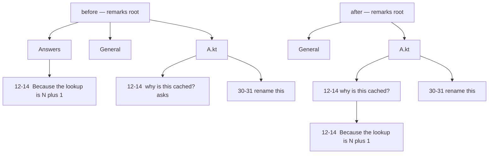
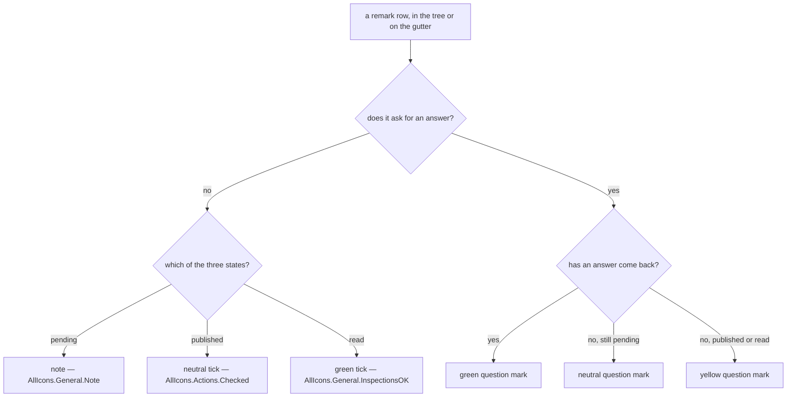

# Claude Remarks phase 12 — spec

Retire review mode, keep the one thing inside it worth keeping, nest an answer under the question it
answers, and give the icon column a second thing to say.

## Contents

1. [What this phase is](#1-what-this-phase-is)
2. [Why review mode goes](#2-why-review-mode-goes)
3. [The one thing kept: the open action](#3-the-one-thing-kept-the-open-action)
4. [The published file's header, five lines instead of eight](#4-the-published-files-header-five-lines-instead-of-eight)
5. [The fetch action once no review exists](#5-the-fetch-action-once-no-review-exists)
6. [One acknowledgement route, not two](#6-one-acknowledgement-route-not-two)
7. [The tool window loses its banner](#7-the-tool-window-loses-its-banner)
8. [Everything deleted, by file](#8-everything-deleted-by-file)
9. [An answer becomes a child of its question](#9-an-answer-becomes-a-child-of-its-question)
10. [The group for an answer whose question is gone](#10-the-group-for-an-answer-whose-question-is-gone)
11. [Delete, and when it asks first](#11-delete-and-when-it-asks-first)
12. [The two icon tracks](#12-the-two-icon-tracks)
13. [The three question-mark icons as files](#13-the-three-question-mark-icons-as-files)
14. [What RemarkStatusLook becomes](#14-what-remarkstatuslook-becomes)
15. [The gutter has to learn about answers](#15-the-gutter-has-to-learn-about-answers)
16. [The grey "asks" word goes](#16-the-grey-asks-word-goes)
17. [The skill](#17-the-skill)
18. [The watcher script](#18-the-watcher-script)
19. [The guards in CLAUDE.md](#19-the-guards-in-claudemd)
20. [Deliberately not changed](#20-deliberately-not-changed)
21. [Tests](#21-tests)
22. [Hand checks](#22-hand-checks)
23. [Order of work](#23-order-of-work)
24. [Risks](#24-risks)

---

## 1. What this phase is

Three strands that do not depend on each other, built in one phase because they all land in the same
few files and all three change what the tool window shows.

- **Review mode is retired.** The whole waiting-review protocol goes: the handshake to start a
  review, the banner, the Reject link, the deadline, the phases, the acknowledgement keyed to a
  session id. Two of the five endpoint actions go with it.
- **One piece is kept.** A session can still name a set of files and have the IDE open a real diff
  over them. That was a side effect of starting a review, and it becomes its own action.
- **An answer nests under its question in the tree**, instead of living in a flat group at the top.
- **The icon column says whether a row is a question**, and what colour that question is, instead of
  saying only which of the three states a remark is in.

Nothing changes about how a remark or an answer is stored. The only stored-format change anywhere is
in the published file's header, which is a wire format rather than a persisted one.

The version goes from `0.8.0` to `0.9.0`.

## 2. Why review mode goes

Review mode was phase 6, and phases 7, 8 and 10 each grew it. What it does today: a Claude Code
session posts to `start` with a session id, a label and a repository path. The IDE registers one
waiting review, shows a banner above the tree, and opens the files the request named. The person
publishes, which writes the merged published file with that review's session id in the header. The
session polls `fetch` until the header names its own session, reads the body, then posts `ack` with
`read` or `abandoned`. A deadline expires the review if nobody comes back. Rejecting writes a batch
with no remarks and `rejected: yes`.

Every one of those moving parts exists to solve one problem: how does a session know that the
remarks now in the file are the ones it asked for. Listen mode solved the same problem a different
way in phase 10, with the batch nonce, and the nonce needs no session id, no banner, no deadline and
no second acknowledgement route. Publishing plus a nonce covers the ground.

So this is a deletion driven by use, the same way phase 11 deleted tags and severity: the feature
works, and it is not the one being used.

What is lost, stated plainly rather than glossed over:

- **A session can no longer ask the person to start reviewing.** It can open files (section 3), but
  the IDE will not hold a banner saying somebody is waiting, and the person is not prompted.
- **A session can no longer be told "no, not now".** The Reject link was how the person said that.
  With no waiting review there is nothing to reject; a session that is listening simply keeps
  listening until the person stops it.
- **`already-read` loses one of its two meanings.** It still names which session claimed a batch
  first. It no longer also means "that batch answered a review somebody else started".

## 3. The one thing kept: the open action

Opening the files a review named is the useful half of `start`, and it is worth keeping on its own:
a session that has just produced a diff can put those files in front of the person, who then marks
them up with remarks.

**`POST /api/claude-remarks/open`**

Request body:

```json
{ "project": "/Users/sasha/dev/claude-remarks", "files": ["src/main/kotlin/A.kt", "README.md"] }
```

`project` is the repository top level as the IDE sees it, matched exactly as every other action
matches it, through `matchProject` and `projectIdentity`. `files` are paths relative to that root —
the same shape `git diff --name-only` prints, which is what the skill already computes.

Answers, always HTTP 200 with a `status` field:

| status | when | extra fields |
|---|---|---|
| `ok` | the project matched | `opened`: how many paths survived filtering |
| `unknown-project` | no open project has that identity | `open`: the identities that are open |
| `bad-request` | `project` missing or blank, or the body did not parse | `detail` |

Three things about this that have to be written down or they will be got wrong:

- **`opened` counts paths accepted, not editors opened.** The opening happens on the EDT, after the
  response has been written — `openReviewFiles` hops through `invokeLater` on purpose, because the
  HTTP response must not wait for editors to appear. So the count is what `filterReviewPaths` let
  through, and nothing more. The field's name has to not promise more than that.
- **An absent or empty `files` list is `ok` with `opened: 0`**, not `bad-request`. Opening nothing is
  a legitimate no-op, and it is what `start` already did with an empty list.
- **The handler itself touches no VFS and no editor.** It parses, calls `matchProject`, calls
  `openReviewFiles` in `review/OpenReviewFiles.kt`, writes two fields. That is the shape guard 5 in
  `CLAUDE.md` requires of everything in `ReviewRestService.kt`, and it is the same shape
  `handleAnswer` and `handlePublishedRead` already have.

`review/OpenReviewFiles.kt` itself needs **no change at all**. It already filters absolute paths and
`..` segments, caps at twenty paths, opens one real diff over the files that have a local change
through `ShowDiffAction`, and a plain editor for the rest.

## 4. The published file's header, five lines instead of eight

Today's header is eight lines. `review:`, `label:` and `rejected:` all exist only because a batch
could answer or reject a waiting review. All three go.

```
<!-- claude-remarks: published -->
nonce: 3f9c1a7e-…
published: 2026-08-06 14:22
commit: 1054df0a
remarks: 4

## src/main/kotlin/A.kt
…
```

- `PublishedHeader` keeps `nonce`, `publishedAt`, `commit`, `remarks`. It loses `reviewSession`,
  `reviewLabel` and `rejected`.
- `render()` writes five lines and the caller still adds the blank line after them.
- `publishedHeaderOf` refuses a text with fewer than five lines, refuses a first line that is not the
  marker, refuses a missing prefix on any of lines 2 to 5, and refuses a `remarks:` value that is
  not an integer. It no longer has a `rejected:` value to refuse.
- `sanitizeLabel` goes with `reviewLabel`.
- ⚠️ **`sanitizeControls` stays, and it now runs on `commit`.** Nothing that arrives over HTTP
  reaches the header any more, which is the reason it was written. But the reader on the other side
  still finds fields by line number, and `commit` comes from reading `.git` directly. A corrupt or
  hand-edited ref file could put a control character in the first eight characters of what
  `headCommit` returns, which would move every line after it. One call is cheaper than reasoning
  about whether that can happen.

The marker line is unchanged, and its KDoc has to lose the sentence about `review:` and `rejected:`
telling batch kinds apart, because there is only one kind of batch now.

**Both readers move with it.** `SKILL.md` reads the nonce from line 2 and, in listen mode, lines 6
and 8. `watch-remarks.sh` does the same. Line 2 is unaffected; the line 6 and line 8 reads are
deleted rather than renumbered, because what they were checking no longer exists.

## 5. The fetch action once no review exists

`fetch` grew a `session` field for review mode and phase 11 made it optional. Now it goes.

Request becomes `{ "project": "…" }`. Answers:

| status | when |
|---|---|
| `ready` | the published file parsed — carries `content`, `nonce`, `bytes` |
| `no-review` | no published file for this project at all |
| `too-large` | over `MAX_PUBLISHED_BYTES` — carries `bytes`, `limit` |
| `unknown-project` | no open project has that identity |
| `bad-request` | `project` missing or blank |
| `failed` | the project directory could not be resolved, an `IOException`, or a header that did not parse |

Gone with the field: the `waiting` answer, and the branch that compared the header's `review:` field
against the caller's session and answered `no-review` on a mismatch. With no session to compare, a
readable published file is always `ready`.

⚠️ **`no-review` is now a badly named status** — there are no reviews. Renaming it would break every
deployed copy of the skill and the watcher at once, for a cosmetic gain, so it stays and gets one
sentence of explanation where it is defined: it means "nothing has been published for this project",
and it kept its name from when a review was the only thing that published.

## 6. One acknowledgement route, not two

`published-read` is unchanged on the wire: `{project, nonce, session}` in, `ok` / `already-read` /
`unknown-batch` out, with `remarks`, and `session` and `readAt` on `already-read`.

What changes underneath:

- `PublishedBatch` loses `reviewSession`. `PublishedBatchService.record(ids)` takes one argument.
- `reportPublishedRead` loses the `WaitingReviewService.acknowledge` call. What is left is: mark the
  batch's remarks read, show one balloon, both inside `invokeLater`.
- ⚠️ **The `invokeLater` stays, and its reason narrows to one of the two it had.** It still closes
  the window where a fast acknowledgement lands between a publish's file write and its
  `markRemarksPublished`, which would set `READ` and have it overwritten straight back to
  `PUBLISHED`. The second reason — a review found still in its `Waiting` phase — is gone. The KDoc
  has to be rewritten to make one argument, not two, or a future reader will delete the hop after
  checking only the argument that no longer applies.
- **An empty batch can no longer happen**, because a rejection was the only thing that produced one.
  The "an empty batch shows no balloon" branch can go, and with it the `ids.isNotEmpty() ||
  reviewSession != null` guard, which becomes a plain `ids.isNotEmpty()`.

## 7. The tool window loses its banner

`ui/RemarksToolWindowFactory.kt`:

- The `banner` field, its `EditorNotificationPanel`, the Reject action label, and `updateBanner` all
  go, along with the `refresh()` call to it.
- The `JPanel(BorderLayout())` wrapper around the tree existed only so the banner had somewhere to
  sit above it. `setContent(JBScrollPane(tree))` goes back to being direct.
- `RemarksPanelTest` reaches `banner` because it is `internal` rather than private; those assertions
  go with it.

Nothing else in the panel changes for strand one. The toolbar keeps all six buttons.

## 8. Everything deleted, by file

Deleted whole:

| file | lines | what was in it |
|---|---|---|
| `review/WaitingReview.kt` | 344 | `WaitingReviewState`, `ReviewPhase`, `StartResult`, `AckOutcome`, `StampOutcome`, `ReviewEnd`, `startOrConflict`, `WaitingReviewService` and its scheduled expiry |
| `review/ReviewLifecycle.kt` | 214 | `answerWaitingReview`, `waitingReviewForPublish`, `rejectWaitingReview`, `REJECTION_BODY`, `finishReview`, `expireStaleReview` |
| `src/test/…/review/WaitingReviewTest.kt` | 168 | the pure `startOrConflict` and `isStale` |
| `src/test/…/review/WaitingReviewServiceTest.kt` | 184 | the service, fixture-backed |
| `src/test/…/review/ReviewLifecycleTest.kt` | 304 | the answer, the rejection, the read chain |

Parts deleted:

- `review/ReviewRestService.kt` — `handleStart`, `handleAck`, `StartRequest`, `AckRequest`,
  `clampDeadlineSeconds`, `DEFAULT_DEADLINE_SECONDS`, `MIN_DEADLINE_SECONDS`,
  `MAX_DEADLINE_SECONDS`, the `session` field on `FetchRequest`, and the two `when` branches that
  dispatched them. The file's leading KDoc — which describes five actions and their answers — is
  rewritten rather than edited around, because it currently opens by describing review mode.
- `action/PublishRemarks.kt` — the `waitingReviewForPublish` snapshot, the `answerWaitingReview`
  call, both imports, and the `reviewAnswer` sentence appended to the balloon. `record` is called
  with the ids alone.
- `review/PublishedRemarks.kt` — as section 4.
- `review/PublishedAck.kt` — as section 6.
- `ui/RemarksToolWindowFactory.kt` — as section 7.
- `src/test/…/review/ReviewEndpointSmokeTest.kt` — every `start` case, every `ack` case, the `fetch`
  `waiting` case, and the two fetch cases about a session matching or not matching the header.

Tests that only need an import or a `setUp` line removed: `AnswerReceiptTest`, `PublishedAckTest`,
`PublishedRemarksTest`, `PublishRemarksTest`, `RemarksPanelTest`.

## 9. An answer becomes a child of its question

Today the tree puts every answer in one flat group at the top, sorted newest first, while the
question that produced it sits in its file group further down. Both facts are on screen and neither
is next to the other.



The "Answers" group is gone from the after picture because in the ordinary case every answer has its
question. It comes back, under a different label, only for an answer whose question was deleted.

`buildTreeRoot` in `ui/RemarksTree.kt` changes like this:

- Answers with no id are dropped first, exactly as now, and for the same reason: a row that draws but
  cannot be deleted or opened is worse than no row.
- The surviving answers are split into two. An answer whose `remarkId` names a remark that is in the
  tree becomes that remark's child node. Every other answer — one whose `remarkId` is null, and one
  whose `remarkId` names nothing in the store — goes to the top-level group in section 10.
- The set of remark ids used for that decision is taken from the **same filtered list the nodes are
  built from**, not from the store again. A remark with no id produces no node, so an answer naming
  it has no parent to attach to and must be treated as having none.
- At most one answer can attach to one question. `recordAnswer` upserts on `remarkId`, so the store
  cannot hold two. The build does not need to handle a second, and should not silently drop one
  either: if two ever appear, both attach as children, which is visible rather than hidden.

Two smaller decisions inside it:

- **A nested answer row draws no file name.** Today an answer row ends with its file name in grey,
  because the flat group gave no other clue which file it was about. Nested under its question,
  inside that question's file group, the name is a third copy. The row keeps its position label,
  which is **not** redundant: an answer carries its own anchor and can drift away from its question's
  line. So `answerNode` learns whether it is nested and leaves `fileName` empty when it is. The
  orphan group's rows keep it, because there is no file group above them.
- **Newest-first ordering is gone for a nested answer.** It sits where its question sits, in bucket,
  file and line order. That ordering was the one thing the flat group bought, and what it was for —
  finding the answer that just arrived — is already covered by the balloon and by the gutter icon.
  The orphan group keeps newest-first.

Two things need no change and it is worth knowing why, so nobody adds code for them:

- `expandAll` in `RemarksPanel` walks rows in a `while` loop against a live `rowCount` and expands
  every one, so a question node with a child opens with no help.
- `collapsedGroups` records `GroupNode`s only, so a question node can never be restored shut across
  a refresh. An answer, once it exists, is always visible.

## 10. The group for an answer whose question is gone

An answer is its own record with its own anchor, and phase 11 decided deliberately that it outlives
the question it answers — `clearHandedOverRemarks` keeps answers, and `deleteRemark` does not touch
them. That decision stands. So an answer with no live question is an ordinary state, not a defect,
and it needs a home.

- The group keeps its key, `ANSWERS_KEY` = `"answers"`, so a person who had it collapsed keeps it
  collapsed across the upgrade.
- Its label changes to **"Answers with no question"**.
- It appears **only** when at least one such answer exists. A project where every answer has its
  question shows no such group at all — which is the ordinary case, so the tree normally has one
  fewer top-level group than it does today.
- It stays flat and newest first.
- It sits where the old Answers group sat, above General.

⚠️ **The label deliberately avoids the word "orphaned".** The tree already writes `(orphaned…)` on a
row whose *code* could not be found, which is a different thing entirely — that row's question may
be perfectly alive. Using one word for two states in one tree is how a person learns to distrust
both.

`bucketDropTarget` needs no change. It walks to the top-level ancestor and reads its key, and this
group's key is unchanged, so it is still not a drop target. A nested answer resolves to whatever
bucket its question is in, which is harmless: a drag reads `selectedIds()`, which is remark ids only.

## 11. Delete, and when it asks first

`deleteSelected` asks for confirmation when the selection stands for more rows than the person
pointed at. It works out "pointed at" by counting how many selected paths are themselves a remark or
an answer row, and comparing that with the total the selection covers.

Nesting breaks that arithmetic. Selecting one question row covers two rows — itself and its answer —
while one row was pointed at, so deleting a single question would pop a dialog.

Two changes, and the second is a simplification the first makes obvious:

- **`leavesOf` starts recursing into a `RemarkNode`.** Today it stops there and returns the remark
  alone. So a selected question would keep its answer, and that answer would jump into the
  no-question group — deleting a row and having a different row appear elsewhere. Recursing means
  Delete on a question takes its answer too.
- **The confirmation rule becomes "ask when the selection stands for a row that is not on screen".**
  That is what the old arithmetic was a proxy for: the dialog exists because a shut group stands for
  an unknown number of rows nobody can see. Two node shapes stand for a hidden row now. A group row
  always does. A question row does too when it has an answer under it **and** is itself collapsed —
  a question with a child draws its own expand handle, so a person can shut it by hand, and then the
  answer is hidden exactly the way a group's rows are. An expanded question and its visible answer
  are both on screen at the moment of the click, so that case asks nothing.

  ⚠️ Do not reduce this to "ask when the selection contains a group row". That was the first version
  of this section and it is wrong: `deleteAnswer` writes nothing to the history file, unlike Clear
  All and Clear Handed Over, so Delete on a collapsed question would take an answer the person
  cannot see and cannot get back.

The store is untouched. `deleteAnswer` is still its own function, called explicitly for each answer
row the selection covered. The child node is a view, not containment.

## 12. The two icon tracks

The icon column carries two facts now, not one. Which track a row is on is decided by
`asksForAnswer`; the colour inside the track says how far it got.



Two properties of this that are decisions, not accidents:

- **A question that was read but never answered stays yellow.** Green is what an answer arriving
  earns. `READ` means an agent said it read the batch, which for a question is the same position as
  `PUBLISHED`: handed over, nothing back yet. Letting `READ` alone turn a question green would make a
  question with no answer look finished, which is the one thing this colour is for.
- **The neutral colour sits at a different step in the two tracks** — pending on the question track,
  published on the plain track. That is asymmetric and it is intended. The plain track's middle state
  is not something a person waits on, so it does not need a colour of its own; a question's middle
  state is exactly what a person waits on, so it gets yellow, and neutral falls back to the step
  before. Each track is ordered within itself. Do not "fix" this by giving a published plain remark a
  yellow tick.

The old `PUBLISHED` icon was `AllIcons.Actions.Upload`, chosen so the mark on the row was a picture
of the button that put it there. That argument loses to the tick pair: a neutral tick and a green
tick differing only in colour say "sent" and "confirmed" as one progression, which is what the
column is for.

`textAttributes` is unchanged: `PENDING` and `PUBLISHED` draw in regular text, `READ` in grey. An
answered question is deliberately **not** greyed. From the person's side an answer arriving is work
to do, not work finished.

The answer's own row and its own gutter icon keep `AllIcons.General.Balloon`.

## 13. The three question-mark icons as files

`AllIcons` has no coloured question mark, so the three are new files. The two ticks already exist and
are reused.

Six SVGs under `src/main/resources/dev/sasha/clauderemarks/icons/`:

```
questionPending.svg     questionPending_dark.svg
questionPublished.svg   questionPublished_dark.svg
questionAnswered.svg    questionAnswered_dark.svg
```

The `_dark` suffix is the platform's own convention and `IconLoader` looks for it without being told.
Every coloured icon the platform ships has a dark sibling, including its greens and yellows, so all
three get one rather than guessing which colours survive a theme change.

Shape: the question mark from `expui/general/questionMark.svg` — a ring, the stem and the dot — at
16×16 in a `0 0 16 16` viewBox. Colours are copied from the platform's own files rather than picked
by eye, so they match every other icon in the gutter:

| meaning | light | dark | copied from |
|---|---|---|---|
| neutral | `#6C707E` | `#CED0D6` | `expui/actions/checked.svg` |
| yellow | `#FFAF0F` | `#F2C55C` | `expui/status/warning.svg` |
| green | `#55A76A` | `#57965C` | `expui/general/inspections/inspectionsOK.svg` |

The neutral pair is taken from the tick rather than from `questionMark.svg` on purpose: that file's
own dark variant is `#6F737A`, darker than its light one, because it is drawn on a light chip rather
than on a tree row. The tick's pair is the one that means "default foreground on a tree row", which
is what is wanted here.

A new file `ui/RemarkIcons.kt` holds the three, loaded once each:

```kotlin
object RemarkIcons {
    val QuestionPending: Icon = load("questionPending")
    val QuestionPublished: Icon = load("questionPublished")
    val QuestionAnswered: Icon = load("questionAnswered")

    private fun load(name: String): Icon =
        IconLoader.getIcon("/dev/sasha/clauderemarks/icons/$name.svg", RemarkIcons::class.java)
}
```

⚠️ **A wrong resource path fails at runtime and nothing in the build catches it.** `IconLoader`
returns a placeholder and logs, `verifyPlugin` does not check icon paths, and a unit test that only
calls `RemarkStatusLook.icon(...)` still gets a non-null `Icon` back. So the path is covered by a
test that asks for the resource directly — see section 21.

## 14. What RemarkStatusLook becomes

```kotlin
fun icon(status: RemarkStatus, asksForAnswer: Boolean, hasAnswer: Boolean): Icon
```

The order of the branches is the rule, and it has to be written in the order of section 12: ask about
`asksForAnswer` first, then, inside each track, about the rest. Writing it as one flat `when` over
five conditions is how the read-but-unanswered case gets decided by whichever branch happens to come
first.

Both callers pass all three with named arguments, because three booleans and an enum in a row is
unreadable at a call site.

The file's KDoc has to be rewritten rather than amended. It currently argues at length for two
channels — colour answers "is this still the work" with two answers, the icon answers "which state"
with three — and that argument is now wrong in its second half: the icon answers two questions with
five answers between them. The rewrite keeps the colour half, which is unchanged, and replaces the
icon half with section 12's two tracks and the two decisions under them.

## 15. The gutter has to learn about answers

The gutter draws the same icon the tree does, through the same function, so it needs the same three
facts. It has two of them.

- `RemarkPlacement` gains `hasAnswer: Boolean`.
- `placementsFor` in `editor/RemarkGutter.kt` already reads the answers list to build answer
  placements. It reads it into a local, derives the set of answered remark ids from it, and uses that
  set when building each `RemarkPlacement`. The set is derived from the **unfiltered** list, before
  the per-path filter: an answer's own path is normally its question's path, but the set is about
  which questions have answers, and filtering it by the document being synced would be an accident
  waiting to matter.
- ⚠️ Guard 3's grep drops any line containing `.allAnswers()`, so a local
  `val stored = RemarkStore.getInstance(project).allAnswers()` passes it. The existing comment in
  `hasRemarksOrAnswers` — which writes both calls out in full so the grep sees them by name — is
  about a different line shape and stays as it is.

⚠️ **`RemarkGutterIconRenderer` must carry every fact the icon depends on, and include them in
`equals` and `hashCode`.** It carries `status` today. `apply` in `RemarkGutter.kt` keeps a live
highlighter and assigns `gutterIconRenderer = entry.renderer`, and the platform decides whether to
repaint by comparing renderers. A renderer that ignores `asksForAnswer` and `hasAnswer` would compare
equal to the one already painted, and the icon would not change when an answer arrived. This is
exactly the argument `AnswerGutterIconRenderer`'s own KDoc already makes about including the markdown
in its `equals`, and it is the kind of thing that looks like it works because the tree updates.

## 16. The grey "asks" word goes

A remark row ends with a grey `asks` or `answered` today, decided by `asksLabel`. After the other two
strands it is a third copy of one fact: the question mark says the row asks, its colour says whether
an answer came, and the child node **is** the answer.

`asksLabel` is deleted, with its call in the cell renderer and its tests. `RemarkNode.hasAnswer`
stays — the icon needs it now.

The gutter tooltip's `(asks for an answer)` line **stays.** The gutter has no nesting and no colour
legend on hover, so there the words are the only thing carrying it.

## 17. The skill

The directory is renamed from `docs/skill/claude-remarks-review/` to `docs/skill/claude-remarks/`.
Every absolute path written inside `SKILL.md` — and there are several, because the skill's own
directory is not on `PATH` and the watcher has to be launched by full path — changes with it.

The skill offers three modes again, but the shape is different: two that read, and one that writes
nothing and waits for nothing.

1. **Open files in the IDE.** New, and short: one request to the `open` action, no waiting, no
   handshake beyond reading the token. Placed first, because it is the one a session reaches for
   when it has just produced a diff.
2. **Read remarks the person already published.** Unchanged except for the header line numbers and
   the removal of the `rejected:` check.
3. **Listen for the next batch.** Unchanged except for the header line numbers, the removal of the
   line-6 and line-8 claim checks, and the `--session` argument.

Deleted: the whole `## Steps` review flow, about 530 lines, and the `Hand a review over and wait`
bullet in the intro. The front matter's `description` is rewritten — it is the text that decides
whether this skill is reached at all, so it has to describe the three modes that exist rather than
having a clause surgically removed from the middle.

Two smaller edits:

- `## Over SSH: the IDE on another machine` says review mode and listen mode both need a tunnel. It
  becomes listen mode and the one-shot read.
- `## What to say if something goes wrong` loses the handoff-file timeout line. The 403 line stays
  and is still right: a restarted IDE mints a fresh token and the stale handshake file survives.

`remote-config.sh` needs no change. It stores host, port, project path and token, all four of which
the remaining modes still use.

⚠️ **The deployed symlink has to move with the directory.**
`~/.claude/skills/claude-remarks-review` points into this checkout, so the rename leaves it dangling.
Removing it and creating `~/.claude/skills/claude-remarks` is the last step of the rename, and it is
the only thing this whole phase touches outside the repository.

## 18. The watcher script

`docs/skill/claude-remarks/watch-remarks.sh`:

- `--require-review` goes: the argument, its variable, its whitelist entry, its refusal message under
  `--fetch`, and the whole line-6 block in file mode that read `review:` and compared it against a
  session id.
- `--session` goes: the argument, its variable, its whitelist entry, and the conditional that added
  `session` to the fetch request body. The body becomes `{project}` always.
- The two usage lines change to match.
- Nothing else moves. `--owner`, the deadline, the poll interval, the pid file and the rule that a
  starting watcher never takes over from a running one are all untouched.

⚠️ **The refusal for an unknown argument has to keep working after the removal.** Both flags are in
the argument whitelist today, so removing them from the whitelist is what makes an old launch line
fail loudly instead of being silently ignored. That is wanted: a watcher launched from a stale
command should say so.

## 19. The guards in CLAUDE.md

**Guard 6 — who may call `markRemarksRead`** — loses `review/ReviewLifecycle.kt`:

```bash
grep -rn "markRemarksRead(" src/main --include='*.kt' \
  | grep -v "store/RemarkEdits.kt" | grep -v "review/PublishedAck.kt"   # must be empty
```

Its prose has to change too, not just its command. It currently explains at length that there are
*two* acknowledgement routes and that they are not independent of each other — a batch answering a
review ends that review as well. One route remains, keyed to a batch nonce, and the paragraph about
the two being tied together is deleted rather than trimmed.

**Guard 5 — the endpoint touches no VFS, Swing or `invokeAndWait`** — needs no edit. It names the
whole file, so `handleOpen` is covered the moment it is written, the same way `handleAnswer` was.
Its own prose already says the file opening lives in `review/OpenReviewFiles.kt` for exactly this
reason, which is now the `open` action's reason rather than `start`'s.

Guards 1, 2, 3, 4 and 7 are untouched. Guard 3's count of thirteen functions in `RemarkEdits.kt` is
unchanged: nothing is added to or removed from that file.

## 20. Deliberately not changed

- **The `review/` package name, and the `ReviewRestService` class name.** The package still holds the
  whole wire side: the handshake, the published file, the acknowledgement, the answer receipt, the
  file opening. Guards 5, 6 and 7 name files inside it by path, and the service name in the URL is
  `claude-remarks` rather than `review`, so a rename would edit three greps and every import for no
  behaviour change.
- **`openReviewFiles` and `filterReviewPaths` keep their names.** "Review" there means a person
  reading code, which is still what the files are opened for.
- **`no-review` as a status value.** Section 5.
- **How an answer is stored, and that it outlives its question.** Section 10.
- **The `PUBLISHED_MARKER` string.** It is a wire format shared with the skill and its value carries
  no version, so changing it would only break readers without telling them anything.

## 21. Tests

Deleted: `WaitingReviewTest`, `WaitingReviewServiceTest`, `ReviewLifecycleTest`.

Changed:

- **`ReviewEndpointSmokeTest`** loses every `start` case, every `ack` case, the fetch `waiting` case
  and the two fetch-session cases. It gains the `open` action: `ok` with the accepted count for a
  real project, `ok` with `opened: 0` for an empty file list, `bad-request` with a detail for a body
  with no project, and `unknown-project` with the open list for a path nothing has open.
- **`PublishedRemarksTest`** — the five-line `render()` and `publishedHeaderOf` round trip; a text
  with four lines reads back null; a missing prefix on each of lines 2 to 5 reads back null; a
  `remarks:` value that is not an integer reads back null. The label sanitizer test goes. A new one:
  a `commit` carrying a control character comes out with it replaced, so the header cannot shift.
- **`PublishedAckTest`** loses the review-session assertions and keeps the rest — first
  acknowledgement, second session, same session twice, unknown nonce, the sixteen-batch limit, and
  that an acknowledgement marks only its own batch.
- **`PublishRemarksTest`** loses the review-answer assertions.
- **`RemarksPanelTest`** loses the banner assertions and gains the confirmation rule: a selected
  question row with an answer under it deletes both without asking, and a selected group row asks.
- **`RemarksTreeTest`** gains the nesting: an answer whose `remarkId` names a remark in the tree is
  that remark's child; an answer whose `remarkId` names nothing is in the top-level group; the group
  is absent when every answer has its question; a nested answer row carries no file name and an
  orphan row does; the orphan group is still newest first. Its `asksLabel` tests go.
- **`RemarkGutterIconTest`** gains the case that two `RemarkGutterIconRenderer`s differing only in
  `hasAnswer` are not equal, and the same for `asksForAnswer`. That is the assertion standing between
  this feature and an icon that never updates.
- **`AnswerReceiptTest`** loses its `WaitingReviewService` cleanup.

New:

- **`RemarkStatusLookTest`**, fixture-backed because `AllIcons` and `IconLoader` want an application:
  the six cases of section 12 each return the icon they should, the same input returns the same
  instance, and the read-but-unanswered question returns the yellow one — that last case pinned on
  its own, because it is the decision most likely to be quietly reversed.
- **`RemarkIconsTest`** in two halves. A plain half with no fixture asserts that all six SVG
  resources resolve through `Class.getResource`, which is what catches a typo in a path or a resource
  that did not make it into the jar. A fixture-backed half asserts each of the three icons reports a
  width of 16, which is what catches an SVG that does not parse.

## 22. Hand checks

Nothing below is reachable by `./gradlew test`.

**Before anything else**, the seven greps in `CLAUDE.md`, all empty, with guard 6 naming two files.

Then `./gradlew verifyPluginProjectConfiguration` and `./gradlew verifyPlugin`.

The shell script, each check its own run, in the scratchpad, with `HOME` pointed at a temporary
directory and never at the real `~/.claude-remarks`:

1. A five-line header is read and its nonce taken from line 2.
2. An old eight-line header is still read for its nonce — line 2 did not move — so a watcher started
   against a stale file behaves.
3. `--require-review` is refused as an unknown argument, with exit 2.
4. `--session` is refused the same way.
5. Fetch mode sends a body with `project` and no `session`.
6. `--owner` behaves exactly as it does today: a live owner keeps polling, a killed owner ends the
   watch inside one poll with exit 3, and a non-numeric, empty or zero value is refused with exit 2.

In a sandbox IDE:

7. The three question marks draw, in a light theme and in a dark theme, and the three colours are
   distinguishable at gutter size.
8. A pending question shows the neutral question mark, and asking with `Ctrl+Alt+Shift+A` turns it
   yellow at once because that gesture publishes on the spot.
9. An answer arriving turns its question green, in the tree and on the gutter, with no manual
   refresh. This is the check that fails if the renderer's `equals` was not extended.
10. A plain remark shows the note, then the neutral tick after Publish, then the green tick after an
    acknowledgement.
11. The answer nests under its question, expanded, and its row shows a position and no file name.
12. Deleting an answer's question takes the answer with it, with no dialog.
13. Deleting a collapsed file group still asks first.
14. An answer whose question was deleted through Clear Handed Over appears in "Answers with no
    question", with its file name.
15. The tool window has no banner and the tree sits directly under the toolbar.
16. The `open` action against a real IDE: two changed files open as one diff window, an unchanged
    file opens as a plain editor, and the response says how many paths were accepted.
17. A `publish` and a `published-read` round trip still marks remarks read and shows one balloon.

⚠️ **Phase 11's twenty-four hand checks are still unrun, and several of them are rewritten by this
phase** — the answer round trip, the tree row, the gutter icon. Their list is superseded where it
overlaps and has to be rewritten rather than carried forward, or it will be run against behaviour
that no longer exists.

## 23. Order of work

Strand one first, whole, before either view strand starts. It changes the wire format and deletes two
files that tests import, so interleaving it with the tree work means a header test and a tree test
failing together for unrelated reasons.

1. **Retire review mode.** The deletions, the `open` action, the five-line header, the single
   acknowledgement route, the banner. Tests updated in the same tasks that break them.
2. **Nest the answers.** `buildTreeRoot`, the narrowed group, `leavesOf`, the confirmation rule.
3. **The icons.** The six SVGs, `RemarkIcons`, `RemarkStatusLook`, the gutter's `hasAnswer`, the
   renderer's `equals`, dropping `asksLabel`.
4. **The skill.** The rename, the review flow deleted, the new `open` section, the watcher's two
   flags.
5. **Docs and version.** `CLAUDE.md`, `docs/claude/design.md`, `README.md`, `0.9.0`.

Strands two and three both edit `ui/RemarksTree.kt`, so they are sequential rather than parallel.
Strand four touches no Kotlin at all and could run beside two or three, but it is the one a person
has to check by hand, so it goes after the code it describes is settled.

Then, once merged, in this order and only in this order:

1. Build and install the `0.9.0` zip. Installing restarts the IDE, which mints a fresh token, so
   nothing that reads the handshake file may run before it.
2. Re-point the skill symlink under `~/.claude/skills`.
3. Restart every watcher on the machine, and report which repositories were restarted.

## 24. Risks

- ⚠️ **Every watcher on the machine has to be restarted, for two independent reasons.** A watcher
  started before this reads lines 6 and 8 of a header that no longer has them, so it refuses every
  batch the new plugin writes. And every watcher was launched by absolute path into
  `docs/skill/claude-remarks-review/`, which the rename deletes, so nothing can restart one from its
  old launch line either.

  The safety rule inside that is not negotiable and is unchanged from phase 11: **never** by process
  name — no `pkill`, no `killall`, no `ps | grep` matched on `watch-remarks.sh`, because every
  repository's watcher on this machine runs a program with that name. For each `.watch` file under
  `~/.claude-remarks`: read the pid on line 1, check it is alive, check its command line names the
  same watched path that file belongs to, and only then stop that one.

  A watcher belongs to a session, so replacing one leaves that session listening to nothing. Which
  repositories were restarted has to be reported, so those sessions can be told.
- ⚠️ **The symlink rename breaks any session holding the old path** until it is re-pointed. A session
  that resolved `~/.claude/skills/claude-remarks-review/watch-remarks.sh` earlier in its run gets
  "no such file" from a stale variable even after the new link exists.
- A published file left on disk by `0.8.0` has an eight-line header, which the new
  `publishedHeaderOf` reads as malformed. One `fetch` answers `failed` until the next publish
  overwrites it. Self-healing, and worth one line in the skill's troubleshooting section so it is not
  read as a bug.
- The running plugin is `0.8.0`, whose zip was built and never installed. So the build installed at
  the end of this carries phase 11's two follow-up fixes — navigating to the code from an answer row,
  and the question shown above the answer in the popup — as well as all of phase 12. Neither has been
  seen in a real IDE on an installed build.
- **`already-read` is now the only signal that two sessions are listening to one repository.** It was
  that before too, but it also carried the review case, and the skill's listen mode has prose about
  both. That prose has to be reduced to the one case rather than left describing a situation that
  cannot arise.
