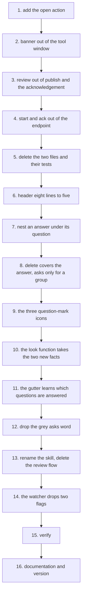

# Claude Remarks phase 12 — implementation plan

## Contents

1. [Overview](#overview)
2. [Context](#context)
3. [Development Approach](#development-approach)
4. [Testing Strategy](#testing-strategy)
5. [Progress Tracking](#progress-tracking)
6. [Solution Overview](#solution-overview)
7. [Technical Details](#technical-details)
8. [What Goes Where](#what-goes-where)
9. [Implementation Steps](#implementation-steps)
10. [Hand checks](#hand-checks)
11. [Post-Completion](#post-completion)

## Overview

Three strands, one phase. The spec is
`docs/plans/20260806-claude-remarks-phase12-spec.md` and every task below names the section of it
that carries the design. **Read that section before starting the task.** The plan says what to do; the
spec says why, and it already answers most of the questions a task raises.

- **Review mode is retired.** The waiting-review protocol goes whole: the `start` and `ack` endpoint
  actions, the banner above the tree, the deadline, the review phases, and the acknowledgement route
  keyed to a session id. Two Kotlin files and three test classes are deleted. The published file's
  header shrinks from eight lines to five, and `fetch` loses its optional `session` field.
- **One piece is kept**, as its own action: `POST /api/claude-remarks/open` takes a project and a
  list of files and opens a real diff over the ones with a local change. That was the useful half of
  `start`.
- **An answer nests under the question it answers** in the tool window tree, instead of sitting in a
  flat group at the top. The flat group narrows to hold only answers whose question is gone.
- **The icon column carries two facts instead of one.** A question draws a question mark coloured by
  how far it got — neutral pending, yellow published, green answered. A plain remark draws a note,
  then a neutral tick, then a green tick. The grey `asks` word at the end of a row goes, because three
  things now say it.

Version goes from `0.8.0` to `0.9.0`.

## Context

- Files involved: `review/ReviewRestService.kt`, `review/WaitingReview.kt`,
  `review/ReviewLifecycle.kt`, `review/PublishedRemarks.kt`, `review/PublishedAck.kt`,
  `action/PublishRemarks.kt`, `ui/RemarksToolWindowFactory.kt`, `ui/RemarksTree.kt`,
  `ui/RemarkStatusLook.kt`, `editor/RemarkGutter.kt`, `editor/RemarkGutterIcon.kt`, the skill under
  `docs/skill/`, and the four documentation files.
- Patterns already in the codebase this follows: an endpoint handler parses, calls `matchProject`,
  calls one function in another file and writes status fields — `handleAnswer` and
  `handlePublishedRead` are both that shape. A look shared by the gutter and the tree lives in
  `ui/RemarkStatusLook.kt`. A shared menu lives in `ui/RemarkActions.kt`.
- `review/OpenReviewFiles.kt` needs **no change at all**. It already filters absolute paths and `..`
  segments, caps at twenty paths, and opens one diff for the changed files plus a plain editor for the
  rest.
- `src/main/resources/META-INF/plugin.xml` needs **no change at all**. `WaitingReviewService` is
  registered by its `@Service` annotation, not in the XML, and no action or extension point in the XML
  mentions a review.

## Development Approach

- **parallel waves**: `none` — every task from task 3 onward depends on the one before it, either
  because a deletion cannot compile until its callers are gone or because both edit
  `ui/RemarksTree.kt`. The only genuinely independent pair, tasks 1 and 2, is small enough that a
  worktree each would cost more than it saves.
- **testing approach**: Regular — the code exists and most tasks change or delete it, so a test-first
  cycle would mean writing a failing test against behaviour that is about to be removed. The two
  tasks that add something new, task 9 and task 10, write their tests first.
- **⚠️ For a deletion, the Kotlin compiler is the authority, not a grep.** Do not try to enumerate
  every reference before deleting. Delete, run `./gradlew compileTestKotlin`, and fix every reference
  the compiler names. A grep misses a method reference and an aliased import; the compiler misses
  nothing.
- Complete each task fully before starting the next. Small focused changes.
- **Every task includes new or updated tests** for the code it changed, as separate checklist items.
- **All tests must pass before the next task starts.** The narrow command per task, the full suite
  once at the end.
- Update this file when scope changes: `[x]` when done, `➕` for a task discovered on the way, `⚠️`
  for a blocker.
- The rules in `.claude/rules/planning-rules.md` hold for every task. In particular: never run
  `./gradlew runIde`, Gradle in the foreground with a 600000 ms timeout and never two at once, and
  never touch the real `~/.claude-remarks`.

## Testing Strategy

- **Unit tests** are required in every task. A test with no platform import runs in milliseconds and
  is preferred; a test needing a project, a `Document` or a markup model extends
  `BasePlatformTestCase`.
- **No e2e or UI-rendering tests exist in this project** and this phase adds none. Whether an icon
  actually draws, whether the tree looks right, and whether the popup renders markdown are all hand
  checks. The list is in [Hand checks](#hand-checks).
- Every fixture-backed class that asserts on the whole store clears it in `setUp` as well as
  `tearDown`: the light fixture project is shared across test classes.
- The seven guards in `CLAUDE.md` are part of the test surface. Run the ones a task could affect
  inside that task.

## Progress Tracking

Mark completed items `[x]` as they are done. Add a discovered task with a `➕` prefix. Record a
blocker with `⚠️`. Keep this file in step with what actually happened, not with what was planned.

## Solution Overview

Strand one is a deletion with one addition, and the order inside it is forced by what compiles. The
`open` action goes in **first**, while `start` still exists, so the endpoint is never without a way to
open files. Then the callers of the review machinery are cleaned out one at a time — the banner, the
publish pipeline, the endpoint — and only once nothing references them are the two files deleted. The
header shrinks last, because a rejection was one of the things that built a header and rejections are
gone by then.



Strand two is two tasks: the nesting itself, then the two consequences it has for Delete. Strand three
is four: the icon files, the function that picks one, the gutter side of it, and the removal of the
grey word the icons replace. The icon files come before the function that loads them, so the function
is never written against a path that does not exist yet.

## Technical Details

The details that would otherwise be rediscovered per task. Everything here is verified, not recalled.

**The `open` action's answers.** Always HTTP 200 with a `status`: `ok` with an `opened` count,
`unknown-project` with the `open` list, `bad-request` with a `detail`. `opened` counts paths that
survived `filterReviewPaths`, **not** editors opened — the opening hops to the EDT through
`invokeLater` and the response is written before it happens. An absent or empty `files` list is `ok`
with `opened: 0`, not a refusal.

**The five-line header.**

```
<!-- claude-remarks: published -->
nonce: 3f9c1a7e-…
published: 2026-08-06 14:22
commit: 1054df0a
remarks: 4
```

`sanitizeControls` stays and now runs on `commit`: nothing from HTTP reaches the header any more, but
the reader still finds fields by line number and `commit` comes from reading `.git` directly.
`sanitizeLabel` goes.

**Icon constants, all verified against the platform checkout at `~/dev/oss/intellij-community`, tag
`idea/2025.2.6.3`.**

- `AllIcons.Actions.Checked` — the neutral tick, stroke `#6C707E` light and `#CED0D6` dark.
- `AllIcons.General.InspectionsOK` — the green tick, `#55A76A` light and `#57965C` dark.
- The yellow is `#FFAF0F` light and `#F2C55C` dark, from `expui/status/warning.svg`.
- The question mark shape is `expui/general/questionMark.svg` — a ring, a stem and a dot, 16×16 in a
  `0 0 16 16` viewBox. Its own colours are **not** reused: that file's dark variant is darker than its
  light one because it is drawn on a chip, not a tree row.
- `IconLoader.getIcon(path: String, aClass: Class<*>)` exists and is the route for a plugin's own
  icon. The path is absolute, starting with a slash.
- The `_dark` suffix goes before the extension and `IconLoader` finds it without being told. Every
  coloured icon the platform ships has a dark sibling, including its greens and yellows.

**The icon rule, in this branch order.** Ask `asksForAnswer` first, then decide inside the track.
Written as one flat `when` over five conditions, the read-but-unanswered case gets decided by
whichever branch happens to be first.

| track | state | icon |
|---|---|---|
| plain | `PENDING` | `AllIcons.General.Note` |
| plain | `PUBLISHED` | `AllIcons.Actions.Checked` |
| plain | `READ` | `AllIcons.General.InspectionsOK` |
| question | has an answer | green question mark |
| question | no answer, `PENDING` | neutral question mark |
| question | no answer, `PUBLISHED` or `READ` | yellow question mark |

**⚠️ The one real trap in the whole phase.** `RemarkGutterIconRenderer` must carry every fact the icon
depends on and include them in `equals` and `hashCode`. `apply` in `editor/RemarkGutter.kt` keeps a
live highlighter and assigns `gutterIconRenderer = entry.renderer`, and the platform decides whether
to repaint by comparing renderers. A renderer that ignores `asksForAnswer` and `hasAnswer` compares
equal to the one already painted, so the gutter icon never changes when an answer arrives — and it
looks like it works, because the tree updates through a different path. `AnswerGutterIconRenderer`'s
own KDoc already makes this argument about including the markdown.

**Guard 3's grep and a local variable.** The grep drops any line containing `.allAnswers()`, so
`val stored = RemarkStore.getInstance(project).allAnswers()` passes it. The comment in
`hasRemarksOrAnswers` about writing both calls out in full is about a different line shape and stays.

## What Goes Where

- **Implementation Steps** (`[ ]` checkboxes): everything achievable in this repository — code, tests,
  the skill, the documentation, the version bump.
- **Hand checks** and **Post-Completion** (no checkboxes): anything needing a running IDE, a second
  machine, or a change outside the repository. The symlink move and the watcher restarts are there.

## Implementation Steps

### Task 1: Add the open action to the review endpoint

Spec section 3. Additive — `start` still exists after this task, so nothing is without a way to open
files at any point.

**Files:**
- Modify: `src/main/kotlin/dev/sasha/clauderemarks/review/ReviewRestService.kt` (add `OpenRequest`
  beside `FetchRequest`, add `handleOpen` beside `handleFetch`, add the `"open" ->` branch to the
  `when (action)` inside `execute`, and extend the file's leading KDoc)
- Modify: `src/test/kotlin/dev/sasha/clauderemarks/review/ReviewEndpointSmokeTest.kt` (add the open
  cases beside the existing fetch cases)

- [x] add `private class OpenRequest(val project: String? = null, val files: List<String>? = null)`
      beside the other request classes, with a KDoc saying `files` are paths relative to the
      repository root and that an absent list opens nothing
- [x] add `handleOpen`: parse the body, refuse a missing or blank `project` through `badRequest`, call
      `matchProject`, call `openReviewFiles(project, parsed.files)`, then write `status` `ok` and
      `opened` as `filterReviewPaths(parsed.files).size`
- [x] add `"open" -> handleOpen(request, writer)` to `execute`'s dispatch
- [x] extend the file's leading KDoc to name the new action and its three answers, **without naming
      any of the five symbols guard 5 greps for** — that grep is line-based and cannot tell a comment
      from code
- [x] write tests: `ok` with the accepted count for a real project, `ok` with `opened: 0` for an empty
      list, `unknown-project` with the open list for a path nothing has open
- [x] write a test that a body with no `project` answers `bad-request` and carries a `detail`
- [x] run `./gradlew test --tests 'dev.sasha.clauderemarks.review.ReviewEndpointSmokeTest'` — must
      pass before task 2
- [x] run guard 5's grep from `CLAUDE.md` against `ReviewRestService.kt` — must be empty

### Task 2: Take the waiting-review banner out of the tool window

Spec section 7.

**Files:**
- Modify: `src/main/kotlin/dev/sasha/clauderemarks/ui/RemarksToolWindowFactory.kt` (the `banner`
  field, `updateBanner`, the `updateBanner()` call at the end of `refresh`, the
  `JPanel(BorderLayout())` wrapper in the `init` block's `setContent`, and the four review imports)
- Modify: `src/test/kotlin/dev/sasha/clauderemarks/ui/RemarksPanelTest.kt` (every test and helper
  reaching `panel.banner` or `WaitingReviewService`, including any `setUp`/`tearDown` cleanup of it)

- [x] delete the `banner` field and `updateBanner`, and the `updateBanner()` call inside `refresh`'s
      `finishOnUiThread` block
- [x] replace the `JPanel(BorderLayout())` wrapper with `setContent(JBScrollPane(tree))` and remove
      the now-unused `BorderLayout` and `JPanel` imports
- [x] remove the `ReviewPhase`, `WaitingReviewService`, `rejectWaitingReview` and
      `EditorNotificationPanel` imports, plus `StringUtil` if nothing else uses it
- [x] delete the banner tests and any review cleanup in `RemarksPanelTest`
- [x] run `./gradlew test --tests 'dev.sasha.clauderemarks.ui.RemarksPanelTest'` — must pass before
      task 3

### Task 3: Take the review out of the publish pipeline and the acknowledgement

Spec section 6.

**Files:**
- Modify: `src/main/kotlin/dev/sasha/clauderemarks/action/PublishRemarks.kt` (the
  `waitingReviewForPublish` snapshot and the `answerWaitingReview` call inside `publishRemarks`, both
  imports, the `record(prepared.ids, waiting?.sessionId)` argument, and the `reviewAnswer` sentence
  appended to the balloon)
- Modify: `src/main/kotlin/dev/sasha/clauderemarks/review/PublishedAck.kt`
  (`PublishedBatch.reviewSession`, `record`'s second parameter, and inside `reportPublishedRead` the
  `WaitingReviewService.acknowledge` call and the `ids.isNotEmpty() || reviewSession != null` guard)
- Modify: `src/test/kotlin/dev/sasha/clauderemarks/action/PublishRemarksTest.kt` (the review-answer
  assertions)
- Modify: `src/test/kotlin/dev/sasha/clauderemarks/review/PublishedAckTest.kt` (the review-session
  assertions)

- [x] in `PublishRemarks.kt`, delete the waiting-review snapshot and the answer call, call
      `record(prepared.ids)`, and drop the review sentence from the balloon
- [x] in `PublishedAck.kt`, drop `reviewSession` from `PublishedBatch` and from `record`, and reduce
      `reportPublishedRead` to marking the batch's remarks read plus one balloon, inside the existing
      `invokeLater`
- [x] rewrite `reportPublishedRead`'s KDoc so the `invokeLater` has **one** stated reason, the store
      race, not two — a future reader who checks only the reason that no longer applies will delete a
      load-bearing hop
- [x] delete the empty-batch branch and its explanation: only a rejection produced an empty batch and
      rejections are gone
- [x] update `PublishRemarksTest` and `PublishedAckTest`, keeping every non-review case in both
- [x] run `./gradlew test --tests 'dev.sasha.clauderemarks.action.PublishRemarksTest' --tests 'dev.sasha.clauderemarks.review.PublishedAckTest'`
      — must pass before task 4

### Task 4: Remove start, ack, and fetch's session from the endpoint

Spec sections 2 and 5.

**Files:**
- Modify: `src/main/kotlin/dev/sasha/clauderemarks/review/ReviewRestService.kt` (`handleStart`,
  `handleAck`, `StartRequest`, `AckRequest`, `clampDeadlineSeconds`, `DEFAULT_DEADLINE_SECONDS`,
  `MIN_DEADLINE_SECONDS`, `MAX_DEADLINE_SECONDS`, the `session` field on `FetchRequest`, the session
  branches inside `handleFetch`, the two `when` branches, and the whole leading KDoc)
- Modify: `src/test/kotlin/dev/sasha/clauderemarks/review/ReviewRequestTest.kt` (the
  `clampDeadlineSeconds` tests)
- Modify: `src/test/kotlin/dev/sasha/clauderemarks/review/ReviewEndpointSmokeTest.kt` (every start
  case, every ack case, the fetch `waiting` case, and the two fetch cases about a session matching or
  not matching the header)

- [x] delete the two handlers, their request classes, the deadline clamp and its three constants, and
      the two dispatch branches
- [x] delete `FetchRequest.session` and both places `handleFetch` used it: the short-circuit that
      answered `waiting`, and the header comparison that answered `no-review` on a session mismatch.
      A readable published file is now always `ready`
- [x] rewrite the file's leading KDoc from scratch for the four actions that remain — `fetch`,
      `published-read`, `answer`, `open` — again naming none of guard 5's five symbols
- [x] add one sentence where `no-review` is written, saying it means "nothing has been published for
      this project" and that it kept its name from when a review was the only thing that published
- [x] delete the `clampDeadlineSeconds` tests from `ReviewRequestTest`, keeping `requestIsAllowed`,
      `projectForPath` and `readPublished`
- [x] delete the start, ack and session-related cases from `ReviewEndpointSmokeTest`, keeping the
      fetch, published-read, answer and open cases
- [x] run `./gradlew test --tests 'dev.sasha.clauderemarks.review.ReviewRequestTest' --tests 'dev.sasha.clauderemarks.review.ReviewEndpointSmokeTest'`
      — must pass before task 5
- [x] run guard 5's grep again — must still be empty

### Task 5: Delete the waiting-review files

Spec section 8. Nothing should reference these by now; the compiler proves it.

**Files:**
- Delete: `src/main/kotlin/dev/sasha/clauderemarks/review/WaitingReview.kt`
- Delete: `src/main/kotlin/dev/sasha/clauderemarks/review/ReviewLifecycle.kt`
- Delete: `src/test/kotlin/dev/sasha/clauderemarks/review/WaitingReviewTest.kt`
- Delete: `src/test/kotlin/dev/sasha/clauderemarks/review/WaitingReviewServiceTest.kt`
- Delete: `src/test/kotlin/dev/sasha/clauderemarks/review/ReviewLifecycleTest.kt`
- Modify: whatever `./gradlew compileTestKotlin` names afterwards — expect at least
  `src/test/kotlin/dev/sasha/clauderemarks/review/AnswerReceiptTest.kt` (its `WaitingReviewService`
  cleanup in `setUp` or `tearDown`)

- [x] delete the two main-source files and the three test classes with `git rm`
- [x] run `./gradlew compileKotlin compileTestKotlin` and fix **every** reference the compiler names,
      one at a time — do not try to find them with a grep first
- [x] check no import of `dev.sasha.clauderemarks.review.WaitingReview*`, `ReviewPhase`, `ReviewEnd`,
      `AckOutcome` or `StampOutcome` survives anywhere, by compiling clean rather than by searching
- [x] run `./gradlew test` once here — this is the one mid-plan full run, because a deletion this wide
      can break a class no narrow command would name
- [x] confirm `git status` shows exactly the five deletions plus the files the compiler made you touch

### Task 6: Shrink the published file's header to five lines

Spec section 4.

**Files:**
- Modify: `src/main/kotlin/dev/sasha/clauderemarks/review/PublishedRemarks.kt` (`PublishedHeader`'s
  fields and `render()`, `publishedHeaderOf`, delete `sanitizeLabel`, apply `sanitizeControls` to
  `commit`, and the sentence in `PUBLISHED_MARKER`'s KDoc about `review:` and `rejected:` telling
  batch kinds apart)
- Modify: `src/main/kotlin/dev/sasha/clauderemarks/action/PublishRemarks.kt` (the `PublishedHeader(…)`
  construction — drop the three arguments)
- Modify: `src/test/kotlin/dev/sasha/clauderemarks/review/PublishedRemarksTest.kt` (the header round
  trip and the malformed-header cases)

- [x] drop `reviewSession`, `reviewLabel` and `rejected` from `PublishedHeader`, and make `render()`
      write five lines
- [x] make `publishedHeaderOf` refuse a text with fewer than five lines, and parse lines 2 to 5 only
- [x] delete `sanitizeLabel`; keep `sanitizeControls` and apply it to `commit`, with a comment saying
      why it is still needed once nothing from HTTP reaches the header
- [x] update the `PUBLISHED_MARKER` KDoc: there is one kind of batch now
- [x] write tests: the five-line round trip; a four-line text reads back null; a missing prefix on
      each of lines 2 to 5 reads back null; a non-integer `remarks:` reads back null
- [x] write a test that a `commit` carrying a control character comes back with it replaced, so the
      header cannot shift
- [x] run `./gradlew test --tests 'dev.sasha.clauderemarks.review.PublishedRemarksTest' --tests 'dev.sasha.clauderemarks.review.ReviewEndpointSmokeTest'`
      — must pass before task 7

### Task 7: Nest an answer under the question it answers

Spec sections 9 and 10.

**Files:**
- Modify: `src/main/kotlin/dev/sasha/clauderemarks/ui/RemarksTree.kt` (the answers block at the top of
  `buildTreeRoot`, `answerNode`, `ANSWERS_LABEL`, and `AnswerNode.fileName`'s KDoc)
- Modify: `src/test/kotlin/dev/sasha/clauderemarks/ui/RemarksTreeTest.kt` (the Answers-group tests)

- [x] change `ANSWERS_LABEL` to `"Answers with no question"`, keeping `ANSWERS_KEY` as `"answers"` so
      a collapsed state survives the upgrade, and say in its KDoc why the word "orphaned" is avoided
- [x] in `buildTreeRoot`, split the id-carrying answers into those whose `remarkId` names a remark in
      the same filtered list the nodes are built from, and everything else
- [x] attach each matched answer as a child of its remark's `DefaultMutableTreeNode`, in both the
      General group and the file groups
- [x] add the top-level group for the rest, above General, only when at least one exists, still sorted
      newest first
- [x] give `answerNode` a `nested` parameter that leaves `fileName` empty, and update
      `AnswerNode.fileName`'s KDoc to say the position stays because an answer's anchor can drift from
      its question's
- [x] write tests: a matched answer is its question's child; an answer naming nothing is in the
      top-level group; the group is absent when every answer has a question; a nested row carries no
      file name and a top-level row does; the top-level group is newest first
- [x] write a test that an answer whose `remarkId` names a remark with no id — which produces no node
      — lands in the top-level group rather than disappearing
- [x] run `./gradlew test --tests 'dev.sasha.clauderemarks.ui.RemarksTreeTest'` — must pass before
      task 8 (run together with `RemarksPanelTest`, which the nesting moves rows in: 57 and 25 tests,
      no failures)

### Task 8: Make Delete cover a question's answer, and ask only for a group

Spec section 11.

**Files:**
- Modify: `src/main/kotlin/dev/sasha/clauderemarks/ui/RemarksTree.kt` (`leavesOf` — recurse into a
  `RemarkNode` instead of stopping at it)
- Modify: `src/main/kotlin/dev/sasha/clauderemarks/ui/RemarksToolWindowFactory.kt` (`deleteSelected`'s
  `pickedOut` count and the `total > pickedOut` condition)
- Modify: `src/test/kotlin/dev/sasha/clauderemarks/ui/RemarksTreeTest.kt` (`remarkNodesUnder` and
  `answerNodesUnder`)
- Modify: `src/test/kotlin/dev/sasha/clauderemarks/ui/RemarksPanelTest.kt` (the delete confirmation)

- [x] make `leavesOf` return a `RemarkNode` **and** its children's leaves, so `answerNodesUnder` finds
      a selected question's answer
- [x] replace `deleteSelected`'s arithmetic with "ask when the selection contains a `GroupNode`", and
      write in the KDoc that this is what the old count was a proxy for and that it is equivalent for
      every selection that was possible before nesting
- [x] write tests: `answerNodesUnder` on a selected question returns its answer; `remarkNodesUnder` on
      it still returns only the remark
- [x] write a test that deleting a selected question row removes both rows without a dialog
- [x] write a test that a selected group row still asks first
- [x] run `./gradlew test --tests 'dev.sasha.clauderemarks.ui.RemarksTreeTest' --tests 'dev.sasha.clauderemarks.ui.RemarksPanelTest'`
      — must pass before task 9

### Task 9: The three question-mark icons

Spec section 13. Tests first here: the resource test can be written and watched to fail before any SVG
exists.

**Files:**
- Create: `src/main/resources/dev/sasha/clauderemarks/icons/questionPending.svg`
- Create: `src/main/resources/dev/sasha/clauderemarks/icons/questionPending_dark.svg`
- Create: `src/main/resources/dev/sasha/clauderemarks/icons/questionPublished.svg`
- Create: `src/main/resources/dev/sasha/clauderemarks/icons/questionPublished_dark.svg`
- Create: `src/main/resources/dev/sasha/clauderemarks/icons/questionAnswered.svg`
- Create: `src/main/resources/dev/sasha/clauderemarks/icons/questionAnswered_dark.svg`
- Create: `src/main/kotlin/dev/sasha/clauderemarks/ui/RemarkIcons.kt`
- Create: `src/test/kotlin/dev/sasha/clauderemarks/ui/RemarkIconsTest.kt`

- [x] write the failing test first: a plain JUnit class asserting all six resources resolve through
      `RemarkIcons::class.java.getResource("/dev/sasha/clauderemarks/icons/<name>.svg")`
- [x] run it and watch it fail, for the right reason — the resources do not exist yet
- [x] copy the question mark shape from `~/dev/oss/intellij-community/platform/icons/src/expui/general/questionMark.svg`
      into the six files, recoloured per the table in Technical Details, keeping the 16×16 size and the
      `0 0 16 16` viewBox
- [x] add `RemarkIcons` with three `val`s, each `IconLoader.getIcon("/dev/sasha/clauderemarks/icons/<name>.svg", RemarkIcons::class.java)`,
      and a KDoc saying a wrong path fails only at runtime and that this test is what catches it
- [x] add the fixture-backed half of the test: each of the three icons reports a width of 16, which is
      what catches an SVG that does not parse
- [x] run `./gradlew test --tests 'dev.sasha.clauderemarks.ui.RemarkIconsTest'` — must pass before
      task 10

### Task 10: The look function takes the two new facts

Spec sections 12 and 14. Tests first again — the six cases are a pure decision table.

**Files:**
- Modify: `src/main/kotlin/dev/sasha/clauderemarks/ui/RemarkStatusLook.kt` (`icon`'s signature and
  branches, the three icon constants, and the whole file KDoc)
- Modify: `src/main/kotlin/dev/sasha/clauderemarks/ui/RemarksTree.kt` (the
  `RemarkStatusLook.icon(user.status)` call inside `RemarkTreeRenderer`)
- Create: `src/test/kotlin/dev/sasha/clauderemarks/ui/RemarkStatusLookTest.kt`

- [x] write the failing test first, fixture-backed: the six rows of the Technical Details table, each
      asserting the icon it should get
- [x] add a separate test, on its own, that a question which is `READ` with no answer gets the
      **yellow** icon — the decision most likely to be quietly reversed later
- [x] change `icon` to `icon(status: RemarkStatus, asksForAnswer: Boolean, hasAnswer: Boolean)`,
      branching on `asksForAnswer` first and only then inside each track
- [x] replace `PUBLISHED_ICON` with `AllIcons.Actions.Checked` and `READ_ICON` with
      `AllIcons.General.InspectionsOK`, keeping `PENDING_ICON` as `AllIcons.General.Note`
- [x] rewrite the file KDoc: keep the colour half unchanged, replace the icon half with the two tracks
      and the two decisions under them, including why the neutral colour sits at a different step in
      each track and that this must not be "fixed"
- [x] update the tree renderer's call to pass all three with named arguments
- [x] write a test that the same input returns the same icon instance
- [x] run `./gradlew test --tests 'dev.sasha.clauderemarks.ui.RemarkStatusLookTest' --tests 'dev.sasha.clauderemarks.ui.RemarksTreeTest'`
      — must pass before task 11

### Task 11: The gutter learns which questions have answers

Spec section 15. This task contains the phase's one real trap; read the Technical Details note on it
before starting.

**Files:**
- Modify: `src/main/kotlin/dev/sasha/clauderemarks/editor/RemarkGutterIcon.kt` (add
  `RemarkPlacement.hasAnswer`, and give `RemarkGutterIconRenderer` the two new facts, in its
  constructor, its icon lookup and its `equals`/`hashCode`)
- Modify: `src/main/kotlin/dev/sasha/clauderemarks/editor/RemarkGutter.kt` (`placementsFor` — read the
  answers into a local, derive the answered id set, fill `hasAnswer`; and `rendererFor(RemarkPlacement)`)
- Modify: `src/test/kotlin/dev/sasha/clauderemarks/editor/RemarkGutterIconTest.kt` (the renderer
  equality tests)
- Modify: `src/test/kotlin/dev/sasha/clauderemarks/editor/RemarkGutterTest.kt` (placement building, if
  it constructs `RemarkPlacement` by hand)

- [x] add `hasAnswer: Boolean` to `RemarkPlacement` with a default of `false`, so every test that
      builds one by hand keeps compiling
- [x] in `placementsFor`, read the answers into a local and derive the set of answered remark ids from
      the **unfiltered** list, before the per-path filter, then pass `hasAnswer` per remark
- [x] give `RemarkGutterIconRenderer` `asksForAnswer` and `hasAnswer`, use all three facts for its
      icon, and include both new ones in `equals` and `hashCode`
- [x] write the test that two renderers differing only in `hasAnswer` are not equal, and the same for
      `asksForAnswer` — this is the assertion standing between the feature and an icon that never
      updates
- [x] write a test that a remark with an answer produces a placement carrying `hasAnswer = true`, and
      one without produces `false` (asserted through the icon the renderer draws, since
      `placementsFor` is private; a third test pins the **unfiltered** set, with an answer stored
      against another file)
- [x] run guard 3's grep from `CLAUDE.md` — must be empty, including the new local
- [x] run `./gradlew test --tests 'dev.sasha.clauderemarks.editor.RemarkGutterIconTest' --tests 'dev.sasha.clauderemarks.editor.RemarkGutterTest'`
      — must pass before task 12. ⚠️ The first filter matches **nothing**: `RemarkGutterIconTest.kt`
      holds four classes and none is called that. Ran the real class names instead —
      `RemarkTooltipTest` (10), `AnswerTooltipTest` (6), `RemarkGutterRendererTest` (6),
      `AnswerGutterRendererTest` (5) and `RemarkGutterTest` (22), no failures

### Task 12: Drop the grey asks word

Spec section 16.

**Files:**
- Modify: `src/main/kotlin/dev/sasha/clauderemarks/ui/RemarksTree.kt` (delete `asksLabel`, and its
  call inside `RemarkTreeRenderer`'s `RemarkNode` branch)
- Modify: `src/test/kotlin/dev/sasha/clauderemarks/ui/RemarksTreeTest.kt` (the `asksLabel` tests)

- [ ] delete `asksLabel` and the `append` that drew its result
- [ ] keep `RemarkNode.hasAnswer` — the icon needs it now — and update its KDoc, which currently says
      the field is for deciding that grey word
- [ ] leave `answerTooltipFor` and the `(asks for an answer)` line in `editor/RemarkGutterIcon.kt`
      alone: the gutter has no nesting and no colour legend on hover, so there the words are the only
      thing carrying it
- [ ] delete the `asksLabel` tests
- [ ] run `./gradlew test --tests 'dev.sasha.clauderemarks.ui.RemarksTreeTest'` — must pass before
      task 13

### Task 13: Rename the skill and delete the review flow

Spec section 17. No Kotlin changes; nothing in this task is covered by `./gradlew test`.

**Files:**
- Rename: `docs/skill/claude-remarks-review/` → `docs/skill/claude-remarks/` (with `git mv`, so the
  history follows)
- Modify: `docs/skill/claude-remarks/SKILL.md` (the front matter `description`; the three intro
  bullets; delete the whole `## Steps` section; add `## Open files in the IDE`; the header line numbers
  in `## Read remarks the person already published` and `## Listen for the next batch`;
  `## Over SSH: the IDE on another machine`; `## Where the two scripts are, and how to name them`;
  `## What to say if something goes wrong`)

- [ ] `git mv` the directory, then fix every absolute path written inside `SKILL.md` — the skill's own
      directory is not on `PATH`, so the watcher launch lines carry full paths
- [ ] delete the whole `## Steps` review flow, and the `Hand a review over and wait for it` bullet
      from the intro
- [ ] rewrite the front matter `description` from scratch for the three modes that exist: open files,
      read what was published, listen for the next batch. It is the text that decides whether this
      skill is reached at all, so do not surgically remove a clause from the middle
- [ ] add `## Open files in the IDE` as the first mode: read the handshake, one POST to
      `/api/claude-remarks/open` with the token on stdin through `printf | curl --config -`, and the
      three answers. No waiting, no watcher
- [ ] fix the header reads in both remaining modes: five lines, the nonce still on line 2, and delete
      the line-6 and line-8 claim checks in listen mode along with the prose explaining them
- [ ] reduce listen mode's `already-read` prose to the one case that remains — another session got
      there first — and drop the review case
- [ ] update `## Over SSH` (listen mode and the one-shot read, not review mode) and
      `## What to say if something goes wrong` (drop the handoff-file timeout, keep the 403 line)
- [ ] add one line to the troubleshooting section: a published file left by `0.8.0` has an eight-line
      header and answers `failed` once, until the next publish overwrites it
- [ ] read the whole file top to bottom afterwards and confirm no sentence still describes a waiting
      review, a banner, a Reject link, a deadline or a session id

### Task 14: The watcher drops its two review flags

Spec section 18. Checked by hand in the scratchpad, never against the real `~/.claude-remarks`.

**Files:**
- Modify: `docs/skill/claude-remarks/watch-remarks.sh` (the two usage lines; the `--require-review`
  and `--session` entries in the argument whitelist and their `case` branches; `require_review` and
  `session_id` and every use of them; the refusal message about `--require-review` under `--fetch`;
  the whole line-6 `review:` block in file mode; and the conditional that added `session` to the fetch
  request body)

- [ ] remove both flags from the whitelist and from the argument `case`, so an old launch line fails
      loudly with exit 2 rather than being silently ignored
- [ ] remove `require_review`, `session_id`, the `--fetch` refusal message, and the line-6 block with
      its explanatory comment
- [ ] make the fetch body always `{project}`, dropping the conditional
- [ ] update the two usage lines to match exactly what is still accepted
- [ ] check by hand, each check its own run, in the scratchpad with `HOME` pointed at a temporary
      directory: a five-line header is read and its nonce taken from line 2; an old eight-line header
      still yields its nonce; `--require-review` is refused with exit 2; `--session` is refused with
      exit 2; fetch mode sends a body with `project` and no `session`
- [ ] check by hand that `--owner` is untouched: a live owner keeps polling, a killed owner ends the
      watch inside one poll with exit 3, and a non-numeric, empty or zero value is refused with exit 2
- [ ] write the results of every check above into this plan file under the task, since no automated
      test covers any of them

### Task 15: Verify acceptance criteria

- [ ] verify every requirement in the Overview is implemented, section by section against the spec
- [ ] ⚠️ **check the endpoint's test coverage did not erode.** Tasks 4, 5 and 6 each deleted tests, and
      three separate times the stated reason was "it became an exact duplicate of another test once its
      review setup was removed". Every one of those calls was defensible on its own, but three agents
      independently pruning the same test class is how coverage quietly thins. Go through
      `ReviewEndpointSmokeTest` against the four surviving actions — `fetch`, `published-read`,
      `answer`, `open` — and confirm every status value each one can answer still has a test. Add back
      whatever is missing rather than assuming a passing suite means a covering suite
- [ ] run the full suite: `./gradlew test`
- [ ] run `./gradlew build`
- [ ] run `./gradlew verifyPluginProjectConfiguration`
- [ ] run `./gradlew verifyPlugin` and confirm the report has no new internal-API usage
- [ ] run all seven guard commands from `CLAUDE.md` and confirm every one comes back empty, with guard
      6 now naming two files rather than three
- [ ] fix the stale KDoc references tasks 4 and 5 deliberately left behind, because prose is invisible
      to the compiler and they knew a later pass would sweep it: `review/AnswerReceipt.kt` mentions
      `WaitingReviewService` and `finishReview` (around lines 47 and 74), and `store/RemarkEdits.kt`
      mentions `review/ReviewLifecycle.kt`'s `reportReviewEnd` (around line 127). Read the surrounding
      paragraph in each case rather than deleting the sentence — each one is explaining *why* something
      is the way it is, and the reason usually survives even though the named symbol does not
- [ ] confirm no source file outside `docs/` and `.claude/` mentions a waiting review, a review
      session, a review phase or a rejection

### Task 16: Update the documentation and the version

**Files:**
- Modify: `build.gradle.kts` (the `version = "0.8.0"` line)
- Modify: `CLAUDE.md` (the opening phase paragraph; the phase 6, 7, 8 and 10 paragraphs, which all
  describe review mode; guard 6's command and its two-routes prose; the project-structure block; the
  Toolchain block; the Testing block)
- Modify: `docs/claude/design.md` (the whole "The Shared Review Session" section; the icon rule under
  the three states; "What an Answer Is" for the nesting; Known Issues)
- Modify: `README.md` (review mode out of "What it does" and "Working with it"; the icon legend)
- Modify: `docs/ideas.md` (the section "A button that installs the skill into every detected harness",
  which names `docs/skill/claude-remarks-review` in two places and describes the dev symlink at
  `~/.claude/skills/claude-remarks-review`; plus any other section that describes review mode as a
  thing the plugin still does)
- Modify: `docs/plans/20260806-claude-remarks-phase12.md` (this file — move it to
  `docs/plans/completed/`)

- [ ] bump the version to `0.9.0`
- [ ] add a phase 12 paragraph to `CLAUDE.md` and rewrite every earlier paragraph that describes
      review mode as present, rather than leaving them to contradict the new one
- [ ] update guard 6's command and delete its paragraph about the two acknowledgement routes being
      tied together
- [ ] update the project-structure block: two files gone, `ui/RemarkIcons.kt` and the icons directory
      added, and the changed descriptions of `RemarksTree.kt`, `RemarkStatusLook.kt` and
      `ReviewRestService.kt`
- [ ] in `docs/claude/design.md`, delete the shared-review-session section and add the two icon tracks
      and the answer nesting, in enough detail that a future session does not have to re-derive either
      from the code
- [ ] update `README.md`, including the icon legend, and check the screenshot caption does not
      describe a banner
- [ ] update `docs/ideas.md`. Task 13 renames the skill directory, which makes the paths in
      "A button that installs the skill into every detected harness" wrong — it names
      `docs/skill/claude-remarks-review` and the dev symlink twice. That entry is a live idea Sasha
      intends to build, and its whole first paragraph is the blocker "the skill is not in the plugin
      zip", which is still true, so fix the paths and leave the argument intact. Also read the file for
      any other section that describes review mode as something the plugin still does, and mark those
      retired rather than deleting them — this file is the record of why things were or were not built
- [ ] move this plan to `docs/plans/completed/` and update the path where `CLAUDE.md` refers to it

## Hand checks

None of these is reachable by `./gradlew test`. Task 14 covers the shell script's own checks; these
are the ones needing a running IDE, and they are run after the build is installed.

1. The three question marks draw, in a light theme and in a dark theme, and the three colours are
   distinguishable at gutter size.
2. A pending question shows the neutral question mark, and `Ctrl+Alt+Shift+A` turns it yellow at once,
   because that gesture publishes on the spot.
3. An answer arriving turns its question green, in the tree **and** on the gutter, with no manual
   refresh. ⚠️ This is the check that fails if task 11's `equals` was not extended.
4. A plain remark shows the note, then the neutral tick after Publish, then the green tick after an
   acknowledgement.
5. The answer nests under its question, already expanded, and its row shows a position and no file
   name.
6. Deleting a question that has an answer takes both, with no dialog.
7. Deleting a collapsed file group still asks first.
8. An answer whose question was removed by Clear Handed Over appears under "Answers with no question",
   with its file name.
9. The tool window has no banner and the tree sits directly under the toolbar.
10. The `open` action against a real IDE: two changed files open as one diff window, an unchanged file
    opens as a plain editor, and the response says how many paths were accepted.
11. A publish and a `published-read` round trip still marks the remarks read and shows one balloon.
12. The markdown preview entry point still works — carried over from phase 9 and still never run.

⚠️ **Phase 11's twenty-four hand checks are still unrun and several are rewritten by this phase** —
the answer round trip, the tree row, the gutter icon. Their list is superseded where it overlaps and
has to be rewritten rather than carried forward.

## Post-Completion

*No checkboxes: these need something outside this repository.*

**In this order, and only in this order, once the branch is merged:**

1. Build and install the `0.9.0` zip. Installing restarts the IDE, which mints a fresh token, so
   nothing that reads the handshake file may run before it.
2. Re-point the deployed skill symlink: remove `~/.claude/skills/claude-remarks-review` and create
   `~/.claude/skills/claude-remarks` pointing at `docs/skill/claude-remarks/` in this checkout.
3. Restart every watcher on the machine, and report which repositories were restarted.

**⚠️ The watcher restart rule, unchanged from phase 11 and not negotiable.** Never by process name —
no `pkill`, no `killall`, no `ps | grep` matched on `watch-remarks.sh`, because every repository's
watcher on this machine runs a program with that name. For each `.watch` file under
`~/.claude-remarks`: read the pid on line 1, check it is alive, check its command line names the same
watched path that file belongs to, and only then stop that one.

A watcher belongs to a session, so replacing one leaves that session listening to nothing. Which
repositories were restarted has to be reported so those sessions can be told.

**Known limits carried forward, not fixed here:** the four Known Issues recorded in phase 11 — the
unsanitised HTML in the answer popup, the Ask-for-an-Answer toggle's deep copy per menu update,
`buildAnswer`'s nine-field hand copy, and the tree showing both kinds of no-file answer identically.
The last of those is partly addressed by this phase's new group label, and its Known Issues entry
should be re-read in task 16 rather than assumed still true.
