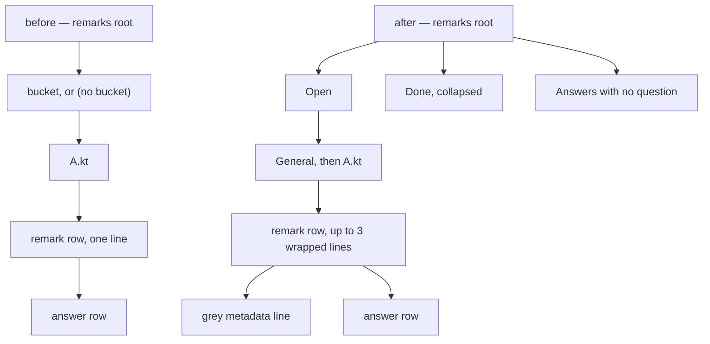

# Claude Remarks phase 13 — the tool window rebuilt

## Contents

1. [Overview](#overview)
2. [Context](#context)
3. [Development Approach](#development-approach)
4. [Testing Strategy](#testing-strategy)
5. [Progress Tracking](#progress-tracking)
6. [Solution Overview](#solution-overview)
7. [Technical Details](#technical-details)
8. [What Goes Where](#what-goes-where)
9. [Implementation Steps](#implementation-steps)
10. [Hand checks](#hand-checks)
11. [Post-Completion](#post-completion)

## Overview

Seven changes, all decided with Sasha before this plan was written. Six are the tool window; the
seventh is what a Claude Code session does when it picks a batch up.

- **Buckets go, entirely.** The stored field, the `Move to Bucket…` menu entry, the bucket level in
  the tree, and **all** of the drag-and-drop — dragging onto a bucket is the only drag there is, so
  `ui/RemarksTreeDnd.kt` goes whole and the tree reverts from `DnDAwareTree` to `Tree`.
- **The tree splits into Open and Done.** A row is Done once it is `READ` **or** it has an answer.
  One tree, two top-level groups, Done collapsed by default.
- **`RemarkState` gains `readAt`**, stamped when a remark is marked read, so Done can be ordered by
  when a row was processed rather than when it was written.
- **Inside a file, rows order by the time they last changed hands** — `createdAt` in Open, `readAt`
  in Done, and an answer sorts by `answeredAt` beneath its question.
- **Rows wrap**, to at most three lines of text, with the rest reachable.
- **The position, the `(moved)`/`(orphaned…)` suffix and an answer's file name move *below* the
  text**, as one grey metadata line, instead of sitting in front of it.
- **The trailing `read` and `published` words go.** The icon says both, and once Done exists the
  word `read` would be the third copy of one fact. Same argument phase 12 used to delete
  `asks`/`answered`.
- **A session summarises a batch before acting on it.** Read, acknowledge, then a bullet list split
  into things to change and questions to answer, *then* work. Today it reads and dives straight into
  answering.

Version goes from `0.9.0` to `0.10.0`.

## Context

- Phase 12 is merged. This plan starts from `main` at `12fc0a8`.
- ⚠️ **Phase 12 was seen running in the IDE and looked right, but only its twelve hand checks would
  confirm the details** — the light-versus-dark icon colours, the collapsed-question delete, the
  answer round trip turning a question green on the gutter. Those are still unrun, and this phase
  rewrites the same rows. If something looks wrong at the end of phase 13, phase 12 is the other
  place to look.
- **Where buckets actually live**, measured rather than guessed: `ui/RemarksTree.kt` (58 mentions),
  `ui/RemarksTreeDnd.kt` (16, the whole file), `ui/RemarkActions.kt` (12),
  `ui/RemarksToolWindowFactory.kt` (12), `store/RemarkStore.kt` (6), `store/RemarkEdits.kt` (5),
  `store/RemarkHistory.kt` (3), `model/RemarkState.kt` (2). Tests:
  `ui/RemarksTreeTest.kt` (87), `store/RemarkStoreStateTest.kt` (15), `ui/RemarksPanelTest.kt` (16),
  `store/RemarkHistoryTest.kt` (12), `store/RemarkEditsTest.kt` (11), `ui/RemarkActionsTest.kt` (2),
  `store/TestRemarks.kt` (2).
- **`render/PromptRenderer.kt` does not mention buckets at all**, so the published prompt needs no
  change. `store/RemarkHistory.kt` does — line 99 appends `— bucket <name>` to a heading.
- Patterns this follows: a look shared by the gutter and the tree lives in `ui/RemarkStatusLook.kt`;
  a pure function with no platform import gets fast tests with no fixture, which is how `anchor/` and
  `render/` are tested.

## Development Approach

- **parallel waves**: `none` — the chain is forced almost end to end. Buckets must leave the UI
  before the field is deleted, the Open/Done split needs `readAt` to order by, the renderer needs the
  wrapping function to exist, and the metadata line needs the renderer. The two that are independent,
  the trailing words and the skill summary, are small enough that a worktree each would cost more than
  it saves.
- **testing approach**: mixed, per task. The wrapping function is genuinely new logic with no platform
  dependency, so it is **test-first**. Everything else changes or deletes existing code, where a
  test-first cycle would mean writing a failing test against behaviour about to be removed.
- **⚠️ Remove readers before deleting what they read.** Phase 12 learned this: the UI stops reading
  `bucket` in task 1, and only then does task 2 delete the field. Doing it the other way leaves a task
  that cannot compile.
- **⚠️ For a deletion, the Kotlin compiler is the authority, not a grep.** Delete, run
  `./gradlew compileTestKotlin`, fix what it names.
- Complete each task fully before the next. Every task writes or updates tests as separate checklist
  items. All tests pass before the next task starts — the narrow command per task, the full suite once
  at the end.
- The rules in `.claude/rules/planning-rules.md` hold for every task, including the `--tests` filter
  trap phase 12 hit twice.

## Testing Strategy

- **Unit tests required in every task.** A test with no platform import runs in milliseconds and is
  preferred. The wrapping function is designed to be one of those — see Technical Details.
- **No e2e or UI-rendering tests exist and this phase adds none.** Whether text actually wraps, how a
  variable-height row looks, and whether the metadata line reads as subordinate are hand checks.
- ⚠️ **A `--tests` filter naming a file rather than a class matches nothing and does not fail the
  build.** Name classes. `ui/RemarkIconsTest.kt` and `review/OpenReviewFilesTest.kt` each hold two
  classes; `editor/RemarkGutterIconTest.kt` holds four with none matching the filename.
- The seven guards in `CLAUDE.md` are part of the test surface. ⚠️ Guard 3's mutator count changes in
  task 2 — see Technical Details.

## Progress Tracking

Mark completed items `[x]`. Add a discovered task with `➕`. Record a blocker with `⚠️`. Keep this file
in step with what happened, not with what was planned.

## Solution Overview

The tree shape changes twice: once by losing a level, once by gaining one.



Net depth is unchanged — a bucket level leaves, an Open/Done level arrives — so nothing about
navigation gets deeper.

The renderer is the one real rewrite. `ColoredTreeCellRenderer` is a `SimpleColoredComponent`, which
paints one line by construction, so wrapping means replacing it with a panel of stacked line
components. The platform does this in two places already and the plan copies their structure.

Order: buckets out of the UI, buckets out of the store, `readAt`, the trailing words, Open/Done, the
wrapping function, the renderer, the metadata line, the skill, verify, docs.

## Technical Details

Everything here is verified against the platform checkout at `~/dev/oss/intellij-community`, tag
`idea/2025.2.6.3`, or measured in this repository. None of it is recalled.

**Variable-height tree rows are one call.** `platform/todo/src/com/intellij/ide/todo/TodoPanel.java:251`
does `myTree.setRowHeight(0); // enable variable-height rows`. `platform/dvcs-impl/.../PushLog.java`
is the second user. That is the whole mechanism — JTree then asks each rendered component for its
preferred height.

**The stacked-line renderer already exists as a pattern.**
`platform/todo/src/com/intellij/ide/todo/MultiLineTodoRenderer.java` is
`JPanel implements TreeCellRenderer` on a `GridBagLayout`: a prefix component, then
`MAX_DISPLAYED_LINES = 10` pre-built line components each at `gridy = i` with `weightx = 1` and
`fill = HORIZONTAL`, then a "more items" label made visible when there are more lines than fit.
Unused line components are hidden with `setVisible(false)` rather than removed.

- `weightx = 1` and `fill = HORIZONTAL` are what give each line its width. **No HTML and no viewport
  width arithmetic** — which is the difficulty an earlier reading of this problem predicted and the
  platform's approach avoids entirely.
- ⚠️ **The TODO renderer never wraps.** It receives already-separate lines from
  `node.getAdditionalLines()`, because a TODO comment is multi-line in the source. **We have to break
  the text into lines ourselves.** That is the only genuinely new logic in this phase.
- `HighlightableCellRenderer` (public, `platform-api`) is what it stacks, and highlights come as
  `TextAttributes`. **Use `SimpleColoredComponent` per line instead**: it takes
  `append(text, SimpleTextAttributes)`, which is exactly what the current renderer already calls, so
  the three existing styles carry over with no translation.

**The wrapping function is pure, and that is deliberate.** Signature:

```kotlin
fun wrapToLines(text: String, maxWidth: Int, maxLines: Int, widthOf: (String) -> Int): List<String>
```

Taking a `widthOf` measurer rather than a `FontMetrics` keeps it free of AWT, so its tests need no
fixture and run in milliseconds — the same reason `anchor/` and `render/` have no platform imports.
The renderer passes `metrics::stringWidth`. Break on spaces; a single word longer than `maxWidth`
breaks mid-word rather than overflowing; the last line gets an ellipsis when text remains.

**Guard 3's count changes.** `store/RemarkEdits.kt` holds twelve mutators plus
`notifyRemarksChanged`, thirteen functions, and the guard's prose walks through how the count got
there. Deleting `setRemarkBucket` takes it to eleven mutators, twelve functions. The prose must gain
this phase's step, not just a corrected number — that history is what stops the next person mistaking
a stale count for a bug.

**`readAt` sits beside `createdAt`.** `RemarkState` already has `var createdAt by property(0L)`, so
`var readAt by property(0L)` matches. `markRemarksRead` in `store/RemarkEdits.kt` is the one place
that stamps it, and guard 6 already restricts who may call that to two files — so there is exactly one
writer by construction. An existing remark deserializes with `readAt = 0`; Done falls back to
`createdAt` when `readAt` is 0, so old data orders sensibly instead of all collapsing to the epoch.

**Processed means `READ` or answered**, and an answered question moves to Done at once. That is
Sasha's decision, taken knowing the cost: the answer is still visible, nested under its question, but
Done starts collapsed so a fresh answer is one expand away. Ordering Done by processing time is what
makes that acceptable — the thing that just arrived sits at the top.

**Orphan answers keep their own top-level group.** `"Answers with no question"` stays where phase 12
put it, above Open, rather than being folded into Done. An answer with no question is not "processed
work" — it is a loose end.

## What Goes Where

- **Implementation Steps** (`[ ]`): code, tests, the skill prose, the documentation, the version bump.
- **Hand checks** and **Post-Completion** (no checkboxes): anything needing a running IDE.

## Implementation Steps

### Task 1: Take buckets out of the tool window

Readers first, so task 2's deletion compiles. This is the larger half of the bucket removal.

**Files:**
- Delete: `src/main/kotlin/dev/sasha/clauderemarks/ui/RemarksTreeDnd.kt` (98 lines, entirely
  bucket-driven — dragging onto a bucket is the only drag in the plugin)
- Modify: `src/main/kotlin/dev/sasha/clauderemarks/ui/RemarksTree.kt` (`NO_BUCKET_LABEL`,
  `GENERAL_KEY`'s KDoc where it argues against bucket keys, `BUCKET_KEY_PREFIX`, `NO_BUCKET_KEY`,
  `RemarkNode.bucket`, the bucket grouping inside `buildTreeRoot`, `BucketDrop`, `bucketDropTarget`,
  `topLevelAncestor` if nothing else needs it, and the `order` comparator's first key)
- Modify: `src/main/kotlin/dev/sasha/clauderemarks/ui/RemarkActions.kt` (the `Move to Bucket…` entry
  in `remarkChangeActions`)
- Modify: `src/main/kotlin/dev/sasha/clauderemarks/ui/RemarksToolWindowFactory.kt` (the
  `installDragToBucket` call in `init`, the `DnDAwareTree` field and import — revert to
  `com.intellij.ui.treeStructure.Tree`)
- Modify: `src/test/kotlin/dev/sasha/clauderemarks/ui/RemarksTreeTest.kt` (87 mentions),
  `ui/RemarksPanelTest.kt` (16), `ui/RemarkActionsTest.kt` (2)

- [x] delete `RemarksTreeDnd.kt` with `git rm`, and the `installDragToBucket` call
- [x] revert the tree to `Tree`, and read `RemarksToolWindowFactory.kt:107`'s KDoc first — it argues
      why `DnDAwareTree` was chosen, and that argument dies with the drag, so the comment goes rather
      than being left to describe a choice nobody made
- [x] delete the bucket level from `buildTreeRoot`, so a file group sits directly under the root, and
      drop `bucket` from `RemarkNode` and from the `order` comparator
- [x] delete `BucketDrop` and `bucketDropTarget`, and remove `Move to Bucket…` from
      `remarkChangeActions`
- [x] update the three test classes, keeping every non-bucket case
- [x] run `./gradlew test --tests 'dev.sasha.clauderemarks.ui.RemarksTreeTest' --tests 'dev.sasha.clauderemarks.ui.RemarksPanelTest' --tests 'dev.sasha.clauderemarks.ui.RemarkActionsTest'`
      — must pass before task 2

### Task 2: Take buckets out of the store and the model

**Files:**
- Modify: `src/main/kotlin/dev/sasha/clauderemarks/model/RemarkState.kt` (`var bucket by string()` and
  its KDoc)
- Modify: `src/main/kotlin/dev/sasha/clauderemarks/store/RemarkEdits.kt` (`setRemarkBucket`, and
  guard 3's own count if the file's KDoc states it)
- Modify: `src/main/kotlin/dev/sasha/clauderemarks/store/RemarkStore.kt` (`setBucket`)
- Modify: `src/main/kotlin/dev/sasha/clauderemarks/store/RemarkHistory.kt` (line 99's
  `— bucket <name>` in the heading, and the comment above it about the bucket being the only free-form
  field)
- Modify: `CLAUDE.md` (guard 3's command is unchanged, but its prose walks through how the mutator
  count reached thirteen and must gain this step)
- Modify: `src/test/kotlin/dev/sasha/clauderemarks/store/RemarkStoreStateTest.kt` (15),
  `store/RemarkEditsTest.kt` (11), `store/RemarkHistoryTest.kt` (12), `store/TestRemarks.kt` (2)

- [x] delete the field, `setRemarkBucket` and `setBucket`, then run
      `./gradlew compileKotlin compileTestKotlin` and fix whatever the compiler names
- [x] drop the bucket from the history heading, and note in `RemarkHistory`'s KDoc that entries
      archived before this phase still carry one — the file is append-only, so old text stays
- [x] ⚠️ update guard 3's prose in `CLAUDE.md`: eleven mutators plus `notifyRemarksChanged`, twelve
      functions, and add this phase to the history the guard already records. Do not just change the
      number
- [x] write a test that a stored element carrying `<option name="bucket" value="x"/>` still
      deserializes and drops the option on the next save — the same migration phase 11 pinned for
      `tag` and `severity`, in `<option>` form and **not** attribute form
- [x] update the four store test classes
- [x] run `./gradlew test --tests 'dev.sasha.clauderemarks.store.RemarkStoreStateTest' --tests 'dev.sasha.clauderemarks.store.RemarkEditsTest' --tests 'dev.sasha.clauderemarks.store.RemarkHistoryTest'`
      and the guard 3 grep — must pass before task 3

### Task 3: Add `readAt`, stamped where a remark is marked read

**Files:**
- Modify: `src/main/kotlin/dev/sasha/clauderemarks/model/RemarkState.kt` (a `readAt` property beside
  `createdAt`)
- Modify: `src/main/kotlin/dev/sasha/clauderemarks/store/RemarkEdits.kt` (`markRemarksRead`)
- Modify: `src/test/kotlin/dev/sasha/clauderemarks/store/RemarkEditsTest.kt`

- [x] add `var readAt by property(0L)` with a KDoc saying it is 0 for a remark never read, and for
      every remark stored before this phase
- [x] stamp it in `markRemarksRead`, and say in the KDoc that guard 6 restricting that function to two
      callers is what makes this a single-writer field
- [x] write a test that marking read sets `readAt` non-zero, and that a second mark does not move an
      already-set value — re-publishing and re-acknowledging is ordinary, and Done's order should not
      jump because of it
- [x] write a test that a remark deserialized without the option has `readAt == 0`
- [x] run `./gradlew test --tests 'dev.sasha.clauderemarks.store.RemarkEditsTest' --tests 'dev.sasha.clauderemarks.store.RemarkStoreStateTest'`
      — must pass before task 4

### Task 4: Drop the trailing `read` and `published` words

**Files:**
- Modify: `src/main/kotlin/dev/sasha/clauderemarks/ui/RemarksTree.kt` (the `when (user.status)` block
  inside `RemarkTreeRenderer`'s `RemarkNode` branch that appends `  published` and `  read`)
- Modify: `src/test/kotlin/dev/sasha/clauderemarks/ui/RemarksTreeTest.kt`

- [x] delete both appends and the `when` around them
- [x] leave the gutter tooltip alone — it has no icon legend on hover, so there the words are the only
      thing carrying the state, exactly as phase 12 decided for `(asks for an answer)`
- [x] delete or rewrite any test asserting on those two words
- [x] run `./gradlew test --tests 'dev.sasha.clauderemarks.ui.RemarksTreeTest'` — must pass before
      task 5

### Task 5: Split the tree into Open and Done

**Files:**
- Modify: `src/main/kotlin/dev/sasha/clauderemarks/ui/RemarksTree.kt` (`buildTreeRoot`, new group keys
  and labels beside `ANSWERS_KEY`, and the `order` comparator)
- Modify: `src/main/kotlin/dev/sasha/clauderemarks/ui/RemarksToolWindowFactory.kt` (`expandAll`, which
  must leave Done collapsed)
- Modify: `src/test/kotlin/dev/sasha/clauderemarks/ui/RemarksTreeTest.kt`,
  `ui/RemarksPanelTest.kt`

- [x] add `OPEN_KEY`/`OPEN_LABEL` and `DONE_KEY`/`DONE_LABEL` beside the existing group constants,
      following `ANSWERS_KEY`'s own argument about why a bare word cannot collide with a file key
      — ➕ and every group *inside* a side now carries its side's key as a prefix
      (`open/general`, `done/file:src/Foo.kt`), because one file can hold rows on both sides and
      `RemarksPanel` matches groups by key alone
- [x] partition rows on processed — `status == READ` **or** the remark has an answer — and build the
      General and file groups underneath each side
- [x] order rows inside a file by the time they last changed hands: `createdAt` in Open, `readAt`
      falling back to `createdAt` in Done. An answer sorts by `answeredAt` under its question
- [x] leave `"Answers with no question"` as its own top-level group above Open, not folded into Done
- [x] make `expandAll` expand everything **except** Done, and check the interaction with
      `collapsedGroups`/`recollapse` — a person who opens Done should have it stay open across a
      refresh, which the existing key-based restore already gives if Done is a `GroupNode`
      — ⚠️ the key-based restore alone does **not** give it: `collapsedGroups` records what is shut,
      and "not shut" also covers "no such group yet", so `expandAll` takes a `keepDoneOpen` flag read
      before the rebuild
- [x] write tests: a `READ` remark is under Done; an answered question is under Done with its answer
      still nested; a `PENDING` and a `PUBLISHED` remark are under Open; Done orders by `readAt`; a
      remark with `readAt == 0` falls back to `createdAt`; an empty side produces no group
- [x] write a test that the panel leaves Done collapsed and Open expanded after a refresh
- [x] run `./gradlew test --tests 'dev.sasha.clauderemarks.ui.RemarksTreeTest' --tests 'dev.sasha.clauderemarks.ui.RemarksPanelTest'`
      — must pass before task 6

### Task 6: The pure wrapping function

**Test-first — this is the only genuinely new logic in the phase, and it needs no platform at all.**

**Files:**
- Create: `src/main/kotlin/dev/sasha/clauderemarks/ui/WrapText.kt`
- Create: `src/test/kotlin/dev/sasha/clauderemarks/ui/WrapTextTest.kt`

- [x] write the failing tests first, with a `widthOf` that returns a fixed width per character so the
      arithmetic is exact and readable: text shorter than one line stays one line; text breaking on a
      space; a run of spaces collapsing rather than starting a line; a single word longer than
      `maxWidth` breaking mid-word; text needing more than `maxLines` truncating with an ellipsis on
      the last line; empty text giving one empty line rather than none
- [x] run them and watch them fail for the right reason
- [x] implement `wrapToLines(text, maxWidth, maxLines, widthOf): List<String>`, with **no AWT import**
      — the `widthOf` parameter is what keeps this file testable in milliseconds, and its KDoc should
      say so, the way `anchor/` and `render/` do
- [x] write a test that a newline inside the text starts a new line, since a remark can be multi-line
      and the tree stops flattening it in task 7
- [x] run `./gradlew test --tests 'dev.sasha.clauderemarks.ui.WrapTextTest'` — must pass before task 7

### Task 7: Replace the cell renderer with a stacked-line panel

Read the Technical Details section before starting; the platform pattern is
`MultiLineTodoRenderer` and it is worth reading in full at
`~/dev/oss/intellij-community/platform/todo/src/com/intellij/ide/todo/MultiLineTodoRenderer.java`.

**Files:**
- Modify: `src/main/kotlin/dev/sasha/clauderemarks/ui/RemarksTree.kt` (`RemarkTreeRenderer` —
  replaced, not edited)
- Modify: `src/main/kotlin/dev/sasha/clauderemarks/ui/RemarksToolWindowFactory.kt` (`setRowHeight(0)`
  beside the other tree setup, and stop flattening newlines in `remarkNode` if that is where it lives)
- Modify: `src/test/kotlin/dev/sasha/clauderemarks/ui/RemarksTreeTest.kt`

- [x] build the renderer as `JPanel(GridBagLayout()) implements TreeCellRenderer`, holding **three**
      pre-built `SimpleColoredComponent` line rows at `gridy = 0..2`, each `weightx = 1` and
      `fill = HORIZONTAL`, hiding unused rows with `setVisible(false)` rather than removing them
- [x] keep the icon on the first line only, and keep all three existing text styles through
      `append(text, SimpleTextAttributes)` — grey, regular, bold — since `SimpleColoredComponent` is
      what the old renderer already was
      — ➕ each line is also set `isOpaque = false`, because `SimpleColoredComponent`'s own
      constructor makes itself opaque and would paint the plain tree background over the selection
      band the panel draws
- [x] carry selection painting over by hand: each line component takes `selected`, and the panel's
      background follows `UIUtil.getTreeSelectionBackground(selected)`. ⚠️ Verify that method's exact
      name and signature against the checkout before using it — do not recall it
      — ⚠️ verified, and the plan's call as written is wrong: the method is
      `getTreeSelectionBackground(boolean focused)`, whose argument is whether the **tree** has focus,
      not whether the row is selected. The renderer calls it as
      `if (selected) UIUtil.getTreeSelectionBackground(tree.hasFocus()) else UIUtil.getTreeBackground()`,
      and each line takes `UIUtil.getTreeForeground(selected, focused)`
- [x] add `tree.setRowHeight(0)` and confirm from the platform source that this is what enables
      variable heights, citing `TodoPanel.java:251` in the comment
- [x] stop flattening `\n` out of remark text, since rows are multi-line now, and delete the comment
      explaining the flattening
- [x] write tests for what is testable without painting: the renderer produces three visible line
      components for text needing three, one for short text, and the group and answer rows still carry
      their own styles
      — ➕ they live in a new `ui/RemarkTreeRendererTest.kt`, not in `RemarksTreeTest.kt` as the Files
      list assumed: they need a fixture and `RemarksTreeTest` is plain JUnit, and a second class added
      to that file would be silently skipped by the `--tests` filter below
- [x] run `./gradlew test --tests 'dev.sasha.clauderemarks.ui.RemarksTreeTest'` — must pass before
      task 8
      — ➕ run with `--tests 'dev.sasha.clauderemarks.ui.RemarkTreeRendererTest'` beside it, and
      `RemarksPanelTest` too since `setRowHeight(0)` changed that file: 53 + 13 + 31, all green

### Task 8: Move the position and the file name below the text

**Files:**
- Modify: `src/main/kotlin/dev/sasha/clauderemarks/ui/RemarksTree.kt` (the renderer from task 7 gains
  a metadata row; `RemarkNode` and `AnswerNode` keep their fields, only the placement changes)
- Modify: `src/test/kotlin/dev/sasha/clauderemarks/ui/RemarksTreeTest.kt`

- [ ] add a fourth `gridy` row to the renderer for metadata, in
      `SimpleTextAttributes.GRAYED_ATTRIBUTES`
- [ ] move the position and its `(moved)`/`(orphaned…)` suffix there for a remark row, and the
      position plus the file name for an answer row in the orphan group
- [ ] hide the metadata row when there is nothing to put in it — a general remark has no position
- [ ] ⚠️ the three-line cap now means three lines **of text**, plus one metadata line. Say so in the
      renderer's KDoc, or the next reader will think the cap is four
- [ ] write a test that a general remark produces no metadata row and a positioned remark does
- [ ] run `./gradlew test --tests 'dev.sasha.clauderemarks.ui.RemarksTreeTest'` — must pass before
      task 9

### Task 9: The skill summarises a batch before acting on it

No Kotlin. `./gradlew test` covers none of this.

**Files:**
- Modify: `docs/skill/claude-remarks/SKILL.md` (the `## Read remarks the person already published`
  mode, after the acknowledgement and before the act step; and the `## Listen for the next batch`
  mode, which reports each batch as it arrives)

- [ ] add the summarise step **after** the acknowledgement POST and before any work. Acknowledging
      first is the existing rule and it stays: a lost response should cost one retry, not a batch
- [ ] specify the shape — a bullet list **split into two groups**, things to change and questions to
      answer, because the published prompt already marks a question `— asks for an answer` and phase 11
      made that distinction real. One flat list makes the reader hunt for the questions
- [ ] each bullet names the file and line range and says the remark in the person's own words, not a
      paraphrase that could quietly drop a condition
- [ ] say what the summary is **for**, so a session does not treat it as ceremony: it is the person's
      chance to catch a misread before work happens
- [ ] make the same change in listen mode's per-batch report, so both modes behave the same
- [ ] read the file top to bottom afterwards and confirm no mode still says to act immediately after
      reading

### Task 10: Verify acceptance criteria

- [ ] verify every Overview item against the code, one at a time
- [ ] run the full suite with **no** `--tests` filter: `./gradlew test`
- [ ] run `./gradlew build`, `verifyPluginProjectConfiguration`, and `verifyPlugin`
- [ ] run all seven guards from `CLAUDE.md`, each individually, and confirm every one is empty —
      guard 3's prose should now say twelve functions
- [ ] confirm no source or test file still mentions a bucket, a `BucketDrop`, or `DnDAwareTree`
- [ ] confirm `ui/WrapText.kt` has no `java.awt` or `com.intellij` import

### Task 11: Update the documentation and the version

**Files:**
- Modify: `build.gradle.kts` (`version = "0.9.0"`)
- Modify: `CLAUDE.md` (a phase 13 paragraph; the phase 5 and phase 9 paragraphs, which describe
  buckets and drag-and-drop as present; the project-structure block, which loses
  `ui/RemarksTreeDnd.kt` and gains `ui/WrapText.kt`; guard 3 if task 2 left anything; the Testing
  block)
- Modify: `docs/claude/design.md` (buckets and the drag design out; the Open/Done split, the wrapping
  design and the metadata line in)
- Modify: `README.md` (buckets out of "What it does" and "Working with it"; the row layout; the icon
  legend if the trailing words were part of it)
- Modify: `docs/ideas.md` (the phase 9 group four entry describes a `Published` group left unbuilt —
  Open/Done supersedes that idea and it should say so rather than sitting as an open suggestion)

- [ ] bump to `0.10.0`
- [ ] add a phase 13 paragraph and rewrite every earlier paragraph that presents buckets or
      drag-and-drop as current, rather than leaving them to contradict it
- [ ] write the wrapping design into `docs/claude/design.md` in enough detail that a future session
      does not re-derive it: `setRowHeight(0)`, the stacked `SimpleColoredComponent` rows, the pure
      `wrapToLines` and why it takes a `widthOf` rather than a `FontMetrics`, and that the platform's
      own `MultiLineTodoRenderer` never wraps so the word-break is ours
- [ ] write the Open/Done rules down, including that an answered question moves to Done at once and
      why that was accepted — the answer stays nested and Done orders newest-processed first
- [ ] update `README.md`, and ⚠️ note that `docs/images/remarks.png` predates phase 12 **and** this
      phase, so it now shows neither the icons nor the row layout. Flag it for a fresh capture rather
      than describing what it does not show
- [ ] mark the superseded `Published` group idea in `docs/ideas.md` as built differently
- [ ] move this plan to `docs/plans/completed/`

## Hand checks

Nothing here is reachable by `./gradlew test`.

1. A long remark wraps to three lines and the fourth is elided, not clipped.
2. The metadata line sits **below** the text, in grey, and reads as subordinate to it.
3. A general remark shows no metadata line and no empty gap where one would be.
4. A multi-line remark written with Shift+Enter keeps its own line breaks.
5. Selection paints correctly across all lines of a multi-line row, not just the first.
6. Done starts collapsed; opening it survives a refresh.
7. A remark moves from Open to Done when an agent acknowledges it, without the tree jumping.
8. An answered question is under Done with its answer still nested beneath it.
9. Done is ordered newest-processed first, and remarks read before this phase (with `readAt == 0`)
   order by when they were written rather than all collapsing together.
10. No drag is possible anywhere in the tree, and nothing looks like it invites one.
11. The right-click menu offers Ask for an Answer and Publish, and no Move to Bucket…
12. A session picking up a batch prints the two-group bullet summary before doing any work.
13. Carried from phase 12 and still unrun: the three question-mark colours in a light **and** a dark
    theme, and an answer arriving turning its question green on the gutter as well as in the tree.

*Added while task 7 was built. All four are about the stacked-line renderer, and none is reachable by
a test.*

14. ⚠️ **Widening or narrowing the tool window does not re-wrap rows already on screen.** The wrap
    width is read once per render, and `setRowHeight(0)` makes JTree cache each row's height, so
    nothing asks the renderer again until the tree is rebuilt. Pressing Refresh, or writing any
    remark, rebuilds it and the rows re-wrap. Check how bad this looks in practice before deciding
    whether it needs fixing — the fix is a resize listener calling
    `TreeUtil.invalidateCacheAndRepaint(tree.ui)`, which was deliberately left out: it is
    `@ApiStatus.Experimental`, and adding a third reason for `build.gradle.kts` to subtract
    `EXPERIMENTAL_API_USAGES` is not something to do on the way past.
15. The icon sits inside the first line component, so the second and third lines start at the panel's
    left edge — under the icon, not aligned with the first line's text. Check whether that reads as a
    hanging indent or as ragged. The platform's own `MultiLineTodoRenderer` puts the icon in a
    separate `gridx = 0` component instead, which aligns every line; that is the change to make if
    this looks wrong.
16. The grey position in front of the text narrows **all three** lines, not just the one it is drawn
    on, because `wrapToLines` takes a single width. Task 8 moves the position onto its own row below
    the text, which removes this entirely — so check it only if task 8 is not done yet.
17. A remark whose text is one word longer than the tree is wide breaks mid-word rather than
    overflowing. Check that the break looks deliberate and not like a truncation.

## Post-Completion

*No checkboxes: these need something outside this repository.*

- Install the `0.10.0` zip. Installing restarts the IDE and mints a fresh token.
- A fresh `docs/images/remarks.png`, once the rows look right. Two phases of icon and layout work have
  passed since it was taken.
- ⚠️ **Nothing needs a watcher restart this time.** The skill directory does not move in this phase, so
  a running watcher keeps working. Check anyway with the rule from phase 12: for each `.watch` file
  under `~/.claude-remarks`, read the pid on line 1, check it is alive, and check its command line
  names the same watched path — never by process name.
- Still open, deliberately: the skill is not in the plugin zip, so a colleague installing the artifact
  gets no skill. `docs/ideas.md`'s "A button that installs the skill into every detected harness" is
  the design, and its first paragraph is still the blocker. That is its own phase.
