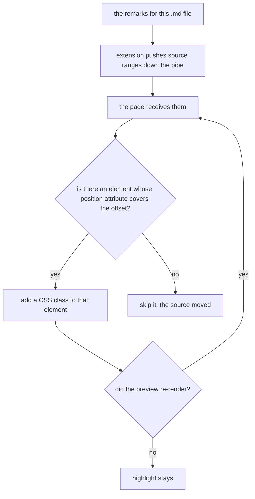

# Claude Remarks phase 14 — the preview gets the other half, and the watcher stops needing a babysitter

## Contents

1. [Overview](#overview)
2. [Context](#context)
3. [Development Approach](#development-approach)
4. [Testing Strategy](#testing-strategy)
5. [Progress Tracking](#progress-tracking)
6. [Solution Overview](#solution-overview)
7. [Technical Details](#technical-details)
8. [What Goes Where](#what-goes-where)
9. [Implementation Steps](#implementation-steps)
10. [Hand checks](#hand-checks)
11. [Post-Completion](#post-completion)

## Overview

Three changes, all raised by Sasha on 2026-08-06 while phase 13 was running. The first two are in
IntelliJ's rendered markdown preview. The third is in the skill, and touches no Kotlin at all.

- **Ask Claude works in the preview.** Today the preview's right-click menu offers `Add Claude Remark`
  and nothing else, so a question can only be asked from the source. An `AskClaudePreviewAction` sits
  beside it and differs by two lines — the same way `AskClaudeAction` differs from `AddRemarkAction` in
  the editor.
- **Annotated text is highlighted in the preview**, at **element granularity**: the paragraph, list
  item or heading a remark points at gets a background, not the exact words. Sasha accepted element
  granularity explicitly, knowing character-exact is not reliably achievable — see Technical Details
  for why.
- **The watcher stops needing a session to keep it alive.** Today every batch costs two shell round
  trips before any work starts — the claim, then the re-arm — and the session has to type the right
  `--seen` nonce back into each launch line. Getting that nonce wrong makes a session read a batch it
  has already dealt with, which is what Sasha hit on 6 August. The watcher gains a streaming mode, it
  keeps its own seen nonce, and it claims the batch itself. See `docs/ideas.md`, "The watcher should
  not need a session to keep it alive", for the full argument.

Version goes from `0.10.0` to `0.11.0`, assuming phase 13 lands first.

## Context

- **This phase depends on phase 13 being merged.** Phase 13 rewrites the tree renderer and deletes
  buckets; nothing here touches those files, but the version bump and `CLAUDE.md` sweep assume 13's
  are already in.
- **The expensive half already exists.** Phase 9's group five built the whole browser bridge:
  `preview/PreviewRemarkExtension.kt` (the `MarkdownBrowserPreviewExtension`, its `Provider` and its
  `ResourceProvider`), `preview/PreviewSelection.kt` (the pure range arithmetic),
  `preview/PreviewSelectionService.kt` (the last selection), the injected
  `claude-remarks-preview.js`, and `action/AddPreviewRemarkAction.kt`.
- ⚠️ **None of phase 9's group five has ever been seen running.** Whether the menu item appears in a
  live preview, whether a real browser selection reaches Kotlin as the right range, and whether the
  plugin still loads with the markdown plugin disabled are all still owed as hand checks, listed in
  section 12 of `docs/plans/completed/20260803-claude-remarks-phase9.md`. **This phase builds on code
  that has never run.** If something here does not work, that is the first place to look, and the hand
  checks below deliberately re-cover it.
- **The watcher half is skill-side only** — `docs/skill/claude-remarks/watch-remarks.sh` and
  `SKILL.md`. No Kotlin, no plugin change, and `./gradlew test` reaches none of it. It shares nothing
  with the preview half except the version bump and the documentation sweep at the end. It has to
  come after phase 13's task 9, which rewrote the same listen-mode section; that task is already
  committed, so the constraint is satisfied.
- The markdown plugin is an **optional** dependency. Everything preview-related lives in
  `src/main/resources/META-INF/claude-remarks-markdown.xml`, which is skipped whole when the markdown
  plugin is off. ⚠️ Nothing from this phase may leak into `plugin.xml`: an unknown class or group id
  there stops the whole plugin loading, with no dialog and no visible error — the only symptom is the
  tool window simply not being there.

## Development Approach

- **parallel waves**: `none`. Tasks 1 to 4 are a chain: the plugin cannot push ranges before it can
  compute them, and the page cannot highlight before it is being pushed to. Tasks 5 to 7 share no file
  with them and could in principle run beside them, but they are a chain of their own — the script
  changes, then the script claims, then the document describes what the script now does — so marking
  a wave would buy one slot and risk two agents editing `SKILL.md` and `watch-remarks.sh` at once.
- **testing approach**: the pure parts are test-first. `preview/PreviewSelection.kt` is already
  fixture-free and its new sibling logic must stay that way — deciding *which* element a source offset
  belongs to is arithmetic, and it gets fast tests with no platform.
- ⚠️ **Nothing in the page can be tested by `./gradlew test`.** The JavaScript, the CSS and whether a
  highlight actually appears are hand checks. Keep as much logic as possible on the Kotlin side, where
  it can be tested, and keep the page dumb.
- The rules in `.claude/rules/planning-rules.md` hold for every task.

## Testing Strategy

- **Unit tests required in every task that touches Kotlin.** Prefer fixture-free.
- **The JS is not unit-tested** — this repository has no JS test setup and this phase does not add one.
  It is covered by hand checks, and by keeping the script small enough to read.
- ⚠️ A `--tests` filter naming a file rather than a class matches nothing and does not fail the build.
  Name classes.
- The seven guards in `CLAUDE.md` are part of the test surface. None of them should be affected by this
  phase; confirm rather than assume.

## Solution Overview

The bridge already carries messages one way — the page tells the IDE what was selected. This phase
makes it carry messages the other way too.



The re-render loop is the part that is easy to get wrong: the markdown plugin rebuilds the page as you
type, and a highlight applied once is gone on the next keystroke.

## Technical Details

Verified against the platform checkout at `~/dev/oss/intellij-community`, tag `idea/2025.2.6.3`, and
against this repository. None of it is recalled.

**The pipe is bidirectional.**
`plugins/markdown/core/src/org/intellij/plugins/markdown/ui/preview/BrowserPipe.kt` declares
`fun send(type: String, data: String)` alongside `subscribe` and `removeSubscription`. The plugin
already calls `subscribe`; `send` is the direction this phase adds. On the page side the script
already calls `window.__IntelliJTools.messagePipe.post(type, message)` to go up, so the matching
`subscribe` is what it needs to receive.

**The position attribute's name is not hardcoded, and must not be.** The injected script reads it from
the page itself:

```js
const meta = document.querySelector('meta[name="markdown-position-attribute-name"]');
const positionAttributeName = meta.content;
```

That indirection is already there and the highlight code reuses the same value.

**⚠️ Element granularity is a decision forced by the data, not a shortcut.** `md-src-pos` is written on
every tag the markdown generator opens, and it holds an offset range **in the source**. Inside an
element the rendered text is not the source text — a remark on `**bold**` covers eight source
characters and four rendered ones — so a source offset cannot be turned into a character position in
the DOM by arithmetic. Phase 9 solved the opposite direction by *searching for the highlighted text*
inside the coarse range, which works because the browser hands over the exact string. Going the other
way there is no such string to search with, only offsets. Hence: highlight the innermost element whose
range covers the remark's start offset, and accept that the whole element lights up.

**Which element, when several nest.** A paragraph inside a list item inside a list all carry ranges
that contain the offset. The **innermost** one is the right answer, and the page finds it by taking the
deepest matching element — the last one in document order whose range contains the offset, since the
generator opens outer tags first.

**The re-render problem, and where to solve it.** The markdown plugin rebuilds the preview DOM on
document change. Two ways to keep the highlight alive:

- a `MutationObserver` in the page that re-applies after each rebuild, or
- the plugin re-pushing on every document change.

Prefer the observer. It keeps the state in the page, needs no extra plugin-side listener, and does not
put a document listener on the EDT path for something cosmetic. The plugin still pushes on open and on
`REMARKS_CHANGED`; the observer only re-applies what it was last given.

**`MarkdownBrowserPreviewExtension` declares `scripts`, and the extension already overrides it.**
⚠️ Whether it also declares `styles` is **not verified** — check the interface in
`plugins/markdown/core/src/.../MarkdownBrowserPreviewExtension.kt` before writing task 4. If it does,
serve a stylesheet the same way the script is served, through the same `ResourceProvider` with a second
name in `canProvide`. If it does not, the script injects a `<style>` element itself, which is uglier
but works.

**Two highlight styles, not one.** A remark and an unanswered question should look different — the tree
and the gutter both distinguish them, and the preview would be the only surface that does not. Reuse
the icon track's meaning rather than inventing new colours: something neutral for a plain remark,
something warmer for a question still waiting. ⚠️ Keep both subtle. A heavily annotated document with
strong backgrounds is unreadable, which would make the feature worse than nothing.

## What Goes Where

- **Implementation Steps** (`[ ]`): the action, the Kotlin push, the page script, the styling, tests,
  docs.
- **Hand checks** and **Post-Completion** (no checkboxes): everything about whether it actually renders,
  which no automated test in this repository can reach.

## Implementation Steps

### Task 1: Ask Claude from the preview's right-click menu

Independent of everything else in this phase. Two lines of real difference from the action beside it.

**Files:**
- Create: `src/main/kotlin/dev/sasha/clauderemarks/action/AskClaudePreviewAction.kt`
- Modify: `src/main/resources/META-INF/claude-remarks-markdown.xml` (a second `<action>` in
  `Markdown.PreviewGroup`, beside `ClaudeRemarks.AddPreviewRemark`)
- Modify: `src/test/kotlin/dev/sasha/clauderemarks/action/PreviewRemarkProblemTest.kt` if the shared
  refusal logic moves

- [x] read `action/AddPreviewRemarkAction.kt` whole first — it already does the selection lookup, the
      `previewRemarkProblem` check, the `fileTargetProblem` check and the refusal dialog, and this
      action must reuse every one of them rather than restating any
- [x] add the action: same body, then `addRemark(..., asksForAnswer = true)` and `publishRemarks` on
      every question still open, exactly as `action/AskClaudeAction.kt` does for the editor
- [x] register it in `claude-remarks-markdown.xml` only. ⚠️ Never in `plugin.xml` — an id from the
      markdown plugin there stops this plugin loading entirely when markdown is disabled
- [x] factor the shared body out rather than copying it, if the two actions end up more than a few
      lines apart. `AddRemarkAction`/`AskClaudeAction` in the editor are the precedent for how much
      duplication is acceptable here
- [x] write a test for whatever pure part comes out of the factoring; if nothing pure comes out, say so
      in the progress log rather than adding a test that asserts nothing
- [x] run the narrow test command for the classes touched

### Task 2: Work out which remarks the preview should highlight

Pure Kotlin, fixture-free, test-first. This is the arithmetic half.

**Files:**
- Create: `src/main/kotlin/dev/sasha/clauderemarks/preview/PreviewHighlights.kt`
- Create: `src/test/kotlin/dev/sasha/clauderemarks/preview/PreviewHighlightsTest.kt`

- [x] write the failing tests first: a data type carrying what the page needs per remark — the source
      start offset and whether it is an unanswered question — and a pure function turning resolved
      remarks into a list of them
- [x] decide and pin what is excluded: an orphaned remark (its code could not be found, so its offsets
      mean nothing), a remark about no file, and a remark for a different file than the one previewed
- [x] keep it free of `com.intellij` imports if at all possible, taking whatever it needs as plain
      parameters — the same argument `preview/PreviewSelection.kt` and `anchor/` already make, and the
      reason their tests run in milliseconds
- [x] serialize to JSON by hand or with the platform's Gson, whichever keeps the file
      platform-free; a list of `{offset, kind}` is small enough that hand-writing it is reasonable
- [x] run the narrow test command

### Task 3: Push the highlights down the pipe

**Files:**
- Modify: `src/main/kotlin/dev/sasha/clauderemarks/preview/PreviewRemarkExtension.kt` (a second message
  type, a `browserPipe.send` call, and a `REMARKS_CHANGED` subscription)

- [ ] add a second message type constant beside `SELECTION_MESSAGE_TYPE`, named after this plugin the
      same way, and say in its KDoc that this one travels **down** while the other travels up
- [ ] push once when the extension is created, so a preview opened on an already-annotated file is
      highlighted without waiting for a change
- [ ] subscribe to `REMARKS_CHANGED` and push again on every change, and ⚠️ unsubscribe in `dispose`
      beside the existing `removeSubscription` — a preview is created and destroyed often, and a
      listener that outlives its panel is a leak that only shows up after an hour of editing
- [ ] resolve the remarks off the EDT if resolving touches a `Document`, following the
      `ReadAction.nonBlocking` pattern the tool window and the gutter already use
- [ ] write a fixture-backed test that the extension pushes on creation and on a remark change, if the
      pipe can be faked; if it cannot, say so in the progress log and cover it by hand check instead

### Task 4: Receive and apply the highlight in the page

No Kotlin logic. ⚠️ Nothing here is reachable by `./gradlew test`.

**Files:**
- Modify: `src/main/resources/dev/sasha/clauderemarks/preview/claude-remarks-preview.js`
- Create: `src/main/resources/dev/sasha/clauderemarks/preview/claude-remarks-preview.css` (only if the
  extension interface supports a stylesheet — see below)
- Modify: `src/main/kotlin/dev/sasha/clauderemarks/preview/PreviewRemarkExtension.kt` (`canProvide` and
  `loadResource` for the stylesheet, and `styles` if it exists)

- [ ] ⚠️ **First, verify whether `MarkdownBrowserPreviewExtension` declares a `styles` list**, in
      `~/dev/oss/intellij-community/plugins/markdown/core/src/`. The plan does not know. If it does,
      serve the CSS as a second resource; if it does not, have the script insert a `<style>` element
      and say in a comment which it was and why
- [ ] subscribe in the page to the new message type, reusing the existing
      `window.__IntelliJTools.messagePipe` the script already uses to post
- [ ] for each pushed offset, find the **innermost** element whose position attribute range contains
      it — the last match in document order, since the generator opens outer tags first — and add a
      class to it
- [ ] use two classes, one for a plain remark and one for an unanswered question, and keep both
      subtle. A left border or a faint background, not a strong fill: a heavily annotated document with
      loud highlights is worse than no highlight at all
- [ ] re-apply after a re-render with a `MutationObserver`, remembering the last pushed list. The
      preview rebuilds its DOM as the source is typed, and a highlight applied once is gone on the next
      keystroke — this is the thing most likely to look broken
- [ ] make an offset that matches no element a silent skip, not an error: the source moved, and that is
      ordinary
- [ ] read the whole script afterwards and confirm it still does only what its header comment claims

### Task 5: The watcher keeps its own seen nonce and can stream

Skill-side only. No Kotlin, and `./gradlew test` reaches none of it. Read `docs/ideas.md`, "The
watcher should not need a session to keep it alive", before starting.

**Files:**
- Modify: `docs/skill/claude-remarks/watch-remarks.sh` (the header comment at the top of the file, the
  argument parse around `--seen`, and both poll loops — the `--file` one and the `--fetch` one)

- [ ] add `--stream`. Without it the script behaves exactly as it does today — report one batch, exit
      0 — because every other caller of this script depends on that. With it, report the batch and
      keep polling
- [ ] in stream mode print **one short line per batch and nothing else**: the nonce, and in `--file`
      mode the path. ⚠️ Never the batch body. The harness turns each printed line into a notification,
      a large batch is a lot of lines, and a monitor producing too many events is stopped
      automatically
- [ ] after reporting a batch, set the script's own seen nonce to the one just reported, so the next
      poll compares against it. **This is the point of the task.** Today that state lives in the
      calling session, which has to type the right nonce back into every launch line, and `SKILL.md`
      already records what happens when it gets that wrong: "arming with a stale nonce makes the
      watcher exit 0 within a second on a batch that was already handled ... That has happened twice
      in one day"
- [ ] reset the deadline on every batch in stream mode, so a person who keeps publishing keeps their
      watcher
- [ ] ⚠️ rewrite the comment at the top of the file. It says today that "every path out of this script
      ... is an explicit exit, and none of them loop back". Stream mode is exactly that exception, so
      the comment has to say which shape applies when, or the next reader reads the loop as a bug
- [ ] keep `--owner` working in stream mode. An orphan that streams forever is worse than one that
      exits at its deadline, and the comment block around `--owner` already explains why orphans
      matter here
- [ ] ⚠️ verify by hand **in the scratchpad with `HOME` pointed at a temporary directory**, never
      against the real `~/.claude-remarks`: write a fake published file, change its nonce twice, and
      confirm two lines come out of one process and that an unchanged file produces no third line.
      Paste the transcript into the progress log — there is no automated test for this script

### Task 6: The watcher claims the batch itself

**Files:**
- Modify: `docs/skill/claude-remarks/watch-remarks.sh` (a claim branch beside the report, reusing the
  `printf | curl --config -` shape the `--fetch` loop already contains)
- Modify: `docs/skill/README.md` (the sentence saying this script "never sends `published-read` at
  all", which this task makes untrue)

- [ ] add `--claim <base_url>` and `--session <id>`. When both are given, POST `published-read` for a
      new batch **before** printing it, and put the outcome word on the same line as the nonce: `ok`,
      `already-read <session>`, or `unknown-batch`
- [ ] take the token from `CLAUDE_REMARKS_TOKEN` in the environment and pass it with
      `printf 'header = "X-Claude-Remarks-Token: %s"\n' "$token" | curl --config -`, exactly as the
      `--fetch` branch does. ⚠️ Never in argv, never echoed
- [ ] ⚠️ a claim that fails must not swallow the batch. On any non-2xx, print the http code **and the
      nonce anyway**, so the session still learns a batch arrived. Losing a batch to a failed claim is
      worse than claiming twice
- [ ] without `--claim` the script sends nothing, exactly as today. Both new flags are opt-in
- [ ] fix the line in `docs/skill/README.md` that says this script never sends `published-read`
- [ ] hand-verify what can be verified without a running IDE: the argument parse, and a run against a
      URL that refuses the connection, confirming the failure path still prints the nonce. Say in the
      progress log which parts could only be checked by reading

### Task 7: Listen mode uses the stream, and keeps the old path for other agents

**Files:**
- Modify: `docs/skill/claude-remarks/SKILL.md` (the `## Listen for the next batch` mode: its starting
  block, its "when the watcher exits" list, and the re-arm step inside that list)

- [ ] split the mode into two branches and say in one line at the top which applies: a harness with a
      `Monitor` tool arms **one persistent monitor** and never re-arms; every other agent keeps
      today's exit-per-batch loop, unchanged
- [ ] in the Monitor branch, delete the re-arm step and every mention of passing `--seen`. Say plainly
      that the watcher owns that state now, and why: it is what stops a session re-reading a batch it
      already dealt with
- [ ] in the Monitor branch the claim is the watcher's too — the line the monitor prints already
      carries `ok` / `already-read` / `unknown-batch`, so the session acts on that word instead of
      making a `published-read` call of its own. The three meanings do not change; only who sends the
      request does
- [ ] ⚠️ keep the summarise step exactly as phase 13's task 9 wrote it, in **both** branches, and keep
      the wait for go
- [ ] say what the two branches share and where they differ in one place, so a reader does not have to
      compare them line by line
- [ ] read the whole mode top to bottom afterwards and confirm no sentence still tells a session to
      re-arm a watcher it never armed

### Task 8: Verify acceptance criteria

- [ ] run the full suite with **no** `--tests` filter: `./gradlew test`
- [ ] run `./gradlew build`, `verifyPluginProjectConfiguration`, and `verifyPlugin`
- [ ] run all seven guards from `CLAUDE.md` individually and confirm every one is empty
- [ ] confirm `preview/PreviewHighlights.kt` has no `com.intellij` import, or record why it needed one
- [ ] ⚠️ confirm nothing from this phase was registered in `plugin.xml` — every preview id belongs in
      `claude-remarks-markdown.xml`
- [ ] run `sh -n docs/skill/claude-remarks/watch-remarks.sh` and confirm it parses, and confirm the
      script still exits 0 on one batch when `--stream` is absent — the fallback path every non-Claude
      Code agent still uses
- [ ] ⚠️ confirm no command anywhere in this phase puts the IDE token in argv:
      `grep -n 'X-Claude-Remarks-Token' docs/skill/claude-remarks/*.sh docs/skill/claude-remarks/SKILL.md`
      should show only the `printf … | curl --config -` shape

### Task 9: Update the documentation and the version

**Files:**
- Modify: `build.gradle.kts`, `CLAUDE.md`, `docs/claude/design.md`, `README.md`, `docs/ideas.md`

- [ ] bump to `0.11.0`
- [ ] add a phase 14 paragraph to `CLAUDE.md` and extend the project-structure block with the new files
- [ ] write the watcher's new shape into `CLAUDE.md` beside the paragraph that describes the script
      today: that it can stream, that it owns its own seen nonce, and that it can claim. ⚠️ The rule
      that a watcher is only ever stopped by the pid on line 1 of its own `.watch` file does not
      change and must survive the rewrite
- [ ] mark the `docs/ideas.md` entry "The watcher should not need a session to keep it alive" as built,
      with a one-line pointer to what actually shipped — the same way every other built entry in that
      file opens
- [ ] write into `docs/claude/design.md` the one thing a future session must not re-derive: **why the
      highlight is element-granular** — that `md-src-pos` holds source offsets, that rendered text is
      not source text, and that phase 9's search-for-the-string trick only works in the DOM→source
      direction because the browser supplies the string
- [ ] document the re-render problem and the `MutationObserver` answer, so nobody removes it as
      redundant
- [ ] update `README.md`'s preview section to say both actions exist and that annotated elements are
      highlighted
- [ ] move this plan to `docs/plans/completed/`

## Hand checks

Nothing here is reachable by `./gradlew test`, and ⚠️ **several of these are phase 9's outstanding
checks, deliberately re-listed** — this phase builds on code that has never run.

1. The preview's right-click menu offers **both** `Add Claude Remark` and `Ask Claude`.
2. A real browser selection reaches Kotlin as the right character range (phase 9, still unrun).
3. The plugin still loads cleanly with the markdown plugin **disabled** (phase 9, still unrun) — and
   the tool window is present, which is the symptom that goes missing when this breaks.
4. A remark written from the preview highlights its element immediately.
5. Opening a preview on an already-annotated file highlights without any edit.
6. ⚠️ Typing in the source does not lose the highlight — this is the `MutationObserver` check and the
   most likely thing to be subtly wrong.
7. A question looks different from a plain remark, and both are readable rather than loud.
8. A remark on text inside a list item highlights the list item, not the whole list.
9. A remark whose source moved highlights nothing and logs nothing.
10. A heavily annotated document is still comfortable to read.
11. ⚠️ **The same batch is never reported twice.** Publish once, let the session handle it, then wait
    without publishing anything: no second notification arrives. This is the failure the whole watcher
    half exists to remove, and it is the one worth checking first.
12. A batch published while the session is still answering the previous one still arrives, and arrives
    once.
13. The old exit-per-batch path still works when the stream is not used — run the launch line without
    `--stream` and confirm it behaves exactly as it did before this phase.
14. A watcher whose claim fails (stop the IDE, then publish by hand into the file) still reports the
    batch, with the http code beside it.

## Post-Completion

*No checkboxes: these need something outside this repository.*

- Install the `0.11.0` zip.
- Still open and deliberately not in this phase: the skill is not in the plugin zip, so a colleague
  installing the artifact gets no skill. `docs/ideas.md`'s "A button that installs the skill into every
  detected harness" is the design and its first paragraph is still the blocker. That is its own phase,
  and it is the one that matters for sharing this with anyone else.
- ⚠️ **Character-exact highlighting is deliberately not attempted, and should stay that way** unless
  something changes about what the markdown generator emits. The reason is in `docs/claude/design.md`
  after task 9: source offsets cannot be mapped into rendered text without a string to search for, and
  going source→DOM there is no such string.
- ⚠️ **`Monitor` is Claude Code's own tool.** The streaming path only exists in that harness, which is
  why the exit-per-batch path stays in the document rather than being replaced. If the skill is ever
  run from another agent, that is the path it takes, and it must keep working.
