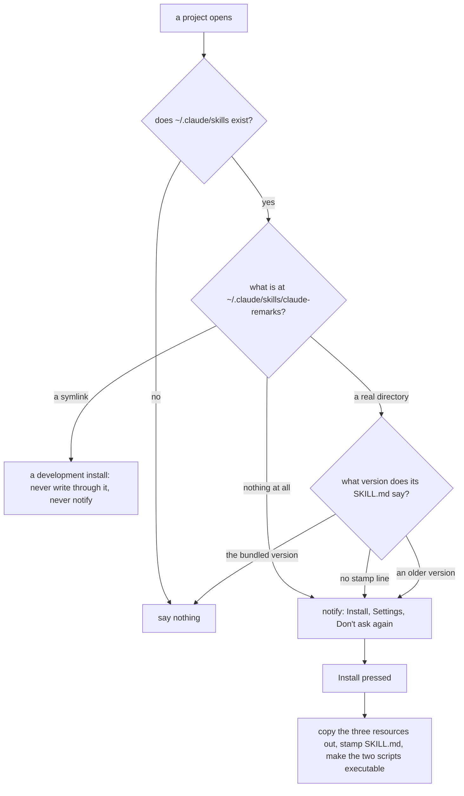

# Claude Remarks phase 15 — the skill ships inside the plugin and installs itself

## Contents

1. [Overview](#overview)
2. [Context](#context)
3. [Development Approach](#development-approach)
4. [Testing Strategy](#testing-strategy)
5. [Progress Tracking](#progress-tracking)
6. [Solution Overview](#solution-overview)
7. [Technical Details](#technical-details)
8. [What Goes Where](#what-goes-where)
9. [Implementation Steps](#implementation-steps)
10. [Hand checks](#hand-checks)
11. [Post-Completion](#post-completion)

## Overview

Today the skill is installed by hand. Somebody who installs the plugin zip gets no skill at all,
because `docs/skill/` never reaches the artifact. This phase closes that.

Two pieces, and the first one is the blocker the second one needs:

- **The three skill files become plugin resources.** `SKILL.md` (96 KB), `watch-remarks.sh` (35 KB)
  and `remote-config.sh` (8.7 KB) move under `src/main/resources/`, the way
  `intentionDescriptions/` and the preview's script already live there. **One copy, never two.** Two
  copies would drift, and the drift would be invisible inside 96 KB of prose.
- **The plugin installs the skill into Claude Code.** A row on the existing Tools settings page lists
  every harness found on the machine, shows the installed version against the bundled one, and has an
  install button. A dismissible notification on project open says the same thing when the skill is
  missing or out of date.

The design is `docs/ideas.md`, the entry "A button that installs the skill into every detected
harness" at line 829. It is already argued there. This plan follows it and does not re-derive it.

**Two decisions are already made and are not open here.**

1. **A notification plus a settings row**, not one or the other.
2. **Claude Code only for installing.** The write goes to `~/.claude/skills/claude-remarks`. Codex and
   Gemini are **detected and listed as found, with no install button**, so the gap is visible instead
   of silent. ⚠️ Their layouts are deliberately **not** guessed. Each tool's own documentation has to
   be read before anything is written for it, and reading those two conventions is out of scope here.
   It is its own later piece of work. A guessed path writes a file nobody reads, and nothing about
   that failure is visible.

Version goes from `0.11.0` to `0.12.0`.

## Context

- `main` is at `b6084b4`, working tree clean, version `0.11.0`. Phase 14 is merged.
- **The three files exist once today**, in `docs/skill/claude-remarks/`. Confirmed by
  `find src/main/resources -type f`: no skill file is in the artifact.
- ⚠️ **Sasha's development symlink points at the old location and will dangle.**
  `~/.claude/skills/claude-remarks -> /Users/sasha/dev/claude-remarks/docs/skill/claude-remarks`,
  confirmed with `ls -l ~/.claude/skills`. Moving the files breaks it. Recreating it is a hand step
  and it is in Post-Completion.
- ⚠️ **`SKILL.md` resolves its own directory and one of its three candidates is the old path.** The
  block appears twice: `docs/skill/claude-remarks/SKILL.md:485-499` (listen mode's copy) and
  `:1196-1211` (the shared one). The third candidate is `$PWD/docs/skill/claude-remarks` at lines 489
  and 1200. After the move that candidate finds nothing in a checkout. Task 1 repoints it.
- **Both harness directories that cannot be installed into really exist on this machine**: `~/.codex`
  and `~/.gemini`, both confirmed. So the "found, not installable" row is not hypothetical.
- **Prior art, checked.** `jbcontext search -p src/main "copy a bundled resource file out to the user
  home directory"` found no existing resource-copy helper — the top hits are `ReviewHandshake.kt`,
  `PromptPayload.kt` and `AtomicWrite.kt`, none of which reads a resource out to disk. So this is new
  code, but it reuses two things rather than inventing them: `review/AtomicWrite.kt`'s
  `atomicWriteString` for the write, and `store/RemarkHistory.kt`'s argument for writing outside the
  project at all.
- **The settings page already exists.** `settings/RemarkSettingsConfigurable.kt` is a
  `BoundConfigurable` registered under Tools in `plugin.xml:39`. This is a row on a page, not a new
  surface.
- **The notification group already exists.** `plugin.xml:43` registers `Claude Remarks`, and
  `action/PublishRemarks.kt:35` holds the constant, `:286` the `notifyRemarks` helper.

## Development Approach

- **parallel waves**: `none`. Task 1 has to land before task 2, because the install reads resources
  that do not exist until task 1 moves them. Tasks 3 and 4 both call what task 2 builds. Tasks 3 and 4
  touch different files and could run beside each other, but both also add a field or a call the other
  reads, so one slot is not worth two agents editing settings code at once.
- **testing approach**: test-first for the pure half. The stamp, the stamp reader, the harness
  detection and the copy are all plain `java.nio` and plain strings, so they get fast tests with no
  fixture. That is the same argument `anchor/` and `preview/PreviewHighlights.kt` already make.
- ⚠️ **A lot of this phase cannot be reached by `./gradlew test`**: whether a real Claude Code session
  finds the installed skill, whether the notification appears, and whether the copied scripts run.
  Those are hand checks. Keep as much decision-making as possible in the pure functions where a test
  can hold it.
- The rules in `.claude/rules/planning-rules.md` hold for every task.

## Testing Strategy

- **Unit tests in every task that touches Kotlin.** Prefer fixture-free.
- **The three resources get a resolution test**, modelled exactly on `ui/RemarkIconsTest.kt`. A
  resource path with no file behind it is not a compile error; it is a silent runtime miss. The test
  must ask production for the path rather than writing a copy of it, the same reason
  `RemarkIconsTest` gives.
- ⚠️ **Every filesystem test writes into a temporary directory it made itself.** Never into the real
  `~/.claude`. The rule in `.claude/rules/planning-rules.md` covers this and it applies with full
  force here, because this phase's whole subject is writing into a person's home directory.
- ⚠️ A `--tests` filter naming a file rather than a class matches nothing and does not fail the build.
  Name classes.
- The seven guards in `CLAUDE.md` are part of the test surface. Guard 4 is the only one whose scope
  changes, because it greps all of `src/` with no `--include`, and this phase puts a 35 KB shell
  script there. Checked ahead of time: the guard 4 pattern finds nothing in any of the three skill
  files today, so the move does not trip it. Confirm rather than assume.

## Progress Tracking

Mark completed items `[x]`. Add a discovered task with `➕`. Record a blocker with `⚠️`. Keep this file
in step with what happened, not with what was planned.

## Solution Overview



The settings row asks the same three questions and shows the answer instead of notifying. The button
runs the same copy.

## Technical Details

Verified against this repository and against the platform jars at
`~/.gradle/caches/9.1.0/transforms/*/transformed/ideaIC-2025.2-aarch64/lib/`. None of it is recalled.

### Where the three files sit

`src/main/resources/dev/sasha/clauderemarks/skill/`, holding `SKILL.md`, `watch-remarks.sh` and
`remote-config.sh` directly. That matches the two package-shaped resource directories the plugin
already has: `dev/sasha/clauderemarks/icons/` and `dev/sasha/clauderemarks/preview/`. Not the
resources root, where a bare `SKILL.md` would sit beside `META-INF/` and read as plugin metadata.

**Nothing enumerates the directory.** Listing jar entries through a classloader is not something to
rely on, so the three names live in one constant, `SKILL_FILES`. ⚠️ Adding a fourth file later means
editing that list, and forgetting is silent — the file simply does not get installed and nothing
reports it. Say so in the constant's KDoc.

### The executable bit, which is the thing most likely to be forgotten

⚠️ **A resource read out of a jar carries no permission bits.** `SKILL.md`'s own directory-resolution
block tests `[ -x "$candidate/watch-remarks.sh" ]`, at lines 487-492 and 1198-1203. So a copied script
that is not executable makes the installed skill answer "watch-remarks.sh was not found" — the most
confusing possible symptom, because the file is right there.

After the write, call `File.setExecutable(true, true)` on both scripts and check the returned boolean.
Not `Files.setPosixFilePermissions`, which throws `UnsupportedOperationException` on a filesystem with
no POSIX view. If the call returns false, the install reports a failure sentence instead of success.

### The version stamp

The installed `SKILL.md` gets one line inserted, as **line 2**, right after the opening `---`:

```
# claude-remarks-plugin-version: 0.12.0
```

**Why a YAML comment and not a frontmatter key.** The frontmatter keys are a contract owned by Claude
Code. An unknown key there is a change to somebody else's contract and could collide with a key that
tool adds later. A comment cannot collide with anything.

⚠️ **Why line 2 specifically, and not anywhere else in the frontmatter.** `description:` is a `>`
block scalar. A line starting with `#` **inside** a block scalar is content, not a comment, so a stamp
placed after `description:` would end up as text inside the skill's own description. Line 2 is before
any scalar starts.

**Reading it back gives three answers, not two.** Read at most the first five lines of the installed
`SKILL.md`:

- a line matching `^#\s*claude-remarks-plugin-version:\s*(\S+)` → that version string;
- the file is readable and no such line is in the first five → **installed, version unknown**. This is
  the ordinary case for a copy somebody installed by hand before this phase, and for the development
  symlink target, which carries no stamp because the stamp is written at install time;
- the file is missing or cannot be read → **not installed**.

Never throw, and never guess a version. An unparsable line reads the same as no line: unknown.

### Refusing to write through a symlink

⚠️ **This is the trap the development symlink creates.** If `~/.claude/skills/claude-remarks` is a
symlink, writing into it writes into whatever it points at — for Sasha, the checkout's own
`src/main/resources/dev/sasha/clauderemarks/skill/`. The plugin would then overwrite its own source
files with stamped copies, and the person would find a dirty working tree they never edited.

So: check `Files.isSymbolicLink(dir)` before writing anything. If it is a symlink, refuse with a
sentence saying it looks like a development install and has to be removed first. The notification does
not fire at all in this case — a checkout is not a broken install.

### Copy, never symlink, and the reason goes in the code

An installed plugin lives under a versioned path. A symlink into it dies on the next plugin update and
leaves a skill entry that points at nothing. The development symlink is right for a checkout and wrong
for an install, and the two being opposite is exactly why the reason has to be written in the KDoc of
the install function rather than left in this plan.

### Where the bundled version comes from

`PluginManager.getPluginByClass(SkillInstall::class.java)?.version`. Verified with `javap` against
`lib/app.jar`: `PluginManager.getPluginByClass(Class<?>)` returns `PluginDescriptor`, and
`PluginDescriptor.getVersion()` returns `String`. Reading it through the class avoids repeating the
plugin id as a literal.

⚠️ In a unit-test fixture this can be null. So the install function **takes the version as a
parameter** and the null case is decided once, at the one call site, rather than inside the pure code.

### Detection, and the one directory that is created

- `~/.claude/skills` exists → Claude Code, installable.
- `~/.codex` exists → found, not installable.
- `~/.gemini` exists → found, not installable.

**A harness directory is never created.** Creating one would be the plugin guessing that a tool is
wanted. The one directory that *is* created is `~/.claude/skills/claude-remarks` itself, inside a
directory that already exists — that is the install, not a guess.

### Threading

- `createPanel()` runs on the EDT. Detection reads the filesystem, so it runs on
  `AppExecutorUtil.getAppExecutorService()` and fills the row's labels back through `invokeLater`.
- ⚠️ **No `ReadAction` anywhere in this phase.** Nothing here touches PSI, a `Document` or the VFS. It
  is plain `java.nio`, the same as `store/RemarkHistory.kt`. Do not copy the
  `ReadAction.nonBlocking { … }.finishOnUiThread(…)` shape by reflex from the publish pipeline — a
  read action here buys nothing and says something untrue about what the code touches.
- The button click arrives on the EDT. The copy goes to the pooled executor and the result comes back
  with `invokeLater`.
- `ProjectActivity.execute` is a suspend function already off the EDT, so the check there runs inline.
  Only the notification itself needs no hop.

### Reporting the result

The settings row updates its own status label. No balloon and no dialog: the configurable is
application level and has no `Project` to notify. The notification's own Install action does have a
project, so it reports through `notifyRemarks` in `action/PublishRemarks.kt:286`, which is `internal`
and therefore reachable from another package in the same module.

### The persisted "Don't ask again"

A new boolean on `RemarkSettings.SettingsState`, `var skillInstallPromptDismissed by property(false)`.

⚠️ **`RemarkSettings` roams through JetBrains Settings Sync**, deliberately, as its KDoc explains. So
pressing Don't ask again on one machine also silences the notification on the other machine, where the
skill may well not be installed. That is accepted: the settings row still shows the state and still
installs there. It is written down here so nobody reads it later as a bug.

Beside it, an in-memory application-level flag so the balloon is shown **at most once per IDE run**.
Without it, opening three projects shows three balloons.

### What this does not cover

The button only reaches this machine. For a Claude Code session on the other end of an SSH tunnel the
skill has to exist over there, and nothing here can put it there. The settings page says so in one
comment line rather than pretending otherwise.

## What Goes Where

- **Implementation Steps** (`[ ]`): the move, the pure install half, the settings row, the
  notification, verification, documentation.
- **Hand checks** and **Post-Completion** (no checkboxes): everything that needs a real IDE, a real
  Claude Code session, or a step Sasha has to do on his own machine.

## Implementation Steps

### Task 1: The three skill files become plugin resources

The move, and every reference that the move makes wrong. Nothing else in the phase can start until
this lands, because task 2 reads resources that do not exist yet.

⚠️ **Move with `git mv`, one copy only.** Do not copy and leave the originals. Two copies of a 96 KB
prose file drift silently, which is the whole reason this is one directory and not two.

**Files:**
- Move: `docs/skill/claude-remarks/SKILL.md` → `src/main/resources/dev/sasha/clauderemarks/skill/SKILL.md`
- Move: `docs/skill/claude-remarks/watch-remarks.sh` → `src/main/resources/dev/sasha/clauderemarks/skill/watch-remarks.sh`
- Move: `docs/skill/claude-remarks/remote-config.sh` → `src/main/resources/dev/sasha/clauderemarks/skill/remote-config.sh`
- Modify: `src/main/resources/dev/sasha/clauderemarks/skill/SKILL.md` (the third candidate at line 489
  and the error text at 494-496 in listen mode's resolution block; the third candidate at line 1200
  and the error text at 1205-1208 in the shared block under "Where the two scripts are, and how to
  name them")
- Modify: `docs/skill/README.md` (the two install commands at lines 7 and 13, and the opening
  paragraph that says the directory is installed by hand)
- Modify: `README.md` (lines 275-281, the same two commands)
- Modify: `.claude/rules/planning-rules.md` (line 59, which names
  `docs/skill/claude-remarks*/watch-remarks.sh`)
- Create: `src/test/kotlin/dev/sasha/clauderemarks/skill/SkillResourceTest.kt`

- [x] `git mv` the three files into `src/main/resources/dev/sasha/clauderemarks/skill/`. Confirm with
      `git status` that each is recorded as a rename, not as a delete plus an add
- [x] ⚠️ confirm the two shell scripts kept their executable bit in the checkout:
      `ls -l src/main/resources/dev/sasha/clauderemarks/skill/`. `git mv` preserves it; a copy through
      an editor does not
- [x] repoint the **third** candidate in **both** copies of the directory-resolution block to
      `$PWD/src/main/resources/dev/sasha/clauderemarks/skill`, and rewrite the two error messages that
      name the old path. The first two candidates — `$HOME/.claude/skills/claude-remarks` and
      `$PWD/.claude/skills/claude-remarks` — do not change: they are where an installed skill lives,
      and that is unaffected
- [x] the third candidate keeps its purpose, which is running the skill straight out of a checkout.
      Say that in the comment above the block, because the new path reads like an implementation
      detail rather than a place a person would look
- [x] write `SkillResourceTest`: assert all three resources resolve on the classpath and are not
      empty, asking production for the path rather than writing a copy of it. Model it on
      `ui/RemarkIconsTest.kt` and quote its argument in the KDoc — a resource path with no file behind
      it fails only at runtime. ⚠️ Production's path constant does not exist yet in this task, so
      either add the constant here in a small `skill/SkillInstall.kt` stub that task 2 grows, or write
      this test as the first item of task 2 instead. Pick one and say which in the progress log
- [x] rewrite `docs/skill/README.md`'s opening: the skill is now inside the plugin, the ordinary way
      to install it is the settings button, and the two hand commands stay as the fallback with their
      new source path. Everything below about the five protocol pairs is unaffected and stays
- [x] update `README.md`'s install section the same way
- [x] fix the path in `.claude/rules/planning-rules.md`, which every execution agent reads
- [x] `grep -rn "docs/skill/claude-remarks" --include='*.md' --include='*.kt' --include='*.kts' . | grep -v docs/plans/`
      and confirm every remaining hit is either historical narrative in `CLAUDE.md`, `CHANGELOG.md` or
      `docs/claude/design.md` — those are records of what happened and task 6 handles them — or gone
- [x] `sh -n src/main/resources/dev/sasha/clauderemarks/skill/watch-remarks.sh` still parses
- [x] narrow test: `./gradlew test --tests 'dev.sasha.clauderemarks.skill.SkillResourceTest'`

### Task 2: The pure half — detect, stamp, read the stamp back, copy

Test-first. Plain `java.nio` and plain strings, no `com.intellij` import if it can be avoided.

**Files:**
- Create: `src/main/kotlin/dev/sasha/clauderemarks/skill/SkillInstall.kt`
- Create: `src/test/kotlin/dev/sasha/clauderemarks/skill/SkillInstallTest.kt`

- [x] write the failing tests first, into a temporary directory the test makes itself. ⚠️ Never touch
      the real `~/.claude` — the rule in `.claude/rules/planning-rules.md` applies to this task more
      than to any other in the repository
- [x] `SKILL_FILES`: the three names in one constant, with a KDoc saying that nothing enumerates the
      directory and that a fourth file added later has to be added here or it is silently not
      installed
- [x] `stampVersion(text, version)`: inserts `# claude-remarks-plugin-version: <version>` after the
      first line when the first line is `---`, and as a new first line otherwise. Pin both branches
- [x] ⚠️ pin the reason for line 2 in a test: stamping must not put the line after `description:`,
      because `description:` is a `>` block scalar and a `#` line inside one is content rather than a
      comment. A test that reads the stamped file's `description` back and finds no version string in
      it is what stops somebody "tidying" the insertion point later
- [x] `stampedVersionOf(text)`: scans at most the first five lines, returns the version or null.
      Cover three cases — a stamped file, an unstamped file, and a file whose stamp line is malformed.
      All three must return an answer; none may throw
- [x] `detectHarnesses(home)`: returns one record per existing directory, each carrying its display
      name, whether it is installable, and where the skill would go. ⚠️ Never create a harness
      directory. Test with a fake home holding each combination of the three
- [x] `skillPresence(dir)`: three answers — missing, a symlink, or present with an optional version.
      The symlink answer is its own case and not folded into "present", because the two lead to
      opposite behaviour
- [x] `installSkill(targetDir, version, readResource)`: returns null on success or a sentence
      describing the problem. Same shape and same naming as `remarkTargetProblem` and
      `fileTargetProblem` in `store/RemarkTarget.kt`, which already return a sentence or null
- [x] the resource reader is a **parameter**, not a call inside this file. That is what keeps the file
      free of the classloader and lets a test feed fake contents. The one real call site passes
      `SkillInstall::class.java.getResourceAsStream("/dev/sasha/clauderemarks/skill/$name")`
- [x] reuse `atomicWriteString` from `review/AtomicWrite.kt` for all three writes rather than writing a
      second write helper. It creates the parent directory and renames a temp file from the same
      directory, so a reader never sees a half-written `SKILL.md`
- [x] ⚠️ after the write, `File.setExecutable(true, true)` on both scripts, and turn a false return
      into a failure sentence. Not `Files.setPosixFilePermissions`, which throws on a filesystem with
      no POSIX view. Pin this with a test that reads the permission back
- [x] ⚠️ refuse when the target directory or any of the three target files is a symlink, with a
      sentence naming the development symlink. Pin it with a test that makes a symlink and asserts
      that nothing at the far end changed. **This is the check that stops the plugin overwriting its
      own source files in a checkout**
- [x] write the copy-never-symlink argument into the install function's KDoc: an installed plugin
      lives under a versioned path, so a symlink into it dies on the next update and leaves a skill
      entry pointing at nothing, while the development symlink is right for a checkout — the two are
      opposite on purpose
- [x] narrow test: `./gradlew test --tests 'dev.sasha.clauderemarks.skill.SkillInstallTest'`

### Task 3: The settings row

**Files:**
- Modify: `src/main/kotlin/dev/sasha/clauderemarks/settings/RemarkSettingsConfigurable.kt`
  (`createPanel`, a new group of rows below the existing prompt-header rows)
- Create: `src/test/kotlin/dev/sasha/clauderemarks/skill/SkillRowTextTest.kt` (only for whatever pure
  text-building comes out of it)

- [x] one row per detected harness: its name, what is installed, and — for Claude Code only — a
      button. The row's text carries the version comparison, so it reads as
      "0.11.0 installed, 0.12.0 bundled", "up to date", "not installed", or "installed, version
      unknown"
- [x] the button says **Install** when nothing is there and **Reinstall** otherwise. Two labels, not
      three: the row's own text already says whether it is out of date, so a third label would repeat
      it. Reinstall stays enabled when the copy is up to date, because a person who edited the
      installed copy needs a way back
- [x] Codex and Gemini get a row saying found, and a sentence saying the plugin cannot install into
      them yet because their layouts have not been read from their own documentation. ⚠️ No button and
      no guessed path
- [x] when no harness is found at all, one line saying so rather than an empty area
- [x] build the row text with a pure function so it can be tested, and put the test in
      `SkillRowTextTest`. If nothing pure comes out of it, say so in the progress log rather than
      adding a test that asserts nothing
- [x] ⚠️ detection reads the filesystem and `createPanel` runs on the EDT. Run it on
      `AppExecutorUtil.getAppExecutorService()` and fill the labels back with `invokeLater`. **No
      `ReadAction`** — nothing here touches PSI, a `Document` or the VFS
- [x] the button click runs the copy on the pooled executor too, then updates the row's status label
      on the EDT. No dialog and no balloon: this configurable is application level and has no project
- [x] one comment line under the rows saying the button only reaches this machine, and that a Claude
      Code session on the other side of an SSH tunnel needs the skill installed over there as well
- [x] narrow test: `./gradlew test --tests 'dev.sasha.clauderemarks.skill.SkillRowTextTest'`

### Task 4: The notification on project open

**Files:**
- Modify: `src/main/kotlin/dev/sasha/clauderemarks/settings/RemarkSettings.kt` (a
  `skillInstallPromptDismissed` property on `SettingsState`, and a read/write pair beside
  `promptHeader`)
- Create: `src/main/kotlin/dev/sasha/clauderemarks/skill/SkillInstallNotification.kt`
- Modify: `src/main/kotlin/dev/sasha/clauderemarks/editor/RemarkGutterStartup.kt` (a third call in
  `execute`, beside `RemarkGutter` and `ReviewHandshakeService`)
- Modify: `src/test/kotlin/dev/sasha/clauderemarks/settings/RemarkSettingsTest.kt` (a round-trip case
  for the new flag)

- [x] add the persisted flag with `by property(false)`, the same form every other boolean in this
      repository uses. ⚠️ `BaseState` stores it as an `<option name= value=/>` child element, so the
      round-trip test has to be written in `<option>` form — `CLAUDE.md`'s phase 11 paragraph explains
      why attribute form makes such a test pass against anything
- [x] ⚠️ write into the property's KDoc that `RemarkSettings` roams through Settings Sync, so
      dismissing on one machine also dismisses on the other, and that the settings row is still the
      way to install there. This is a real cost, accepted deliberately, and it must not read later as
      an oversight
- [x] decide when to fire, and put the decision in a pure function so it is testable: fire only when
      Claude Code is detected, **and** the installed copy is missing or unstamped or a different
      version, **and** the flag is false, **and** nothing was shown yet in this IDE run
- [x] ⚠️ **never fire when the target is a symlink.** A development checkout is not a broken install,
      and the install would be refused anyway. This is the single rule most likely to be dropped in a
      later rewrite, so give it its own line in the KDoc
- [x] an in-memory application-level flag makes it at most one balloon per IDE run. Without it,
      opening three projects shows three balloons
- [x] three actions: **Install**, **Settings**, **Don't ask again**. Install runs the same copy on the
      pooled executor and reports through `notifyRemarks`. Settings opens this plugin's page through
      `ShowSettingsUtil` — verified present in `lib/app.jar` with both a `Class<T>` overload and a
      name overload; pick one and confirm it lands on the Claude Remarks page rather than the Tools
      root. Don't ask again sets the persisted flag and expires the notification
- [x] hook it into `RemarkGutterStartup.execute`, which is already the plugin's one `ProjectActivity`.
      It is a suspend function running off the EDT, so the filesystem check runs inline with no hop
- [x] test the pure "should it fire" function across every combination: not detected, dismissed,
      symlink, up to date, out of date, unstamped, missing
- [x] narrow test:
      `./gradlew test --tests 'dev.sasha.clauderemarks.settings.RemarkSettingsTest' --tests 'dev.sasha.clauderemarks.skill.*'`

### Task 5: Verify acceptance criteria

- [x] run the full suite with **no** `--tests` filter: `./gradlew test`. Record the total and the
      change from phase 14's 656. Result: `BUILD SUCCESSFUL`. Summed straight from the XML reports
      under `build/test-results/test/` (60 files, since a console line and a file-named `--tests`
      filter can both lie): **708 tests, 0 failures, 0 errors, 0 skipped**. Phase 14 ended at 666 (the
      number this repository's own testing rules cite, not the 656 this checkbox names) — 708 is 666
      plus 42, in the "roughly forty" band the orchestrator's briefing predicted for the five new test
      classes this phase added
- [x] run `./gradlew build`, `verifyPluginProjectConfiguration` and `verifyPlugin`. All three
      `BUILD SUCCESSFUL`. `verifyPlugin`: `Plugin dev.sasha.clauderemarks:0.11.0 against
      IC-252.28539.97: Compatible. 7 usages of experimental API` — the same 7 pre-existing
      `MarkdownHtmlPanel`/`JBHtmlPane` usages `build.gradle.kts` already subtracts via
      `EXPERIMENTAL_API_USAGES`, nothing new from this phase's own code
- [x] run all seven guards from `CLAUDE.md` individually and confirm every one is empty. ⚠️ Guard 4 is
      the one whose scope changed: it greps all of `src/` with no `--include`, and a 35 KB shell
      script now lives there. It was checked against the three files before this plan was written and
      found nothing — confirm it again after the move. Result: **all seven ran individually and every
      one came back empty**, guard 4 included, confirming the pre-move check still holds after the
      files actually moved into `src/`
- [x] ⚠️ **confirm the three skill files are actually in the artifact.** Build the zip and list it:
      `./gradlew buildPlugin` then `unzip -l build/distributions/*.zip | grep -i skill`. The whole
      phase exists because `claude-remarks-0.3.0.zip` contained no skill file at all, so this check is
      the acceptance criterion, not a formality. Result: the top-level zip only lists
      `claude-remarks/lib/claude-remarks-0.11.0.jar` (resources are compiled into the plugin's own
      jar, not left loose in the zip), so the real check is one level deeper — `unzip -l` on that jar
      after extracting it:
      ```
      96306  dev/sasha/clauderemarks/skill/SKILL.md
       8653  dev/sasha/clauderemarks/skill/remote-config.sh
      34821  dev/sasha/clauderemarks/skill/watch-remarks.sh
      ```
      All three sizes match the files on disk exactly. The phase's one job is done
- [x] install into a temporary fake home from a test or a scratchpad script, then run
      `sh -n` on both copied scripts and confirm both are executable there. This is the closest an
      automated check can get to the real install. Result: a scratchpad script copied the three real
      resource files (not fake content) into `$FAKE_HOME/.claude/skills/claude-remarks`, well away
      from the real `~/.claude`, `chmod +x` on the two scripts the way `installSkill` does with
      `File.setExecutable(true, true)`. `sh -n` parsed both cleanly and `[ -x ... ]` confirmed both
      executable. `SkillInstallTest`'s own fixture-free tests already pin the same install mechanics
      with fake content; this is the same shape run once against the real bytes
- [x] confirm `skill/SkillInstall.kt` has no `com.intellij` import, or record in the progress log why
      it needed one. Confirmed: its only imports are `dev.sasha.clauderemarks.review.atomicWriteString`,
      `java.io.IOException`, `java.io.InputStream`, `java.nio.file.Files` and `java.nio.file.Path` —
      no `com.intellij` import at all

### Task 6: Update the documentation and the version

**Files:**
- Modify: `build.gradle.kts` (the `version` line), `CLAUDE.md` (a phase 15 paragraph and the project
  structure block), `docs/claude/design.md` (a new section), `README.md`, `CHANGELOG.md`,
  `docs/ideas.md` (the entry at line 829)

- [x] bump to `0.12.0` in `build.gradle.kts`, then run `./gradlew verifyPluginProjectConfiguration` —
      this repository's documented check after a build-file change. Result: `BUILD SUCCESSFUL`
- [x] add a phase 15 paragraph to `CLAUDE.md` after phase 14's, and update the project structure block:
      the three files' new home, `skill/SkillInstall.kt`, `skill/SkillInstallNotification.kt`, the
      changed `RemarkGutterStartup.kt` and `RemarkSettings.kt` entries. Also added
      `skill/SkillRowText.kt`, `skill/BundledSkillVersion.kt` and the settings configurable's own row
      group, which the phase built too
- [x] ⚠️ `CLAUDE.md` names the old skill path in several places (lines 168, 189, 288, 293, 1298, 1329
      among them) and `docs/claude/design.md` in four (1441, 2179, 2231, 2732). Update the ones that
      state where the files *are*. Leave the ones that are historical narrative about a past phase and
      say plainly in the phase 15 paragraph that the directory moved, so an old sentence is readable
      as history rather than as a wrong path. Done: all six `CLAUDE.md` hits and all four `design.md`
      hits updated; phase 12's rename sentence (`CLAUDE.md:420`) left as history, and a ⚠️ line near
      the top of `CLAUDE.md` now says the directory moved and that an old path below is history
- [x] write a section in `docs/claude/design.md` covering the four things a future session must not
      re-derive: why the skill is a resource in exactly one copy, why the install copies rather than
      symlinks while development does the opposite, where the version stamp goes and why line 2, and
      why an install into a symlink is refused. Written as "Shipping the Skill Inside the Plugin",
      section 18, between the endpoint section and the Ask Claude gesture, with the executable bit,
      detection, the two surfaces and the threading rule beside the four
- [x] mark the `docs/ideas.md` entry "A button that installs the skill into every detected harness" as
      built, the same way every other built entry in that file opens, and record what came out
      differently: Claude Code only, Codex and Gemini listed but not installable, and the symlink
      refusal that the entry did not foresee. Opened as
      "⚠️ **Built in phase 15, for Claude Code only. This idea is not closed.**"
- [x] ⚠️ leave the "Still open" bullets of that entry alone except to note that reading the Codex and
      Gemini conventions from their own documentation is now the named next piece of work. Added as a
      first bullet; the two existing bullets are untouched
- [x] update `README.md`'s install section and its Status paragraph
- [x] add a `0.12.0` entry to `CHANGELOG.md` in the same shape as `0.11.0`'s, and correct the opening
      line's phase count. `CHANGELOG.md` was not in this task's Files block; the count went from
      "fourteen phases over five days" to "fifteen phases over six days"
- [x] leave this plan in `docs/plans/`. The harness moves it to `completed/` after the phase finishes,
      and moving it here breaks the review, finalize and stats phases that read this path. Nothing was
      moved

## Hand checks

Nothing here is reachable by `./gradlew test`.

1. Install the `0.12.0` zip in a real IDE. The plugin loads and the tool window is there.
2. ⚠️ **Remove the development symlink first** (see Post-Completion), then open a project: the
   notification appears, naming the bundled version.
3. Press Install in the notification. `~/.claude/skills/claude-remarks/` appears with three files.
4. `ls -l` that directory: both `.sh` files are executable. This is the check that catches the
   permission bit, and its failure looks like a missing file rather than a permission problem.
5. `head -3 ~/.claude/skills/claude-remarks/SKILL.md`: line 1 is `---`, line 2 is the stamp with the
   right version.
6. ⚠️ **A real Claude Code session finds and runs the installed skill.** Ask it to read published
   remarks; the skill's own directory-resolution block must resolve to
   `~/.claude/skills/claude-remarks` and the launch line it prints must run. This is the check the
   whole phase is for.
7. Open Settings → Tools → Claude Remarks: the row says "up to date" against the version just
   installed.
8. Codex and Gemini are both listed as found, with no button, and the sentence explaining why.
9. Put the development symlink back, restart, open a project: **no notification**, and the settings row
   says it is a symlink. Press the button: it refuses with a sentence, and `git status` in the
   checkout is still clean. ⚠️ Check `git status`, not just the message — a refusal that still wrote
   is exactly the failure this check exists for.
10. Press Don't ask again, restart, open a project: no notification. The settings row still works.
11. Delete the stamp line by hand from an installed `SKILL.md`, restart: the notification appears and
    the settings row says the version is unknown.
12. Corrupt the stamp line into something unparsable: same answer as no stamp, and no exception in the
    IDE log.
13. Open three projects in one IDE run: at most one balloon.
14. Uninstall the plugin: the installed skill stays. Nothing deletes files from a person's home.

## Post-Completion

*No checkboxes: these need something outside this repository.*

- ⚠️ **Recreate the development symlink by hand.** It points at a directory this phase deletes:

  ```sh
  rm ~/.claude/skills/claude-remarks
  ln -s /Users/sasha/dev/claude-remarks/src/main/resources/dev/sasha/clauderemarks/skill \
        ~/.claude/skills/claude-remarks
  ```

  Until this is done, every Claude Code session on this machine has a dangling skill entry. This is
  the same hand step phase 12's rename created, for the same reason.
- Install the `0.12.0` zip.
- **Reading the Codex and Gemini conventions is the named next piece of work.** Each tool's layout has
  to come from that tool's own documentation. Both directories exist on this machine, so the rows are
  already there and the gap is visible — which was the point of listing them.
- ⚠️ **A project-level install (`.claude/skills/` inside the repository) is deliberately not offered.**
  It would put the skill into version control, which is right for a shared team skill and wrong by
  default for this plugin. `docs/ideas.md` records it as still open and it should stay open.
- If the notification turns out to be noisy in real use, the settings row alone still covers the whole
  feature. Cutting the notification later costs one file and one persisted flag.
