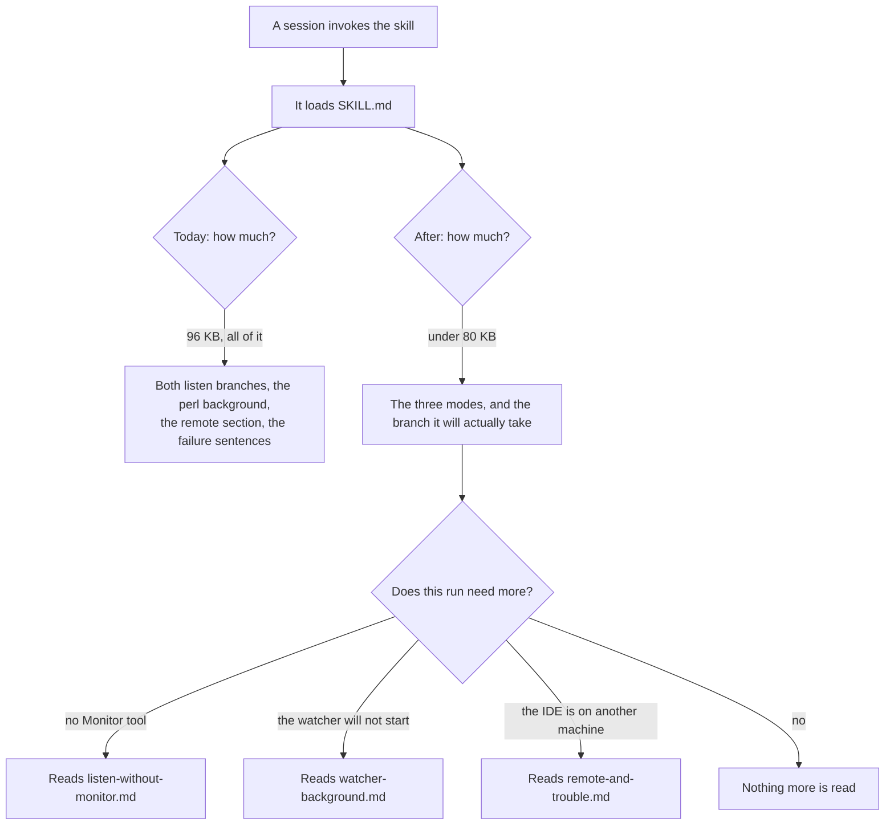

# Slim SKILL.md by moving material into files read on demand

## Contents

1. [Overview](#overview)
2. [Context from discovery](#context-from-discovery)
3. [What gets moved, and where](#what-gets-moved-and-where)
4. [Development approach](#development-approach)
5. [Testing strategy](#testing-strategy)
6. [Progress tracking](#progress-tracking)
7. [Implementation steps](#implementation-steps)
8. [Post-completion](#post-completion)

## Overview

`SKILL.md` is 96,306 bytes over 1478 lines. A session that invokes the skill loads all of it, which
is roughly 24,000 tokens, before it does any work. Much of what it loads it can never use.

The goal is to cut what a session loads by moving whole sections into separate files that are read
only when the session actually needs them. **Nothing is deleted for being long.** Every section that
moves keeps its words; only its address changes.

The target is `SKILL.md` under 80,000 bytes with no loss of content, and every moved section reachable
by one clear sentence telling the session when to go and read it. (This target was written as 60,000
and corrected to 80,000 once tasks 1-3 had landed — see the first item of task 4 for why the original
number could not be reached without deleting content.)

Two things make this worth doing rather than tidy:

- **A Claude Code session pays for a branch it can never take.** Listen mode is written twice, once
  for harnesses that have a `Monitor` tool and once for harnesses that do not. Claude Code always
  takes the first. It reads the second every time and cannot use a word of it.
- **Background belongs behind a door.** The longest single sub-section in the file explains why the
  `perl … setsid()` launch line is not the same as `( nohup … & )`. That is worth keeping and it is
  not worth reading before every batch.

Here is what a session loads today, and what it would load after.

The picture cannot say two things, so they are here:

- The saving is per session, not per install. All the files ship in the plugin either way, and the
  install writes all of them.
- ⚠️ The reference files are read by the session **through the ordinary Read tool**, so each one has
  to name its own subject in its first lines. A file that opens mid-argument is unreadable out of
  order.

## Context from discovery

Measured, with fenced blocks excluded from heading detection — an earlier count was wrong because a
fenced sample's first line begins with `###`.

| bytes | section | line |
| ---: | --- | ---: |
| 39,561 | `## Listen for the next batch` | 379 |
| 15,466 | `## The watcher script` | 1229 |
| 11,436 | `## Read remarks the person already published` | 180 |
| 8,903 | `## Answer the remarks that ask for an answer` | 972 |
| 6,680 | `## Open files in the IDE` | 51 |
| 3,916 | `## What to say if something goes wrong` | 1432 |
| 3,763 | `## Over SSH: the IDE on another machine` | 1123 |
| 2,931 | `## Where the two scripts are, and how to name them` | 1180 |

Inside those, the two largest sub-sections are `### Launching it, and why the perl line is there`
(13,918 bytes, line 1253) and `### The setup, run first in both branches` (12,597 bytes, line 438).
The branch pair is `### The monitor branch` (8,147, line 663) and `### The exit-per-batch branch`
(8,757, line 768).

The whole file is 74% prose and 26% fenced shell.

**The install code needs almost no change.** `SkillInstall.installSkill` already computes
`others = SKILL_FILES.filter { it != SKILL_MD }`, copies each of those, then applies `setExecutable`
only to `others.filter { it.endsWith(".sh") }`, then writes the stamped `SKILL.md` last. The symlink
refusal loops `SKILL_FILES` itself. So a new `.md` file is copied, is not made executable, is covered
by the symlink refusal, and is not stamped — all correct already. Adding names to `SKILL_FILES` is
the whole of the production change.

## What gets moved, and where

Three new files, beside `SKILL.md` in the same directory.

| new file | what moves into it | from |
| --- | --- | --- |
| `listen-without-monitor.md` | `### The exit-per-batch branch: one watcher per batch` | lines 768-881 |
| `watcher-background.md` | the background half of `### Launching it, and why the perl line is there` | inside lines 1253-1431 |
| `remote-and-trouble.md` | `## Over SSH: the IDE on another machine` and `## What to say if something goes wrong` | lines 1123-1179 and 1432-end |

What deliberately stays in `SKILL.md`:

- Both reading modes and the open-files mode, whole. They are the work.
- `### The setup, run first in both branches`, because both branches need it and the branch test
  lives in it.
- `### The monitor branch`, because Claude Code always takes it.
- `## Where the two scripts are, and how to name them`, because the setup block resolves the script
  path and cannot do it from another file.
- Every warning marker, every "do not simplify this" paragraph, and the copy-before-claim argument.

⚠️ `### Launching it, and why the perl line is there` is **split, not moved**. The launch line and the
instruction to use it stay in `SKILL.md`. Only the explanation of why `( nohup … & )` is not
equivalent moves. A session that needs to launch a watcher must not have to open a second file to do
it.

## Development approach

- **Parallel waves**: none. Every task edits `SKILL.md`, so they would conflict on the one file.
- **Testing approach**: regular. This is a documentation split with a one-line production change;
  the tests that matter already exist and are extended rather than written first.
- Complete each task fully before starting the next.
- ⚠️ **Move, do not rewrite.** When a section moves, its bytes are carried across unchanged apart
  from the heading level and a first paragraph naming its subject. Rewriting while moving makes it
  impossible to prove nothing was lost, and this prose has already cost one data-loss bug when it was
  "simplified".
- The narrow per-task test command is
  `./gradlew test --tests 'dev.sasha.clauderemarks.skill.*'`. The full suite runs once, in the
  verification task.
- ⚠️ A Gradle `--tests` filter naming a file rather than a class matches nothing and Gradle does not
  fail. Count tests from `build/test-results/test/*.xml`, never from the console.

## Testing strategy

- `SkillResourceTest` already loops `SKILL_FILES`, so it covers every new file the moment the name is
  added. No change needed beyond confirming it runs.
- `SkillInstallTest` needs a case per new behaviour: a reference file lands in the target, and a
  reference file is **not** made executable.
- ⚠️ `SkillInstallTest` line 332 has a comment reading "remote-config.sh — the last name in
  SKILL_FILES". Adding names after it makes that comment false. Fix it in the same task.
- One new byte-accounting check, as a task step rather than a test: the sum of the four markdown files
  after the split, minus the added headers, must equal the original 96,306 within the budget each
  task declares. This is what proves nothing was dropped.
- No test asserts the size of `SKILL.md`. A size assertion would fail on every ordinary edit to the
  skill and would be deleted within a month.

## Progress tracking

- Mark completed items with `[x]` as they are done.
- Add newly discovered tasks with a ➕ prefix.
- Record problems with a ⚠️ prefix.
- Keep this file in step with what actually happened.

## Implementation steps

### Task 1: Carry reference files in the install

**Files:**
- Modify: `src/main/kotlin/dev/sasha/clauderemarks/skill/SkillInstall.kt` (the `SKILL_FILES` list, and
  the KDoc above `installSkill` that says what it copies)
- Modify: `src/test/kotlin/dev/sasha/clauderemarks/skill/SkillInstallTest.kt` (the comment at line 332
  naming the last entry, and a new case beside the existing executable-bit test)
- Create: `src/main/resources/dev/sasha/clauderemarks/skill/listen-without-monitor.md`

**Model:** sonnet

- [x] Create `listen-without-monitor.md` holding `### The exit-per-batch branch` from `SKILL.md` lines
      768-881, carried across unchanged, with its heading raised to `#` and a first paragraph saying
      which branch this is and that the setup block in `SKILL.md` runs first
- [x] Delete those lines from `SKILL.md` and replace them with a short pointer inside the branch test:
      the sentence must say the file name and when to read it
- [x] Add `"listen-without-monitor.md"` to `SKILL_FILES`
- [x] Fix the "last name in SKILL_FILES" comment in `SkillInstallTest`
- [x] Write a test that a reference file lands in the target directory with its content intact
- [x] Write a test that a reference file is **not** executable after an install, beside the existing
      test that both scripts are
- [x] Check the byte accounting: `SKILL.md` plus the new file, minus the new header, equals 96,306
- [x] Run `./gradlew test --tests 'dev.sasha.clauderemarks.skill.*'` — must pass before task 2

### Task 2: Move the watcher background out

**Files:**
- Modify: `src/main/resources/dev/sasha/clauderemarks/skill/SKILL.md` (`### Launching it, and why the
  perl line is there`, line 1253)
- Modify: `src/main/kotlin/dev/sasha/clauderemarks/skill/SkillInstall.kt` (the `SKILL_FILES` list)
- Create: `src/main/resources/dev/sasha/clauderemarks/skill/watcher-background.md`

**Model:** sonnet

- [x] Split `### Launching it, and why the perl line is there` in two: the launch line, its flags and
      the instruction to use it stay; the explanation of process groups, `setsid` and why
      `( nohup … & )` differs moves
- [x] Create `watcher-background.md` with the moved half, carried across unchanged, opening with a
      paragraph saying it explains the launch line in `SKILL.md` and is not needed to run one
- [x] Leave one sentence in `SKILL.md` pointing at it, phrased for when the watcher will not start or
      dies unexpectedly
- [x] Add `"watcher-background.md"` to `SKILL_FILES`
- [x] Check the byte accounting again against task 1's total
- [x] Run `./gradlew test --tests 'dev.sasha.clauderemarks.skill.*'` — must pass before task 3

### Task 3: Move the remote section and the failure sentences out

**Files:**
- Modify: `src/main/resources/dev/sasha/clauderemarks/skill/SKILL.md` (`## Over SSH: the IDE on
  another machine` at line 1123, and `## What to say if something goes wrong` at line 1432)
- Modify: `src/main/kotlin/dev/sasha/clauderemarks/skill/SkillInstall.kt` (the `SKILL_FILES` list)
- Create: `src/main/resources/dev/sasha/clauderemarks/skill/remote-and-trouble.md`

**Model:** sonnet

- [x] Create `remote-and-trouble.md` holding both sections, each keeping its own heading, with a first
      paragraph saying it covers two things: an IDE on another machine, and what to say when something
      fails
- [x] Delete both from `SKILL.md`, leaving one pointer for each, placed where a session would hit the
      situation rather than at the end of the file
- [x] ⚠️ Check every remaining cross-reference in `SKILL.md` to either section by searching for "Over
      SSH" and for the failure wording, and repoint each one at the new file
- [x] Add `"remote-and-trouble.md"` to `SKILL_FILES`
- [x] Check the byte accounting against task 2's total
- [x] Run `./gradlew test --tests 'dev.sasha.clauderemarks.skill.*'` — must pass before task 4

### Task 4: Verify acceptance criteria

- [x] `SKILL.md` is under **80,000** bytes — measured 78,232. ⚠️ This criterion was written as 60,000
      and that number was an estimate rather than a measurement. Tasks 1-3 moved every genuinely
      situational section out — 20,527 bytes into three files — and what is left is the three modes
      themselves, which the plan deliberately keeps whole because they are the work. So 60,000 was
      unreachable without deleting content, which this plan forbids. Corrected to 80,000 by Sasha
      after tasks 1-3 landed
- [x] The four markdown files together account for every byte of the original 96,306, allowing only
      the new headers each task recorded — 78,232 + 9,049 + 3,225 + 8,253 = 98,759, which is 96,306
      plus exactly the 2,453 bytes of new headers and pointer sentences the three tasks recorded
      (389 + 896 + 1,168)
- [x] Every pointer in `SKILL.md` names a file that exists, checked by listing the directory — the
      five names it points at are `listen-without-monitor.md`, `watcher-background.md`,
      `remote-and-trouble.md`, `watch-remarks.sh` and `remote-config.sh`, and all five are in the
      directory; the one path outside it, `docs/skill/README.md`, exists too
- [x] Each new file's first paragraph names its own subject, so it reads correctly when opened alone
      — each of the three opens with a `#` title and a paragraph saying which section of `SKILL.md`
      it holds and when to read it
- [x] `SKILL_FILES` has six entries and `SkillResourceTest` passes, which proves all six resolve on
      the classpath — the test loops `SKILL_FILES` rather than naming files, so it covers all six
- [x] Install into a temporary home and confirm six files land, the two scripts are executable and the
      three reference files are not — a new `SkillInstallTest` case does the whole real install (a
      temporary home with a bare `~/.claude`, `detectHarnesses`, then `installSkill` reading the
      plugin's real resources), then compares the directory listing against `SKILL_FILES` and asserts
      the executable bit is set for exactly the `.sh` names
- [x] ⚠️ Every check above runs with `HOME` pointed at a directory under the scratchpad, and never
      against the real `~/.claude` or `~/.claude-remarks` — no check here reads `HOME` at all: the
      install test builds its own temporary home, and the jar was unpacked into the scratchpad
- [x] Run the full suite: `./gradlew test`, counting from `build/test-results/test/*.xml` — 726 tests
      across 61 classes, 0 failures, 0 errors, 0 skipped
- [x] Run `./gradlew buildPlugin` and list the jar to confirm all six skill files ship — all six are
      in `claude-remarks-0.12.1.jar` under `dev/sasha/clauderemarks/skill/`, at the same byte sizes
      they have in the source tree
- [x] Run `./gradlew verifyPlugin` — must still report Compatible with no internal API — Compatible,
      7 experimental API usages (the markdown preview's three getters and `JBHtmlPane`'s four, both
      already argued in `CLAUDE.md`), and no internal API usage at all

### Task 5: Update documentation

- [ ] `CLAUDE.md`: the skill entry under "Project structure" names three files and warns that nothing
      enumerates the directory. Update the count and the names
- [ ] `docs/claude/design.md`: add why the skill is split by when a section is needed rather than by
      topic, in the "Shipping the Skill Inside the Plugin" section
- [ ] `CHANGELOG.md`: a new entry, with the before and after byte counts
- [ ] `README.md`: check whether the skill section names the file count, and correct it if so
- [ ] Move this plan to `docs/plans/completed/`

## Post-completion

**Manual verification**, none of which an agent can do:

- Install the skill from the settings button in a running IDE and confirm all six files appear in
  `~/.claude/skills/claude-remarks/`.
- Start a real listen session and confirm it never reads the three reference files when nothing goes
  wrong. This is the whole point of the change, and only a real session shows it.
- Make the watcher fail on purpose, and confirm the session finds and reads `watcher-background.md`
  rather than guessing.

**Worth knowing:**

- ⚠️ Anyone who installed `0.12.1` keeps three files. The next install writes six. Nothing removes a
  file that is no longer in `SKILL_FILES`, so a rename later would leave the old copy behind — not a
  problem here, since nothing is renamed.
