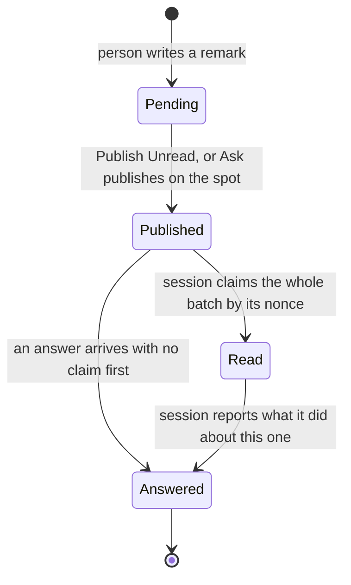

# An answer on every remark, and who is listening

Two changes that came out of one conversation. They are written together because they touch the same
two surfaces — the tool window and the skill — and because the second one matters more once the first
one ships.

## Contents

1. [What this is](#what-this-is)
2. [Part one: an answer on every remark](#part-one-an-answer-on-every-remark)
3. [What part one changes, file by file](#what-part-one-changes-file-by-file)
4. [The two decisions part one forces](#the-two-decisions-part-one-forces)
5. [What is deliberately not decided yet](#what-is-deliberately-not-decided-yet)
6. [Part two: who is listening](#part-two-who-is-listening)
7. [What part two changes, file by file](#what-part-two-changes-file-by-file)
8. [What could go wrong](#what-could-go-wrong)
9. [How this breaks into tasks](#how-this-breaks-into-tasks)
10. [Hand checks](#hand-checks)

## What this is

A spec, not a plan. It says what the two changes are, why they are worth building, and which
decisions have to be made before anybody writes code. The task breakdown at the end is a sketch of
the shape, not a checklist to execute.

Both parts rest on machinery that already exists. Neither needs a new endpoint, a new stored field,
or a migration.

## Part one: an answer on every remark

**Today a plain remark ends at `READ`.** That state says an agent read the remark. It never says what
was done about it. You publish twelve remarks, the rows turn grey, and the tool window's Done group
means "somebody looked at these" — which is not the question you had.

**After this change every remark can carry an answer**, and an answer is the terminal state for all
of them rather than only for questions. A question gets its explanation, as now. A directive gets a
short line saying what was done. Both come back on the line they were written about, through the
route that already exists.

Three things the picture is there to say:

- **The two paths into Answered are both real today.** Answering does not consume the batch and does
  not mark anything read, so an answer can arrive without a claim ever happening. That is not a hole
  to close; it is what lets a session answer one remark out of twelve without claiming the rest.
- **`READ` still earns its place.** A batch is claimed all at once, and answers come back one at a
  time as work proceeds. Losing `READ` would lose the only signal that says "the session has this"
  before any of the work is finished.
- **The state machine does not grow.** What changes is which remarks may reach Answered, not how many
  states there are.

## What part one changes, file by file

**`render/PromptRenderer.kt`, `PROMPT_NOTES`.** It currently says that a heading marked "asks for an
answer" wants an answer and that "every other remark is work to do or a topic to raise". That second
half is the sentence to replace. The new text asks for an answer to every remark: for a marked one
the explanation, for every other one a short line saying what was done, named by the `id:` printed
under its heading. The instruction not to change code for a question stays exactly as it is — that is
the one place the marker still changes behaviour rather than only tone.

**`SKILL.md`, the reading modes.** Today the shape is: summarise in two groups, answer the questions
first, then act on the rest, then say what was done in chat. The new shape ends differently — after
acting, send one answer per remark. The two-group summary stays, and its meaning improves: it stops
being a playback of your own tags and becomes the session's own reading, which is the thing you
actually want to check before any of it turns into work.

**`ui/RemarkStatusLook.kt`, the icon.** `icon()` consults `hasAnswer` only on the question track. On
the plain track it is ignored outright, so a plain remark that was answered draws
`AllIcons.General.InspectionsOK` — the same green tick as one that was merely read. Once every remark
can be answered, that is the difference the column exists to show and it is invisible. See the green
tick decision below.

**`ui/RemarksTree.kt`.** Nothing. Done is already "`READ`, or has an answer", an answer already nests
under its remark whatever that remark is, and `processedAt` already takes the later of `readAt` and
the answer's `answeredAt`.

**`review/ReviewRestService.kt` and `review/AnswerReceipt.kt`.** Nothing. `POST /answer` already
accepts an answer for a remark that was never marked as asking. That was decided on purpose and
`ReviewEndpointSmokeTest` pins it so it cannot be quietly reversed. The whole server half of part one
is done.

## The two decisions part one forces

**The green tick decision: what does the terminal icon mean?**

One line first: either the terminal icon keeps meaning "read" and answers stay invisible on the plain
track, or it comes to mean "answered" on both tracks and a read-but-unanswered remark falls back to
the middle icon.

- Keep it meaning read: nothing changes in the icon column, and the one fact the change exists to
  surface — this remark came back with something — has no picture at all. The whole point is lost at
  the last inch.
- Make it mean answered: the two tracks finally say the same thing, which is one rule instead of two.
  ⚠️ It also demotes every remark already sitting green-but-unanswered back to the neutral tick. That
  is honest, since nothing was ever reported back for those, but it is a visible change to rows a
  person already considers finished.

The property underneath is that a status column should show what the person is waiting on, not what
the machinery last recorded. Recommendation: make it mean answered. The question track already works
this way, and its KDoc already argues the case — an unanswered question stays yellow because letting
`READ` alone turn it green "would make an unanswered question look finished". That argument does not
depend on the remark being a question. It applies word for word to a plain remark, the moment a plain
remark can be answered.

**The grey row decision: does an answered remark grey out?**

`textAttributes` greys `READ` and nothing else, and an answered question is deliberately not greyed —
"from the person's side an answer arriving is work to do, not work finished". That reasoning is
right, and it collides with the new flow: a remark would go grey on being claimed, then back to
regular when its answer lands. A row un-greying looks like a bug even when it is correct.

Recommendation: grey on `READ` as now, and let the answer's arrival show in the icon and the nested
row rather than in the text colour. The nested answer is impossible to miss; a colour going backwards
is confusing in a way the answer row is not. This one is worth disagreeing with me on if the
un-greying turns out to read as "new, look at this", which is arguably what you want.

## What is deliberately not decided yet

**`asksForAnswer` stays.** It defaults to false and `BaseState` omits defaults, so it costs one
boolean in storage and one branch in the icon. Keeping it through the first release of this change
means the flag can be judged on how it is actually used rather than on a prediction. The question to
answer later is narrow: with answers coming back on everything, does marking a remark as a question
still change anything you care about? If the only surviving difference is "do not edit code for this
one", that is a sentence in the prompt and not a stored field.

**`Ctrl+Alt+Shift+A` stays, and its id stays whatever happens.** The command's real content is not
the flag, it is publish-on-the-spot: a question that waits an hour in a batch is worthless. If the
flag ever goes, the honest replacement is a timing gesture — publish this remark now — not a deletion.
⚠️ `ClaudeRemarks.AskClaude` is documented in README.md as a stable id for `.ideavimrc` mappings and
pinned by `ActionIdsTest`. IdeaVim fails on an unknown id inside IdeaVim, so removing it would break
every mapping to it with nothing in this project ever noticing. The id survives any redesign of the
command behind it.

## Part two: who is listening

**Today the IDE learns a session id only after a batch is claimed.** `PublishedBatchService` records
who acknowledged each of the last sixteen batches. Before you publish there is no signal at all: you
press Publish Unread and either a session picks it up or nothing happens, and those two look
identical from the IDE.

**After this change the tool window says whether a session is listening to this project.** That
removes two failures that have already happened here: publishing into a void when no watcher is
running, and a watcher belonging to another checkout claiming a batch that was not meant for it.

**The mechanism is a heartbeat off `fetch`,** which is the cheapest of the three shapes worth
considering:

- *Claims only.* Free — the data is already there. But it is history, not presence. It says somebody
  *was* listening, never that anybody *is*.
- *Heartbeat off `fetch`.* A streaming watcher already polls this endpoint every few seconds. The IDE
  records the poll and shows it. Liveness comes out honestly, and a session that dies simply stops
  appearing.
- *Register and unregister.* Real presence, and real cost: a lifetime to manage, stale entries when a
  session is killed, and a second endpoint under guard 5. Not worth it for what it adds over the
  heartbeat.

## What part two changes, file by file

**`watch-remarks.sh`.** Fetch mode sends a body carrying `project` and no `session`. Add the session
id to it. The script already takes `--session`; today it is only accepted beside `--claim`, so the
argument checking has to loosen by exactly that much.

**`review/ReviewRestService.kt`, `handleFetch`.** Read the session id out of the body, hand it to a
project service, and change nothing else. ⚠️ Guard 5 governs this file: no VFS, no Swing, no
`invokeAndWait`. Retrieving a project service and calling a `@Synchronized` method on it is allowed
and is what `published-read` already does. That has been reported as a threading bug twice by review
tools and was wrong both times; the KDoc should say so once, in the words guard 5 permits, so it is
not re-litigated a third time.

**A new listener service, beside `review/PublishedAck.kt`.** A project service holding session id
mapped to last-seen time, in memory only, `@Synchronized`, with a cap so a stream of invented ids
cannot grow it without bound. A listener counts as present while its last poll is inside a window of
a few multiples of the poll interval. Nothing is ever unregistered — expiry is the whole lifetime
model, which is what makes a killed session cost nothing.

⚠️ **`fetch` must stay free of consequences in the sense that matters, and this does not break that.**
Its contract is that no remark is marked read and no state a person can see moves, so a poll can be
repeated forever and a lost response costs one retry. A presence timestamp is not remark state. Say
that in the KDoc where somebody would go to "fix" it.

**`ui/RemarksToolWindowFactory.kt`.** Where the display goes is the open question. The tree has
nothing above it on purpose — that space held a banner that was removed and should not quietly come
back. Recommendation: a label in the toolbar, beside the six buttons, reading the count and naming
the sessions in its tooltip. ⚠️ Whatever it says must be scoped to this project and read as such. You
routinely have eight projects open; a bare "a session is listening" is unreadable across them, and
that ambiguity is exactly what caused the worktree mix-up this repository already has a guard for.

**Old installs send no session id.** A skill installed before this change polls without one, so the
IDE sees a poll it cannot attribute. Show it as an unnamed listener, never as nobody. Absence of a
name is not absence of a listener, and a display that conflates them would be worse than no display.

## What could go wrong

- **The prompt asks for more than a session will reliably do.** Twelve remarks means twelve answers,
  and a session that gets bored halfway leaves rows in a state that looks like it is still working.
  Worth watching in the first real use: if answers arrive for the first few and stop, the fix is in
  the prompt, not in the IDE.
- **Answer noise.** A one-line receipt on every trivial remark may be less useful than silence. This
  is the risk that argues hardest for keeping `asksForAnswer` for now: if the receipts turn out to be
  noise, the flag is already there to make them opt-in again.
- **The listener display is trusted more than it deserves.** It says a process polled recently. It
  does not say that process will act on the next batch, or that it is the session you think it is.
  The wording should promise only what it knows.
- **Two answers racing for one remark.** `recordAnswer` upserts on the remark id, so the second
  replaces the first. That is already the behaviour and already tested; with more answers in flight it
  will simply happen more often. No change, but worth knowing before it surprises somebody.

## How this breaks into tasks

Sketch, in dependency order. Part one first — part two is smaller and independent, and doing it
second means the listener display exists by the time answers are the thing being waited on.

1. The icon column: make the terminal icon mean answered on both tracks, and update
   `RemarkStatusLookTest`'s decision table with it.
2. `PROMPT_NOTES`: ask for an answer to every remark. Pure Kotlin, so the test runs in milliseconds.
3. `SKILL.md`: the new ending for both reading modes, plus the summary's changed meaning.
4. The listener service: the store, the expiry window, the cap. Pure enough to test with no fixture if
   the clock is a parameter.
5. `handleFetch`: read the session id, record the poll. Covered by `ReviewEndpointSmokeTest`.
6. `watch-remarks.sh`: send the session id in fetch mode, and loosen the argument check. Checked by
   hand, in the scratchpad, with a fake `HOME` and a port nothing listens on.
7. The toolbar display.
8. The durable docs: `CLAUDE.md`, `docs/claude/design.md`, `CHANGELOG.md`, `docs/claude/hand-checks.md`.

## Hand checks

Most of both parts is unreachable by `./gradlew test`, which runs no shell and cannot draw anything.

1. A batch of several remarks, mixed questions and directives, answered one at a time — the rows
   reach Done as each answer lands, not all at once.
2. The icon column read at gutter size, in a light theme and in a dark one: answered, read, published
   and pending have to be four distinguishable things on both tracks.
3. A remark answered while its row is selected and its file open — the tree keeps the selection and
   the gutter picks up the balloon.
4. The listener label with no session listening, with one, and with two on the same project.
5. The listener label while a second project is open with its own session, to confirm the two do not
   bleed into each other.
6. A watcher killed outright: the label has to go quiet by itself within the expiry window, with
   nothing unregistering it.
7. An old installed skill polling without a session id: an unnamed listener, never "nobody".
